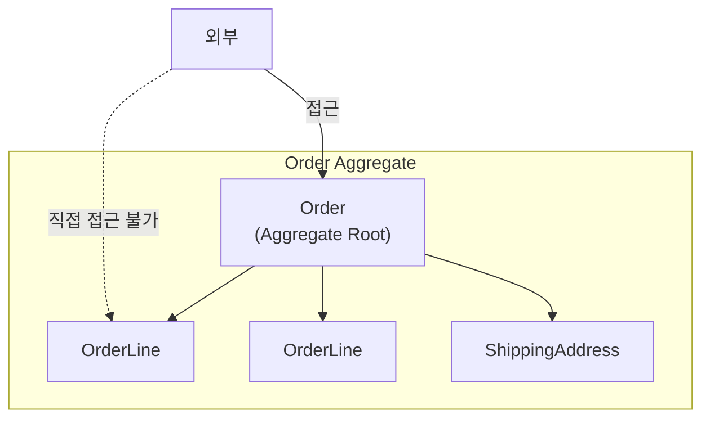
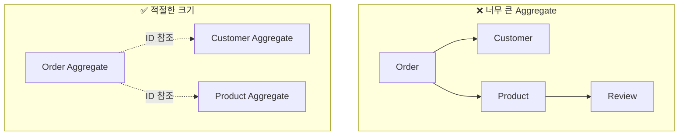
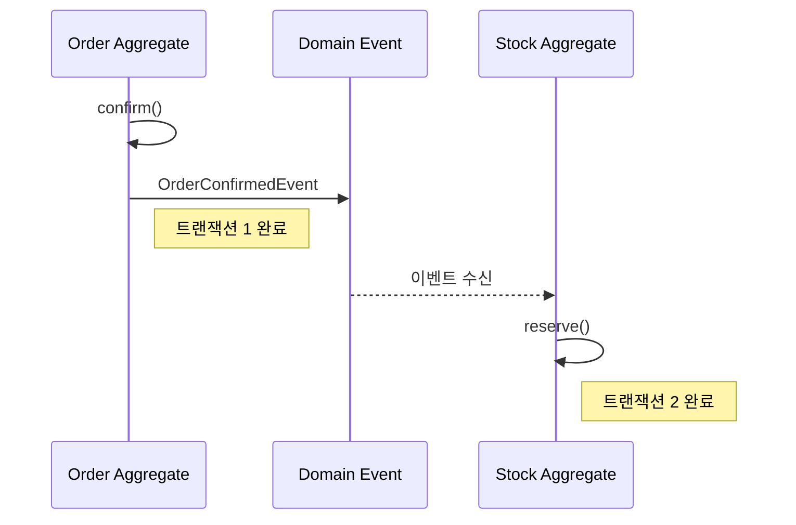
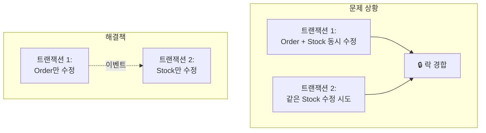

# Aggregate 심화

Aggregate의 설계 원칙, 트랜잭션 경계, 실전 패턴을 깊이 있게 다룹니다.

> **이 페이지 예제의 공통 import:**
> ```java
> import java.util.List;
> import java.util.ArrayList;
> import java.util.Collections;
> import java.time.LocalDateTime;
> ```

## 왜 Aggregate가 필요한가?

객체 지향 설계에서 가장 어려운 질문 중 하나는 **"어디까지 하나의 단위로 묶을 것인가?"**입니다.

**Aggregate 없이 설계하면 생기는 문제:**

```java
// 문제 1: 어디서든 내부 객체 직접 수정 가능
OrderLine line = orderLineRepository.findById(lineId);
line.setQuantity(100);  // 주문 총액 업데이트 안 됨! 불일치 발생

// 문제 2: 트랜잭션 범위가 불명확
@Transactional
public void processOrder(OrderId orderId) {
    // Order, OrderLine, Customer, Product, Stock, Payment...
    // 전부 한 트랜잭션? 어디까지?
}

// 문제 3: 동시성 제어 불가능
// 사용자 A: order.addLine(...)
// 사용자 B: order.removeLine(...)
// 누가 이기는가? 어떤 락을 잡아야 하는가?
```

**Aggregate가 해결하는 것:**
- **일관성 경계**: 이 범위 안에서는 항상 일관된 상태 보장
- **트랜잭션 경계**: 하나의 Aggregate = 하나의 트랜잭션
- **동시성 경계**: 같은 Aggregate에 대한 동시 수정은 충돌로 처리

## Aggregate란?

**Aggregate**는 데이터 변경의 단위로 취급되는 연관된 객체들의 묶음입니다.



### 핵심 구성요소

| 요소 | 역할 | 예시 |
|------|------|------|
| **Aggregate Root** | 외부와의 유일한 접점, 일관성 보장 | Order |
| **내부 Entity** | Root를 통해서만 접근 | OrderLine |
| **Value Object** | 불변 속성 값 | ShippingAddress, Money |

## 설계 원칙

### 원칙 1: 진정한 불변식(Invariant)을 보호하라

**불변식**이란 항상 참이어야 하는 비즈니스 규칙입니다.

```java
public class Order {
    private List<OrderLine> orderLines;
    private Money totalAmount;
    private OrderStatus status;

    // 불변식: 주문 항목이 비어있으면 안 됨
    public void removeOrderLine(OrderLineId lineId) {
        if (orderLines.size() <= 1) {
            throw new BusinessRuleViolationException(
                "주문에는 최소 1개의 항목이 있어야 합니다"
            );
        }
        orderLines.removeIf(line -> line.getId().equals(lineId));
        recalculateTotal();  // 불변식: 총액은 항상 최신
    }

    // 불변식: 총액은 주문 항목 합계와 일치
    private void recalculateTotal() {
        this.totalAmount = orderLines.stream()
            .map(OrderLine::getAmount)
            .reduce(Money.ZERO, Money::add);
    }
}
```

### 원칙 2: 작은 Aggregate를 설계하라



**작게 유지해야 하는 이유:**
- 트랜잭션 범위 축소 → 동시성 충돌 감소
- 메모리 사용량 감소
- 변경 영향 범위 최소화

### "작다"의 실질적 기준

"작게 설계하라"는 원칙은 모호합니다. 실제로 어떻게 판단해야 할까요?

**포함시킬지 판단하는 질문들:**

```
Q1. "이 객체 없이 Root가 유효한 상태인가?"
    - No → 포함 (OrderLine 없는 Order는 무의미)
    - Yes → 분리 고려 (Customer 없이도 Order 존재 가능)

Q2. "이 객체가 독립적으로 생성/수정되는가?"
    - Yes → 분리 (Product는 Order와 독립적으로 관리)
    - No → 포함 (OrderLine은 Order 없이 의미 없음)

Q3. "이 객체를 다른 곳에서도 참조하는가?"
    - Yes → 분리 (Product는 여러 Order에서 참조)
    - No → 포함 (OrderLine은 이 Order에서만 의미)

Q4. "이 객체가 자주 변경되는가?"
    - 자주 변경 → 분리 (Stock은 주문마다 변경됨)
    - Root와 함께만 변경 → 포함 (ShippingAddress는 Order와 함께)
```

**실제 예시: 주문 시스템**

```
Order Aggregate에 포함:
├── OrderLine (Order 없이 의미 없음, 함께 생성됨)
├── ShippingAddress (Order의 속성, 독립 변경 없음)
└── OrderStatus (Order의 상태)

별도 Aggregate로 분리:
├── Customer (독립 생성/수정, 여러 Order에서 참조)
├── Product (독립 관리, 카탈로그에서도 사용)
└── Stock (자주 변경, 여러 Order가 동시 접근)
```

**적정 크기의 감각:**
- 내부 Entity가 3-5개를 넘으면 분리를 고려
- 한 번에 로드하는 데이터가 수십 KB를 넘으면 의심
- 동시 수정 충돌이 자주 발생하면 분리 신호

### 실제 사례: Aggregate 경계 재설계

**상황:** 이커머스 시스템에서 Order Aggregate가 너무 커서 문제 발생

```
초기 설계 (문제):
Order Aggregate
├── OrderLines (최대 100개)
├── PaymentInfo
├── ShippingInfo
├── OrderHistory (모든 상태 변경 기록)
└── CustomerSnapshot

문제:
1. Order 로드 시 평균 50KB, 최대 500KB
2. 주문 조회만 해도 전체 로드 → 느림
3. 상태 변경마다 전체 저장 → 락 경합
4. OrderHistory가 계속 증가 → 메모리 이슈
```

**해결: 경계 재설계**

```
재설계 후:
Order Aggregate (핵심만)
├── OrderLines
├── OrderStatus
└── ShippingAddressSnapshot

별도 Aggregate로 분리:
├── Payment Aggregate (결제 정보)
├── Shipment Aggregate (배송 추적)
└── OrderAuditLog (이력은 별도 저장)

결과:
1. Order 로드 시간: 50ms → 5ms
2. 동시성 충돌: 주당 100건 → 2건
3. 코드 복잡도: 감소 (각 Aggregate가 단일 책임)
```

**교훈:**

> Vaughn Vernon의 조언: "가능한 한 작은 Aggregate로 시작하고,
> 실제로 트랜잭션 일관성이 필요한 경우에만 확장하라."

### 성능 측정: 언제 분리를 고려해야 하나?

다음 지표를 정기적으로 측정하세요:

| 지표 | 건강한 수준 | 경고 수준 | 위험 수준 |
|------|-----------|----------|----------|
| 평균 로드 시간 | < 10ms | 10-50ms | > 50ms |
| 평균 Aggregate 크기 | < 10KB | 10-50KB | > 50KB |
| 낙관적 락 충돌률 | < 1% | 1-5% | > 5% |
| 트랜잭션 평균 시간 | < 50ms | 50-200ms | > 200ms |

```java
// 측정 코드 예시
@Around("execution(* *Repository.save(..))")
public Object measureSaveTime(ProceedingJoinPoint pjp) throws Throwable {
    long start = System.currentTimeMillis();
    try {
        return pjp.proceed();
    } finally {
        long duration = System.currentTimeMillis() - start;
        if (duration > 50) {
            log.warn("Slow aggregate save: {}ms, type={}",
                duration, pjp.getArgs()[0].getClass().getSimpleName());
        }
        metrics.recordSaveTime(pjp.getSignature().getName(), duration);
    }
}
```

### 원칙 3: 다른 Aggregate는 ID로만 참조하라

```java
// ❌ 객체 직접 참조
public class Order {
    private Customer customer;  // Customer Aggregate 직접 참조
    private List<Product> products;  // Product Aggregate 직접 참조
}

// ✅ ID로 참조
public class Order {
    private CustomerId customerId;  // ID만 보관
    private List<OrderLine> orderLines;  // OrderLine 내부에 ProductId
}

public record OrderLine(
    OrderLineId id,
    ProductId productId,  // ID로 참조
    String productName,   // 필요한 정보는 복사
    Money price,
    int quantity
) {}
```

### 원칙 4: 경계 밖은 결과적 일관성(Eventual Consistency)



```java
// Order Aggregate
public class Order {
    public void confirm() {
        this.status = OrderStatus.CONFIRMED;
        // 이벤트만 발행, 재고는 별도 트랜잭션
        registerEvent(new OrderConfirmedEvent(this.id, this.orderLines));
    }
}

// Stock Aggregate (별도 트랜잭션)
@Component
public class StockEventHandler {

    private final StockRepository stockRepository;

    // 주의: @EventListener는 같은 트랜잭션에서 동기 실행됨
    // 별도 트랜잭션이 필요하면 아래와 같이 설정
    @TransactionalEventListener(phase = TransactionPhase.AFTER_COMMIT)
    @Transactional(propagation = Propagation.REQUIRES_NEW)
    public void handle(OrderConfirmedEvent event) {
        for (OrderLineInfo line : event.getOrderLines()) {
            Stock stock = stockRepository.findByProductId(line.getProductId());
            stock.reserve(line.getQuantity());
            stockRepository.save(stock);
        }
    }
}
```

## 트랜잭션 경계

### 하나의 트랜잭션 = 하나의 Aggregate

```java
// ✅ 올바른 패턴: 하나의 Aggregate만 수정
@Transactional
public void confirmOrder(OrderId orderId) {
    Order order = orderRepository.findById(orderId)
        .orElseThrow(() -> new OrderNotFoundException(orderId));

    order.confirm();  // Order Aggregate만 수정

    orderRepository.save(order);
    // 이벤트로 다른 Aggregate 변경 유도
}

// ❌ 잘못된 패턴: 여러 Aggregate 동시 수정
@Transactional
public void confirmOrder(OrderId orderId) {
    Order order = orderRepository.findById(orderId).orElseThrow();
    order.confirm();

    // 같은 트랜잭션에서 다른 Aggregate 수정 - 피해야 함
    for (OrderLine line : order.getOrderLines()) {
        Stock stock = stockRepository.findByProductId(line.getProductId());
        stock.reserve(line.getQuantity());  // Stock Aggregate 수정
    }
}
```

### 왜 분리해야 하나?



---

## 실무에서 흔한 실수

### 실수 1: 모든 연관 객체를 하나의 Aggregate에

```java
// ❌ 너무 큰 Aggregate
public class Order {
    private Customer customer;        // 별도 Aggregate여야 함
    private List<Product> products;   // 별도 Aggregate여야 함
    private Payment payment;          // 별도 Aggregate여야 함
    private Delivery delivery;        // 별도 Aggregate여야 함
}

// 문제점:
// 1. Customer 정보 수정할 때마다 Order를 로드해야 함
// 2. 재고 확인하려면 모든 Order를 뒤져야 함
// 3. 동시 주문 시 불필요한 충돌 발생
```

**해결:** ID 참조로 분리하고, 필요한 정보만 복사해서 보관

```java
// ✅ 적절한 크기
public class Order {
    private CustomerId customerId;
    private String customerName;  // 표시용 복사본
    private List<OrderLine> orderLines;  // OrderLine만 포함
}
```

### 실수 2: Repository를 Aggregate 내부에서 호출

```java
// ❌ Aggregate에서 Repository 직접 호출
public class Order {
    @Autowired  // 절대 안 됨!
    private ProductRepository productRepository;

    public void addItem(ProductId productId, int quantity) {
        Product product = productRepository.findById(productId);  // 안티패턴!
        this.orderLines.add(new OrderLine(product, quantity));
    }
}
```

**문제점:**
- Aggregate가 인프라스트럭처에 의존
- 테스트하기 어려움
- 트랜잭션 범위가 불명확해짐

**해결:** 필요한 정보는 서비스 레이어에서 조회 후 전달

```java
// ✅ 서비스에서 조회 후 전달
@Service
public class OrderService {
    public void addItem(OrderId orderId, ProductId productId, int quantity) {
        Order order = orderRepository.findById(orderId);
        ProductInfo productInfo = productService.getProductInfo(productId);

        order.addItem(productInfo, quantity);  // 필요한 정보만 전달

        orderRepository.save(order);
    }
}
```

### 실수 3: Aggregate Root를 무시하고 내부 Entity 직접 수정

```java
// ❌ 내부 Entity 직접 조회/수정
OrderLine line = orderLineRepository.findById(lineId);
line.setQuantity(10);  // Order의 totalAmount는 업데이트 안 됨!
orderLineRepository.save(line);
```

**해결:** 항상 Root를 통해 수정

```java
// ✅ Root를 통한 수정
Order order = orderRepository.findById(orderId);
order.changeLineQuantity(lineId, 10);  // 내부에서 총액도 재계산
orderRepository.save(order);
```

### 실수 4: 여러 Aggregate를 한 트랜잭션에서 수정

```java
// ❌ 한 트랜잭션에서 여러 Aggregate 수정
@Transactional
public void processOrder(OrderId orderId) {
    Order order = orderRepository.findById(orderId);
    order.confirm();

    Stock stock = stockRepository.findByProductId(productId);
    stock.decrease(quantity);  // 다른 Aggregate 수정!

    Customer customer = customerRepository.findById(customerId);
    customer.addPoints(points);  // 또 다른 Aggregate 수정!
}
// 문제: 락 범위가 넓어지고, 동시성 이슈 발생
```

**해결:** 이벤트로 분리

```java
// ✅ 각각 별도 트랜잭션
@Transactional
public void confirmOrder(OrderId orderId) {
    Order order = orderRepository.findById(orderId);
    order.confirm();  // OrderConfirmedEvent 발행
    orderRepository.save(order);
}

@TransactionalEventListener(phase = TransactionPhase.AFTER_COMMIT)
@Transactional(propagation = Propagation.REQUIRES_NEW)
public void onOrderConfirmed(OrderConfirmedEvent event) {
    Stock stock = stockRepository.findByProductId(event.getProductId());
    stock.decrease(event.getQuantity());
    stockRepository.save(stock);
}
```

---

---

## 레거시 시스템에 Aggregate 도입하기

기존 시스템에 DDD를 도입할 때는 점진적 접근이 필수입니다.

### 단계별 마이그레이션 로드맵

```
Phase 1: 분석 (1-2주)
├── 기존 도메인 모델 파악
├── 트랜잭션 경계 분석
├── 가장 문제가 심한 영역 식별
└── 목표 Aggregate 설계 초안

Phase 2: 격리 (2-4주)
├── 대상 영역을 별도 패키지로 격리
├── 기존 코드는 유지, 새 코드 병행
├── Anti-Corruption Layer 구축
└── 점진적 트래픽 전환

Phase 3: 리팩토링 (4-8주)
├── Aggregate Root 도입
├── Repository 패턴 적용
├── 도메인 이벤트 발행 추가
└── 기존 코드 제거

Phase 4: 안정화 (2-4주)
├── 성능 모니터링
├── 경계 조정
└── 문서화
```

### Anti-Corruption Layer 패턴

레거시 코드와 새 Aggregate 사이에 변환 계층을 둡니다:

```java
// Anti-Corruption Layer
@Service
public class OrderAntiCorruptionLayer {

    private final LegacyOrderDao legacyDao;  // 기존 시스템
    private final OrderRepository newRepo;   // 새 Aggregate

    // 레거시 → 새 모델
    public Order findOrder(String legacyOrderId) {
        LegacyOrderEntity legacy = legacyDao.findById(legacyOrderId);
        return translateToAggregate(legacy);
    }

    // 새 모델 → 레거시 (역방향 호환)
    public void saveOrder(Order order) {
        newRepo.save(order);
        // 레거시 시스템도 업데이트 (전환 기간 동안)
        legacyDao.update(translateToLegacy(order));
    }

    private Order translateToAggregate(LegacyOrderEntity legacy) {
        return Order.reconstitute(
            new OrderId(legacy.getOrderNumber()),
            translateOrderLines(legacy.getItems()),
            // ... 변환 로직
        );
    }
}
```

### 도입 시 주의사항

**하지 말아야 할 것:**
- ❌ 전체 시스템을 한 번에 리팩토링
- ❌ 완벽한 설계를 추구하며 분석만 계속하기
- ❌ 레거시 코드 무시하고 새로 작성
- ❌ 비즈니스 요구사항 무시하고 기술적 리팩토링만

**해야 할 것:**
- ✅ 가장 고통스러운 부분부터 시작
- ✅ 작은 성공을 빠르게 보여주기
- ✅ 레거시와 공존하면서 점진적 전환
- ✅ 비즈니스 가치와 연결하여 정당화

---

## DDD 커뮤니티 가이드라인

### Eric Evans (DDD 창시자)의 조언

> "Aggregate 경계를 찾는 것은 가장 어려운 설계 결정 중 하나입니다.
> 처음에는 잘못될 수 있고, 그래도 괜찮습니다.
> 중요한 것은 경계를 명시적으로 만들고, 필요할 때 수정할 준비를 하는 것입니다."

### Vaughn Vernon의 실용적 규칙

1. **작게 시작하라**: 의심스러우면 분리하라
2. **Root만 참조하라**: 내부 Entity를 외부에 노출하지 마라
3. **ID로 참조하라**: 다른 Aggregate는 ID로만 참조
4. **결과적 일관성을 수용하라**: 즉각적 일관성은 대부분 불필요

### 일반적인 의사결정 트리

```
이 Entity를 Aggregate에 포함시켜야 하는가?

1. 이 Entity가 Root 없이 존재할 수 있는가?
   └── Yes → 별도 Aggregate 고려
   └── No → 다음 질문으로

2. 이 Entity를 다른 곳에서 직접 참조하는가?
   └── Yes → 별도 Aggregate (ID 참조로 변경)
   └── No → 다음 질문으로

3. 이 Entity가 Root와 항상 함께 변경되는가?
   └── Yes → 포함
   └── No → 별도 Aggregate + 이벤트로 동기화

4. 포함했을 때 트랜잭션이 너무 커지는가?
   └── Yes → 분리 후 결과적 일관성 적용
   └── No → 포함
```

---

## 요약

| 개념 | 설명 |
|------|------|
| **Aggregate** | 하나의 단위로 취급되는 객체 묶음 |
| **Aggregate Root** | 일관성을 보장하는 단일 진입점 |
| **작게 설계** | 트랜잭션 범위와 충돌 감소 |
| **ID 참조** | 다른 Aggregate는 ID로만 참조 |
| **결과적 일관성** | Aggregate 간 변경은 이벤트 사용 |
| **점진적 도입** | 레거시 시스템에서는 ACL 패턴 활용 |

## 다음 단계

- [Aggregate 실전 패턴](../aggregate-patterns/) - 구현 패턴, 안티패턴, 의사결정 가이드
- [도메인 이벤트](../domain-events/) - 이벤트 기반 통합
