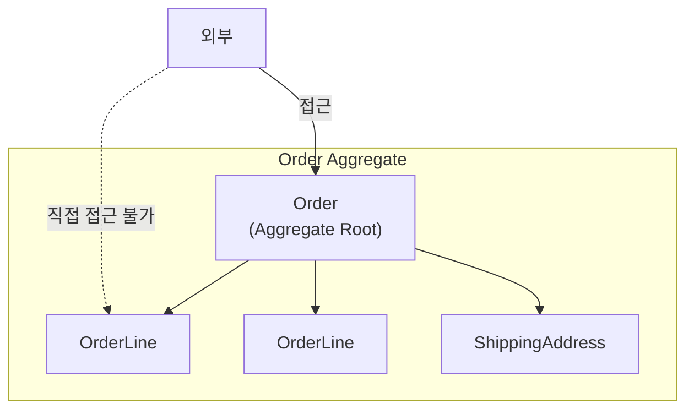
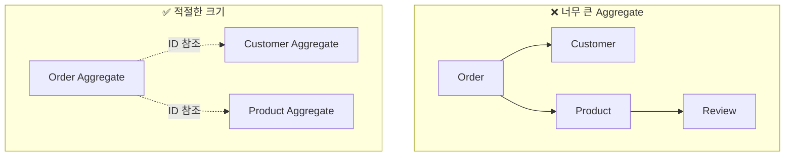
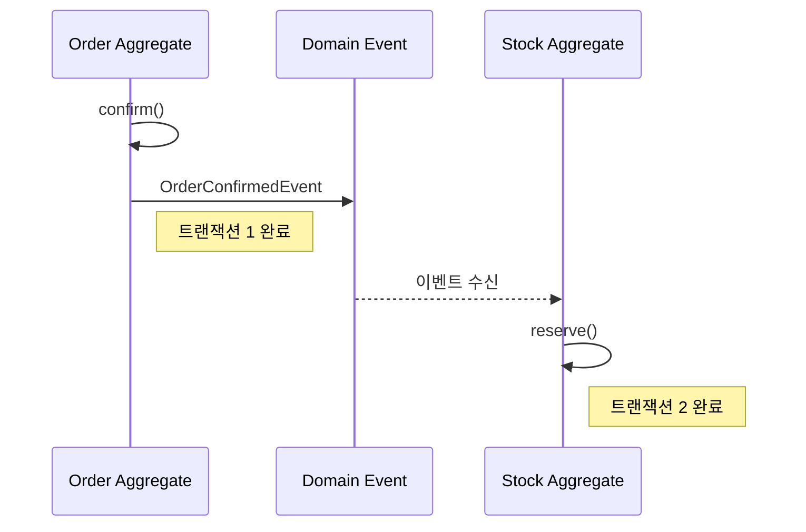
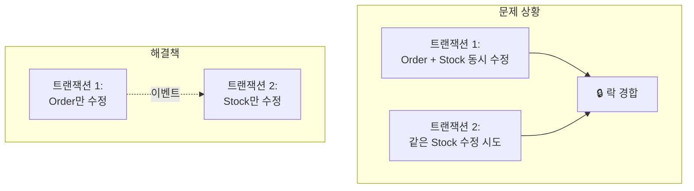

# Aggregate 심화

Aggregate의 설계 원칙, 트랜잭션 경계, 실전 패턴을 깊이 있게 다룹니다.

> **이 페이지 예제의 공통 import:**
> ```java
> import java.util.List;
> import java.util.ArrayList;
> import java.util.Collections;
> import java.time.LocalDateTime;
> ```

## Aggregate란?

**Aggregate**는 데이터 변경의 단위로 취급되는 연관된 객체들의 묶음입니다.



### 핵심 구성요소

| 요소 | 역할 | 예시 |
|------|------|------|
| **Aggregate Root** | 외부와의 유일한 접점, 일관성 보장 | Order |
| **내부 Entity** | Root를 통해서만 접근 | OrderLine |
| **Value Object** | 불변 속성 값 | ShippingAddress, Money |

## 설계 원칙

### 원칙 1: 진정한 불변식(Invariant)을 보호하라

**불변식**이란 항상 참이어야 하는 비즈니스 규칙입니다.

```java
public class Order {
    private List<OrderLine> orderLines;
    private Money totalAmount;
    private OrderStatus status;

    // 불변식: 주문 항목이 비어있으면 안 됨
    public void removeOrderLine(OrderLineId lineId) {
        if (orderLines.size() <= 1) {
            throw new BusinessRuleViolationException(
                "주문에는 최소 1개의 항목이 있어야 합니다"
            );
        }
        orderLines.removeIf(line -> line.getId().equals(lineId));
        recalculateTotal();  // 불변식: 총액은 항상 최신
    }

    // 불변식: 총액은 주문 항목 합계와 일치
    private void recalculateTotal() {
        this.totalAmount = orderLines.stream()
            .map(OrderLine::getAmount)
            .reduce(Money.ZERO, Money::add);
    }
}
```

### 원칙 2: 작은 Aggregate를 설계하라



**작게 유지해야 하는 이유:**
- 트랜잭션 범위 축소 → 동시성 충돌 감소
- 메모리 사용량 감소
- 변경 영향 범위 최소화

### 원칙 3: 다른 Aggregate는 ID로만 참조하라

```java
// ❌ 객체 직접 참조
public class Order {
    private Customer customer;  // Customer Aggregate 직접 참조
    private List<Product> products;  // Product Aggregate 직접 참조
}

// ✅ ID로 참조
public class Order {
    private CustomerId customerId;  // ID만 보관
    private List<OrderLine> orderLines;  // OrderLine 내부에 ProductId
}

public record OrderLine(
    OrderLineId id,
    ProductId productId,  // ID로 참조
    String productName,   // 필요한 정보는 복사
    Money price,
    int quantity
) {}
```

### 원칙 4: 경계 밖은 결과적 일관성(Eventual Consistency)



```java
// Order Aggregate
public class Order {
    public void confirm() {
        this.status = OrderStatus.CONFIRMED;
        // 이벤트만 발행, 재고는 별도 트랜잭션
        registerEvent(new OrderConfirmedEvent(this.id, this.orderLines));
    }
}

// Stock Aggregate (별도 트랜잭션)
@Component
public class StockEventHandler {

    private final StockRepository stockRepository;

    // 주의: @EventListener는 같은 트랜잭션에서 동기 실행됨
    // 별도 트랜잭션이 필요하면 아래와 같이 설정
    @TransactionalEventListener(phase = TransactionPhase.AFTER_COMMIT)
    @Transactional(propagation = Propagation.REQUIRES_NEW)
    public void handle(OrderConfirmedEvent event) {
        for (OrderLineInfo line : event.getOrderLines()) {
            Stock stock = stockRepository.findByProductId(line.getProductId());
            stock.reserve(line.getQuantity());
            stockRepository.save(stock);
        }
    }
}
```

## 트랜잭션 경계

### 하나의 트랜잭션 = 하나의 Aggregate

```java
// ✅ 올바른 패턴: 하나의 Aggregate만 수정
@Transactional
public void confirmOrder(OrderId orderId) {
    Order order = orderRepository.findById(orderId)
        .orElseThrow(() -> new OrderNotFoundException(orderId));

    order.confirm();  // Order Aggregate만 수정

    orderRepository.save(order);
    // 이벤트로 다른 Aggregate 변경 유도
}

// ❌ 잘못된 패턴: 여러 Aggregate 동시 수정
@Transactional
public void confirmOrder(OrderId orderId) {
    Order order = orderRepository.findById(orderId).orElseThrow();
    order.confirm();

    // 같은 트랜잭션에서 다른 Aggregate 수정 - 피해야 함
    for (OrderLine line : order.getOrderLines()) {
        Stock stock = stockRepository.findByProductId(line.getProductId());
        stock.reserve(line.getQuantity());  // Stock Aggregate 수정
    }
}
```

### 왜 분리해야 하나?



## 요약

| 개념 | 설명 |
|------|------|
| **Aggregate** | 하나의 단위로 취급되는 객체 묶음 |
| **Aggregate Root** | 일관성을 보장하는 단일 진입점 |
| **작게 설계** | 트랜잭션 범위와 충돌 감소 |
| **ID 참조** | 다른 Aggregate는 ID로만 참조 |
| **결과적 일관성** | Aggregate 간 변경은 이벤트 사용 |

## 다음 단계

- [Aggregate 실전 패턴](../aggregate-patterns/) - 구현 패턴, 안티패턴, 의사결정 가이드
- [도메인 이벤트](../domain-events/) - 이벤트 기반 통합
