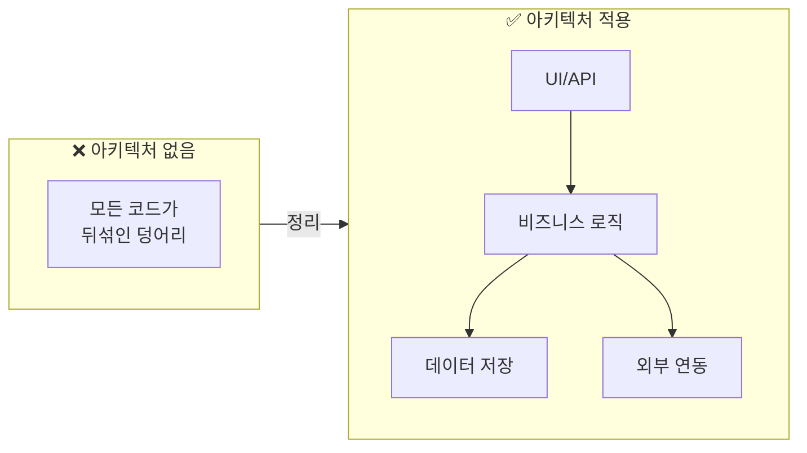
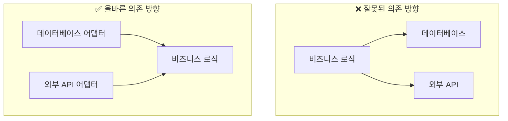
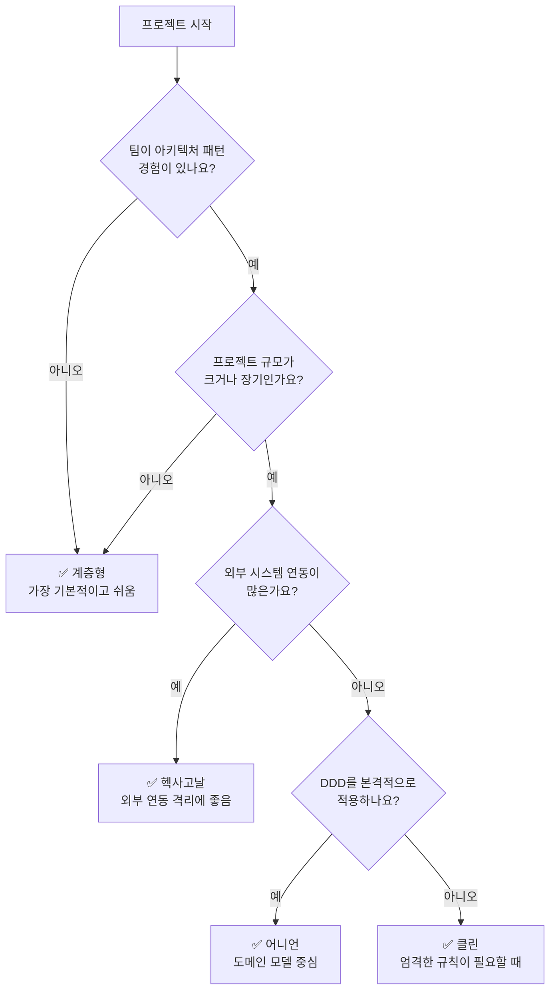
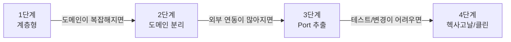

# 아키텍처 패턴

DDD를 효과적으로 구현하기 위한 아키텍처 패턴들을 살펴봅니다.

## 아키텍처 패턴이 왜 필요한가?

### 스파게티 코드의 문제

처음 프로젝트를 시작할 때는 모든 코드가 한 곳에 있어도 괜찮습니다. 하지만 프로젝트가 커지면 어떻게 될까요?

```java
// ❌ 실제 프로젝트에서 자주 보는 문제
@RestController
public class OrderController {

    @Autowired
    private JdbcTemplate jdbcTemplate;

    @PostMapping("/orders")
    public String createOrder(@RequestBody Map<String, Object> request) {
        // 1. 입력 검증 (Controller에서?)
        String customerId = (String) request.get("customerId");
        if (customerId == null) {
            return "고객 ID 필요";
        }

        // 2. 비즈니스 로직 (Controller에서?)
        double total = 0;
        List<Map> items = (List<Map>) request.get("items");
        for (Map item : items) {
            total += (Double) item.get("price") * (Integer) item.get("quantity");
        }

        // 3. 할인 계산 (여기서도?)
        if (total > 100000) {
            total = total * 0.9;
        }

        // 4. 데이터베이스 직접 접근 (Controller에서!)
        jdbcTemplate.update(
            "INSERT INTO orders (customer_id, total) VALUES (?, ?)",
            customerId, total
        );

        // 5. 외부 API 호출까지...
        restTemplate.postForObject("http://payment-service/pay", ...);

        return "주문 완료";
    }
}
```

이 코드의 문제점:

| 문제 | 결과 |
|------|------|
| **모든 것이 뒤섞임** | 어디서 뭘 하는지 찾기 어려움 |
| **테스트 불가능** | DB, 외부 API 없이 테스트할 수 없음 |
| **변경이 위험** | 한 곳 수정 → 다른 곳에서 버그 |
| **재사용 불가** | 다른 곳에서 같은 로직 필요하면 복사/붙여넣기 |
| **협업 어려움** | 여러 사람이 동시에 수정하면 충돌 |

### 아키텍처의 목적



**아키텍처 패턴을 사용하면:**

1. **관심사 분리** - 각 부분이 한 가지 역할만 담당
2. **테스트 용이** - 비즈니스 로직만 따로 테스트 가능
3. **변경 용이** - 데이터베이스 바꿔도 비즈니스 로직은 그대로
4. **협업 가능** - 팀원들이 각자 다른 부분 담당 가능

### 핵심 원칙: 의존성 방향

모든 아키텍처 패턴의 공통 원칙이 있습니다:

```
💡 비즈니스 로직(도메인)은 어떤 것에도 의존하지 않는다
```



**왜 이렇게 해야 할까요?**

- 비즈니스 로직은 가장 중요하고 자주 바뀌지 않음
- 데이터베이스나 외부 API는 바뀔 수 있음 (MySQL → PostgreSQL, REST → gRPC)
- 중요한 것이 덜 중요한 것에 의존하면, 덜 중요한 것이 바뀔 때 중요한 것도 바꿔야 함

---

## 아키텍처 패턴 한눈에 보기

### 4가지 주요 패턴

```mermaid
flowchart TB
    subgraph Layered["계층형 (Layered)"]
        L1["Presentation"]
        L2["Application"]
        L3["Domain"]
        L4["Infrastructure"]
        L1 --> L2 --> L3 --> L4
    end

    subgraph Hex["헥사고날 (Hexagonal)"]
        H1["Adapter"]
        H2["Port"]
        H3["Core"]
        H1 --> H2 --> H3
    end

    subgraph Clean["클린 (Clean)"]
        C1["Framework"]
        C2["Adapter"]
        C3["Use Case"]
        C4["Entity"]
        C1 --> C2 --> C3 --> C4
    end

    subgraph Onion["어니언 (Onion)"]
        O1["Infrastructure"]
        O2["Application"]
        O3["Domain Service"]
        O4["Domain Model"]
        O1 --> O2 --> O3 --> O4
    end
```



### 패턴별 특징 비교

| 패턴 | 핵심 개념 | 난이도 | 적합한 상황 |
|------|----------|--------|------------|
| **[계층형](./layered-architecture/)** | 위에서 아래로 흐르는 4계층 | ⭐ 쉬움 | 처음 시작, 단순한 프로젝트 |
| **[헥사고날](./hexagonal-architecture/)** | Port와 Adapter로 외부 격리 | ⭐⭐ 보통 | 외부 연동 많은 프로젝트 |
| **[클린](./clean-architecture/)** | 엄격한 의존성 규칙 | ⭐⭐⭐ 어려움 | 대규모, 장기 프로젝트 |
| **[어니언](./onion-architecture/)** | 도메인 모델 중심 | ⭐⭐ 보통 | DDD 적용 프로젝트 |

### 어떤 패턴을 선택해야 할까?



### 실용적 조언


**💡 처음이라면 계층형부터 시작하세요**

완벽한 아키텍처보다 **동작하는 코드**가 먼저입니다. 계층형으로 시작해서 필요할 때 점진적으로 발전시키는 것이 현실적입니다.


| 상황 | 권장 패턴 | 이유 |
|------|----------|------|
| 스타트업, MVP | 계층형 | 빠른 개발이 우선 |
| 복잡한 비즈니스 로직 | 헥사고날 or 어니언 | 도메인 보호 필요 |
| 마이크로서비스 | 헥사고날 | 서비스 경계와 잘 맞음 |
| 대규모 팀 | 클린 | 명확한 규칙으로 협업 |
| 레거시 통합 | 헥사고날 | ACL로 레거시 격리 |

---

## 점진적 발전 경로

처음부터 복잡한 아키텍처를 적용할 필요 없습니다:



**1단계 → 2단계로 가는 신호:**
- "이 로직이 Controller에 있어도 되나?" 의문이 생길 때
- 같은 로직을 여러 Controller에서 복사할 때

**2단계 → 3단계로 가는 신호:**
- "데이터베이스 바꾸면 도메인도 수정해야 하네" 할 때
- 테스트 작성이 어려울 때 (외부 의존성 때문에)

**3단계 → 4단계로 가는 신호:**
- 팀이 커져서 명확한 규칙이 필요할 때
- 장기 유지보수를 위한 투자가 필요할 때

---

## 상세 가이드

각 아키텍처 패턴의 상세 내용은 아래 페이지에서 확인하세요:

1. **[계층형 아키텍처 (Layered)](./layered-architecture/)** - 가장 기본적인 4계층 구조
2. **[헥사고날 아키텍처 (Hexagonal)](./hexagonal-architecture/)** - Port와 Adapter로 외부 격리
3. **[클린 아키텍처 (Clean)](./clean-architecture/)** - 엄격한 의존성 규칙의 동심원
4. **[어니언 아키텍처 (Onion)](./onion-architecture/)** - 도메인 모델 중심의 양파 구조

---

## 다음 단계

- [CQRS](../cqrs/) - 읽기와 쓰기를 분리하는 패턴
- [이벤트 소싱](../event-sourcing/) - 상태 대신 이벤트를 저장
- [안티패턴](../anti-patterns/) - 피해야 할 흔한 실수들
