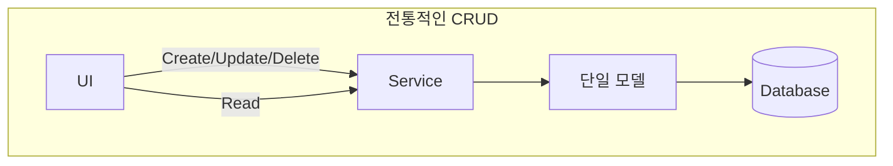
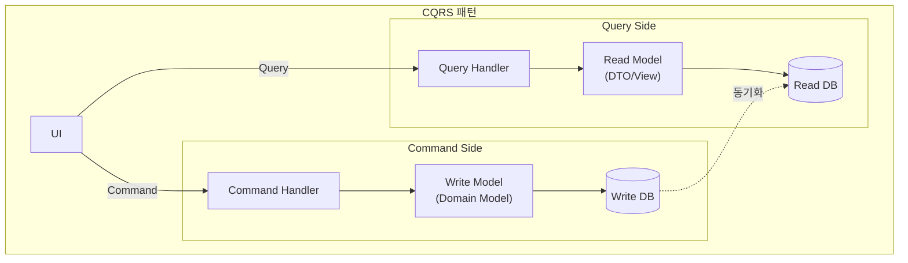
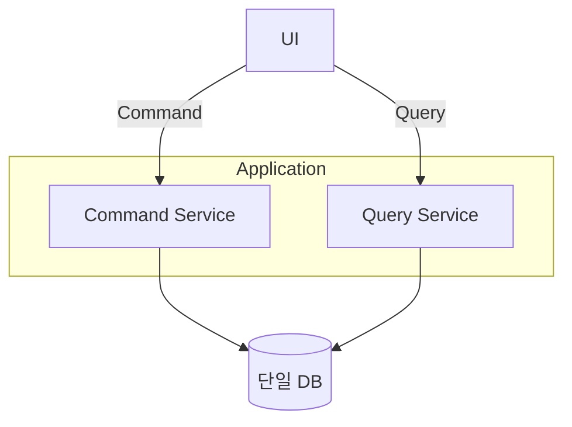
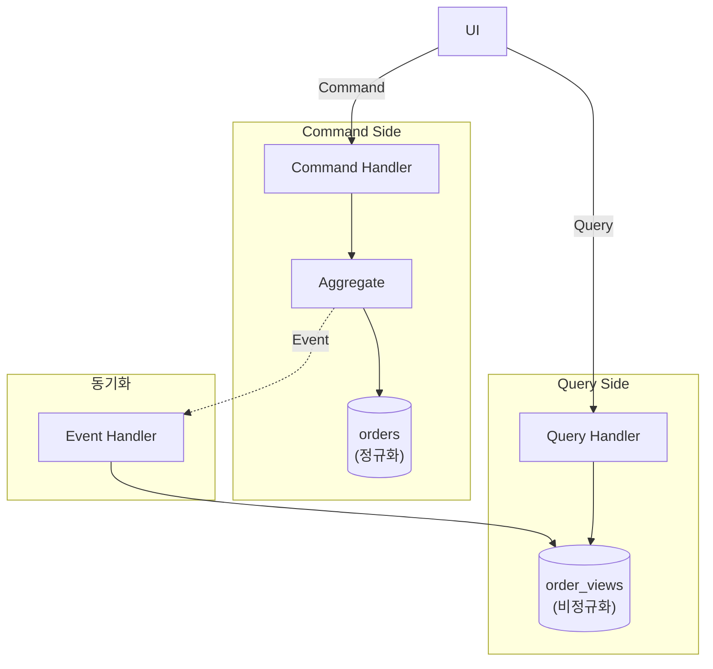
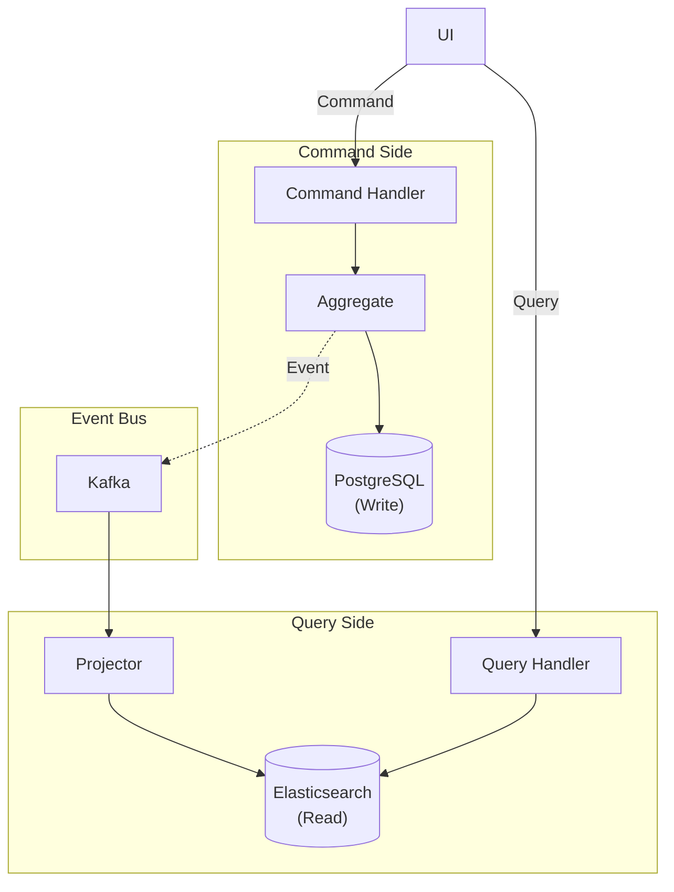
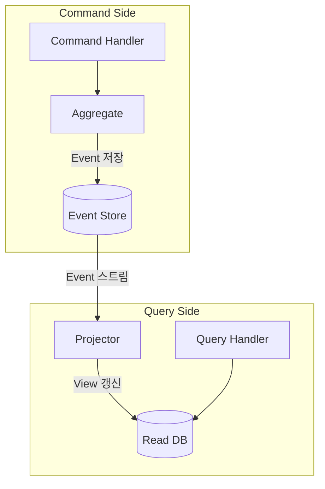

명령(쓰기)과 조회(읽기)의 책임을 분리하는 패턴을 살펴봅니다. CQRS는 Command Query Responsibility Segregation의 약자로, 시스템의 읽기와 쓰기 작업을 별도의 모델로 분리하여 각각을 최적화할 수 있게 해줍니다. 복잡한 도메인 로직과 다양한 조회 요구사항을 효과적으로 처리할 수 있는 강력한 아키텍처 패턴입니다.

#### 왜 CQRS인가?

전통적인 CRUD 방식의 한계를 이해하면 CQRS가 왜 필요한지 알 수 있습니다. 기존 방식에서는 하나의 모델을 읽기와 쓰기에 모두 사용하는데, 이는 간단한 애플리케이션에서는 잘 작동하지만 복잡도가 증가하면 여러 문제가 발생합니다.

**전통적인 CRUD의 한계**

기존의 CRUD 시스템은 UI에서 Service를 거쳐 단일 모델로 데이터베이스에 접근합니다. 생성, 수정, 삭제, 조회 모든 작업이 같은 모델과 같은 경로를 사용합니다. 이 구조는 단순하지만 몇 가지 문제점을 가지고 있습니다.



주요 문제점으로는 복잡한 조회를 지원하기 위해 도메인 모델을 오염시키게 됩니다. 예를 들어 리포팅용 데이터를 얻기 위해 도메인 엔티티에 조회 전용 메서드를 추가하게 되면, 도메인 모델의 순수성이 떨어집니다. 또한 조회와 명령의 최적화 요구사항이 근본적으로 다릅니다. 조회는 빠른 응답이 중요하고 비정규화된 데이터가 유리한 반면, 명령은 정합성과 트랜잭션이 중요하고 정규화된 데이터가 적합합니다. 마지막으로 읽기와 쓰기의 부하 패턴이 다른데 같은 데이터베이스를 사용하므로 독립적으로 스케일링하기 어렵습니다.

**CQRS 구조의 이점**

CQRS는 명령(Command)과 조회(Query)를 완전히 분리합니다. Command Side는 쓰기 모델(도메인 모델)을 사용하여 Write DB에 접근하고, Query Side는 읽기 모델(DTO/View)을 사용하여 Read DB에 접근합니다. 두 DB 사이의 동기화는 이벤트를 통해 이루어집니다.



이 구조를 통해 도메인 모델은 순수하게 비즈니스 로직에만 집중할 수 있고, 읽기 모델은 UI에 최적화된 형태로 자유롭게 설계할 수 있습니다. 각각을 독립적으로 스케일링하고 최적화할 수 있어 성능과 유지보수성이 모두 향상됩니다.

#### 구현 수준

CQRS는 한 번에 완벽하게 구현할 필요가 없습니다. 프로젝트의 복잡도와 요구사항에 따라 단계적으로 적용할 수 있습니다. 세 가지 주요 레벨이 있으며, 각각 복잡도와 얻을 수 있는 이점이 다릅니다.

**Level 1: 단일 DB, 코드 분리**

가장 간단한 형태로, 하나의 데이터베이스를 사용하지만 코드 레벨에서 명령과 조회를 분리합니다. 이 방식은 CQRS의 개념을 적용하면서도 인프라 복잡도를 최소화합니다.



Command Service는 도메인 모델을 사용하여 비즈니스 로직을 실행하고 상태를 변경합니다. 트랜잭션을 관리하며, 도메인 규칙을 검증합니다. 반면 Query Service는 DTO를 직접 조회하여 빠르게 데이터를 반환합니다. 읽기 전용 트랜잭션을 사용하고, 조회에 최적화된 쿼리를 작성합니다.

```java
// Command Service - 도메인 모델 사용
@Service
@Transactional
public class OrderCommandService {

    private final OrderRepository orderRepository;

    public OrderId createOrder(CreateOrderCommand command) {
        Order order = Order.create(
            command.getCustomerId(),
            command.getOrderLines()
        );
        return orderRepository.save(order).getId();
    }

    public void confirmOrder(ConfirmOrderCommand command) {
        Order order = orderRepository.findById(command.getOrderId())
            .orElseThrow();
        order.confirm();
        orderRepository.save(order);
    }
}

// Query Service - DTO 직접 조회
@Service
@Transactional(readOnly = true)
public class OrderQueryService {

    private final OrderQueryRepository queryRepository;

    public OrderDetailView getOrderDetail(String orderId) {
        return queryRepository.findOrderDetailById(orderId)
            .orElseThrow(() -> new OrderNotFoundException(orderId));
    }

    public Page<OrderSummaryView> getOrderList(OrderSearchCriteria criteria, Pageable pageable) {
        return queryRepository.searchOrders(criteria, pageable);
    }
}

// Query 전용 Repository
public interface OrderQueryRepository {

    @Query("""
        SELECT new com.example.order.query.OrderDetailView(
            o.id, o.status, o.totalAmount, o.createdAt,
            c.name, c.email
        )
        FROM OrderEntity o
        JOIN o.customer c
        WHERE o.id = :orderId
        """)
    Optional<OrderDetailView> findOrderDetailById(@Param("orderId") String orderId);

    @Query("""
        SELECT new com.example.order.query.OrderSummaryView(
            o.id, o.status, o.totalAmount, o.createdAt
        )
        FROM OrderEntity o
        WHERE (:status IS NULL OR o.status = :status)
        AND (:customerId IS NULL OR o.customerId = :customerId)
        """)
    Page<OrderSummaryView> searchOrders(
        @Param("status") OrderStatus status,
        @Param("customerId") String customerId,
        Pageable pageable
    );
}

// Query 결과 DTO
public record OrderDetailView(
    String orderId,
    String status,
    BigDecimal totalAmount,
    LocalDateTime createdAt,
    String customerName,
    String customerEmail
) {}

public record OrderSummaryView(
    String orderId,
    String status,
    BigDecimal totalAmount,
    LocalDateTime createdAt
) {}
```

이 코드에서 Command Service는 Order 도메인 모델을 사용하여 비즈니스 로직을 실행합니다. confirm 메서드는 주문 엔티티 내부의 검증 로직을 거쳐 상태를 변경합니다. Query Service는 OrderDetailView 같은 DTO를 직접 조회하여 도메인 모델을 거치지 않고 바로 필요한 데이터를 반환합니다.

**Level 2: 분리된 Read Model**

두 번째 단계에서는 조회 전용 테이블이나 뷰를 별도로 생성합니다. 쓰기는 정규화된 테이블에, 읽기는 비정규화된 테이블에서 이루어집니다. 이렇게 하면 조회 성능이 크게 향상되고, 복잡한 조인 없이 데이터를 조회할 수 있습니다.



이 구조에서 주문이 생성되거나 상태가 변경되면 도메인 이벤트가 발행됩니다. 이벤트 핸들러가 이를 받아 읽기 모델을 업데이트합니다. 읽기 모델은 비정규화되어 있어 복잡한 조인 없이 빠르게 조회할 수 있습니다.

```java
// Write Side: Domain Event 발행
public class Order extends AggregateRoot<OrderId> {

    public void confirm() {
        this.status = OrderStatus.CONFIRMED;
        registerEvent(new OrderConfirmedEvent(
            this.id,
            this.customerId,
            this.totalAmount,
            LocalDateTime.now()
        ));
    }
}

// Read Model 동기화
@Component
public class OrderViewProjector {

    private final OrderViewRepository viewRepository;

    @TransactionalEventListener
    public void on(OrderCreatedEvent event) {
        OrderView view = new OrderView();
        view.setOrderId(event.getOrderId().getValue());
        view.setCustomerId(event.getCustomerId().getValue());
        view.setStatus("PENDING");
        view.setTotalAmount(event.getTotalAmount().amount());
        view.setCreatedAt(event.getCreatedAt());
        viewRepository.save(view);
    }

    @TransactionalEventListener
    public void on(OrderConfirmedEvent event) {
        OrderView view = viewRepository.findById(event.getOrderId().getValue())
            .orElseThrow();
        view.setStatus("CONFIRMED");
        view.setConfirmedAt(event.getConfirmedAt());
        viewRepository.save(view);
    }

    @TransactionalEventListener
    public void on(OrderCancelledEvent event) {
        OrderView view = viewRepository.findById(event.getOrderId().getValue())
            .orElseThrow();
        view.setStatus("CANCELLED");
        view.setCancelledAt(event.getCancelledAt());
        view.setCancellationReason(event.getReason());
        viewRepository.save(view);
    }
}

// Read Model Entity (비정규화)
@Entity
@Table(name = "order_views")
public class OrderView {
    @Id
    private String orderId;
    private String customerId;
    private String customerName;     // 비정규화: Customer 테이블 조인 불필요
    private String customerEmail;    // 비정규화
    private String status;
    private BigDecimal totalAmount;
    private LocalDateTime createdAt;
    private LocalDateTime confirmedAt;
    private LocalDateTime cancelledAt;
    private String cancellationReason;
    private int itemCount;           // 비정규화: 집계 값
}

// Query는 단순해짐
@Service
public class OrderQueryService {

    private final OrderViewRepository viewRepository;

    public OrderView getOrder(String orderId) {
        return viewRepository.findById(orderId).orElseThrow();
    }

    public Page<OrderView> searchOrders(String customerId, String status, Pageable pageable) {
        return viewRepository.findByCustomerIdAndStatus(customerId, status, pageable);
    }
}
```

OrderView 엔티티를 보면 customerName, customerEmail 같은 필드가 비정규화되어 있습니다. 조회할 때 Customer 테이블과 조인할 필요 없이 OrderView만 조회하면 모든 필요한 정보를 얻을 수 있습니다. itemCount 같은 집계 값도 미리 계산되어 저장되므로 조회가 매우 빠릅니다.

**Level 3: 분리된 DB**

가장 고급 형태로, 쓰기와 읽기에 완전히 다른 데이터베이스를 사용합니다. 쓰기에는 트랜잭션을 잘 지원하는 PostgreSQL 같은 RDBMS를 사용하고, 읽기에는 검색에 특화된 Elasticsearch 같은 NoSQL을 사용할 수 있습니다. Kafka 같은 이벤트 버스를 통해 두 DB를 동기화합니다.



이 구조에서는 명령 처리와 조회가 완전히 독립적입니다. 각각 다른 데이터베이스를 사용하므로 하나의 문제가 다른 쪽에 영향을 주지 않습니다. 읽기 DB가 다운되어도 쓰기는 계속 작동하고, 읽기 DB를 재구축하면 됩니다.

```java
// Event 발행 (Kafka)
@Component
public class OrderEventPublisher {

    private final KafkaTemplate<String, DomainEvent> kafkaTemplate;

    @TransactionalEventListener(phase = TransactionPhase.AFTER_COMMIT)
    public void publishToKafka(OrderConfirmedEvent event) {
        kafkaTemplate.send("order-events", event.getOrderId().getValue(), event);
    }
}

// Read Side: Elasticsearch Projector
@Component
public class ElasticsearchOrderProjector {

    private final ElasticsearchOperations elasticsearchOperations;

    @KafkaListener(topics = "order-events", groupId = "order-view-projector")
    public void handle(DomainEvent event) {
        if (event instanceof OrderCreatedEvent e) {
            OrderDocument doc = new OrderDocument();
            doc.setOrderId(e.getOrderId().getValue());
            doc.setCustomerId(e.getCustomerId().getValue());
            doc.setStatus("PENDING");
            doc.setTotalAmount(e.getTotalAmount().amount());
            doc.setCreatedAt(e.getCreatedAt());
            elasticsearchOperations.save(doc);
        } else if (event instanceof OrderConfirmedEvent e) {
            OrderDocument doc = elasticsearchOperations.get(
                e.getOrderId().getValue(), OrderDocument.class);
            doc.setStatus("CONFIRMED");
            doc.setConfirmedAt(e.getConfirmedAt());
            elasticsearchOperations.save(doc);
        }
    }
}

// Read Model: Elasticsearch Document
@Document(indexName = "orders")
public class OrderDocument {
    @Id
    private String orderId;
    private String customerId;
    private String customerName;
    private String status;
    private BigDecimal totalAmount;
    private LocalDateTime createdAt;
    private LocalDateTime confirmedAt;
    // Full-text search용 필드
    private String searchableText;
}

// Query Service: Elasticsearch 사용
@Service
public class OrderQueryService {

    private final ElasticsearchOperations elasticsearchOperations;

    public SearchHits<OrderDocument> search(String keyword, String status, Pageable pageable) {
        Query query = NativeQuery.builder()
            .withQuery(q -> q
                .bool(b -> b
                    .must(m -> m.match(t -> t.field("searchableText").query(keyword)))
                    .filter(f -> f.term(t -> t.field("status").value(status)))
                )
            )
            .withPageable(pageable)
            .build();

        return elasticsearchOperations.search(query, OrderDocument.class);
    }
}
```

Elasticsearch를 사용하면 전문 검색, 다양한 필터링, 집계 기능을 활용할 수 있습니다. searchableText 필드에 주문 관련 모든 텍스트를 담아두면 사용자가 어떤 키워드로 검색해도 관련 주문을 찾을 수 있습니다.

#### CQRS + Event Sourcing

CQRS는 Event Sourcing과 자주 함께 사용됩니다. Event Sourcing은 모든 상태 변경을 이벤트로 저장하는 패턴인데, CQRS와 결합하면 매우 강력한 시스템을 만들 수 있습니다.



Command Side에서는 이벤트만 저장합니다. 현재 상태는 이벤트를 재생하여 도출합니다. Query Side에서는 이벤트 스트림을 구독하여 읽기 전용 뷰를 생성합니다. 이렇게 하면 완전한 감사 추적과 빠른 조회 성능을 동시에 얻을 수 있습니다.

```java
// Event Store
public interface OrderEventStore {
    void append(OrderId orderId, List<DomainEvent> events, long expectedVersion);
    List<DomainEvent> getEvents(OrderId orderId);
}

// Command Handler with Event Sourcing
@Service
public class OrderCommandHandler {

    private final OrderEventStore eventStore;

    public void handle(ConfirmOrderCommand command) {
        // 1. 이벤트 스트림에서 Aggregate 복원
        List<DomainEvent> events = eventStore.getEvents(command.getOrderId());
        Order order = Order.fromEvents(events);

        // 2. 명령 실행
        order.confirm();

        // 3. 새 이벤트 저장
        eventStore.append(
            command.getOrderId(),
            order.getDomainEvents(),
            events.size()  // Optimistic concurrency
        );
    }
}

// Aggregate: 이벤트로부터 복원
public class Order {

    public static Order fromEvents(List<DomainEvent> events) {
        Order order = new Order();
        for (DomainEvent event : events) {
            order.apply(event);
        }
        return order;
    }

    private void apply(DomainEvent event) {
        if (event instanceof OrderCreatedEvent e) {
            this.id = e.getOrderId();
            this.customerId = e.getCustomerId();
            this.status = OrderStatus.PENDING;
        } else if (event instanceof OrderConfirmedEvent e) {
            this.status = OrderStatus.CONFIRMED;
            this.confirmedAt = e.getConfirmedAt();
        }
        // ...
    }
}
```

이 방식의 장점은 모든 변경 이력이 보존된다는 것입니다. 주문이 어떻게 현재 상태에 이르렀는지 정확히 알 수 있고, 필요하면 과거 특정 시점의 상태를 재현할 수 있습니다. 또한 새로운 읽기 모델이 필요하면 이벤트 스트림을 다시 재생하여 언제든 생성할 수 있습니다.

#### 실전 가이드

CQRS를 도입할 때는 신중해야 합니다. 모든 프로젝트에 필요한 것은 아니며, 잘못 적용하면 불필요한 복잡도만 증가합니다. 언제 CQRS를 사용해야 하는지, 어떤 경우에 피해야 하는지 명확히 이해해야 합니다.

**CQRS가 적합한 경우**

CQRS는 복잡한 도메인에서 빛을 발합니다. 도메인 모델이 복잡하면 Write 모델을 순수하게 유지하면서 Read 모델은 자유롭게 설계할 수 있습니다. 조회 성능이 중요한 시스템에서는 Read 모델을 최적화하여 빠른 응답을 보장할 수 있습니다. 다양한 조회 형태가 필요한 경우, 목적별로 여러 Read 모델을 생성할 수 있습니다. 예를 들어 관리자용 상세 조회, 사용자용 요약 조회, 리포팅용 집계 조회를 각각 다른 모델로 구현할 수 있습니다. 이벤트 기반 아키텍처를 사용한다면 CQRS는 자연스럽게 Event Sourcing과 결합됩니다.

| 상황 | 이유 |
|------|------|
| **복잡한 도메인** | Write 모델을 순수하게 유지 |
| **조회 성능 중요** | Read 모델 최적화 가능 |
| **다양한 조회 형태** | 목적별 Read 모델 생성 |
| **이벤트 기반 아키텍처** | Event Sourcing과 자연스럽게 결합 |

**CQRS가 과한 경우**

반대로 단순한 CRUD 애플리케이션에는 CQRS가 오히려 방해가 됩니다. 생성, 수정, 삭제, 조회가 모두 단순한 경우 복잡성만 증가할 뿐입니다. 즉시 일관성이 필수인 시스템도 CQRS에 적합하지 않습니다. CQRS는 보통 결과적 일관성을 사용하는데, 쓰기 후 즉시 읽기 결과에 반영되어야 한다면 문제가 됩니다. 소규모 프로젝트에서는 오버엔지니어링이 될 수 있습니다. 팀의 규모와 경험을 고려해야 합니다.

| 상황 | 이유 |
|------|------|
| **단순 CRUD** | 복잡성만 증가 |
| **즉시 일관성 필수** | 결과적 일관성의 지연 문제 |
| **소규모 프로젝트** | 오버엔지니어링 |

**주의사항**

CQRS를 적용하면 반드시 고려해야 할 사항들이 있습니다. 가장 중요한 것은 결과적 일관성입니다. Command를 실행한 직후 Query를 하면 아직 동기화가 완료되지 않아 이전 데이터가 보일 수 있습니다.

**1. 결과적 일관성 처리하기**

Command 실행 후 즉시 Query하면 Read Model이 아직 업데이트되지 않아 이전 데이터가 반환될 수 있습니다. 이는 CQRS의 근본적인 특성이므로 애플리케이션 레벨에서 처리해야 합니다.

```java
// Command 실행 후 즉시 Query하면 이전 데이터가 보일 수 있음
orderCommandService.confirmOrder(orderId);
// 동기화 지연!
OrderView view = orderQueryService.getOrder(orderId);
// view.status가 아직 PENDING일 수 있음
```

이 문제를 해결하는 방법은 여러 가지가 있습니다. UI에서 낙관적 업데이트를 사용하면 사용자는 즉시 변경된 것처럼 보이고, 실제 데이터가 도착하면 업데이트됩니다. Command 응답에 결과를 포함하여 Query 없이 바로 표시할 수도 있습니다. WebSocket을 사용하면 Read Model이 업데이트될 때 클라이언트에 실시간으로 알릴 수 있습니다.

**2. 동기화 실패 대응하기**

Event Handler에서 예외가 발생하면 Read Model이 업데이트되지 않습니다. 이런 실패를 추적하고 재처리할 수 있는 메커니즘이 필요합니다.

```java
@Component
public class OrderViewProjector {

    private final OrderViewRepository viewRepository;
    private final FailedEventRepository failedEventRepository;

    @KafkaListener(topics = "order-events")
    public void handle(DomainEvent event) {
        try {
            project(event);
        } catch (Exception e) {
            // 실패한 이벤트 저장 (재처리용)
            failedEventRepository.save(new FailedEvent(event, e.getMessage()));
            throw e;  // 재시도를 위해 예외 전파
        }
    }
}
```

실패한 이벤트를 별도 테이블에 저장하면 나중에 수동으로 또는 자동으로 재처리할 수 있습니다. 재시도 메커니즘을 구현하거나, Dead Letter Queue를 활용할 수 있습니다.

#### Controller 설계

CQRS 시스템에서는 Controller도 Command와 Query로 분리하는 것이 좋습니다. 이렇게 하면 책임이 명확해지고, 각각을 독립적으로 버전 관리하거나 스케일링할 수 있습니다.

```java
// Command Controller
@RestController
@RequestMapping("/api/orders")
public class OrderCommandController {

    private final OrderCommandService commandService;

    @PostMapping
    public ResponseEntity<CreateOrderResponse> createOrder(@RequestBody CreateOrderRequest request) {
        OrderId orderId = commandService.createOrder(request.toCommand());
        return ResponseEntity.created(URI.create("/api/orders/" + orderId))
            .body(new CreateOrderResponse(orderId.getValue()));
    }

    @PostMapping("/{orderId}/confirm")
    public ResponseEntity<Void> confirmOrder(@PathVariable String orderId) {
        commandService.confirmOrder(new ConfirmOrderCommand(OrderId.of(orderId)));
        return ResponseEntity.ok().build();
    }
}

// Query Controller
@RestController
@RequestMapping("/api/orders")
public class OrderQueryController {

    private final OrderQueryService queryService;

    @GetMapping("/{orderId}")
    public ResponseEntity<OrderDetailView> getOrder(@PathVariable String orderId) {
        return ResponseEntity.ok(queryService.getOrderDetail(orderId));
    }

    @GetMapping
    public ResponseEntity<Page<OrderSummaryView>> searchOrders(
        @RequestParam(required = false) String customerId,
        @RequestParam(required = false) OrderStatus status,
        Pageable pageable
    ) {
        return ResponseEntity.ok(queryService.searchOrders(customerId, status, pageable));
    }
}
```

Command Controller는 POST, PUT, DELETE 같은 쓰기 작업을 처리하고, 보통 성공 여부나 생성된 리소스 ID만 반환합니다. Query Controller는 GET 요청만 처리하고, 다양한 조회 결과를 반환합니다. 이렇게 분리하면 API 문서도 명확해지고, 권한 관리도 쉬워집니다.

#### 다음 단계

- [테스트 전략](../testing/) - CQRS 시스템 테스트
- [안티패턴](../anti-patterns/) - CQRS 적용 시 흔한 실수
