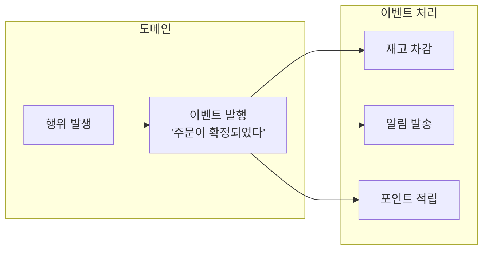
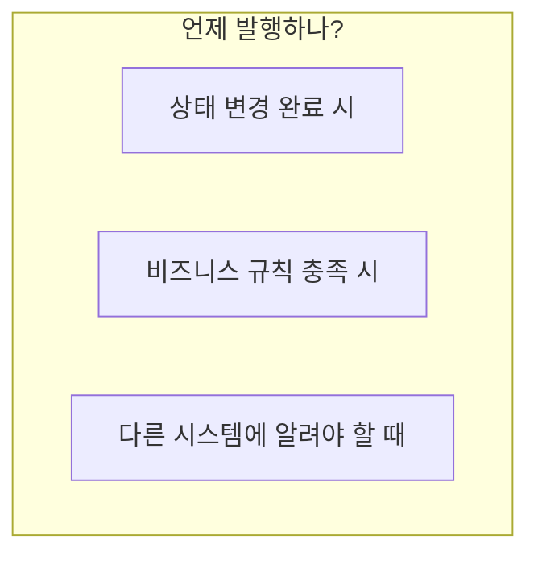
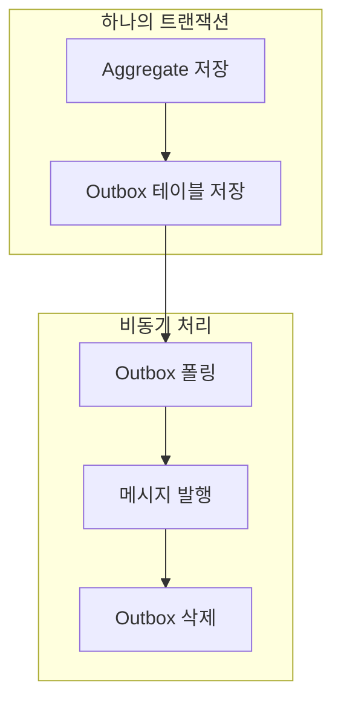
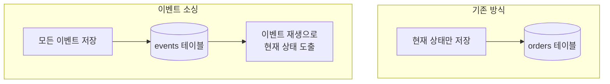
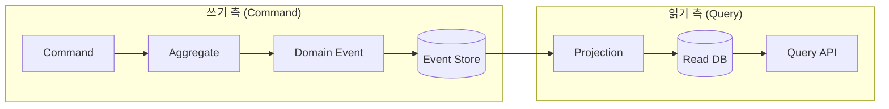

# 도메인 이벤트 (Domain Events)

도메인에서 발생한 중요한 사건을 이벤트로 표현하고 활용하는 방법입니다.

## 도메인 이벤트란?

**도메인 이벤트**는 도메인 전문가가 관심 가지는 **비즈니스적으로 의미 있는 사건**입니다.



### 특징

| 특성 | 설명 | 예시 |
|------|------|------|
| **과거형 명명** | 이미 일어난 사실 | OrderConfirmed (O), ConfirmOrder (X) |
| **불변성** | 발행 후 변경 불가 | 이벤트 데이터는 readonly |
| **자기 완결적** | 필요한 정보 포함 | orderId, 시점, 관련 데이터 |

## 이벤트 설계

### 기본 구조

```java
public abstract class DomainEvent {
    private final String eventId;
    private final Instant occurredAt;

    protected DomainEvent() {
        this.eventId = UUID.randomUUID().toString();
        this.occurredAt = Instant.now();
    }

    public String getEventId() {
        return eventId;
    }

    public Instant getOccurredAt() {
        return occurredAt;
    }
}
```

### 구체 이벤트 정의

```java
public class OrderConfirmedEvent extends DomainEvent {
    private final OrderId orderId;
    private final CustomerId customerId;
    private final Money totalAmount;
    private final List<OrderLineSnapshot> orderLines;

    public OrderConfirmedEvent(Order order) {
        super();
        this.orderId = order.getId();
        this.customerId = order.getCustomerId();
        this.totalAmount = order.getTotalAmount();
        this.orderLines = order.getOrderLines().stream()
            .map(OrderLineSnapshot::from)
            .toList();
    }

    // Getters...

    // 이벤트 전용 스냅샷 (불변)
    public record OrderLineSnapshot(
        ProductId productId,
        String productName,
        int quantity,
        Money amount
    ) {
        public static OrderLineSnapshot from(OrderLine line) {
            return new OrderLineSnapshot(
                line.getProductId(),
                line.getProductName(),
                line.getQuantity(),
                line.getAmount()
            );
        }
    }
}
```

### 이벤트 발행 시점



```java
public class Order extends AggregateRoot {

    public void confirm() {
        validateConfirmable();

        this.status = OrderStatus.CONFIRMED;
        this.confirmedAt = LocalDateTime.now();

        // 상태 변경 후 이벤트 등록
        registerEvent(new OrderConfirmedEvent(this));
    }

    public void ship(TrackingNumber trackingNumber) {
        validateShippable();

        this.status = OrderStatus.SHIPPED;
        this.trackingNumber = trackingNumber;

        registerEvent(new OrderShippedEvent(this.id, trackingNumber));
    }

    public void cancel(CancellationReason reason) {
        validateCancellable();

        this.status = OrderStatus.CANCELLED;
        this.cancelledAt = LocalDateTime.now();
        this.cancellationReason = reason;

        registerEvent(new OrderCancelledEvent(this.id, reason));
    }
}
```

## 이벤트 발행 구현

### 방법 1: Spring ApplicationEvent

```java
// Aggregate Root 기반 클래스
public abstract class AggregateRoot {
    @Transient
    private final List<DomainEvent> domainEvents = new ArrayList<>();

    protected void registerEvent(DomainEvent event) {
        domainEvents.add(event);
    }

    public List<DomainEvent> getDomainEvents() {
        return Collections.unmodifiableList(domainEvents);
    }

    public void clearDomainEvents() {
        domainEvents.clear();
    }
}

// Repository에서 저장 시 발행
@Repository
public class JpaOrderRepository implements OrderRepository {
    private final OrderJpaRepository jpaRepository;
    private final ApplicationEventPublisher eventPublisher;

    @Override
    public Order save(Order order) {
        OrderEntity entity = mapper.toEntity(order);
        jpaRepository.save(entity);

        // 저장 성공 후 이벤트 발행
        order.getDomainEvents().forEach(eventPublisher::publishEvent);
        order.clearDomainEvents();

        return order;
    }
}
```

### 방법 2: Spring Data의 @DomainEvents

```java
@Entity
public class OrderEntity extends AbstractAggregateRoot<OrderEntity> {

    public void confirm() {
        this.status = OrderStatus.CONFIRMED;

        // AbstractAggregateRoot의 메서드
        registerEvent(new OrderConfirmedEvent(this.id));
    }
}

// Repository save() 호출 시 자동으로 이벤트 발행됨
```

### 방법 3: Transactional Outbox Pattern

신뢰성 있는 이벤트 발행을 위한 패턴입니다.



```java
// Outbox 엔티티
@Entity
@Table(name = "outbox_events")
public class OutboxEvent {
    @Id
    private String id;
    private String aggregateType;
    private String aggregateId;
    private String eventType;
    private String payload;  // JSON
    private Instant createdAt;
    private boolean published;
}

// 저장 시 Outbox에도 저장
@Transactional
public void confirmOrder(OrderId orderId) {
    Order order = orderRepository.findById(orderId).orElseThrow();
    order.confirm();

    orderRepository.save(order);

    // 같은 트랜잭션에서 Outbox 저장
    OutboxEvent outbox = OutboxEvent.builder()
        .aggregateType("Order")
        .aggregateId(orderId.getValue())
        .eventType("OrderConfirmed")
        .payload(toJson(new OrderConfirmedEvent(order)))
        .build();
    outboxRepository.save(outbox);
}

// 별도 스케줄러가 Outbox 폴링하여 Kafka 발행
@Scheduled(fixedDelay = 1000)
public void publishOutboxEvents() {
    List<OutboxEvent> events = outboxRepository.findUnpublished();
    for (OutboxEvent event : events) {
        kafkaTemplate.send("domain-events", event.getPayload());
        event.markAsPublished();
        outboxRepository.save(event);
    }
}
```

## 이벤트 처리

### 동기 처리 (같은 트랜잭션)

```java
@Component
public class OrderEventHandler {

    // BEFORE_COMMIT: 트랜잭션 커밋 직전에 실행
    // 주의: 핸들러 예외 시 트랜잭션이 롤백됨
    @TransactionalEventListener(phase = TransactionPhase.BEFORE_COMMIT)
    public void handleOrderConfirmed(OrderConfirmedEvent event) {
        // 주문 확정과 함께 반드시 성공해야 하는 로직
        // 실패 시 전체 트랜잭션 롤백됨
        auditService.recordConfirmation(event.getOrderId());
    }
}
```

**TransactionPhase 선택 가이드:**

| Phase | 실행 시점 | 핸들러 실패 시 | 사용 사례 |
|-------|----------|---------------|----------|
| **BEFORE_COMMIT** | 커밋 직전 | 전체 롤백 | 필수 후속 작업 |
| **AFTER_COMMIT** | 커밋 완료 후 | 롤백 불가 | 알림, 외부 연동 |
| **AFTER_ROLLBACK** | 롤백 후 | - | 보상 트랜잭션 |

### 비동기 처리 (별도 트랜잭션)

```java
@Component
public class NotificationEventHandler {

    // 트랜잭션 커밋 후 비동기 처리
    @Async
    @TransactionalEventListener(phase = TransactionPhase.AFTER_COMMIT)
    public void handleOrderConfirmed(OrderConfirmedEvent event) {
        // 알림 발송 (실패해도 주문에 영향 없음)
        notificationService.sendOrderConfirmation(
            event.getCustomerId(),
            event.getOrderId()
        );
    }
}
```

### Kafka를 통한 이벤트 처리

```java
// 이벤트 발행
@Component
public class OrderEventPublisher {
    private final KafkaTemplate<String, OrderEvent> kafkaTemplate;

    @TransactionalEventListener(phase = TransactionPhase.AFTER_COMMIT)
    public void publishToKafka(OrderConfirmedEvent event) {
        kafkaTemplate.send(
            "order-events",
            event.getOrderId().getValue(),  // Key: 순서 보장
            toKafkaEvent(event)
        );
    }
}

// 이벤트 소비
@Component
public class InventoryEventConsumer {

    @KafkaListener(topics = "order-events", groupId = "inventory-service")
    public void handleOrderEvent(ConsumerRecord<String, OrderEvent> record) {
        OrderEvent event = record.value();

        if ("OrderConfirmed".equals(event.getType())) {
            // 재고 차감
            inventoryService.reserveStock(event.getOrderLines());
        }
    }
}
```

## 이벤트 설계 가이드

### 이벤트에 포함할 정보

```java
// ❌ 너무 적은 정보
public class OrderConfirmedEvent {
    private OrderId orderId;  // ID만으로는 추가 조회 필요
}

// ❌ 너무 많은 정보
public class OrderConfirmedEvent {
    private Order order;  // 전체 Aggregate 포함
}

// ✅ 적절한 정보
public class OrderConfirmedEvent {
    private OrderId orderId;
    private CustomerId customerId;
    private Money totalAmount;
    private List<OrderLineSnapshot> orderLines;  // 필요한 스냅샷
    private Instant confirmedAt;
}
```

### 이벤트 버전 관리

```java
// 버전이 포함된 이벤트
public class OrderConfirmedEventV2 extends DomainEvent {
    private static final int VERSION = 2;

    private OrderId orderId;
    private CustomerId customerId;
    private Money totalAmount;
    private ShippingAddress shippingAddress;  // V2에서 추가

    // 하위 호환성을 위한 변환
    public OrderConfirmedEventV1 toV1() {
        return new OrderConfirmedEventV1(orderId, customerId, totalAmount);
    }
}
```

---

## 이벤트 패턴 비교

도메인 이벤트를 사용하는 세 가지 패턴이 있습니다. 각각의 목적이 다릅니다.

### Event Notification vs Event-Carried State Transfer vs Event Sourcing

| 패턴 | 목적 | 이벤트 내용 | 복잡도 |
|------|------|-----------|--------|
| **Event Notification** | "이 일이 발생했음" 알림 | ID만 포함 | 낮음 |
| **Event-Carried State Transfer** | 상태 동기화 | 전체 상태 포함 | 중간 |
| **Event Sourcing** | 상태를 이벤트로 저장 | 변경 내역 | 높음 |

**패턴별 예시:**

```java
// 1. Event Notification (가장 단순)
// "주문이 확정됐으니 너희가 알아서 조회해"
public class OrderConfirmedEvent {
    private OrderId orderId;  // ID만
    // Consumer가 필요하면 직접 조회해야 함
}

// 2. Event-Carried State Transfer (가장 일반적)
// "주문이 확정됐고, 이게 주문 내용이야"
public class OrderConfirmedEvent {
    private OrderId orderId;
    private CustomerId customerId;
    private List<OrderLineSnapshot> orderLines;  // 필요한 데이터 포함
    private Money totalAmount;
    // Consumer가 추가 조회 없이 처리 가능
}

// 3. Event Sourcing
// "모든 변경을 이벤트로 저장하고, 현재 상태는 재생으로 도출"
// → 별도 섹션에서 자세히 설명
```

**패턴 선택 기준:**

```
단순한 알림만 필요한가?
├── Yes → Event Notification
└── No → Consumer가 추가 조회 없이 처리해야 하는가?
        ├── Yes → Event-Carried State Transfer
        └── No → 완전한 감사 추적이 필요한가?
                ├── Yes → Event Sourcing
                └── No → Event-Carried State Transfer
```

---

## 이벤트 소싱 (Event Sourcing)

이벤트를 상태의 원본으로 사용하는 패턴입니다.



```java
// 이벤트로부터 Aggregate 복원
public class Order {
    private OrderId id;
    private OrderStatus status;
    private List<OrderLine> orderLines;

    // 이벤트 스트림으로부터 복원
    public static Order fromEvents(List<DomainEvent> events) {
        Order order = new Order();
        for (DomainEvent event : events) {
            order.apply(event);
        }
        return order;
    }

    private void apply(DomainEvent event) {
        if (event instanceof OrderCreatedEvent e) {
            this.id = e.getOrderId();
            this.status = OrderStatus.PENDING;
            this.orderLines = new ArrayList<>(e.getOrderLines());
        } else if (event instanceof OrderConfirmedEvent e) {
            this.status = OrderStatus.CONFIRMED;
        } else if (event instanceof OrderCancelledEvent e) {
            this.status = OrderStatus.CANCELLED;
        }
    }
}

// Event Store
public interface OrderEventStore {
    void append(OrderId orderId, DomainEvent event);
    List<DomainEvent> getEvents(OrderId orderId);
}

// Repository
public class EventSourcedOrderRepository implements OrderRepository {
    private final OrderEventStore eventStore;

    @Override
    public Optional<Order> findById(OrderId id) {
        List<DomainEvent> events = eventStore.getEvents(id);
        if (events.isEmpty()) {
            return Optional.empty();
        }
        return Optional.of(Order.fromEvents(events));
    }

    @Override
    public Order save(Order order) {
        for (DomainEvent event : order.getDomainEvents()) {
            eventStore.append(order.getId(), event);
        }
        order.clearDomainEvents();
        return order;
    }
}
```

### 이벤트 소싱 장단점

| 장점 | 단점 |
|------|------|
| 완전한 감사 추적 | 복잡성 증가 |
| 시간 여행 (과거 상태 재현) | 이벤트 스키마 진화 어려움 |
| 이벤트 기반 통합에 적합 | 쿼리 성능 (CQRS 필요) |

### 이벤트 저장소 선택

| 옵션 | 특징 | 적합한 경우 |
|------|------|-----------|
| **직접 구현 (RDBMS)** | 간단, 기존 DB 활용 | 소규모, 학습 목적 |
| **EventStoreDB** | 전용 저장소, 구독 기능 내장 | 이벤트 소싱 전문 |
| **Axon Framework** | Java 생태계, CQRS 통합 | Spring 기반 프로젝트 |
| **Kafka** | 고성능, 이미 사용 중이면 | 이벤트 스트리밍 중심 |

---

## CQRS와 도메인 이벤트

이벤트 소싱을 사용하면 CQRS(Command Query Responsibility Segregation)가 자연스럽습니다.



**왜 CQRS가 필요한가:**

이벤트 소싱에서 현재 상태를 얻으려면 모든 이벤트를 재생해야 합니다.
주문 1개에 이벤트 100개면? → 매 조회마다 100번 재생 = 느림

```java
// CQRS 없이: 매번 이벤트 재생
public Order findById(OrderId id) {
    List<DomainEvent> events = eventStore.getEvents(id);
    return Order.fromEvents(events);  // 느림!
}

// CQRS 적용: 읽기 전용 뷰 사용
public OrderView findById(OrderId id) {
    return orderViewRepository.findById(id);  // 빠름!
}

// Projection: 이벤트를 읽기 뷰로 변환
@EventHandler
public void on(OrderConfirmedEvent event) {
    OrderView view = orderViewRepository.findById(event.getOrderId());
    view.setStatus("CONFIRMED");
    view.setConfirmedAt(event.getOccurredAt());
    orderViewRepository.save(view);
}
```

**CQRS 도입 기준:**

```
다음 조건 중 2개 이상이면 CQRS 고려:
□ 읽기와 쓰기 패턴이 크게 다름
□ 읽기 성능이 중요함
□ 이벤트 소싱을 사용함
□ 복잡한 조회 요구사항 (다양한 뷰)
□ 읽기/쓰기 확장이 독립적으로 필요함
```

## 실전 팁

### 1. 이벤트 명명 규칙

```
- 과거형 사용: OrderConfirmed, PaymentCompleted
- 도메인 용어 사용: OrderShipped (O), OrderStatusChangedToShipped (X)
- 명확한 접두사: Order + Confirmed = OrderConfirmed
```

### 2. 멱등성 처리

```java
@Component
public class PaymentEventHandler {
    private final ProcessedEventRepository processedEvents;

    @KafkaListener(topics = "order-events")
    public void handle(OrderConfirmedEvent event) {
        // 이미 처리된 이벤트인지 확인
        if (processedEvents.exists(event.getEventId())) {
            log.info("이미 처리된 이벤트: {}", event.getEventId());
            return;
        }

        // 비즈니스 로직 처리
        paymentService.requestPayment(event);

        // 처리 완료 기록
        processedEvents.save(event.getEventId());
    }
}
```

### 3. 실패 처리

```java
@Component
public class StockEventHandler {

    @RetryableTopic(
        attempts = "3",
        backoff = @Backoff(delay = 1000, multiplier = 2)
    )
    @KafkaListener(topics = "order-events")
    public void handle(OrderConfirmedEvent event) {
        // 3회 재시도 후 실패 시 DLT로 이동
        stockService.reserve(event.getOrderLines());
    }

    @DltHandler
    public void handleDlt(OrderConfirmedEvent event) {
        // Dead Letter Topic 처리
        alertService.notifyStockReservationFailed(event);
    }
}
```

---

## 이벤트 기반 아키텍처의 함정

도메인 이벤트는 강력하지만, 잘못 사용하면 디버깅이 어려운 시스템이 됩니다.

### 함정 1: 이벤트 유실

**문제:** `@TransactionalEventListener(AFTER_COMMIT)`은 이벤트를 메모리에만 보관합니다. 애플리케이션이 이벤트 발행 직전에 죽으면 유실됩니다.

```java
// ❌ 이벤트 유실 가능
@Transactional
public void confirmOrder(OrderId orderId) {
    Order order = orderRepository.findById(orderId);
    order.confirm();
    orderRepository.save(order);
    // 여기서 커밋 완료

    // 이벤트는 AFTER_COMMIT에서 발행됨
    // 만약 이 시점에 서버가 죽으면? → 이벤트 유실!
}
```

**해결: Transactional Outbox Pattern**

이벤트를 DB에 먼저 저장하고, 별도 프로세스가 발행합니다:

```java
// ✅ 이벤트 유실 방지
@Transactional
public void confirmOrder(OrderId orderId) {
    Order order = orderRepository.findById(orderId);
    order.confirm();
    orderRepository.save(order);

    // 같은 트랜잭션에서 Outbox에 저장
    outboxRepository.save(new OutboxEvent(
        "OrderConfirmed",
        toJson(new OrderConfirmedEvent(order))
    ));
    // DB 트랜잭션 성공 = 이벤트 저장 보장
}

// 별도 스케줄러가 Outbox 폴링하여 Kafka 발행
@Scheduled(fixedDelay = 1000)
public void publishEvents() {
    List<OutboxEvent> events = outboxRepository.findUnpublished();
    for (OutboxEvent event : events) {
        kafkaTemplate.send("domain-events", event.getPayload());
        event.markPublished();
        outboxRepository.save(event);
    }
}
```

### 함정 2: 이벤트 순서 역전

**문제:** 비동기 이벤트는 발행 순서와 처리 순서가 다를 수 있습니다.

```
발행 순서: OrderCreated → OrderPaid → OrderShipped
처리 순서: OrderCreated → OrderShipped → OrderPaid (역전!)

결과: "결제도 안 됐는데 배송됐다?" 상태 불일치
```

**해결 방법:**

```java
// 방법 1: 상태 검증 후 처리
@KafkaListener(topics = "order-events")
public void handleOrderShipped(OrderShippedEvent event) {
    Order order = orderRepository.findById(event.getOrderId());

    // 상태 검증: PAID 상태가 아니면 처리 보류
    if (order.getStatus() != OrderStatus.PAID) {
        throw new OrderNotReadyForShipmentException();
        // 재시도 또는 DLT로 이동
    }

    order.ship();
    orderRepository.save(order);
}

// 방법 2: 이벤트에 버전/시퀀스 포함
public class OrderEvent {
    private long sequenceNumber;  // 1, 2, 3, ...

    // 낮은 시퀀스 이벤트는 무시
}
```

### 함정 3: 순환 이벤트

**문제:** A 이벤트가 B를 발생시키고, B가 다시 A를 발생시키는 무한 루프

```
OrderConfirmed → StockReserved → OrderUpdated → StockReserved → ...
```

**해결: 이벤트 체인 추적**

```java
public abstract class DomainEvent {
    private String correlationId;  // 최초 이벤트 ID
    private String causationId;    // 이 이벤트를 발생시킨 이벤트 ID
    private int depth;             // 이벤트 체인 깊이

    public boolean isMaxDepthReached() {
        return depth > 10;  // 최대 깊이 제한
    }
}
```

### 함정 4: 이벤트 스키마 변경

**문제:** 이벤트 구조를 변경하면 기존 Consumer가 깨집니다.

```java
// v1: OrderConfirmedEvent { orderId, amount }
// v2: OrderConfirmedEvent { orderId, totalAmount, discountAmount }
// 기존 Consumer가 amount를 찾다가 실패!
```

**해결: 하위 호환성 유지**

```java
// 필드 추가는 OK (Optional로 처리)
public class OrderConfirmedEvent {
    private String orderId;
    private Money amount;           // 기존 필드 유지
    private Money totalAmount;      // 새 필드 추가
    private Money discountAmount;   // 새 필드 추가

    // 하위 호환성: 기존 필드로도 접근 가능
    public Money getAmount() {
        return amount != null ? amount : totalAmount;
    }
}

// 필드 삭제나 타입 변경이 필요하면 새 이벤트 타입 정의
// OrderConfirmedEventV2
```

---

## 이벤트 디버깅 팁

이벤트 기반 시스템은 흐름 추적이 어렵습니다. 다음을 항상 포함하세요:

```java
public abstract class DomainEvent {
    private String eventId;         // 유니크 ID
    private String correlationId;   // 요청 추적 ID (같은 요청의 모든 이벤트)
    private Instant occurredAt;     // 발생 시각
    private String aggregateId;     // 어떤 Aggregate에서 발생했는지
    private String aggregateType;   // Order, Payment 등
}
```

**로그에 항상 포함:**
```java
log.info("이벤트 처리 시작: eventId={}, correlationId={}, type={}",
    event.getEventId(),
    event.getCorrelationId(),
    event.getClass().getSimpleName());
```

이렇게 하면 로그에서 `correlationId`로 검색하여 하나의 요청이 발생시킨 모든 이벤트 흐름을 추적할 수 있습니다.

---

## 실제 스키마 진화 사례

이벤트 스키마 변경은 신중해야 합니다. 실제 사례를 통해 배워봅시다.

### 사례 1: 필드 추가 (안전)

```java
// v1: 초기 버전
public class OrderConfirmedEvent {
    private String orderId;
    private BigDecimal amount;
}

// v2: 할인 정보 추가 필요
public class OrderConfirmedEvent {
    private String orderId;
    private BigDecimal amount;
    private BigDecimal discountAmount;  // 새 필드 (null 허용)

    // 하위 호환성: 기존 이벤트는 discountAmount가 null
    public BigDecimal getDiscountAmount() {
        return discountAmount != null ? discountAmount : BigDecimal.ZERO;
    }
}
```

### 사례 2: 필드 이름 변경 (위험)

```java
// ❌ 위험: 필드명 직접 변경
// v1: amount
// v2: totalAmount
// → 기존 Consumer 전부 깨짐!

// ✅ 안전: 두 필드 모두 유지
public class OrderConfirmedEvent {
    private String orderId;

    @Deprecated
    private BigDecimal amount;       // 기존 필드 유지

    private BigDecimal totalAmount;  // 새 필드

    // 새 Consumer는 totalAmount 사용
    public BigDecimal getTotalAmount() {
        return totalAmount != null ? totalAmount : amount;
    }

    // 기존 Consumer 호환성
    public BigDecimal getAmount() {
        return amount != null ? amount : totalAmount;
    }
}
```

### 사례 3: 타입 변경 (가장 위험)

```java
// ❌ 절대 하면 안 됨: 타입 변경
// v1: String orderId
// v2: Long orderId
// → 역직렬화 실패!

// ✅ 해결: 새 이벤트 타입 정의
public class OrderConfirmedEventV2 {
    private Long orderId;  // 새 타입

    // 마이그레이션 핸들러
    public static OrderConfirmedEventV2 fromV1(OrderConfirmedEvent v1) {
        return new OrderConfirmedEventV2(Long.parseLong(v1.getOrderId()));
    }
}

// Consumer는 두 버전 모두 처리
@KafkaListener(topics = "order-events")
public void handle(ConsumerRecord<String, JsonNode> record) {
    int version = record.value().get("version").asInt();
    if (version == 1) {
        // V1 처리
    } else {
        // V2 처리
    }
}
```

### 스키마 진화 체크리스트

```
안전한 변경:
✅ 새 필드 추가 (Optional)
✅ 필드에 기본값 추가
✅ 새 이벤트 타입 추가

위험한 변경 (마이그레이션 필요):
⚠️ 필드명 변경
⚠️ 필드 타입 변경
⚠️ 필수 필드로 변경

절대 하면 안 되는 변경:
❌ 기존 필드 삭제
❌ 기존 이벤트 타입 삭제
❌ 이벤트 의미 변경
```

---

## 요약

| 개념 | 핵심 |
|------|------|
| **도메인 이벤트** | 비즈니스적으로 의미 있는 사건 |
| **이벤트 패턴** | Notification / State Transfer / Sourcing |
| **Outbox 패턴** | 이벤트 유실 방지 |
| **CQRS** | 이벤트 소싱의 쿼리 성능 해결 |
| **스키마 진화** | 하위 호환성 유지 필수 |

## 다음 단계

- [실습 예제](../../examples/) - Spring Boot로 구현하는 주문 도메인
