# 헥사고날 아키텍처 (Hexagonal Architecture)

**Ports and Adapters** 패턴이라고도 불립니다. 애플리케이션의 핵심을 외부 세계로부터 완전히 격리시키는 아키텍처입니다.

## 한 줄 요약

> **애플리케이션은 육각형 안에, 외부 연결은 Port와 Adapter로**

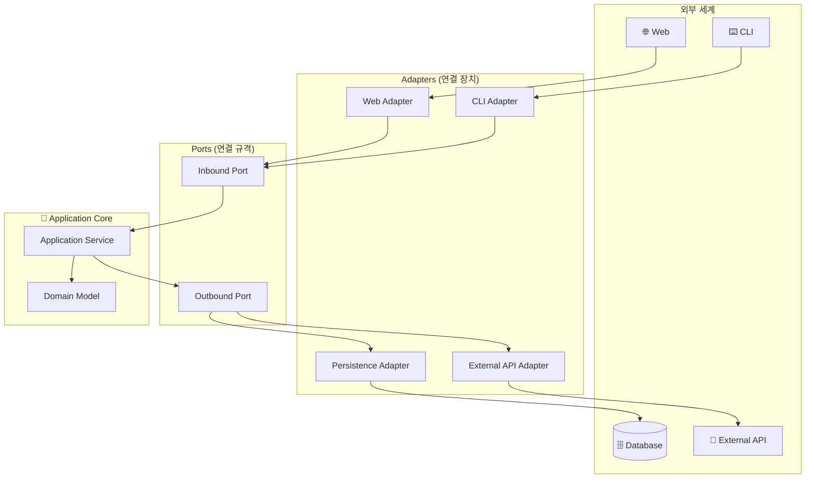

---

## 왜 "헥사고날(육각형)"인가요?

### 비유: 스마트폰과 어댑터

스마트폰을 생각해보세요:

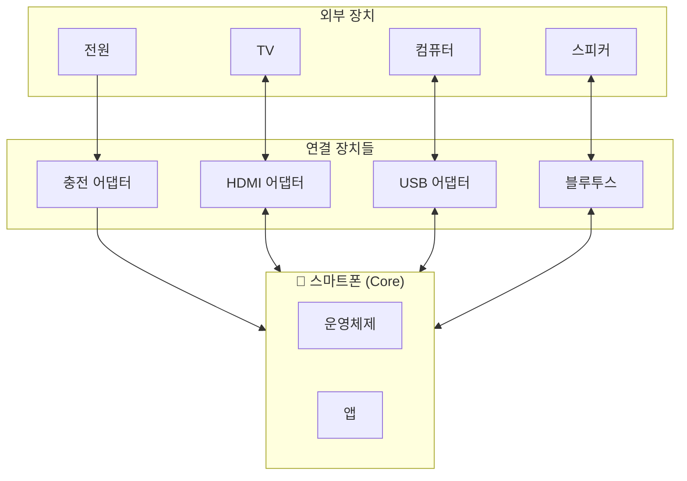

- 스마트폰 자체는 **어떤 충전기를 쓰는지 모름** (C타입? 무선?)
- 충전 방식이 바뀌어도 **폰의 기능은 그대로**
- **어댑터만 바꾸면** 다양한 장치와 연결 가능

소프트웨어도 마찬가지입니다!

**왜 육각형인가요?**
- 실제로 6개 면이 중요한 건 아닙니다
- "여러 방향에서 연결할 수 있다"는 의미
- 계층형의 "위→아래" 대신 "안↔밖" 관점

---

## 핵심 개념 3가지

### 1. Port (포트) - "연결 규격"

**Port = 인터페이스**입니다. 외부와 연결되는 "규격"을 정의합니다.

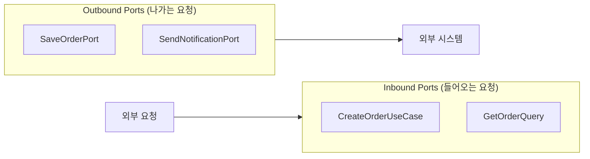

**두 종류의 Port:**

| Port 종류 | 방향 | 역할 | 예시 |
|----------|------|------|------|
| **Inbound Port** | 외부 → 애플리케이션 | "나한테 이렇게 요청해" | `CreateOrderUseCase` |
| **Outbound Port** | 애플리케이션 → 외부 | "나는 이것만 필요해" | `SaveOrderPort` |

```java
// Inbound Port: "외부에서 나를 이렇게 호출해"
public interface CreateOrderUseCase {
    OrderId createOrder(CreateOrderCommand command);
}

// Outbound Port: "나는 주문을 저장하고 싶어"
public interface SaveOrderPort {
    void save(Order order);
}
```

### 2. Adapter (어댑터) - "연결 장치"

**Adapter = 구현체**입니다. Port 규격에 맞춰 실제 연결을 담당합니다.

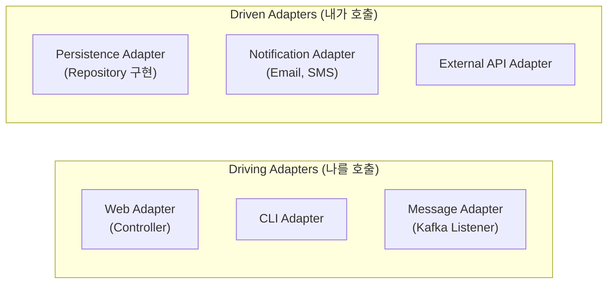

**두 종류의 Adapter:**

| Adapter 종류 | 다른 이름 | 역할 | 예시 |
|-------------|----------|------|------|
| **Driving Adapter** | Primary Adapter | 애플리케이션을 호출 | Controller, CLI |
| **Driven Adapter** | Secondary Adapter | 애플리케이션이 호출 | Repository 구현, API Client |

```java
// Driving Adapter: 외부 요청을 받아서 애플리케이션에 전달
@RestController
public class OrderController {
    private final CreateOrderUseCase createOrderUseCase;  // Port 사용

    @PostMapping("/orders")
    public ResponseEntity<String> createOrder(@RequestBody OrderRequest request) {
        OrderId orderId = createOrderUseCase.createOrder(request.toCommand());
        return ResponseEntity.ok(orderId.getValue());
    }
}

// Driven Adapter: 애플리케이션의 요청을 외부 시스템에 전달
@Repository
public class OrderPersistenceAdapter implements SaveOrderPort {
    private final OrderJpaRepository jpaRepository;

    @Override
    public void save(Order order) {
        OrderEntity entity = OrderMapper.toEntity(order);
        jpaRepository.save(entity);
    }
}
```

### 3. Application Core - "비즈니스 심장"

육각형 안에는 순수한 비즈니스 로직만 있습니다.

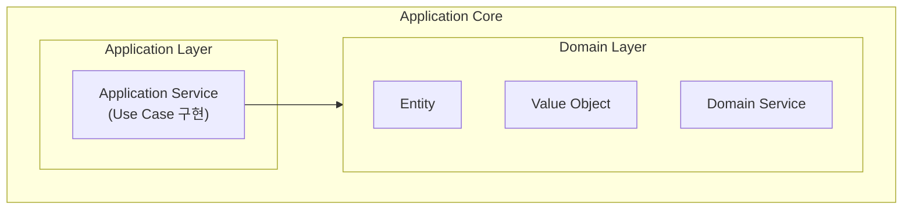

---

## 전체 구조 한눈에 보기

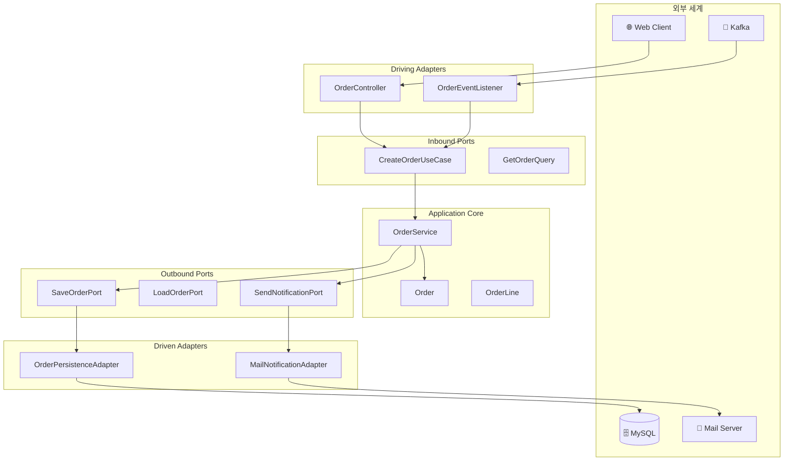

---

## 코드로 이해하기

### 1단계: Port 정의하기

```java
// === Inbound Ports ===
// Application 패키지에 위치

// 주문 생성 유스케이스
public interface CreateOrderUseCase {
    OrderId execute(CreateOrderCommand command);
}

// 주문 확정 유스케이스
public interface ConfirmOrderUseCase {
    void execute(OrderId orderId);
}

// 주문 조회 (Query)
public interface GetOrderQuery {
    OrderDto execute(OrderId orderId);
}
```

```java
// === Outbound Ports ===
// Application 패키지에 위치

// 주문 저장
public interface SaveOrderPort {
    void save(Order order);
}

// 주문 조회
public interface LoadOrderPort {
    Order loadById(OrderId id);
    boolean existsById(OrderId id);
}

// 알림 발송
public interface SendNotificationPort {
    void sendOrderConfirmation(Order order);
}

// 재고 확인
public interface CheckInventoryPort {
    boolean isAvailable(ProductId productId, int quantity);
}
```

### 2단계: Application Service 구현하기

```java
@Service
@Transactional
public class OrderService implements CreateOrderUseCase, ConfirmOrderUseCase {

    // Outbound Ports (인터페이스)만 의존
    private final SaveOrderPort saveOrderPort;
    private final LoadOrderPort loadOrderPort;
    private final SendNotificationPort notificationPort;
    private final CheckInventoryPort inventoryPort;

    // 생성자 주입
    public OrderService(
            SaveOrderPort saveOrderPort,
            LoadOrderPort loadOrderPort,
            SendNotificationPort notificationPort,
            CheckInventoryPort inventoryPort) {
        this.saveOrderPort = saveOrderPort;
        this.loadOrderPort = loadOrderPort;
        this.notificationPort = notificationPort;
        this.inventoryPort = inventoryPort;
    }

    @Override
    public OrderId execute(CreateOrderCommand command) {
        // 1. 재고 확인 (Outbound Port 사용)
        for (OrderLineCommand line : command.getLines()) {
            if (!inventoryPort.isAvailable(line.getProductId(), line.getQuantity())) {
                throw new InsufficientInventoryException(line.getProductId());
            }
        }

        // 2. 주문 생성 (Domain Logic)
        Order order = Order.create(
            command.getCustomerId(),
            command.toOrderLines()
        );

        // 3. 저장 (Outbound Port 사용)
        saveOrderPort.save(order);

        return order.getId();
    }

    @Override
    public void execute(OrderId orderId) {
        // 1. 주문 조회 (Outbound Port 사용)
        Order order = loadOrderPort.loadById(orderId);

        // 2. 주문 확정 (Domain Logic)
        order.confirm();

        // 3. 저장 (Outbound Port 사용)
        saveOrderPort.save(order);

        // 4. 알림 발송 (Outbound Port 사용)
        notificationPort.sendOrderConfirmation(order);
    }
}
```


**핵심 포인트**

Application Service는 **Port(인터페이스)만 알고 있습니다:**
- `SaveOrderPort` ← JPA인지 MongoDB인지 모름
- `SendNotificationPort` ← 이메일인지 SMS인지 모름
- `CheckInventoryPort` ← 내부 DB인지 외부 API인지 모름

그래서 **외부 기술이 바뀌어도 이 코드는 변경할 필요가 없습니다!**


### 3단계: Driving Adapter 구현하기

```java
// === Web Adapter (Driving) ===
@RestController
@RequestMapping("/api/orders")
public class OrderController {

    private final CreateOrderUseCase createOrderUseCase;
    private final ConfirmOrderUseCase confirmOrderUseCase;
    private final GetOrderQuery getOrderQuery;

    @PostMapping
    public ResponseEntity<OrderIdResponse> createOrder(
            @Valid @RequestBody CreateOrderRequest request) {

        // Request → Command 변환
        CreateOrderCommand command = request.toCommand();

        // Use Case 실행
        OrderId orderId = createOrderUseCase.execute(command);

        // Response 생성
        return ResponseEntity
            .status(HttpStatus.CREATED)
            .body(new OrderIdResponse(orderId.getValue()));
    }

    @PostMapping("/{orderId}/confirm")
    public ResponseEntity<Void> confirmOrder(@PathVariable String orderId) {
        confirmOrderUseCase.execute(OrderId.of(orderId));
        return ResponseEntity.ok().build();
    }

    @GetMapping("/{orderId}")
    public ResponseEntity<OrderResponse> getOrder(@PathVariable String orderId) {
        OrderDto order = getOrderQuery.execute(OrderId.of(orderId));
        return ResponseEntity.ok(OrderResponse.from(order));
    }
}
```

```java
// === Message Adapter (Driving) ===
@Component
public class OrderEventListener {

    private final ConfirmOrderUseCase confirmOrderUseCase;

    @KafkaListener(topics = "payment-completed")
    public void onPaymentCompleted(PaymentCompletedEvent event) {
        // 결제 완료 시 자동으로 주문 확정
        confirmOrderUseCase.execute(OrderId.of(event.getOrderId()));
    }
}
```

### 4단계: Driven Adapter 구현하기

```java
// === Persistence Adapter (Driven) ===
@Repository
public class OrderPersistenceAdapter implements SaveOrderPort, LoadOrderPort {

    private final OrderJpaRepository jpaRepository;
    private final OrderMapper mapper;

    @Override
    public void save(Order order) {
        OrderEntity entity = mapper.toEntity(order);
        jpaRepository.save(entity);
    }

    @Override
    public Order loadById(OrderId id) {
        return jpaRepository.findById(id.getValue())
            .map(mapper::toDomain)
            .orElseThrow(() -> new OrderNotFoundException(id));
    }

    @Override
    public boolean existsById(OrderId id) {
        return jpaRepository.existsById(id.getValue());
    }
}
```

```java
// === Notification Adapter (Driven) ===
@Component
public class EmailNotificationAdapter implements SendNotificationPort {

    private final JavaMailSender mailSender;

    @Override
    public void sendOrderConfirmation(Order order) {
        SimpleMailMessage message = new SimpleMailMessage();
        message.setTo(order.getCustomerEmail());
        message.setSubject("주문이 확정되었습니다");
        message.setText("주문번호: " + order.getId().getValue());

        mailSender.send(message);
    }
}
```

```java
// === External API Adapter (Driven) ===
@Component
public class InventoryApiAdapter implements CheckInventoryPort {

    private final RestTemplate restTemplate;

    @Override
    public boolean isAvailable(ProductId productId, int quantity) {
        String url = "http://inventory-service/api/products/{id}/stock";

        InventoryResponse response = restTemplate.getForObject(
            url,
            InventoryResponse.class,
            productId.getValue()
        );

        return response.getAvailableQuantity() >= quantity;
    }
}
```

---

## 패키지 구조

```
com.example.order/
│
├── adapter/                          # Adapters (외부와의 연결)
│   ├── in/                           # Driving Adapters
│   │   ├── web/
│   │   │   ├── OrderController.java
│   │   │   ├── CreateOrderRequest.java
│   │   │   └── OrderResponse.java
│   │   └── message/
│   │       └── OrderEventListener.java
│   │
│   └── out/                          # Driven Adapters
│       ├── persistence/
│       │   ├── OrderPersistenceAdapter.java
│       │   ├── OrderEntity.java
│       │   ├── OrderJpaRepository.java
│       │   └── OrderMapper.java
│       ├── notification/
│       │   └── EmailNotificationAdapter.java
│       └── inventory/
│           └── InventoryApiAdapter.java
│
├── application/                      # Application Core - 바깥쪽
│   ├── port/
│   │   ├── in/                       # Inbound Ports
│   │   │   ├── CreateOrderUseCase.java
│   │   │   ├── ConfirmOrderUseCase.java
│   │   │   └── GetOrderQuery.java
│   │   └── out/                      # Outbound Ports
│   │       ├── SaveOrderPort.java
│   │       ├── LoadOrderPort.java
│   │       ├── SendNotificationPort.java
│   │       └── CheckInventoryPort.java
│   └── service/
│       └── OrderService.java
│
└── domain/                           # Application Core - 안쪽
    ├── Order.java
    ├── OrderLine.java
    ├── OrderId.java
    ├── OrderStatus.java
    └── Money.java
```

---

## 의존성 방향

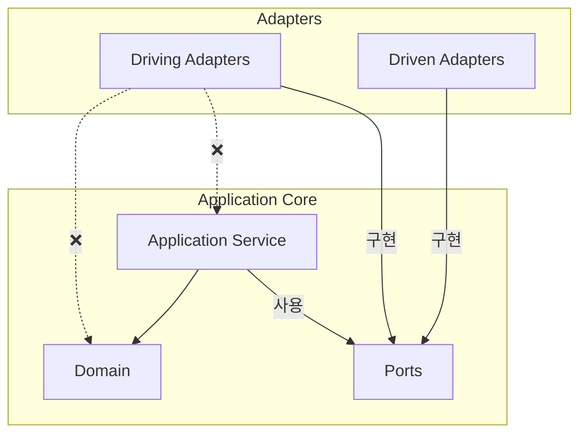

**핵심 규칙:**
1. **Adapter → Port** 방향으로만 의존
2. **Application Core는 Adapter를 모름**
3. **Domain은 아무것도 의존하지 않음**

---

## 헥사고날의 장점

### 1. 테스트가 쉬워집니다

```java
// Port만 Mock하면 됩니다
@ExtendWith(MockitoExtension.class)
class OrderServiceTest {

    @Mock
    private SaveOrderPort saveOrderPort;

    @Mock
    private LoadOrderPort loadOrderPort;

    @Mock
    private SendNotificationPort notificationPort;

    @Mock
    private CheckInventoryPort inventoryPort;

    @InjectMocks
    private OrderService orderService;

    @Test
    void 주문_생성_성공() {
        // Given
        when(inventoryPort.isAvailable(any(), anyInt())).thenReturn(true);

        CreateOrderCommand command = new CreateOrderCommand(
            CustomerId.of("customer-1"),
            List.of(new OrderLineCommand(ProductId.of("product-1"), 2))
        );

        // When
        OrderId result = orderService.execute(command);

        // Then
        verify(saveOrderPort).save(any(Order.class));
        assertThat(result).isNotNull();
    }
}
```

### 2. 기술 교체가 쉬워집니다

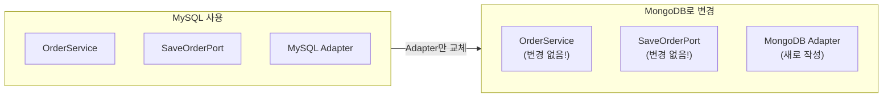

```java
// MySQL에서 MongoDB로 변경해도 Service 코드 변경 없음!

// Before: MySQL Adapter
@Repository
public class MySqlOrderAdapter implements SaveOrderPort {
    private final OrderJpaRepository jpaRepository;
    // ...
}

// After: MongoDB Adapter (새로 추가)
@Repository
public class MongoOrderAdapter implements SaveOrderPort {
    private final OrderMongoRepository mongoRepository;
    // ...
}
```

### 3. 외부 연동 추가가 쉬워집니다

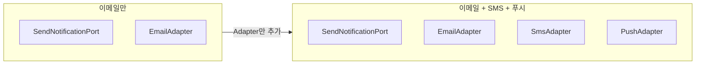

---

## 계층형과의 비교

### 관점의 차이

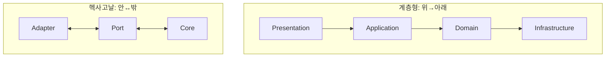

### 상세 비교

| 관점 | 계층형 | 헥사고날 |
|------|--------|----------|
| **구조** | 수직 계층 (4층) | 안쪽/바깥쪽 |
| **의존성** | 위에서 아래로 | 바깥에서 안으로 |
| **Infrastructure** | 맨 아래 계층 | 바깥쪽 Adapter |
| **강조점** | 계층 분리 | 외부 격리 |
| **테스트** | Mock 필요 | Port Mock만 |
| **적합한 상황** | 단순한 프로젝트 | 외부 연동 많은 프로젝트 |

---

## 흔한 실수들

### 1. Port 없이 직접 의존

```java
// ❌ 잘못된 예: Service가 Repository 구현체를 직접 의존
@Service
public class OrderService {
    private final OrderJpaRepository jpaRepository;  // 구체 클래스!
}

// ✅ 올바른 예: Port(인터페이스)에 의존
@Service
public class OrderService {
    private final SaveOrderPort saveOrderPort;  // 인터페이스!
}
```

### 2. Adapter에 비즈니스 로직

```java
// ❌ 잘못된 예: Controller에 비즈니스 로직
@RestController
public class OrderController {
    @PostMapping
    public ResponseEntity<?> createOrder(@RequestBody OrderRequest request) {
        // 비즈니스 로직이 Controller에!
        if (request.getTotal() > 100000) {
            request.setDiscount(0.1);
        }
        // ...
    }
}

// ✅ 올바른 예: Controller는 요청/응답만
@RestController
public class OrderController {
    private final CreateOrderUseCase useCase;

    @PostMapping
    public ResponseEntity<?> createOrder(@RequestBody OrderRequest request) {
        OrderId orderId = useCase.execute(request.toCommand());  // 위임
        return ResponseEntity.ok(new OrderIdResponse(orderId));
    }
}
```

### 3. Domain이 Port에 의존

```java
// ❌ 잘못된 예: Entity가 Port 사용
public class Order {
    private final SaveOrderPort saveOrderPort;  // Domain이 Port에 의존!

    public void confirm() {
        this.status = CONFIRMED;
        saveOrderPort.save(this);  // 안 됨!
    }
}

// ✅ 올바른 예: Domain은 순수하게
public class Order {
    public void confirm() {
        this.status = CONFIRMED;  // 상태 변경만
    }
}

// Application Service에서 저장
@Service
public class OrderService {
    public void confirmOrder(OrderId id) {
        Order order = loadOrderPort.loadById(id);
        order.confirm();
        saveOrderPort.save(order);  // Service에서 저장
    }
}
```

---

## 테스트 전략

### 테스트 레벨별 전략

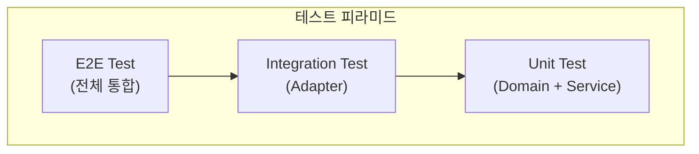

### 1. Domain 테스트 (순수 단위 테스트)

```java
class OrderTest {

    @Test
    void 주문_확정_성공() {
        // Given
        Order order = Order.create(
            CustomerId.of("c1"),
            List.of(new OrderLine(ProductId.of("p1"), 1, Money.of(10000)))
        );

        // When
        order.confirm();

        // Then
        assertThat(order.getStatus()).isEqualTo(OrderStatus.CONFIRMED);
    }

    @Test
    void 이미_확정된_주문은_다시_확정할_수_없다() {
        Order order = createConfirmedOrder();

        assertThrows(IllegalStateException.class, () -> order.confirm());
    }
}
```

### 2. Application Service 테스트 (Port Mock)

```java
@ExtendWith(MockitoExtension.class)
class OrderServiceTest {

    @Mock private SaveOrderPort saveOrderPort;
    @Mock private LoadOrderPort loadOrderPort;
    @Mock private SendNotificationPort notificationPort;
    @Mock private CheckInventoryPort inventoryPort;

    @InjectMocks
    private OrderService orderService;

    @Test
    void 재고_부족시_주문_실패() {
        // Given
        when(inventoryPort.isAvailable(any(), anyInt())).thenReturn(false);

        CreateOrderCommand command = createCommand();

        // When & Then
        assertThrows(
            InsufficientInventoryException.class,
            () -> orderService.execute(command)
        );

        verify(saveOrderPort, never()).save(any());
    }
}
```

### 3. Adapter 테스트 (통합 테스트)

```java
// Persistence Adapter 테스트
@DataJpaTest
class OrderPersistenceAdapterTest {

    @Autowired
    private OrderJpaRepository jpaRepository;

    private OrderPersistenceAdapter adapter;

    @BeforeEach
    void setUp() {
        adapter = new OrderPersistenceAdapter(jpaRepository, new OrderMapper());
    }

    @Test
    void 주문_저장_및_조회() {
        // Given
        Order order = createOrder();

        // When
        adapter.save(order);
        Order found = adapter.loadById(order.getId());

        // Then
        assertThat(found.getId()).isEqualTo(order.getId());
    }
}

// Web Adapter 테스트
@WebMvcTest(OrderController.class)
class OrderControllerTest {

    @Autowired
    private MockMvc mockMvc;

    @MockBean
    private CreateOrderUseCase createOrderUseCase;

    @Test
    void 주문_생성_API() throws Exception {
        when(createOrderUseCase.execute(any()))
            .thenReturn(OrderId.of("order-123"));

        mockMvc.perform(post("/api/orders")
                .contentType(MediaType.APPLICATION_JSON)
                .content("{\"customerId\":\"c1\",\"items\":[]}"))
            .andExpect(status().isCreated())
            .andExpect(jsonPath("$.orderId").value("order-123"));
    }
}
```

---

## 언제 헥사고날을 사용하나요?

### 적합한 경우

- ✅ 외부 시스템 연동이 많을 때 (DB, API, 메시지 큐)
- ✅ 마이크로서비스 아키텍처
- ✅ 기술 변경 가능성이 있을 때
- ✅ 팀이 테스트를 중요하게 여길 때
- ✅ 레거시 시스템과 통합해야 할 때

### 부적합한 경우

- ❌ 소규모, 단기 프로젝트
- ❌ 팀이 패턴에 익숙하지 않을 때 → [계층형](../layered-architecture/)으로 시작
- ❌ 단순 CRUD 애플리케이션
- ❌ 외부 연동이 거의 없을 때

---

## 계층형에서 헥사고날로 전환하기

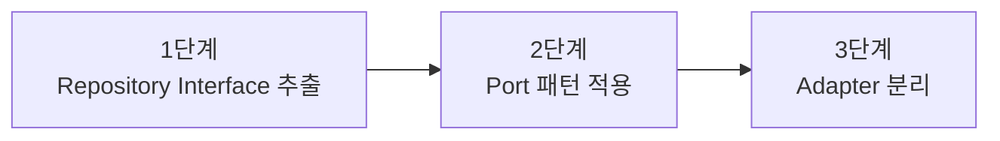

### 1단계: Repository Interface를 Domain으로

```java
// Before: Infrastructure에 있던 Repository
// After: Domain에 인터페이스 정의
public interface OrderRepository {
    void save(Order order);
    Optional<Order> findById(OrderId id);
}
```

### 2단계: Port 네이밍으로 변경

```java
// Before: OrderRepository
// After: SaveOrderPort, LoadOrderPort 분리
public interface SaveOrderPort {
    void save(Order order);
}

public interface LoadOrderPort {
    Order loadById(OrderId id);
}
```

### 3단계: Adapter 패키지 구조 정리

```
// Before
com.example.order/
├── controller/
├── service/
├── repository/
└── entity/

// After
com.example.order/
├── adapter/
│   ├── in/web/
│   └── out/persistence/
├── application/
│   ├── port/in/
│   ├── port/out/
│   └── service/
└── domain/
```

---

## 다음 단계

- [클린 아키텍처](../clean-architecture/) - 더 엄격한 의존성 규칙
- [어니언 아키텍처](../onion-architecture/) - 도메인 모델 중심
- [CQRS](../cqrs/) - 읽기/쓰기 분리
