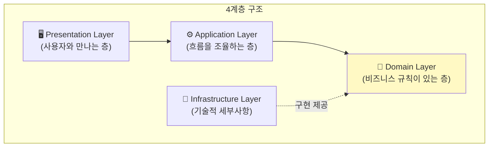
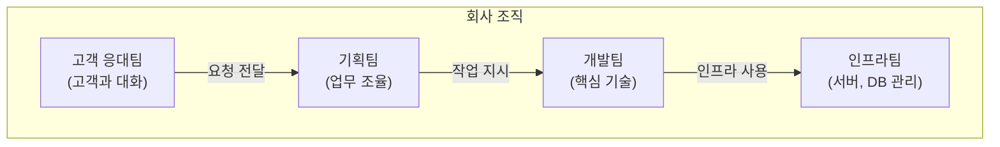
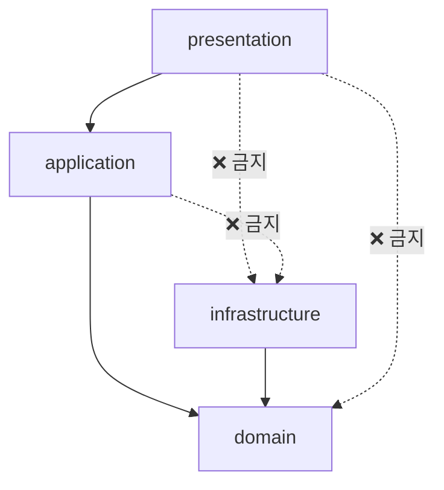
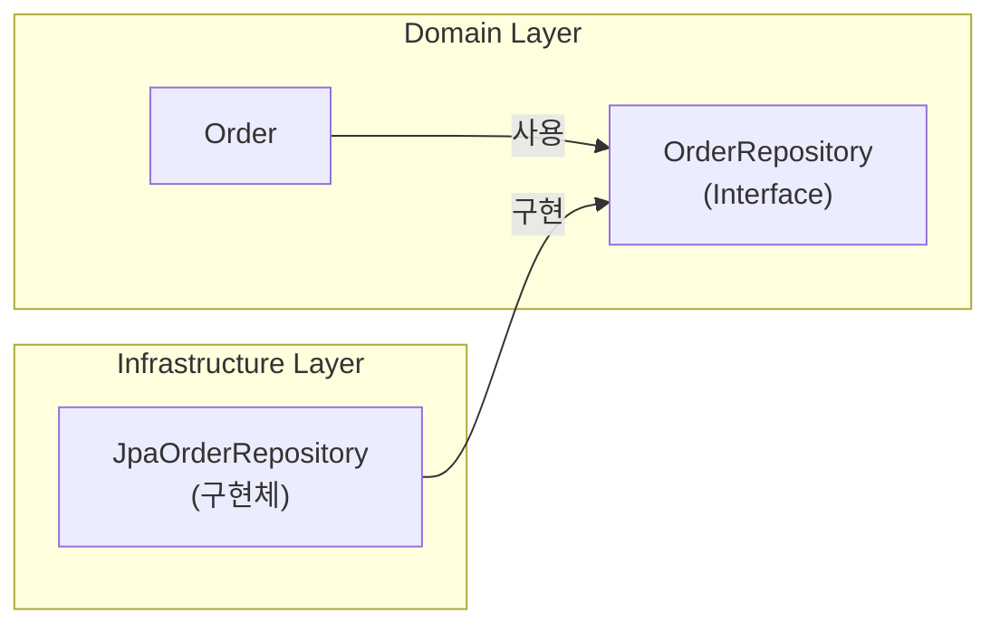
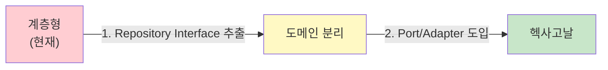

# 계층형 아키텍처 (Layered Architecture)

가장 기본적이고 널리 사용되는 아키텍처 패턴입니다. **처음 아키텍처를 배운다면 여기서 시작하세요.**

## 한 줄 요약

> **코드를 4개 층으로 나누고, 위에서 아래로만 호출한다**



---

## 왜 계층으로 나누나요?

### 비유: 회사 조직도

회사에서 일하는 방식을 생각해보세요:



- **고객 응대팀**은 고객이 뭘 원하는지 파악
- **기획팀**은 어떤 순서로 처리할지 조율
- **개발팀**은 실제 기능 개발
- **인프라팀**은 서버, DB 같은 기반 관리

각 팀이 자기 역할에 집중하니까 효율적이죠? 소프트웨어도 마찬가지입니다.

---

## 4가지 계층 상세 설명

### 1. Presentation Layer (표현 계층)

**역할:** 사용자와 소통하는 창구

```
사용자 ←→ [Presentation Layer] ←→ 나머지 시스템
```

이 계층이 하는 일:
- 사용자 입력 받기 (HTTP 요청, 화면 입력)
- 결과를 사용자에게 보여주기 (JSON 응답, HTML 페이지)
- 입력 형식 검증 ("이메일 형식이 맞나?")

```java
// Presentation Layer 예시: Controller
@RestController
@RequestMapping("/api/orders")
public class OrderController {

    private final OrderService orderService;  // Application Layer 호출

    // 사용자 요청 받기
    @PostMapping
    public ResponseEntity<OrderResponse> createOrder(
            @Valid @RequestBody CreateOrderRequest request) {

        // 1. 요청 데이터를 Application Layer에 전달
        OrderDto result = orderService.createOrder(
            request.getCustomerId(),
            request.getItems()
        );

        // 2. 결과를 사용자에게 응답
        return ResponseEntity.ok(OrderResponse.from(result));
    }

    @GetMapping("/{orderId}")
    public ResponseEntity<OrderResponse> getOrder(@PathVariable String orderId) {
        OrderDto order = orderService.getOrder(orderId);
        return ResponseEntity.ok(OrderResponse.from(order));
    }
}

// 요청/응답 객체 (DTO)
public record CreateOrderRequest(
    String customerId,
    List<OrderItemRequest> items
) {}

public record OrderResponse(
    String orderId,
    String status,
    BigDecimal totalAmount
) {
    public static OrderResponse from(OrderDto dto) {
        return new OrderResponse(dto.orderId(), dto.status(), dto.totalAmount());
    }
}
```


**흔한 실수: Presentation에 비즈니스 로직 넣기**

```java
// ❌ 잘못된 예: Controller에서 할인 계산
@PostMapping
public ResponseEntity<OrderResponse> createOrder(...) {
    // 이런 로직은 여기 있으면 안 됨!
    if (request.getTotalAmount() > 100000) {
        request.setDiscount(0.1);  // 10% 할인
    }
}
```

비즈니스 로직은 Domain Layer에 있어야 합니다.


---

### 2. Application Layer (응용 계층)

**역할:** 업무 흐름을 조율하는 지휘자

이 계층이 하는 일:
- 어떤 순서로 처리할지 결정
- 트랜잭션 관리
- Domain Layer의 객체들을 조합해서 사용

**중요:** Application Layer는 **"무엇을"** 할지 결정하고, **"어떻게"**는 Domain에게 맡깁니다.

```java
// Application Layer 예시: Service
@Service
@Transactional  // 트랜잭션 관리는 여기서
public class OrderService {

    private final OrderRepository orderRepository;
    private final CustomerRepository customerRepository;
    private final PaymentService paymentService;
    private final NotificationService notificationService;

    // 주문 생성 "흐름"을 조율
    public OrderDto createOrder(String customerId, List<OrderItemDto> items) {

        // 1. 고객 조회
        Customer customer = customerRepository.findById(customerId)
            .orElseThrow(() -> new CustomerNotFoundException(customerId));

        // 2. 주문 생성 (비즈니스 로직은 Order 객체 안에)
        Order order = Order.create(customer.getId(), toOrderLines(items));

        // 3. 저장
        orderRepository.save(order);

        // 4. 알림 발송
        notificationService.sendOrderCreatedNotification(order);

        // 5. 결과 반환
        return OrderDto.from(order);
    }

    // 주문 확정 "흐름"
    public void confirmOrder(String orderId) {
        // 1. 주문 조회
        Order order = orderRepository.findById(orderId)
            .orElseThrow(() -> new OrderNotFoundException(orderId));

        // 2. 결제 처리
        paymentService.processPayment(order.getTotalAmount());

        // 3. 주문 확정 (비즈니스 로직은 Order 안에)
        order.confirm();

        // 4. 저장
        orderRepository.save(order);
    }
}
```


**Application vs Domain의 차이**

```java
// Application Layer: "흐름" 조율
public void confirmOrder(String orderId) {
    Order order = orderRepository.findById(orderId);
    paymentService.processPayment(order.getTotalAmount());
    order.confirm();  // Domain에게 "확정해"라고 요청
    orderRepository.save(order);
}

// Domain Layer: "규칙" 적용
public class Order {
    public void confirm() {
        // 비즈니스 규칙: PENDING 상태에서만 확정 가능
        if (this.status != OrderStatus.PENDING) {
            throw new IllegalStateException("확정할 수 없는 상태입니다");
        }
        this.status = OrderStatus.CONFIRMED;
    }
}
```


---

### 3. Domain Layer (도메인 계층)

**역할:** 비즈니스 규칙의 심장 ❤️

가장 중요한 계층입니다. 여기에 "진짜 비즈니스 로직"이 있습니다.

이 계층이 하는 일:
- 비즈니스 규칙 표현 ("VIP 고객은 10% 할인")
- 데이터의 일관성 유지 ("주문 금액은 0원 이상")
- 도메인 개념 표현 (Order, Customer, Product)

```java
// Domain Layer 예시: Entity
public class Order {
    private OrderId id;
    private CustomerId customerId;
    private List<OrderLine> orderLines;
    private OrderStatus status;
    private Money totalAmount;

    // 생성 메서드: 비즈니스 규칙 적용
    public static Order create(CustomerId customerId, List<OrderLine> lines) {
        // 규칙: 주문에는 최소 1개 상품이 있어야 함
        if (lines.isEmpty()) {
            throw new IllegalArgumentException("주문에는 최소 1개 상품이 필요합니다");
        }

        Order order = new Order();
        order.id = OrderId.generate();
        order.customerId = customerId;
        order.orderLines = new ArrayList<>(lines);
        order.status = OrderStatus.PENDING;
        order.calculateTotal();

        return order;
    }

    // 비즈니스 로직: 상품 추가
    public void addItem(OrderLine line) {
        // 규칙: PENDING 상태에서만 상품 추가 가능
        validateModifiable();

        // 규칙: 같은 상품이면 수량만 증가
        orderLines.stream()
            .filter(existing -> existing.isSameProduct(line))
            .findFirst()
            .ifPresentOrElse(
                existing -> existing.increaseQuantity(line.getQuantity()),
                () -> orderLines.add(line)
            );

        calculateTotal();
    }

    // 비즈니스 로직: 주문 확정
    public void confirm() {
        // 규칙: PENDING 상태에서만 확정 가능
        if (this.status != OrderStatus.PENDING) {
            throw new IllegalStateException(
                "주문을 확정할 수 없습니다. 현재 상태: " + status
            );
        }

        // 규칙: 최소 주문 금액 체크
        if (this.totalAmount.isLessThan(Money.of(1000))) {
            throw new IllegalStateException("최소 주문 금액은 1,000원입니다");
        }

        this.status = OrderStatus.CONFIRMED;
    }

    // 비즈니스 로직: 주문 취소
    public void cancel() {
        // 규칙: 배송 시작 전에만 취소 가능
        if (this.status == OrderStatus.SHIPPED) {
            throw new IllegalStateException("배송이 시작된 주문은 취소할 수 없습니다");
        }

        this.status = OrderStatus.CANCELLED;
    }

    // 내부 로직
    private void calculateTotal() {
        this.totalAmount = orderLines.stream()
            .map(OrderLine::getAmount)
            .reduce(Money.ZERO, Money::add);
    }

    private void validateModifiable() {
        if (this.status != OrderStatus.PENDING) {
            throw new IllegalStateException("수정할 수 없는 상태입니다");
        }
    }
}
```

```java
// Domain Layer: Value Object
public record Money(BigDecimal amount) {

    public static final Money ZERO = new Money(BigDecimal.ZERO);

    public Money {
        // 불변식: 금액은 0 이상
        if (amount.compareTo(BigDecimal.ZERO) < 0) {
            throw new IllegalArgumentException("금액은 0 이상이어야 합니다");
        }
    }

    public static Money of(long amount) {
        return new Money(BigDecimal.valueOf(amount));
    }

    public Money add(Money other) {
        return new Money(this.amount.add(other.amount));
    }

    public Money multiply(int quantity) {
        return new Money(this.amount.multiply(BigDecimal.valueOf(quantity)));
    }

    public boolean isLessThan(Money other) {
        return this.amount.compareTo(other.amount) < 0;
    }
}
```


**흔한 실수: 빈약한 도메인 (Anemic Domain)**

```java
// ❌ 잘못된 예: 로직 없이 데이터만 있는 Entity
public class Order {
    private String id;
    private String status;
    private BigDecimal total;

    // getter, setter만 있음...
    public String getStatus() { return status; }
    public void setStatus(String status) { this.status = status; }
}

// 로직이 Service에 있음
public class OrderService {
    public void confirm(Order order) {
        if (order.getStatus().equals("PENDING")) {
            order.setStatus("CONFIRMED");  // 이러면 안 됨!
        }
    }
}
```

비즈니스 로직은 Entity 안에 있어야 합니다!


---

### 4. Infrastructure Layer (인프라 계층)

**역할:** 기술적 세부사항 처리

이 계층이 하는 일:
- 데이터베이스 접근 (JPA, MyBatis)
- 외부 API 호출 (REST Client)
- 메시지 발송 (Kafka, Email)
- 파일 저장

```java
// Infrastructure Layer: Repository 구현
@Repository
public class JpaOrderRepository implements OrderRepository {

    private final OrderJpaRepository jpaRepository;  // Spring Data JPA
    private final OrderMapper mapper;

    @Override
    public void save(Order order) {
        // Domain → JPA Entity 변환
        OrderEntity entity = mapper.toEntity(order);
        jpaRepository.save(entity);
    }

    @Override
    public Optional<Order> findById(OrderId id) {
        // JPA Entity → Domain 변환
        return jpaRepository.findById(id.getValue())
            .map(mapper::toDomain);
    }
}

// JPA Entity (Infrastructure 전용)
@Entity
@Table(name = "orders")
public class OrderEntity {
    @Id
    private String id;
    private String customerId;
    private String status;
    private BigDecimal totalAmount;

    @OneToMany(mappedBy = "order", cascade = CascadeType.ALL)
    private List<OrderLineEntity> orderLines;

    // getter, setter (Infrastructure에서만 사용)
}
```

```java
// Infrastructure Layer: 외부 API 연동
@Component
public class PaymentGatewayClient implements PaymentService {

    private final RestTemplate restTemplate;

    @Override
    public PaymentResult processPayment(Money amount) {
        PaymentRequest request = new PaymentRequest(amount.getAmount());

        ResponseEntity<PaymentResponse> response = restTemplate.postForEntity(
            "https://payment-api.example.com/pay",
            request,
            PaymentResponse.class
        );

        return toPaymentResult(response.getBody());
    }
}
```

---

## 패키지 구조

### 기본 구조

```
com.example.order/
├── presentation/              # Presentation Layer
│   ├── OrderController.java
│   ├── CreateOrderRequest.java
│   └── OrderResponse.java
│
├── application/               # Application Layer
│   ├── OrderService.java
│   └── OrderDto.java
│
├── domain/                    # Domain Layer
│   ├── Order.java
│   ├── OrderLine.java
│   ├── OrderId.java
│   ├── OrderStatus.java
│   ├── Money.java
│   └── OrderRepository.java   # Interface (구현은 Infrastructure에)
│
└── infrastructure/            # Infrastructure Layer
    ├── persistence/
    │   ├── JpaOrderRepository.java
    │   ├── OrderEntity.java
    │   └── OrderMapper.java
    └── external/
        └── PaymentGatewayClient.java
```

### 의존성 방향



**핵심 규칙:**
- 위에서 아래로만 의존
- Domain은 아무것도 의존하지 않음
- Infrastructure는 Domain의 인터페이스를 구현

---

## 의존성 역전 (DIP)

"Domain이 Infrastructure에 의존하지 않는다"는 말이 이상하게 들릴 수 있습니다. Repository를 사용하는데 어떻게 의존하지 않을 수 있을까요?

### 비밀: 인터페이스



```java
// Domain Layer: 인터페이스 정의
public interface OrderRepository {
    void save(Order order);
    Optional<Order> findById(OrderId id);
}

// Domain Layer: Service는 인터페이스만 사용
@Service
public class OrderService {
    private final OrderRepository orderRepository;  // 인터페이스 타입

    public void createOrder(...) {
        orderRepository.save(order);  // 구체적 구현을 모름
    }
}

// Infrastructure Layer: 인터페이스 구현
@Repository
public class JpaOrderRepository implements OrderRepository {
    // JPA 사용하여 구현
}
```

**이렇게 하면:**
- Domain은 `OrderRepository` 인터페이스만 알면 됨
- JPA를 MyBatis로 바꿔도 Domain 코드 변경 없음
- 테스트할 때 가짜(Mock) Repository 사용 가능

---

## 계층형의 장단점

### 장점

| 장점 | 설명 |
|------|------|
| **쉬운 이해** | 직관적인 위→아래 흐름 |
| **명확한 역할** | 각 계층이 뭘 하는지 분명 |
| **빠른 시작** | 복잡한 설정 없이 바로 적용 가능 |
| **팀 협업** | "너는 Controller, 나는 Service" 분업 가능 |

### 단점

| 단점 | 설명 |
|------|------|
| **계층 통과 강제** | 단순한 조회도 모든 계층 거쳐야 함 |
| **기술 의존성** | Infrastructure 변경이 Domain에 영향 줄 수 있음 |
| **테스트 어려움** | Mock 없이는 테스트하기 어려움 |

---

## 흔한 실수들

### 1. 계층 건너뛰기

```java
// ❌ Controller에서 Repository 직접 접근
@RestController
public class OrderController {
    @Autowired
    private OrderRepository orderRepository;  // Application Layer 건너뜀!

    @GetMapping("/{id}")
    public Order getOrder(@PathVariable String id) {
        return orderRepository.findById(id);  // 검증, 변환 없이 바로 반환
    }
}
```

```java
// ✅ 올바른 방법: Application Layer 통과
@RestController
public class OrderController {
    private final OrderService orderService;  // Application Layer

    @GetMapping("/{id}")
    public OrderResponse getOrder(@PathVariable String id) {
        OrderDto dto = orderService.getOrder(id);  // Service 통과
        return OrderResponse.from(dto);
    }
}
```

### 2. Domain에 기술적 코드

```java
// ❌ Domain Entity에 JPA 어노테이션
@Entity
@Table(name = "orders")
public class Order {
    @Id
    @GeneratedValue
    private Long id;

    @OneToMany(cascade = CascadeType.ALL)
    private List<OrderLine> lines;
}
```

순수한 Domain 모델을 유지하려면 Infrastructure에 별도 Entity를 만드세요.

### 3. 순환 의존

```java
// ❌ 순환 의존
// OrderService → PaymentService → OrderService

@Service
public class OrderService {
    private final PaymentService paymentService;
}

@Service
public class PaymentService {
    private final OrderService orderService;  // 순환!
}
```

```java
// ✅ 이벤트로 해결
@Service
public class OrderService {
    private final EventPublisher eventPublisher;

    public void confirmOrder(String orderId) {
        // ...
        eventPublisher.publish(new OrderConfirmedEvent(order));
    }
}

@Component
public class PaymentEventHandler {
    @EventListener
    public void onOrderConfirmed(OrderConfirmedEvent event) {
        // 결제 처리
    }
}
```

---

## 테스트 전략

### 1. Domain Layer 테스트 (가장 쉬움)

외부 의존성 없이 순수 로직만 테스트:

```java
class OrderTest {

    @Test
    void 주문_생성_시_총액이_계산된다() {
        // Given
        List<OrderLine> lines = List.of(
            new OrderLine(ProductId.of("P1"), 2, Money.of(10000)),
            new OrderLine(ProductId.of("P2"), 1, Money.of(5000))
        );

        // When
        Order order = Order.create(CustomerId.of("C1"), lines);

        // Then
        assertThat(order.getTotalAmount()).isEqualTo(Money.of(25000));
    }

    @Test
    void PENDING_상태에서만_확정_가능하다() {
        Order order = createPendingOrder();

        order.confirm();

        assertThat(order.getStatus()).isEqualTo(OrderStatus.CONFIRMED);
    }

    @Test
    void 배송_시작된_주문은_취소할_수_없다() {
        Order order = createShippedOrder();

        assertThrows(IllegalStateException.class, () -> order.cancel());
    }
}
```

### 2. Application Layer 테스트 (Mock 사용)

```java
@ExtendWith(MockitoExtension.class)
class OrderServiceTest {

    @Mock
    private OrderRepository orderRepository;

    @Mock
    private NotificationService notificationService;

    @InjectMocks
    private OrderService orderService;

    @Test
    void 주문_생성_성공() {
        // Given
        String customerId = "customer-1";
        List<OrderItemDto> items = List.of(
            new OrderItemDto("product-1", 2, 10000)
        );

        // When
        OrderDto result = orderService.createOrder(customerId, items);

        // Then
        verify(orderRepository).save(any(Order.class));
        verify(notificationService).sendOrderCreatedNotification(any());
        assertThat(result.orderId()).isNotNull();
    }
}
```

### 3. Infrastructure Layer 테스트 (통합 테스트)

```java
@DataJpaTest
class JpaOrderRepositoryTest {

    @Autowired
    private OrderJpaRepository jpaRepository;

    private JpaOrderRepository repository;

    @BeforeEach
    void setUp() {
        repository = new JpaOrderRepository(jpaRepository, new OrderMapper());
    }

    @Test
    void 주문을_저장하고_조회한다() {
        // Given
        Order order = createTestOrder();

        // When
        repository.save(order);
        Optional<Order> found = repository.findById(order.getId());

        // Then
        assertThat(found).isPresent();
        assertThat(found.get().getId()).isEqualTo(order.getId());
    }
}
```

---

## 언제 계층형을 사용하나요?

### 적합한 경우

- ✅ 프로젝트 초기 단계
- ✅ 팀이 아키텍처 패턴 경험이 적을 때
- ✅ 비즈니스 로직이 복잡하지 않을 때
- ✅ 빠른 개발이 필요할 때

### 부적합한 경우

- ❌ 외부 시스템 연동이 많을 때 → [헥사고날](../hexagonal-architecture/) 고려
- ❌ 복잡한 도메인 로직 → [어니언](../onion-architecture/) 고려
- ❌ 대규모 팀, 장기 프로젝트 → [클린](../clean-architecture/) 고려

---

## 다음 단계로 발전하기

계층형이 익숙해지면, 필요에 따라 더 발전된 패턴으로 이동할 수 있습니다:



**1단계: Repository Interface를 Domain으로 이동**
```java
// Before: Infrastructure에 있던 것을
// After: Domain으로 이동
package com.example.domain;

public interface OrderRepository {
    void save(Order order);
    Optional<Order> findById(OrderId id);
}
```

**2단계: 더 많은 외부 연동을 Interface로 추상화**

이 과정을 거치면 자연스럽게 헥사고날 아키텍처로 발전합니다.

---

## 다음 단계

- [헥사고날 아키텍처](../hexagonal-architecture/) - Port와 Adapter로 외부 격리
- [클린 아키텍처](../clean-architecture/) - 엄격한 의존성 규칙
- [어니언 아키텍처](../onion-architecture/) - 도메인 모델 중심
