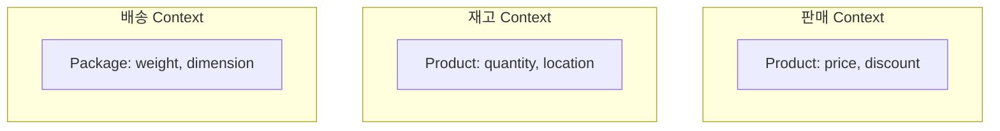
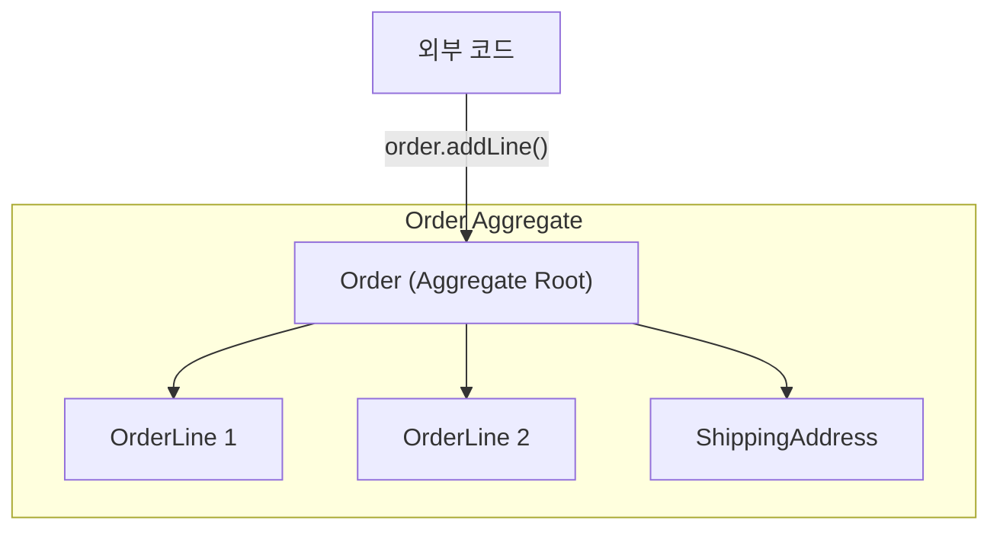
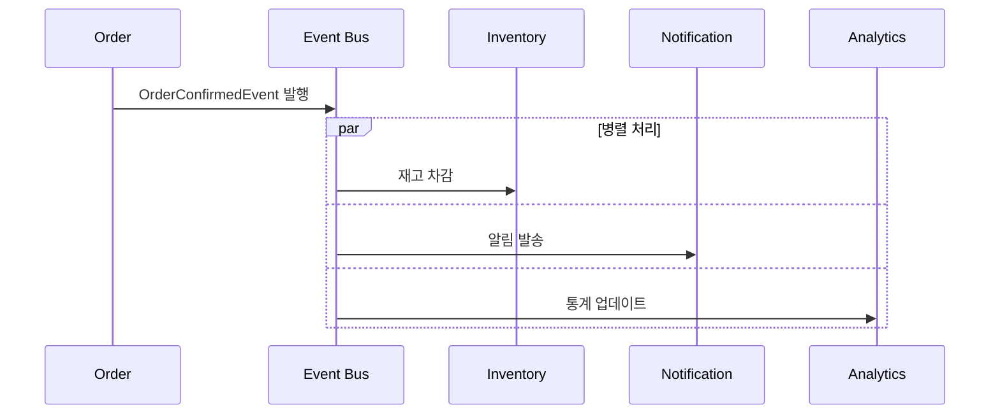

이 섹션에서는 DDD의 핵심 개념을 빠르게 살펴봅니다. 복잡한 비즈니스 시스템을 개발하다 보면 개발자와 기획자가 서로 다른 용어를 사용하고, 비즈니스 로직이 코드 곳곳에 분산되어 있으며, 작은 변경에도 전체 시스템에 영향이 미치는 문제를 경험하게 됩니다. 코드를 읽어도 비즈니스가 어떻게 동작하는지 이해하기 어려운 상황도 흔합니다.

#### DDD가 해결하는 문제

다음과 같은 대화가 익숙하다면 DDD가 도움이 될 수 있습니다.

```
기획자: "고객이 주문을 취소하면 포인트 환불해주세요"
개발자: "아, 그러면 order 테이블의 status를 9로 바꾸고,
        point 테이블에서 해당 user_id로 INSERT 하면 되죠?"
기획자: "...네? status 9가 뭐예요?"
```

이런 간극은 기술 중심으로 코드를 작성하기 때문에 발생합니다. DDD는 비즈니스 도메인을 코드에 그대로 반영하여 이 간극을 메웁니다. 비즈니스에서 "주문", "결제", "배송"이라고 말하면 코드에서도 Order, Payment, Shipping이 1:1로 매핑됩니다.

#### Before vs After: 실제 코드 비교

주문 확정이라는 비즈니스 시나리오를 통해 기존 방식과 DDD 방식의 차이를 비교해보겠습니다. 비즈니스 규칙은 다음과 같습니다. 대기 중인 주문만 확정할 수 있고, 확정 시 재고를 차감하며, 고객에게 알림을 보냅니다.

**기존 방식: 데이터 중심 (Transaction Script)**

아래 코드는 기존 방식으로 작성된 주문 확정 로직입니다. 이 접근법에서는 서비스 클래스가 모든 비즈니스 로직을 포함하고, 엔티티는 단순한 데이터 컨테이너 역할만 합니다.

```java
@Service
public class OrderService {

    public void confirmOrder(Long orderId) {
        // 1. 데이터 조회
        OrderEntity order = orderRepository.findById(orderId)
            .orElseThrow(() -> new RuntimeException("주문 없음"));

        // 2. 상태 검증 (매직 넘버)
        if (order.getStatus() != 0) {  // 0이 뭐지? PENDING?
            throw new RuntimeException("확정 불가");
        }

        // 3. 상태 변경
        order.setStatus(1);  // 1이 뭐지? CONFIRMED?
        order.setConfirmedAt(LocalDateTime.now());

        // 4. 재고 차감 (여기서 해야 하나?)
        for (OrderItemEntity item : order.getItems()) {
            ProductEntity product = productRepository.findById(item.getProductId())
                .orElseThrow();
            int newStock = product.getStock() - item.getQuantity();
            if (newStock < 0) {
                throw new RuntimeException("재고 부족");
            }
            product.setStock(newStock);
            productRepository.save(product);
        }

        // 5. 알림 (여기서 해야 하나?)
        notificationService.send(order.getUserId(), "주문 확정됨");

        orderRepository.save(order);
    }
}
```

이 코드의 문제점을 정리하면 다음과 같습니다. status 값 0과 1이 무엇을 의미하는지 코드만으로는 알 수 없습니다. Entity는 getter/setter만 있는 빈약한 모델이고, 검증, 재고 차감, 알림 발송 로직이 한 메서드에 혼재되어 있습니다. 데이터베이스와 외부 서비스에 의존하여 단위 테스트가 어렵고, 다른 곳에서도 status를 직접 변경할 수 있어 위험합니다.

| 문제 | 설명 |
|------|------|
| 매직 넘버 | `status = 0, 1`이 무슨 의미인지 모름 |
| 빈약한 모델 | Entity는 getter/setter만 있는 데이터 컨테이너 |
| 로직 분산 | 검증, 재고, 알림이 한 메서드에 혼재 |
| 테스트 어려움 | DB, 외부 서비스 의존으로 단위 테스트 불가 |
| 변경 위험 | 다른 곳에서도 status를 직접 변경할 수 있음 |

**DDD 방식: 도메인 중심**

DDD 방식에서는 비즈니스 로직이 도메인 객체 안에 응집됩니다. 아래 코드는 Order Aggregate가 자신의 불변식을 스스로 보호하고, 비즈니스 행위를 메서드로 표현하는 예시입니다.

```java
// 도메인 모델 - 비즈니스 로직이 객체 안에
public class Order extends AggregateRoot<OrderId> {
    private OrderId id;
    private CustomerId customerId;
    private OrderStatus status;
    private List<OrderLine> orderLines;

    // 비즈니스 행위가 메서드로 표현됨
    public void confirm() {
        // 불변식 검증
        if (this.status != OrderStatus.PENDING) {
            throw new OrderCannotBeConfirmedException(
                "대기 중인 주문만 확정할 수 있습니다. 현재 상태: " + this.status
            );
        }

        // 상태 변경
        this.status = OrderStatus.CONFIRMED;
        this.confirmedAt = LocalDateTime.now();

        // 도메인 이벤트 발행 (재고, 알림은 이벤트 구독자가 처리)
        registerEvent(new OrderConfirmedEvent(this));
    }

    public Money calculateTotal() {
        return orderLines.stream()
            .map(OrderLine::getAmount)
            .reduce(Money.ZERO, Money::add);
    }
}
```

애플리케이션 서비스는 흐름만 조율하고 실제 비즈니스 로직은 도메인 객체에 위임합니다.

```java
// 애플리케이션 서비스 - 흐름만 조율
@Service
@Transactional
public class OrderApplicationService {

    public void confirmOrder(OrderId orderId) {
        Order order = orderRepository.findById(orderId)
            .orElseThrow(() -> new OrderNotFoundException(orderId));

        order.confirm();  // 도메인 객체에 위임

        orderRepository.save(order);
        // 이벤트는 인프라에서 자동 발행
    }
}
```

재고 차감과 알림 발송은 이벤트 핸들러로 분리되어 관심사가 명확하게 분리됩니다.

```java
// 이벤트 핸들러들 - 관심사 분리
@Component
public class InventoryEventHandler {
    @EventListener
    public void on(OrderConfirmedEvent event) {
        inventoryService.reserveStock(event.getOrderLines());
    }
}

@Component
public class NotificationEventHandler {
    @EventListener
    public void on(OrderConfirmedEvent event) {
        notificationService.sendOrderConfirmation(event.getCustomerId());
    }
}
```

DDD 방식으로 개선된 점을 정리하면 다음과 같습니다. `order.confirm()`으로 비즈니스 의도가 명확하게 표현되고, Order가 자신의 불변식을 스스로 보호합니다. 재고와 알림은 이벤트 핸들러로 분리되어 관심사가 명확해지고, Order 클래스만으로 단위 테스트가 가능합니다. status는 confirm() 메서드를 통해서만 변경할 수 있어 안전합니다.

| 개선 | 설명 |
|------|------|
| 명확한 의도 | `order.confirm()`으로 비즈니스 의도 표현 |
| 풍부한 모델 | Order가 자신의 불변식을 스스로 보호 |
| 관심사 분리 | 재고, 알림은 이벤트 핸들러로 분리 |
| 테스트 용이 | Order 단위 테스트 가능 |
| 변경 안전 | status는 confirm() 메서드로만 변경 가능 |

#### DDD의 두 가지 설계 수준

DDD는 전략적 설계와 전술적 설계라는 두 가지 수준으로 나뉩니다. 전략적 설계는 "시스템을 어떻게 나눌까?"라는 큰 그림의 질문에 답하며, Bounded Context, Context Mapping, Ubiquitous Language, Subdomain을 다룹니다. 전술적 설계는 "도메인을 어떻게 모델링할까?"라는 세부 구현의 질문에 답하며, Entity, Value Object, Aggregate, Repository, Domain Service, Domain Event 패턴을 제공합니다.

| 구분 | 초점 | 질문 | 주요 산출물 |
|------|------|------|-----------|
| 전략적 설계 | 큰 그림, 경계 | "시스템을 어떻게 나눌까?" | Context Map, 용어 사전 |
| 전술적 설계 | 세부 구현, 패턴 | "도메인을 어떻게 모델링할까?" | 도메인 모델, 코드 |

#### 핵심 용어 한눈에 보기

**Bounded Context (경계된 컨텍스트)**

같은 용어도 맥락에 따라 다른 의미를 가집니다. 예를 들어 "상품"이라는 용어는 판매 Context에서는 "얼마에 팔 것인가"(가격, 할인)에 초점을 맞추고, 재고 Context에서는 "몇 개 있는가"(수량, 위치)에 초점을 맞추며, 배송 Context에서는 "어떻게 보낼 것인가"(무게, 크기)에 초점을 맞춥니다. 각 Context는 자신만의 모델을 가지며, 이를 통해 각 영역의 복잡성을 독립적으로 관리할 수 있습니다.



**Aggregate (집합체)**

Aggregate는 트랜잭션 일관성을 유지하는 객체들의 묶음입니다. 외부에서는 반드시 Aggregate Root를 통해서만 접근하며, 하나의 트랜잭션에서는 하나의 Aggregate만 수정합니다. Aggregate 내부의 일관성은 Root가 책임집니다. 아래 다이어그램에서 Order가 Aggregate Root이고, OrderLine과 ShippingAddress는 Order를 통해서만 접근 가능합니다.



**Ubiquitous Language (유비쿼터스 언어)**

개발자와 비즈니스 전문가가 동일한 용어를 사용합니다. 기획자가 "주문 확정"이라고 말하면 개발자도 `order.confirm()`으로 코드를 작성하고, QA도 "주문 확정 테스트"라고 테스트 케이스를 명명합니다. 이렇게 비즈니스 용어와 코드, 테스트가 일관된 언어를 사용하면 커뮤니케이션 오해가 줄어들고 코드의 의도를 파악하기 쉬워집니다.

| 비즈니스 용어 | 코드 | 테스트 |
|--------------|------|--------|
| 주문을 **생성**한다 | `Order.create()` | `주문_생성_테스트()` |
| 주문을 **확정**한다 | `order.confirm()` | `주문_확정_테스트()` |
| 주문을 **취소**한다 | `order.cancel()` | `주문_취소_테스트()` |
| **배송지**를 변경한다 | `order.changeShippingAddress()` | `배송지_변경_테스트()` |

**Domain Event (도메인 이벤트)**

도메인 이벤트는 도메인에서 발생한 중요한 사건을 표현합니다. 이벤트는 과거형으로 명명하여 이미 일어난 사실임을 나타내고(예: OrderConfirmed), 발행 후 변경 불가하며, 처리에 필요한 정보를 자체적으로 포함합니다. 이벤트를 통해 다른 도메인 영역과 느슨하게 결합하여 통신할 수 있습니다.



#### 언제 DDD를 적용해야 할까?

DDD 적용 여부를 결정할 때는 비즈니스 로직의 복잡도, 도메인 전문가와의 협업 필요성, 시스템의 예상 수명을 고려해야 합니다. 복잡한 비즈니스 규칙이 있는 금융, 보험, 물류, 의료 분야나 빈번한 요구사항 변경이 예상되는 스타트업, 신규 사업에서 DDD가 효과적입니다. 도메인 전문가와 협업할 수 있고 5년 이상 장기 운영이 예상되는 시스템에도 적합합니다.

반면에 단순 CRUD 애플리케이션에는 Spring Data REST가, 프로토타입에는 빠른 구현이, 소규모 팀에는 단순 계층형 아키텍처가, 짧은 수명의 프로젝트에는 실용적 접근이 더 적합할 수 있습니다.

#### 다음 단계

핵심 개념을 이해했다면 이제 깊이 있게 살펴봅시다. Quick Start에서 시작하여 [전략적 설계](../concepts/strategic-design/)에서 Bounded Context와 Context Mapping을 배우고, [전술적 설계](../concepts/tactical-design/)에서 Entity, Value Object, Aggregate 패턴을 학습한 후, [아키텍처](../concepts/architecture/)에서 Hexagonal과 Clean Architecture를 익히고 실습 예제로 마무리하는 것이 권장 학습 경로입니다.
