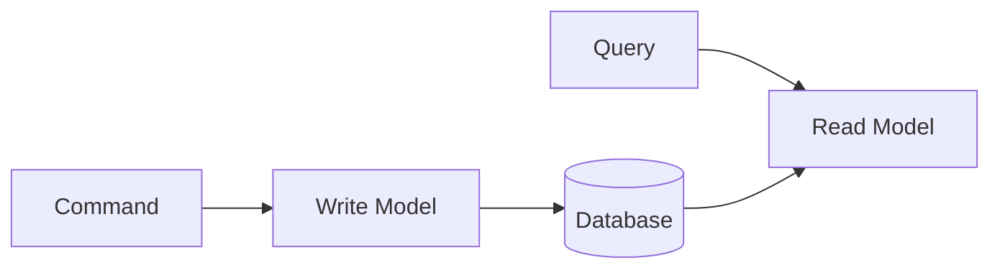

# DDD 용어 사전

Domain-Driven Design의 핵심 용어를 정리합니다. 상세 설명은 [개념 이해](../concepts/) 섹션을 참고하세요.

> **TL;DR**
>
> - **전략적 설계**: Bounded Context, Context Mapping, Ubiquitous Language로 도메인 경계와 언어 정의
> - **전술적 설계**: Entity, Value Object, Aggregate, Repository, Domain Event로 도메인 모델 구현
> - **아키텍처 패턴**: Layered, Hexagonal, CQRS, Event Sourcing으로 시스템 구조화

## 전략적 설계 (Strategic Design)

> 📖 자세한 내용: [전략적 설계](../concepts/strategic-design/)

### Bounded Context (경계된 컨텍스트)

**정의:** 특정 도메인 모델이 적용되고 일관성을 유지하는 명시적 경계

**특징:**
- 같은 용어도 Context마다 다른 의미를 가질 수 있음
- 각 Context는 독립적인 모델을 가짐
- 보통 하나의 팀이 하나의 Context를 담당
- [Context Mapping](#context-mapping-컨텍스트-매핑)으로 다른 Context와의 관계를 정의

**예시:**
- 판매 Context의 "Product" = 가격, 프로모션
- 재고 Context의 "Product" = 수량, 창고 위치

📖 [전략적 설계 상세](../concepts/strategic-design/#bounded-context)

---

### Context Mapping (컨텍스트 매핑)

**정의:** [Bounded Context](#bounded-context-경계된-컨텍스트) 간의 관계와 통합 방식을 정의하는 것

**주요 패턴:**

| 패턴 | 설명 | 사용 시점 |
|------|------|----------|
| **Shared Kernel** | 두 Context가 모델 일부를 공유 | 긴밀한 협력 필요 |
| **Customer-Supplier** | 공급자가 API 제공, 소비자가 사용 | 의존 관계 명확 |
| **Conformist** | 소비자가 공급자 모델을 그대로 따름 | 협상력 없을 때 |
| **Anti-Corruption Layer** | 번역 계층으로 외부 모델 변환 | 레거시 통합 |
| **Open Host Service** | 표준 API 공개 | 다수 소비자 |
| **Published Language** | 표준 데이터 형식 사용 | [Domain Event](#domain-event-도메인-이벤트) 통합 |

📖 [전략적 설계 상세](../concepts/strategic-design/#context-mapping)

---

### Ubiquitous Language (유비쿼터스 언어)

**정의:** 개발자와 도메인 전문가가 공유하는 공통 언어

**특징:**
- 코드, 문서, 대화에서 동일한 용어 사용
- [Bounded Context](#bounded-context-경계된-컨텍스트)마다 별도의 언어 존재 가능
- 이 용어 사전처럼 정의하고 관리

**실천 방법:**
```
비즈니스 용어: "주문을 확정한다"
코드: order.confirm()
테스트: @Test void 주문_확정_시_상태가_CONFIRMED로_변경된다()
```

📖 [전략적 설계 상세](../concepts/strategic-design/#ubiquitous-language)

---

### Core Domain (핵심 도메인)

**정의:** 비즈니스의 핵심 경쟁력이 되는 도메인

**특징:**
- 가장 중요하고 복잡한 비즈니스 로직 포함
- 최고의 개발자가 담당해야 함
- 외부에 위임하면 안 됨
- [Aggregate](#aggregate-집합체)로 모델링하여 복잡성 관리

📖 [전략적 설계 상세](../concepts/strategic-design/#domain-types)

---

### Supporting Domain (지원 도메인)

**정의:** [Core Domain](#core-domain-핵심-도메인)을 지원하지만 핵심은 아닌 도메인

**특징:**
- 비즈니스에 필요하지만 차별화 요소는 아님
- 외부 솔루션 사용 가능
- 예: 사용자 인증, 알림

---

### Generic Domain (일반 도메인)

**정의:** 모든 비즈니스에 공통적으로 필요한 도메인

**특징:**
- 표준 솔루션 구매/사용 가능
- 예: 이메일, 결제 게이트웨이

> **전략적 설계 핵심 포인트**
>
> - **Bounded Context**: 도메인 모델이 적용되는 명시적 경계
> - **Context Mapping**: Bounded Context 간의 관계와 통합 방식 정의
> - **Ubiquitous Language**: 개발자와 도메인 전문가가 공유하는 공통 언어
> - **도메인 분류**: Core(핵심) > Supporting(지원) > Generic(일반) 순으로 투자 우선순위

---

## 전술적 설계 (Tactical Design)

> 📖 자세한 내용: [전술적 설계](../concepts/tactical-design/)

### Entity (엔티티)

**정의:** 고유 식별자(Identity)로 구분되는 도메인 객체

**특징:**
- 상태가 변경되어도 동일한 객체
- 생명주기 존재 (생성 → 변경 → 소멸)
- 식별자로 동등성 판단
- [Aggregate](#aggregate-집합체)의 구성 요소

**관련 용어:** [Value Object](#value-object-값-객체), [Aggregate Root](#aggregate-root-집합-루트)

```java
// 식별자로 동등성 판단
@Override
public boolean equals(Object o) {
    if (!(o instanceof Order order)) return false;
    return id.equals(order.id);
}
```

📖 [전술적 설계 상세](../concepts/tactical-design/#entity) | [주문 도메인 예제](../examples/order-domain/)

---

### Value Object (값 객체)

**정의:** 속성 값으로 동등성이 결정되는 불변 객체

**특징:**
- 불변 (Immutable)
- 모든 속성이 같으면 같은 객체
- 부수효과 없는 메서드만 제공
- 자체적으로 유효성 검증

**관련 용어:** [Entity](#entity-엔티티) - 식별자 기반 동등성과 비교

```java
public record Money(BigDecimal amount, Currency currency) {
    public Money add(Money other) {
        return new Money(amount.add(other.amount), currency);
    }
}
```

📖 [전술적 설계 상세](../concepts/tactical-design/#value-object) | [주문 도메인 예제](../examples/order-domain/#value-object)

---

### Aggregate (집합체)

**정의:** 데이터 변경의 단위로 취급되는 연관 객체들의 묶음

**특징:**
- [Aggregate Root](#aggregate-root-집합-루트)를 통해서만 접근
- 하나의 트랜잭션 = 하나의 Aggregate
- 진정한 불변식(Invariant)을 보호

**설계 원칙:**
1. 작게 유지
2. 다른 Aggregate는 ID로만 참조
3. 경계 밖은 [Domain Event](#domain-event-도메인-이벤트)로 결과적 일관성

**관련 용어:** [Entity](#entity-엔티티), [Value Object](#value-object-값-객체), [Repository](#repository-리포지토리)

📖 [Aggregate 상세](../concepts/aggregate/) | [Aggregate 패턴](../concepts/aggregate-patterns/)

---

### Aggregate Root (집합 루트)

**정의:** [Aggregate](#aggregate-집합체)의 진입점이 되는 [Entity](#entity-엔티티)

**책임:**
- 외부와의 유일한 접점
- Aggregate 내부 일관성 보장
- [Domain Event](#domain-event-도메인-이벤트) 발행

```java
public class Order extends AggregateRoot<OrderId> {
    private List<OrderLine> orderLines;

    public void addOrderLine(OrderLine line) {
        // 불변식 검증
        validateMaxLines();
        orderLines.add(line);
        recalculateTotal();
    }
}
```

📖 [Aggregate 상세](../concepts/aggregate/#aggregate-root) | [주문 도메인 예제](../examples/order-domain/)

---

### Repository (리포지토리)

**정의:** [Aggregate](#aggregate-집합체)의 영속성을 추상화하는 인터페이스

**특징:**
- [Aggregate Root](#aggregate-root-집합-루트)만 Repository를 가짐
- Collection처럼 동작
- 도메인 계층에 인터페이스, 인프라에 구현 ([Hexagonal Architecture](#hexagonal-architecture-헥사고날-아키텍처) 참고)

```java
// 도메인 계층
public interface OrderRepository {
    Order save(Order order);
    Optional<Order> findById(OrderId id);
}

// 인프라 계층
@Repository
public class JpaOrderRepository implements OrderRepository { }
```

📖 [전술적 설계 상세](../concepts/tactical-design/#repository)

---

### Domain Service (도메인 서비스)

**정의:** 특정 [Entity](#entity-엔티티)에 속하지 않는 도메인 로직을 담는 서비스

**사용 시점:**
- 여러 [Aggregate](#aggregate-집합체)에 걸친 연산
- 외부 서비스가 필요한 도메인 로직
- Entity의 책임으로 보기 어려운 로직

**관련 용어:** [Application Service](#application-service-애플리케이션-서비스) - 유스케이스 조율과 비교

```java
@DomainService
public class DiscountCalculator {
    public Money calculate(Order order, Customer customer) {
        // 여러 Aggregate 정보 필요
    }
}
```

📖 [전술적 설계 상세](../concepts/tactical-design/#domain-service)

---

### Domain Event (도메인 이벤트)

**정의:** 도메인에서 발생한 비즈니스적으로 의미 있는 사건

**특징:**
- 과거형으로 명명 (OrderConfirmed)
- 불변 ([Value Object](#value-object-값-객체)처럼)
- 발생 시점 포함
- 필요한 정보 자체 포함

**활용:**
- [Aggregate](#aggregate-집합체) 간 결과적 일관성 달성
- [CQRS](#cqrs-command-query-responsibility-segregation)에서 Read Model 동기화
- [Event Sourcing](#event-sourcing-이벤트-소싱)의 기본 단위

```java
public class OrderConfirmedEvent extends DomainEvent {
    private final OrderId orderId;
    private final LocalDateTime confirmedAt;
}
```

📖 [도메인 이벤트 상세](../concepts/domain-events/) | [Event Sourcing 실습](../examples/event-sourcing/)

---

### Factory (팩토리)

**정의:** 복잡한 [Aggregate](#aggregate-집합체) 생성 로직을 캡슐화

**사용 시점:**
- 생성 로직이 복잡할 때
- 다른 서비스 조회가 필요할 때
- 여러 생성 방식이 있을 때

📖 [전술적 설계 상세](../concepts/tactical-design/#factory)

---

### Invariant (불변식)

**정의:** [Aggregate](#aggregate-집합체)가 항상 만족해야 하는 비즈니스 규칙

**특징:**
- 트랜잭션 내에서 항상 참이어야 함
- Aggregate 경계를 결정하는 핵심 기준
- 상태 변경 시마다 검증

**예시:**
```java
public class Order {
    private static final int MAX_ORDER_LINES = 100;

    public void addOrderLine(OrderLine line) {
        // 불변식: 주문 항목은 100개를 초과할 수 없다
        if (orderLines.size() >= MAX_ORDER_LINES) {
            throw new TooManyOrderLinesException();
        }
        orderLines.add(line);
    }
}
```

📖 [Aggregate 상세](../../concepts/aggregate/#invariant)

---

### Optimistic Locking (낙관적 락)

**정의:** 동시 수정 충돌을 감지하기 위해 버전 번호를 사용하는 방식

**특징:**
- 읽을 때 잠금 없이 버전 번호 확인
- 저장 시 버전이 변경되었으면 예외 발생
- 충돌 빈도가 낮을 때 효율적

**구현:**
```java
@Entity
public class OrderEntity {
    @Version
    private Long version;
}
```

📖 [Aggregate 실전 패턴](../../concepts/aggregate-patterns/#optimistic-locking)

---

### Reconstitute (복원)

**정의:** 저장된 데이터로부터 [Aggregate](#aggregate-집합체)를 재구성하는 것

**특징:**
- Factory 패턴의 일종
- 새로 생성(create)과 복원(reconstitute) 분리
- 복원 시에는 유효성 검증 생략 가능

**예시:**
```java
public class Order {
    // 새로 생성 - 이벤트 발행, 검증 수행
    public static Order create(CustomerId customerId, List<OrderLine> lines) {
        // 검증 및 이벤트 발행
    }

    // 저장된 상태에서 복원 - 검증 없이 상태만 복원
    public static Order reconstitute(OrderId id, OrderStatus status, ...) {
        // 상태만 복원
    }
}
```

📖 [Aggregate 실전 패턴](../../concepts/aggregate-patterns/#reconstitute)

---

### Application Service (애플리케이션 서비스)

**정의:** 유스케이스를 조율하는 서비스

**특징:**
- 트랜잭션 관리
- [Domain Service](#domain-service-도메인-서비스)와 [Repository](#repository-리포지토리) 조율
- 도메인 로직 포함하지 않음

**관련 용어:** [Domain Service](#domain-service-도메인-서비스) - 도메인 로직 담당과 비교

```java
@Service
@Transactional
public class OrderService {
    public OrderId createOrder(CreateOrderCommand command) {
        Order order = Order.create(...);  // 도메인에 위임
        return orderRepository.save(order).getId();
    }
}
```

📖 [애플리케이션 계층 실습](../examples/application-layer/)

> **전술적 설계 핵심 포인트**
>
> - **Entity**: ID로 식별, 상태 변경 가능
> - **Value Object**: 속성 값으로 동등성 판단, 불변
> - **Aggregate**: 데이터 변경의 단위, Root를 통해서만 접근
> - **Repository**: Aggregate Root의 영속성 추상화
> - **Domain Event**: 도메인에서 발생한 의미 있는 사건 (과거형 명명)
> - **Domain Service vs Application Service**: 도메인 로직 vs 유스케이스 조율

---

## 아키텍처 패턴

> 📖 자세한 내용: [아키텍처 개요](../concepts/architecture/)

### Layered Architecture (계층형 아키텍처)

```
┌─────────────────────────┐
│   Interfaces (API)      │
├─────────────────────────┤
│   Application           │ ← Application Service
├─────────────────────────┤
│   Domain                │ ← Entity, Value Object, Aggregate
├─────────────────────────┤
│   Infrastructure        │ ← Repository 구현
└─────────────────────────┘
```

**의존성 규칙:** 위에서 아래로만 의존

**관련 용어:** [Application Service](#application-service-애플리케이션-서비스), [Repository](#repository-리포지토리)

📖 [계층형 아키텍처 상세](../concepts/layered-architecture/)

---

### Hexagonal Architecture (헥사고날 아키텍처)

**다른 이름:** Ports and Adapters

**구조:**
- Port: 인터페이스 (도메인이 정의, 예: [Repository](#repository-리포지토리))
- Adapter: 구현체 (인프라가 제공)

```
           ┌─────────────┐
           │   Domain    │
           │  (Hexagon)  │
           └─────────────┘
          ↑               ↑
         Port            Port
          ↓               ↓
    ┌─────────┐     ┌──────────┐
    │ Adapter │     │ Adapter  │
    │ (Web)   │     │ (DB)     │
    └─────────┘     └──────────┘
```

**관련 패턴:** [Layered Architecture](#layered-architecture-계층형-아키텍처), Clean Architecture, Onion Architecture

📖 [헥사고날 아키텍처 상세](../concepts/hexagonal-architecture/) | [Clean Architecture](../concepts/clean-architecture/)

---

### Port (포트)

**정의:** [Hexagonal Architecture](#hexagonal-architecture-헥사고날-아키텍처)에서 도메인이 외부와 통신하기 위해 정의하는 인터페이스

**종류:**
- **Inbound Port (Driving Port)**: 외부에서 도메인을 호출하는 인터페이스 (예: Use Case)
- **Outbound Port (Driven Port)**: 도메인이 외부를 호출하는 인터페이스 (예: [Repository](#repository-리포지토리))

**관련 용어:** [Adapter](#adapter-어댑터), [Hexagonal Architecture](#hexagonal-architecture-헥사고날-아키텍처)

📖 [헥사고날 아키텍처 상세](../../concepts/hexagonal-architecture/#port)

---

### Adapter (어댑터)

**정의:** [Port](#port-포트)의 구현체로 실제 외부 시스템과 통신

**종류:**
- **Driving Adapter (Primary)**: Controller, CLI, 메시지 리스너 등 (도메인을 호출)
- **Driven Adapter (Secondary)**: DB Repository, 외부 API 클라이언트 등 (도메인에 의해 호출)

**예시:**
```java
// Driven Adapter - Repository 구현
@Repository
public class JpaOrderRepository implements OrderRepository {
    // Port 구현
}

// Driving Adapter - Controller
@RestController
public class OrderController {
    private final OrderService orderService; // Inbound Port
}
```

📖 [헥사고날 아키텍처 상세](../../concepts/hexagonal-architecture/#adapter)

---

### Clean Architecture (클린 아키텍처)

**정의:** Robert C. Martin이 제안한 의존성 규칙 기반 아키텍처

**구조 (동심원):**
- **Entity**: 비즈니스 규칙
- **Use Case**: 애플리케이션 비즈니스 규칙
- **Interface Adapter**: Controller, Gateway, Presenter
- **Framework & Driver**: 프레임워크, 데이터베이스

**핵심 규칙:** 의존성은 항상 바깥에서 안쪽으로만 향함

**관련 패턴:** [Hexagonal Architecture](#hexagonal-architecture-헥사고날-아키텍처), [Onion Architecture](#onion-architecture-어니언-아키텍처)

📖 [클린 아키텍처 상세](../../concepts/clean-architecture/)

---

### Onion Architecture (어니언 아키텍처)

**정의:** Jeffrey Palermo가 제안한 도메인 모델 중심 아키텍처

**구조 (양파 레이어):**
- **Domain Model** (가장 안쪽): [Entity](#entity-엔티티), [Value Object](#value-object-값-객체), [Aggregate](#aggregate-집합체)
- **Domain Service**: 여러 Aggregate 조합
- **Application Service**: 유스케이스 흐름 조율
- **Infrastructure** (가장 바깥): UI, DB, 외부 연동

**핵심 특징:**
- Domain Model이 어떤 것에도 의존하지 않음
- DDD와 가장 잘 어울리는 아키텍처
- [Repository](#repository-리포지토리) 인터페이스는 Domain에 위치

📖 [어니언 아키텍처 상세](../../concepts/onion-architecture/)

---

### Dependency Inversion (의존성 역전)

**정의:** 고수준 모듈이 저수준 모듈에 의존하지 않고, 둘 다 추상화에 의존하는 원칙

**DDD에서의 적용:**
```
Domain (고수준) → OrderRepository (Interface)
                         ↑
Infrastructure (저수준) → JpaOrderRepository (구현)
```

**효과:**
- 도메인이 인프라에 의존하지 않음
- 구현체 교체 용이 (JPA → MyBatis)
- 테스트 용이 (Mock 주입)

📖 [헥사고날 아키텍처](../../concepts/hexagonal-architecture/) | [어니언 아키텍처](../../concepts/onion-architecture/)

---

### CQRS (Command Query Responsibility Segregation)

**정의:** 명령(쓰기)과 조회(읽기)의 모델을 분리



**장점:**
- 각각 최적화 가능
- 조회 성능 향상
- 복잡성 분리

**관련 패턴:** [Event Sourcing](#event-sourcing-이벤트-소싱)과 함께 사용하면 Read Model을 [Domain Event](#domain-event-도메인-이벤트)로 동기화

📖 [CQRS 상세](../concepts/cqrs/)

---

### Event Sourcing (이벤트 소싱)

**정의:** 상태 대신 [Domain Event](#domain-event-도메인-이벤트)를 저장하고, 이벤트로부터 상태를 도출

```
이벤트 스트림:
[OrderCreated] → [OrderLineAdded] → [OrderConfirmed]
                           ↓
              현재 상태 = 이벤트 재생 결과
```

**장점:**
- 완전한 감사 추적
- 시간 여행 가능
- 이벤트 기반 통합에 적합

**관련 패턴:** [CQRS](#cqrs-command-query-responsibility-segregation), [Domain Event](#domain-event-도메인-이벤트)

📖 [Event Sourcing 실습](../examples/event-sourcing/) - EventStore, 스냅샷, 시간 여행 구현

> **아키텍처 패턴 핵심 포인트**
>
> - **Layered Architecture**: 위에서 아래로만 의존 (Interfaces → Application → Domain → Infrastructure)
> - **Hexagonal Architecture**: Port(인터페이스)와 Adapter(구현체)로 도메인을 외부로부터 보호
> - **CQRS**: 명령(쓰기)과 조회(읽기) 모델 분리로 각각 최적화
> - **Event Sourcing**: 상태 대신 이벤트를 저장하고 재생하여 현재 상태 도출

---

## 안티패턴

> 📖 자세한 내용: [안티패턴과 함정](../../concepts/anti-patterns/)

### Anemic Domain Model (빈약한 도메인 모델)

**정의:** [Entity](#entity-엔티티)가 데이터만 가지고 로직이 없는 상태

**증상:**
- Entity에 getter/setter만 존재
- 모든 비즈니스 로직이 Service에 분산
- Entity가 단순한 데이터 컨테이너

**해결책:** 비즈니스 로직을 [Entity](#entity-엔티티)와 [Aggregate](#aggregate-집합체)로 이동

📖 [안티패턴 상세](../../concepts/anti-patterns/#anemic-domain-model)

---

### God Aggregate

**정의:** 너무 많은 것을 포함하는 거대한 [Aggregate](#aggregate-집합체)

**증상:**
- 다른 Aggregate를 ID가 아닌 객체로 직접 참조
- 트랜잭션 범위가 과도하게 넓음
- 동시성 충돌 빈번

**해결책:** ID 참조로 분리, 작은 Aggregate 유지

📖 [안티패턴 상세](../../concepts/anti-patterns/#god-aggregate)

---

### Big Ball of Mud

**정의:** 모든 것을 하나의 거대한 [Bounded Context](#bounded-context-경계된-컨텍스트)로 만드는 것

**증상:**
- 병합 충돌 빈번
- 작은 변경에도 전체 재배포 필요
- 용어가 여러 의미로 혼용

**해결책:** 명확한 경계를 찾아 Context 분리

📖 [안티패턴 상세](../../concepts/anti-patterns/#big-ball-of-mud)

---

### Primitive Obsession (원시 타입 집착)

**정의:** 도메인 개념을 String, int 같은 원시 타입으로 표현

**문제점:**
- 컴파일러가 타입 검증 불가
- 잘못된 값이 쉽게 들어감
- 도메인 규칙 보호 불가

**해결책:** [Value Object](#value-object-값-객체) 사용

```java
// ❌ Primitive Obsession
public void createOrder(String customerId, String email, int amount)

// ✅ Value Object 사용
public void createOrder(CustomerId customerId, Email email, Money amount)
```

📖 [안티패턴 상세](../../concepts/anti-patterns/#primitive-obsession)

---

### Smart UI Anti-Pattern

**정의:** 비즈니스 로직이 UI나 Controller에 있는 상태

**문제점:**
- 테스트 어려움
- 재사용 불가
- 계층 책임 혼란

**해결책:** 로직을 도메인 계층으로 이동, Controller는 얇게 유지

📖 [안티패턴 상세](../../concepts/anti-patterns/#smart-ui)

---

## 테스트 패턴

> 📖 자세한 내용: [테스트 전략](../../concepts/testing/)

### Test Pyramid (테스트 피라미드)

**정의:** 단위 테스트를 가장 많이, E2E 테스트를 가장 적게 작성하는 전략

**구성:**
- **단위 테스트** (가장 많음): Domain Model, Value Object - 빠름, 비용 낮음
- **통합 테스트** (중간): Repository, 외부 연동 - 중간 속도
- **E2E 테스트** (가장 적음): 전체 시나리오 - 느림, 비용 높음

📖 [테스트 전략 상세](../../concepts/testing/#test-pyramid)

---

### Test Fixture

**정의:** 테스트에 필요한 기본 데이터를 생성하는 헬퍼 메서드 모음

**예시:**
```java
public class OrderFixtures {
    public static Order createPendingOrder() {
        return Order.create(customerId, createValidAddress(), createDefaultOrderLines());
    }

    public static Order createConfirmedOrder() {
        Order order = createPendingOrder();
        order.confirm();
        return order;
    }
}
```

📖 [테스트 전략 상세](../../concepts/testing/#test-fixture)

---

### Test Builder

**정의:** Fluent API를 사용하여 가독성 높은 테스트 데이터를 생성하는 패턴

**예시:**
```java
Order order = OrderBuilder.anOrder()
    .withCustomerId("VIP-001")
    .withOrderLine("PROD-001", "상품", 10000, 2)
    .confirmed()
    .build();
```

📖 [테스트 전략 상세](../../concepts/testing/#test-builder)

---

## 기타 용어

### DTO (Data Transfer Object)

**정의:** 계층 간 데이터 전송을 위한 객체

**특징:**
- 순수한 데이터 컨테이너
- 비즈니스 로직 없음
- 계층 간 의존성 분리

**사용 위치:**
- Presentation ↔ Application 계층 간 통신
- 외부 API 요청/응답

---

### Eventual Consistency (결과적 일관성)

**정의:** 즉각적인 일관성 대신 일정 시간 후에 일관성이 달성되는 것

**사용 시점:**
- [Aggregate](#aggregate-집합체) 경계를 넘는 연산
- [Domain Event](#domain-event-도메인-이벤트)를 통한 비동기 처리
- 마이크로서비스 간 통신

**관련 개념:** [Saga](#saga-사가)

📖 [도메인 이벤트 상세](../../concepts/domain-events/)

---

### Saga (사가)

**정의:** 여러 [Aggregate](#aggregate-집합체) 또는 서비스에 걸친 장기 실행 비즈니스 트랜잭션을 관리하는 패턴

**종류:**
- **Choreography**: 각 서비스가 이벤트에 반응하여 다음 단계 트리거
- **Orchestration**: 중앙 조정자가 순서 제어

**사용 시점:**
- 분산 트랜잭션 필요
- 여러 Aggregate의 결과적 일관성 달성

📖 [도메인 이벤트 상세](../../concepts/domain-events/#saga)

---

### Transaction Script

**정의:** 각 비즈니스 트랜잭션을 하나의 프로시저로 구현하는 패턴

**특징:**
- 단순한 CRUD에 적합
- 비즈니스 로직이 서비스에 집중
- 복잡해지면 유지보수 어려움

**비교:** [Anemic Domain Model](#anemic-domain-model-빈약한-도메인-모델)과 유사한 결과 초래 가능

---

> **안티패턴 & 테스트 핵심 포인트**
>
> - **Anemic Domain Model**: Entity에 로직 없이 getter/setter만 있음 → Rich Domain Model로 개선
> - **God Aggregate**: 너무 큰 Aggregate → ID 참조로 분리
> - **Test Pyramid**: 단위 테스트 많이, E2E 적게
> - **Eventual Consistency**: Domain Event로 Aggregate 간 결과적 일관성 달성

---

## 다음 단계

- [개념 이해](../concepts/) - 전략적/전술적 설계, 아키텍처
- [실습 예제](../examples/) - Spring Boot 기반 구현
- [참고 자료](references/) - 도서, 아티클, 발표 자료
- [FAQ](faq/) - 자주 묻는 질문
