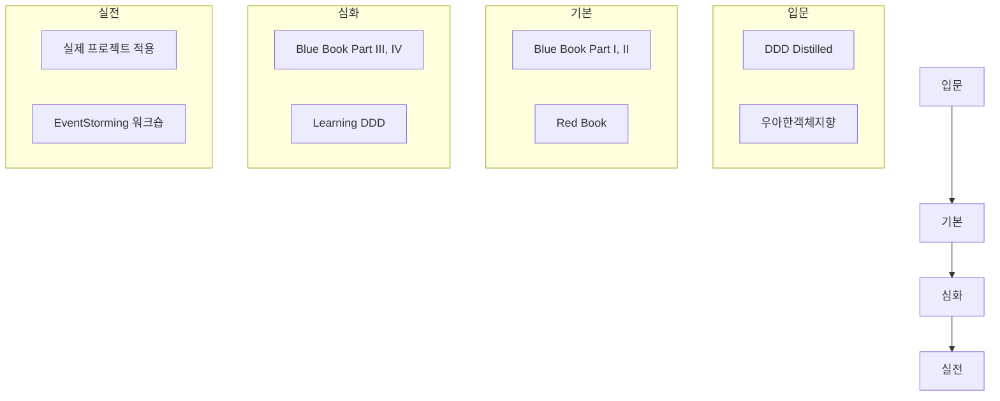

# 참고 자료

DDD 학습을 위한 도서, 아티클, 발표 자료를 정리합니다.


- **필독서**: Blue Book(원전), Red Book(구현), DDD Distilled(입문)
- **학습 순서**: 입문 → 기본 → 심화 → 실전 순으로 점진적 학습
- **한국어 자료**: DDD START(최범균), 우아한객체지향(조영호) 추천
- **실습**: 기존 프로젝트 리팩터링 또는 EventStorming으로 시작


## 필독서

### Domain-Driven Design (Blue Book)

- **저자:** Eric Evans
- **원서:** Domain-Driven Design: Tackling Complexity in the Heart of Software (2003)
- **한국어판:** 도메인 주도 설계

DDD의 원전입니다. 전략적/전술적 설계 패턴의 원리와 철학을 담고 있습니다.

**핵심 파트:**
- Part I: 도메인 모델 적용하기
- Part II: 모델 주도 설계의 빌딩 블록
- Part III: 더 깊은 통찰을 향한 리팩터링
- Part IV: 전략적 설계

---

### Implementing Domain-Driven Design (Red Book)

- **저자:** Vaughn Vernon
- **원서:** Implementing Domain-Driven Design (2013)
- **한국어판:** 도메인 주도 설계 구현

Blue Book의 개념을 실제로 구현하는 방법을 상세히 다룹니다.

**핵심 내용:**
- Bounded Context 구현
- Aggregate 설계 원칙
- Repository 구현
- 이벤트 기반 아키텍처

---

### Domain-Driven Design Distilled

- **저자:** Vaughn Vernon
- **원서:** Domain-Driven Design Distilled (2016)
- **한국어판:** 도메인 주도 설계 핵심

DDD의 핵심 개념을 간결하게 정리한 입문서입니다.

**추천 대상:**
- DDD 입문자
- 빠르게 개념 파악이 필요한 경우
- 팀원 교육용

> **필독서 핵심 포인트**
>
> - **Blue Book**: DDD 원전, 철학과 원리 이해에 필수
> - **Red Book**: Blue Book 개념의 실제 구현 방법
> - **DDD Distilled**: 입문자용 간결한 정리, 팀 교육에 적합

---

## 추천 도서

### Learning Domain-Driven Design

- **저자:** Vlad Khononov
- **출판:** O'Reilly (2021)

최신 DDD 실무를 반영한 실용적인 가이드입니다.

**특징:**
- 현대적 아키텍처 (마이크로서비스, 이벤트 기반)
- 실용적 접근
- EventStorming 소개

---

### Patterns, Principles, and Practices of Domain-Driven Design

- **저자:** Scott Millett, Nick Tune
- **출판:** Wrox (2015)

.NET 기반이지만 패턴 자체는 언어 중립적입니다.

**특징:**
- 풍부한 코드 예제
- 안티패턴 설명
- 실무 팁

---

### Clean Architecture

- **저자:** Robert C. Martin (Uncle Bob)
- **한국어판:** 클린 아키텍처

DDD는 아니지만 아키텍처 원칙을 이해하는 데 도움됩니다.

**관련 내용:**
- 의존성 규칙
- 계층 분리
- 도메인 중심 설계

> **추천 도서 핵심 포인트**
>
> - **Learning DDD**: 최신 실무(마이크로서비스, EventStorming) 반영
> - **Patterns, Principles, and Practices of DDD**: 풍부한 코드 예제와 안티패턴
> - **Clean Architecture**: DDD와 함께 사용하는 아키텍처 원칙

---

## 온라인 자료

### Martin Fowler's Blog

- **URL:** https://martinfowler.com/tags/domain%20driven%20design.html

DDD 관련 개념을 명확하게 설명하는 아티클들

**주요 아티클:**
- Bounded Context
- Aggregate
- CQRS
- Event Sourcing

---

### DDD Community

- **URL:** https://www.dddcommunity.org/

Eric Evans가 운영하는 커뮤니티

---

### Awesome DDD

- **URL:** https://github.com/heynickc/awesome-ddd

DDD 관련 리소스 모음

> **온라인 자료 핵심 포인트**
>
> - **Martin Fowler's Blog**: 개념 명확화에 탁월 (Bounded Context, Aggregate, CQRS)
> - **DDD Community**: Eric Evans가 운영하는 공식 커뮤니티
> - **Awesome DDD**: GitHub에서 관리되는 종합 리소스 모음

---

## 발표 자료

### EventStorming

- **발표자:** Alberto Brandolini
- **자료:** eventstorming.com

도메인 탐색을 위한 워크숍 기법

**핵심 개념:**
- 도메인 이벤트 식별
- 경계 발견
- 시각적 협업

---

### Strategic Domain-Driven Design

- **발표자:** Vaughn Vernon
- **플랫폼:** YouTube, InfoQ

전략적 설계 패턴 강연

> **발표 자료 핵심 포인트**
>
> - **EventStorming**: 도메인 탐색을 위한 시각적 워크숍 기법
> - **Vaughn Vernon 강연**: 전략적 설계 패턴 이해에 도움

---

## 한국어 자료

### 조영호 - 우아한객체지향

- **URL:** YouTube "우아한테크" 채널
- **내용:** 객체지향 설계와 DDD 기본 개념

---

### 최범균 - DDD START

- **도서:** DDD START! 도메인 주도 설계 구현과 핵심 개념 익히기
- **특징:** Java 기반, 실습 중심

> **한국어 자료 핵심 포인트**
>
> - **우아한객체지향**: 객체지향 설계와 DDD 기본 개념 (무료 영상)
> - **DDD START**: Java 기반 실습 중심 입문서

---

## 학습 로드맵



*DDD 학습 로드맵으로, 입문(DDD Distilled)에서 기본(Blue/Red Book), 심화, 실전(프로젝트 적용)까지의 단계입니다.*

### 단계별 추천

| 단계 | 목표 | 추천 자료 |
|------|------|----------|
| **입문** | DDD가 무엇인지 이해 | DDD Distilled, DDD START |
| **기본** | 전술적 패턴 이해 | Red Book, Blue Book Part I-II |
| **심화** | 전략적 패턴 이해 | Blue Book Part III-IV, Learning DDD |
| **실전** | 프로젝트 적용 | EventStorming, 실습 |

## 실습 추천

### 1. 기존 프로젝트 리팩터링

- 빈약한 도메인 모델 → 풍부한 도메인 모델
- 서비스에 분산된 로직 → Entity/Value Object로 이동
- Aggregate 경계 재정의

### 2. 새 프로젝트 시작

- EventStorming으로 도메인 탐색
- Bounded Context 식별
- 전술적 패턴 적용

### 3. 코드 리뷰 관점

```
체크리스트:
- [ ] 도메인 용어가 코드에 반영되었는가?
- [ ] 비즈니스 로직이 도메인 객체에 있는가?
- [ ] Aggregate 경계가 적절한가?
- [ ] Value Object를 활용하고 있는가?
```

> **학습 로드맵 및 실습 핵심 포인트**
>
> - **학습 순서**: 입문(DDD Distilled) → 기본(Blue/Red Book) → 심화 → 실전
> - **실습 추천**: 기존 프로젝트 리팩터링 → 새 프로젝트 시작 → 코드 리뷰
> - **핵심 체크**: 도메인 용어 반영, 비즈니스 로직 위치, Aggregate 경계, Value Object 활용

---

## 커뮤니티

- **DDD Korea:** https://www.facebook.com/groups/daboroDDD
- **한국 스프링 사용자 모임:** https://www.facebook.com/groups/springkorea

---

이 가이드가 DDD 학습에 도움이 되길 바랍니다!
