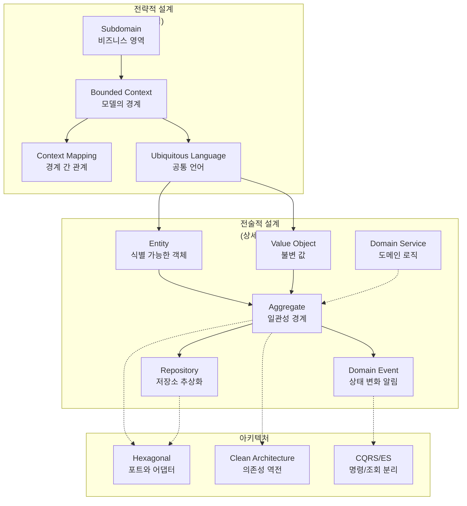

> **대상 독자**: DDD를 처음 접하거나 개념을 체계적으로 정리하고 싶은 개발자
> **선수 지식**: 객체지향 프로그래밍, Spring Boot 기본 지식
> **이 섹션의 목적**: DDD의 핵심 개념과 패턴을 "왜" 그리고 "무엇"인지 설명


이 섹션은 **개념 이해**를 목적으로 합니다. "어떻게 구현하는가"보다 "왜 이렇게 설계하는가"에 집중합니다. 실제 구현 방법은 [실습 예제](../examples/)를, 특정 문제 해결 방법은 [How-To Guide](../howto/)를 참고하세요.


## DDD를 왜 배워야 하는가?

소프트웨어 개발에서 가장 어려운 부분은 코드 작성이 아닙니다. **비즈니스 문제를 정확히 이해하고, 그 이해를 코드에 반영하는 것**이 진짜 어려운 일입니다. 개발자와 비즈니스 전문가가 서로 다른 언어를 사용하면 오해가 쌓이고, 결국 "요구사항대로 만들었는데 원하던 게 아니다"라는 상황이 발생합니다.

DDD(Domain-Driven Design)는 이 문제를 해결하기 위해 Eric Evans가 2003년에 제안한 설계 철학입니다. 핵심은 단순합니다: **비즈니스 도메인을 코드의 중심에 두고, 도메인 전문가와 개발자가 같은 언어로 소통하라**.


DDD를 이해하는 좋은 비유는 **지도 제작**입니다.
- **전략적 설계**는 세계 지도처럼 큰 그림을 그리는 것입니다. 대륙(Subdomain)을 나누고, 국경(Bounded Context)을 정하며, 국가 간 무역로(Context Mapping)를 설계합니다.
- **전술적 설계**는 도시 지도를 그리는 것입니다. 건물(Entity), 도로(Value Object), 구역(Aggregate)을 상세히 표현합니다.

좋은 지도는 목적에 맞게 필요한 정보만 담습니다. 세계 지도에 모든 골목을 표시하지 않듯, DDD도 적절한 추상화 수준을 선택합니다.


## 학습 경로

DDD는 **전략적 설계**와 **전술적 설계**라는 두 가지 수준으로 구성됩니다. 전략적 설계를 먼저 학습해야 하는 이유가 있습니다.


많은 개발자가 Entity, Repository 같은 전술적 패턴부터 배웁니다. 하지만 이는 **집을 짓기 전에 벽돌부터 고르는 것**과 같습니다. 먼저 어떤 집을 지을지(전략적 설계) 결정해야 벽돌 선택(전술적 설계)이 의미가 있습니다.

잘못된 Bounded Context 경계 위에서는 아무리 완벽한 Aggregate를 설계해도 결국 스파게티 코드가 됩니다.


### 1단계: 설계 패턴

| 문서 | 핵심 질문 | 배우는 것 |
|------|----------|----------|
| [전략적 설계](strategic-design/) | "시스템을 어떻게 나눌 것인가?" | Subdomain, Bounded Context, Context Mapping, Ubiquitous Language |
| [전술적 설계](tactical-design/) | "경계 안에서 무엇을 만들 것인가?" | Entity, Value Object, Repository, Domain Service, Specification |
| [Aggregate 심화](aggregate/) | "일관성 경계를 어떻게 정할 것인가?" | Aggregate Root, 트랜잭션 경계, 크기 결정 원칙 |

### 2단계: 아키텍처

설계 패턴을 실제 코드로 구현하려면 **도메인 모델을 보호하는 아키텍처**가 필요합니다. 데이터베이스나 프레임워크 변경이 비즈니스 로직에 영향을 주면 안 됩니다.

| 문서 | 핵심 질문 | 트레이드오프 |
|------|----------|------------|
| [아키텍처 패턴](architecture/) | "어떤 구조로 코드를 배치할 것인가?" | 복잡도 vs 유연성 비교 분석 |
| [이벤트 기반 아키텍처](architecture/event-driven/) | "경계 간 통신을 어떻게 할 것인가?" | 결합도 vs 추적 가능성 |
| [CQRS](architecture/cqrs/) | "읽기와 쓰기를 분리할 것인가?" | 단순함 vs 확장성 |

### 3단계: 품질

DDD를 지속적으로 유지하려면 테스트와 리팩토링이 필수입니다.

| 문서 | 핵심 질문 | 배우는 것 |
|------|----------|----------|
| [테스트 전략](testing/) | "도메인 로직을 어떻게 검증할 것인가?" | 단위 테스트, 통합 테스트, 테스트 피라미드 |
| [안티패턴과 함정](anti-patterns/) | "흔히 저지르는 실수는 무엇인가?" | Anemic Domain Model, Big Ball of Mud, 과도한 추상화 |

## 개념 간 관계

아래 다이어그램은 DDD의 주요 개념들이 어떻게 연결되는지를 보여줍니다.

**화살표의 의미**:
- 실선 화살표(→): "정의한다" 또는 "포함한다"
- 점선 화살표(-->): "사용한다" 또는 "구현된다"

## 핵심 정리


1. **DDD의 목적**: 비즈니스 도메인을 코드의 중심에 두어 개발자와 도메인 전문가의 소통을 개선한다
2. **두 가지 설계 수준**: 전략적 설계(큰 그림)가 먼저, 전술적 설계(상세 구현)가 나중
3. **학습 순서**: Strategic Design → Tactical Design → Architecture → Quality
4. **핵심 원칙**: 올바른 경계 설정이 완벽한 구현보다 중요하다


## 다음 단계

- **DDD가 처음이라면**: [전략적 설계](strategic-design/)부터 시작하세요
- **구현 패턴이 궁금하다면**: [전술적 설계](tactical-design/)를 먼저 훑어보세요
- **아키텍처 선택이 고민이라면**: [아키텍처 패턴 비교](architecture/)를 참고하세요
