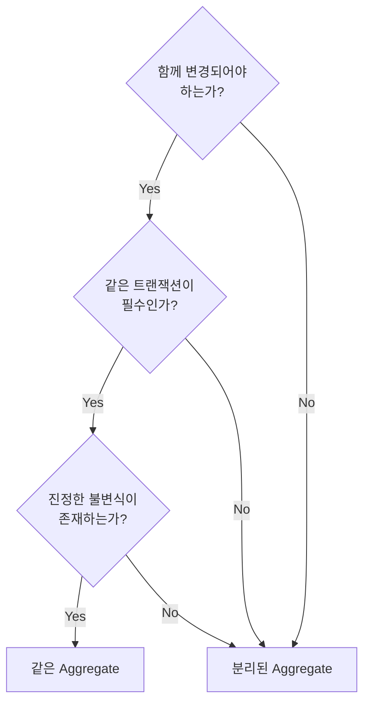

> **대상 독자**: Aggregate 기본 개념을 익히고 실전 패턴을 학습하려는 개발자
> **선수 지식**: [Aggregate 심화](aggregate/)에서 핵심 개념 이해
> **소요 시간**: 약 30분
> **핵심 질문**: "Aggregate 구현 시 어떤 패턴을 적용해야 하는가?"


실전 패턴: <strong>Factory Method</strong>(생성) + <strong>Domain Event 발행</strong> + <strong>Optimistic Locking</strong>(동시성) + <strong>Soft Delete</strong>(삭제)


# Aggregate 실전 패턴

Aggregate 설계를 위한 구현 패턴과 의사결정 가이드입니다.

## 왜 Aggregate에 패턴이 필요한가?

Aggregate는 단순히 객체를 묶는 것이 아닙니다. <strong>일관성, 동시성, 생명주기</strong>라는 세 가지 책임을 져야 합니다. 이 책임을 효과적으로 수행하기 위해 검증된 패턴들이 존재합니다.


Aggregate 패턴을 <strong>아파트 관리</strong>에 비유할 수 있습니다:

- **낙관적 락(Optimistic Locking)**: 택배 보관함처럼 "먼저 온 사람이 가져가고, 늦은 사람은 재배송 요청"하는 방식입니다. 충돌이 드물 때 효율적입니다.
- **도메인 이벤트**: 관리사무소 공지처럼 "이런 일이 있었습니다"라고 알리면, 관심 있는 주민이 각자 대응합니다.
- **Factory Method**: 입주 신청서처럼 "정해진 양식으로만 입주 가능"하게 하여 잘못된 상태의 입주를 방지합니다.
- **불변식 검증**: "한 세대에 최대 6명"같은 규칙을 항상 지키도록 합니다.


> **이 페이지 예제의 공통 import:**
> ```java
> import java.util.*;
> import java.time.LocalDateTime;
> import javax.persistence.Version;
> import org.springframework.context.ApplicationEventPublisher;
> ```

## Aggregate 루트 설계

### 루트를 통한 모든 변경

```java
public class Order {
    private List<OrderLine> orderLines;

    // ✅ 루트를 통해 내부 객체 추가
    public void addOrderLine(ProductId productId, String name, Money price, int qty) {
        validateCanModify();

        OrderLine newLine = new OrderLine(
            OrderLineId.generate(),
            productId,
            name,
            price,
            qty
        );
        this.orderLines.add(newLine);
        recalculateTotal();
    }

    // ✅ 루트를 통해 내부 객체 수정
    public void changeQuantity(OrderLineId lineId, int newQuantity) {
        validateCanModify();

        OrderLine line = findOrderLine(lineId);
        line.changeQuantity(newQuantity);  // 내부에서만 변경 허용
        recalculateTotal();
    }

    // 내부 객체를 직접 노출하지 않음
    public List<OrderLine> getOrderLines() {
        return Collections.unmodifiableList(orderLines);
    }
}
```

### 불변식 검증

```java
public class Order {
    private static final int MAX_ORDER_LINES = 100;
    private static final Money MAX_ORDER_AMOUNT = Money.won(10_000_000);

    public void addOrderLine(OrderLine line) {
        // 불변식 1: 주문 항목 수 제한
        if (orderLines.size() >= MAX_ORDER_LINES) {
            throw new TooManyOrderLinesException(MAX_ORDER_LINES);
        }

        orderLines.add(line);
        recalculateTotal();

        // 불변식 2: 최대 주문 금액 제한
        if (totalAmount.isGreaterThan(MAX_ORDER_AMOUNT)) {
            orderLines.remove(line);  // 롤백
            recalculateTotal();
            throw new OrderAmountExceededException(MAX_ORDER_AMOUNT);
        }
    }
}
```

## 실전 패턴

각 패턴의 <strong>왜</strong>, <strong>언제 사용</strong>, <strong>트레이드오프</strong>를 함께 설명합니다.

### 패턴 1: 낙관적 락(Optimistic Locking)

**왜 필요한가?**
동시에 여러 사용자가 같은 Aggregate를 수정하면 한쪽의 변경이 사라질 수 있습니다(Lost Update). 낙관적 락은 "충돌이 드물 것"이라고 가정하고, 실제 충돌 시에만 재시도를 요구합니다.

**트레이드오프:**
| 장점 | 단점 |
|------|------|
| 락 대기 없이 높은 동시성 | 충돌 시 재시도 로직 필요 |
| 읽기 성능 저하 없음 | 충돌이 잦으면 사용자 경험 저하 |
| 구현이 간단 (@Version) | 긴 트랜잭션에서는 비효율적 |

**언제 사용?**: 충돌 확률이 5% 미만인 경우, 읽기 위주 시스템
**언제 피해야?**: 충돌이 잦은 경우 (예: 실시간 경매의 최고가 갱신)

```java
@Entity
public class OrderEntity {
    @Id
    private String id;

    @Version  // 낙관적 락
    private Long version;

    // ...
}
```

```java
// 동시 수정 시 예외 발생
try {
    order.confirm();
    orderRepository.save(order);
} catch (OptimisticLockingFailureException e) {
    // 재시도 로직
    throw new ConcurrentModificationException("주문이 다른 곳에서 수정되었습니다");
}
```

### 패턴 2: Aggregate 복원 (Factory Pattern)

**왜 필요한가?**
Aggregate의 생성과 DB 로딩은 다른 문맥입니다. 새로 만들 때는 불변식을 검증하고 이벤트를 발행해야 하지만, DB에서 복원할 때는 이미 유효한 상태이므로 검증이 불필요합니다. 두 경로를 분리해야 코드가 명확해집니다.

**트레이드오프:**
| 장점 | 단점 |
|------|------|
| 생성 의도가 명확함 | 팩토리 메서드가 여러 개 필요 |
| 불변식 검증 위치 명확 | 코드량 증가 |
| 테스트가 쉬움 | 학습 곡선 존재 |

```java
public class Order {
    // 저장된 상태에서 복원 (검증 없이)
    public static Order reconstitute(
        OrderId id,
        CustomerId customerId,
        OrderStatus status,
        List<OrderLine> orderLines,
        ShippingAddress address,
        LocalDateTime createdAt
    ) {
        Order order = new Order();
        order.id = id;
        order.customerId = customerId;
        order.status = status;
        order.orderLines = new ArrayList<>(orderLines);
        order.shippingAddress = address;
        order.createdAt = createdAt;
        return order;
    }

    // 새로 생성
    public static Order create(CustomerId customerId, List<OrderLine> orderLines) {
        Order order = new Order();
        order.id = OrderId.generate();
        order.customerId = customerId;
        order.status = OrderStatus.PENDING;
        order.orderLines = new ArrayList<>(orderLines);
        order.createdAt = LocalDateTime.now();

        order.registerEvent(new OrderCreatedEvent(order.id));
        return order;
    }
}
```

### 패턴 3: 도메인 이벤트 수집

**왜 필요한가?**
Aggregate 간 직접 참조는 강결합을 만듭니다. "주문 확정 시 재고 차감"을 Order 안에서 직접 구현하면 Order가 Stock에 의존하게 됩니다. 이벤트를 통해 "무슨 일이 일어났다"만 알리면 수신자가 자유롭게 반응할 수 있습니다.

**트레이드오프:**
| 장점 | 단점 |
|------|------|
| Aggregate 간 느슨한 결합 | 이벤트 흐름 추적 어려움 |
| 새 기능 추가가 쉬움 | 결과적 일관성 수용 필요 |
| 테스트 용이 | 이벤트 스키마 관리 필요 |

**언제 사용?**: Aggregate 경계를 넘는 모든 통합
**언제 피해야?**: 즉각적 일관성이 필수인 경우 (해당 로직은 같은 Aggregate에 포함해야 함)

```java
public abstract class AggregateRoot {
    private final List<DomainEvent> domainEvents = new ArrayList<>();

    protected void registerEvent(DomainEvent event) {
        domainEvents.add(event);
    }

    public List<DomainEvent> getDomainEvents() {
        return Collections.unmodifiableList(domainEvents);
    }

    public void clearDomainEvents() {
        domainEvents.clear();
    }
}

public class Order extends AggregateRoot {

    public void confirm() {
        this.status = OrderStatus.CONFIRMED;
        registerEvent(new OrderConfirmedEvent(this.id));
    }

    public void cancel(CancellationReason reason) {
        this.status = OrderStatus.CANCELLED;
        registerEvent(new OrderCancelledEvent(this.id, reason));
    }
}
```

### 패턴 4: Repository에서 이벤트 발행

**왜 필요한가?**
이벤트 발행 시점이 중요합니다. 트랜잭션 커밋 전에 발행하면 롤백 시 이벤트만 나가는 문제가 생깁니다. Repository에서 저장 성공 후 발행하면 이 문제를 방지할 수 있습니다.

**트레이드오프:**
| 접근법 | 장점 | 단점 |
|--------|------|------|
| Repository에서 발행 | 저장과 발행 일관성 | Repository 책임 증가 |
| @TransactionalEventListener | Spring 표준 | 설정 복잡도 |
| Outbox 패턴 | 완벽한 보장 | 구현 복잡도 높음 |

```java
@Repository
public class JpaOrderRepository implements OrderRepository {

    private final OrderJpaRepository jpaRepository;
    private final ApplicationEventPublisher eventPublisher;

    @Override
    public Order save(Order order) {
        OrderEntity entity = toEntity(order);
        jpaRepository.save(entity);

        // 저장 후 이벤트 발행
        order.getDomainEvents().forEach(eventPublisher::publishEvent);
        order.clearDomainEvents();

        return order;
    }
}
```

## Aggregate 경계 결정 가이드

### 질문 체크리스트

아래 의사결정 트리는 새로운 Entity를 기존 Aggregate에 포함시킬지, 별도 Aggregate로 분리할지 결정하는 데 도움을 줍니다. 세 가지 질문에 모두 "Yes"인 경우에만 같은 Aggregate에 포함합니다.



### 예시: 주문과 결제

```
질문: 주문(Order)과 결제(Payment)는 같은 Aggregate?

1. 함께 변경되어야 하는가?
   → 주문 없이 결제는 없지만, 결제 실패해도 주문은 유지
   → No

2. 같은 트랜잭션이 필수인가?
   → 결제는 외부 PG 연동, 실패/재시도 많음
   → 분리해야 안전
   → No

3. 진정한 불변식이 있는가?
   → "주문 금액 = 결제 금액" 은 결과적 일관성으로 충분
   → No

결론: 분리된 Aggregate
```

```java
// 분리된 Aggregate
public class Order {
    private OrderId id;
    private PaymentId paymentId;  // ID로만 참조
    private PaymentStatus paymentStatus;  // 상태 복사
}

public class Payment {
    private PaymentId id;
    private OrderId orderId;  // ID로만 참조
    private Money amount;
    private PaymentStatus status;
}
```

## 안티패턴

### 1. God Aggregate

```java
// ❌ 모든 것을 포함하는 거대한 Aggregate
public class Order {
    private Customer customer;  // Customer 전체
    private List<Product> products;  // Product 전체
    private Payment payment;  // Payment 전체
    private Shipment shipment;  // Shipment 전체
    // 트랜잭션 범위가 너무 넓음
}
```

**문제점:**
- 동시 접근 시 경합 증가
- 거대한 객체 그래프로 로딩 지연
- 한 부분의 변경이 무관한 부분에 영향

**해결책:** ID 참조로 별도 Aggregate로 분리

### 2. Anemic Aggregate

```java
// ❌ 로직 없는 빈약한 Aggregate
public class Order {
    private OrderId id;
    private OrderStatus status;

    // getter/setter만 존재
    public OrderStatus getStatus() { return status; }
    public void setStatus(OrderStatus status) { this.status = status; }
}

// 로직이 서비스에 분산
public class OrderService {
    public void confirm(Order order) {
        if (order.getStatus() == OrderStatus.PENDING) {
            order.setStatus(OrderStatus.CONFIRMED);
        }
    }
}
```

**문제점:**
- 비즈니스 규칙이 서비스에 분산
- 불변식이 어디서든 위반 가능
- 도메인 로직 파악 어려움

**해결책:** 비즈니스 로직을 Aggregate로 이동

### 3. 외부 의존성을 가진 Aggregate

```java
// ❌ 외부 서비스를 호출하는 Aggregate
public class Order {
    @Autowired  // 의존성 주입 금지!
    private InventoryService inventoryService;

    public void confirm() {
        // Aggregate가 직접 외부 서비스 호출 - 피해야 함
        inventoryService.reserve(this.orderLines);
        this.status = OrderStatus.CONFIRMED;
    }
}
```

**해결책:** Domain Event를 통한 외부 통합

## 요약

| 패턴 | 사용 시점 |
|------|----------|
| **낙관적 락** | 동시 수정 가능성 있을 때 |
| **복원 패턴** | 생성과 DB 로딩 분리 시 |
| **이벤트 수집** | Aggregate 간 통신 시 |
| **경계 결정** | 새 Aggregate 설계 시 |

## 다음 단계

- [도메인 이벤트](domain-events/) - 이벤트 기반 통합
- [안티패턴](anti-patterns/) - 피해야 할 실수들
