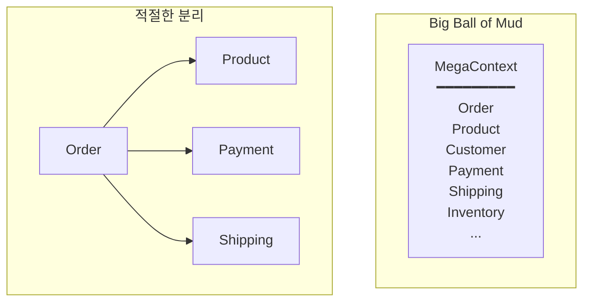
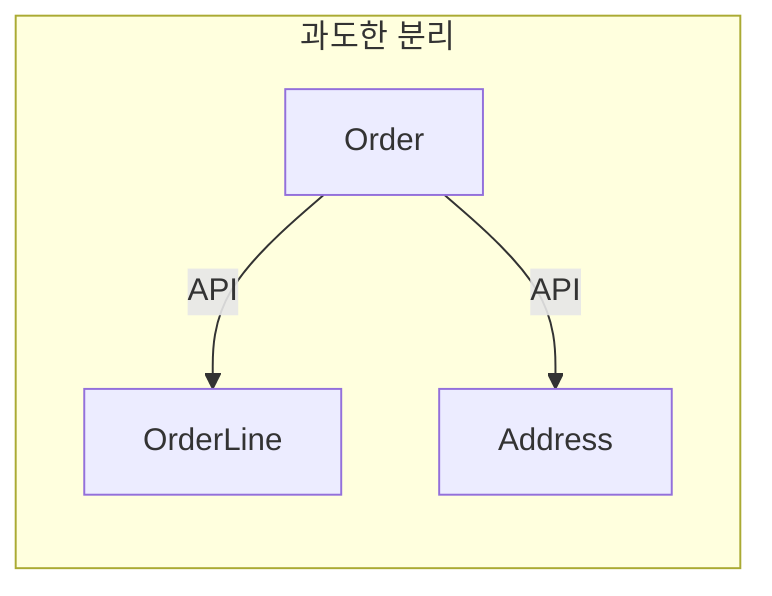

> **대상 독자**: DDD를 적용하고 있거나 도입을 고려 중인 개발자
> **선수 지식**: [Quick Start](../quick-start/)와 [전술적 설계](tactical-design/) 기본 개념
> **소요 시간**: 약 20분
> **핵심 질문**: "DDD 적용 시 흔히 저지르는 실수는 무엇이고, 어떻게 피할 수 있는가?"


이 문서에서 소개하는 안티패턴은 실제 프로젝트에서 자주 발생합니다. 자신의 코드베이스에 해당 증상이 있는지 확인해보세요.


## 안티패턴을 이해하는 비유


DDD 안티패턴을 <strong>건축 설계 실수</strong>에 비유할 수 있습니다:

| 안티패턴 | 건축 비유 | 결과 |
|---------|----------|------|
| **Big Ball of Mud** | 칸막이 없는 원룸 | 부엌 냄새가 침실까지, 손님이 오면 모든 공간 정리 필요 |
| **Anemic Domain Model** | 벽만 있고 가구 없는 집 | 살기 위해 매번 외부에서 가구를 빌려와야 함 |
| **God Aggregate** | 모든 방이 연결된 미로 | 한 방 고치려면 모든 방에 영향 |
| **Primitive Obsession** | 문 없이 커튼만 있는 방 | 누구나 들어올 수 있어 보안 취약 |

<strong>중요</strong>: 안티패턴이라고 해서 <strong>항상</strong> 나쁜 것은 아닙니다. 빠른 프로토타입, 단순한 CRUD 앱, 1인 프로젝트에서는 "과도한 설계"가 오히려 해가 됩니다. 이 문서의 해결책은 <strong>복잡한 비즈니스 도메인</strong>에 적합합니다.


DDD(도메인 주도 설계)는 강력한 설계 방법론이지만, 올바르게 적용하지 않으면 오히려 복잡성만 증가시킬 수 있습니다. 이 문서에서는 실무에서 자주 발생하는 DDD 안티패턴과 그 해결책을 살펴봅니다. 각 안티패턴의 증상을 이해하고 조기에 발견하여 바로잡는 것이 중요합니다.

#### 전략적 설계 안티패턴

전략적 설계는 시스템의 큰 그림을 그리는 단계입니다. Bounded Context를 어떻게 나누고 통합할지 결정하는 이 단계에서 잘못된 선택을 하면 전체 시스템 구조에 악영향을 미칩니다.

**1. Big Ball of Mud Context**

가장 흔한 실수는 모든 것을 하나의 거대한 Bounded Context로 만드는 것입니다. 초기에는 편해 보이지만, 시스템이 커질수록 관리가 불가능해집니다. 주문, 상품, 고객, 결제, 배송, 재고 관리를 모두 하나의 Context에 넣으면 각 도메인의 경계가 모호해지고 응집도가 떨어집니다.

아래 다이어그램은 왼쪽의 "Big Ball of Mud" 패턴과 오른쪽의 적절히 분리된 구조를 비교합니다. 거대한 단일 Context에서는 모든 개념이 뒤섞이지만, 적절히 분리하면 각 Context가 명확한 책임을 가지고 느슨하게 연결됩니다.



*모든 개념이 뒤섞인 Big Ball of Mud(왼쪽)와 각 Context가 명확한 책임을 가지는 적절한 분리(오른쪽)를 비교합니다.*

이 안티패턴의 주요 증상은 다음과 같습니다. 모든 팀이 같은 코드베이스를 수정하게 되어 병합 충돌이 빈번하게 발생합니다. 작은 변경 하나에도 전체 애플리케이션을 다시 배포해야 하므로 배포 주기가 길어집니다. 같은 용어가 서로 다른 의미로 사용되면서 혼란이 가중됩니다. 예를 들어, "상품"이라는 용어가 카탈로그 관리, 재고 관리, 주문 처리에서 각각 다른 속성과 행위를 가질 수 있습니다.

해결책은 명확한 경계를 찾아 Context를 분리하는 것입니다. 첫째, 언어적 경계를 찾습니다. 도메인 전문가가 사용하는 용어가 충돌하는 지점이 Context 경계의 좋은 후보입니다. 둘째, 팀 경계를 고려합니다. 서로 다른 팀이 담당하는 영역은 별도 Context로 분리하는 것이 자연스럽습니다. 셋째, 점진적으로 분리합니다. 한 번에 모두 분리하려 하지 말고, 가장 명확한 경계부터 시작하여 단계적으로 진행합니다.

**2. Context가 너무 작음**

Big Ball of Mud의 반대 극단도 문제입니다. 마이크로서비스 열풍에 편승하여 너무 세밀하게 나누면 통합 비용이 기하급수적으로 증가합니다. Order, OrderLine, Address를 각각 별도 서비스로 분리하는 것은 과도한 분리의 전형적인 예입니다.



*Order, OrderLine, Address를 별도 서비스로 과도하게 분리하여 API 호출 오버헤드가 발생하는 안티패턴입니다.*

이 안티패턴의 증상은 간단한 기능 하나를 구현하는데 여러 서비스를 호출해야 하고, 분산 트랜잭션 관리가 복잡해지며, 네트워크 오버헤드로 인해 성능이 저하되는 것입니다. 주문 하나를 조회하는데 Order 서비스, OrderLine 서비스, Address 서비스를 각각 호출해야 한다면 명백히 잘못된 설계입니다.

Context 분리 기준은 다음 세 가지 질문으로 판단할 수 있습니다. 독립적으로 배포 가능한가? 다른 팀이 담당하는가? 다른 생명주기를 가지는가? 세 가지 중 하나라도 "아니오"라면 같은 Context로 유지하는 것이 바람직합니다. Order와 OrderLine은 같은 생명주기를 가지고 같은 팀이 관리하므로 하나의 Aggregate로 유지해야 합니다.

**3. Ubiquitous Language 무시**

코드에서 도메인 용어를 사용하지 않고 기술 용어로만 작성하면 도메인 전문가와의 소통이 단절됩니다. "주문 확정"을 `updateStatus(id, 1)`로 표현하면 코드만 봐서는 비즈니스 의미를 전혀 알 수 없습니다.

```java
// ❌ 기술 용어
public class OrderManager {
    public void updateStatus(Long id, int status) {
        // status: 0=대기, 1=확정, 2=배송, 9=취소
    }
}

// ✅ 도메인 용어
public class Order {
    public void confirm() { }
    public void ship(TrackingNumber trackingNumber) { }
    public void cancel(CancellationReason reason) { }
}
```

잘못된 예제는 마법의 숫자를 사용하고 있습니다. 상태 코드 1이 "확정"을 의미한다는 것은 주석을 읽거나 문서를 참고해야만 알 수 있습니다. 반면 올바른 예제는 `confirm()`, `ship()`, `cancel()` 같은 명확한 도메인 용어를 사용하여 코드 자체가 비즈니스 의도를 표현합니다.

해결책은 다음과 같습니다. 첫째, 도메인 전문가와 함께 용어 사전을 작성합니다. 둘째, 코드, 테스트, 문서에서 동일한 용어를 일관되게 사용합니다. 셋째, 코드 리뷰에서 도메인 용어 사용 여부를 검증합니다. 개발자가 임의로 용어를 변경하거나 축약하지 않도록 팀 차원에서 관리해야 합니다.

#### 전술적 설계 안티패턴

전술적 설계는 코드 레벨의 구현 패턴입니다. Entity, Value Object, Aggregate 같은 빌딩 블록을 잘못 사용하면 비즈니스 로직이 산재하고 유지보수가 어려워집니다.

**4. Anemic Domain Model (빈약한 도메인 모델)**

가장 흔하고 치명적인 안티패턴입니다. Entity가 데이터만 가지고 로직이 없으면 객체지향의 핵심인 캡슐화를 포기하는 것입니다. 모든 비즈니스 규칙이 Service 계층에 분산되면서 중복 코드가 발생하고 규칙 변경 시 여러 곳을 수정해야 합니다.

```java
// ❌ Anemic Model
public class Order {
    private Long id;
    private String status;
    private LocalDateTime confirmedAt;

    // getter/setter만 존재
    public String getStatus() { return status; }
    public void setStatus(String status) { this.status = status; }
}

// 로직이 서비스에 분산
public class OrderService {
    public void confirmOrder(Long orderId) {
        Order order = repository.findById(orderId);
        if (order.getStatus().equals("PENDING")) {
            order.setStatus("CONFIRMED");
            order.setConfirmedAt(LocalDateTime.now());
            // 비즈니스 규칙이 여기에...
        }
        repository.save(order);
    }
}
```

잘못된 예제에서는 Order 객체가 단순한 데이터 컨테이너입니다. 주문 확정이라는 비즈니스 규칙이 Service에 있어서 다른 곳에서도 주문을 확정해야 한다면 같은 로직을 중복으로 작성하거나 Service를 의존해야 합니다. 상태 검증 로직도 Service에 있어서 Order 객체는 언제든 잘못된 상태를 가질 수 있습니다.

```java
// ✅ Rich Domain Model
public class Order {
    private OrderId id;
    private OrderStatus status;
    private LocalDateTime confirmedAt;

    public void confirm() {
        validateConfirmable();
        this.status = OrderStatus.CONFIRMED;
        this.confirmedAt = LocalDateTime.now();
        registerEvent(new OrderConfirmedEvent(this));
    }

    private void validateConfirmable() {
        if (this.status != OrderStatus.PENDING) {
            throw new IllegalOrderStateException(
                "PENDING 상태에서만 확정 가능합니다. 현재: " + this.status
            );
        }
    }
}

// 서비스는 흐름만 조율
public class OrderService {
    public void confirmOrder(OrderId orderId) {
        Order order = repository.findById(orderId).orElseThrow();
        order.confirm();  // 도메인에 위임
        repository.save(order);
    }
}
```

올바른 예제에서는 비즈니스 규칙이 Order 객체 안에 캡슐화되어 있습니다. `confirm()` 메서드는 상태 검증, 상태 변경, 이벤트 발행까지 모든 로직을 담당합니다. Service는 단순히 Order를 찾아서 `confirm()`을 호출하는 조율자 역할만 합니다. 이렇게 하면 주문 확정 로직이 한 곳에 모여 있어 유지보수가 쉽습니다.

진단 체크리스트를 활용하여 Anemic Model을 조기에 발견할 수 있습니다. Entity에 setter가 있는가? 있다면 행위 메서드로 교체하세요. Service가 if-else로 상태를 검증하는가? 그 로직을 Entity로 옮기세요. 비즈니스 규칙이 Service에 있는가? 도메인 모델로 이동시키세요.

**5. God Aggregate**

너무 많은 것을 포함하는 거대한 Aggregate는 성능과 확장성 문제를 일으킵니다. Aggregate는 트랜잭션 일관성 경계이므로, 크기가 클수록 동시성 충돌이 빈번하게 발생합니다.

```java
// ❌ God Aggregate
public class Order {
    private OrderId id;
    private Customer customer;        // Customer Aggregate 전체
    private List<Product> products;   // Product Aggregate 전체
    private Payment payment;          // Payment Aggregate 전체
    private Shipment shipment;        // Shipment Aggregate 전체
}
```

이 설계의 문제점은 주문 하나를 수정할 때 고객, 상품, 결제, 배송 정보를 모두 로드해야 하고, 트랜잭션 범위가 너무 넓어서 동시에 같은 주문을 수정하는 경우가 많아지며, 불필요한 데이터까지 로드하여 성능이 저하된다는 것입니다. 예를 들어, 주문 상태만 변경하는데 상품의 모든 정보와 고객의 전체 프로필을 로드하는 것은 낭비입니다.

```java
// ✅ 적절한 크기
public class Order {
    private OrderId id;
    private CustomerId customerId;      // ID로 참조
    private List<OrderLine> orderLines; // 진짜 내부 엔티티만
    private ShippingAddress address;    // Value Object
}

public class OrderLine {
    private OrderLineId id;
    private ProductId productId;        // ID로 참조
    private String productName;         // 필요한 정보만 복사
    private Money price;
    private int quantity;
}
```

올바른 설계에서는 다른 Aggregate를 ID로만 참조합니다. Customer와 Product는 각각 독립적인 Aggregate이므로 ID만 저장합니다. OrderLine은 Order의 진짜 일부이므로 직접 포함하되, Product의 전체 정보가 아닌 주문 시점의 이름과 가격만 복사합니다. 이렇게 하면 트랜잭션 범위가 Order Aggregate로 한정되어 동시성 충돌이 줄어듭니다.

**6. Aggregate 경계 무시**

한 트랜잭션에서 여러 Aggregate를 수정하면 트랜잭션이 길어지고 동시성 문제가 발생합니다. DDD의 핵심 규칙 중 하나는 "하나의 트랜잭션에서 하나의 Aggregate만 수정한다"입니다.

```java
// ❌ 여러 Aggregate 동시 수정
@Transactional
public void confirmOrder(OrderId orderId) {
    Order order = orderRepository.findById(orderId);
    order.confirm();

    // 같은 트랜잭션에서 다른 Aggregate 수정 - 피해야 함!
    for (OrderLine line : order.getOrderLines()) {
        Stock stock = stockRepository.findByProductId(line.getProductId());
        stock.reserve(line.getQuantity());
        stockRepository.save(stock);
    }

    Customer customer = customerRepository.findById(order.getCustomerId());
    customer.addPoints(order.getTotalAmount().multiply(0.01));
    customerRepository.save(customer);

    orderRepository.save(order);
}
```

이 코드는 하나의 트랜잭션에서 Order, Stock, Customer 세 개의 Aggregate를 수정합니다. 트랜잭션이 길어져서 Lock 경합이 심해지고, 재고 업데이트 실패 시 주문 확정도 롤백되는 등 결합도가 높아집니다. 또한 동시에 많은 주문이 확정되면 재고 Aggregate에 Lock이 걸려 성능이 저하됩니다.

```java
// ✅ 이벤트로 분리
@Transactional
public void confirmOrder(OrderId orderId) {
    Order order = orderRepository.findById(orderId);
    order.confirm();  // OrderConfirmedEvent 발행
    orderRepository.save(order);
}

// 별도 트랜잭션에서 처리
@Component
public class StockEventHandler {
    @TransactionalEventListener(phase = TransactionPhase.AFTER_COMMIT)
    @Transactional(propagation = Propagation.REQUIRES_NEW)
    public void on(OrderConfirmedEvent event) {
        for (OrderLineSnapshot line : event.getOrderLines()) {
            Stock stock = stockRepository.findByProductId(line.productId());
            stock.reserve(line.quantity());
            stockRepository.save(stock);
        }
    }
}
```

올바른 접근 방식은 이벤트를 사용하여 각 Aggregate를 별도 트랜잭션에서 처리하는 것입니다. 주문 확정은 Order Aggregate만 수정하고 이벤트를 발행합니다. 재고 차감과 포인트 적립은 이벤트 핸들러에서 별도 트랜잭션으로 처리합니다. 이렇게 하면 각 Aggregate가 독립적으로 확장 가능하고, 재고 업데이트 실패가 주문 확정에 영향을 주지 않습니다.

**7. Primitive Obsession (원시 타입 집착)**

도메인 개념을 원시 타입으로 표현하면 타입 안정성과 도메인 규칙 보호를 포기하게 됩니다. String, int, long 같은 원시 타입은 아무런 제약이 없어서 잘못된 값이 쉽게 들어갈 수 있습니다.

```java
// ❌ Primitive Obsession
public class Order {
    private String orderId;          // 그냥 String
    private String customerId;       // 그냥 String
    private String email;            // 그냥 String
    private int totalAmount;         // 그냥 int
    private String status;           // 그냥 String
}

public void createOrder(String customerId, String email, int amount) {
    // customerId와 email을 바꿔 넣어도 컴파일 에러 없음!
}
```

이 설계의 문제는 컴파일러가 타입을 검증할 수 없다는 것입니다. `createOrder("hong@email.com", "CUST-001", 10000)`처럼 customerId와 email을 바꿔 넣어도 컴파일 에러가 발생하지 않습니다. 또한 음수 금액, 잘못된 이메일 형식, 유효하지 않은 상태 문자열 등을 막을 방법이 없습니다.

```java
// ✅ Value Object 사용
public class Order {
    private OrderId id;
    private CustomerId customerId;
    private Email email;
    private Money totalAmount;
    private OrderStatus status;
}

// 컴파일 타임에 타입 검증
public void createOrder(CustomerId customerId, Email email, Money amount) {
    // 타입이 다르면 컴파일 에러
}

// 도메인 규칙을 Value Object가 보호
public record Email(String value) {
    public Email {
        if (!value.matches("^[\\w.-]+@[\\w.-]+\\.[a-zA-Z]{2,}$")) {
            throw new InvalidEmailException(value);
        }
    }
}
```

Value Object를 사용하면 타입 시스템이 도메인 개념을 보호합니다. `createOrder(email, customerId, amount)`처럼 인자 순서를 바꾸면 컴파일 에러가 발생합니다. Email Value Object는 생성 시점에 형식을 검증하므로 시스템 어디에서도 유효하지 않은 이메일이 존재할 수 없습니다. Money는 음수를 방지하고, OrderStatus는 유효한 상태만 표현합니다.

**8. Smart UI Anti-Pattern**

비즈니스 로직이 UI나 Controller에 있으면 테스트하기 어렵고 재사용이 불가능합니다. Controller는 HTTP 요청을 처리하는 어댑터일 뿐, 비즈니스 규칙을 담당해서는 안 됩니다.

```java
// ❌ Controller에 비즈니스 로직
@RestController
public class OrderController {

    @PostMapping("/orders/{id}/confirm")
    public ResponseEntity<?> confirmOrder(@PathVariable Long id) {
        Order order = repository.findById(id);

        // Controller에서 비즈니스 규칙 검증
        if (!order.getStatus().equals("PENDING")) {
            return ResponseEntity.badRequest().body("이미 확정된 주문");
        }

        if (order.getTotalAmount() > 1000000) {
            // 고액 주문 추가 검증
            if (!fraudService.check(order)) {
                return ResponseEntity.badRequest().body("사기 의심");
            }
        }

        order.setStatus("CONFIRMED");
        repository.save(order);
        return ResponseEntity.ok().build();
    }
}
```

이 코드의 문제는 비즈니스 규칙이 Controller에 흩어져 있어 같은 로직을 다른 Controller나 배치 작업에서 재사용할 수 없다는 것입니다. 또한 HTTP 테스트 없이는 비즈니스 로직을 검증할 수 없어 테스트가 느리고 복잡해집니다. 주문 확정 규칙이 변경되면 Controller를 수정해야 하므로 계층 책임이 명확하지 않습니다.

```java
// ✅ 로직은 도메인에
@RestController
public class OrderController {

    private final ConfirmOrderUseCase confirmOrderUseCase;

    @PostMapping("/orders/{id}/confirm")
    public ResponseEntity<?> confirmOrder(@PathVariable String id) {
        confirmOrderUseCase.confirm(OrderId.of(id));
        return ResponseEntity.ok().build();
    }
}

// Domain
public class Order {
    public void confirm(FraudChecker fraudChecker) {
        validateConfirmable();
        validateFraud(fraudChecker);
        this.status = OrderStatus.CONFIRMED;
    }

    private void validateConfirmable() {
        if (this.status != OrderStatus.PENDING) {
            throw new IllegalOrderStateException("...");
        }
    }

    private void validateFraud(FraudChecker fraudChecker) {
        if (isHighValue() && !fraudChecker.isSafe(this)) {
            throw new FraudSuspectedException(this.id);
        }
    }
}
```

올바른 설계에서 Controller는 단순히 Use Case를 호출하는 얇은 어댑터입니다. 모든 비즈니스 규칙은 Order 도메인 모델에 있어서 웹, CLI, 배치 등 어떤 인터페이스에서도 재사용할 수 있습니다. 도메인 로직을 HTTP 없이 단위 테스트할 수 있어 테스트가 빠르고 간단합니다.

#### 아키텍처 안티패턴

아키텍처 레벨의 안티패턴은 계층 간 의존성과 관련이 있습니다. 특히 도메인 계층의 순수성을 유지하는 것이 중요합니다.

**9. 도메인 의존성 오염**

도메인 모델이 JPA, Spring 같은 인프라 기술에 의존하면 도메인 로직을 테스트하기 어렵고 기술 변경 시 도메인까지 수정해야 합니다. 도메인은 비즈니스 규칙만 담당하고 인프라와 독립적이어야 합니다.

```java
// ❌ 도메인이 JPA에 의존
@Entity
@Table(name = "orders")
public class Order {
    @Id @GeneratedValue
    private Long id;

    @OneToMany(cascade = CascadeType.ALL)
    private List<OrderLine> orderLines;

    @Transient  // JPA 무시
    private List<DomainEvent> events;
}
```

이 설계는 Order 도메인 모델이 JPA 어노테이션으로 오염되어 있습니다. JPA 없이는 도메인 로직을 테스트할 수 없고, 데이터베이스를 MongoDB로 변경하려면 도메인 모델까지 수정해야 합니다. 또한 `@Transient`처럼 인프라 관심사가 도메인에 침투합니다.

```java
// ✅ 순수한 도메인
// Domain Layer
public class Order {
    private OrderId id;
    private List<OrderLine> orderLines;
    private List<DomainEvent> events;
}

// Infrastructure Layer
@Entity
@Table(name = "orders")
public class OrderEntity {
    @Id
    private String id;

    @OneToMany(cascade = CascadeType.ALL)
    private List<OrderLineEntity> orderLines;
}

// Mapper가 변환
@Component
public class OrderMapper {
    public OrderEntity toEntity(Order order) { ... }
    public Order toDomain(OrderEntity entity) { ... }
}
```

올바른 접근 방식은 도메인 모델과 영속성 모델을 분리하는 것입니다. Order는 순수한 Java 객체로 어떤 프레임워크에도 의존하지 않습니다. OrderEntity는 인프라 계층에서 JPA 매핑을 담당합니다. OrderMapper가 둘 사이를 변환하여 도메인을 보호합니다. 이렇게 하면 도메인 로직을 JPA 없이 테스트할 수 있고, 영속성 기술을 자유롭게 변경할 수 있습니다.

**10. Repository 구현 누출**

Repository 인터페이스에 JPA 특정 메서드가 노출되면 도메인이 인프라 세부사항에 의존하게 됩니다. Repository는 도메인 관점의 저장소 추상화이어야 하며, 구현 기술이 드러나서는 안 됩니다.

```java
// ❌ JPA 구현 누출
public interface OrderRepository extends JpaRepository<Order, Long> {
    // JPA 기능이 그대로 노출됨
    // findAll(), save(), saveAll() 등
}

// 도메인에서 JPA 메서드 직접 사용
orderRepository.saveAll(orders);
orderRepository.flush();
```

이 설계는 `JpaRepository`를 상속하여 JPA의 모든 메서드가 노출됩니다. 도메인 계층에서 `flush()`, `saveAll()` 같은 JPA 특정 메서드를 직접 호출하게 되어 JPA에 의존합니다. Repository를 MongoDB 구현으로 교체하려면 `flush()` 같은 메서드가 없어서 문제가 발생합니다.

```java
// ✅ 도메인 Repository 인터페이스
// Domain Layer
public interface OrderRepository {
    Order save(Order order);
    Optional<Order> findById(OrderId id);
    List<Order> findByCustomerId(CustomerId customerId);
}

// Infrastructure Layer
@Repository
public class JpaOrderRepository implements OrderRepository {
    private final OrderJpaRepository jpaRepository;

    @Override
    public Order save(Order order) {
        OrderEntity entity = mapper.toEntity(order);
        return mapper.toDomain(jpaRepository.save(entity));
    }
}

interface OrderJpaRepository extends JpaRepository<OrderEntity, String> {
    // JPA 기능은 여기에만 존재
}
```

올바른 설계에서 OrderRepository는 도메인 계층의 인터페이스로 비즈니스 관점의 메서드만 선언합니다. JpaOrderRepository는 인프라 계층에서 구현하며, 내부적으로 OrderJpaRepository를 사용합니다. JPA 특정 기능은 인프라 계층에 격리되어 도메인이 영향받지 않습니다. 이렇게 하면 Repository 구현을 자유롭게 교체할 수 있습니다.

#### CQRS 안티패턴

CQRS(Command Query Responsibility Segregation)는 강력한 패턴이지만 모든 곳에 적용할 필요는 없습니다. 복잡도에 맞게 적절히 사용해야 합니다.

**11. 과도한 CQRS**

단순한 CRUD 작업에 CQRS를 적용하면 불필요한 복잡도만 증가합니다. 조회와 명령의 모델이 거의 같고 성능 문제도 없다면 CQRS는 과도한 설계입니다.

```java
// ❌ 단순 조회에 복잡한 CQRS
public class UserQueryService {
    public UserView getUser(String userId) {
        // 단순 조회인데 별도 Read Model, Projector 구축
    }
}

// ✅ 복잡도에 맞는 선택
public class UserService {
    public User getUser(UserId id) {
        return userRepository.findById(id).orElseThrow();
    }
}
```

단순히 사용자 정보를 조회하는데 별도 Read Model, Event Projector, 동기화 메커니즘을 구축하는 것은 낭비입니다. CQRS는 조회와 명령의 요구사항이 크게 다르거나, 조회 성능 최적화가 필요하거나, 복잡한 검색과 리포팅이 필요할 때 적용해야 합니다.

CQRS 적용 기준은 다음 질문으로 판단할 수 있습니다. 조회와 명령의 모델이 크게 다른가? 조회 성능 최적화가 필요한가? 복잡한 검색이나 리포팅이 필요한가? 하나도 "예"가 아니라면 단순 모델로 충분합니다. 예를 들어, 주문 목록 조회는 주문 Aggregate를 그대로 사용하면 되지만, 복잡한 매출 분석 리포트는 별도 Read Model이 필요할 수 있습니다.

**12. 동기화 실패 무시**

CQRS를 사용하면 Command Model과 Read Model 간 동기화가 필요합니다. 이벤트 처리 실패를 무시하면 데이터 불일치가 발생하여 사용자가 잘못된 정보를 보게 됩니다.

```java
// ❌ 실패 시 데이터 불일치
@EventListener
public void on(OrderConfirmedEvent event) {
    OrderView view = viewRepository.findById(event.getOrderId());
    view.setStatus("CONFIRMED");  // 실패하면?
    viewRepository.save(view);
}
```

이 코드는 이벤트 처리 중 예외가 발생하면 Command Model(Order)은 확정 상태인데 Read Model(OrderView)은 여전히 대기 상태로 남게 됩니다. 사용자는 주문 목록에서 확정되지 않은 것으로 보이지만 실제로는 확정된 상태가 되어 혼란스럽습니다.

```java
// ✅ 실패 처리와 재시도
@Component
public class OrderViewProjector {

    private final FailedEventStore failedEventStore;

    @KafkaListener(topics = "order-events")
    @Retryable(maxAttempts = 3, backoff = @Backoff(delay = 1000))
    public void handle(DomainEvent event) {
        try {
            project(event);
        } catch (Exception e) {
            // 재시도 실패 시 저장
            failedEventStore.save(event, e);
            throw e;
        }
    }

    // 실패 이벤트 수동 재처리
    @Scheduled(fixedDelay = 60000)
    public void retryFailedEvents() {
        failedEventStore.findAll().forEach(this::retry);
    }
}
```

올바른 접근 방식은 재시도 메커니즘과 실패 이벤트 저장소를 구축하는 것입니다. 이벤트 처리가 실패하면 자동으로 재시도하고, 계속 실패하면 별도 저장소에 보관합니다. 스케줄러가 주기적으로 실패한 이벤트를 재처리하여 최종적으로 일관성을 달성합니다. 모니터링 대시보드에서 실패한 이벤트를 추적하고 필요시 수동으로 개입할 수 있습니다.

#### 해결 체크리스트

DDD 프로젝트의 각 단계에서 안티패턴을 조기에 발견하기 위한 체크리스트입니다.

**프로젝트 시작 전**

다음 항목을 사전에 준비하면 많은 안티패턴을 예방할 수 있습니다. 도메인 전문가와 용어 사전을 작성했는가? 이는 Ubiquitous Language 무시 안티패턴을 방지합니다. Core/Supporting/Generic Domain을 분류했는가? 이는 어디에 집중할지 결정하는데 도움이 됩니다. Bounded Context 경계를 정의했는가? 이는 Big Ball of Mud를 방지합니다. Context 간 통합 방식을 결정했는가? 이는 나중에 통합 문제를 줄여줍니다.

**코드 작성 시**

개발 과정에서 지속적으로 확인해야 할 항목입니다. Entity에 행위(메서드)가 있는가? setter만 있다면 Anemic Model의 징후입니다. Value Object를 적극 활용하고 있는가? 원시 타입만 쓴다면 Primitive Obsession입니다. Aggregate 경계가 적절한가? 너무 크면 God Aggregate, 너무 작으면 과도한 분리입니다. 도메인이 인프라에 의존하지 않는가? JPA 어노테이션이 도메인에 있다면 의존성 오염입니다.

**코드 리뷰 시**

팀 차원에서 품질을 검증하는 단계입니다. 비즈니스 용어를 사용했는가? `updateStatus(1)` 같은 기술 용어는 지양합니다. 로직이 도메인에 있는가? Service에 if-else가 많다면 로직을 도메인으로 이동해야 합니다. 한 트랜잭션에 하나의 Aggregate만 수정하는가? 여러 Aggregate를 수정한다면 이벤트로 분리합니다. 테스트가 도메인 규칙을 검증하는가? Controller 테스트만 있다면 도메인 로직 테스트가 부족합니다.

#### 핵심 요약


| 안티패턴 | 증상 | 해결책 |
|---------|------|--------|
| **Big Ball of Mud** | 모든 코드가 하나의 Context | 언어/팀 경계 기반 분리 |
| **Context 과도 분리** | 간단한 기능에 여러 서비스 호출 | 같은 생명주기는 함께 유지 |
| **Ubiquitous Language 무시** | 코드에 도메인 용어 없음 | 용어 사전 작성, 코드 리뷰 |
| **Anemic Domain Model** | Entity에 getter/setter만 | 행위를 Entity로 이동 |
| **God Aggregate** | Aggregate가 너무 큼 | ID 참조로 분리 |
| **Aggregate 경계 무시** | 한 트랜잭션에 여러 Aggregate | 이벤트로 분리 |
| **Primitive Obsession** | String, int로 도메인 표현 | Value Object 사용 |
| **Smart UI** | Controller에 비즈니스 로직 | 도메인으로 로직 이동 |
| **도메인 의존성 오염** | 도메인에 @Entity 등 | 도메인/영속성 모델 분리 |
| **Repository 구현 누출** | JpaRepository 직접 상속 | 도메인 Repository 인터페이스 |
| **과도한 CQRS** | 단순 CRUD에 CQRS 적용 | 복잡도에 맞는 선택 |
| **동기화 실패 무시** | Read Model 불일치 | 재시도/실패 저장소 구축 |


#### 다음 단계

- [실습 예제](../examples/) - 올바른 패턴으로 구현하기
- [용어 사전](../appendix/glossary/) - DDD 용어 정리
