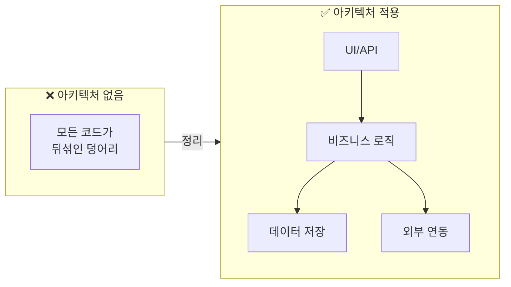
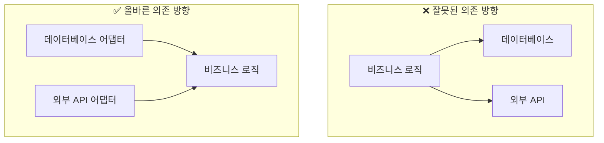
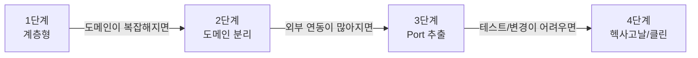

> **대상 독자**: 프로젝트 아키텍처 선택이 필요한 개발자 및 아키텍트
> **선수 지식**: [전술적 설계](tactical-design/) 빌딩 블록에 대한 이해
> **소요 시간**: 약 25분
> **핵심 질문**: "Layered, Hexagonal, Clean Architecture 중 어떤 것을 선택해야 하는가?"


아키텍처 선택 기준: **Layered**(단순, 빠른 개발) → **Hexagonal**(테스트 용이, 인프라 교체) → **Clean**(복잡한 도메인, 장기 유지보수)



소프트웨어 아키텍처를 **건물 설계**에 비유할 수 있습니다:

- **아키텍처 없음**: 모든 방이 하나로 연결된 원룸. 부엌에서 요리하면 침실에 냄새가 나고, 손님이 오면 모든 공간을 정리해야 합니다.
- **계층형**: 층별로 용도가 나뉜 건물. 1층 상가, 2층 사무실, 3층 주거. 위층은 아래층에 의존합니다.
- **헥사고날**: 중앙 홀과 여러 출입구. 정문, 후문, 지하주차장 어디로 들어와도 같은 홀에 도착합니다. 출입구(어댑터)를 바꿔도 내부 구조는 그대로입니다.
- **클린**: 성의 동심원 구조. 해자(외부 세계) → 성벽(프레임워크) → 내성(비즈니스 로직) → 천수각(핵심 엔터티). 바깥에서 안으로만 들어올 수 있습니다.

**핵심 질문**: "비즈니스 로직(천수각)을 외부 변화로부터 얼마나 보호해야 하는가?"


DDD를 효과적으로 구현하기 위한 아키텍처 패턴들을 살펴봅니다. 좋은 아키텍처는 비즈니스 로직을 보호하고, 변경에 유연하며, 테스트하기 쉬운 시스템을 만들 수 있게 해줍니다. 각 패턴의 철학과 실제 적용 방법을 이해하면, 프로젝트에 맞는 최선의 선택을 할 수 있습니다.

#### 아키텍처 패턴이 왜 필요한가?

처음 프로젝트를 시작할 때는 모든 코드가 한 곳에 있어도 괜찮습니다. 하지만 시간이 지나고 기능이 추가되면서 코드는 점점 복잡해지고, 어디에 무엇이 있는지 찾기 어려워집니다. 아키텍처 패턴은 이런 혼란을 방지하고 시스템을 체계적으로 구성하는 방법을 제시합니다.

**스파게티 코드의 문제**

실제 프로젝트에서 자주 볼 수 있는 문제를 살펴보겠습니다. Controller에 모든 로직이 들어가 있는 경우입니다. 입력 검증, 비즈니스 로직, 데이터베이스 접근, 외부 API 호출까지 모두 한 곳에 있습니다.

```java
// ❌ 실제 프로젝트에서 자주 보는 문제
@RestController
public class OrderController {

    @Autowired
    private JdbcTemplate jdbcTemplate;

    @PostMapping("/orders")
    public String createOrder(@RequestBody Map<String, Object> request) {
        // 1. 입력 검증 (Controller에서?)
        String customerId = (String) request.get("customerId");
        if (customerId == null) {
            return "고객 ID 필요";
        }

        // 2. 비즈니스 로직 (Controller에서?)
        double total = 0;
        List<Map> items = (List<Map>) request.get("items");
        for (Map item : items) {
            total += (Double) item.get("price") * (Integer) item.get("quantity");
        }

        // 3. 할인 계산 (여기서도?)
        if (total > 100000) {
            total = total * 0.9;
        }

        // 4. 데이터베이스 직접 접근 (Controller에서!)
        jdbcTemplate.update(
            "INSERT INTO orders (customer_id, total) VALUES (?, ?)",
            customerId, total
        );

        // 5. 외부 API 호출까지...
        restTemplate.postForObject("http://payment-service/pay", ...);

        return "주문 완료";
    }
}
```

이 코드는 여러 문제를 가지고 있습니다. 첫째, 모든 것이 뒤섞여 있어서 어디서 무엇을 하는지 찾기 어렵습니다. 둘째, 데이터베이스나 외부 API 없이는 테스트할 수 없습니다. 셋째, 한 곳을 수정하면 다른 곳에서 예상치 못한 버그가 발생할 수 있습니다. 넷째, 같은 로직이 필요한 다른 곳에서는 복사해서 붙여넣기를 해야 합니다. 다섯째, 여러 사람이 동시에 수정하면 충돌이 발생합니다.

| 문제 | 결과 |
|------|------|
| **모든 것이 뒤섞임** | 어디서 뭘 하는지 찾기 어려움 |
| **테스트 불가능** | DB, 외부 API 없이 테스트할 수 없음 |
| **변경이 위험** | 한 곳 수정 → 다른 곳에서 버그 |
| **재사용 불가** | 다른 곳에서 같은 로직 필요하면 복사/붙여넣기 |
| **협업 어려움** | 여러 사람이 동시에 수정하면 충돌 |

**아키텍처의 목적**

아키텍처 패턴을 적용하면 코드를 체계적으로 정리할 수 있습니다. UI/API 계층, 비즈니스 로직 계층, 데이터 저장 계층, 외부 연동 계층을 명확히 분리하여 각각이 자신의 역할에만 집중하게 합니다.



아키텍처 패턴을 사용하면 여러 이점을 얻을 수 있습니다. 첫째, 관심사 분리로 각 부분이 한 가지 역할만 담당합니다. UI는 사용자 인터페이스만, 비즈니스 로직은 도메인 규칙만, 저장소는 데이터 저장만 처리합니다. 둘째, 비즈니스 로직만 따로 떼어내서 테스트할 수 있습니다. 셋째, 데이터베이스를 MySQL에서 PostgreSQL로 바꿔도 비즈니스 로직은 그대로 유지됩니다. 넷째, 팀원들이 각자 다른 계층을 담당하여 동시에 작업할 수 있습니다.

**핵심 원칙: 의존성 방향**

모든 아키텍처 패턴이 공유하는 가장 중요한 원칙이 있습니다. 바로 의존성의 방향입니다. 비즈니스 로직(도메인)은 어떤 것에도 의존하지 않아야 합니다. 다른 모든 것들이 비즈니스 로직에 의존해야 합니다.



왜 이렇게 해야 할까요? 비즈니스 로직은 시스템의 핵심이며 가장 중요합니다. 상대적으로 안정적이고 자주 바뀌지 않습니다. 반면 데이터베이스나 외부 API는 변경될 수 있습니다. MySQL에서 PostgreSQL로, REST에서 gRPC로 바뀔 수 있습니다. 중요한 것이 덜 중요한 것에 의존하면, 덜 중요한 것이 바뀔 때 중요한 것도 함께 바꿔야 합니다. 이는 위험하고 비용이 많이 듭니다. 따라서 의존성의 방향을 역전시켜 안정적인 것을 중심에 두고, 변경 가능한 것들이 이를 의존하게 만듭니다.

#### 아키텍처 패턴 한눈에 보기

DDD를 구현할 때 주로 사용되는 네 가지 아키텍처 패턴이 있습니다. 각 패턴은 조금씩 다른 방식으로 코드를 구조화하지만, 모두 도메인 로직을 보호한다는 공통 목표를 가지고 있습니다.

**4가지 주요 패턴**

계층형 아키텍처는 Presentation, Application, Domain, Infrastructure의 4계층으로 구성되며 위에서 아래로 의존합니다. 헥사고날 아키텍처는 Adapter, Port, Core로 구성되며 외부로부터 Core를 격리합니다. 클린 아키텍처는 Framework, Adapter, Use Case, Entity의 동심원 구조로 안쪽으로만 의존합니다. 어니언 아키텍처는 Infrastructure, Application, Domain Service, Domain Model의 양파 구조로 중심을 향해 의존합니다.

```mermaid
flowchart TB
    subgraph Layered["계층형 (Layered)"]
        L1["Presentation"]
        L2["Application"]
        L3["Domain"]
        L4["Infrastructure"]
        L1 --> L2 --> L3 --> L4
    end

    subgraph Hex["헥사고날 (Hexagonal)"]
        H1["Adapter"]
        H2["Port"]
        H3["Core"]
        H1 --> H2 --> H3
    end

    subgraph Clean["클린 (Clean)"]
        C1["Framework"]
        C2["Adapter"]
        C3["Use Case"]
        C4["Entity"]
        C1 --> C2 --> C3 --> C4
    end

    subgraph Onion["어니언 (Onion)"]
        O1["Infrastructure"]
        O2["Application"]
        O3["Domain Service"]
        O4["Domain Model"]
        O1 --> O2 --> O3 --> O4
    end
```



**패턴별 특징 비교**

각 패턴의 핵심 개념, 난이도, 적합한 상황을 비교해보면 프로젝트에 맞는 선택을 할 수 있습니다. 계층형 아키텍처는 위에서 아래로 흐르는 4계층 구조로 가장 쉽게 시작할 수 있어 처음 시작하는 프로젝트나 단순한 프로젝트에 적합합니다. 헥사고날 아키텍처는 Port와 Adapter로 외부를 격리하는 구조로 보통 난이도이며, 외부 시스템 연동이 많은 프로젝트에 적합합니다. 클린 아키텍처는 엄격한 의존성 규칙을 가진 동심원 구조로 가장 어렵지만, 대규모 장기 프로젝트에서 명확한 구조를 제공합니다. 어니언 아키텍처는 도메인 모델을 중심에 둔 양파 구조로 보통 난이도이며, DDD를 본격적으로 적용하는 프로젝트에 적합합니다.

| 패턴 | 핵심 개념 | 난이도 | 적합한 상황 |
|------|----------|--------|------------|
| **[계층형](./layered-architecture/)** | 위에서 아래로 흐르는 4계층 | 쉬움 | 처음 시작, 단순한 프로젝트 |
| **[헥사고날](./hexagonal-architecture/)** | Port와 Adapter로 외부 격리 | 보통 | 외부 연동 많은 프로젝트 |
| **[클린](./clean-architecture/)** | 엄격한 의존성 규칙 | 어려움 | 대규모, 장기 프로젝트 |
| **[어니언](./onion-architecture/)** | 도메인 모델 중심 | 보통 | DDD 적용 프로젝트 |

**어떤 패턴을 선택해야 할까?**

프로젝트를 시작할 때 적절한 아키텍처를 선택하는 것은 중요합니다. 팀의 경험, 프로젝트 규모, 외부 연동 필요성, DDD 적용 여부 등을 고려해야 합니다. 팀이 아키텍처 패턴 경험이 없다면 계층형부터 시작하는 것이 좋습니다. 경험이 있고 프로젝트가 크거나 장기적이라면 더 고급 패턴을 고려할 수 있습니다. 외부 시스템 연동이 많다면 헥사고날이 유리하고, DDD를 본격적으로 적용한다면 어니언이 적합합니다.

**실용적 조언**

처음이라면 계층형부터 시작하세요. 완벽한 아키텍처보다 동작하는 코드가 먼저입니다. 계층형으로 시작해서 필요할 때 점진적으로 발전시키는 것이 현실적입니다. 작은 프로젝트에 복잡한 아키텍처를 적용하는 것은 오버엔지니어링이 될 수 있습니다.

| 상황 | 권장 패턴 | 이유 |
|------|----------|------|
| 스타트업, MVP | 계층형 | 빠른 개발이 우선 |
| 복잡한 비즈니스 로직 | 헥사고날 or 어니언 | 도메인 보호 필요 |
| 마이크로서비스 | 헥사고날 | 서비스 경계와 잘 맞음 |
| 대규모 팀 | 클린 | 명확한 규칙으로 협업 |
| 레거시 통합 | 헥사고날 | ACL로 레거시 격리 |

#### 점진적 발전 경로

처음부터 복잡한 아키텍처를 적용할 필요는 없습니다. 프로젝트가 성장하면서 자연스럽게 아키텍처도 발전시킬 수 있습니다. 1단계에서는 계층형으로 시작합니다. 도메인이 복잡해지면 2단계로 넘어가 도메인을 분리합니다. 외부 연동이 많아지면 3단계로 Port를 추출합니다. 테스트나 변경이 어려워지면 4단계로 헥사고날이나 클린 아키텍처를 적용합니다.



각 단계로 넘어갈 신호를 알아두면 적절한 시점에 아키텍처를 발전시킬 수 있습니다. 1단계에서 2단계로 가는 신호는 "이 로직이 Controller에 있어도 되나?"라는 의문이 생기거나, 같은 로직을 여러 Controller에서 복사하고 있을 때입니다. 2단계에서 3단계로 가는 신호는 "데이터베이스를 바꾸면 도메인도 수정해야 하네"라고 느끼거나, 외부 의존성 때문에 테스트 작성이 어려울 때입니다. 3단계에서 4단계로 가는 신호는 팀이 커져서 명확한 규칙이 필요하거나, 장기 유지보수를 위한 투자가 필요할 때입니다.

#### 상세 가이드

각 아키텍처 패턴에 대한 자세한 설명은 별도 페이지에서 확인할 수 있습니다. 계층형 아키텍처는 가장 기본적인 4계층 구조를 다룹니다. Presentation, Application, Domain, Infrastructure 계층의 역할과 구현 방법을 설명합니다. 헥사고날 아키텍처는 Port와 Adapter로 외부를 격리하는 방법을 다룹니다. 도메인 로직을 중심에 두고 외부 세계와의 연결을 추상화합니다. 클린 아키텍처는 엄격한 의존성 규칙을 가진 동심원 구조를 다룹니다. Entity, Use Case, Interface Adapter, Framework의 역할과 의존성 규칙을 설명합니다. 어니언 아키텍처는 도메인 모델을 중심에 둔 양파 구조를 다룹니다. Domain Model, Domain Service, Application Service, Infrastructure의 계층과 관계를 설명합니다.

1. **계층형 아키텍처 (Layered)** - 가장 기본적인 4계층 구조
2. **헥사고날 아키텍처 (Hexagonal)** - Port와 Adapter로 외부 격리
3. **클린 아키텍처 (Clean)** - 엄격한 의존성 규칙의 동심원
4. **어니언 아키텍처 (Onion)** - 도메인 모델 중심의 양파 구조

#### 다음 단계

- [CQRS](cqrs/) - 읽기와 쓰기를 분리하는 패턴
- [이벤트 소싱](../examples/event-sourcing/) - 상태 대신 이벤트를 저장
- [안티패턴](anti-patterns/) - 피해야 할 흔한 실수들
