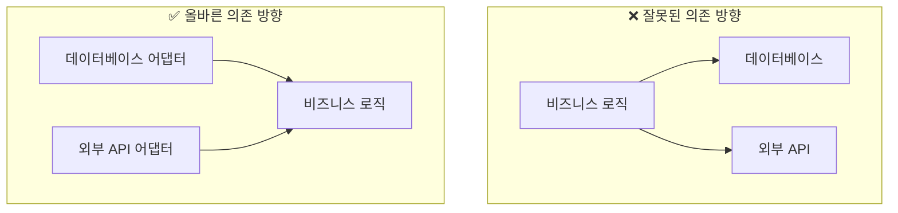
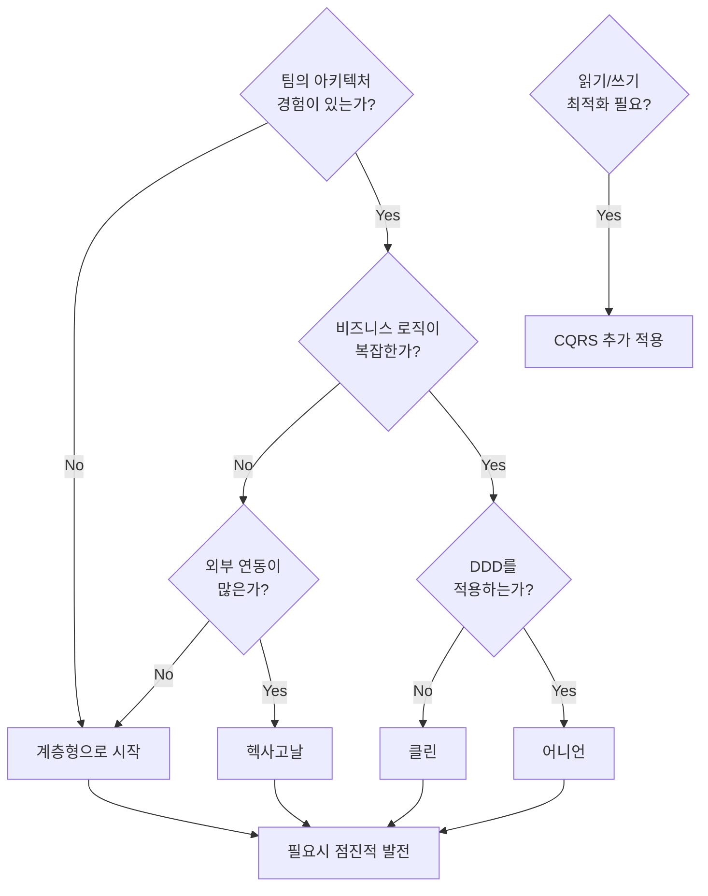
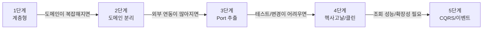

> **대상 독자**: 프로젝트 아키텍처 선택이 필요한 개발자 및 아키텍트
> **선수 지식**: [전술적 설계](../tactical-design/) 빌딩 블록에 대한 이해
> **이 섹션의 목적**: 아키텍처 패턴의 철학을 이해하고 프로젝트에 적합한 선택을 할 수 있게 함


이 섹션은 DDD를 효과적으로 구현하기 위한 <strong>아키텍처 패턴</strong>들을 다룹니다. 좋은 아키텍처는 비즈니스 로직을 보호하고, 변경에 유연하며, 테스트하기 쉬운 시스템을 만들 수 있게 해줍니다.


## 전체 비유 테이블

아키텍처 패턴을 한눈에 이해할 수 있는 비유입니다.

| 아키텍처 | 비유 | 핵심 철학 | 한 줄 요약 |
|----------|------|-----------|-----------|
| **[계층형](layered-architecture/)** | 건물 층 | 위에서 아래로 흐르는 단순한 구조 | "역할별로 층을 나누자" |
| **[헥사고날](hexagonal-architecture/)** | 스마트폰과 어댑터 | 외부 세계를 Port/Adapter로 격리 | "내부를 외부로부터 보호하자" |
| **[클린](clean-architecture/)** | 성의 동심원 | 의존성은 항상 안쪽으로만 | "비즈니스 규칙이 왕이다" |
| **[어니언](onion-architecture/)** | 양파 껍질 | 도메인 모델을 가장 중심에 | "도메인이 모든 것의 중심" |
| **[CQRS](cqrs/)** | 읽기/쓰기 분리 창구 | 명령과 조회의 완전한 분리 | "읽기와 쓰기를 따로 최적화" |
| **[이벤트 기반](event-driven/)** | 회사 공지 시스템 | 느슨한 결합과 비동기 통신 | "일어난 일을 알리고 반응하자" |

## 아키텍처 패턴이 왜 필요한가?

처음 프로젝트를 시작할 때는 모든 코드가 한 곳에 있어도 괜찮습니다. 하지만 시간이 지나고 기능이 추가되면서 코드는 점점 복잡해지고, 어디에 무엇이 있는지 찾기 어려워집니다. 아키텍처 패턴은 이런 혼란을 방지하고 시스템을 체계적으로 구성하는 방법을 제시합니다.


소프트웨어 아키텍처를 <strong>건물 설계</strong>에 비유할 수 있습니다:

- **아키텍처 없음**: 모든 방이 하나로 연결된 원룸. 부엌에서 요리하면 침실에 냄새가 나고, 손님이 오면 모든 공간을 정리해야 합니다.
- **계층형**: 층별로 용도가 나뉜 건물. 1층 상가, 2층 사무실, 3층 주거. 위층은 아래층에 의존합니다.
- **헥사고날**: 중앙 홀과 여러 출입구. 정문, 후문, 지하주차장 어디로 들어와도 같은 홀에 도착합니다. 출입구(어댑터)를 바꿔도 내부 구조는 그대로입니다.
- **클린**: 성의 동심원 구조. 해자(외부 세계) → 성벽(프레임워크) → 내성(비즈니스 로직) → 천수각(핵심 엔터티). 바깥에서 안으로만 들어올 수 있습니다.

**핵심 질문**: "비즈니스 로직(천수각)을 외부 변화로부터 얼마나 보호해야 하는가?"


## 핵심 원칙: 의존성 방향

모든 아키텍처 패턴이 공유하는 가장 중요한 원칙이 있습니다. 바로 의존성의 방향입니다. 비즈니스 로직(도메인)은 어떤 것에도 의존하지 않아야 합니다. 다른 모든 것들이 비즈니스 로직에 의존해야 합니다.

*잘못된 의존 방향(비즈니스 로직이 DB에 의존)과 올바른 의존 방향(DB가 비즈니스 로직에 의존)을 비교합니다.*

## 아키텍처 패턴별 철학

각 아키텍처 패턴은 고유한 철학과 설계 목표를 가지고 있습니다.

### 계층형 아키텍처

**철학**: "관심사를 분리하여 각 층이 자기 역할에 집중하게 하자"

- **등장 배경**: 코드가 뒤섞여 유지보수가 어려워지는 문제 해결
- **핵심 아이디어**: 수직적 분리, 위에서 아래로만 호출
- **추구하는 가치**: 단순함, 이해하기 쉬움, 빠른 개발

### 헥사고날 아키텍처

**철학**: "애플리케이션 핵심을 외부 세계로부터 완전히 격리하자"

- **등장 배경**: 외부 시스템 변경이 비즈니스 로직에 영향을 주는 문제 해결
- **핵심 아이디어**: Port와 Adapter로 경계 정의
- **추구하는 가치**: 테스트 용이성, 기술 교체 유연성

### 클린 아키텍처

**철학**: "의존성은 항상 안쪽으로만 향해야 한다"

- **등장 배경**: 프레임워크에 종속된 코드의 유지보수 문제
- **핵심 아이디어**: 엄격한 의존성 규칙, 동심원 구조
- **추구하는 가치**: 프레임워크 독립성, 장기 유지보수

### 어니언 아키텍처

**철학**: "도메인 모델이 왕이다. 나머지는 모두 도메인을 섬긴다"

- **등장 배경**: DDD를 효과적으로 구현하기 위한 구조 필요
- **핵심 아이디어**: 도메인 모델을 가장 중심에 배치
- **추구하는 가치**: 도메인 순수성, DDD 친화성

### CQRS

**철학**: "읽기와 쓰기는 근본적으로 다른 문제이므로 분리하자"

- **등장 배경**: 조회와 명령의 최적화 요구사항 차이
- **핵심 아이디어**: Command와 Query 모델 분리
- **추구하는 가치**: 각각에 맞는 최적화, 확장성

### 이벤트 기반 아키텍처

**철학**: "무슨 일이 일어났는지 알리고, 관심 있는 쪽이 반응하게 하자"

- **등장 배경**: 강하게 결합된 시스템의 유연성 문제
- **핵심 아이디어**: 도메인 이벤트를 통한 느슨한 결합
- **추구하는 가치**: 확장성, 느슨한 결합, 비동기 처리

## 패턴별 특징 비교

| 패턴 | 핵심 개념 | 난이도 | 적합한 상황 |
|------|----------|--------|------------|
| **[계층형](layered-architecture/)** | 위에서 아래로 흐르는 4계층 | 쉬움 | 처음 시작, 단순한 프로젝트 |
| **[헥사고날](hexagonal-architecture/)** | Port와 Adapter로 외부 격리 | 보통 | 외부 연동 많은 프로젝트 |
| **[클린](clean-architecture/)** | 엄격한 의존성 규칙 | 어려움 | 대규모, 장기 프로젝트 |
| **[어니언](onion-architecture/)** | 도메인 모델 중심 | 보통 | DDD 적용 프로젝트 |
| **[CQRS](cqrs/)** | 읽기/쓰기 분리 | 어려움 | 복잡한 조회/성능 요구 |
| **[이벤트 기반](event-driven/)** | 도메인 이벤트 | 보통~어려움 | 마이크로서비스, 비동기 처리 |

## Best Practice: 어떤 시스템에 어울리는가?

프로젝트 특성에 따라 적합한 아키텍처가 다릅니다.

### 시스템 유형별 권장 아키텍처

| 시스템 유형 | 권장 아키텍처 | 이유 |
|------------|--------------|------|
| **스타트업 MVP** | 계층형 | 빠른 개발이 우선, 복잡성 최소화 |
| **내부 관리 시스템** | 계층형 또는 헥사고날 | 적당한 복잡도, 유지보수 용이 |
| **이커머스 플랫폼** | 헥사고날 + 이벤트 기반 | 외부 연동 많음, 확장성 필요 |
| **금융/보험 시스템** | 어니언 또는 클린 | 복잡한 도메인, 규정 준수 |
| **대규모 엔터프라이즈** | 클린 + CQRS | 명확한 규칙, 여러 팀 협업 |
| **마이크로서비스** | 헥사고날 + 이벤트 기반 | 서비스 경계, 느슨한 결합 |
| **레거시 통합** | 헥사고날 | ACL로 레거시 격리 |
| **리포팅 중심** | CQRS | 복잡한 조회 최적화 |

### 선택 플로우차트

*팀 경험, 비즈니스 로직 복잡도, 외부 연동 수를 기준으로 적합한 아키텍처 패턴을 선택하는 플로우차트입니다.*

## 점진적 발전 경로

처음부터 복잡한 아키텍처를 적용할 필요는 없습니다. 프로젝트가 성장하면서 자연스럽게 아키텍처도 발전시킬 수 있습니다.

*계층형에서 시작하여 도메인 분리, Port 추출, 헥사고날/어니언으로 점진적으로 아키텍처를 발전시키는 로드맵입니다.*

### 단계별 진화 신호

| 현재 → 다음 | 신호 |
|------------|------|
| 계층형 → 도메인 분리 | "이 로직이 Controller에 있어도 되나?" |
| 도메인 분리 → Port 추출 | "DB를 바꾸면 도메인도 수정해야 하네" |
| Port 추출 → 헥사고날/클린 | "팀이 커져서 명확한 규칙이 필요해" |
| 헥사고날/클린 → CQRS | "조회 성능이 병목이야" |
| → 이벤트 기반 | "서비스 간 결합도를 낮춰야 해" |

## 학습 순서

각 아키텍처 패턴을 다음 순서로 학습하는 것을 권장합니다.

### 기초 아키텍처

| 순서 | 문서 | 핵심 질문 |
|------|------|----------|
| 1 | [계층형 아키텍처](layered-architecture/) | "코드를 어떻게 구조화할 것인가?" |
| 2 | [헥사고날 아키텍처](hexagonal-architecture/) | "외부를 어떻게 격리할 것인가?" |
| 3 | [클린 아키텍처](clean-architecture/) | "의존성을 어떻게 관리할 것인가?" |
| 4 | [어니언 아키텍처](onion-architecture/) | "도메인을 어떻게 보호할 것인가?" |

### 고급 패턴

| 순서 | 문서 | 핵심 질문 |
|------|------|----------|
| 5 | [CQRS](cqrs/) | "읽기와 쓰기를 분리해야 하는가?" |
| 6 | [이벤트 기반 아키텍처](event-driven/) | "컴포넌트 간 통신을 어떻게 할 것인가?" |

## 다음 단계

- **처음 시작이라면**: [계층형 아키텍처](layered-architecture/)부터 시작하세요
- **외부 연동이 많다면**: [헥사고날 아키텍처](hexagonal-architecture/)를 확인하세요
- **DDD를 적용한다면**: [어니언 아키텍처](onion-architecture/)가 적합합니다
- **조회 성능이 중요하다면**: [CQRS](cqrs/)를 검토하세요
