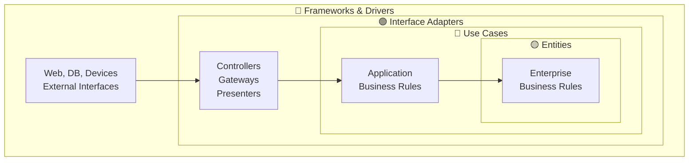
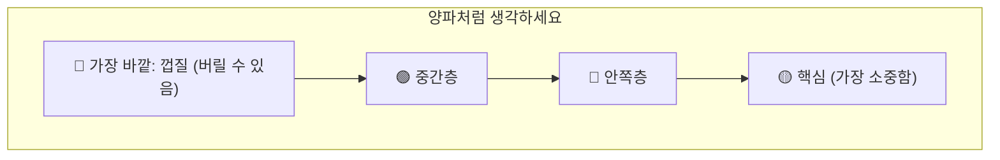
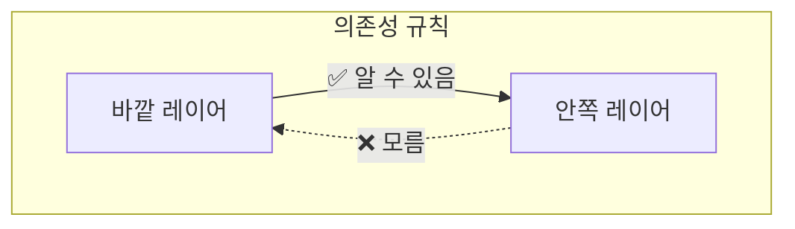
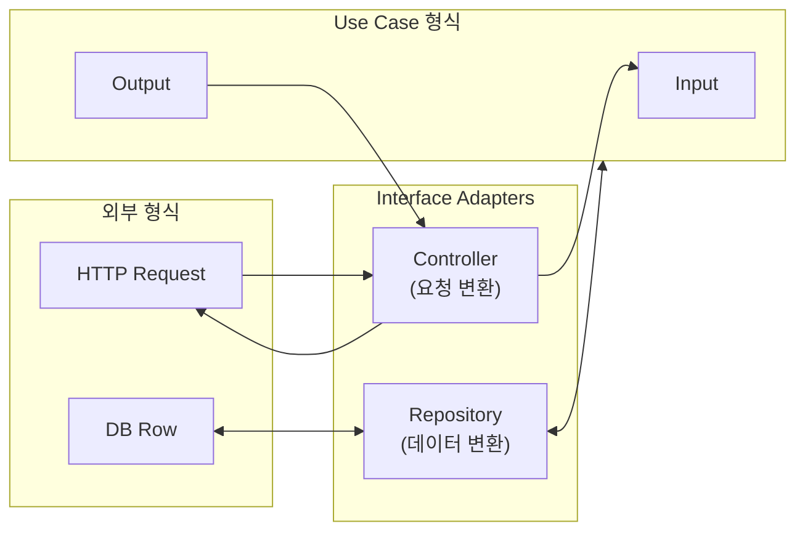
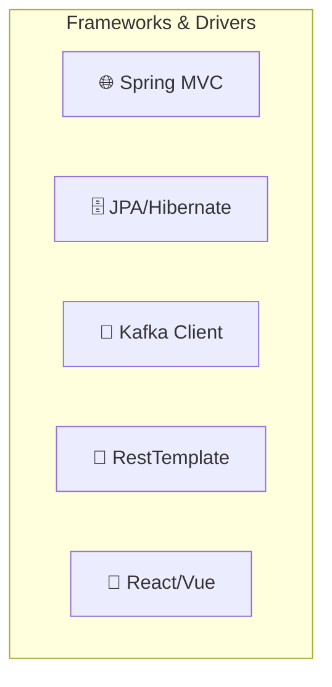
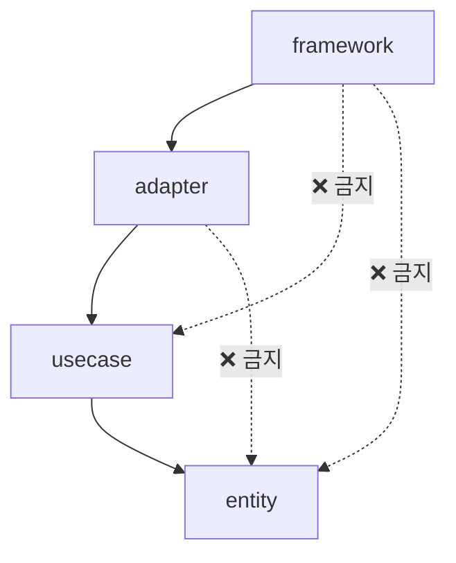
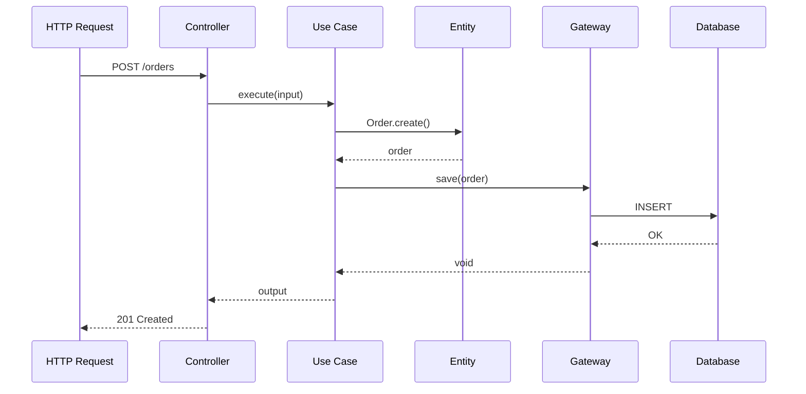
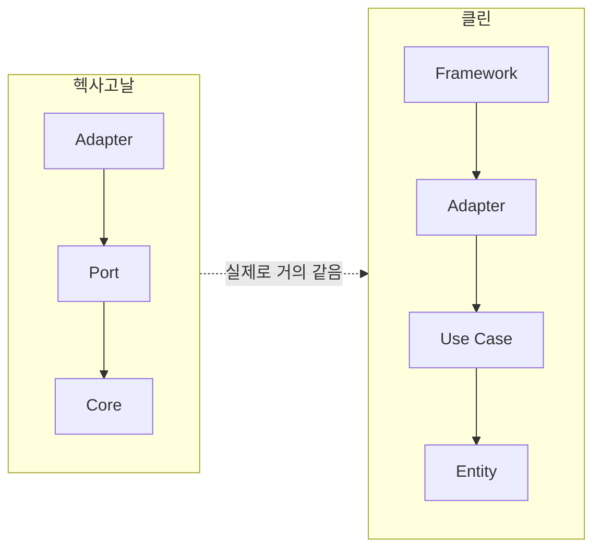
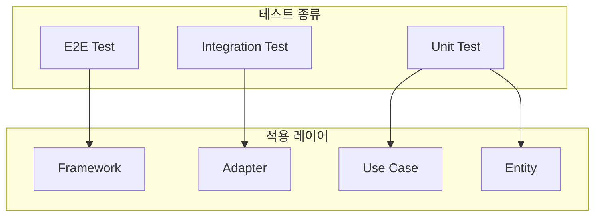
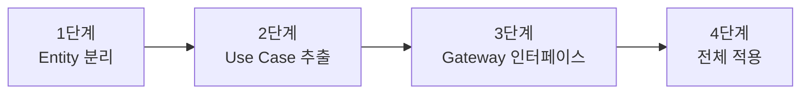

> **대상 독자**: 엄격한 의존성 관리가 필요한 대규모 프로젝트 개발자
> **선수 지식**: [헥사고날 아키텍처](hexagonal-architecture/)의 Port/Adapter 개념
> **소요 시간**: 약 25분

# 클린 아키텍처 (Clean Architecture)

Uncle Bob(Robert C. Martin)이 2012년에 제안한 아키텍처입니다. <strong>의존성 규칙</strong>을 엄격하게 지키는 것이 핵심입니다.

클린 아키텍처가 등장한 배경에는 소프트웨어 개발의 고질적인 문제가 있습니다. 비즈니스 로직이 프레임워크나 데이터베이스에 강하게 결합되면, 기술 스택을 변경하거나 테스트를 작성하는 것이 매우 어려워집니다. 예를 들어, JPA 어노테이션이 도메인 객체에 직접 붙어 있으면, 해당 도메인 로직을 테스트하려면 반드시 데이터베이스 연결이 필요하게 됩니다. 클린 아키텍처는 이런 문제를 해결하기 위해 <strong>비즈니스 규칙을 기술적 세부사항으로부터 완전히 격리</strong>하는 것을 목표로 합니다.

## 한 줄 요약

> **의존성은 항상 안쪽으로만 향한다**



---

## "동심원"으로 이해하기

### 비유: 양파 껍질

양파를 잘라보면 여러 겹의 층이 있습니다:



소프트웨어도 마찬가지입니다:

| 층 | 양파 비유 | 소프트웨어 | 변경 빈도 |
|---|---------|----------|---------|
| 🟡 **핵심** | 가장 안쪽 | 비즈니스 규칙 | 거의 안 바뀜 |
| 🔴 **안쪽** | 중간 안쪽 | Use Case | 가끔 바뀜 |
| 🟢 **중간** | 중간 바깥 | Adapter | 자주 바뀜 |
| 🔵 **바깥** | 껍질 | Framework | 언제든 교체 가능 |

**핵심 아이디어:** 가장 중요한 것(비즈니스 규칙)을 가장 안쪽에 두고, 덜 중요한 것(기술적 세부사항)을 바깥에 둡니다.

---

## 의존성 규칙 (The Dependency Rule)

```
📌 규칙: 안쪽 원은 바깥쪽 원에 대해 아무것도 모른다
```



**이것이 왜 중요할까요?**

```java
// ❌ 규칙 위반: Entity가 Framework를 알고 있음
public class Order {
    @Entity  // JPA 어노테이션 = Framework!
    @Table(name = "orders")
    public void save() {
        // Spring의 뭔가를 사용...
    }
}

// ✅ 규칙 준수: Entity는 순수한 비즈니스 로직만
public class Order {
    private OrderId id;
    private Money totalAmount;

    public void confirm() {
        // 순수한 비즈니스 로직만
        if (!canBeConfirmed()) {
            throw new IllegalStateException("확정할 수 없습니다");
        }
        this.status = OrderStatus.CONFIRMED;
    }
}
```

---

## 4개의 레이어 상세 설명

### 1. Entities (엔티티) - 🟡 가장 안쪽

<strong>핵심 비즈니스 규칙</strong>이 있는 곳입니다. 회사 전체에서 공유되는 규칙입니다.

```
예: "주문 금액이 100만원 이상이면 VIP 고객으로 분류"
    → 이건 어떤 시스템에서 사용하든 같은 규칙
```

```java
// Entities Layer
public class Order {
    private OrderId id;
    private CustomerId customerId;
    private List<OrderLine> lines;
    private OrderStatus status;
    private Money totalAmount;

    // 핵심 비즈니스 규칙
    public void confirm() {
        validateCanConfirm();
        this.status = OrderStatus.CONFIRMED;
    }

    public void cancel() {
        validateCanCancel();
        this.status = OrderStatus.CANCELLED;
    }

    public boolean isVipOrder() {
        return totalAmount.isGreaterThan(Money.of(1_000_000));
    }

    private void validateCanConfirm() {
        if (status != OrderStatus.PENDING) {
            throw new InvalidOrderStateException("PENDING 상태에서만 확정 가능");
        }
        if (lines.isEmpty()) {
            throw new EmptyOrderException("주문 항목이 없습니다");
        }
    }
}
```

```java
// Value Object (Entities Layer에 포함)
public record Money(BigDecimal amount, Currency currency) {

    public Money {
        if (amount.compareTo(BigDecimal.ZERO) < 0) {
            throw new IllegalArgumentException("금액은 0 이상이어야 합니다");
        }
    }

    public boolean isGreaterThan(Money other) {
        return this.amount.compareTo(other.amount) > 0;
    }

    public Money add(Money other) {
        validateSameCurrency(other);
        return new Money(this.amount.add(other.amount), this.currency);
    }
}
```


**Entity의 특징**
- 어떤 프레임워크에도 의존하지 않음
- 순수한 Java 객체 (POJO)
- 비즈니스 규칙을 메서드로 표현
- 테스트하기 가장 쉬움


---

### 2. Use Cases (유스케이스) - 🔴

<strong>애플리케이션 비즈니스 규칙</strong>이 있는 곳입니다. "이 시스템에서" 어떻게 동작하는지 정의합니다.

```
예: "웹 주문 시 재고 확인 → 결제 → 주문 확정 → 알림"
    → 이건 우리 시스템만의 흐름
```

```java
// Use Case Interface (Input Port)
public interface CreateOrderUseCase {
    CreateOrderOutput execute(CreateOrderInput input);
}

// Input (Request Model)
public record CreateOrderInput(
    String customerId,
    List<OrderLineInput> lines
) {}

// Output (Response Model)
public record CreateOrderOutput(
    String orderId,
    String status,
    BigDecimal totalAmount
) {}
```

```java
// Use Case 구현 (Interactor)
public class CreateOrderInteractor implements CreateOrderUseCase {

    // Output Ports (외부와의 연결은 인터페이스로)
    private final OrderRepository orderRepository;
    private final InventoryGateway inventoryGateway;
    private final PaymentGateway paymentGateway;

    @Override
    public CreateOrderOutput execute(CreateOrderInput input) {
        // 1. 재고 확인
        for (OrderLineInput line : input.lines()) {
            if (!inventoryGateway.checkAvailability(line.productId(), line.quantity())) {
                throw new InsufficientInventoryException(line.productId());
            }
        }

        // 2. Entity 생성 (핵심 비즈니스 로직은 Entity에)
        Order order = Order.create(
            CustomerId.of(input.customerId()),
            toOrderLines(input.lines())
        );

        // 3. 저장
        orderRepository.save(order);

        // 4. Output 생성
        return new CreateOrderOutput(
            order.getId().getValue(),
            order.getStatus().name(),
            order.getTotalAmount().getAmount()
        );
    }
}
```


**Use Case의 규칙**

1. **Entity만 사용** - Use Case는 Entity를 호출하고, Entity가 실제 비즈니스 로직 수행
2. **Gateway 인터페이스 사용** - 외부 시스템은 인터페이스로 추상화
3. **Input/Output 객체** - 외부와의 데이터 교환용 객체 정의


---

### 3. Interface Adapters (인터페이스 어댑터) - 🟢

<strong>데이터 변환</strong>을 담당합니다. Use Case가 원하는 형태 ↔ 외부 시스템이 원하는 형태.



**세 가지 종류의 Adapter:**

| Adapter | 역할 | 예시 |
|---------|------|------|
| **Controller** | HTTP 요청 → Use Case Input | REST Controller |
| **Presenter** | Use Case Output → HTTP 응답 | View Model 생성 |
| **Gateway** | Use Case 요청 → 외부 시스템 | Repository 구현 |

```java
// Controller (HTTP → Use Case)
@RestController
@RequestMapping("/api/orders")
public class OrderController {

    private final CreateOrderUseCase createOrderUseCase;

    @PostMapping
    public ResponseEntity<OrderResponse> createOrder(
            @RequestBody CreateOrderRequest request) {

        // 1. HTTP Request → Use Case Input 변환
        CreateOrderInput input = new CreateOrderInput(
            request.customerId(),
            request.items().stream()
                .map(this::toOrderLineInput)
                .toList()
        );

        // 2. Use Case 실행
        CreateOrderOutput output = createOrderUseCase.execute(input);

        // 3. Use Case Output → HTTP Response 변환
        OrderResponse response = new OrderResponse(
            output.orderId(),
            output.status(),
            output.totalAmount()
        );

        return ResponseEntity.status(HttpStatus.CREATED).body(response);
    }
}

// Gateway 구현 (Repository)
@Repository
public class JpaOrderRepository implements OrderRepository {

    private final OrderJpaRepository jpaRepository;
    private final OrderDataMapper mapper;

    @Override
    public void save(Order order) {
        // Domain Entity → JPA Entity 변환
        JpaOrderEntity entity = mapper.toJpaEntity(order);
        jpaRepository.save(entity);
    }

    @Override
    public Optional<Order> findById(OrderId id) {
        // JPA Entity → Domain Entity 변환
        return jpaRepository.findById(id.getValue())
            .map(mapper::toDomain);
    }
}
```

---

### 4. Frameworks & Drivers (프레임워크 & 드라이버) - 🔵 가장 바깥

<strong>외부 도구들</strong>이 있는 곳입니다. 언제든 교체할 수 있습니다.



```java
// Framework Layer: Spring 설정
@Configuration
public class OrderConfig {

    @Bean
    public CreateOrderUseCase createOrderUseCase(
            OrderRepository orderRepository,
            InventoryGateway inventoryGateway) {
        return new CreateOrderInteractor(orderRepository, inventoryGateway);
    }
}

// Framework Layer: JPA Entity
@Entity
@Table(name = "orders")
public class JpaOrderEntity {
    @Id
    private String id;
    private String customerId;
    private String status;
    private BigDecimal totalAmount;

    @OneToMany(mappedBy = "order", cascade = CascadeType.ALL)
    private List<JpaOrderLineEntity> lines;
}

// Framework Layer: Spring Data Repository
public interface OrderJpaRepository extends JpaRepository<JpaOrderEntity, String> {
}
```


**Framework Layer의 역할**
- Spring, JPA, Kafka 같은 외부 도구 설정
- 의존성 주입 설정 (Bean 등록)
- 기술적 세부사항만 다룸


---

## 패키지 구조

```
com.example.order/
│
├── entity/                          # 🟡 Entities (가장 안쪽)
│   ├── Order.java
│   ├── OrderLine.java
│   ├── OrderId.java
│   ├── OrderStatus.java
│   └── Money.java
│
├── usecase/                         # 🔴 Use Cases
│   ├── port/
│   │   ├── in/                      # Input Ports (Use Case Interfaces)
│   │   │   ├── CreateOrderUseCase.java
│   │   │   ├── CreateOrderInput.java
│   │   │   └── CreateOrderOutput.java
│   │   └── out/                     # Output Ports (Gateway Interfaces)
│   │       ├── OrderRepository.java
│   │       ├── InventoryGateway.java
│   │       └── PaymentGateway.java
│   └── interactor/                  # Use Case Implementations
│       ├── CreateOrderInteractor.java
│       └── ConfirmOrderInteractor.java
│
├── adapter/                         # 🟢 Interface Adapters
│   ├── controller/
│   │   ├── OrderController.java
│   │   ├── CreateOrderRequest.java
│   │   └── OrderResponse.java
│   ├── presenter/
│   │   └── OrderPresenter.java
│   └── gateway/
│       ├── persistence/
│       │   ├── JpaOrderRepository.java
│       │   └── OrderDataMapper.java
│       └── external/
│           └── InventoryGatewayImpl.java
│
└── framework/                       # 🔵 Frameworks & Drivers (가장 바깥)
    ├── config/
    │   └── OrderConfig.java
    └── persistence/
        ├── JpaOrderEntity.java
        └── OrderJpaRepository.java
```

---

## 의존성 흐름 상세

### 컴파일 타임 의존성



### 런타임 흐름 (실제 호출 순서)



---

## 헥사고날과 클린의 차이

둘 다 비슷한 목표를 가지지만, 관점이 다릅니다:

| 관점 | 헥사고날 | 클린 |
|------|---------|------|
| **형태** | 육각형 (안/밖) | 동심원 (레이어) |
| **강조점** | Port/Adapter 분리 | 의존성 규칙 |
| **Use Case** | Application Service | Interactor |
| **외부 연결** | Port | Gateway Interface |
| **명명 규칙** | ~Port, ~Adapter | ~UseCase, ~Gateway |
| **레이어 수** | 3 (Adapter, Port, Core) | 4 (FW, Adapter, UC, Entity) |



---

## 흔한 실수들

### 1. Entity에 Framework 코드

```java
// ❌ 잘못된 예: Entity가 JPA에 의존
@Entity  // JPA 어노테이션!
public class Order {
    @Id
    @GeneratedValue
    private Long id;

    @Transactional  // Spring 어노테이션!
    public void confirm() { ... }
}

// ✅ 올바른 예: 순수한 Entity
public class Order {
    private OrderId id;
    private OrderStatus status;

    public void confirm() {
        // 순수한 비즈니스 로직만
    }
}
```

### 2. Use Case가 HTTP를 알고 있음

```java
// ❌ 잘못된 예: Use Case가 HTTP 객체 사용
public class CreateOrderInteractor {
    public ResponseEntity<?> execute(HttpServletRequest request) {
        // Use Case가 HTTP를 알면 안 됨!
    }
}

// ✅ 올바른 예: 순수한 Input/Output
public class CreateOrderInteractor {
    public CreateOrderOutput execute(CreateOrderInput input) {
        // HTTP와 무관한 순수 객체
    }
}
```

### 3. Interactor에서 Presenter 직접 호출

```java
// ❌ 잘못된 예: Interactor가 Presenter 의존
public class CreateOrderInteractor {
    private final OrderPresenter presenter;  // Adapter에 의존!

    public void execute(CreateOrderInput input) {
        Order order = ...;
        presenter.present(order);  // 안 됨!
    }
}

// ✅ 올바른 예: Output 객체 반환
public class CreateOrderInteractor {
    public CreateOrderOutput execute(CreateOrderInput input) {
        Order order = ...;
        return new CreateOrderOutput(order.getId(), ...);  // Output 반환
    }
}
```

### 4. Gateway 구현체를 Use Case에서 직접 사용

```java
// ❌ 잘못된 예: 구체 클래스 의존
public class CreateOrderInteractor {
    private final JpaOrderRepository repository;  // 구체 클래스!
}

// ✅ 올바른 예: 인터페이스 의존
public class CreateOrderInteractor {
    private final OrderRepository repository;  // 인터페이스!
}
```

---

## 테스트 전략

### 레이어별 테스트



### 1. Entity 테스트 (가장 순수)

```java
class OrderTest {

    @Test
    void 주문_확정_성공() {
        Order order = Order.create(
            CustomerId.of("c1"),
            List.of(new OrderLine(ProductId.of("p1"), 2, Money.of(10000)))
        );

        order.confirm();

        assertThat(order.getStatus()).isEqualTo(OrderStatus.CONFIRMED);
    }

    @Test
    void VIP_주문_판별() {
        Order order = createOrderWithTotal(Money.of(1_500_000));

        assertThat(order.isVipOrder()).isTrue();
    }
}
```

### 2. Use Case 테스트 (Gateway Mock)

```java
@ExtendWith(MockitoExtension.class)
class CreateOrderInteractorTest {

    @Mock private OrderRepository orderRepository;
    @Mock private InventoryGateway inventoryGateway;

    private CreateOrderInteractor interactor;

    @BeforeEach
    void setUp() {
        interactor = new CreateOrderInteractor(orderRepository, inventoryGateway);
    }

    @Test
    void 주문_생성_성공() {
        // Given
        when(inventoryGateway.checkAvailability(any(), anyInt())).thenReturn(true);

        CreateOrderInput input = new CreateOrderInput(
            "customer-1",
            List.of(new OrderLineInput("product-1", 2, 10000))
        );

        // When
        CreateOrderOutput output = interactor.execute(input);

        // Then
        verify(orderRepository).save(any(Order.class));
        assertThat(output.orderId()).isNotNull();
        assertThat(output.status()).isEqualTo("PENDING");
    }

    @Test
    void 재고_부족시_예외() {
        when(inventoryGateway.checkAvailability(any(), anyInt())).thenReturn(false);

        CreateOrderInput input = new CreateOrderInput(
            "customer-1",
            List.of(new OrderLineInput("product-1", 100, 10000))
        );

        assertThrows(InsufficientInventoryException.class,
            () -> interactor.execute(input));
    }
}
```

### 3. Adapter 테스트 (통합)

```java
@WebMvcTest(OrderController.class)
class OrderControllerTest {

    @Autowired private MockMvc mockMvc;
    @MockBean private CreateOrderUseCase createOrderUseCase;

    @Test
    void 주문_생성_API() throws Exception {
        when(createOrderUseCase.execute(any()))
            .thenReturn(new CreateOrderOutput("order-123", "PENDING", BigDecimal.valueOf(20000)));

        mockMvc.perform(post("/api/orders")
                .contentType(MediaType.APPLICATION_JSON)
                .content("""
                    {
                        "customerId": "c1",
                        "items": [{"productId": "p1", "quantity": 2, "price": 10000}]
                    }
                    """))
            .andExpect(status().isCreated())
            .andExpect(jsonPath("$.orderId").value("order-123"));
    }
}
```

---

## 언제 클린 아키텍처를 사용하나요?

### 적합한 경우

- ✅ 장기 유지보수가 필요한 대규모 프로젝트
- ✅ 여러 팀이 협업하는 경우 (명확한 경계 필요)
- ✅ 비즈니스 로직이 복잡한 경우
- ✅ 테스트 커버리지가 중요한 경우
- ✅ 기술 스택 변경 가능성이 있는 경우

### 부적합한 경우

- ❌ 소규모, 단기 프로젝트 → 오버엔지니어링
- ❌ 단순 CRUD 애플리케이션
- ❌ 팀이 아키텍처에 익숙하지 않을 때 → [계층형](layered-architecture/)으로 시작
- ❌ MVP, 프로토타입 개발

### Best Practice: 어떤 시스템에 어울리는가?

| 시스템 유형 | 적합도 | 이유 |
|------------|-------|------|
| **대규모 엔터프라이즈** | 매우 적합 | 명확한 규칙으로 대규모 팀 협업 가능 |
| **금융/보험 시스템** | 매우 적합 | 복잡한 도메인, 규정 준수 필요 |
| **장기 유지보수 시스템** | 적합 | 변경에 강한 구조 |
| **멀티 플랫폼** | 적합 | 같은 비즈니스 로직을 웹/모바일/CLI에서 재사용 |
| **규제 산업** | 적합 | 감사 추적, 테스트 용이 |
| **스타트업 MVP** | 부적합 | 오버엔지니어링, 빠른 개발 우선 |
| **프로토타입** | 부적합 | 변경이 잦아 오히려 방해 |
| **소규모 팀** | 부적합 | 파일 수 증가로 인한 부담 |

---

## 파일 수 비교

같은 기능을 구현할 때 파일 수 차이:

```
기능: 주문 생성 API

=== 계층형 (5개 파일) ===
├── OrderController.java
├── OrderService.java
├── OrderRepository.java
├── Order.java
└── OrderDto.java

=== 클린 (12개+ 파일) ===
├── entity/
│   └── Order.java
├── usecase/
│   ├── port/in/
│   │   ├── CreateOrderUseCase.java
│   │   ├── CreateOrderInput.java
│   │   └── CreateOrderOutput.java
│   ├── port/out/
│   │   └── OrderRepository.java
│   └── interactor/
│       └── CreateOrderInteractor.java
├── adapter/
│   ├── controller/
│   │   ├── OrderController.java
│   │   └── OrderRequest.java
│   └── gateway/
│       └── JpaOrderRepository.java
└── framework/
    └── JpaOrderEntity.java
```

**파일이 많아지는 대신 얻는 것:**
- 각 파일의 책임이 명확
- 테스트하기 쉬움
- 변경 영향 범위가 작음

---

## 점진적 도입

한 번에 모든 것을 클린 아키텍처로 바꿀 필요 없습니다:



### 1단계: Entity 분리

```java
// Service에서 비즈니스 로직을 Entity로 이동
// Before
public class OrderService {
    public void confirm(Order order) {
        if (order.getStatus().equals("PENDING")) {
            order.setStatus("CONFIRMED");
        }
    }
}

// After
public class Order {
    public void confirm() {
        if (this.status != OrderStatus.PENDING) {
            throw new IllegalStateException();
        }
        this.status = OrderStatus.CONFIRMED;
    }
}
```

### 2단계: Use Case 추출

```java
// Service를 Use Case 인터페이스로 추상화
public interface ConfirmOrderUseCase {
    void execute(OrderId orderId);
}

public class ConfirmOrderInteractor implements ConfirmOrderUseCase {
    // ...
}
```

### 3단계: Gateway 인터페이스

```java
// Repository를 Gateway 인터페이스로
public interface OrderRepository {
    void save(Order order);
    Optional<Order> findById(OrderId id);
}
```

---

## 다음 단계

- [어니언 아키텍처](onion-architecture/) - 도메인 모델 중심
- [헥사고날 아키텍처](hexagonal-architecture/) - Port와 Adapter 관점
- [CQRS](cqrs/) - 읽기/쓰기 분리
