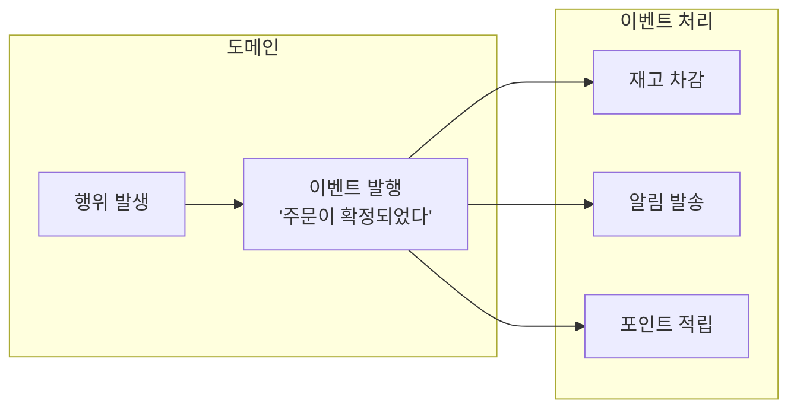
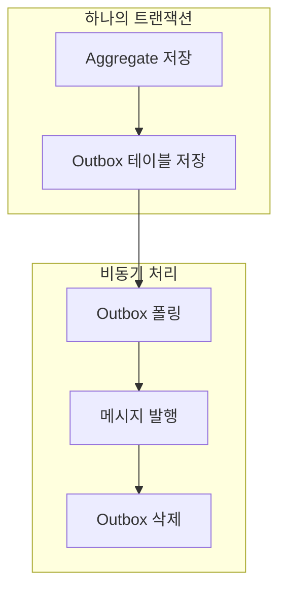
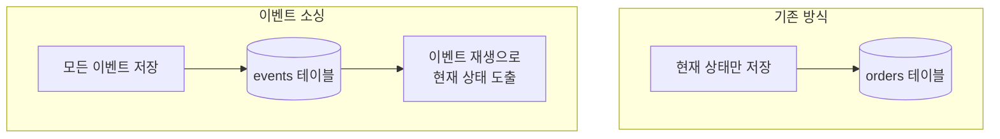
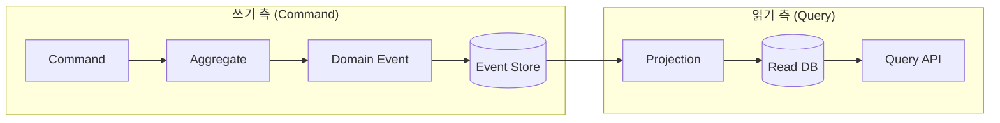

> **대상 독자**: 도메인 모델링과 트랜잭션 개념을 이해한 개발자
> **선수 지식**: [어니언 아키텍처](onion-architecture/) 또는 Aggregate 경계 개념에 대한 이해
> **소요 시간**: 약 30분
> **핵심 질문**: "도메인 이벤트를 언제, 왜 사용해야 하는가?"

---

# 이벤트 기반 아키텍처 (Event-Driven Architecture)


도메인 이벤트를 <strong>회사 공지 시스템</strong>에 비유할 수 있습니다:

- **이벤트 발행**: 인사팀에서 "신입 사원 입사" 공지를 보냅니다. 인사팀은 누가 이 공지를 볼지 모르고, 알 필요도 없습니다.
- **이벤트 구독**: IT팀은 공지를 보고 계정을 생성하고, 총무팀은 명함을 주문하며, 교육팀은 신입 교육 일정을 잡습니다. 각 부서가 독립적으로 행동합니다.
- **느슨한 결합**: 인사팀이 IT팀의 존재를 모르더라도 시스템은 작동합니다. 나중에 "환영 선물 담당 팀"이 추가되어도 인사팀은 수정할 필요가 없습니다.

**핵심**: 발행자는 "무슨 일이 일어났다"만 알리고, 구독자들이 각자 필요한 일을 합니다.



* 도메인 이벤트는 “비즈니스적으로 의미 있는 변화가 이미 발생했음”을 시스템 전체에 안전하게 전파하기 위한 설계 도구다.
* 이를 통해 핵심 도메인 로직과 부가 관심사를 분리하고, 시스템을 점진적으로 이벤트 기반 구조로 확장할 수 있다.


도메인에서 발생한 중요한 사건을 이벤트로 표현하고 활용하는 방법을 살펴봅니다. 도메인 이벤트는 비즈니스 프로세스에서 일어나는 의미 있는 변화를 포착하여 시스템 내에서 전파하고, 이를 통해 느슨하게 결합된 컴포넌트 간 통신을 가능하게 합니다. 이는 마이크로서비스 아키텍처나 이벤트 기반 시스템을 구축할 때 핵심적인 개념입니다.

#### 도메인 이벤트란?

도메인 이벤트는 도메인 전문가가 관심을 가지는 비즈니스적으로 의미 있는 사건입니다. 예를 들어 "주문이 확정되었다", "결제가 완료되었다", "상품이 배송되었다"와 같은 실제 비즈니스에서 중요하게 여기는 순간들을 코드로 표현한 것입니다. 이런 이벤트들은 단순히 기술적인 상태 변경이 아니라, 비즈니스 관점에서 의미 있는 일이 발생했음을 나타냅니다.



위 다이어그램은 하나의 도메인 이벤트가 여러 핸들러에 의해 처리되는 과정을 보여줍니다. 주문이 확정되면 재고 차감, 알림 발송, 포인트 적립 등의 후속 작업이 자동으로 트리거됩니다.

**도메인 이벤트의 주요 특징**

도메인 이벤트는 몇 가지 중요한 특징을 가지고 있습니다. 첫째, 이벤트 이름은 항상 과거형으로 명명됩니다. 이미 일어난 사실을 표현하기 때문에 "OrderConfirmed"처럼 과거형을 사용하며, "ConfirmOrder"처럼 명령형을 사용하지 않습니다. 둘째, 이벤트는 불변입니다. 일단 발행된 이벤트는 절대 변경할 수 없으며, 이벤트의 모든 데이터는 읽기 전용입니다. 셋째, 이벤트는 자기 완결적입니다. 이벤트를 처리하는 데 필요한 모든 정보를 포함하고 있어야 하며, orderId, 발생 시점, 관련 데이터 등을 담고 있습니다.

| 특성 | 설명 | 예시 |
|------|------|------|
| **과거형 명명** | 이미 일어난 사실 | OrderConfirmed (O), ConfirmOrder (X) |
| **불변성** | 발행 후 변경 불가 | 이벤트 데이터는 readonly |
| **자기 완결적** | 필요한 정보 포함 | orderId, 시점, 관련 데이터 |


#### 이벤트 설계

도메인 이벤트를 설계할 때는 일관된 구조를 유지하는 것이 중요합니다. 모든 이벤트가 공통으로 가져야 하는 속성들을 베이스 클래스로 정의하면 관리와 추적이 쉬워집니다.

**기본 구조 정의하기**

모든 도메인 이벤트의 기반이 되는 추상 클래스를 정의합니다. 이 클래스는 이벤트 고유 ID와 발생 시각을 자동으로 생성하여 각 이벤트를 추적할 수 있게 합니다. 이벤트 ID는 중복 처리 방지에 사용되고, 발생 시각은 이벤트 순서 파악과 디버깅에 활용됩니다.

```java
public abstract class DomainEvent {
    private final String eventId;
    private final Instant occurredAt;

    protected DomainEvent() {
        this.eventId = UUID.randomUUID().toString();
        this.occurredAt = Instant.now();
    }

    public String getEventId() {
        return eventId;
    }

    public Instant getOccurredAt() {
        return occurredAt;
    }
}
```

**구체적인 이벤트 구현하기**

구체적인 비즈니스 이벤트를 정의할 때는 해당 이벤트를 처리하는 데 필요한 모든 정보를 포함해야 합니다. 예를 들어 주문 확정 이벤트는 주문 ID뿐만 아니라 고객 ID, 총액, 주문 항목 정보까지 포함합니다. 이렇게 하면 이벤트 핸들러가 데이터베이스를 추가로 조회하지 않고도 필요한 작업을 수행할 수 있습니다.

주의할 점은 도메인 엔티티 자체를 이벤트에 담지 않는다는 것입니다. 대신 이벤트 전용 스냅샷 객체를 만들어 필요한 데이터만 선별적으로 담습니다. 이렇게 하면 이벤트가 가볍고 명확해지며, 나중에 엔티티 구조가 바뀌어도 이벤트에는 영향을 주지 않습니다.

```java
public class OrderConfirmedEvent extends DomainEvent {
    private final OrderId orderId;
    private final CustomerId customerId;
    private final Money totalAmount;
    private final List<OrderLineSnapshot> orderLines;

    public OrderConfirmedEvent(Order order) {
        super();
        this.orderId = order.getId();
        this.customerId = order.getCustomerId();
        this.totalAmount = order.getTotalAmount();
        this.orderLines = order.getOrderLines().stream()
            .map(OrderLineSnapshot::from)
            .toList();
    }

    // Getters...

    // 이벤트 전용 스냅샷 (불변)
    public record OrderLineSnapshot(
        ProductId productId,
        String productName,
        int quantity,
        Money amount
    ) {
        public static OrderLineSnapshot from(OrderLine line) {
            return new OrderLineSnapshot(
                line.getProductId(),
                line.getProductName(),
                line.getQuantity(),
                line.getAmount()
            );
        }
    }
}
```

**이벤트 발행 시점 결정하기**

이벤트는 적절한 시점에 발행되어야 합니다. 일반적으로 세 가지 상황에서 이벤트를 발행합니다. 첫째, 중요한 상태 변경이 완료되었을 때입니다. 예를 들어 주문 상태가 "대기중"에서 "확정됨"으로 바뀌었을 때 OrderConfirmed 이벤트를 발행합니다. 둘째, 비즈니스 규칙이 충족되었을 때입니다. 특정 조건이 만족되어 의미 있는 일이 발생했다면 이벤트로 표현합니다. 셋째, 다른 시스템이나 바운디드 컨텍스트에 알려야 할 때입니다. 외부에서 이 변화를 알아야 한다면 이벤트를 발행하여 통지합니다.

```java
public class Order extends AggregateRoot {

    public void confirm() {
        validateConfirmable();

        this.status = OrderStatus.CONFIRMED;
        this.confirmedAt = LocalDateTime.now();

        // 상태 변경 후 이벤트 등록
        registerEvent(new OrderConfirmedEvent(this));
    }

    public void ship(TrackingNumber trackingNumber) {
        validateShippable();

        this.status = OrderStatus.SHIPPED;
        this.trackingNumber = trackingNumber;

        registerEvent(new OrderShippedEvent(this.id, trackingNumber));
    }

    public void cancel(CancellationReason reason) {
        validateCancellable();

        this.status = OrderStatus.CANCELLED;
        this.cancelledAt = LocalDateTime.now();
        this.cancellationReason = reason;

        registerEvent(new OrderCancelledEvent(this.id, reason));
    }
}
```

위 코드에서 주문 엔티티는 상태를 변경한 직후 적절한 이벤트를 등록합니다. 이벤트는 즉시 발행되지 않고 Aggregate에 일단 저장되며, 트랜잭션이 성공적으로 완료된 후에 실제로 발행됩니다.

#### 이벤트 발행 구현

도메인 이벤트를 실제로 발행하는 방법은 여러 가지가 있습니다. 각 방법은 장단점이 있으며, 프로젝트의 요구사항에 맞게 선택해야 합니다.

**방법 1: Spring ApplicationEvent 활용**

가장 간단한 방법은 Spring의 ApplicationEventPublisher를 사용하는 것입니다. Aggregate Root는 발생한 이벤트들을 내부 리스트에 저장하고, Repository가 저장할 때 이 이벤트들을 Spring의 이벤트 버스로 발행합니다. 이 방식은 구현이 간단하고 Spring 생태계와 잘 통합되지만, 애플리케이션 내부에서만 동작한다는 제약이 있습니다.

```java
// Aggregate Root 기반 클래스
public abstract class AggregateRoot {
    @Transient
    private final List<DomainEvent> domainEvents = new ArrayList<>();

    protected void registerEvent(DomainEvent event) {
        domainEvents.add(event);
    }

    public List<DomainEvent> getDomainEvents() {
        return Collections.unmodifiableList(domainEvents);
    }

    public void clearDomainEvents() {
        domainEvents.clear();
    }
}

// Repository에서 저장 시 발행
@Repository
public class JpaOrderRepository implements OrderRepository {
    private final OrderJpaRepository jpaRepository;
    private final ApplicationEventPublisher eventPublisher;

    @Override
    public Order save(Order order) {
        OrderEntity entity = mapper.toEntity(order);
        jpaRepository.save(entity);

        // 저장 성공 후 이벤트 발행
        order.getDomainEvents().forEach(eventPublisher::publishEvent);
        order.clearDomainEvents();

        return order;
    }
}
```

**방법 2: Spring Data의 @DomainEvents 활용**

Spring Data JPA는 `AbstractAggregateRoot`라는 편리한 기반 클래스를 제공합니다. 이 클래스를 상속받으면 이벤트 등록과 발행이 자동으로 처리됩니다. Repository의 `save()` 메서드가 호출될 때 등록된 이벤트들이 자동으로 발행되므로, 별도의 이벤트 발행 코드를 작성할 필요가 없습니다.

```java
@Entity
public class OrderEntity extends AbstractAggregateRoot<OrderEntity> {

    public void confirm() {
        this.status = OrderStatus.CONFIRMED;

        // AbstractAggregateRoot의 메서드
        registerEvent(new OrderConfirmedEvent(this.id));
    }
}

// Repository save() 호출 시 자동으로 이벤트 발행됨
```

**방법 3: Transactional Outbox Pattern**

신뢰성이 중요한 시스템에서는 Transactional Outbox Pattern을 사용합니다. 이 패턴은 이벤트 유실을 방지하기 위해 고안되었습니다. Aggregate를 저장하는 트랜잭션에서 이벤트도 함께 데이터베이스에 저장합니다. 그런 다음 별도의 스케줄러가 주기적으로 Outbox 테이블을 폴링하여 아직 발행되지 않은 이벤트들을 Kafka 같은 메시지 브로커로 발행합니다. 이렇게 하면 데이터베이스 트랜잭션이 성공하면 이벤트도 반드시 저장되므로, 이벤트 유실이 발생하지 않습니다.



이 다이어그램은 Transactional Outbox Pattern의 전체 흐름을 보여줍니다. 중요한 점은 Aggregate 저장과 Outbox 저장이 하나의 트랜잭션 안에서 일어난다는 것입니다.

```java
// Outbox 엔티티
@Entity
@Table(name = "outbox_events")
public class OutboxEvent {
    @Id
    private String id;
    private String aggregateType;
    private String aggregateId;
    private String eventType;
    private String payload;  // JSON
    private Instant createdAt;
    private boolean published;
}

// 저장 시 Outbox에도 저장
@Transactional
public void confirmOrder(OrderId orderId) {
    Order order = orderRepository.findById(orderId).orElseThrow();
    order.confirm();

    orderRepository.save(order);

    // 같은 트랜잭션에서 Outbox 저장
    OutboxEvent outbox = OutboxEvent.builder()
        .aggregateType("Order")
        .aggregateId(orderId.getValue())
        .eventType("OrderConfirmed")
        .payload(toJson(new OrderConfirmedEvent(order)))
        .build();
    outboxRepository.save(outbox);
}

// 별도 스케줄러가 Outbox 폴링하여 Kafka 발행
@Scheduled(fixedDelay = 1000)
public void publishOutboxEvents() {
    List<OutboxEvent> events = outboxRepository.findUnpublished();
    for (OutboxEvent event : events) {
        kafkaTemplate.send("domain-events", event.getPayload());
        event.markAsPublished();
        outboxRepository.save(event);
    }
}
```

#### 이벤트 처리

이벤트를 발행했다면 이제 이를 처리할 핸들러가 필요합니다. 이벤트 처리는 동기 방식과 비동기 방식으로 나뉘며, 각각 다른 사용 사례에 적합합니다.

**동기 처리로 필수 작업 보장하기**

동기 처리는 이벤트 발행과 같은 트랜잭션 내에서 핸들러를 실행합니다. Spring의 `@TransactionalEventListener`를 사용하면 트랜잭션의 특정 단계에서 이벤트를 처리할 수 있습니다. `BEFORE_COMMIT` 단계에서 실행되는 핸들러는 주문 확정과 함께 반드시 성공해야 하는 작업에 사용됩니다. 만약 핸들러에서 예외가 발생하면 전체 트랜잭션이 롤백됩니다.

```java
@Component
public class OrderEventHandler {

    // BEFORE_COMMIT: 트랜잭션 커밋 직전에 실행
    // 주의: 핸들러 예외 시 트랜잭션이 롤백됨
    @TransactionalEventListener(phase = TransactionPhase.BEFORE_COMMIT)
    public void handleOrderConfirmed(OrderConfirmedEvent event) {
        // 주문 확정과 함께 반드시 성공해야 하는 로직
        // 실패 시 전체 트랜잭션 롤백됨
        auditService.recordConfirmation(event.getOrderId());
    }
}
```

**TransactionPhase 선택 가이드**

Spring은 여러 TransactionPhase를 제공하며, 각각은 다른 목적으로 사용됩니다. `BEFORE_COMMIT`은 커밋 직전에 실행되며, 핸들러가 실패하면 전체 트랜잭션이 롤백됩니다. 이는 감사 기록 같은 필수 후속 작업에 적합합니다. `AFTER_COMMIT`은 커밋이 완료된 후 실행되며, 핸들러가 실패해도 이미 커밋된 트랜잭션은 롤백되지 않습니다. 이는 알림 발송이나 외부 시스템 연동처럼 실패해도 주 작업에 영향을 주지 않아야 하는 경우에 사용됩니다. `AFTER_ROLLBACK`은 트랜잭션이 롤백된 후 실행되며, 보상 트랜잭션을 구현할 때 유용합니다.

| Phase | 실행 시점 | 핸들러 실패 시 | 사용 사례 |
|-------|----------|---------------|----------|
| **BEFORE_COMMIT** | 커밋 직전 | 전체 롤백 | 필수 후속 작업 |
| **AFTER_COMMIT** | 커밋 완료 후 | 롤백 불가 | 알림, 외부 연동 |
| **AFTER_ROLLBACK** | 롤백 후 | - | 보상 트랜잭션 |

**비동기 처리로 시스템 분리하기**

비동기 처리는 이벤트 핸들러를 별도의 스레드나 트랜잭션에서 실행합니다. `@Async` 어노테이션을 함께 사용하면 핸들러가 비동기로 실행되어 메인 트랜잭션을 블로킹하지 않습니다. 알림 발송 같은 작업은 시간이 오래 걸릴 수 있고 실패해도 주문에 영향을 주지 않아야 하므로, 비동기 처리가 적합합니다.

```java
@Component
public class NotificationEventHandler {

    // 트랜잭션 커밋 후 비동기 처리
    @Async
    @TransactionalEventListener(phase = TransactionPhase.AFTER_COMMIT)
    public void handleOrderConfirmed(OrderConfirmedEvent event) {
        // 알림 발송 (실패해도 주문에 영향 없음)
        notificationService.sendOrderConfirmation(
            event.getCustomerId(),
            event.getOrderId()
        );
    }
}
```

**Kafka로 마이크로서비스 간 이벤트 전달하기**

마이크로서비스 아키텍처에서는 Kafka 같은 메시지 브로커를 통해 이벤트를 전달합니다. 주문 서비스에서 발행한 이벤트를 재고 서비스, 알림 서비스 등이 구독하여 처리합니다. Kafka를 사용하면 서비스 간 느슨한 결합을 유지하면서도 신뢰성 있게 이벤트를 전달할 수 있습니다. Key를 주문 ID로 설정하면 같은 주문에 대한 이벤트들의 순서가 보장됩니다.

```java
// 이벤트 발행
@Component
public class OrderEventPublisher {
    private final KafkaTemplate<String, OrderEvent> kafkaTemplate;

    @TransactionalEventListener(phase = TransactionPhase.AFTER_COMMIT)
    public void publishToKafka(OrderConfirmedEvent event) {
        kafkaTemplate.send(
            "order-events",
            event.getOrderId().getValue(),  // Key: 순서 보장
            toKafkaEvent(event)
        );
    }
}

// 이벤트 소비
@Component
public class InventoryEventConsumer {

    @KafkaListener(topics = "order-events", groupId = "inventory-service")
    public void handleOrderEvent(ConsumerRecord<String, OrderEvent> record) {
        OrderEvent event = record.value();

        if ("OrderConfirmed".equals(event.getType())) {
            // 재고 차감
            inventoryService.reserveStock(event.getOrderLines());
        }
    }
}
```

#### 이벤트 설계 가이드

좋은 이벤트를 설계하려면 적절한 정보량을 유지하는 것이 중요합니다. 너무 적으면 이벤트 소비자가 추가 조회를 해야 하고, 너무 많으면 이벤트가 무거워지고 불필요한 결합이 생깁니다.

**적절한 정보량 결정하기**

이벤트에 ID만 담으면 소비자가 데이터베이스에서 상세 정보를 조회해야 합니다. 이는 데이터베이스 부하를 증가시키고 소비자를 주문 데이터베이스에 결합시킵니다. 반대로 전체 Aggregate를 담으면 이벤트가 너무 무겁고, Aggregate의 내부 구조가 외부에 노출됩니다. 적절한 방법은 이벤트 처리에 필요한 핵심 정보만 선별적으로 담는 것입니다. 주문 확정 이벤트라면 주문 ID, 고객 ID, 총액, 주문 항목 스냅샷 정도면 충분합니다.

```java
// ❌ 너무 적은 정보
public class OrderConfirmedEvent {
    private OrderId orderId;  // ID만으로는 추가 조회 필요
}

// ❌ 너무 많은 정보
public class OrderConfirmedEvent {
    private Order order;  // 전체 Aggregate 포함
}

// ✅ 적절한 정보
public class OrderConfirmedEvent {
    private OrderId orderId;
    private CustomerId customerId;
    private Money totalAmount;
    private List<OrderLineSnapshot> orderLines;  // 필요한 스냅샷
    private Instant confirmedAt;
}
```

**이벤트 버전 관리하기**

이벤트는 시스템이 발전하면서 변경될 수 있습니다. 하지만 이미 발행된 이벤트는 과거에 발생한 사실이므로, 스키마 변경에 신중해야 합니다. 버전 정보를 이벤트에 포함하고, 하위 호환성을 유지하는 방법을 고려해야 합니다. 새 필드를 추가할 때는 Optional로 만들어 기존 이벤트도 처리할 수 있게 합니다.

```java
// 버전이 포함된 이벤트
public class OrderConfirmedEventV2 extends DomainEvent {
    private static final int VERSION = 2;

    private OrderId orderId;
    private CustomerId customerId;
    private Money totalAmount;
    private ShippingAddress shippingAddress;  // V2에서 추가

    // 하위 호환성을 위한 변환
    public OrderConfirmedEventV1 toV1() {
        return new OrderConfirmedEventV1(orderId, customerId, totalAmount);
    }
}
```

#### 이벤트 패턴 비교

도메인 이벤트를 사용하는 세 가지 주요 패턴이 있으며, 각각 다른 목적을 가집니다. 이 패턴들을 이해하면 상황에 맞는 적절한 방식을 선택할 수 있습니다.

**Event Notification vs Event-Carried State Transfer vs Event Sourcing**

Event Notification은 가장 단순한 패턴으로, "이런 일이 발생했다"는 알림만 보냅니다. 이벤트에는 ID 정도만 포함되며, 소비자가 필요한 정보를 직접 조회해야 합니다. Event-Carried State Transfer는 가장 일반적으로 사용되는 패턴으로, 이벤트에 처리에 필요한 전체 상태를 포함합니다. 소비자가 추가 조회 없이 바로 처리할 수 있어 편리합니다. Event Sourcing은 가장 복잡한 패턴으로, 모든 상태 변경을 이벤트로 저장하고 현재 상태를 이벤트 재생으로 도출합니다.

| 패턴 | 목적 | 이벤트 내용 | 복잡도 |
|------|------|-----------|--------|
| **Event Notification** | "이 일이 발생했음" 알림 | ID만 포함 | 낮음 |
| **Event-Carried State Transfer** | 상태 동기화 | 전체 상태 포함 | 중간 |
| **Event Sourcing** | 상태를 이벤트로 저장 | 변경 내역 | 높음 |

**패턴별 구체적 예시**

각 패턴이 실제로 어떻게 구현되는지 코드로 살펴보겠습니다. Event Notification은 주문이 확정되었다는 사실만 알리고, 소비자는 필요하면 주문 서비스를 호출하여 상세 정보를 조회합니다. Event-Carried State Transfer는 주문 상세 정보를 이벤트에 모두 담아서 보내므로, 소비자가 추가 조회 없이 바로 처리할 수 있습니다. Event Sourcing은 별도 섹션에서 자세히 다룹니다.

```java
// 1. Event Notification (가장 단순)
// "주문이 확정됐으니 너희가 알아서 조회해"
public class OrderConfirmedEvent {
    private OrderId orderId;  // ID만
    // Consumer가 필요하면 직접 조회해야 함
}

// 2. Event-Carried State Transfer (가장 일반적)
// "주문이 확정됐고, 이게 주문 내용이야"
public class OrderConfirmedEvent {
    private OrderId orderId;
    private CustomerId customerId;
    private List<OrderLineSnapshot> orderLines;  // 필요한 데이터 포함
    private Money totalAmount;
    // Consumer가 추가 조회 없이 처리 가능
}

// 3. Event Sourcing
// "모든 변경을 이벤트로 저장하고, 현재 상태는 재생으로 도출"
// → 별도 섹션에서 자세히 설명
```

**패턴 선택 기준**

어떤 패턴을 선택할지는 다음과 같이 결정할 수 있습니다. 단순히 알림만 필요하다면 Event Notification을 사용합니다. 소비자가 추가 조회 없이 바로 처리해야 한다면 Event-Carried State Transfer를 사용합니다. 완전한 감사 추적이 필요하고 복잡도를 감당할 수 있다면 Event Sourcing을 고려합니다. 대부분의 경우 Event-Carried State Transfer가 적절한 선택입니다.

#### 이벤트 소싱 (Event Sourcing)

이벤트 소싱은 이벤트를 상태의 원본으로 사용하는 패턴입니다. 기존 방식은 현재 상태만 저장하지만, 이벤트 소싱은 모든 변경 이력을 이벤트로 저장하고 현재 상태는 이벤트를 재생하여 도출합니다.



**이벤트로부터 Aggregate 복원하기**

이벤트 소싱에서는 Aggregate의 현재 상태를 얻기 위해 해당 Aggregate의 모든 이벤트를 순서대로 재생합니다. 각 이벤트는 `apply` 메서드를 통해 Aggregate의 상태를 변경합니다. 예를 들어 OrderCreatedEvent를 적용하면 주문 ID와 상태가 설정되고, OrderConfirmedEvent를 적용하면 상태가 CONFIRMED로 바뀝니다.

```java
// 이벤트로부터 Aggregate 복원
public class Order {
    private OrderId id;
    private OrderStatus status;
    private List<OrderLine> orderLines;

    // 이벤트 스트림으로부터 복원
    public static Order fromEvents(List<DomainEvent> events) {
        Order order = new Order();
        for (DomainEvent event : events) {
            order.apply(event);
        }
        return order;
    }

    private void apply(DomainEvent event) {
        if (event instanceof OrderCreatedEvent e) {
            this.id = e.getOrderId();
            this.status = OrderStatus.PENDING;
            this.orderLines = new ArrayList<>(e.getOrderLines());
        } else if (event instanceof OrderConfirmedEvent e) {
            this.status = OrderStatus.CONFIRMED;
        } else if (event instanceof OrderCancelledEvent e) {
            this.status = OrderStatus.CANCELLED;
        }
    }
}

// Event Store
public interface OrderEventStore {
    void append(OrderId orderId, DomainEvent event);
    List<DomainEvent> getEvents(OrderId orderId);
}

// Repository
public class EventSourcedOrderRepository implements OrderRepository {
    private final OrderEventStore eventStore;

    @Override
    public Optional<Order> findById(OrderId id) {
        List<DomainEvent> events = eventStore.getEvents(id);
        if (events.isEmpty()) {
            return Optional.empty();
        }
        return Optional.of(Order.fromEvents(events));
    }

    @Override
    public Order save(Order order) {
        for (DomainEvent event : order.getDomainEvents()) {
            eventStore.append(order.getId(), event);
        }
        order.clearDomainEvents();
        return order;
    }
}
```

**이벤트 소싱의 장단점**

이벤트 소싱은 강력한 장점을 제공하지만 복잡도도 함께 증가합니다. 장점으로는 완전한 감사 추적이 가능합니다. 모든 변경 이력이 보존되므로 "누가 언제 무엇을 했는지" 정확히 알 수 있습니다. 시간 여행도 가능합니다. 과거 특정 시점의 상태를 재현할 수 있어 디버깅이나 분석에 유용합니다. 이벤트 기반 통합에도 자연스럽게 적합합니다. 단점으로는 구현 복잡도가 증가하며, 이벤트 스키마 진화가 어렵습니다. 한번 저장된 이벤트는 변경할 수 없으므로 스키마 변경에 매우 신중해야 합니다. 쿼리 성능도 문제가 될 수 있어 보통 CQRS와 함께 사용됩니다.

| 장점 | 단점 |
|------|------|
| 완전한 감사 추적 | 복잡성 증가 |
| 시간 여행 (과거 상태 재현) | 이벤트 스키마 진화 어려움 |
| 이벤트 기반 통합에 적합 | 쿼리 성능 (CQRS 필요) |

**이벤트 저장소 선택하기**

이벤트 소싱을 구현하려면 이벤트를 저장할 저장소가 필요합니다. 여러 옵션이 있으며 각각 장단점이 있습니다. 직접 RDBMS에 구현하면 가장 간단하고 기존 데이터베이스를 활용할 수 있어 소규모 프로젝트나 학습 목적에 적합합니다. EventStoreDB는 이벤트 소싱 전용으로 설계된 데이터베이스로, 구독 기능이 내장되어 있어 전문적인 이벤트 소싱에 적합합니다. Axon Framework는 Java 생태계에서 CQRS와 통합이 잘 되어 있어 Spring 기반 프로젝트에 유용합니다. Kafka는 고성능이며 이미 사용 중이라면 이벤트 스트리밍 중심 시스템에 적합합니다.

| 옵션 | 특징 | 적합한 경우 |
|------|------|-----------|
| **직접 구현 (RDBMS)** | 간단, 기존 DB 활용 | 소규모, 학습 목적 |
| **EventStoreDB** | 전용 저장소, 구독 기능 내장 | 이벤트 소싱 전문 |
| **Axon Framework** | Java 생태계, CQRS 통합 | Spring 기반 프로젝트 |
| **Kafka** | 고성능, 이미 사용 중이면 | 이벤트 스트리밍 중심 |

#### CQRS와 도메인 이벤트

이벤트 소싱을 사용하면 CQRS(Command Query Responsibility Segregation)가 자연스럽게 필요해집니다. 왜냐하면 이벤트 재생은 읽기 성능에 문제를 일으킬 수 있기 때문입니다.



**CQRS가 필요한 이유**

이벤트 소싱에서 현재 상태를 얻으려면 모든 이벤트를 재생해야 합니다. 만약 주문 하나에 이벤트가 100개 있다면, 매 조회마다 100번의 재생이 필요해 매우 느립니다. CQRS를 적용하면 쓰기 측에서는 이벤트를 저장하고, 읽기 측에서는 이벤트를 구독하여 읽기 전용 뷰를 별도로 유지합니다. 이렇게 하면 조회는 빠르게 처리되면서도 완전한 이벤트 히스토리를 유지할 수 있습니다.

```java
// CQRS 없이: 매번 이벤트 재생
public Order findById(OrderId id) {
    List<DomainEvent> events = eventStore.getEvents(id);
    return Order.fromEvents(events);  // 느림!
}

// CQRS 적용: 읽기 전용 뷰 사용
public OrderView findById(OrderId id) {
    return orderViewRepository.findById(id);  // 빠름!
}

// Projection: 이벤트를 읽기 뷰로 변환
@EventHandler
public void on(OrderConfirmedEvent event) {
    OrderView view = orderViewRepository.findById(event.getOrderId());
    view.setStatus("CONFIRMED");
    view.setConfirmedAt(event.getOccurredAt());
    orderViewRepository.save(view);
}
```

**CQRS 도입 기준**

CQRS는 복잡도를 증가시키므로 모든 프로젝트에 필요한 것은 아닙니다. 다음 조건 중 2개 이상에 해당하면 CQRS를 고려해볼 만합니다. 읽기와 쓰기 패턴이 크게 다른 경우, 읽기 성능이 중요한 경우, 이벤트 소싱을 사용하는 경우, 복잡한 조회 요구사항이 있어 다양한 뷰가 필요한 경우, 읽기와 쓰기 확장이 독립적으로 필요한 경우입니다.

#### 실전 팁

도메인 이벤트를 실전에서 사용할 때 알아두면 유용한 몇 가지 팁을 소개합니다.

**1. 이벤트 명명 규칙**

이벤트 이름은 일관된 규칙을 따라야 합니다. 과거형을 사용하여 이미 발생한 사실임을 명확히 하고, 도메인 용어를 사용하여 비즈니스 의미를 담습니다. 명확한 접두사를 사용하여 어떤 Aggregate와 관련된 이벤트인지 알 수 있게 합니다. 예를 들어 "Order + Confirmed = OrderConfirmed"처럼 구성합니다.

**2. 멱등성 처리하기**

이벤트는 네트워크 오류 등으로 중복 전달될 수 있습니다. 같은 이벤트를 여러 번 받아도 결과가 동일하도록 멱등성을 보장해야 합니다. 이미 처리된 이벤트인지 확인하고, 중복이면 무시하는 방식으로 구현합니다.

```java
@Component
public class PaymentEventHandler {
    private final ProcessedEventRepository processedEvents;

    @KafkaListener(topics = "order-events")
    public void handle(OrderConfirmedEvent event) {
        // 이미 처리된 이벤트인지 확인
        if (processedEvents.exists(event.getEventId())) {
            log.info("이미 처리된 이벤트: {}", event.getEventId());
            return;
        }

        // 비즈니스 로직 처리
        paymentService.requestPayment(event);

        // 처리 완료 기록
        processedEvents.save(event.getEventId());
    }
}
```

**3. 실패 처리 전략**

이벤트 처리가 실패할 수 있으므로 재시도 전략을 구현해야 합니다. Spring Kafka의 `@RetryableTopic`을 사용하면 자동으로 재시도하고, 최종 실패 시 Dead Letter Topic으로 이동시킬 수 있습니다.

```java
@Component
public class StockEventHandler {

    @RetryableTopic(
        attempts = "3",
        backoff = @Backoff(delay = 1000, multiplier = 2)
    )
    @KafkaListener(topics = "order-events")
    public void handle(OrderConfirmedEvent event) {
        // 3회 재시도 후 실패 시 DLT로 이동
        stockService.reserve(event.getOrderLines());
    }

    @DltHandler
    public void handleDlt(OrderConfirmedEvent event) {
        // Dead Letter Topic 처리
        alertService.notifyStockReservationFailed(event);
    }
}
```

#### 이벤트 기반 아키텍처의 함정

도메인 이벤트는 강력하지만, 잘못 사용하면 디버깅이 어려운 시스템이 됩니다. 흔히 빠지는 함정들을 알아두면 미리 예방할 수 있습니다.

**함정 1: 이벤트 유실**

문제는 `@TransactionalEventListener(AFTER_COMMIT)`이 이벤트를 메모리에만 보관한다는 점입니다. 트랜잭션이 커밋된 후 이벤트를 발행하는데, 이 시점에 애플리케이션이 죽으면 이벤트가 유실됩니다. 데이터베이스에는 주문이 저장되었지만 이벤트는 발행되지 않아 재고 차감이나 알림 발송이 실행되지 않는 문제가 발생합니다.

해결책은 Transactional Outbox Pattern입니다. 이벤트를 메모리가 아닌 데이터베이스에 먼저 저장합니다. Aggregate 저장과 이벤트 저장이 같은 트랜잭션에서 일어나므로, 트랜잭션이 성공하면 이벤트도 반드시 저장됩니다. 별도 프로세스가 주기적으로 Outbox 테이블을 폴링하여 아직 발행되지 않은 이벤트들을 Kafka로 발행합니다.

```java
// ❌ 이벤트 유실 가능
@Transactional
public void confirmOrder(OrderId orderId) {
    Order order = orderRepository.findById(orderId);
    order.confirm();
    orderRepository.save(order);
    // 여기서 커밋 완료

    // 이벤트는 AFTER_COMMIT에서 발행됨
    // 만약 이 시점에 서버가 죽으면? → 이벤트 유실!
}

// ✅ 이벤트 유실 방지
@Transactional
public void confirmOrder(OrderId orderId) {
    Order order = orderRepository.findById(orderId);
    order.confirm();
    orderRepository.save(order);

    // 같은 트랜잭션에서 Outbox에 저장
    outboxRepository.save(new OutboxEvent(
        "OrderConfirmed",
        toJson(new OrderConfirmedEvent(order))
    ));
    // DB 트랜잭션 성공 = 이벤트 저장 보장
}

// 별도 스케줄러가 Outbox 폴링하여 Kafka 발행
@Scheduled(fixedDelay = 1000)
public void publishEvents() {
    List<OutboxEvent> events = outboxRepository.findUnpublished();
    for (OutboxEvent event : events) {
        kafkaTemplate.send("domain-events", event.getPayload());
        event.markPublished();
        outboxRepository.save(event);
    }
}
```

**함정 2: 이벤트 순서 역전**

비동기 이벤트는 발행 순서와 처리 순서가 다를 수 있습니다. OrderCreated → OrderPaid → OrderShipped 순서로 발행했는데, OrderCreated → OrderShipped → OrderPaid 순서로 처리될 수 있습니다. 그러면 "결제도 안 됐는데 배송됐다"는 이상한 상태가 됩니다.

해결 방법은 두 가지입니다. 첫째, 이벤트 핸들러에서 상태를 검증합니다. PAID 상태가 아니면 배송 처리를 보류하고 재시도하거나 DLT로 보냅니다. 둘째, 이벤트에 버전이나 시퀀스 번호를 포함하여 낮은 시퀀스의 이벤트는 무시합니다.

```java
// 방법 1: 상태 검증 후 처리
@KafkaListener(topics = "order-events")
public void handleOrderShipped(OrderShippedEvent event) {
    Order order = orderRepository.findById(event.getOrderId());

    // 상태 검증: PAID 상태가 아니면 처리 보류
    if (order.getStatus() != OrderStatus.PAID) {
        throw new OrderNotReadyForShipmentException();
        // 재시도 또는 DLT로 이동
    }

    order.ship();
    orderRepository.save(order);
}

// 방법 2: 이벤트에 버전/시퀀스 포함
public class OrderEvent {
    private long sequenceNumber;  // 1, 2, 3, ...

    // 낮은 시퀀스 이벤트는 무시
}
```

**함정 3: 순환 이벤트**

A 이벤트가 B를 발생시키고, B가 다시 A를 발생시키는 무한 루프가 생길 수 있습니다. 예를 들어 OrderConfirmed가 StockReserved를 발생시키고, StockReserved가 다시 OrderUpdated를 발생시키고, OrderUpdated가 또 StockReserved를 발생시키는 식입니다.

해결책은 이벤트 체인을 추적하는 것입니다. 각 이벤트에 correlationId(최초 이벤트 ID), causationId(이 이벤트를 발생시킨 이벤트 ID), depth(이벤트 체인 깊이)를 포함합니다. 깊이가 일정 수준을 넘어가면 체인을 중단합니다.

```java
public abstract class DomainEvent {
    private String correlationId;  // 최초 이벤트 ID
    private String causationId;    // 이 이벤트를 발생시킨 이벤트 ID
    private int depth;             // 이벤트 체인 깊이

    public boolean isMaxDepthReached() {
        return depth > 10;  // 최대 깊이 제한
    }
}
```

**함정 4: 이벤트 스키마 변경**

이벤트 구조를 변경하면 기존 Consumer가 깨질 수 있습니다. v1에서 `amount` 필드를 사용했는데 v2에서 `totalAmount`와 `discountAmount`로 나눈다면, 기존 Consumer가 `amount`를 찾다가 실패합니다.

해결책은 하위 호환성을 유지하는 것입니다. 필드를 추가하는 것은 괜찮지만 Optional로 처리합니다. 기존 필드는 유지하고 새 필드를 추가하여 두 방식 모두 작동하게 합니다. 필드 삭제나 타입 변경이 필요하면 새 이벤트 타입을 정의합니다.

```java
// 필드 추가는 OK (Optional로 처리)
public class OrderConfirmedEvent {
    private String orderId;
    private Money amount;           // 기존 필드 유지
    private Money totalAmount;      // 새 필드 추가
    private Money discountAmount;   // 새 필드 추가

    // 하위 호환성: 기존 필드로도 접근 가능
    public Money getAmount() {
        return amount != null ? amount : totalAmount;
    }
}

// 필드 삭제나 타입 변경이 필요하면 새 이벤트 타입 정의
// OrderConfirmedEventV2
```

#### 이벤트 디버깅 팁

이벤트 기반 시스템은 흐름 추적이 어렵습니다. 디버깅을 쉽게 하려면 모든 이벤트에 추적 정보를 포함해야 합니다. eventId는 각 이벤트를 고유하게 식별하고, correlationId는 같은 요청에서 발생한 모든 이벤트를 연결하며, occurredAt는 발생 시각을 기록하고, aggregateId와 aggregateType은 어떤 Aggregate에서 발생했는지 알려줍니다.

```java
public abstract class DomainEvent {
    private String eventId;         // 유니크 ID
    private String correlationId;   // 요청 추적 ID (같은 요청의 모든 이벤트)
    private Instant occurredAt;     // 발생 시각
    private String aggregateId;     // 어떤 Aggregate에서 발생했는지
    private String aggregateType;   // Order, Payment 등
}
```

로그를 작성할 때는 항상 이 정보들을 포함합니다. 그러면 로그에서 correlationId로 검색하여 하나의 요청이 발생시킨 모든 이벤트 흐름을 추적할 수 있습니다.

```java
log.info("이벤트 처리 시작: eventId={}, correlationId={}, type={}",
    event.getEventId(),
    event.getCorrelationId(),
    event.getClass().getSimpleName());
```

#### 실제 스키마 진화 사례

이벤트 스키마 변경은 신중해야 합니다. 실제 사례를 통해 안전한 변경과 위험한 변경을 구분하는 법을 배워봅시다.

**사례 1: 필드 추가 (안전)**

필드를 추가하는 것은 비교적 안전합니다. 기존 Consumer는 새 필드를 무시하고 계속 작동하며, 새 Consumer는 새 필드를 활용할 수 있습니다. 단, 새 필드는 null을 허용해야 하고, 기본값을 제공하는 것이 좋습니다.

```java
// v1: 초기 버전
public class OrderConfirmedEvent {
    private String orderId;
    private BigDecimal amount;
}

// v2: 할인 정보 추가 필요
public class OrderConfirmedEvent {
    private String orderId;
    private BigDecimal amount;
    private BigDecimal discountAmount;  // 새 필드 (null 허용)

    // 하위 호환성: 기존 이벤트는 discountAmount가 null
    public BigDecimal getDiscountAmount() {
        return discountAmount != null ? discountAmount : BigDecimal.ZERO;
    }
}
```

**사례 2: 필드 이름 변경 (위험)**

필드명을 직접 변경하면 기존 Consumer가 모두 깨집니다. 대신 두 필드를 모두 유지하여 하위 호환성을 보장합니다. 기존 필드는 @Deprecated로 표시하여 점진적으로 마이그레이션할 수 있게 합니다.

```java
// ❌ 위험: 필드명 직접 변경
// v1: amount
// v2: totalAmount
// → 기존 Consumer 전부 깨짐!

// ✅ 안전: 두 필드 모두 유지
public class OrderConfirmedEvent {
    private String orderId;

    @Deprecated
    private BigDecimal amount;       // 기존 필드 유지

    private BigDecimal totalAmount;  // 새 필드

    // 새 Consumer는 totalAmount 사용
    public BigDecimal getTotalAmount() {
        return totalAmount != null ? totalAmount : amount;
    }

    // 기존 Consumer 호환성
    public BigDecimal getAmount() {
        return amount != null ? amount : totalAmount;
    }
}
```

**사례 3: 타입 변경 (가장 위험)**

타입을 변경하는 것은 가장 위험합니다. 역직렬화가 실패하여 시스템이 멈출 수 있습니다. 타입 변경이 필요하면 새 이벤트 타입을 정의하고, Consumer가 두 버전을 모두 처리하도록 구현합니다.

```java
// ❌ 절대 하면 안 됨: 타입 변경
// v1: String orderId
// v2: Long orderId
// → 역직렬화 실패!

// ✅ 해결: 새 이벤트 타입 정의
public class OrderConfirmedEventV2 {
    private Long orderId;  // 새 타입

    // 마이그레이션 핸들러
    public static OrderConfirmedEventV2 fromV1(OrderConfirmedEvent v1) {
        return new OrderConfirmedEventV2(Long.parseLong(v1.getOrderId()));
    }
}

// Consumer는 두 버전 모두 처리
@KafkaListener(topics = "order-events")
public void handle(ConsumerRecord<String, JsonNode> record) {
    int version = record.value().get("version").asInt();
    if (version == 1) {
        // V1 처리
    } else {
        // V2 처리
    }
}
```

**스키마 진화 체크리스트**

안전한 변경으로는 새 필드 추가(Optional), 필드에 기본값 추가, 새 이벤트 타입 추가가 있습니다. 위험한 변경으로는 필드명 변경, 필드 타입 변경, 필수 필드로 변경이 있으며 마이그레이션 전략이 필요합니다. 절대 하면 안 되는 변경으로는 기존 필드 삭제, 기존 이벤트 타입 삭제, 이벤트 의미 변경이 있습니다.

---

#### 언제 이벤트 기반 아키텍처를 사용하나요?

**적합한 경우**

- ✅ 마이크로서비스 간 통신이 필요한 경우
- ✅ 느슨한 결합이 중요한 경우
- ✅ 비동기 처리가 적합한 워크플로우
- ✅ 감사 추적이 필요한 시스템
- ✅ 확장성이 중요한 대규모 시스템

**부적합한 경우**

- ❌ 동기적 응답이 필수인 경우
- ❌ 디버깅 복잡도를 감당할 수 없는 팀
- ❌ 트랜잭션 일관성이 절대적으로 필요한 경우
- ❌ 소규모 모놀리식 시스템

**Best Practice: 어떤 시스템에 어울리는가?**

| 시스템 유형 | 적합도 | 이유 |
|------------|-------|------|
| **마이크로서비스** | 매우 적합 | 서비스 간 느슨한 결합, 독립적 배포 |
| **이커머스** | 매우 적합 | 주문→결제→배송→알림 파이프라인 |
| **알림 시스템** | 적합 | 비동기 발송, 재시도 가능 |
| **실시간 데이터 파이프라인** | 적합 | 스트림 처리, 확장성 |
| **감사/로깅 시스템** | 적합 | 모든 변경 이력 추적 |
| **IoT 데이터 수집** | 적합 | 대량 이벤트 처리 |
| **결제 시스템** | 부분 적합 | 실패 처리 복잡, 보상 트랜잭션 필요 |
| **실시간 게임** | 부적합 | 저지연 동기 응답 필요 |
| **단순 CRUD** | 부적합 | 복잡도 대비 이점 없음 |

---

#### 요약

도메인 이벤트는 비즈니스적으로 의미 있는 사건을 코드로 표현한 것입니다. 이벤트 패턴으로는 Notification, State Transfer, Sourcing이 있으며 각각 다른 목적을 가집니다. Outbox 패턴을 사용하면 이벤트 유실을 방지할 수 있고, CQRS는 이벤트 소싱의 쿼리 성능 문제를 해결합니다. 스키마 진화 시에는 하위 호환성 유지가 필수입니다.

| 개념 | 핵심 |
|------|------|
| **도메인 이벤트** | 비즈니스적으로 의미 있는 사건 |
| **이벤트 패턴** | Notification / State Transfer / Sourcing |
| **Outbox 패턴** | 이벤트 유실 방지 |
| **CQRS** | 이벤트 소싱의 쿼리 성능 해결 |
| **스키마 진화** | 하위 호환성 유지 필수 |

#### 다음 단계

- [CQRS](cqrs/) - 이벤트 기반 시스템과 잘 어울리는 패턴
- [실습 예제](../../examples/) - Spring Boot로 구현하는 주문 도메인
