> **대상 독자**: 테스트 용이성과 외부 의존성 교체를 고려하는 개발자
> **선수 지식**: [계층형 아키텍처](layered-architecture/)의 한계 이해
> **소요 시간**: 약 20분

**Ports and Adapters** 패턴이라고도 불립니다. 애플리케이션의 핵심을 외부 세계로부터 완전히 격리시키는 아키텍처입니다. 헥사고날 아키텍처의 핵심 아이디어는 비즈니스 로직을 중심에 두고, 외부와의 모든 상호작용을 Port와 Adapter를 통해 처리한다는 것입니다. 이렇게 하면 외부 기술이 바뀌어도 핵심 비즈니스 로직은 영향을 받지 않습니다.

#### 한 줄 요약

애플리케이션은 육각형 안에 있고, 외부와의 모든 연결은 Port와 Adapter로 처리합니다. 이를 통해 비즈니스 로직과 기술적 세부사항을 완벽하게 분리할 수 있습니다.

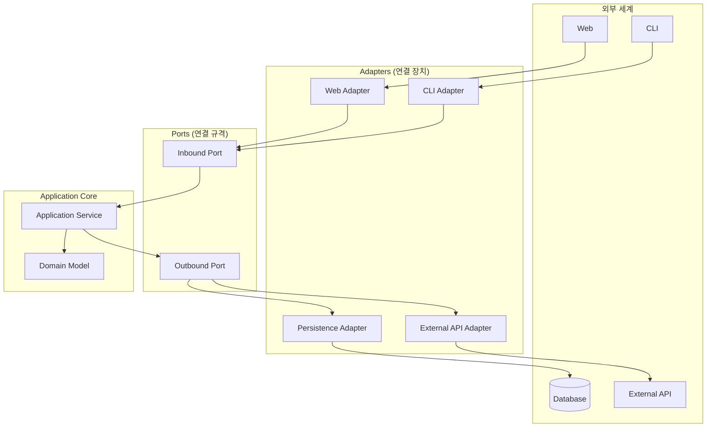

---

#### 왜 "헥사고날(육각형)"인가요?

헥사고날이라는 이름은 6개의 면이 중요해서가 아니라, 여러 방향에서 애플리케이션에 연결할 수 있다는 의미를 담고 있습니다. 계층형 아키텍처의 "위에서 아래로"라는 일방향 흐름과 달리, 헥사고날은 "안쪽과 바깥쪽"이라는 관점을 제시합니다.


스마트폰을 생각해보세요. 스마트폰 자체는 어떤 충전기를 쓰는지 모릅니다.

- **스마트폰(Core)**: 통화, 앱 실행 등 핵심 기능만 담당
- **충전 포트(Port)**: "전원을 공급받고 싶어"라는 인터페이스
- **어댑터**: C타입, 무선 충전, USB 등 다양한 방식으로 연결

충전 방식이 바뀌어도 폰의 기능은 그대로입니다. **어댑터만 바꾸면 다양한 장치와 연결할 수 있습니다.**


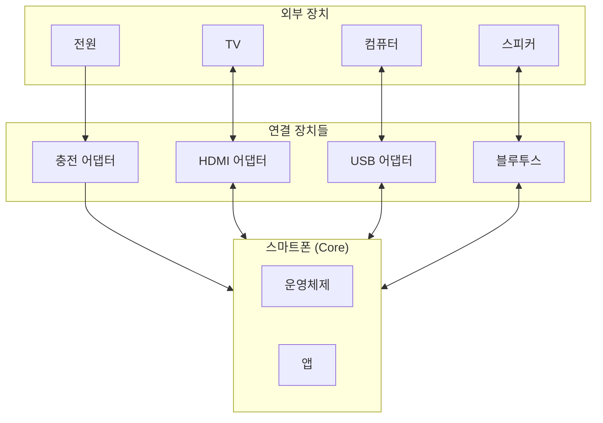

소프트웨어도 마찬가지입니다. 핵심 비즈니스 로직은 어떤 데이터베이스를 쓰는지, 어떤 UI 프레임워크를 쓰는지 알 필요가 없습니다. 이 모든 기술적 선택은 Adapter를 통해 격리됩니다.

육각형이라는 형태는 실제로 6개 면이 중요한 게 아니라, "여러 방향에서 연결할 수 있다"는 의미를 시각적으로 표현한 것입니다. 계층형의 "위→아래" 대신 "안↔밖" 관점으로 사고를 전환하는 것이 핵심입니다.

---

#### 핵심 개념 3가지

헥사고날 아키텍처를 이해하려면 Port, Adapter, Application Core 세 가지 개념을 알아야 합니다. 이 세 가지가 어떻게 협력하는지 이해하면 헥사고날 아키텍처의 전체 그림이 보입니다.

**1. Port (포트) - "연결 규격"**

Port는 인터페이스입니다. 외부와 연결되는 "규격"을 정의합니다. Port에는 두 종류가 있습니다. Inbound Port는 외부에서 애플리케이션으로 들어오는 요청을 정의하고, Outbound Port는 애플리케이션에서 외부로 나가는 요청을 정의합니다.

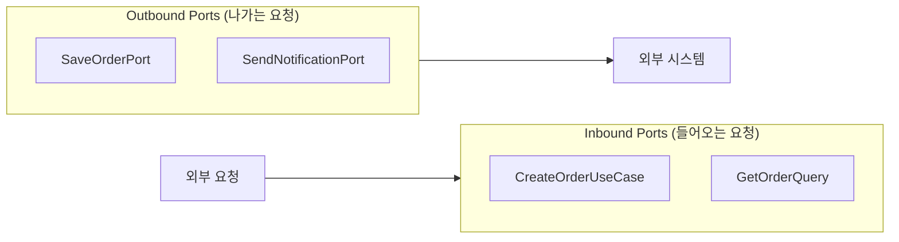

**두 종류의 Port**를 이해하는 것이 중요합니다. 아래 표는 각 Port의 특성을 정리한 것입니다.

| Port 종류 | 방향 | 역할 | 예시 |
|----------|------|------|------|
| **Inbound Port** | 외부 → 애플리케이션 | "나한테 이렇게 요청해" | `CreateOrderUseCase` |
| **Outbound Port** | 애플리케이션 → 외부 | "나는 이것만 필요해" | `SaveOrderPort` |

Inbound Port는 외부에서 애플리케이션을 어떻게 호출할 수 있는지 정의합니다. 예를 들어, "주문을 생성하려면 이런 정보가 필요해"라고 명시합니다. Outbound Port는 애플리케이션이 외부에 무엇을 요청하는지 정의합니다. "나는 주문을 저장하고 싶어"라고 명시하지만, 어떤 데이터베이스에 어떻게 저장하는지는 알 필요가 없습니다.

```java
// Inbound Port: "외부에서 나를 이렇게 호출해"
public interface CreateOrderUseCase {
    OrderId createOrder(CreateOrderCommand command);
}

// Outbound Port: "나는 주문을 저장하고 싶어"
public interface SaveOrderPort {
    void save(Order order);
}
```

이렇게 Port를 인터페이스로 정의하면, 구체적인 구현체가 무엇인지 몰라도 됩니다. 나중에 MySQL을 MongoDB로 바꾸거나, REST API를 gRPC로 바꿔도 Port는 변경할 필요가 없습니다.

**2. Adapter (어댑터) - "연결 장치"**

Adapter는 구현체입니다. Port 규격에 맞춰 실제 연결을 담당합니다. Adapter에도 두 종류가 있습니다. Driving Adapter는 애플리케이션을 호출하고, Driven Adapter는 애플리케이션이 호출합니다.

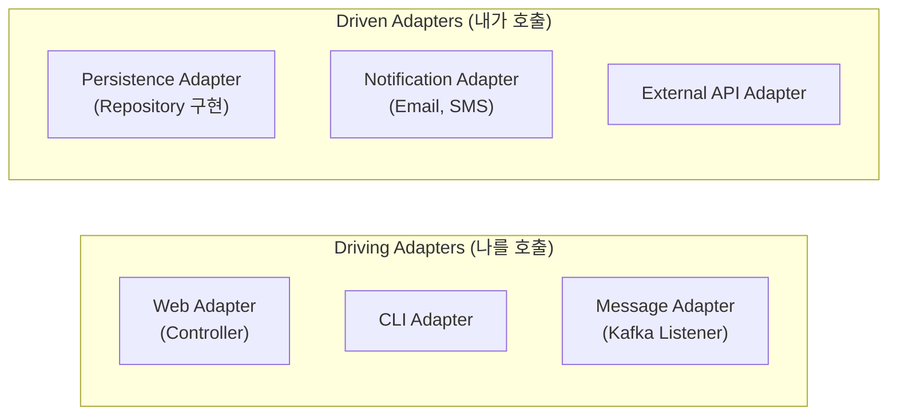

**두 종류의 Adapter**를 구분하는 것이 중요합니다. 아래 표는 각 Adapter의 특성을 정리한 것입니다.

| Adapter 종류 | 다른 이름 | 역할 | 예시 |
|-------------|----------|------|------|
| **Driving Adapter** | Primary Adapter | 애플리케이션을 호출 | Controller, CLI |
| **Driven Adapter** | Secondary Adapter | 애플리케이션이 호출 | Repository 구현, API Client |

Driving Adapter는 외부 요청을 받아서 애플리케이션에 전달하는 역할을 합니다. 예를 들어, HTTP Controller는 HTTP 요청을 받아서 Inbound Port 형식으로 변환합니다. Driven Adapter는 애플리케이션의 요청을 외부 시스템에 전달합니다. 예를 들어, JPA Repository는 애플리케이션의 저장 요청을 데이터베이스 쿼리로 변환합니다.

```java
// Driving Adapter: 외부 요청을 받아서 애플리케이션에 전달
@RestController
public class OrderController {
    private final CreateOrderUseCase createOrderUseCase;  // Port 사용

    @PostMapping("/orders")
    public ResponseEntity<String> createOrder(@RequestBody OrderRequest request) {
        OrderId orderId = createOrderUseCase.createOrder(request.toCommand());
        return ResponseEntity.ok(orderId.getValue());
    }
}

// Driven Adapter: 애플리케이션의 요청을 외부 시스템에 전달
@Repository
public class OrderPersistenceAdapter implements SaveOrderPort {
    private final OrderJpaRepository jpaRepository;

    @Override
    public void save(Order order) {
        OrderEntity entity = OrderMapper.toEntity(order);
        jpaRepository.save(entity);
    }
}
```

위 코드에서 OrderController는 HTTP 요청을 받아 CreateOrderUseCase를 호출하고, OrderPersistenceAdapter는 SaveOrderPort를 구현하여 데이터베이스에 저장합니다. 중요한 점은 애플리케이션 코어는 이 Adapter들의 존재를 전혀 모른다는 것입니다.

**3. Application Core - "비즈니스 심장"**

육각형 안에는 순수한 비즈니스 로직만 있습니다. Application Core는 Application Layer와 Domain Layer로 구성됩니다. Application Layer는 비즈니스 프로세스의 흐름을 조율하고, Domain Layer는 핵심 비즈니스 규칙을 담고 있습니다.

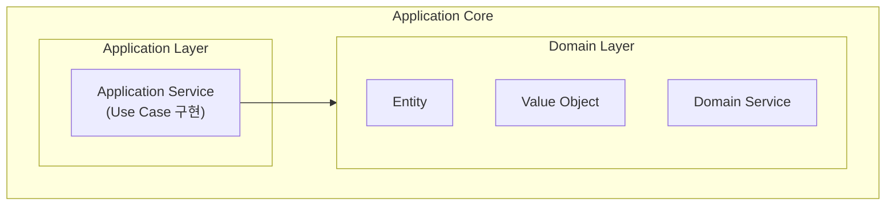

Application Core는 외부 세계에 대해 아무것도 알지 못합니다. HTTP가 무엇인지, JPA가 무엇인지, Kafka가 무엇인지 모릅니다. 오직 Port 인터페이스만 알고 있으며, 순수한 비즈니스 로직에만 집중합니다.

---

#### 전체 구조 한눈에 보기

헥사고날 아키텍처의 모든 요소가 어떻게 협력하는지 전체 그림을 보겠습니다. 외부 세계, Driving Adapters, Inbound Ports, Application Core, Outbound Ports, Driven Adapters가 어떻게 연결되는지 이해하면 헥사고날의 핵심을 파악할 수 있습니다.

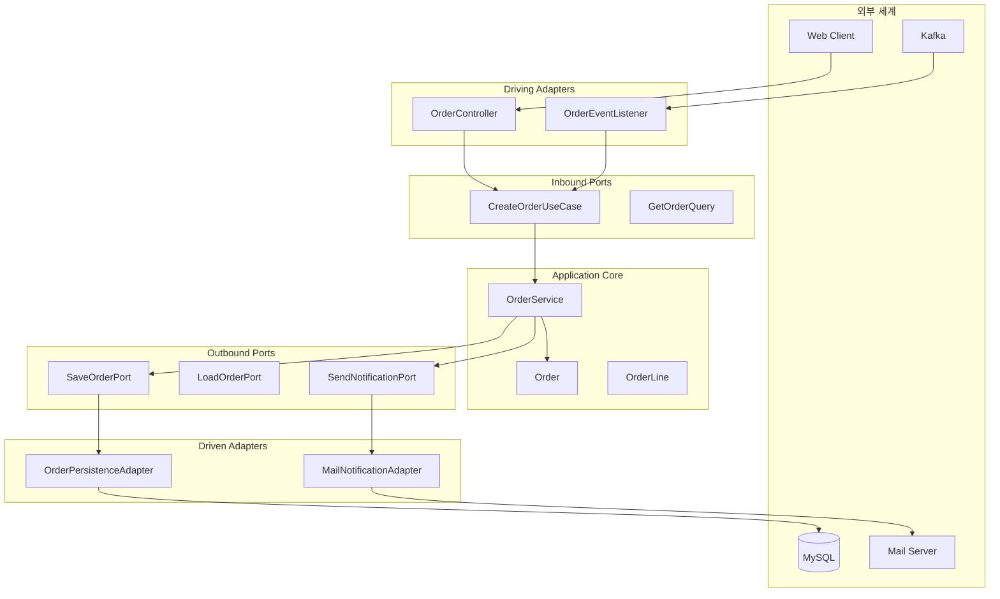

위 다이어그램에서 화살표의 방향에 주목하세요. 의존성은 항상 바깥에서 안으로만 향합니다. Application Core는 외부를 전혀 모르며, Port 인터페이스만 사용합니다.

---

#### 코드로 이해하기

이제 실제 코드로 헥사고날 아키텍처를 구현해보겠습니다. Port 정의, Application Service 구현, Adapter 구현 순서로 진행합니다.

**1단계: Port 정의하기**

먼저 애플리케이션의 경계를 Port로 정의합니다. Inbound Port는 외부에서 호출할 수 있는 유스케이스를 정의하고, Outbound Port는 애플리케이션이 필요로 하는 외부 서비스를 정의합니다.

```java
// === Inbound Ports ===
// Application 패키지에 위치

// 주문 생성 유스케이스
public interface CreateOrderUseCase {
    OrderId execute(CreateOrderCommand command);
}

// 주문 확정 유스케이스
public interface ConfirmOrderUseCase {
    void execute(OrderId orderId);
}

// 주문 조회 (Query)
public interface GetOrderQuery {
    OrderDto execute(OrderId orderId);
}
```

Inbound Port는 애플리케이션이 제공하는 기능을 명확히 정의합니다. 각 유스케이스는 하나의 비즈니스 목적을 가지고 있으며, 외부에서는 이 인터페이스만 보고 애플리케이션을 호출할 수 있습니다.

```java
// === Outbound Ports ===
// Application 패키지에 위치

// 주문 저장
public interface SaveOrderPort {
    void save(Order order);
}

// 주문 조회
public interface LoadOrderPort {
    Order loadById(OrderId id);
    boolean existsById(OrderId id);
}

// 알림 발송
public interface SendNotificationPort {
    void sendOrderConfirmation(Order order);
}

// 재고 확인
public interface CheckInventoryPort {
    boolean isAvailable(ProductId productId, int quantity);
}
```

Outbound Port는 애플리케이션이 필요로 하는 외부 서비스를 정의합니다. 데이터베이스, 메시지 큐, 외부 API 등 모든 외부 시스템과의 통신은 이 Port를 통해 이루어집니다.

**2단계: Application Service 구현하기**

Application Service는 Inbound Port를 구현하고 Outbound Port를 사용합니다. 비즈니스 흐름을 조율하며, Domain 객체를 조합하여 유스케이스를 완성합니다.

```java
@Service
@Transactional
public class OrderService implements CreateOrderUseCase, ConfirmOrderUseCase {

    // Outbound Ports (인터페이스)만 의존
    private final SaveOrderPort saveOrderPort;
    private final LoadOrderPort loadOrderPort;
    private final SendNotificationPort notificationPort;
    private final CheckInventoryPort inventoryPort;

    // 생성자 주입
    public OrderService(
            SaveOrderPort saveOrderPort,
            LoadOrderPort loadOrderPort,
            SendNotificationPort notificationPort,
            CheckInventoryPort inventoryPort) {
        this.saveOrderPort = saveOrderPort;
        this.loadOrderPort = loadOrderPort;
        this.notificationPort = notificationPort;
        this.inventoryPort = inventoryPort;
    }

    @Override
    public OrderId execute(CreateOrderCommand command) {
        // 1. 재고 확인 (Outbound Port 사용)
        for (OrderLineCommand line : command.getLines()) {
            if (!inventoryPort.isAvailable(line.getProductId(), line.getQuantity())) {
                throw new InsufficientInventoryException(line.getProductId());
            }
        }

        // 2. 주문 생성 (Domain Logic)
        Order order = Order.create(
            command.getCustomerId(),
            command.toOrderLines()
        );

        // 3. 저장 (Outbound Port 사용)
        saveOrderPort.save(order);

        return order.getId();
    }

    @Override
    public void execute(OrderId orderId) {
        // 1. 주문 조회 (Outbound Port 사용)
        Order order = loadOrderPort.loadById(orderId);

        // 2. 주문 확정 (Domain Logic)
        order.confirm();

        // 3. 저장 (Outbound Port 사용)
        saveOrderPort.save(order);

        // 4. 알림 발송 (Outbound Port 사용)
        notificationPort.sendOrderConfirmation(order);
    }
}
```

위 코드에서 OrderService는 구체적인 구현체가 아닌 Port 인터페이스만 의존하고 있습니다. SaveOrderPort가 JPA인지 MongoDB인지, SendNotificationPort가 이메일인지 SMS인지 전혀 모릅니다. 이것이 헥사고날 아키텍처의 핵심입니다.


**핵심 포인트**

Application Service는 **Port(인터페이스)만 알고 있습니다:**
- `SaveOrderPort` ← JPA인지 MongoDB인지 모름
- `SendNotificationPort` ← 이메일인지 SMS인지 모름
- `CheckInventoryPort` ← 내부 DB인지 외부 API인지 모름

그래서 **외부 기술이 바뀌어도 이 코드는 변경할 필요가 없습니다!**


**3단계: Driving Adapter 구현하기**

Driving Adapter는 외부 요청을 받아서 Inbound Port를 호출합니다. 예를 들어, Web Adapter는 HTTP 요청을 받아 Command 객체로 변환한 뒤 Use Case를 실행합니다.

```java
// === Web Adapter (Driving) ===
@RestController
@RequestMapping("/api/orders")
public class OrderController {

    private final CreateOrderUseCase createOrderUseCase;
    private final ConfirmOrderUseCase confirmOrderUseCase;
    private final GetOrderQuery getOrderQuery;

    @PostMapping
    public ResponseEntity<OrderIdResponse> createOrder(
            @Valid @RequestBody CreateOrderRequest request) {

        // Request → Command 변환
        CreateOrderCommand command = request.toCommand();

        // Use Case 실행
        OrderId orderId = createOrderUseCase.execute(command);

        // Response 생성
        return ResponseEntity
            .status(HttpStatus.CREATED)
            .body(new OrderIdResponse(orderId.getValue()));
    }

    @PostMapping("/{orderId}/confirm")
    public ResponseEntity<Void> confirmOrder(@PathVariable String orderId) {
        confirmOrderUseCase.execute(OrderId.of(orderId));
        return ResponseEntity.ok().build();
    }

    @GetMapping("/{orderId}")
    public ResponseEntity<OrderResponse> getOrder(@PathVariable String orderId) {
        OrderDto order = getOrderQuery.execute(OrderId.of(orderId));
        return ResponseEntity.ok(OrderResponse.from(order));
    }
}
```

OrderController는 HTTP라는 전송 프로토콜의 세부사항만 다룹니다. HTTP 요청을 받고, Command로 변환하고, Use Case를 호출하고, 결과를 HTTP 응답으로 변환하는 것이 전부입니다.

```java
// === Message Adapter (Driving) ===
@Component
public class OrderEventListener {

    private final ConfirmOrderUseCase confirmOrderUseCase;

    @KafkaListener(topics = "payment-completed")
    public void onPaymentCompleted(PaymentCompletedEvent event) {
        // 결제 완료 시 자동으로 주문 확정
        confirmOrderUseCase.execute(OrderId.of(event.getOrderId()));
    }
}
```

Message Adapter는 Kafka 메시지를 받아서 Use Case를 호출합니다. 애플리케이션 코어는 Kafka를 전혀 모르며, 단지 Inbound Port를 통해 호출될 뿐입니다.

**4단계: Driven Adapter 구현하기**

Driven Adapter는 Outbound Port를 구현하여 외부 시스템과 통신합니다. 예를 들어, Persistence Adapter는 SaveOrderPort를 구현하여 데이터베이스에 저장하는 기술적 세부사항을 처리합니다.

```java
// === Persistence Adapter (Driven) ===
@Repository
public class OrderPersistenceAdapter implements SaveOrderPort, LoadOrderPort {

    private final OrderJpaRepository jpaRepository;
    private final OrderMapper mapper;

    @Override
    public void save(Order order) {
        OrderEntity entity = mapper.toEntity(order);
        jpaRepository.save(entity);
    }

    @Override
    public Order loadById(OrderId id) {
        return jpaRepository.findById(id.getValue())
            .map(mapper::toDomain)
            .orElseThrow(() -> new OrderNotFoundException(id));
    }

    @Override
    public boolean existsById(OrderId id) {
        return jpaRepository.existsById(id.getValue());
    }
}
```

OrderPersistenceAdapter는 JPA를 사용하여 데이터베이스에 접근합니다. Domain 객체를 JPA Entity로 변환하고, 반대로 JPA Entity를 Domain 객체로 변환하는 역할을 담당합니다.

```java
// === Notification Adapter (Driven) ===
@Component
public class EmailNotificationAdapter implements SendNotificationPort {

    private final JavaMailSender mailSender;

    @Override
    public void sendOrderConfirmation(Order order) {
        SimpleMailMessage message = new SimpleMailMessage();
        message.setTo(order.getCustomerEmail());
        message.setSubject("주문이 확정되었습니다");
        message.setText("주문번호: " + order.getId().getValue());

        mailSender.send(message);
    }
}
```

EmailNotificationAdapter는 이메일을 발송합니다. 나중에 SMS로 바꾸고 싶다면 SmsNotificationAdapter를 새로 만들어 SendNotificationPort를 구현하면 됩니다. Application Service 코드는 전혀 변경할 필요가 없습니다.

```java
// === External API Adapter (Driven) ===
@Component
public class InventoryApiAdapter implements CheckInventoryPort {

    private final RestTemplate restTemplate;

    @Override
    public boolean isAvailable(ProductId productId, int quantity) {
        String url = "http://inventory-service/api/products/{id}/stock";

        InventoryResponse response = restTemplate.getForObject(
            url,
            InventoryResponse.class,
            productId.getValue()
        );

        return response.getAvailableQuantity() >= quantity;
    }
}
```

InventoryApiAdapter는 외부 재고 관리 서비스와 통신합니다. Application Core는 재고가 내부 데이터베이스에 있는지 외부 API에서 가져오는지 전혀 모릅니다.

---

#### 패키지 구조

헥사고날 아키텍처를 패키지로 표현하면 다음과 같습니다. adapter 패키지는 in과 out으로 나뉘며, application 패키지에는 port와 service가 있고, domain 패키지에는 순수한 도메인 모델이 있습니다.

```
com.example.order/
│
├── adapter/                          # Adapters (외부와의 연결)
│   ├── in/                           # Driving Adapters
│   │   ├── web/
│   │   │   ├── OrderController.java
│   │   │   ├── CreateOrderRequest.java
│   │   │   └── OrderResponse.java
│   │   └── message/
│   │       └── OrderEventListener.java
│   │
│   └── out/                          # Driven Adapters
│       ├── persistence/
│       │   ├── OrderPersistenceAdapter.java
│       │   ├── OrderEntity.java
│       │   ├── OrderJpaRepository.java
│       │   └── OrderMapper.java
│       ├── notification/
│       │   └── EmailNotificationAdapter.java
│       └── inventory/
│           └── InventoryApiAdapter.java
│
├── application/                      # Application Core - 바깥쪽
│   ├── port/
│   │   ├── in/                       # Inbound Ports
│   │   │   ├── CreateOrderUseCase.java
│   │   │   ├── ConfirmOrderUseCase.java
│   │   │   └── GetOrderQuery.java
│   │   └── out/                      # Outbound Ports
│   │       ├── SaveOrderPort.java
│   │       ├── LoadOrderPort.java
│   │       ├── SendNotificationPort.java
│   │       └── CheckInventoryPort.java
│   └── service/
│       └── OrderService.java
│
└── domain/                           # Application Core - 안쪽
    ├── Order.java
    ├── OrderLine.java
    ├── OrderId.java
    ├── OrderStatus.java
    └── Money.java
```

이 구조에서 adapter 패키지는 가장 바깥쪽에 있고, application과 domain 패키지는 안쪽에 있습니다. 의존성은 항상 바깥에서 안으로만 향합니다.

---

#### 의존성 방향

헥사고날 아키텍처의 핵심은 의존성 방향입니다. 모든 의존성은 Adapter에서 Port로, Port에서 Core로 향합니다. Core는 아무것도 의존하지 않습니다.

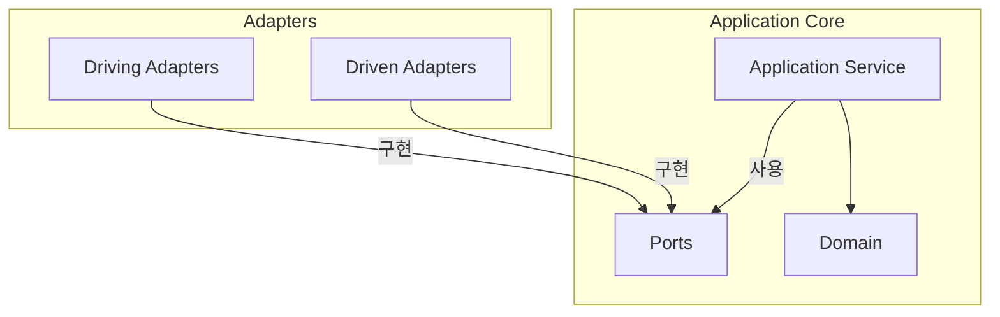

**핵심 규칙:**

의존성 규칙을 엄격히 지키는 것이 헥사고날 아키텍처의 핵심입니다. 첫째, Adapter는 Port를 구현하고 Port에 의존합니다. 둘째, Application Core는 Adapter를 전혀 모릅니다. 셋째, Domain은 아무것도 의존하지 않으며 순수한 비즈니스 로직만 담고 있습니다.

---

#### 헥사고날의 장점

헥사고날 아키텍처가 제공하는 주요 이점을 구체적인 예시와 함께 살펴보겠습니다.

**1. 테스트가 쉬워집니다**

Port만 Mock하면 되므로 테스트가 매우 간단해집니다. 데이터베이스나 외부 API 없이도 비즈니스 로직을 완벽하게 테스트할 수 있습니다.

```java
// Port만 Mock하면 됩니다
@ExtendWith(MockitoExtension.class)
class OrderServiceTest {

    @Mock private SaveOrderPort saveOrderPort;
    @Mock private LoadOrderPort loadOrderPort;
    @Mock private SendNotificationPort notificationPort;
    @Mock private CheckInventoryPort inventoryPort;

    @InjectMocks
    private OrderService orderService;

    @Test
    void 주문_생성_성공() {
        // Given
        when(inventoryPort.isAvailable(any(), anyInt())).thenReturn(true);

        CreateOrderCommand command = new CreateOrderCommand(
            CustomerId.of("customer-1"),
            List.of(new OrderLineCommand(ProductId.of("product-1"), 2))
        );

        // When
        OrderId result = orderService.execute(command);

        // Then
        verify(saveOrderPort).save(any(Order.class));
        assertThat(result).isNotNull();
    }
}
```

위 테스트는 실제 데이터베이스나 외부 서비스 없이 OrderService의 로직을 검증합니다. Port를 Mock으로 대체하면 되므로 테스트 작성이 간단하고 실행 속도도 빠릅니다.

**2. 기술 교체가 쉬워집니다**

Adapter만 교체하면 되므로 기술 스택을 쉽게 변경할 수 있습니다. Application Core는 전혀 변경할 필요가 없습니다.

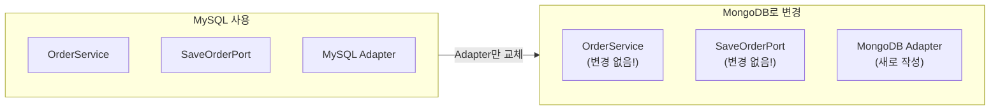

예를 들어, MySQL에서 MongoDB로 데이터베이스를 변경해도 OrderService 코드는 전혀 변경할 필요가 없습니다. SaveOrderPort 인터페이스도 그대로이고, 단지 MongoOrderAdapter라는 새로운 Adapter만 작성하면 됩니다.

```java
// MySQL에서 MongoDB로 변경해도 Service 코드 변경 없음!

// Before: MySQL Adapter
@Repository
public class MySqlOrderAdapter implements SaveOrderPort {
    private final OrderJpaRepository jpaRepository;
    // ...
}

// After: MongoDB Adapter (새로 추가)
@Repository
public class MongoOrderAdapter implements SaveOrderPort {
    private final OrderMongoRepository mongoRepository;
    // ...
}
```

**3. 외부 연동 추가가 쉬워집니다**

새로운 알림 채널을 추가하고 싶다면 Adapter만 추가하면 됩니다. Application Core는 SendNotificationPort 인터페이스만 알고 있으므로, 어떤 Adapter를 사용하는지 상관하지 않습니다.

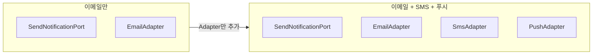

이메일만 지원하던 것을 SMS와 푸시 알림으로 확장하려면 SmsAdapter와 PushAdapter를 추가하면 됩니다. Application Service는 여전히 SendNotificationPort만 호출하므로 코드 변경이 없습니다.

---

#### 트레이드오프

헥사고날 아키텍처는 유연성을 제공하지만, 그에 따른 비용도 있습니다.


| 장점 | 비용 |
|------|------|
| 테스트 용이성 | Port/Adapter 인터페이스 작성 필요 |
| 기술 교체 유연성 | 초기 설계에 더 많은 시간 소요 |
| 외부 연동 격리 | 파일 수 증가 (인터페이스 + 구현체) |
| 명확한 의존성 방향 | 팀 전체가 패턴을 이해해야 함 |


**언제 비용이 정당화되는가?**

헥사고날의 복잡성은 **외부 시스템 변경 가능성이 높을 때** 정당화됩니다:
- 데이터베이스를 MySQL에서 PostgreSQL로 바꿀 가능성이 있다면 → 가치 있음
- 평생 MySQL만 쓸 것이 확실하다면 → 과도한 추상화일 수 있음

---

#### 계층형과의 비교

계층형 아키텍처와 헥사고날 아키텍처는 비슷하지만 중요한 차이가 있습니다. 관점의 차이를 먼저 살펴보겠습니다.

**관점의 차이**

계층형은 위에서 아래로의 수직 구조를 강조하는 반면, 헥사고날은 안쪽과 바깥쪽의 방사형 구조를 강조합니다.

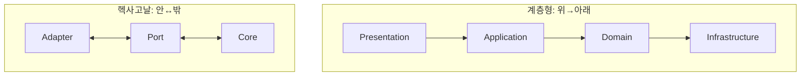

**상세 비교**

아래 표는 계층형과 헥사고날의 주요 차이점을 정리한 것입니다.

| 관점 | 계층형 | 헥사고날 |
|------|--------|----------|
| **구조** | 수직 계층 (4층) | 안쪽/바깥쪽 |
| **의존성** | 위에서 아래로 | 바깥에서 안으로 |
| **Infrastructure** | 맨 아래 계층 | 바깥쪽 Adapter |
| **강조점** | 계층 분리 | 외부 격리 |
| **테스트** | Mock 필요 | Port Mock만 |
| **적합한 상황** | 단순한 프로젝트 | 외부 연동 많은 프로젝트 |

계층형은 간단하고 직관적이지만, 외부 시스템과의 연동이 많아지면 헥사고날이 더 적합합니다. 헥사고날은 Port와 Adapter를 명시적으로 분리하여 외부 변경에 더 유연하게 대응할 수 있습니다.

---

#### 흔한 실수들

헥사고날 아키텍처를 적용할 때 자주 발생하는 실수들을 알아보겠습니다.

**1. Port 없이 직접 의존**

Port 없이 Service가 Repository 구현체를 직접 의존하면 헥사고날의 이점을 잃게 됩니다. 항상 인터페이스(Port)를 통해 의존해야 합니다.

```java
// ❌ 잘못된 예: Service가 Repository 구현체를 직접 의존
@Service
public class OrderService {
    private final OrderJpaRepository jpaRepository;  // 구체 클래스!
}

// ✅ 올바른 예: Port(인터페이스)에 의존
@Service
public class OrderService {
    private final SaveOrderPort saveOrderPort;  // 인터페이스!
}
```

구체 클래스에 의존하면 나중에 JPA를 다른 기술로 바꿀 때 Service 코드도 수정해야 합니다. Port에 의존하면 Adapter만 교체하면 됩니다.

**2. Adapter에 비즈니스 로직**

Adapter는 단순히 변환만 담당해야 합니다. 비즈니스 로직을 Adapter에 넣으면 안 됩니다.

```java
// ❌ 잘못된 예: Controller에 비즈니스 로직
@RestController
public class OrderController {
    @PostMapping
    public ResponseEntity<?> createOrder(@RequestBody OrderRequest request) {
        // 비즈니스 로직이 Controller에!
        if (request.getTotal() > 100000) {
            request.setDiscount(0.1);
        }
        // ...
    }
}

// ✅ 올바른 예: Controller는 요청/응답만
@RestController
public class OrderController {
    private final CreateOrderUseCase useCase;

    @PostMapping
    public ResponseEntity<?> createOrder(@RequestBody OrderRequest request) {
        OrderId orderId = useCase.execute(request.toCommand());  // 위임
        return ResponseEntity.ok(new OrderIdResponse(orderId));
    }
}
```

Controller는 HTTP 요청을 Command로 변환하고, Use Case를 호출하고, 결과를 HTTP 응답으로 변환하는 것만 담당해야 합니다.

**3. Domain이 Port에 의존**

Domain은 완전히 순수해야 하며, Port에도 의존하면 안 됩니다. Domain은 비즈니스 로직만 담고 있어야 합니다.

```java
// ❌ 잘못된 예: Entity가 Port 사용
public class Order {
    private final SaveOrderPort saveOrderPort;  // Domain이 Port에 의존!

    public void confirm() {
        this.status = CONFIRMED;
        saveOrderPort.save(this);  // 안 됨!
    }
}

// ✅ 올바른 예: Domain은 순수하게
public class Order {
    public void confirm() {
        this.status = CONFIRMED;  // 상태 변경만
    }
}

// Application Service에서 저장
@Service
public class OrderService {
    public void confirmOrder(OrderId id) {
        Order order = loadOrderPort.loadById(id);
        order.confirm();
        saveOrderPort.save(order);  // Service에서 저장
    }
}
```

Domain Entity는 상태 변경만 담당하고, 저장은 Application Service가 Port를 통해 처리합니다.

---

#### 테스트 전략

헥사고날 아키텍처에서는 테스트 피라미드를 따라 각 레벨을 테스트합니다.

**테스트 레벨별 전략**

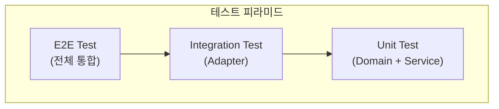

**1. Domain 테스트 (순수 단위 테스트)**

Domain은 외부 의존성이 없으므로 가장 간단하게 테스트할 수 있습니다. 순수한 Java 객체이므로 테스트 실행 속도도 빠릅니다.

```java
class OrderTest {

    @Test
    void 주문_확정_성공() {
        // Given
        Order order = Order.create(
            CustomerId.of("c1"),
            List.of(new OrderLine(ProductId.of("p1"), 1, Money.of(10000)))
        );

        // When
        order.confirm();

        // Then
        assertThat(order.getStatus()).isEqualTo(OrderStatus.CONFIRMED);
    }

    @Test
    void 이미_확정된_주문은_다시_확정할_수_없다() {
        Order order = createConfirmedOrder();

        assertThrows(IllegalStateException.class, () -> order.confirm());
    }
}
```

**2. Application Service 테스트 (Port Mock)**

Application Service는 Port를 Mock으로 대체하여 테스트합니다. 실제 데이터베이스나 외부 서비스 없이 비즈니스 로직을 검증할 수 있습니다.

```java
@ExtendWith(MockitoExtension.class)
class OrderServiceTest {

    @Mock private SaveOrderPort saveOrderPort;
    @Mock private LoadOrderPort loadOrderPort;
    @Mock private SendNotificationPort notificationPort;
    @Mock private CheckInventoryPort inventoryPort;

    @InjectMocks
    private OrderService orderService;

    @Test
    void 재고_부족시_주문_실패() {
        // Given
        when(inventoryPort.isAvailable(any(), anyInt())).thenReturn(false);

        CreateOrderCommand command = createCommand();

        // When & Then
        assertThrows(
            InsufficientInventoryException.class,
            () -> orderService.execute(command)
        );

        verify(saveOrderPort, never()).save(any());
    }
}
```

**3. Adapter 테스트 (통합 테스트)**

Adapter는 실제 외부 시스템과 통신하므로 통합 테스트를 수행합니다. Spring Boot의 테스트 도구를 사용하면 편리합니다.

```java
// Persistence Adapter 테스트
@DataJpaTest
class OrderPersistenceAdapterTest {

    @Autowired
    private OrderJpaRepository jpaRepository;

    private OrderPersistenceAdapter adapter;

    @BeforeEach
    void setUp() {
        adapter = new OrderPersistenceAdapter(jpaRepository, new OrderMapper());
    }

    @Test
    void 주문_저장_및_조회() {
        // Given
        Order order = createOrder();

        // When
        adapter.save(order);
        Order found = adapter.loadById(order.getId());

        // Then
        assertThat(found.getId()).isEqualTo(order.getId());
    }
}

// Web Adapter 테스트
@WebMvcTest(OrderController.class)
class OrderControllerTest {

    @Autowired
    private MockMvc mockMvc;

    @MockBean
    private CreateOrderUseCase createOrderUseCase;

    @Test
    void 주문_생성_API() throws Exception {
        when(createOrderUseCase.execute(any()))
            .thenReturn(OrderId.of("order-123"));

        mockMvc.perform(post("/api/orders")
                .contentType(MediaType.APPLICATION_JSON)
                .content("{\"customerId\":\"c1\",\"items\":[]}"))
            .andExpect(status().isCreated())
            .andExpect(jsonPath("$.orderId").value("order-123"));
    }
}
```

---

#### 언제 헥사고날을 사용하나요?

헥사고날 아키텍처는 모든 프로젝트에 적합한 것은 아닙니다. 프로젝트의 특성을 고려하여 선택해야 합니다.

**적합한 경우**

헥사고날 아키텍처는 다음과 같은 상황에서 특히 유용합니다. 외부 시스템 연동이 많은 경우, 예를 들어 여러 데이터베이스, REST API, 메시지 큐를 사용하는 프로젝트에 적합합니다. 마이크로서비스 아키텍처에서도 각 서비스의 경계를 명확히 하는 데 도움이 됩니다.

기술 변경 가능성이 있는 경우, 예를 들어 나중에 데이터베이스를 바꾸거나 메시징 시스템을 변경할 가능성이 있다면 헥사고날이 좋습니다. 팀이 테스트를 중요하게 여기는 경우에도 적합합니다. 레거시 시스템과 통합해야 할 때도 Port와 Adapter로 깔끔하게 분리할 수 있어 유용합니다.

**부적합한 경우**

반면, 다음과 같은 상황에서는 헥사고날이 과할 수 있습니다. 소규모 단기 프로젝트에서는 오버엔지니어링이 될 수 있습니다. 팀이 패턴에 익숙하지 않을 때는 계층형으로 시작하는 것이 좋습니다.

단순 CRUD 애플리케이션에서는 헥사고날의 이점을 누리기 어렵습니다. 외부 연동이 거의 없는 프로젝트에서도 불필요한 복잡도만 증가시킬 수 있습니다.

**Best Practice: 어떤 시스템에 어울리는가?**

| 시스템 유형 | 적합도 | 이유 |
|------------|-------|------|
| **마이크로서비스** | 매우 적합 | 서비스 경계 명확화, 독립적 배포 |
| **이커머스 플랫폼** | 매우 적합 | 결제/배송/재고 등 다양한 외부 연동 |
| **레거시 통합** | 적합 | ACL로 레거시 격리 가능 |
| **API Gateway** | 적합 | 다양한 백엔드 서비스 연동 |
| **IoT 시스템** | 적합 | 다양한 프로토콜과 디바이스 연동 |
| **단순 CRUD** | 부적합 | 계층형으로 충분 |
| **소규모 MVP** | 부적합 | 오버엔지니어링 |
| **외부 연동 없음** | 부적합 | 계층형 권장 |

---

#### 계층형에서 헥사고날로 전환하기

기존 계층형 아키텍처를 헥사고날로 점진적으로 전환할 수 있습니다. 한 번에 모든 것을 바꿀 필요는 없습니다.

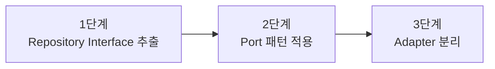

**1단계: Repository Interface를 Domain으로**

먼저 Repository 인터페이스를 Infrastructure에서 Domain으로 이동합니다.

```java
// Before: Infrastructure에 있던 Repository
// After: Domain에 인터페이스 정의
public interface OrderRepository {
    void save(Order order);
    Optional<Order> findById(OrderId id);
}
```

**2단계: Port 네이밍으로 변경**

Repository를 SaveOrderPort와 LoadOrderPort로 분리하여 더 명확하게 만듭니다.

```java
// Before: OrderRepository
// After: SaveOrderPort, LoadOrderPort 분리
public interface SaveOrderPort {
    void save(Order order);
}

public interface LoadOrderPort {
    Order loadById(OrderId id);
}
```

**3단계: Adapter 패키지 구조 정리**

마지막으로 패키지 구조를 헥사고날 스타일로 정리합니다.

```
// Before
com.example.order/
├── controller/
├── service/
├── repository/
└── entity/

// After
com.example.order/
├── adapter/
│   ├── in/web/
│   └── out/persistence/
├── application/
│   ├── port/in/
│   ├── port/out/
│   └── service/
└── domain/
```

---

#### 핵심 요약


| 개념 | 설명 | 예시 |
|------|------|------|
| **Port** | 연결 규격 (인터페이스) | `SaveOrderPort`, `SendNotificationPort` |
| **Adapter** | 연결 장치 (구현체) | `JpaOrderAdapter`, `EmailAdapter` |
| **Core** | 순수 비즈니스 로직 | `OrderService`, `Order` |
| **Driving** | 나를 호출하는 것 | Controller, Kafka Listener |
| **Driven** | 내가 호출하는 것 | Repository 구현, API Client |

**기억할 것:** 의존성은 항상 **바깥 → 안쪽**으로만 향합니다. Application Core는 외부 기술을 전혀 모릅니다.


---

#### 다음 단계

- [클린 아키텍처](clean-architecture/) - 더 엄격한 의존성 규칙
- [어니언 아키텍처](onion-architecture/) - 도메인 모델 중심
- [CQRS](cqrs/) - 읽기/쓰기 분리
