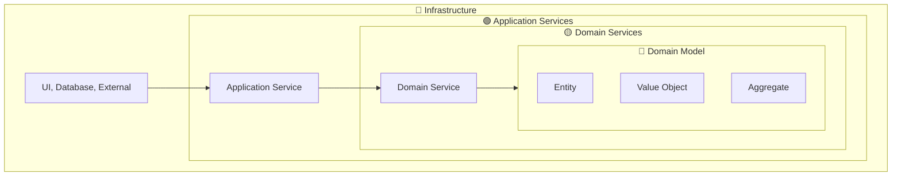
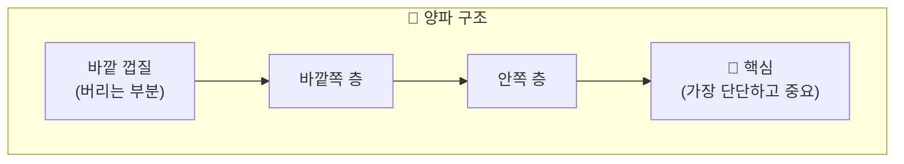
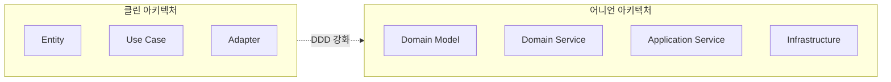
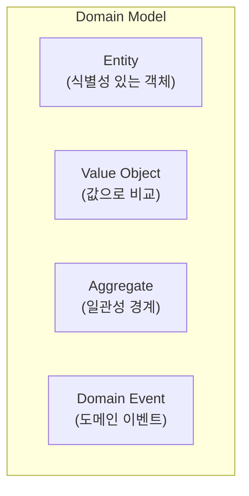
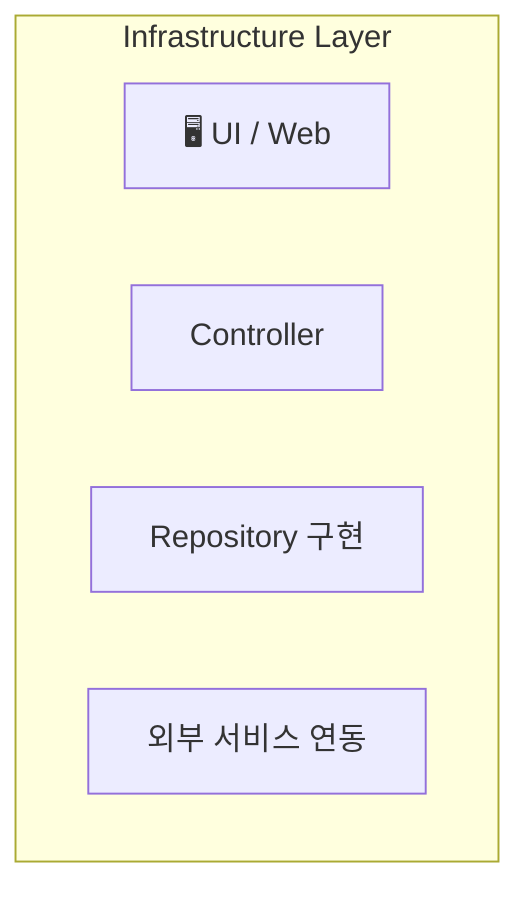
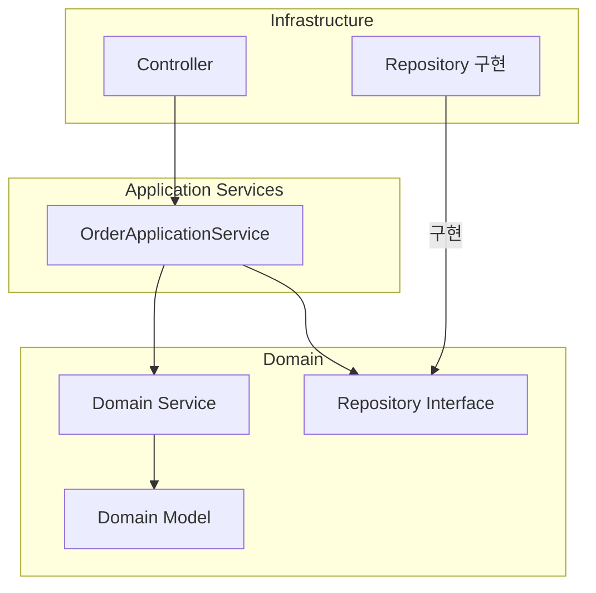
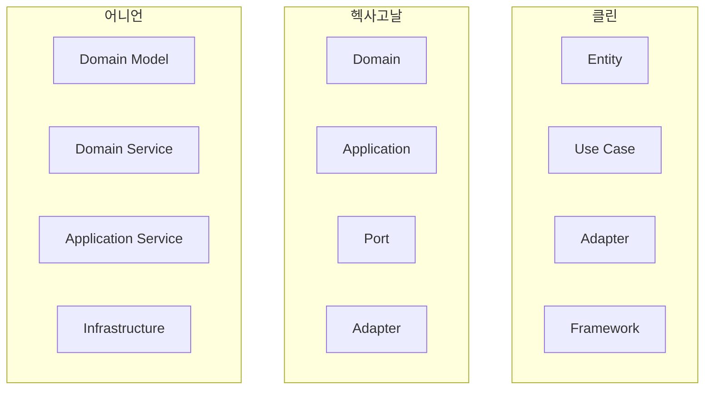
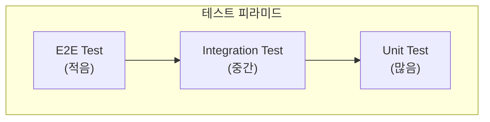
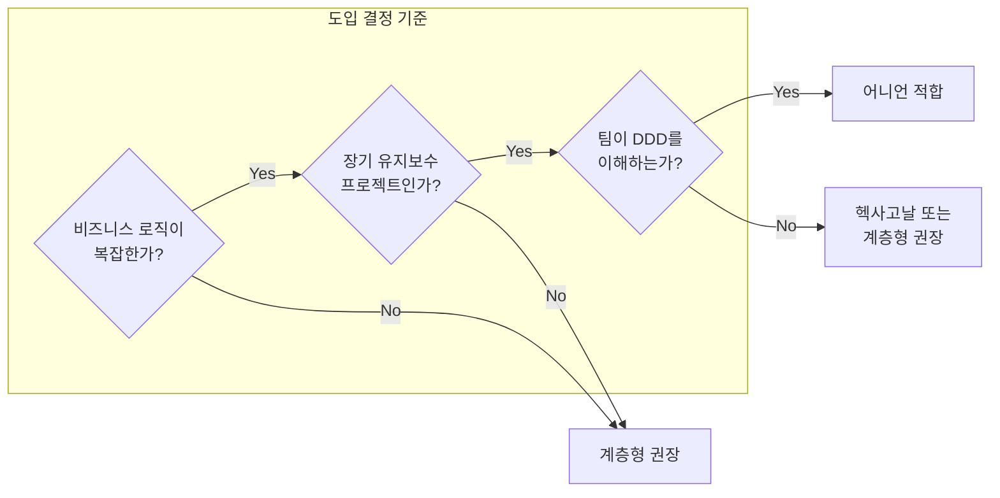
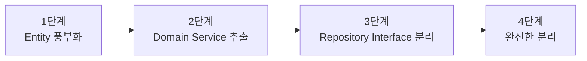

> **대상 독자**: DDD와 잘 어울리는 아키텍처를 찾는 개발자
> **선수 지식**: [헥사고날 아키텍처](hexagonal-architecture/)와 의존성 역전 원칙
> **소요 시간**: 약 20분

# 어니언 아키텍처 (Onion Architecture)

Jeffrey Palermo가 2008년에 제안한 아키텍처입니다. <strong>도메인 모델을 가장 중심</strong>에 두고, 양파처럼 겹겹이 감싸는 구조입니다.

어니언 아키텍처는 전통적인 계층형 아키텍처의 한계에서 출발합니다. 계층형 아키텍처에서는 상위 계층이 하위 계층에 의존하므로, 데이터베이스 계층의 변경이 서비스 계층에 연쇄적인 영향을 미칩니다. 반면 어니언 아키텍처에서는 <strong>도메인 모델이 어떤 것에도 의존하지 않고</strong>, 인프라스트럭처가 도메인에 의존하는 방향으로 설계합니다. 이를 통해 도메인 로직은 데이터베이스, 프레임워크, 외부 서비스의 변화와 무관하게 순수한 비즈니스 규칙만을 표현할 수 있습니다. DDD(Domain-Driven Design)와 특히 잘 어울리는 이유도 여기에 있습니다.

## 한 줄 요약

> **도메인 모델이 왕이다. 나머지는 모두 도메인을 섬긴다.**



---

## "양파"로 이해하기


양파를 잘라보면 겹겹이 층이 있습니다:

| 양파 층 | 소프트웨어 층 | 특징 |
|--------|-------------|------|
| 바깥 껍질 (버리는 부분) | **Infrastructure** | 교체 가능, 기술적 세부사항 |
| 바깥쪽 | **Application Services** | 흐름 조율 |
| 안쪽 | **Domain Services** | 도메인 로직 조합 |
| 💎 **핵심** (가장 단단함) | **Domain Model** | 절대 바뀌지 않는 비즈니스 규칙 |

<strong>핵심 아이디어:</strong> 도메인 모델은 가장 안쪽에서 <strong>아무것에도 의존하지 않습니다</strong>. 바깥 껍질(Infrastructure)은 언제든 벗겨내고 교체할 수 있지만, 핵심은 그대로 유지됩니다.


아래 다이어그램은 양파의 층 구조를 시각적으로 표현한 것입니다:



---

## 클린 아키텍처와의 차이

둘 다 "동심원" 구조지만, 강조점이 다릅니다:

| 관점 | 클린 | 어니언 |
|------|------|--------|
| **중심** | Entity (비즈니스 규칙) | Domain Model (DDD 개념) |
| **강조** | 의존성 규칙 | 도메인 순수성 |
| **Domain Service** | Entity에 포함 | 별도 레이어 |
| **Use Case** | Interactor | Application Service |
| **DDD 친화성** | 보통 | 높음 |



**어니언이 DDD에 더 적합한 이유:**
- Domain Model과 Domain Service를 명확히 분리
- Aggregate, Entity, Value Object 개념이 자연스럽게 들어감
- Repository 인터페이스가 Domain에 위치

---

## 4개의 레이어 상세 설명

### 1. Domain Model (도메인 모델) - 💎 가장 안쪽

<strong>핵심 비즈니스 개념과 규칙</strong>이 있는 곳입니다.



```java
// Entity: 고유 식별자로 구분
public class Order {
    private final OrderId id;  // 식별자
    private CustomerId customerId;
    private List<OrderLine> orderLines;
    private OrderStatus status;
    private Money totalAmount;

    // 팩토리 메서드
    public static Order create(CustomerId customerId, List<OrderLine> lines) {
        if (lines.isEmpty()) {
            throw new EmptyOrderException();
        }

        Order order = new Order(OrderId.generate());
        order.customerId = customerId;
        order.orderLines = new ArrayList<>(lines);
        order.status = OrderStatus.PENDING;
        order.recalculateTotal();

        return order;
    }

    // 비즈니스 로직
    public void addLine(OrderLine line) {
        validateModifiable();
        this.orderLines.add(line);
        recalculateTotal();
    }

    public void confirm() {
        validateCanConfirm();
        this.status = OrderStatus.CONFIRMED;
    }

    public void cancel() {
        validateCanCancel();
        this.status = OrderStatus.CANCELLED;
    }

    // 불변식 검증
    private void validateModifiable() {
        if (status != OrderStatus.PENDING) {
            throw new OrderNotModifiableException(id, status);
        }
    }

    private void validateCanConfirm() {
        if (status != OrderStatus.PENDING) {
            throw new InvalidOrderStateException("PENDING에서만 확정 가능");
        }
        if (totalAmount.isLessThan(Money.of(1000))) {
            throw new MinimumOrderAmountException();
        }
    }
}
```

```java
// Value Object: 값으로 비교, 불변
public record Money(BigDecimal amount, Currency currency) {

    public static final Money ZERO = Money.of(0);

    public Money {
        Objects.requireNonNull(amount);
        Objects.requireNonNull(currency);
        if (amount.compareTo(BigDecimal.ZERO) < 0) {
            throw new NegativeAmountException();
        }
    }

    public static Money of(long amount) {
        return new Money(BigDecimal.valueOf(amount), Currency.KRW);
    }

    public Money add(Money other) {
        validateSameCurrency(other);
        return new Money(amount.add(other.amount), currency);
    }

    public Money multiply(int quantity) {
        return new Money(amount.multiply(BigDecimal.valueOf(quantity)), currency);
    }

    public boolean isLessThan(Money other) {
        validateSameCurrency(other);
        return amount.compareTo(other.amount) < 0;
    }

    public boolean isGreaterThan(Money other) {
        validateSameCurrency(other);
        return amount.compareTo(other.amount) > 0;
    }

    private void validateSameCurrency(Money other) {
        if (this.currency != other.currency) {
            throw new CurrencyMismatchException(this.currency, other.currency);
        }
    }
}
```

```java
// Aggregate Root: 일관성 경계
public class Order {  // Order가 Aggregate Root
    private OrderId id;
    private List<OrderLine> orderLines;  // OrderLine은 Order 내부에서만 관리

    // 외부에서는 Order를 통해서만 OrderLine에 접근
    public void addLine(ProductId productId, int quantity, Money unitPrice) {
        OrderLine line = new OrderLine(productId, quantity, unitPrice);
        this.orderLines.add(line);
        recalculateTotal();
    }

    public void removeLine(ProductId productId) {
        orderLines.removeIf(line -> line.getProductId().equals(productId));
        recalculateTotal();
    }
}
```


**Domain Model의 특징**
- **순수한 Java 객체** - 어떤 프레임워크에도 의존 안 함
- **풍부한 도메인 로직** - getter/setter만 있으면 안 됨
- **자기 방어** - 잘못된 상태로 만들 수 없음
- **테스트 용이** - 외부 의존성 없이 테스트 가능


---

### 2. Domain Services (도메인 서비스) - 🟡

<strong>여러 도메인 객체를 조합하는 로직</strong>이 있는 곳입니다. 한 Entity에 넣기 어려운 로직을 담습니다.

```
🤔 이 로직은 어디에?
- Order에 넣을까? Customer에 넣을까?
→ 둘 다 아니면 Domain Service!
```

```java
// Domain Service: 여러 Aggregate를 조합
public class PricingService {

    // 할인 계산 - Order와 Customer 정보 모두 필요
    public Money calculateFinalPrice(Order order, Customer customer, DiscountPolicy policy) {
        Money basePrice = order.getTotalAmount();

        // 고객 등급에 따른 할인
        Percentage discount = policy.getDiscountFor(customer.getGrade());
        Money discounted = basePrice.applyDiscount(discount);

        // VIP 추가 할인
        if (customer.isVip() && order.getTotalAmount().isGreaterThan(Money.of(100000))) {
            discounted = discounted.applyDiscount(Percentage.of(5));
        }

        return discounted;
    }
}
```

```java
// Domain Service: 재고 확인 + 예약
public class InventoryDomainService {

    // 여러 상품의 재고를 한번에 확인하고 예약
    public ReservationResult reserveInventory(Order order, InventoryRepository inventoryRepo) {
        List<ReservationItem> reservations = new ArrayList<>();

        for (OrderLine line : order.getOrderLines()) {
            Inventory inventory = inventoryRepo.findByProductId(line.getProductId())
                .orElseThrow(() -> new ProductNotFoundException(line.getProductId()));

            if (!inventory.hasEnough(line.getQuantity())) {
                return ReservationResult.failed(line.getProductId(), "재고 부족");
            }

            inventory.reserve(line.getQuantity());
            reservations.add(new ReservationItem(inventory.getId(), line.getQuantity()));
        }

        return ReservationResult.success(reservations);
    }
}
```

**또한 Domain 레이어에는 Repository 인터페이스가 위치합니다:**

```java
// Repository Interface (Domain 레이어에 정의)
public interface OrderRepository {
    Order save(Order order);
    Optional<Order> findById(OrderId id);
    List<Order> findByCustomerId(CustomerId customerId);
}

public interface CustomerRepository {
    Optional<Customer> findById(CustomerId id);
}
```


**Domain Service vs Application Service**

| Domain Service | Application Service |
|----------------|---------------------|
| 도메인 로직 조합 | 흐름(워크플로우) 조율 |
| 순수한 비즈니스 규칙 | 트랜잭션, 인프라 호출 |
| 다른 도메인 객체만 사용 | Repository, 외부 서비스 호출 |
| "할인 금액 계산" | "주문 생성 → 저장 → 알림" |


---

### 3. Application Services (애플리케이션 서비스) - 🟢

<strong>Use Case 흐름을 조율</strong>합니다. 트랜잭션 관리, 외부 시스템 호출 등을 담당합니다.

```java
@Service
@Transactional
public class OrderApplicationService {

    // Repository들 (Infrastructure 구현체가 주입됨)
    private final OrderRepository orderRepository;
    private final CustomerRepository customerRepository;

    // Domain Services
    private final PricingService pricingService;
    private final InventoryDomainService inventoryService;

    // 외부 서비스
    private final PaymentService paymentService;
    private final NotificationService notificationService;
    private final EventPublisher eventPublisher;

    // Use Case: 주문 생성
    public OrderDto createOrder(CreateOrderCommand command) {
        // 1. 고객 조회
        Customer customer = customerRepository.findById(command.customerId())
            .orElseThrow(() -> new CustomerNotFoundException(command.customerId()));

        // 2. 도메인 객체 생성 (Domain Model)
        Order order = Order.create(
            customer.getId(),
            command.toOrderLines()
        );

        // 3. 할인 적용 (Domain Service)
        Money finalPrice = pricingService.calculateFinalPrice(
            order,
            customer,
            DiscountPolicy.standard()
        );
        order.applyDiscount(finalPrice);

        // 4. 재고 예약 (Domain Service)
        ReservationResult reservation = inventoryService.reserveInventory(
            order,
            inventoryRepository
        );
        if (!reservation.isSuccess()) {
            throw new InsufficientInventoryException(reservation.getFailedProduct());
        }

        // 5. 저장 (Repository)
        Order savedOrder = orderRepository.save(order);

        // 6. 이벤트 발행
        eventPublisher.publish(new OrderCreatedEvent(savedOrder));

        // 7. DTO 반환
        return OrderDto.from(savedOrder);
    }

    // Use Case: 주문 확정
    public void confirmOrder(OrderId orderId) {
        // 1. 조회
        Order order = orderRepository.findById(orderId)
            .orElseThrow(() -> new OrderNotFoundException(orderId));

        // 2. 결제 (외부 서비스)
        PaymentResult payment = paymentService.process(order.getTotalAmount());
        if (!payment.isSuccess()) {
            throw new PaymentFailedException(payment.getReason());
        }

        // 3. 확정 (Domain 로직)
        order.confirm();

        // 4. 저장
        orderRepository.save(order);

        // 5. 알림 발송 (외부 서비스)
        notificationService.sendConfirmation(order);

        // 6. 이벤트 발행
        eventPublisher.publish(new OrderConfirmedEvent(order));
    }
}
```


**Application Service의 역할**
- **조율자 역할** - "무엇을" 할지 결정, "어떻게"는 Domain에 위임
- **트랜잭션 경계** - @Transactional 적용
- **외부 시스템 호출** - Payment, Notification 등
- **이벤트 발행** - 도메인 이벤트 발행
- **DTO 변환** - 외부에 반환할 데이터 형태 결정


---

### 4. Infrastructure (인프라) - 🔵 가장 바깥

<strong>기술적 세부사항</strong>이 있는 곳입니다. UI, 데이터베이스, 외부 API 연동 등.



```java
// Controller (Infrastructure)
@RestController
@RequestMapping("/api/orders")
public class OrderController {

    private final OrderApplicationService orderService;

    @PostMapping
    public ResponseEntity<OrderResponse> createOrder(
            @Valid @RequestBody CreateOrderRequest request) {

        CreateOrderCommand command = request.toCommand();
        OrderDto result = orderService.createOrder(command);

        return ResponseEntity
            .status(HttpStatus.CREATED)
            .body(OrderResponse.from(result));
    }

    @PostMapping("/{orderId}/confirm")
    public ResponseEntity<Void> confirmOrder(@PathVariable String orderId) {
        orderService.confirmOrder(OrderId.of(orderId));
        return ResponseEntity.ok().build();
    }
}
```

```java
// Repository 구현 (Infrastructure)
@Repository
public class JpaOrderRepository implements OrderRepository {

    private final OrderJpaRepository jpaRepository;
    private final OrderMapper mapper;

    @Override
    public Order save(Order order) {
        OrderEntity entity = mapper.toEntity(order);
        OrderEntity saved = jpaRepository.save(entity);
        return mapper.toDomain(saved);
    }

    @Override
    public Optional<Order> findById(OrderId id) {
        return jpaRepository.findById(id.getValue())
            .map(mapper::toDomain);
    }

    @Override
    public List<Order> findByCustomerId(CustomerId customerId) {
        return jpaRepository.findByCustomerId(customerId.getValue())
            .stream()
            .map(mapper::toDomain)
            .toList();
    }
}

// JPA Entity (Infrastructure 전용)
@Entity
@Table(name = "orders")
public class OrderEntity {
    @Id
    private String id;
    private String customerId;
    private String status;
    private BigDecimal totalAmount;

    @OneToMany(mappedBy = "order", cascade = CascadeType.ALL, orphanRemoval = true)
    private List<OrderLineEntity> orderLines = new ArrayList<>();
}
```

```java
// 외부 서비스 구현 (Infrastructure)
@Component
public class ExternalPaymentService implements PaymentService {

    private final RestTemplate restTemplate;

    @Override
    public PaymentResult process(Money amount) {
        PaymentRequest request = new PaymentRequest(
            amount.getAmount(),
            amount.getCurrency().name()
        );

        try {
            ResponseEntity<PaymentResponse> response = restTemplate.postForEntity(
                "https://payment-api.example.com/process",
                request,
                PaymentResponse.class
            );

            return PaymentResult.from(response.getBody());
        } catch (Exception e) {
            return PaymentResult.failed("결제 서비스 오류: " + e.getMessage());
        }
    }
}
```

---

## 패키지 구조

```
com.example.order/
│
├── domain/                          # 💎 + 🟡 Domain Layer
│   ├── model/                       # Domain Model (가장 안쪽)
│   │   ├── order/
│   │   │   ├── Order.java           # Aggregate Root
│   │   │   ├── OrderLine.java       # Entity
│   │   │   ├── OrderId.java         # Value Object
│   │   │   └── OrderStatus.java     # Enum
│   │   ├── customer/
│   │   │   ├── Customer.java
│   │   │   └── CustomerId.java
│   │   └── common/
│   │       ├── Money.java
│   │       └── Percentage.java
│   │
│   ├── service/                     # Domain Services
│   │   ├── PricingService.java
│   │   └── InventoryDomainService.java
│   │
│   ├── repository/                  # Repository Interfaces
│   │   ├── OrderRepository.java
│   │   └── CustomerRepository.java
│   │
│   └── event/                       # Domain Events
│       ├── OrderCreatedEvent.java
│       └── OrderConfirmedEvent.java
│
├── application/                     # 🟢 Application Services
│   ├── service/
│   │   └── OrderApplicationService.java
│   ├── command/
│   │   └── CreateOrderCommand.java
│   ├── dto/
│   │   └── OrderDto.java
│   └── port/                        # 외부 서비스 Interface
│       ├── PaymentService.java
│       └── NotificationService.java
│
└── infrastructure/                  # 🔵 Infrastructure (가장 바깥)
    ├── web/
    │   ├── OrderController.java
    │   ├── CreateOrderRequest.java
    │   └── OrderResponse.java
    ├── persistence/
    │   ├── JpaOrderRepository.java
    │   ├── OrderEntity.java
    │   ├── OrderJpaRepository.java
    │   └── OrderMapper.java
    └── external/
        ├── ExternalPaymentService.java
        └── EmailNotificationService.java
```

---

## 의존성 방향



**핵심 규칙:**
1. **Infrastructure → Application → Domain** 방향으로만 의존
2. **Domain은 아무것에도 의존하지 않음**
3. **Repository Interface는 Domain에, 구현은 Infrastructure에**

---

## 다른 아키텍처와 비교

### 클린 vs 헥사고날 vs 어니언



| 비교 항목 | 클린 | 헥사고날 | 어니언 |
|---------|------|---------|--------|
| **레이어 수** | 4 | 3~4 | 4 |
| **중심** | Entity | Core | Domain Model |
| **강조점** | 의존성 규칙 | 외부 격리 | 도메인 순수성 |
| **Domain Service** | Entity에 포함 | 명시적 구분 없음 | 별도 레이어 |
| **DDD 친화성** | 보통 | 높음 | 가장 높음 |
| **복잡도** | 높음 | 중간 | 중간 |

---

## 흔한 실수들

### 1. Domain에 Infrastructure 코드

```java
// ❌ 잘못된 예: Domain Model에 JPA 어노테이션
@Entity  // Infrastructure 코드!
@Table(name = "orders")
public class Order {
    @Id
    private String id;

    @OneToMany(cascade = CascadeType.ALL)
    private List<OrderLine> orderLines;
}

// ✅ 올바른 예: 순수한 Domain Model
public class Order {
    private OrderId id;
    private List<OrderLine> orderLines;

    // 순수한 비즈니스 로직만
}

// Infrastructure에 별도 JPA Entity
@Entity
@Table(name = "orders")
public class OrderEntity {
    @Id
    private String id;
    // ...
}
```

### 2. Application Service에 비즈니스 로직

```java
// ❌ 잘못된 예: Application Service에 비즈니스 규칙
@Service
public class OrderApplicationService {

    public void confirmOrder(OrderId orderId) {
        Order order = orderRepository.findById(orderId).orElseThrow();

        // 이 로직은 Order 안에 있어야 함!
        if (order.getStatus().equals("PENDING")) {
            if (order.getTotalAmount() >= 1000) {
                order.setStatus("CONFIRMED");
            }
        }
    }
}

// ✅ 올바른 예: Domain Model에 비즈니스 로직
public class Order {
    public void confirm() {
        validateCanConfirm();  // 규칙 검증
        this.status = OrderStatus.CONFIRMED;
    }

    private void validateCanConfirm() {
        if (status != OrderStatus.PENDING) {
            throw new InvalidOrderStateException();
        }
        if (totalAmount.isLessThan(Money.of(1000))) {
            throw new MinimumOrderAmountException();
        }
    }
}

@Service
public class OrderApplicationService {
    public void confirmOrder(OrderId orderId) {
        Order order = orderRepository.findById(orderId).orElseThrow();
        order.confirm();  // Domain에 위임
        orderRepository.save(order);
    }
}
```

### 3. Domain이 외부 서비스 직접 호출

```java
// ❌ 잘못된 예: Domain Service가 외부 서비스 호출
public class PricingDomainService {
    private final ExternalDiscountApi discountApi;  // 외부 API!

    public Money calculatePrice(Order order) {
        Discount discount = discountApi.getDiscount(order.getCustomerId());  // 안 됨!
        return order.getTotalAmount().applyDiscount(discount);
    }
}

// ✅ 올바른 예: 필요한 정보를 파라미터로 받음
public class PricingDomainService {
    public Money calculatePrice(Order order, DiscountPolicy policy) {
        // 외부 정보는 Application Service에서 조회해서 전달
        Percentage discount = policy.getDiscountFor(order.getCustomerGrade());
        return order.getTotalAmount().applyDiscount(discount);
    }
}

// Application Service에서 외부 정보 조회
@Service
public class OrderApplicationService {
    private final DiscountClient discountClient;  // Infrastructure

    public OrderDto createOrder(CreateOrderCommand command) {
        DiscountPolicy policy = discountClient.getCurrentPolicy();  // 외부 조회
        Money finalPrice = pricingService.calculatePrice(order, policy);  // Domain에 전달
    }
}
```

---

## 테스트 전략

### 레이어별 테스트



### 1. Domain Model 테스트 (가장 쉬움)

```java
class OrderTest {

    @Test
    void 주문_생성_성공() {
        List<OrderLine> lines = List.of(
            new OrderLine(ProductId.of("p1"), 2, Money.of(10000))
        );

        Order order = Order.create(CustomerId.of("c1"), lines);

        assertThat(order.getId()).isNotNull();
        assertThat(order.getStatus()).isEqualTo(OrderStatus.PENDING);
        assertThat(order.getTotalAmount()).isEqualTo(Money.of(20000));
    }

    @Test
    void 빈_주문은_생성할_수_없다() {
        assertThrows(EmptyOrderException.class,
            () -> Order.create(CustomerId.of("c1"), List.of()));
    }
}

class MoneyTest {

    @Test
    void 금액_더하기() {
        Money a = Money.of(10000);
        Money b = Money.of(5000);

        Money result = a.add(b);

        assertThat(result).isEqualTo(Money.of(15000));
    }

    @Test
    void 음수_금액_불가() {
        assertThrows(NegativeAmountException.class,
            () -> new Money(BigDecimal.valueOf(-1000), Currency.KRW));
    }
}
```

### 2. Domain Service 테스트

```java
class PricingServiceTest {

    private PricingService pricingService = new PricingService();

    @Test
    void VIP_고객_10퍼센트_할인() {
        Order order = createOrderWithTotal(Money.of(100000));
        Customer vip = Customer.withGrade(Grade.VIP);
        DiscountPolicy policy = DiscountPolicy.standard();

        Money result = pricingService.calculateFinalPrice(order, vip, policy);

        assertThat(result).isEqualTo(Money.of(90000));
    }
}
```

### 3. Application Service 테스트 (Mock 사용)

```java
@ExtendWith(MockitoExtension.class)
class OrderApplicationServiceTest {

    @Mock private OrderRepository orderRepository;
    @Mock private CustomerRepository customerRepository;
    @Mock private PricingService pricingService;
    @Mock private PaymentService paymentService;
    @Mock private EventPublisher eventPublisher;

    @InjectMocks
    private OrderApplicationService service;

    @Test
    void 주문_확정_성공() {
        // Given
        Order order = createPendingOrder();
        when(orderRepository.findById(any())).thenReturn(Optional.of(order));
        when(paymentService.process(any())).thenReturn(PaymentResult.success());

        // When
        service.confirmOrder(order.getId());

        // Then
        verify(orderRepository).save(any());
        verify(eventPublisher).publish(any(OrderConfirmedEvent.class));
    }

    @Test
    void 결제_실패시_예외() {
        Order order = createPendingOrder();
        when(orderRepository.findById(any())).thenReturn(Optional.of(order));
        when(paymentService.process(any())).thenReturn(PaymentResult.failed("잔액 부족"));

        assertThrows(PaymentFailedException.class,
            () -> service.confirmOrder(order.getId()));

        verify(orderRepository, never()).save(any());
    }
}
```

### 4. Infrastructure 테스트 (통합 테스트)

```java
@DataJpaTest
class JpaOrderRepositoryTest {

    @Autowired
    private OrderJpaRepository jpaRepository;

    private JpaOrderRepository repository;

    @BeforeEach
    void setUp() {
        repository = new JpaOrderRepository(jpaRepository, new OrderMapper());
    }

    @Test
    void 주문_저장_및_조회() {
        Order order = createOrder();

        repository.save(order);
        Optional<Order> found = repository.findById(order.getId());

        assertThat(found).isPresent();
        assertThat(found.get().getStatus()).isEqualTo(order.getStatus());
    }
}
```

---

## 트레이드오프

어니언 아키텍처는 도메인을 보호하는 대신, 복잡성과 개발 비용이라는 대가를 지불합니다. 프로젝트에 도입하기 전에 장단점을 명확히 이해해야 합니다.

### 장점

| 장점 | 설명 |
|-----|------|
| **도메인 보호** | 비즈니스 로직이 기술적 세부사항에 오염되지 않음 |
| **테스트 용이성** | Domain Layer를 외부 의존성 없이 단위 테스트 가능 |
| **기술 독립성** | 데이터베이스, 프레임워크 교체가 도메인에 영향 없음 |
| **DDD 친화성** | Aggregate, Entity, Value Object 등 DDD 개념과 자연스럽게 매핑 |
| **명확한 경계** | 레이어 간 책임이 명확하여 팀 협업 용이 |

### 단점

| 단점 | 설명 |
|-----|------|
| **초기 복잡성** | 계층형보다 파일과 인터페이스가 많아짐 |
| **학습 곡선** | DDD 개념과 의존성 방향을 이해해야 함 |
| **매핑 오버헤드** | Domain Entity ↔ JPA Entity 변환 코드 필요 |
| **단순 CRUD에는 과도함** | 비즈니스 로직이 단순하면 오버엔지니어링 |
| **성능 비용** | 객체 변환이 많아 미세한 성능 저하 가능 |

### 현실적 고려사항



> <strong>핵심:</strong> 아키텍처의 복잡성은 <strong>해결하려는 문제의 복잡성에 비례</strong>해야 합니다. 단순한 문제에 복잡한 해결책을 적용하면, 그 복잡성 자체가 새로운 문제가 됩니다.

---

## 언제 어니언 아키텍처를 사용하나요?

### 적합한 경우

- ✅ DDD를 본격적으로 적용하는 프로젝트
- ✅ 복잡한 도메인 로직이 있는 경우
- ✅ 도메인 전문가와 협업하는 경우
- ✅ 장기적으로 유지보수할 프로젝트
- ✅ 비즈니스 규칙이 자주 변경되는 경우

### 부적합한 경우

- ❌ 단순 CRUD 애플리케이션
- ❌ 소규모, 단기 프로젝트
- ❌ DDD 경험이 없는 팀 → [계층형](layered-architecture/)으로 시작
- ❌ 외부 연동이 많고 도메인이 단순한 경우 → [헥사고날](hexagonal-architecture/)

### Best Practice: 어떤 시스템에 어울리는가?

| 시스템 유형 | 적합도 | 이유 |
|------------|-------|------|
| **DDD 기반 프로젝트** | 매우 적합 | Aggregate, Entity, Value Object와 자연스럽게 매핑 |
| **보험/금융 도메인** | 매우 적합 | 복잡한 비즈니스 규칙, 도메인 순수성 |
| **예약/스케줄링 시스템** | 적합 | 복잡한 도메인 로직, 상태 관리 |
| **재고/물류 관리** | 적합 | 비즈니스 규칙 중심, 도메인 전문가 협업 |
| **의료 시스템** | 적합 | 규정 준수, 복잡한 도메인 |
| **단순 조회 서비스** | 부적합 | 도메인 로직이 단순하면 과도함 |
| **외부 연동 중심** | 부적합 | 헥사고날이 더 적합 |
| **MVP/프로토타입** | 부적합 | 빠른 개발이 우선 |

---

## 점진적 도입



### 1단계: Entity에 로직 넣기

```java
// Before: Anemic Domain
public class Order {
    private String status;
    public void setStatus(String s) { this.status = s; }
}

// After: Rich Domain
public class Order {
    private OrderStatus status;

    public void confirm() {
        if (status != OrderStatus.PENDING) {
            throw new IllegalStateException();
        }
        this.status = OrderStatus.CONFIRMED;
    }
}
```

### 2단계: Domain Service 추출

```java
// 여러 Entity를 조합하는 로직을 Domain Service로
public class PricingService {
    public Money calculatePrice(Order order, Customer customer) {
        // ...
    }
}
```

### 3단계: Repository Interface 분리

```java
// domain/repository/OrderRepository.java (Interface)
public interface OrderRepository {
    Order save(Order order);
}

// infrastructure/persistence/JpaOrderRepository.java (구현)
public class JpaOrderRepository implements OrderRepository {
    // ...
}
```

---

## 다음 단계

- [계층형 아키텍처](layered-architecture/) - 기본부터 시작
- [헥사고날 아키텍처](hexagonal-architecture/) - 외부 연동 중심
- [클린 아키텍처](clean-architecture/) - 엄격한 규칙
- [CQRS](cqrs/) - 읽기/쓰기 분리
