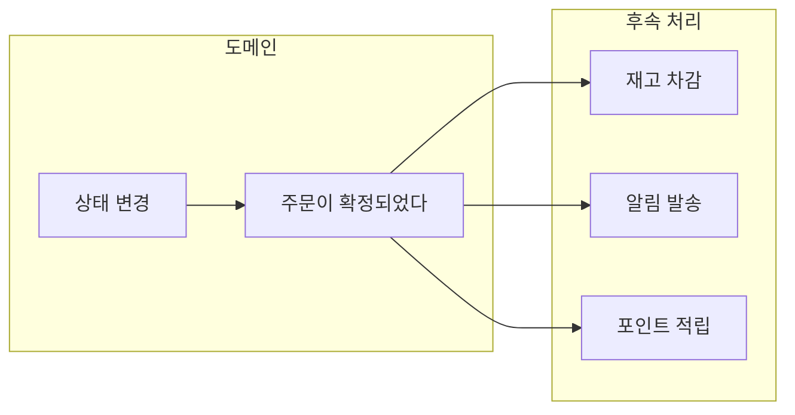

> 이 문서는 **도메인 모델링과 트랜잭션 개념을 이해한 개발자**를 대상으로,  
> **도메인 이벤트가 왜 필요하며, 언제 사용하고 언제 사용하지 말아야 하는지**를 설명한다.  
> 구현 방법보다 **설계 의도와 판단 기준(Why, When)**에 초점을 둔다.

---

## TL;DR — 한 문장 요약

**도메인 이벤트는 “비즈니스적으로 의미 있는 변화가 이미 발생했음”을 시스템 전체에 안전하게 전파하기 위한 설계 도구다.**  
이를 통해 핵심 도메인 로직과 부가 관심사를 분리하고, 시스템을 점진적으로 이벤트 기반 구조로 확장할 수 있다.

---

## 1. 왜 도메인 이벤트가 필요한가?

### 1.1 도메인 이벤트가 없을 때의 전형적인 문제

도메인 이벤트가 없는 시스템에서는 다음과 같은 코드가 자연스럽게 등장한다.

```java
public void confirmOrder(Order order) {
    order.confirm();
    inventoryService.decrease(order);
    notificationService.send(order);
    pointService.earn(order);
}
```

이 코드는 처음에는 단순해 보이지만, 시간이 지날수록 구조적인 문제가 발생한다.

- 주문 도메인이 **재고, 알림, 포인트 정책**에 강하게 결합된다
    
- 새로운 후속 작업이 생길 때마다 **주문 도메인을 수정**해야 한다
    
- “이 작업은 반드시 성공해야 하는가?”라는 질문에 **코드로 답하기 어렵다**
    

결과적으로 핵심 도메인은 점점 **비즈니스 규칙 + 기술적 후속 처리의 혼합물**이 된다.

---

### 1.2 도메인 이벤트의 핵심 아이디어

도메인 이벤트는 이 문제를 다음 질문으로 전환한다.

> **“주문 확정 이후에 무엇을 할 것인가?”가 아니라**  
> **“주문이 확정되었다는 사실을 어떻게 알릴 것인가?”**

즉, 도메인 이벤트는 **행동(Do)** 이 아니라 **사실(Fact)** 을 표현한다.

- ❌ 재고를 차감하라 (명령)
    
- ✅ 주문이 확정되었다 (사실)
    

이 차이로 인해 시스템은 다음과 같이 변한다.

- 주문 도메인은 **자신의 상태 변화만 책임진다**
    
- 후속 작업은 이벤트를 **구독**하여 각자의 책임 범위에서 처리한다
    
- 새로운 기능은 **이벤트 핸들러 추가만으로 확장**된다
    

---

## 2. 도메인 이벤트란 무엇인가?

도메인 이벤트는 **도메인 전문가가 중요하다고 인식하는 사건**이다.

- 주문이 확정되었다
    
- 결제가 완료되었다
    
- 상품이 배송되었다
    

이들은 단순한 상태 변경이 아니라, **비즈니스 흐름에서 의미 있는 경계점**이다.



이 구조에서 중요한 점은 **도메인 모델이 소비자를 모른다는 것**이다.

---

## 3. 도메인 이벤트의 특징 (Why 관점)

### 3.1 과거형 명명 — “이미 일어났다”

도메인 이벤트는 **명령이 아니라 사실**이므로 항상 과거형을 사용한다.

|구분|예시|의미|
|---|---|---|
|✅ 올바름|OrderConfirmed|이미 발생한 사실|
|❌ 잘못됨|ConfirmOrder|무엇을 하라는 지시|

이 규칙은 이벤트가 **되돌릴 수 없는 역사**임을 코드 수준에서 드러낸다.

---

### 3.2 불변성 — 기록은 수정되지 않는다

이벤트는 발행된 순간의 진실을 기록한다.

- 이벤트는 생성 후 변경되지 않는다
    
- 잘못된 이벤트는 **수정이 아니라 새로운 이벤트로 보정**한다
    

이 특성 덕분에 이벤트는 **감사 로그**와 **디버깅 단서**로 활용될 수 있다.

---

### 3.3 자기 완결성 — 다시 묻지 않아도 된다

좋은 도메인 이벤트는 **추가 조회 없이 처리 가능**해야 한다.

- ❌ orderId만 담긴 이벤트 → 소비자가 DB를 다시 조회해야 함
    
- ✅ 필요한 핵심 정보를 함께 포함 → 느슨한 결합 유지
    

이 원칙은 소비자가 **도메인 내부 구조에 의존하지 않게** 만든다.

---

## 4. 언제 이벤트를 발행해야 하는가?

도메인 이벤트는 모든 상태 변경에 대해 발행하지 않는다.

다음 질문에 **“예”** 라고 답할 수 있을 때만 이벤트 후보가 된다.

1. 비즈니스적으로 의미 있는 변화인가?
    
2. 이 사실을 다른 컴포넌트나 시스템이 알아야 하는가?
    
3. 나중에 “언제 무슨 일이 있었는지” 추적할 필요가 있는가?
    

예를 들어:

|상황|이벤트 발행|
|---|---|
|주문 상태가 CONFIRMED로 변경됨|✅ OrderConfirmed|
|주문 조회수 증가|❌ 이벤트 아님|
|배송 번호가 최초로 생성됨|✅ OrderShipped|

---

## 5. 도메인 이벤트 설계의 트레이드오프

### 5.1 이벤트 정보량의 선택

|선택|장점|단점|
|---|---|---|
|ID만 포함|이벤트 가벼움|소비자 DB 결합 증가|
|전체 Aggregate|조회 불필요|강한 결합, 무거움|
|필요한 스냅샷|균형 잡힘|설계 비용 증가|

**대부분의 경우, 필요한 스냅샷만 포함하는 방식이 가장 현실적이다.**

---

### 5.2 동기 vs 비동기 처리

|방식|적합한 경우|위험|
|---|---|---|
|동기(BEFORE_COMMIT)|반드시 성공해야 하는 후속 작업|결합도 증가|
|비동기(AFTER_COMMIT)|알림, 외부 연동|이벤트 유실 가능|

이 선택은 **비즈니스 중요도**에 따라 결정해야 한다.

---

## 6. 이벤트 기반 아키텍처의 대표적인 함정

### 함정 1. 이벤트 유실

- 메모리 기반 AFTER_COMMIT 발행
    
- 커밋 직후 서버 다운 → 이벤트 소실
    

**해결책: Transactional Outbox Pattern**

---

### 함정 2. 이벤트 순서 역전

- 비동기 처리 특성상 순서 보장 불가
    

**해결책**

- 상태 검증
    
- 시퀀스 번호 포함
    

---

### 함정 3. 이벤트 스키마 변경

|변경 유형|안전성|
|---|---|
|필드 추가(Optional)|안전|
|필드 이름 변경|위험|
|타입 변경|매우 위험|

이벤트는 **진화는 가능하지만, 수정은 불가능**하다는 관점으로 다뤄야 한다.

---

## 7. 언제 도메인 이벤트를 쓰지 말아야 하는가?

다음 상황에서는 도메인 이벤트가 오히려 복잡도를 증가시킨다.

- 단일 애플리케이션, 단일 트랜잭션
    
- 후속 작업이 없거나 항상 함께 변경됨
    
- 비즈니스적으로 의미 없는 기술적 상태 변경
    

**도메인 이벤트는 만능이 아니라, 확장 지점을 위한 도구다.**

---

## 8. 핵심 정리

- 도메인 이벤트는 **사실을 기록하고 전파하는 도구**다
    
- 목적은 느슨한 결합과 확장성이다
    
- 모든 상태 변경이 이벤트가 되지는 않는다
    
- 이벤트 설계는 항상 **트레이드오프**다
    

---

| 개념 | 핵심 |
|------|------|
| **도메인 이벤트** | 비즈니스적으로 의미 있는 사건 |
| **이벤트 패턴** | Notification / State Transfer / Sourcing |
| **Outbox 패턴** | 이벤트 유실 방지 |
| **CQRS** | 이벤트 소싱의 쿼리 성능 해결 |
| **스키마 진화** | 하위 호환성 유지 필수 |

#### 다음 단계

- [실습 예제](../../examples/) - Spring Boot로 구현하는 주문 도메인
