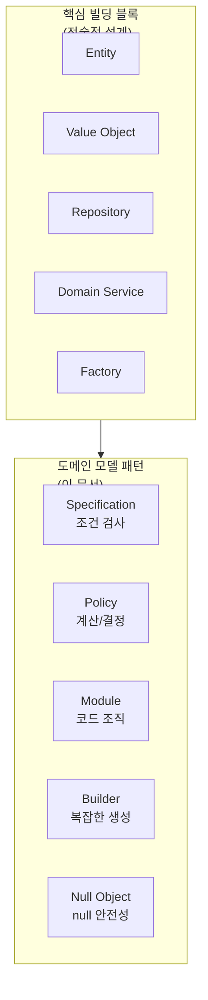
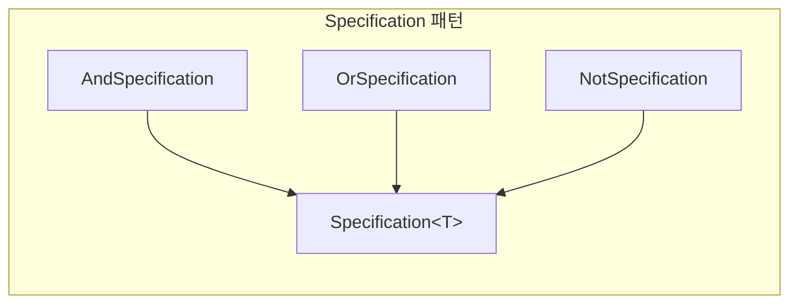
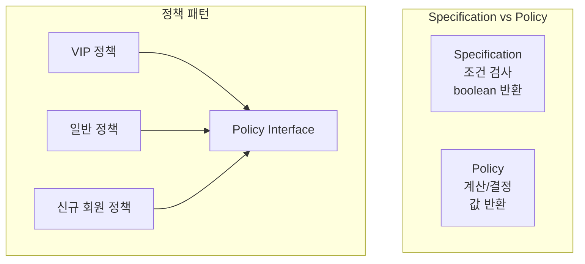
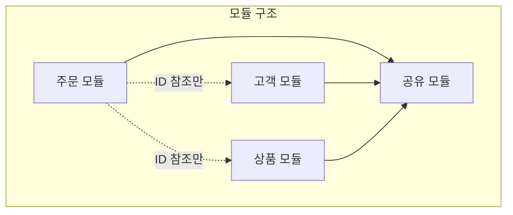

> **대상 독자**: [전술적 설계]() 빌딩 블록을 이해한 백엔드 개발자
> **선수 지식**: Entity, Value Object, Repository, Domain Service 개념 이해
> **소요 시간**: 약 25-30분
> **핵심 질문**: "핵심 빌딩 블록만으로 표현하기 어려운 도메인 로직을 어떻게 구조화하는가?"


핵심 빌딩 블록(Entity, Value Object, Repository, Domain Service, Factory)은 도메인 모델의 뼈대입니다. 이 문서에서 다루는 패턴들은 그 뼈대 위에 <strong>비즈니스 규칙을 체계적으로 표현</strong>하는 도구입니다: <strong>Specification</strong>(조건 검사) + <strong>Policy</strong>(계산/결정) + <strong>Module</strong>(코드 조직) + <strong>Builder</strong>(복잡한 생성) + <strong>Null Object</strong>(null 안전성)


전술적 설계의 핵심 빌딩 블록만으로도 도메인 모델을 구현할 수 있습니다. 하지만 실제 비즈니스는 더 복잡한 요구사항을 가집니다. "이 주문은 확정 가능한가?"라는 조건 검사, "VIP 고객에게는 몇 % 할인을 적용하는가?"라는 정책 결정, 그리고 여러 모듈에 걸친 코드 조직까지 — 이런 문제를 깔끔하게 해결하는 보조 패턴들을 알아보겠습니다.



> **이 페이지 예제의 공통 import:**
> ```java
> import java.util.*;
> import java.time.LocalDateTime;
> import java.math.BigDecimal;
> ```

#### Specification (명세) 패턴

**정의**

비즈니스 규칙을 객체로 캡슐화하여 재사용 가능하게 만드는 패턴이 Specification입니다. "이 주문을 확정할 수 있는가?", "이 고객은 VIP 할인을 받을 수 있는가?" 같은 복잡한 조건을 Specification 객체로 만들어 조합할 수 있습니다.



**언제 사용하나?**

Specification 패턴은 다음 상황에서 유용합니다.

- **복잡한 비즈니스 규칙**: if-else가 중첩되어 읽기 어려운 조건문
- **재사용 가능한 조건**: 여러 곳에서 반복되는 검증 로직
- **동적 조건 조합**: 런타임에 조건을 and, or, not으로 조합해야 할 때

**기본 구현**

Specification 인터페이스는 `isSatisfiedBy` 메서드로 조건을 검사합니다. `and`, `or`, `not` 메서드로 Specification을 조합할 수 있습니다. `AndSpecification`은 두 조건을 모두 만족해야 하고, `OrSpecification`은 둘 중 하나만 만족하면 되며, `NotSpecification`은 조건을 반대로 만듭니다.

```java
// Specification 인터페이스
public interface Specification<T> {
    boolean isSatisfiedBy(T candidate);

    default Specification<T> and(Specification<T> other) {
        return new AndSpecification<>(this, other);
    }

    default Specification<T> or(Specification<T> other) {
        return new OrSpecification<>(this, other);
    }

    default Specification<T> not() {
        return new NotSpecification<>(this);
    }
}

// 복합 Specification
public class AndSpecification<T> implements Specification<T> {
    private final Specification<T> first;
    private final Specification<T> second;

    public AndSpecification(Specification<T> first, Specification<T> second) {
        this.first = first;
        this.second = second;
    }

    @Override
    public boolean isSatisfiedBy(T candidate) {
        return first.isSatisfiedBy(candidate) && second.isSatisfiedBy(candidate);
    }
}

public class OrSpecification<T> implements Specification<T> {
    private final Specification<T> first;
    private final Specification<T> second;

    public OrSpecification(Specification<T> first, Specification<T> second) {
        this.first = first;
        this.second = second;
    }

    @Override
    public boolean isSatisfiedBy(T candidate) {
        return first.isSatisfiedBy(candidate) || second.isSatisfiedBy(candidate);
    }
}

public class NotSpecification<T> implements Specification<T> {
    private final Specification<T> spec;

    public NotSpecification(Specification<T> spec) {
        this.spec = spec;
    }

    @Override
    public boolean isSatisfiedBy(T candidate) {
        return !spec.isSatisfiedBy(candidate);
    }
}
```

**주문 도메인 예시**

주문 도메인에서 Specification을 어떻게 사용하는지 보겠습니다. `hasMinimumAmount`는 최소 금액 조건을, `hasStatus`는 특정 상태 조건을 검사합니다. `isConfirmable`은 "PENDING 상태이면서 최소 금액 이상"이라는 복합 조건을 and로 조합합니다. `isCancellable`은 "PENDING 또는 CONFIRMED 상태"라는 조건을 or로 조합합니다. Order 클래스의 `confirm`과 `cancel` 메서드는 이 Specification을 사용하여 조건을 검사합니다.

```java
// 구체적인 주문 Specification들
public class OrderSpecifications {

    // 최소 금액 검증
    public static Specification<Order> hasMinimumAmount(Money minimum) {
        return order -> order.getTotalAmount().isGreaterThanOrEqual(minimum);
    }

    // 특정 상태 검증
    public static Specification<Order> hasStatus(OrderStatus status) {
        return order -> order.getStatus() == status;
    }

    // 확정 가능 여부
    public static Specification<Order> isConfirmable() {
        return hasStatus(OrderStatus.PENDING)
            .and(hasMinimumAmount(Money.won(10000)));
    }

    // 취소 가능 여부
    public static Specification<Order> isCancellable() {
        return hasStatus(OrderStatus.PENDING)
            .or(hasStatus(OrderStatus.CONFIRMED));
    }

    // 배송 가능 여부
    public static Specification<Order> isShippable() {
        return hasStatus(OrderStatus.CONFIRMED)
            .and(order -> order.hasValidShippingAddress())
            .and(order -> !order.getOrderLines().isEmpty());
    }
}

// 사용 예시
public class Order {

    public void confirm() {
        if (!OrderSpecifications.isConfirmable().isSatisfiedBy(this)) {
            throw new OrderCannotBeConfirmedException(this.id);
        }
        this.status = OrderStatus.CONFIRMED;
        registerEvent(new OrderConfirmedEvent(this.id));
    }

    public void cancel(CancellationReason reason) {
        if (!OrderSpecifications.isCancellable().isSatisfiedBy(this)) {
            throw new OrderCannotBeCancelledException(this.id, this.status);
        }
        this.status = OrderStatus.CANCELLED;
        this.cancellationReason = reason;
        registerEvent(new OrderCancelledEvent(this.id, reason));
    }
}
```

**Repository와 함께 사용**

Specification은 Repository 조회에도 사용할 수 있습니다. Spring Data JPA의 Specification을 활용하면 동적 쿼리를 타입 안전하게 작성할 수 있습니다. `hasStatus`, `hasMinimumAmount`, `createdBetween`, `belongsToCustomer` 같은 Specification을 조합하여 복잡한 조회 조건을 만듭니다.

```java
// JPA Specification (Spring Data JPA)
public class OrderJpaSpecifications {

    public static org.springframework.data.jpa.domain.Specification<OrderEntity>
            hasStatus(OrderStatus status) {
        return (root, query, cb) ->
            cb.equal(root.get("status"), status);
    }

    public static org.springframework.data.jpa.domain.Specification<OrderEntity>
            hasMinimumAmount(Money minimum) {
        return (root, query, cb) ->
            cb.greaterThanOrEqualTo(root.get("totalAmount"), minimum.amount());
    }

    public static org.springframework.data.jpa.domain.Specification<OrderEntity>
            createdBetween(LocalDateTime start, LocalDateTime end) {
        return (root, query, cb) ->
            cb.between(root.get("createdAt"), start, end);
    }

    public static org.springframework.data.jpa.domain.Specification<OrderEntity>
            belongsToCustomer(CustomerId customerId) {
        return (root, query, cb) ->
            cb.equal(root.get("customerId"), customerId.getValue());
    }
}

// Repository에서 사용
@Repository
public class JpaOrderRepository implements OrderRepository {

    private final OrderJpaRepository jpaRepository;

    @Override
    public List<Order> findConfirmableOrders() {
        var spec = OrderJpaSpecifications.hasStatus(OrderStatus.PENDING)
            .and(OrderJpaSpecifications.hasMinimumAmount(Money.won(10000)));

        return jpaRepository.findAll(spec).stream()
            .map(mapper::toDomain)
            .toList();
    }
}
```

Specification 패턴의 장점을 정리하면 다음과 같습니다. <strong>재사용성</strong>은 비즈니스 규칙을 여러 곳에서 재사용할 수 있다는 것입니다. <strong>가독성</strong>은 복잡한 조건을 명확하게 표현한다는 것입니다. <strong>테스트 용이</strong>는 각 규칙을 독립적으로 테스트할 수 있다는 것입니다. <strong>조합 가능</strong>은 and, or, not으로 복잡한 규칙을 구성할 수 있다는 것입니다.

| 장점 | 설명 |
|------|------|
| **재사용성** | 비즈니스 규칙을 여러 곳에서 재사용 |
| **가독성** | 복잡한 조건을 명확하게 표현 |
| **테스트 용이** | 각 규칙을 독립적으로 테스트 |
| **조합 가능** | and, or, not으로 복잡한 규칙 구성 |

#### Policy (정책) 패턴

**정의**

비즈니스 정책을 독립적인 객체로 분리하여 교체 가능하게 만드는 패턴이 Policy입니다. Specification이 "조건 검사"에 초점을 맞춘다면, Policy는 "계산이나 결정"에 초점을 맞춥니다. 할인 정책, 배송비 정책, 포인트 적립 정책 등이 Policy 패턴의 좋은 예입니다.



**할인 정책 예시**

할인 정책을 Policy 패턴으로 구현해보겠습니다. `DiscountPolicy` 인터페이스는 `calculateDiscount`와 `isApplicable` 메서드를 정의합니다. `VipDiscountPolicy`는 VIP 고객에게 10% 할인을 적용합니다. `FirstOrderDiscountPolicy`는 첫 주문 고객에게 5000원 할인을 적용합니다. `BulkOrderDiscountPolicy`는 10개 이상 구매 시 5% 할인을 적용합니다. `DiscountCalculator`는 이 모든 정책을 조합하여 총 할인액을 계산합니다.

```java
// 할인 정책 인터페이스
public interface DiscountPolicy {
    Money calculateDiscount(Order order, Customer customer);
    boolean isApplicable(Order order, Customer customer);
}

// VIP 할인 정책
public class VipDiscountPolicy implements DiscountPolicy {
    private static final BigDecimal DISCOUNT_RATE = new BigDecimal("0.10");

    @Override
    public boolean isApplicable(Order order, Customer customer) {
        return customer.getGrade() == CustomerGrade.VIP;
    }

    @Override
    public Money calculateDiscount(Order order, Customer customer) {
        return order.getTotalAmount().multiply(DISCOUNT_RATE);
    }
}

// 첫 주문 할인 정책
public class FirstOrderDiscountPolicy implements DiscountPolicy {
    private static final Money DISCOUNT_AMOUNT = Money.won(5000);

    @Override
    public boolean isApplicable(Order order, Customer customer) {
        return customer.getOrderCount() == 0;
    }

    @Override
    public Money calculateDiscount(Order order, Customer customer) {
        return DISCOUNT_AMOUNT;
    }
}

// 대량 구매 할인 정책
public class BulkOrderDiscountPolicy implements DiscountPolicy {
    private static final int MINIMUM_QUANTITY = 10;
    private static final BigDecimal DISCOUNT_RATE = new BigDecimal("0.05");

    @Override
    public boolean isApplicable(Order order, Customer customer) {
        return order.getTotalQuantity() >= MINIMUM_QUANTITY;
    }

    @Override
    public Money calculateDiscount(Order order, Customer customer) {
        return order.getTotalAmount().multiply(DISCOUNT_RATE);
    }
}

// 정책 조합
@DomainService
public class DiscountCalculator {

    private final List<DiscountPolicy> policies;

    public DiscountCalculator(List<DiscountPolicy> policies) {
        this.policies = policies;
    }

    public Money calculateTotalDiscount(Order order, Customer customer) {
        return policies.stream()
            .filter(policy -> policy.isApplicable(order, customer))
            .map(policy -> policy.calculateDiscount(order, customer))
            .reduce(Money.ZERO, Money::add);
    }
}
```

**배송비 정책 예시**

배송비 정책도 비슷한 패턴을 따릅니다. `StandardShippingPolicy`는 기본 배송비 정책으로, 5만원 이상 구매 시 무료 배송을 적용합니다. `RemoteAreaShippingPolicy`는 도서산간 지역에 추가 배송비를 부과합니다. 기존 정책을 delegate로 받아 기본 배송비를 계산한 후, 도서산간이면 추가 비용을 더합니다.

```java
// 배송비 정책 인터페이스
public interface ShippingPolicy {
    Money calculateShippingFee(Order order, ShippingAddress address);
}

// 기본 배송비 정책
public class StandardShippingPolicy implements ShippingPolicy {
    private static final Money BASE_FEE = Money.won(3000);
    private static final Money FREE_SHIPPING_THRESHOLD = Money.won(50000);

    @Override
    public Money calculateShippingFee(Order order, ShippingAddress address) {
        if (order.getTotalAmount().isGreaterThanOrEqual(FREE_SHIPPING_THRESHOLD)) {
            return Money.ZERO;
        }
        return BASE_FEE;
    }
}

// 도서산간 배송비 정책
public class RemoteAreaShippingPolicy implements ShippingPolicy {
    private static final Money REMOTE_SURCHARGE = Money.won(5000);
    private final ShippingPolicy delegate;
    private final RemoteAreaChecker remoteAreaChecker;

    @Override
    public Money calculateShippingFee(Order order, ShippingAddress address) {
        Money baseFee = delegate.calculateShippingFee(order, address);

        if (remoteAreaChecker.isRemoteArea(address)) {
            return baseFee.add(REMOTE_SURCHARGE);
        }
        return baseFee;
    }
}
```

#### Module (모듈) 조직

**패키지 구조**

도메인의 복잡도가 높아지면 모듈로 분리하여 관리합니다. DDD에서 Module은 관련된 도메인 개념을 응집력 있게 묶는 단위입니다. 주문 모듈, 고객 모듈, 상품 모듈을 각각 domain, application, infrastructure 계층으로 나눕니다. domain 패키지에는 Entity, Value Object, Repository Interface, Domain Event가 위치합니다. application 패키지에는 Application Service와 DTO가 위치합니다. infrastructure 패키지에는 Repository 구현체와 Event Publisher가 위치합니다. shared 모듈에는 Money, Address 같은 공통 Value Object가 위치합니다.

```
src/main/java/com/example/
├── order/                          # 주문 모듈
│   ├── domain/
│   │   ├── Order.java
│   │   ├── OrderLine.java
│   │   ├── OrderId.java
│   │   ├── OrderStatus.java
│   │   ├── OrderRepository.java   # Repository Interface
│   │   ├── OrderFactory.java
│   │   └── event/
│   │       ├── OrderCreatedEvent.java
│   │       └── OrderConfirmedEvent.java
│   ├── application/
│   │   ├── OrderCommandService.java
│   │   ├── OrderQueryService.java
│   │   └── dto/
│   │       ├── CreateOrderCommand.java
│   │       └── OrderResponse.java
│   └── infrastructure/
│       ├── persistence/
│       │   ├── JpaOrderRepository.java
│       │   ├── OrderEntity.java
│       │   └── OrderMapper.java
│       └── event/
│           └── KafkaOrderEventPublisher.java
│
├── customer/                       # 고객 모듈
│   ├── domain/
│   │   ├── Customer.java
│   │   ├── CustomerId.java
│   │   └── CustomerRepository.java
│   ├── application/
│   │   └── CustomerService.java
│   └── infrastructure/
│       └── persistence/
│           └── JpaCustomerRepository.java
│
├── product/                        # 상품 모듈
│   ├── domain/
│   ├── application/
│   └── infrastructure/
│
└── shared/                         # 공유 모듈
    ├── domain/
    │   ├── Money.java
    │   ├── Address.java
    │   └── AggregateRoot.java
    └── infrastructure/
        └── event/
            └── DomainEventPublisher.java
```

**모듈 간 의존성**

모듈 간 의존성은 명확해야 합니다. 주문 모듈, 고객 모듈, 상품 모듈은 모두 shared 모듈을 의존합니다. 주문 모듈은 고객 모듈이나 상품 모듈을 직접 의존하지 않고 ID 참조만 사용합니다.



**모듈 간 통신**

모듈 간 통신은 ID 참조를 사용합니다. Customer Aggregate를 직접 참조하면 안 됩니다. CustomerId만 참조합니다. 필요하면 Application Service에서 CustomerReader로 조회합니다. 이렇게 하면 모듈 간 결합도가 낮아지고 독립적으로 변경할 수 있습니다.

```java
// ❌ 직접 의존 (피해야 함)
public class Order {
    private Customer customer;  // 다른 모듈 Aggregate 직접 참조
}

// ✅ ID로 참조
public class Order {
    private CustomerId customerId;  // ID만 참조
}

// 필요시 Application Service에서 조회
@Service
public class OrderApplicationService {

    private final OrderRepository orderRepository;
    private final CustomerReader customerReader;  // Port/Interface

    public OrderDetailResponse getOrderDetail(OrderId orderId) {
        Order order = orderRepository.findById(orderId).orElseThrow();
        Customer customer = customerReader.findById(order.getCustomerId());

        return OrderDetailResponse.of(order, customer);
    }
}
```

#### Builder 패턴 (복잡한 생성)

**Aggregate Builder**

복잡한 Aggregate 생성 시 Builder 패턴을 활용합니다. [전술적 설계]()에서 다룬 Factory가 "외부 의존성이 필요한 복잡한 생성"에 적합하다면, Builder는 "여러 속성을 조합하여 객체를 만드는" 상황에 적합합니다. 내부 Builder 클래스로 유창한 인터페이스를 제공하고, `build` 메서드에서 최종 검증을 수행합니다.

```java
public class Order {
    private final OrderId id;
    private final CustomerId customerId;
    private final List<OrderLine> orderLines;
    private final ShippingAddress shippingAddress;
    private final Money totalAmount;
    private OrderStatus status;

    private Order(Builder builder) {
        this.id = builder.id;
        this.customerId = builder.customerId;
        this.orderLines = List.copyOf(builder.orderLines);
        this.shippingAddress = builder.shippingAddress;
        this.totalAmount = calculateTotalAmount(builder.orderLines);
        this.status = OrderStatus.PENDING;

        validate();
    }

    private void validate() {
        if (orderLines.isEmpty()) {
            throw new EmptyOrderException("주문에는 최소 1개 이상의 항목이 필요합니다");
        }
    }

    public static Builder builder() {
        return new Builder();
    }

    public static class Builder {
        private OrderId id;
        private CustomerId customerId;
        private List<OrderLine> orderLines = new ArrayList<>();
        private ShippingAddress shippingAddress;

        public Builder id(OrderId id) {
            this.id = id;
            return this;
        }

        public Builder customerId(CustomerId customerId) {
            this.customerId = customerId;
            return this;
        }

        public Builder addOrderLine(ProductId productId, String productName,
                                    Money price, int quantity) {
            this.orderLines.add(OrderLine.create(productId, productName, price, quantity));
            return this;
        }

        public Builder shippingAddress(ShippingAddress address) {
            this.shippingAddress = address;
            return this;
        }

        public Order build() {
            if (id == null) {
                id = OrderId.generate();
            }
            return new Order(this);
        }
    }
}

// 사용 예시
Order order = Order.builder()
    .customerId(CustomerId.of("CUST-001"))
    .addOrderLine(productId1, "노트북", Money.won(1200000), 1)
    .addOrderLine(productId2, "마우스", Money.won(50000), 2)
    .shippingAddress(new ShippingAddress("12345", "서울시", "강남구", "101호"))
    .build();
```

#### Null Object 패턴

**정의**

null 체크를 피하기 위해 특수한 'null' 객체를 사용하는 패턴입니다. DiscountPolicy 인터페이스에 NONE이라는 Null Object를 정의합니다. 할인이 없을 때 null을 반환하는 대신 `DiscountPolicy.NONE`을 반환합니다. 이렇게 하면 null 체크 없이 `calculateDiscount`를 호출할 수 있습니다.

```java
// Null Object 패턴 적용
public interface DiscountPolicy {
    Money calculateDiscount(Order order);

    // Null Object
    DiscountPolicy NONE = order -> Money.ZERO;
}

// 사용
public class Order {
    private final DiscountPolicy discountPolicy;

    public Order(CustomerId customerId, DiscountPolicy discountPolicy) {
        this.customerId = customerId;
        // null 대신 NONE 사용
        this.discountPolicy = discountPolicy != null ? discountPolicy : DiscountPolicy.NONE;
    }

    public Money calculateFinalAmount() {
        // null 체크 불필요
        Money discount = discountPolicy.calculateDiscount(this);
        return totalAmount.subtract(discount);
    }
}
```

**Optional과의 비교**

Optional을 사용하는 방법도 있지만, 도메인 로직에서는 Null Object가 더 자연스러울 때가 많습니다. Optional은 호출하는 쪽에서 처리해야 하지만, Null Object는 투명하게 동작합니다.

```java
// Optional 사용
public Optional<Discount> getDiscount() {
    return Optional.ofNullable(discount);
}

// Null Object 사용 (권장: 도메인 로직에서)
public Discount getDiscount() {
    return discount != null ? discount : Discount.NONE;
}
```

#### 핵심 요약


| 패턴 | 목적 | 핵심 사용처 |
|------|------|------------|
| **Specification** | 비즈니스 규칙을 객체로 캡슐화 | 복잡한 조건 검사, 동적 쿼리 |
| **Policy** | 비즈니스 정책을 교체 가능하게 분리 | 할인, 배송비, 포인트 계산 |
| **Module** | 관련 도메인 개념을 응집력 있게 조직 | 패키지 구조, 모듈 간 통신 |
| **Builder** | 복잡한 객체 생성을 단계적으로 구성 | 속성이 많은 Aggregate 생성 |
| **Null Object** | null 안전성 확보 | 선택적 정책, 기본값 처리 |

**Specification vs Policy 구분:**
- **Specification**: "이 조건을 만족하는가?" → boolean 반환
- **Policy**: "어떤 값을 계산/결정하는가?" → 값 반환


#### 다음 단계

- [아키텍처 패턴]() - 빌딩 블록과 패턴을 배치하는 코드 구조
- [테스트 전략]() - 도메인 모델을 검증하는 테스트 방법
- [안티패턴과 함정]() - 흔히 저지르는 실수와 해결법
