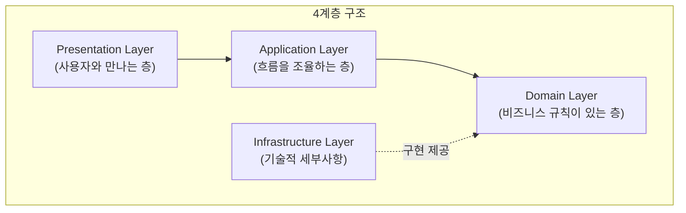
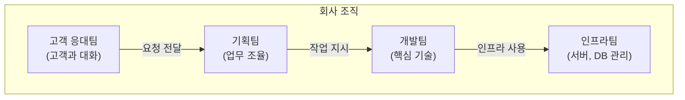
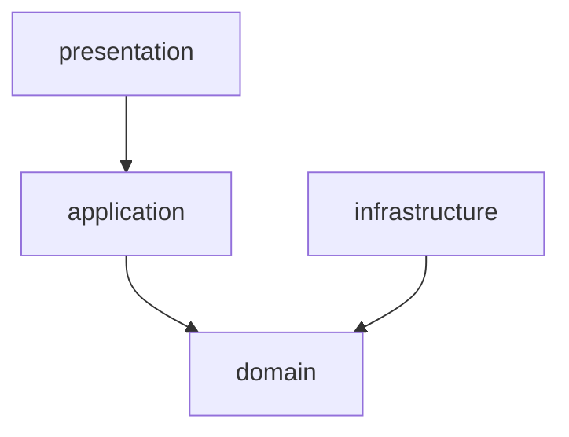
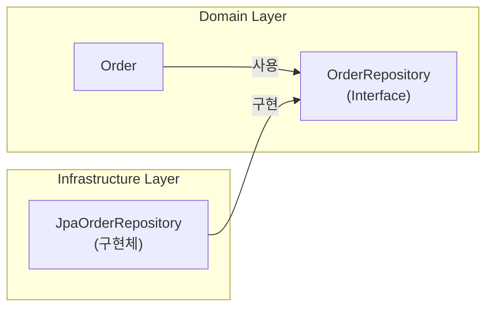
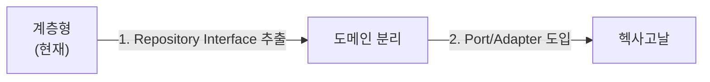

> **대상 독자**: 아키텍처 패턴을 처음 배우는 개발자
> **선수 지식**: 기본적인 Spring Boot MVC 패턴 이해
> **소요 시간**: 약 15분

가장 기본적이고 널리 사용되는 아키텍처 패턴입니다. **처음 아키텍처를 배운다면 여기서 시작하세요.** 계층형 아키텍처는 소프트웨어를 수평으로 나누어 각 계층이 명확한 역할을 가지도록 구성합니다. 각 계층은 위에서 아래로만 호출할 수 있다는 단순하지만 강력한 규칙을 따릅니다.

#### 한 줄 요약

코드를 4개 층으로 나누고, 위에서 아래로만 호출한다는 원칙을 기본으로 합니다. 이렇게 하면 각 층이 자신의 책임에 집중할 수 있고, 코드의 구조를 이해하기 쉬워집니다.



---

#### 왜 계층으로 나누나요?

계층으로 나누는 이유는 복잡한 시스템을 관리 가능한 단위로 분리하기 위함입니다. 각 계층이 자신만의 책임을 가지면, 코드 변경 시 영향 범위를 예측하기 쉽고, 팀원들 간의 협업도 원활해집니다.

**비유: 회사 조직도**

회사에서 일하는 방식을 생각해보세요. 고객 응대팀은 고객이 무엇을 원하는지 파악하고, 기획팀은 어떤 순서로 처리할지 조율하며, 개발팀은 실제 기능을 개발하고, 인프라팀은 서버와 데이터베이스 같은 기반을 관리합니다. 각 팀이 자기 역할에 집중하니까 효율적이죠? 소프트웨어도 마찬가지입니다.



각 팀이 명확한 역할을 가지고 있어서 문제가 생겼을 때 어디를 고쳐야 할지 바로 알 수 있습니다. 소프트웨어 계층도 이와 같은 원리로 동작합니다.

---

#### 4가지 계층 상세 설명

계층형 아키텍처는 크게 4개의 계층으로 구성됩니다. 각 계층은 명확히 구분되며, 상위 계층은 하위 계층만 호출할 수 있습니다.

**1. Presentation Layer (표현 계층)**

표현 계층은 사용자와 소통하는 창구입니다. 사용자 입력을 받고, 결과를 보여주는 역할을 담당합니다. HTTP 요청을 처리하거나 화면 입력을 받아들이고, JSON 응답이나 HTML 페이지로 결과를 전달합니다. 또한 입력 형식이 올바른지 검증하는 역할도 수행합니다.

사용자는 이 계층을 통해서만 시스템과 상호작용합니다. 사용자가 버튼을 클릭하거나 폼을 제출하면, 표현 계층이 이를 받아서 적절한 형태로 변환한 뒤 하위 계층에 전달합니다.

```java
// Presentation Layer 예시: Controller
@RestController
@RequestMapping("/api/orders")
public class OrderController {

    private final OrderService orderService;  // Application Layer 호출

    // 사용자 요청 받기
    @PostMapping
    public ResponseEntity<OrderResponse> createOrder(
            @Valid @RequestBody CreateOrderRequest request) {

        // 1. 요청 데이터를 Application Layer에 전달
        OrderDto result = orderService.createOrder(
            request.getCustomerId(),
            request.getItems()
        );

        // 2. 결과를 사용자에게 응답
        return ResponseEntity.ok(OrderResponse.from(result));
    }

    @GetMapping("/{orderId}")
    public ResponseEntity<OrderResponse> getOrder(@PathVariable String orderId) {
        OrderDto order = orderService.getOrder(orderId);
        return ResponseEntity.ok(OrderResponse.from(order));
    }
}

// 요청/응답 객체 (DTO)
public record CreateOrderRequest(
    String customerId,
    List<OrderItemRequest> items
) {}

public record OrderResponse(
    String orderId,
    String status,
    BigDecimal totalAmount
) {
    public static OrderResponse from(OrderDto dto) {
        return new OrderResponse(dto.orderId(), dto.status(), dto.totalAmount());
    }
}
```

위 코드에서 OrderController는 HTTP 요청을 받아서 OrderService에게 전달하고, 그 결과를 다시 HTTP 응답으로 변환합니다. 이 계층은 HTTP라는 전송 프로토콜의 세부사항만 알고 있으며, 비즈니스 로직은 전혀 포함하지 않습니다.


**흔한 실수: Presentation에 비즈니스 로직 넣기**

```java
// ❌ 잘못된 예: Controller에서 할인 계산
@PostMapping
public ResponseEntity<OrderResponse> createOrder(...) {
    // 이런 로직은 여기 있으면 안 됨!
    if (request.getTotalAmount() > 100000) {
        request.setDiscount(0.1);  // 10% 할인
    }
}
```

비즈니스 로직은 Domain Layer에 있어야 합니다.


**2. Application Layer (응용 계층)**

응용 계층은 업무 흐름을 조율하는 지휘자입니다. 이 계층은 "무엇을" 할지 결정하지만, "어떻게" 할지는 Domain Layer에게 맡깁니다. 어떤 순서로 처리할지 결정하고, 트랜잭션을 관리하며, Domain Layer의 객체들을 조합해서 사용합니다.

예를 들어, 주문을 생성할 때는 고객 정보를 조회하고, 주문 객체를 만들고, 저장하고, 알림을 보내는 일련의 흐름을 조율합니다. 각 단계에서 실제 비즈니스 규칙이 적용되는 것은 Domain 객체가 처리하지만, 이 흐름을 어떤 순서로 실행할지는 Application Layer가 결정합니다.

```java
// Application Layer 예시: Service
@Service
@Transactional  // 트랜잭션 관리는 여기서
public class OrderService {

    private final OrderRepository orderRepository;
    private final CustomerRepository customerRepository;
    private final PaymentService paymentService;
    private final NotificationService notificationService;

    // 주문 생성 "흐름"을 조율
    public OrderDto createOrder(String customerId, List<OrderItemDto> items) {

        // 1. 고객 조회
        Customer customer = customerRepository.findById(customerId)
            .orElseThrow(() -> new CustomerNotFoundException(customerId));

        // 2. 주문 생성 (비즈니스 로직은 Order 객체 안에)
        Order order = Order.create(customer.getId(), toOrderLines(items));

        // 3. 저장
        orderRepository.save(order);

        // 4. 알림 발송
        notificationService.sendOrderCreatedNotification(order);

        // 5. 결과 반환
        return OrderDto.from(order);
    }

    // 주문 확정 "흐름"
    public void confirmOrder(String orderId) {
        // 1. 주문 조회
        Order order = orderRepository.findById(orderId)
            .orElseThrow(() -> new OrderNotFoundException(orderId));

        // 2. 결제 처리
        paymentService.processPayment(order.getTotalAmount());

        // 3. 주문 확정 (비즈니스 로직은 Order 안에)
        order.confirm();

        // 4. 저장
        orderRepository.save(order);
    }
}
```

위 코드는 주문 생성과 확정이라는 비즈니스 프로세스의 흐름을 정의합니다. 각 단계를 순서대로 실행하며, 실제 비즈니스 규칙은 Order 객체의 create()나 confirm() 메서드가 처리합니다.


**Application vs Domain의 차이**

```java
// Application Layer: "흐름" 조율
public void confirmOrder(String orderId) {
    Order order = orderRepository.findById(orderId);
    paymentService.processPayment(order.getTotalAmount());
    order.confirm();  // Domain에게 "확정해"라고 요청
    orderRepository.save(order);
}

// Domain Layer: "규칙" 적용
public class Order {
    public void confirm() {
        // 비즈니스 규칙: PENDING 상태에서만 확정 가능
        if (this.status != OrderStatus.PENDING) {
            throw new IllegalStateException("확정할 수 없는 상태입니다");
        }
        this.status = OrderStatus.CONFIRMED;
    }
}
```


**3. Domain Layer (도메인 계층)**

도메인 계층은 비즈니스 규칙의 심장입니다. 가장 중요한 계층으로, 여기에 "진짜 비즈니스 로직"이 있습니다. 비즈니스 규칙을 표현하고, 데이터의 일관성을 유지하며, 도메인 개념을 표현합니다.

예를 들어, "VIP 고객은 10% 할인"이라는 규칙, "주문 금액은 0원 이상"이라는 제약, "주문 상태가 PENDING일 때만 수정 가능"이라는 불변식 등이 모두 이 계층에 있습니다. Order, Customer, Product 같은 도메인 개념도 이 계층에서 클래스로 표현됩니다.

```java
// Domain Layer 예시: Entity
public class Order {
    private OrderId id;
    private CustomerId customerId;
    private List<OrderLine> orderLines;
    private OrderStatus status;
    private Money totalAmount;

    // 생성 메서드: 비즈니스 규칙 적용
    public static Order create(CustomerId customerId, List<OrderLine> lines) {
        // 규칙: 주문에는 최소 1개 상품이 있어야 함
        if (lines.isEmpty()) {
            throw new IllegalArgumentException("주문에는 최소 1개 상품이 필요합니다");
        }

        Order order = new Order();
        order.id = OrderId.generate();
        order.customerId = customerId;
        order.orderLines = new ArrayList<>(lines);
        order.status = OrderStatus.PENDING;
        order.calculateTotal();

        return order;
    }

    // 비즈니스 로직: 상품 추가
    public void addItem(OrderLine line) {
        // 규칙: PENDING 상태에서만 상품 추가 가능
        validateModifiable();

        // 규칙: 같은 상품이면 수량만 증가
        orderLines.stream()
            .filter(existing -> existing.isSameProduct(line))
            .findFirst()
            .ifPresentOrElse(
                existing -> existing.increaseQuantity(line.getQuantity()),
                () -> orderLines.add(line)
            );

        calculateTotal();
    }

    // 비즈니스 로직: 주문 확정
    public void confirm() {
        // 규칙: PENDING 상태에서만 확정 가능
        if (this.status != OrderStatus.PENDING) {
            throw new IllegalStateException(
                "주문을 확정할 수 없습니다. 현재 상태: " + status
            );
        }

        // 규칙: 최소 주문 금액 체크
        if (this.totalAmount.isLessThan(Money.of(1000))) {
            throw new IllegalStateException("최소 주문 금액은 1,000원입니다");
        }

        this.status = OrderStatus.CONFIRMED;
    }

    // 비즈니스 로직: 주문 취소
    public void cancel() {
        // 규칙: 배송 시작 전에만 취소 가능
        if (this.status == OrderStatus.SHIPPED) {
            throw new IllegalStateException("배송이 시작된 주문은 취소할 수 없습니다");
        }

        this.status = OrderStatus.CANCELLED;
    }

    // 내부 로직
    private void calculateTotal() {
        this.totalAmount = orderLines.stream()
            .map(OrderLine::getAmount)
            .reduce(Money.ZERO, Money::add);
    }

    private void validateModifiable() {
        if (this.status != OrderStatus.PENDING) {
            throw new IllegalStateException("수정할 수 없는 상태입니다");
        }
    }
}
```

위 코드에서 Order 클래스는 주문과 관련된 모든 비즈니스 규칙을 캡슐화하고 있습니다. 외부에서는 Order의 public 메서드를 통해서만 상태를 변경할 수 있으며, 각 메서드는 비즈니스 규칙을 검증한 후에만 상태를 변경합니다.

```java
// Domain Layer: Value Object
public record Money(BigDecimal amount) {

    public static final Money ZERO = new Money(BigDecimal.ZERO);

    public Money {
        // 불변식: 금액은 0 이상
        if (amount.compareTo(BigDecimal.ZERO) < 0) {
            throw new IllegalArgumentException("금액은 0 이상이어야 합니다");
        }
    }

    public static Money of(long amount) {
        return new Money(BigDecimal.valueOf(amount));
    }

    public Money add(Money other) {
        return new Money(this.amount.add(other.amount));
    }

    public Money multiply(int quantity) {
        return new Money(this.amount.multiply(BigDecimal.valueOf(quantity)));
    }

    public boolean isLessThan(Money other) {
        return this.amount.compareTo(other.amount) < 0;
    }
}
```

Money는 값 객체(Value Object)의 예시입니다. 불변이며, 값으로 비교되고, 자신의 불변식(금액은 0 이상)을 스스로 검증합니다.


**흔한 실수: 빈약한 도메인 (Anemic Domain)**

```java
// ❌ 잘못된 예: 로직 없이 데이터만 있는 Entity
public class Order {
    private String id;
    private String status;
    private BigDecimal total;

    // getter, setter만 있음...
    public String getStatus() { return status; }
    public void setStatus(String status) { this.status = status; }
}

// 로직이 Service에 있음
public class OrderService {
    public void confirm(Order order) {
        if (order.getStatus().equals("PENDING")) {
            order.setStatus("CONFIRMED");  // 이러면 안 됨!
        }
    }
}
```

비즈니스 로직은 Entity 안에 있어야 합니다!


**4. Infrastructure Layer (인프라 계층)**

인프라 계층은 기술적 세부사항을 처리합니다. 데이터베이스 접근, 외부 API 호출, 메시지 발송, 파일 저장 등 외부 시스템과의 모든 통신을 담당합니다. JPA, MyBatis, REST Client, Kafka, Email 같은 기술적인 도구들이 이 계층에 위치합니다.

이 계층의 구현체는 Domain Layer의 인터페이스를 구현합니다. 예를 들어, OrderRepository 인터페이스는 Domain Layer에 정의되어 있고, JpaOrderRepository 구현체는 Infrastructure Layer에 있습니다.

```java
// Infrastructure Layer: Repository 구현
@Repository
public class JpaOrderRepository implements OrderRepository {

    private final OrderJpaRepository jpaRepository;  // Spring Data JPA
    private final OrderMapper mapper;

    @Override
    public void save(Order order) {
        // Domain → JPA Entity 변환
        OrderEntity entity = mapper.toEntity(order);
        jpaRepository.save(entity);
    }

    @Override
    public Optional<Order> findById(OrderId id) {
        // JPA Entity → Domain 변환
        return jpaRepository.findById(id.getValue())
            .map(mapper::toDomain);
    }
}

// JPA Entity (Infrastructure 전용)
@Entity
@Table(name = "orders")
public class OrderEntity {
    @Id
    private String id;
    private String customerId;
    private String status;
    private BigDecimal totalAmount;

    @OneToMany(mappedBy = "order", cascade = CascadeType.ALL)
    private List<OrderLineEntity> orderLines;

    // getter, setter (Infrastructure에서만 사용)
}
```

위 코드는 Domain의 Order 객체를 데이터베이스에 저장하기 위해 JPA Entity로 변환하는 역할을 합니다. Domain Layer는 데이터베이스 기술에 대해 전혀 알지 못하며, 단지 OrderRepository 인터페이스만 사용합니다.

```java
// Infrastructure Layer: 외부 API 연동
@Component
public class PaymentGatewayClient implements PaymentService {

    private final RestTemplate restTemplate;

    @Override
    public PaymentResult processPayment(Money amount) {
        PaymentRequest request = new PaymentRequest(amount.getAmount());

        ResponseEntity<PaymentResponse> response = restTemplate.postForEntity(
            "https://payment-api.example.com/pay",
            request,
            PaymentResponse.class
        );

        return toPaymentResult(response.getBody());
    }
}
```

외부 결제 API와의 통신도 Infrastructure Layer에서 처리됩니다. Domain Layer는 PaymentService 인터페이스만 알고 있으며, 실제로 어떤 결제 시스템을 사용하는지는 모릅니다.

---

#### 패키지 구조

계층형 아키텍처를 Java 프로젝트에 적용할 때는 패키지 구조가 중요합니다. 각 계층을 별도의 패키지로 분리하여 물리적으로도 계층이 명확히 구분되도록 합니다.

**기본 구조**

아래는 주문 도메인을 계층형으로 구성한 패키지 구조입니다. 각 계층이 독립된 패키지로 분리되어 있어, 코드를 읽는 사람이 어떤 계층에 속하는지 쉽게 파악할 수 있습니다.

```
com.example.order/
├── presentation/              # Presentation Layer
│   ├── OrderController.java
│   ├── CreateOrderRequest.java
│   └── OrderResponse.java
│
├── application/               # Application Layer
│   ├── OrderService.java
│   └── OrderDto.java
│
├── domain/                    # Domain Layer
│   ├── Order.java
│   ├── OrderLine.java
│   ├── OrderId.java
│   ├── OrderStatus.java
│   ├── Money.java
│   └── OrderRepository.java   # Interface (구현은 Infrastructure에)
│
└── infrastructure/            # Infrastructure Layer
    ├── persistence/
    │   ├── JpaOrderRepository.java
    │   ├── OrderEntity.java
    │   └── OrderMapper.java
    └── external/
        └── PaymentGatewayClient.java
```

presentation 패키지에는 컨트롤러와 DTO가 있고, application 패키지에는 서비스와 애플리케이션 DTO가 있으며, domain 패키지에는 엔티티와 값 객체가 있고, infrastructure 패키지에는 Repository 구현체와 외부 연동 코드가 있습니다.

**의존성 방향**

의존성 방향은 항상 위에서 아래로만 향합니다. 아래 다이어그램에서 화살표는 의존성 방향을 나타냅니다. presentation은 application을 의존하고, application은 domain을 의존하며, infrastructure도 domain을 의존합니다. 하지만 domain은 아무것도 의존하지 않습니다.



이렇게 하면 domain 계층이 가장 안정적인 계층이 되며, 기술적 변경(예: JPA에서 MyBatis로 변경)이 domain에 영향을 주지 않습니다.

---

#### 의존성 역전 (DIP)

"Domain이 Infrastructure에 의존하지 않는다"는 말이 이상하게 들릴 수 있습니다. Repository를 사용하는데 어떻게 의존하지 않을 수 있을까요? 비밀은 인터페이스에 있습니다.

**비밀: 인터페이스**

Domain Layer에 Repository 인터페이스를 정의하고, Infrastructure Layer에서 그것을 구현합니다. 이렇게 하면 Domain은 구체적인 구현을 알 필요가 없고, 인터페이스만 사용하면 됩니다.



위 다이어그램에서 Order는 OrderRepository 인터페이스를 사용하고, JpaOrderRepository는 그 인터페이스를 구현합니다. 의존성 방향이 역전되어 있습니다.

```java
// Domain Layer: 인터페이스 정의
public interface OrderRepository {
    void save(Order order);
    Optional<Order> findById(OrderId id);
}

// Domain Layer: Service는 인터페이스만 사용
@Service
public class OrderService {
    private final OrderRepository orderRepository;  // 인터페이스 타입

    public void createOrder(...) {
        orderRepository.save(order);  // 구체적 구현을 모름
    }
}

// Infrastructure Layer: 인터페이스 구현
@Repository
public class JpaOrderRepository implements OrderRepository {
    // JPA 사용하여 구현
}
```

이렇게 하면 Domain은 OrderRepository 인터페이스만 알면 되고, JPA를 MyBatis로 바꿔도 Domain 코드는 변경할 필요가 없습니다. 테스트할 때도 가짜(Mock) Repository를 사용할 수 있어 편리합니다.

---

#### 계층형의 장단점

계층형 아키텍처는 간단하고 직관적이지만, 몇 가지 장단점이 있습니다. 프로젝트의 특성에 따라 장점이 단점보다 클 수도 있고, 그 반대일 수도 있습니다.

**장점**

계층형 아키텍처의 장점은 주로 이해하기 쉽고 적용하기 쉽다는 데 있습니다. 아래 표는 주요 장점을 정리한 것입니다.

| 장점 | 설명 |
|------|------|
| **쉬운 이해** | 직관적인 위→아래 흐름 |
| **명확한 역할** | 각 계층이 뭘 하는지 분명 |
| **빠른 시작** | 복잡한 설정 없이 바로 적용 가능 |
| **팀 협업** | "너는 Controller, 나는 Service" 분업 가능 |

직관적인 위에서 아래로의 흐름 덕분에 신입 개발자도 쉽게 이해할 수 있습니다. 각 계층의 역할이 명확하게 정의되어 있어서, 어디에 어떤 코드를 작성해야 할지 고민할 필요가 적습니다. 복잡한 설정이나 추가 도구 없이 바로 적용할 수 있어 프로젝트 초기에 빠르게 시작할 수 있습니다. 팀 협업 시에도 각자 담당 계층을 나누어 작업할 수 있어 효율적입니다.

**단점**

하지만 계층형 아키텍처에도 몇 가지 단점이 있습니다. 특히 프로젝트가 커지면서 이런 단점들이 부담이 될 수 있습니다.

| 단점 | 설명 |
|------|------|
| **계층 통과 강제** | 단순한 조회도 모든 계층 거쳐야 함 |
| **기술 의존성** | Infrastructure 변경이 Domain에 영향 줄 수 있음 |
| **테스트 어려움** | Mock 없이는 테스트하기 어려움 |

단순한 데이터 조회조차 모든 계층을 거쳐야 하므로 불필요한 코드가 생길 수 있습니다. Domain Entity에 JPA 어노테이션을 직접 붙이는 경우 기술 의존성이 생겨 나중에 변경하기 어려워집니다. 테스트할 때 하위 계층을 모두 Mock 처리해야 하므로 테스트 코드 작성이 번거로울 수 있습니다.

---

#### 흔한 실수들

계층형 아키텍처를 적용할 때 자주 발생하는 실수들을 알아보겠습니다. 이런 실수를 피하면 더 깔끔한 코드를 작성할 수 있습니다.

**1. 계층 건너뛰기**

계층을 건너뛰는 것은 계층형 아키텍처의 핵심 원칙을 위반하는 것입니다. 각 계층은 바로 아래 계층만 호출해야 하며, 계층을 건너뛰면 안 됩니다.

```java
// ❌ Controller에서 Repository 직접 접근
@RestController
public class OrderController {
    @Autowired
    private OrderRepository orderRepository;  // Application Layer 건너뜀!

    @GetMapping("/{id}")
    public Order getOrder(@PathVariable String id) {
        return orderRepository.findById(id);  // 검증, 변환 없이 바로 반환
    }
}
```

위 코드는 Controller가 Repository를 직접 호출하여 Application Layer를 건너뜁니다. 이렇게 하면 비즈니스 로직을 적용할 기회가 없고, 계층 간 책임이 모호해집니다.

```java
// ✅ 올바른 방법: Application Layer 통과
@RestController
public class OrderController {
    private final OrderService orderService;  // Application Layer

    @GetMapping("/{id}")
    public OrderResponse getOrder(@PathVariable String id) {
        OrderDto dto = orderService.getOrder(id);  // Service 통과
        return OrderResponse.from(dto);
    }
}
```

올바른 방법은 Controller가 Service를 호출하고, Service가 Repository를 호출하는 것입니다. 이렇게 하면 각 계층이 자신의 역할을 수행할 수 있습니다.

**2. Domain에 기술적 코드**

Domain Entity에 JPA나 Spring 같은 프레임워크 어노테이션을 붙이는 것은 Domain을 기술에 종속시키는 것입니다. 순수한 Domain 모델을 유지하려면 Infrastructure에 별도 Entity를 만들어야 합니다.

```java
// ❌ Domain Entity에 JPA 어노테이션
@Entity
@Table(name = "orders")
public class Order {
    @Id
    @GeneratedValue
    private Long id;

    @OneToMany(cascade = CascadeType.ALL)
    private List<OrderLine> lines;
}
```

위 코드는 Domain Entity가 JPA에 직접 의존하고 있습니다. 나중에 JPA를 다른 기술로 바꾸려면 Domain 코드를 모두 수정해야 합니다.

순수한 Domain 모델을 유지하려면 Domain에는 순수 Java 객체만 두고, Infrastructure에 별도로 JPA Entity를 만들어야 합니다. 그리고 Mapper를 사용해 Domain 객체와 JPA Entity를 변환합니다.

**3. 순환 의존**

순환 의존은 두 개 이상의 Service가 서로를 의존할 때 발생합니다. 이는 컴파일 오류를 일으키거나 런타임에 문제를 발생시킬 수 있습니다.

```java
// ❌ 순환 의존
// OrderService → PaymentService → OrderService

@Service
public class OrderService {
    private final PaymentService paymentService;
}

@Service
public class PaymentService {
    private final OrderService orderService;  // 순환!
}
```

위 코드는 OrderService와 PaymentService가 서로를 의존하여 순환 구조를 만듭니다. 이런 구조는 코드를 이해하기 어렵게 만들고, 테스트도 힘들어집니다.

```java
// ✅ 이벤트로 해결
@Service
public class OrderService {
    private final EventPublisher eventPublisher;

    public void confirmOrder(String orderId) {
        // ...
        eventPublisher.publish(new OrderConfirmedEvent(order));
    }
}

@Component
public class PaymentEventHandler {
    @EventListener
    public void onOrderConfirmed(OrderConfirmedEvent event) {
        // 결제 처리
    }
}
```

순환 의존을 해결하는 좋은 방법은 이벤트를 사용하는 것입니다. OrderService는 이벤트를 발행하고, PaymentEventHandler가 그 이벤트를 받아서 처리합니다. 이렇게 하면 두 서비스가 직접 의존하지 않게 됩니다.

---

#### 테스트 전략

계층형 아키텍처에서는 각 계층을 독립적으로 테스트할 수 있습니다. 계층별로 적합한 테스트 방법이 다릅니다.

**1. Domain Layer 테스트 (가장 쉬움)**

Domain Layer는 외부 의존성이 없으므로 순수 로직만 테스트하면 됩니다. Mock도 필요 없고, 테스트 실행 속도도 빠릅니다.

```java
class OrderTest {

    @Test
    void 주문_생성_시_총액이_계산된다() {
        // Given
        List<OrderLine> lines = List.of(
            new OrderLine(ProductId.of("P1"), 2, Money.of(10000)),
            new OrderLine(ProductId.of("P2"), 1, Money.of(5000))
        );

        // When
        Order order = Order.create(CustomerId.of("C1"), lines);

        // Then
        assertThat(order.getTotalAmount()).isEqualTo(Money.of(25000));
    }

    @Test
    void PENDING_상태에서만_확정_가능하다() {
        Order order = createPendingOrder();

        order.confirm();

        assertThat(order.getStatus()).isEqualTo(OrderStatus.CONFIRMED);
    }

    @Test
    void 배송_시작된_주문은_취소할_수_없다() {
        Order order = createShippedOrder();

        assertThrows(IllegalStateException.class, () -> order.cancel());
    }
}
```

위 테스트들은 모두 순수한 단위 테스트입니다. 데이터베이스나 외부 서비스 없이 Order 클래스의 로직만 검증합니다.

**2. Application Layer 테스트 (Mock 사용)**

Application Layer는 여러 하위 계층을 조합하므로 Mock을 사용해서 테스트합니다. Repository나 외부 서비스를 Mock으로 대체하여 빠르게 테스트할 수 있습니다.

```java
@ExtendWith(MockitoExtension.class)
class OrderServiceTest {

    @Mock
    private OrderRepository orderRepository;

    @Mock
    private NotificationService notificationService;

    @InjectMocks
    private OrderService orderService;

    @Test
    void 주문_생성_성공() {
        // Given
        String customerId = "customer-1";
        List<OrderItemDto> items = List.of(
            new OrderItemDto("product-1", 2, 10000)
        );

        // When
        OrderDto result = orderService.createOrder(customerId, items);

        // Then
        verify(orderRepository).save(any(Order.class));
        verify(notificationService).sendOrderCreatedNotification(any());
        assertThat(result.orderId()).isNotNull();
    }
}
```

위 테스트는 OrderService의 흐름 조율 로직을 검증합니다. Repository와 NotificationService를 Mock으로 대체하여 실제 데이터베이스나 알림 서비스 없이 테스트합니다.

**3. Infrastructure Layer 테스트 (통합 테스트)**

Infrastructure Layer는 실제 데이터베이스나 외부 시스템과 통신하므로 통합 테스트를 수행합니다. Spring Boot의 @DataJpaTest 같은 도구를 사용하면 편리합니다.

```java
@DataJpaTest
class JpaOrderRepositoryTest {

    @Autowired
    private OrderJpaRepository jpaRepository;

    private JpaOrderRepository repository;

    @BeforeEach
    void setUp() {
        repository = new JpaOrderRepository(jpaRepository, new OrderMapper());
    }

    @Test
    void 주문을_저장하고_조회한다() {
        // Given
        Order order = createTestOrder();

        // When
        repository.save(order);
        Optional<Order> found = repository.findById(order.getId());

        // Then
        assertThat(found).isPresent();
        assertThat(found.get().getId()).isEqualTo(order.getId());
    }
}
```

위 테스트는 실제 JPA와 데이터베이스(보통 H2 같은 인메모리 DB)를 사용하여 Repository 구현체가 제대로 동작하는지 검증합니다.

---

#### 언제 계층형을 사용하나요?

계층형 아키텍처는 모든 상황에 적합한 것은 아닙니다. 프로젝트의 특성과 팀의 상황에 따라 적합성이 다릅니다.

**적합한 경우**

계층형 아키텍처는 다음과 같은 상황에서 특히 잘 동작합니다. 프로젝트 초기 단계에서는 복잡한 아키텍처보다 간단한 계층형이 더 적합할 수 있습니다. 팀이 아키텍처 패턴 경험이 적을 때도 이해하기 쉬운 계층형이 좋습니다.

비즈니스 로직이 복잡하지 않고 단순한 CRUD 위주의 애플리케이션이라면 계층형으로 충분합니다. 빠른 개발이 필요한 MVP나 프로토타입에도 적합합니다.

**부적합한 경우**

반면, 다음과 같은 상황에서는 계층형이 부적합할 수 있습니다. 외부 시스템 연동이 많은 경우에는 헥사고날 아키텍처를 고려하는 것이 좋습니다. 복잡한 도메인 로직이 있는 경우에는 어니언 아키텍처가 더 적합할 수 있습니다.

대규모 팀이나 장기 프로젝트에서는 클린 아키텍처 같은 더 엄격한 규칙이 필요할 수 있습니다.

---

#### 다음 단계로 발전하기

계층형이 익숙해지면, 필요에 따라 더 발전된 패턴으로 이동할 수 있습니다. 점진적으로 개선해 나가는 것이 좋습니다.



**1단계: Repository Interface를 Domain으로 이동**

먼저 Repository 인터페이스를 Infrastructure에서 Domain으로 이동합니다. 이렇게 하면 Domain이 Infrastructure에 의존하지 않게 됩니다.

```java
// Before: Infrastructure에 있던 것을
// After: Domain으로 이동
package com.example.domain;

public interface OrderRepository {
    void save(Order order);
    Optional<Order> findById(OrderId id);
}
```

**2단계: 더 많은 외부 연동을 Interface로 추상화**

외부 서비스 연동을 모두 인터페이스로 추상화합니다. 이 과정을 거치면 자연스럽게 헥사고날 아키텍처로 발전합니다.

---

#### 다음 단계

- [헥사고날 아키텍처](hexagonal-architecture/) - Port와 Adapter로 외부 격리
- [클린 아키텍처](clean-architecture/) - 엄격한 의존성 규칙
- [어니언 아키텍처](onion-architecture/) - 도메인 모델 중심
