> **대상 독자**: DDD의 큰 그림을 이해하고 싶은 아키텍트 및 시니어 개발자
> **선수 지식**: [Quick Start]()를 읽었거나 DDD 기본 개념에 대한 이해
> **소요 시간**: 약 30분
> **핵심 질문**: "시스템을 어떻게 나누고, 각 부분이 어떻게 협력해야 하는가?"


전략적 설계의 4가지 핵심 개념: <strong>Subdomain</strong>(비즈니스 영역 분류) → <strong>Ubiquitous Language</strong>(공통 언어 정의) → <strong>Bounded Context</strong>(모델 경계 설정) → <strong>Context Mapping</strong>(경계 간 협력 방식 정의)


복잡한 도메인을 어떻게 나누고 통합할지 결정하는 고수준 설계가 바로 전략적 설계입니다. 이는 DDD의 출발점이자 전체 시스템 아키텍처를 결정하는 핵심 활동입니다.


전략적 설계는 <strong>세계 지도를 그리는 것</strong>과 같습니다:

| 지도 제작 | 전략적 설계 | 설명 |
|----------|------------|------|
| **대륙 구분** | Subdomain | 비즈니스를 핵심/지원/범용으로 분류 |
| **언어권 표시** | Ubiquitous Language | 각 영역에서 사용하는 공통 용어 정의 |
| **국경선** | Bounded Context | 모델이 적용되는 명확한 경계 |
| **무역로/동맹** | Context Mapping | 경계 간 협력 방식 정의 |

세계 지도를 그릴 때 개별 건물(클래스)은 신경 쓰지 않습니다. 마찬가지로 전략적 설계는 <strong>큰 그림</strong>에 집중합니다.


#### 개요

전략적 설계는 비즈니스의 "큰 그림"을 그리는 과정입니다. 단순히 코드를 어떻게 작성할지가 아니라, 조직이 무엇에 집중해야 하는지, 시스템을 어떻게 분할할지, 팀을 어떻게 구성할지까지 포함하는 전략적 의사결정입니다. 전략적 설계의 4가지 핵심 구성요소는 서로 긴밀하게 연결되어 있으며, 각각이 다음 단계의 기반이 됩니다.

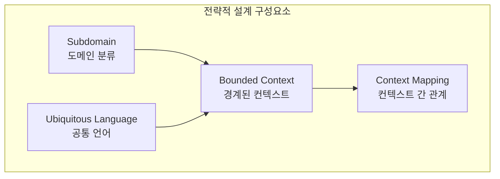

전략적 설계의 각 구성요소는 다음과 같은 질문에 답합니다. <strong>Subdomain</strong>은 "비즈니스의 핵심은 무엇인가?"라는 질문으로 도메인을 Core, Supporting, Generic으로 분류합니다. <strong>Ubiquitous Language</strong>는 "어떤 언어로 소통할 것인가?"를 정의하며 용어 사전을 산출물로 만듭니다. <strong>Bounded Context</strong>는 "시스템을 어떻게 나눌 것인가?"에 답하며 컨텍스트 경계를 명확히 합니다. 마지막으로 <strong>Context Mapping</strong>은 "시스템 간 어떻게 통합할 것인가?"를 결정하여 통합 전략을 수립합니다.

| 구성요소 | 질문 | 산출물 |
|---------|------|--------|
| **Subdomain** | 비즈니스의 핵심은 무엇인가? | 도메인 분류 |
| **Ubiquitous Language** | 어떤 언어로 소통할 것인가? | 용어 사전 |
| **Bounded Context** | 시스템을 어떻게 나눌 것인가? | 컨텍스트 경계 |
| **Context Mapping** | 시스템 간 어떻게 통합할 것인가? | 통합 전략 |

이 표는 전략적 설계를 시작할 때 반드시 답해야 할 핵심 질문들을 보여줍니다. 각 구성요소는 순차적으로 진행되기보다는 반복적으로 정제됩니다.

#### Subdomain (하위 도메인)

**개념**

비즈니스 도메인을 중요도와 특성에 따라 분류하는 것이 Subdomain입니다. 모든 비즈니스 기능이 동일한 가치를 가지는 것은 아닙니다. 어떤 기능은 회사의 핵심 경쟁력이고, 어떤 기능은 단순히 비즈니스를 지원하는 역할만 합니다. 또 어떤 기능은 어느 회사나 필요한 범용적인 것입니다. 이러한 차이를 명확히 인식하고 투자 우선순위를 결정하는 것이 Subdomain 분류의 목적입니다.

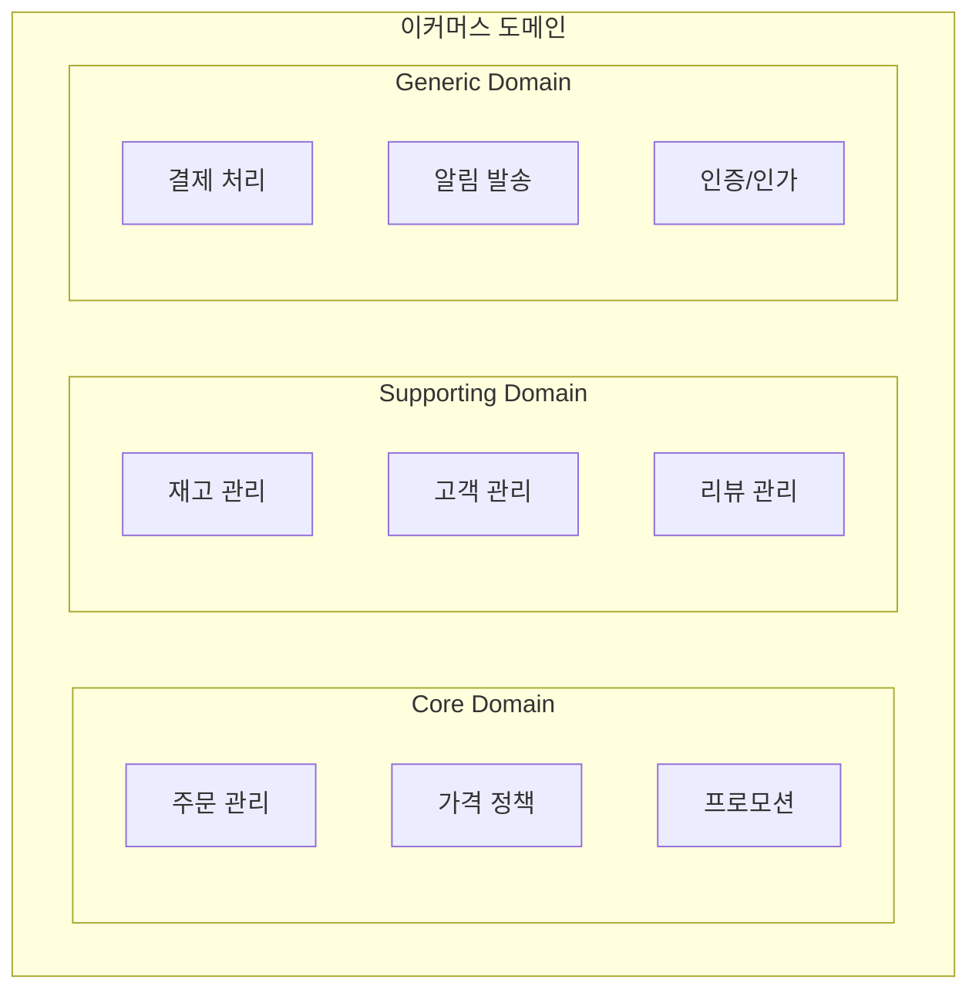

**Subdomain 유형**

Subdomain은 세 가지 유형으로 분류됩니다. <strong>Core Domain</strong>은 비즈니스의 핵심 경쟁력을 만드는 영역으로 최우선 투자가 필요하며 최고의 개발자를 배치해야 합니다. 예를 들어 배달앱의 배차 알고리즘은 Core Domain입니다. <strong>Supporting Domain</strong>은 핵심을 지원하지만 차별화 요소는 아닌 영역으로 적절한 수준의 투자가 필요합니다. 재고 관리나 고객 관리가 여기에 해당합니다. <strong>Generic Domain</strong>은 모든 비즈니스에 공통적으로 필요한 영역으로 외부 솔루션을 활용하는 것이 효율적입니다. 결제, 인증, 이메일 발송 등이 이에 속합니다.

| 유형 | 특성 | 투자 | 예시 |
|------|------|------|------|
| **Core Domain** | 비즈니스 핵심 경쟁력 | 최우선 투자, 최고의 개발자 | 배달앱의 배차 알고리즘 |
| **Supporting Domain** | 핵심을 지원하지만 차별화 아님 | 적절한 투자 | 재고 관리, 고객 관리 |
| **Generic Domain** | 모든 비즈니스에 공통 | 외부 솔루션 활용 | 결제, 인증, 이메일 |

각 유형에 따라 투자 전략과 개발 방식이 달라져야 합니다. Core Domain에는 최고의 인력과 시간을 투입하고, Generic Domain은 검증된 외부 솔루션을 활용하여 빠르게 구축하는 것이 현명합니다.

**실제 사례: 쿠팡**

실제 기업 사례로 쿠팡의 도메인 분석을 살펴보겠습니다. 쿠팡의 핵심 경쟁력은 무엇일까요? 바로 로켓배송 물류, 동적 가격 책정, 개인화 추천입니다. 이들은 Core Domain으로 분류되어 직접 개발하고 최고 인력을 투입합니다. 상품 카탈로그, 재고 관리, 판매자 관리, 리뷰 시스템은 Supporting Domain으로 자체 개발하되 실용적 수준으로 구현합니다. 결제는 PG사를 통해, 알림은 SMS/Push 서비스를, 회원 인증은 OAuth를 활용하는 등 Generic Domain은 외부 서비스를 연동합니다.

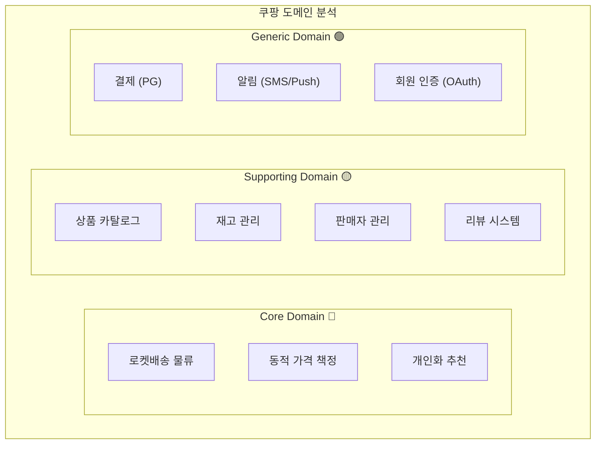

이러한 분류는 투자 결정의 기준이 됩니다. Core에는 혁신과 차별화를 위한 지속적인 투자가 이루어지고, Supporting에는 비즈니스 운영에 필요한 수준의 투자가, Generic에는 최소한의 통합 비용만 투입됩니다.

**Subdomain 식별 가이드**

어떤 기능이 어느 Subdomain에 속하는지 판단하기 어려울 때는 다음 질문들을 순서대로 확인하세요. 먼저 "이것 없이 사업이 가능한가?"를 묻습니다. 불가능하다면 Core Domain입니다. 가능하다면 다음 질문으로 넘어갑니다. "경쟁사와 차별화되는 요소인가?"에 예라면 Core Domain이고, 아니라면 마지막 질문으로 넘어갑니다. "시장에서 솔루션을 구매할 수 있는가?"에 예라면 Generic Domain이고, 아니라면 Supporting Domain입니다.

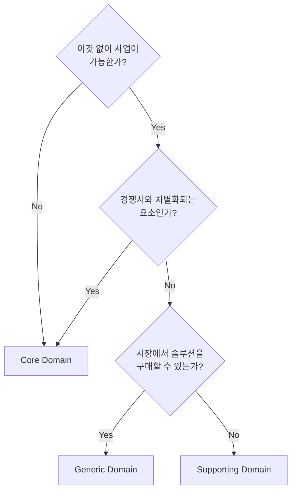

#### Ubiquitous Language (유비쿼터스 언어)

**왜 필요한가?**

개발자와 비즈니스 전문가가 서로 다른 용어를 사용하면 심각한 오해가 발생합니다. 비즈니스 팀은 "선물하기"라고 부르는데 개발자는 `gift_flag = true`로 구현하고, QA는 "선물 옵션 체크"라고 부르며, 문서에는 `giftYn` 필드라고 적혀 있다면 어떻게 될까요? 요구사항을 잘못 이해하고, 버그가 발생하며, 커뮤니케이션 비용이 기하급수적으로 증가합니다. Ubiquitous Language는 이러한 문제를 해결하기 위해 모든 이해관계자가 동일한 용어를 사용하도록 만드는 DDD의 핵심 실천법입니다.

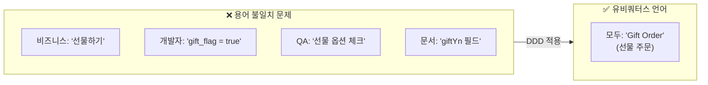

**용어 사전 작성법**

Ubiquitous Language를 체계적으로 관리하려면 용어 사전을 작성해야 합니다. 용어는 크게 세 가지로 분류됩니다. 첫째는 명사로, Entity와 Value Object를 나타냅니다. 주문(Order), 주문 항목(Order Line), 배송지(Shipping Address), 금액(Money) 등이 여기에 해당하며, 각각의 정의와 코드 표현, 동의어를 명확히 기록합니다.

**1. 명사 (Entity, Value Object)**

| 용어 | 정의 | 코드 | 동의어/오해 소지 |
|------|------|------|-----------------|
| 주문(Order) | 고객이 상품 구매를 위해 생성한 요청 | `Order` | 구매, 오더 |
| 주문 항목(Order Line) | 주문 내 개별 상품과 수량 | `OrderLine` | 주문 아이템, 상세 |
| 배송지(Shipping Address) | 상품을 받을 주소 | `ShippingAddress` | 수령지, 도착지 |
| 금액(Money) | 통화와 금액을 포함한 화폐 단위 | `Money` | 가격, 비용 |

둘째는 동사로, 행위와 Command를 나타냅니다. 주문 생성, 주문 확정, 주문 취소와 같은 비즈니스 행위를 정의하며, 각각의 선행 조건과 결과를 명시합니다. 예를 들어 "주문 확정"은 PENDING 상태일 때만 가능하며, 실행 후 CONFIRMED 상태가 되고 재고가 차감됩니다.

**2. 동사 (행위, Command)**

| 용어 | 정의 | 코드 | 선행 조건 | 결과 |
|------|------|------|----------|------|
| 주문 생성 | 새로운 주문을 만듦 | `Order.create()` | 유효한 상품, 고객 | 주문 생성됨 |
| 주문 확정 | 주문을 처리 상태로 변경 | `order.confirm()` | PENDING 상태 | CONFIRMED 상태, 재고 차감 |
| 주문 취소 | 주문을 취소 상태로 변경 | `order.cancel()` | PENDING/CONFIRMED | CANCELLED 상태, 재고 복원 |

셋째는 이벤트로, 과거에 발생한 사실을 나타냅니다. "주문 생성됨", "주문 확정됨", "주문 취소됨"과 같이 과거형으로 표현하며, 각 이벤트의 후속 처리를 정의합니다. "주문 확정됨" 이벤트가 발생하면 결제 요청과 포장 시작이 트리거됩니다.

**3. 이벤트 (과거에 발생한 사실)**

| 용어 | 정의 | 코드 | 후속 처리 |
|------|------|------|----------|
| 주문 생성됨 | 새 주문이 생성된 사실 | `OrderCreatedEvent` | 재고 예약, 알림 |
| 주문 확정됨 | 주문이 확정된 사실 | `OrderConfirmedEvent` | 결제 요청, 포장 시작 |
| 주문 취소됨 | 주문이 취소된 사실 | `OrderCancelledEvent` | 재고 복원, 환불 |

**코드에 반영하기**

Ubiquitous Language는 단순히 문서에만 존재해서는 안 됩니다. 코드에 직접 반영되어야 합니다. 잘못된 예를 먼저 보겠습니다. `OrdSvc` 클래스에 `updOrdSts` 메서드가 있고, `OrdEntity`를 `ordRepo`에서 찾아 `setSts`로 상태를 변경합니다. 이 코드는 기술 용어와 약어로 가득하여 비즈니스 의미를 전혀 파악할 수 없습니다.

올바른 예는 비즈니스 용어를 그대로 사용합니다. `OrderService`의 `confirmOrder` 메서드는 `OrderRepository`에서 `Order`를 찾아 `order.confirm()`을 호출합니다. 메서드 이름 "주문을 확정한다"가 비즈니스 의도를 명확히 드러냅니다. 마찬가지로 `cancelOrder` 메서드는 "주문을 취소한다"는 의미를 직관적으로 전달합니다.

```java
// ❌ 기술 용어, 약어 사용
public class OrdSvc {
    public void updOrdSts(Long ordId, int sts) {
        OrdEntity ord = ordRepo.findById(ordId);
        ord.setSts(sts);
        ordRepo.save(ord);
    }
}

// ✅ 비즈니스 용어 사용
public class OrderService {
    public void confirmOrder(OrderId orderId) {
        Order order = orderRepository.findById(orderId);
        order.confirm();  // "주문을 확정한다"
        orderRepository.save(order);
    }

    public void cancelOrder(OrderId orderId, CancellationReason reason) {
        Order order = orderRepository.findById(orderId);
        order.cancel(reason);  // "주문을 취소한다"
        orderRepository.save(order);
    }
}
```

**테스트에서도 동일한 언어**

Ubiquitous Language는 테스트 코드에도 동일하게 적용되어야 합니다. 테스트 이름, given-when-then 주석, 검증 메시지 모두 비즈니스 용어를 사용합니다. 아래 예시는 "주문 확정" 기능을 테스트합니다. `@DisplayName`에 "대기 중인 주문을 확정하면 상태가 CONFIRMED가 된다"라고 명시하여 비즈니스 규칙을 명확히 표현합니다. 주석도 "대기 중인 주문이 있을 때", "주문을 확정하면", "상태가 CONFIRMED가 된다"와 같이 자연어로 작성됩니다.

```java
@Nested
@DisplayName("주문 확정")
class OrderConfirmation {

    @Test
    @DisplayName("대기 중인 주문을 확정하면 상태가 CONFIRMED가 된다")
    void 대기중인_주문_확정_성공() {
        // given: 대기 중인 주문이 있을 때
        Order pendingOrder = createPendingOrder();

        // when: 주문을 확정하면
        pendingOrder.confirm();

        // then: 상태가 CONFIRMED가 된다
        assertThat(pendingOrder.getStatus()).isEqualTo(OrderStatus.CONFIRMED);
    }

    @Test
    @DisplayName("이미 확정된 주문은 다시 확정할 수 없다")
    void 이미_확정된_주문_재확정_불가() {
        // given: 이미 확정된 주문
        Order confirmedOrder = createConfirmedOrder();

        // when & then: 다시 확정하면 예외 발생
        assertThatThrownBy(() -> confirmedOrder.confirm())
            .isInstanceOf(OrderCannotBeConfirmedException.class)
            .hasMessageContaining("이미 확정된 주문");
    }
}
```

이렇게 테스트까지 Ubiquitous Language로 작성하면 테스트 자체가 살아있는 문서 역할을 합니다. 새로운 팀원은 테스트 코드를 읽는 것만으로도 비즈니스 규칙을 이해할 수 있습니다.

#### Bounded Context (경계된 컨텍스트)

**개념**

Bounded Context는 특정 도메인 모델이 적용되는 명시적 경계입니다. 같은 "고객"이라는 용어라도 판매 관점에서는 "구매자", 배송 관점에서는 "수령인", 정산 관점에서는 "결제자"로 의미가 다릅니다. Bounded Context는 이러한 차이를 인정하고 각 Context 안에서는 일관된 의미를 유지하도록 경계를 긋습니다. 이커머스 시스템을 예로 들면, 판매 Context, 재고 Context, 배송 Context, 정산 Context가 각각 독립적인 모델과 용어를 가지며 이벤트를 통해 느슨하게 결합됩니다.

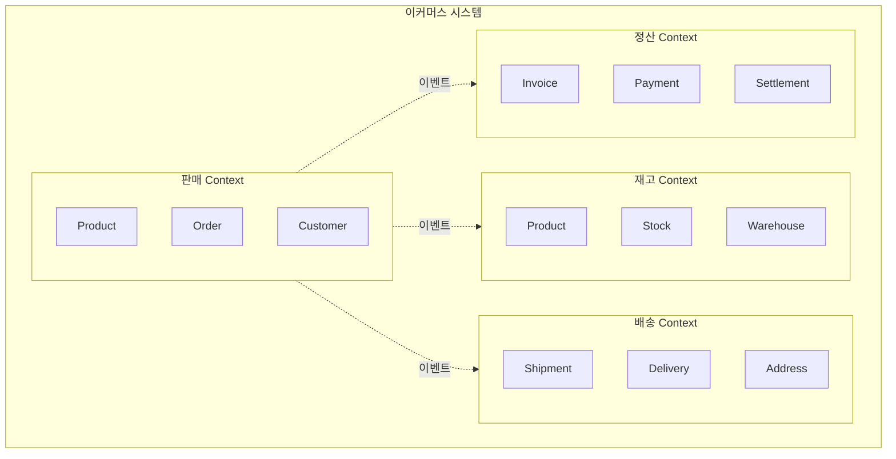

**같은 용어, 다른 의미 (동음이의어)**

"Customer"라는 용어가 각 Context에서 어떻게 다른 의미를 가지는지 구체적으로 살펴보겠습니다. 판매 Context의 Customer는 "누가 주문하는가?"에 답합니다. 회원 등급(VIP, Gold, Silver)과 사용 가능한 포인트를 가지며 `getDiscount` 메서드로 할인을 계산합니다. 배송 Context의 Customer는 Recipient로 명명되며 "누가 받는가?"에 답합니다. 전화번호, 주소, 배송 선호도(문 앞, 경비실)를 가지며 `canReceiveAt` 메서드로 특정 시간대에 수령 가능한지 확인합니다. 정산 Context의 Customer는 Payer로 명명되며 "누가 돈을 내는가?"에 답합니다. 세금 ID, 청구 주소, 결제 수단을 가지며 `requiresTaxInvoice` 메서드로 세금계산서 발급 여부를 판단합니다.

```java
// 판매 Context의 Customer
// "누가 주문하는가?"
public class Customer {
    private CustomerId id;
    private String name;
    private Email email;
    private MembershipGrade grade;  // VIP, Gold, Silver
    private Money availablePoints;

    public Money getDiscount(Order order) {
        return grade.calculateDiscount(order.getTotalAmount());
    }
}

// 배송 Context의 Customer (Recipient)
// "누가 받는가?"
public class Recipient {
    private String name;
    private PhoneNumber phone;
    private Address address;
    private DeliveryPreference preference;  // 문 앞, 경비실

    public boolean canReceiveAt(TimeSlot slot) {
        return preference.isAvailable(slot);
    }
}

// 정산 Context의 Customer (Payer)
// "누가 돈을 내는가?"
public class Payer {
    private String name;
    private TaxId taxId;
    private BillingAddress billingAddress;
    private List<PaymentMethod> paymentMethods;

    public boolean requiresTaxInvoice() {
        return taxId != null;
    }
}
```

이처럼 같은 용어가 Context마다 다른 속성과 행위를 가지는 것은 자연스러운 현상입니다. 무리하게 하나의 Customer 클래스로 통합하려 하면 모든 Context의 요구사항이 뒤섞여 복잡도가 폭발합니다.

**Bounded Context 식별 방법**

Context 경계를 식별하는 세 가지 단서가 있습니다. 첫째는 언어적 단서입니다. "고객이..."라는 표현을 들었을 때 "어떤 고객?"이라고 되묻게 된다면 Context가 다른 것입니다. 구매 고객인가, 수령인인가, 결제자인가? 마찬가지로 "상품이..."는 판매 상품인가, 재고 품목인가, 배송 물품인가? "주문이..."는 판매 주문인가, 출고 지시인가, 배송 요청인가? 이런 질문이 자연스럽게 나온다면 별도의 Bounded Context로 분리할 신호입니다.

**1. 언어적 단서**

```
"고객이..." → 어떤 고객? 구매 고객? 수령인? 결제자?
"상품이..." → 어떤 상품? 판매 상품? 재고 품목? 배송 물품?
"주문이..." → 어떤 주문? 판매 주문? 출고 지시? 배송 요청?
```

둘째는 조직적 단서입니다. Conway's Law에 따르면 "시스템 구조는 조직 구조를 따른다"고 합니다. 판매팀이 있고 물류팀이 있고 정산팀이 있다면, 자연스럽게 Sales Context, Logistics Context, Billing Context가 만들어집니다. 팀이 다르다는 것은 책임과 관심사가 다르다는 의미이며, 이는 곧 Context 경계가 될 수 있습니다.

**2. 조직적 단서**

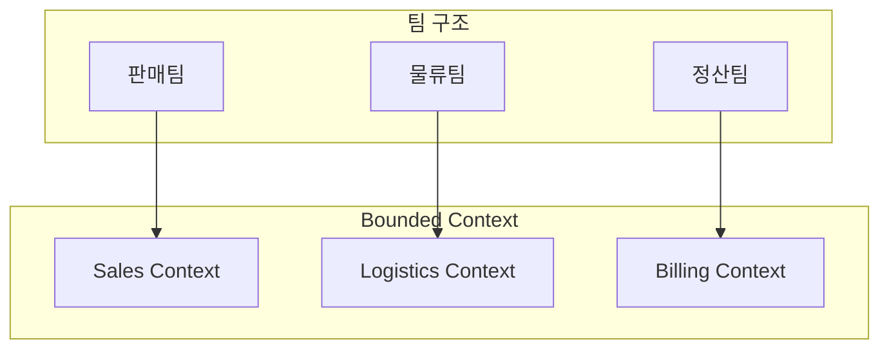

셋째는 비즈니스 프로세스 단서입니다. 주문 프로세스를 단계별로 나누면 주문 접수, 결제 처리, 출고 지시, 배송, 정산으로 구분됩니다. 각 단계는 서로 다른 책임을 가지며, 이는 Sales, Payment, Inventory, Shipping, Billing Context로 자연스럽게 매핑됩니다.

**3. 비즈니스 프로세스 단서**

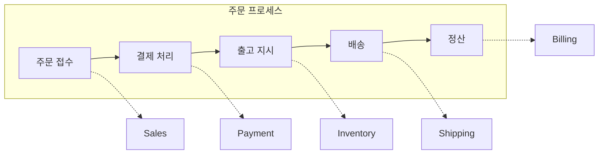

**Context 경계 결정 체크리스트**

Context 경계를 결정할 때는 다음 체크리스트를 활용하세요. 같은 Context로 묶어야 하는 경우는 강한 트랜잭션 일관성이 필요하거나, 같은 팀이 담당하거나, 같은 언어(용어)를 사용하거나, 함께 배포되어야 할 때입니다. 반대로 다른 Context로 분리해야 하는 경우는 같은 용어가 다른 의미로 사용되거나, 다른 팀이 담당하거나, 독립적으로 변경/배포할 수 있거나, 결과적 일관성으로 충분할 때입니다.

```
✅ 같은 Context로 묶어야 하는 경우:
- [ ] 강한 트랜잭션 일관성이 필요하다
- [ ] 같은 팀이 담당한다
- [ ] 같은 언어(용어)를 사용한다
- [ ] 함께 배포되어야 한다

❌ 다른 Context로 분리해야 하는 경우:
- [ ] 같은 용어가 다른 의미로 사용된다
- [ ] 다른 팀이 담당한다
- [ ] 독립적으로 변경/배포할 수 있다
- [ ] 결과적 일관성으로 충분하다
```

#### Context Mapping (컨텍스트 매핑)

**개념**

Context 간의 관계와 통합 방식을 정의하는 것이 Context Mapping입니다. 각 Context는 독립적이지만 완전히 격리되어서는 비즈니스 가치를 만들 수 없습니다. 주문 서비스는 상품 정보가 필요하고, 재고 서비스는 주문 정보가 필요합니다. 이런 관계에서 누가 공급자(Upstream)이고 누가 소비자(Downstream)인지, 어떤 패턴으로 통합할지를 명시적으로 정의하는 것이 Context Mapping입니다.

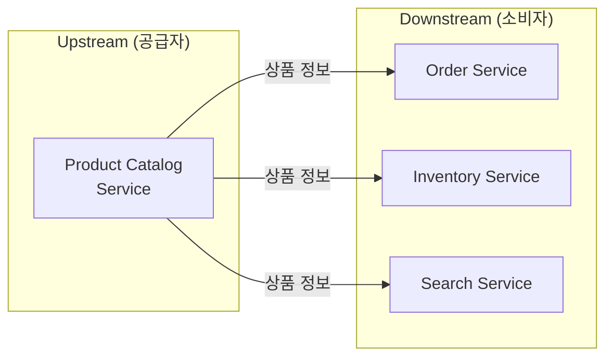

**통합 패턴 상세**

Context 간 통합에는 여러 패턴이 있으며, 각각의 특성과 적합한 상황이 다릅니다. 상황에 맞는 패턴을 선택하는 것이 중요합니다.

**1. Partnership (파트너십)**

두 팀이 긴밀하게 협력하여 통합하는 패턴입니다. 같은 제품팀 내에서 서로 다른 서비스를 담당하거나, 강한 의존 관계가 있을 때 적합합니다. 양 팀이 API 변경 시 함께 조율하고, 정기적인 통합 미팅을 가지며, 공동 테스트를 수행합니다. 주문팀과 결제팀이 주문과 결제를 동시에 개발하며 긴밀하게 협력하는 경우가 좋은 예입니다.

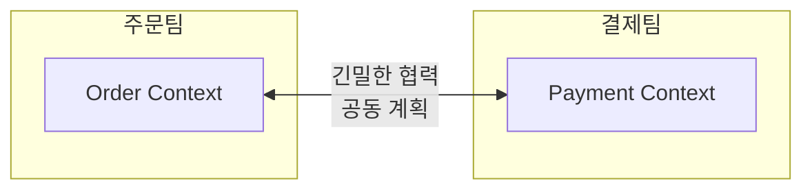

**2. Shared Kernel (공유 커널)**

두 Context가 일부 모델을 공유하는 패턴입니다. Money나 Address처럼 정말 동일한 개념이고 변경이 드문 안정적인 모델에 적합합니다. 장점은 중복 제거와 일관성이지만, 단점은 변경 시 양쪽에 영향을 주어 결합도가 증가한다는 것입니다. 아래 예시처럼 `shared-kernel` 모듈을 별도로 만들어 Money와 Address를 공유하면, Order Context와 Payment Context 모두 동일한 금액 계산 로직을 사용할 수 있습니다.

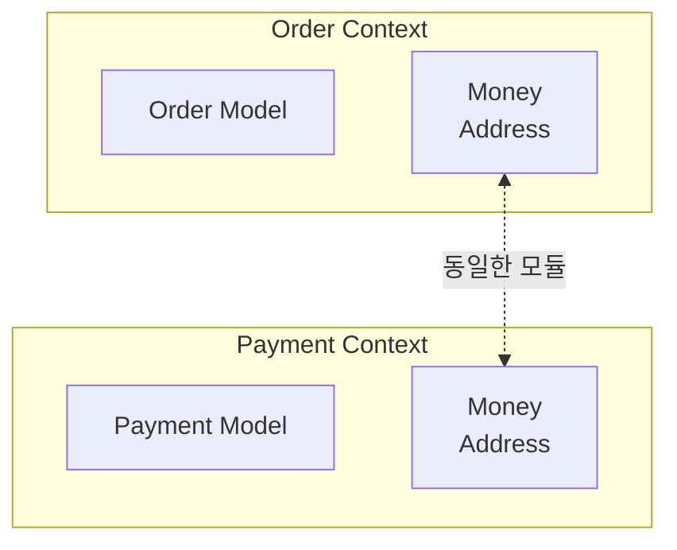

```java
// shared-kernel 모듈
public record Money(BigDecimal amount, Currency currency) {
    public Money add(Money other) {
        validateSameCurrency(other);
        return new Money(this.amount.add(other.amount), this.currency);
    }
}

public record Address(String zipCode, String city, String street, String detail) {
    public String fullAddress() {
        return String.format("(%s) %s %s %s", zipCode, city, street, detail);
    }
}
```

**3. Customer-Supplier (고객-공급자)**

Upstream이 API를 제공하고 Downstream이 소비하는 가장 일반적인 패턴입니다. Upstream이 API 설계 주도권을 가지며, Downstream은 API에 맞춰 구현합니다. Upstream은 API를 제공하고 변경 시 Downstream에 통보하며, Downstream은 API를 소비하고 요구사항을 전달합니다. 아래 예시에서 Order Service(Downstream)는 Product Service(Upstream)의 API를 Feign Client로 호출하여 상품 정보를 조회하고, 이를 자신의 도메인 모델(OrderLine)로 변환합니다.

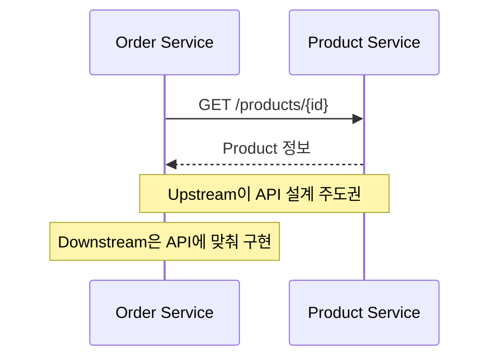

```java
// Downstream: Product Service Client
@FeignClient(name = "product-service")
public interface ProductServiceClient {

    @GetMapping("/products/{id}")
    ProductResponse getProduct(@PathVariable String id);

    @GetMapping("/products")
    List<ProductResponse> getProducts(@RequestParam List<String> ids);
}

// Downstream에서 사용
@Service
public class OrderService {
    private final ProductServiceClient productClient;

    public Order createOrder(CreateOrderCommand command) {
        // Upstream에서 상품 정보 조회
        ProductResponse product = productClient.getProduct(command.getProductId());

        // Downstream 모델로 변환하여 사용
        OrderLine orderLine = OrderLine.create(
            ProductId.of(product.id()),
            product.name(),
            Money.of(product.price()),
            command.getQuantity()
        );

        return Order.create(command.getCustomerId(), List.of(orderLine));
    }
}
```

**4. Conformist (순응자)**

Downstream이 Upstream 모델을 그대로 따르는 패턴입니다. 외부 시스템이나 레거시 시스템처럼 변경할 수 없는 Upstream과 통합할 때, 혹은 협상력이 없거나 간단한 통합에 적합합니다. Upstream 모델을 변환 없이 사용하므로 구현은 간단하지만, Upstream 변경에 종속되는 단점이 있습니다.

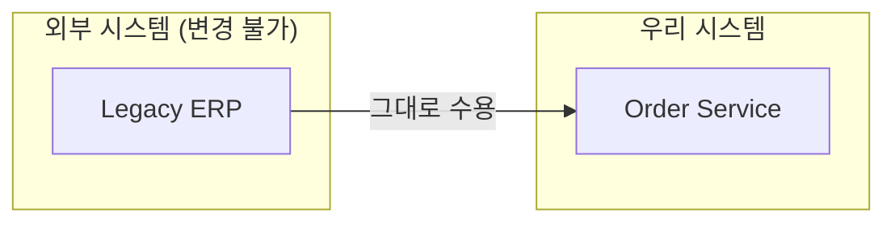

**5. Anti-Corruption Layer (부패 방지 계층)**

외부 모델이 내부를 오염시키지 않도록 번역 계층을 두는 패턴입니다. 레거시 시스템이나 복잡하고 일관성 없는 외부 API와 통합할 때 필수적입니다. Anti-Corruption Layer는 Translator(데이터 변환), Adapter(인터페이스 적응), Facade(단순화)로 구성됩니다. 아래 예시에서 레거시 시스템은 `ord_no`, `sts_cd`, `cust_nm` 같은 약어와 매직 넘버를 사용하지만, ACL이 이를 깨끗한 도메인 모델(Order, OrderStatus, ShippingAddress)로 변환합니다. 장점은 내부 모델을 보호하고 레거시 변경에 격리되지만, 추가 복잡성과 성능 오버헤드가 단점입니다.

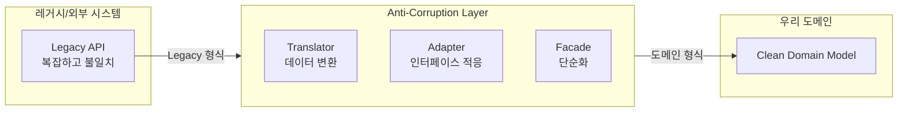

```java
// 레거시 시스템의 응답 (변경 불가)
public class LegacyOrderResponse {
    private String ord_no;           // 다른 네이밍
    private int sts_cd;              // 매직 넘버 (0=대기, 1=확정, 9=취소)
    private String cust_nm;          // 약어
    private long ord_amt;            // 원 단위 숫자
    private String dlv_addr1;        // 주소1
    private String dlv_addr2;        // 주소2
    private String rcv_nm;           // 수령인
    private String rcv_tel;          // 전화번호
}

// Anti-Corruption Layer: Translator
@Component
public class LegacyOrderTranslator {

    public Order translate(LegacyOrderResponse legacy) {
        return Order.reconstitute(
            OrderId.of(legacy.getOrd_no()),
            translateStatus(legacy.getSts_cd()),
            translateCustomer(legacy),
            translateShippingAddress(legacy),
            Money.won(legacy.getOrd_amt())
        );
    }

    private OrderStatus translateStatus(int statusCode) {
        return switch (statusCode) {
            case 0 -> OrderStatus.PENDING;
            case 1 -> OrderStatus.CONFIRMED;
            case 2 -> OrderStatus.SHIPPED;
            case 3 -> OrderStatus.DELIVERED;
            case 9 -> OrderStatus.CANCELLED;
            default -> throw new UnknownLegacyStatusException(statusCode);
        };
    }

    private ShippingAddress translateShippingAddress(LegacyOrderResponse legacy) {
        return new ShippingAddress(
            extractZipCode(legacy.getDlv_addr1()),
            extractCity(legacy.getDlv_addr1()),
            legacy.getDlv_addr1(),
            legacy.getDlv_addr2(),
            legacy.getRcv_nm(),
            formatPhoneNumber(legacy.getRcv_tel())
        );
    }
}

// Adapter: Repository 구현
@Repository
public class LegacyOrderAdapter implements OrderReader {
    private final LegacyOrderClient legacyClient;
    private final LegacyOrderTranslator translator;

    @Override
    public Optional<Order> findById(OrderId id) {
        try {
            LegacyOrderResponse response = legacyClient.getOrder(id.getValue());
            return Optional.of(translator.translate(response));
        } catch (LegacyNotFoundException e) {
            return Optional.empty();
        }
    }
}
```

**6. Open Host Service + Published Language**

표준화된 API와 데이터 형식으로 통합하는 패턴입니다. 하나의 Upstream(Provider)이 다수의 Downstream(Consumer)에게 서비스를 제공할 때 적합합니다. Open Host Service는 공개된 REST API를, Published Language는 표준화된 JSON Schema나 Protocol Buffer를 의미합니다. 아래 예시처럼 `OrderConfirmedEvent`를 JSON Schema로 정의하면, Order Service, Search Service, Analytics Service, 외부 파트너 등 누구나 동일한 형식으로 이벤트를 소비할 수 있습니다.

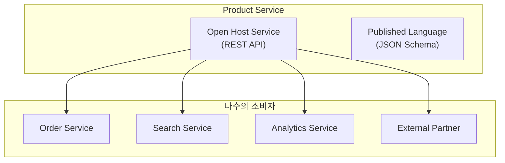

```json
// Published Language: 표준화된 이벤트 스키마
{
  "$schema": "https://json-schema.org/draft/2020-12/schema",
  "title": "OrderConfirmedEvent",
  "type": "object",
  "properties": {
    "eventId": { "type": "string", "format": "uuid" },
    "eventType": { "const": "ORDER_CONFIRMED" },
    "occurredAt": { "type": "string", "format": "date-time" },
    "payload": {
      "type": "object",
      "properties": {
        "orderId": { "type": "string" },
        "customerId": { "type": "string" },
        "totalAmount": {
          "type": "object",
          "properties": {
            "amount": { "type": "number" },
            "currency": { "type": "string" }
          }
        },
        "orderLines": {
          "type": "array",
          "items": {
            "type": "object",
            "properties": {
              "productId": { "type": "string" },
              "quantity": { "type": "integer" }
            }
          }
        }
      }
    }
  }
}
```

**7. Separate Ways (분리된 길)**

통합하지 않고 각자 구현하는 패턴입니다. 통합 비용이 중복 비용보다 크거나, 간단한 기능이거나, 서로 다른 요구사항을 가질 때 적합합니다. 무리하게 통합하려다 복잡도만 증가하는 것보다, 각자 독립적으로 구현하는 것이 나을 때가 있습니다.

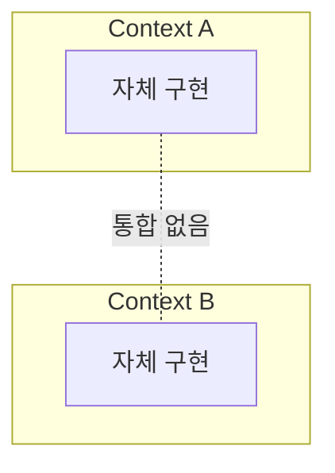

**Context Map 예시: 이커머스**

실제 이커머스 시스템의 전체 Context Map을 보겠습니다. Core Domain에는 주문과 가격 정책이, Supporting Domain에는 상품 카탈로그, 재고, 배송, 회원이, Generic Domain에는 결제(외부 PG), 알림(외부 서비스), 인증(OAuth)이 있습니다. Order와 Catalog는 Customer-Supplier 관계로, Order 생성 시 상품 정보를 조회합니다. Order와 Inventory도 Customer-Supplier 관계로, Order 확정 시 재고 확인/차감을 요청합니다. Order와 Payment는 외부 PG 연동이므로 ACL로 보호합니다. Order와 Shipping, Order와 Notification은 Published Language(이벤트)로 느슨하게 통합합니다. Price와 Order는 가격 계산 로직을 공유하므로 Shared Kernel 관계입니다.

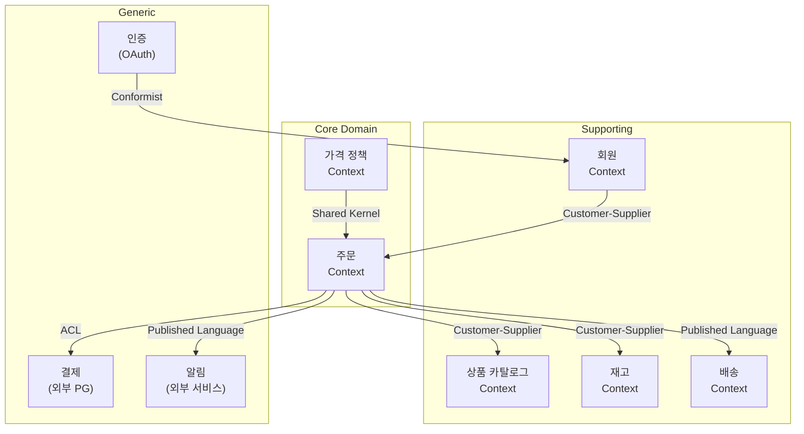

각 관계는 다음과 같은 의미를 가집니다. ORDER → CATALOG는 주문 생성 시 상품 정보를 조회하는 관계입니다. ORDER → INV는 주문 확정 시 재고를 확인하고 차감 요청하는 관계입니다. ORDER → PAY는 외부 PG 연동으로 ACL로 보호합니다. ORDER → SHIP, NOTI는 이벤트 기반 느슨한 통합입니다. PRICE ↔ ORDER는 가격 계산 로직을 공유하는 Shared Kernel 관계입니다.

| 관계 | 설명 |
|------|------|
| **ORDER → CATALOG** | 주문 생성 시 상품 정보 조회 |
| **ORDER → INV** | 주문 확정 시 재고 확인/차감 요청 |
| **ORDER → PAY** | 외부 PG 연동, ACL로 보호 |
| **ORDER → SHIP, NOTI** | 이벤트 기반 느슨한 통합 |
| **PRICE ↔ ORDER** | 가격 계산 로직 공유 (Shared Kernel) |

#### EventStorming으로 전략적 설계

**EventStorming이란?**

EventStorming은 Alberto Brandolini가 고안한 **협업 기반 도메인 탐색 워크숍** 기법입니다. 도메인 전문가와 개발자가 넓은 벽 앞에 모여, 색깔별 포스트잇을 붙여가며 비즈니스 프로세스를 시각화합니다.


전통적인 요구사항 분석은 문서 작성자(주로 개발자)의 기술적 편향이 개입되기 쉽습니다. EventStorming은 **도메인 전문가가 주도적으로 참여**할 수 있는 구조를 제공하여, 비즈니스 현실에 가까운 모델을 도출합니다. 특히 DDD에서 가장 어려운 단계인 **Bounded Context 경계 식별**을 자연스럽게 이끌어내는 것이 핵심 가치입니다.


##### 핵심 구성 요소 — 왜 이렇게 나누는가?

EventStorming에서 사용하는 각 포스트잇 색상은 단순한 분류가 아니라, **비즈니스 프로세스를 이해하기 위한 서로 다른 관점**을 나타냅니다. 각 요소가 존재하는 이유를 이해하면 워크숍을 더 효과적으로 진행할 수 있습니다.

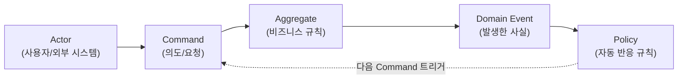

**1. Domain Event (주황색 포스트잇) — "무슨 일이 일어났는가?"**

Domain Event는 비즈니스에서 **이미 일어난 사실**을 나타냅니다. "주문이 생성됨", "결제가 완료됨", "재고가 차감됨"처럼 **과거형**으로 작성합니다.

왜 이벤트부터 시작하는가?

- **사실은 논쟁의 여지가 적습니다.** "주문이 생성된다"는 것은 도메인 전문가와 개발자 모두 동의할 수 있는 사실입니다. 반면 "주문 클래스의 create 메서드를 호출한다"는 기술적 구현이고, 도메인 전문가는 이해하기 어렵습니다.
- **비즈니스 프로세스의 뼈대가 드러납니다.** 이벤트를 시간순으로 나열하면, 비즈니스가 어떤 흐름으로 돌아가는지 한눈에 보입니다.
- **도메인 전문가가 주도할 수 있습니다.** 기술 용어 없이 "무슨 일이 일어나나요?"라는 질문만으로 도메인 지식을 끌어낼 수 있습니다.

**2. Command (파란색 포스트잇) — "누가, 왜 이 일을 일으켰는가?"**

Command는 이벤트의 **원인**입니다. 누군가의 **의도적인 행위**를 나타냅니다. "주문 생성 요청", "결제 처리 요청"처럼 **명령형**으로 작성합니다.

왜 Command를 별도로 식별하는가?

- **의도와 결과를 분리**할 수 있습니다. "주문 생성 요청"(Command)이 항상 "주문 생성됨"(Event)으로 이어지는 것은 아닙니다. 재고 부족, 결제 실패 등으로 거절될 수 있습니다. 이 분리가 비즈니스 규칙을 드러냅니다.
- **Actor(행위자)가 명확해집니다.** 이 Command를 누가 실행하는지(고객? 관리자? 시스템?)를 파악하면, 역할과 권한 구조가 보입니다.

**3. Aggregate (노란색 포스트잇) — "어떤 데이터와 규칙이 이 결정을 내리는가?"**

Aggregate는 Command를 받아들여 **비즈니스 규칙을 검증**하고, 그 결과로 Event를 발생시키는 **의사결정 주체**입니다.

왜 Aggregate를 식별하는가?

- **일관성 경계가 드러납니다.** "주문 생성" Command를 처리하려면 어떤 데이터가 필요한지(주문 항목, 고객 정보, 가격 정보 등)를 파악하면, 하나의 트랜잭션으로 묶어야 할 범위가 보입니다.
- **비즈니스 규칙의 위치가 결정됩니다.** "최소 주문 금액 10,000원"이라는 규칙은 어디에 있어야 하는가? Order Aggregate 안에 있어야 합니다. 규칙이 어떤 데이터에 의존하는지를 보면, 해당 규칙이 어느 Aggregate에 속하는지 자연스럽게 결정됩니다.

**4. Policy (보라색/라일락 포스트잇) — "이 이벤트에 자동으로 반응해야 하는 것은?"**

Policy는 **"~하면, ~한다"** 형태의 자동 반응 규칙입니다. Event가 발생했을 때 자동으로 실행되어야 하는 후속 처리를 나타냅니다.

왜 Policy를 별도로 식별하는가?

- **프로세스 간의 연결 고리가 보입니다.** "주문이 확정되면 → 재고를 차감한다"는 Policy가 Order Context와 Inventory Context를 연결합니다. 이 연결 패턴이 Context Mapping의 근거가 됩니다.
- **동기/비동기 결정의 단서가 됩니다.** Policy로 연결된 프로세스는 종종 비동기(이벤트 기반)로 처리하는 것이 자연스럽습니다. 이는 시스템 아키텍처 결정에 직접 영향을 줍니다.
- **자동화 범위가 명확해집니다.** 어떤 반응이 자동이고, 어떤 반응이 사람의 판단을 필요로 하는지 구분할 수 있습니다.

**5. 기타 요소**

| 요소 | 색상 | 역할 |
|------|------|------|
| **Read Model** | 초록색 | 사용자가 의사결정을 위해 참고하는 정보 (예: 주문 목록 화면) |
| **External System** | 분홍색 | 우리 시스템 외부의 서비스 (예: PG사 결제 API) |
| **Hot Spot** | 빨간색 | 논쟁, 미해결 질문, 병목 지점 — 추가 논의가 필요한 부분 |

##### EventStorming 진행 순서 — 어떤 순서로, 왜 이렇게 하는가?

EventStorming은 **점진적으로 구체화**하는 과정입니다. 큰 그림에서 시작해서 세부 구조로 좁혀갑니다.

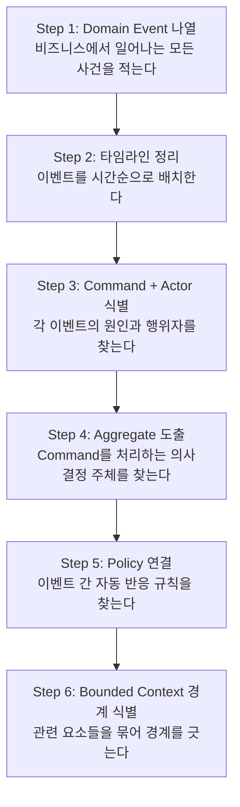

**Step 1. Domain Event 나열 — "무슨 일이 일어나나요?"**

가장 먼저 비즈니스에서 일어나는 **모든 사건**을 주황색 포스트잇에 적어 벽에 붙입니다. 이 단계에서는 순서나 구조를 신경 쓰지 않습니다. 양이 중요합니다. 도메인 전문가에게 "고객이 처음 방문해서 상품을 받기까지 어떤 일들이 일어나나요?"와 같이 질문합니다.

> 예시: "주문 생성됨", "결제 완료됨", "재고 차감됨", "배송 시작됨", "상품 검색됨", "장바구니에 추가됨" ...

**Step 2. 타임라인 정리 — 시간축으로 배치**

흩어져 있는 이벤트들을 **왼쪽(과거)에서 오른쪽(미래)** 방향으로 시간순 배치합니다. 이 과정에서 빠진 이벤트가 발견되고, 중복된 이벤트가 통합됩니다. "이 다음에는 무슨 일이 일어나나요?"라고 질문하며 흐름을 완성합니다.

> 의견이 갈리거나 불확실한 부분에는 **빨간색 Hot Spot** 포스트잇을 붙여 나중에 논의합니다.

**Step 3. Command + Actor 식별 — "누가 이 일을 일으켰나요?"**

각 이벤트 앞에 **파란색 Command** 포스트잇을 붙입니다. "주문 생성됨" 이벤트 앞에는 "주문 생성 요청" Command가 옵니다. 그리고 이 Command를 실행하는 Actor(고객, 관리자, 타이머 등)를 함께 표시합니다.

이 단계에서 **의도와 결과의 차이**가 드러납니다. "모든 주문 요청이 성공하나요?"라는 질문이 비즈니스 규칙을 끌어냅니다.

**Step 4. Aggregate 도출 — "어떤 것이 이 결정을 내리나요?"**

Command와 Event 사이에 **노란색 Aggregate** 포스트잇을 배치합니다. "주문 생성 요청" Command를 받아서 규칙을 검증하고 "주문 생성됨" Event를 발생시키는 주체가 **Order Aggregate**입니다.

이 단계에서 **데이터 소유권**이 명확해집니다. 같은 Aggregate에 속하는 데이터는 반드시 함께 변경되어야 하는 단위입니다.

**Step 5. Policy 연결 — "이 일이 일어나면, 자동으로 무엇을 해야 하나요?"**

이벤트와 이벤트 사이를 **보라색 Policy** 포스트잇으로 연결합니다. "주문 확정됨" 이벤트 뒤에 "주문이 확정되면 재고를 차감한다"는 Policy를 놓고, 이 Policy가 "재고 차감 요청" Command를 트리거하도록 합니다.

이 단계에서 **Context 간의 의존 관계**가 선명하게 드러납니다. Policy로 연결된 흐름이 서로 다른 Aggregate를 오가면, 그것이 곧 Bounded Context 경계의 후보입니다.

**Step 6. Bounded Context 경계 식별 — "어디서 끊어야 하는가?"**

마지막으로 벽 위의 포스트잇 군집을 살펴봅니다. **같은 Ubiquitous Language를 사용하는 요소들**을 하나의 경계로 묶습니다. 경계를 긋는 핵심 기준:

- **같은 용어가 다른 의미로 쓰이는 곳** → 경계를 나눕니다 (예: "상품"이 주문에서는 주문 항목이고, 카탈로그에서는 상품 정보)
- **Policy로 연결된 서로 다른 Aggregate 그룹** → 별도 Context 후보입니다
- **서로 다른 도메인 전문가가 관리하는 영역** → 조직 구조와 일치하는 경계

##### EventStorming 결과물 예시

다음은 전자상거래 도메인에서 EventStorming을 진행한 결과를 구조화한 예시입니다. Order Context 내부의 흐름과 Inventory Context로의 이벤트 전파를 보여줍니다.

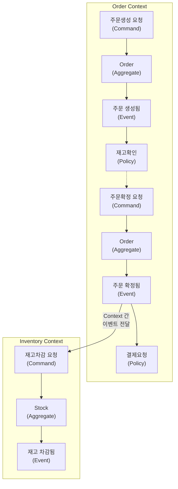

| 단계 | 요소 | 예시 | 설명 |
|------|------|------|------|
| Command | 파란색 | 주문생성 요청 | 고객(Actor)이 시스템에 전달한 의도 |
| Aggregate | 노란색 | Order | Command를 받아 비즈니스 규칙을 검증하는 주체 |
| Event | 주황색 | 주문 생성됨 | 규칙 검증을 통과한 뒤 발생한 사실 |
| Policy | 보라색 | 재고확인 | "주문이 생성되면 재고를 확인한다"는 자동 반응 |
| Context 경계 | — | Order ↔ Inventory | Policy가 다른 Aggregate를 트리거하는 지점 |

이런 결과물은 그대로 코드로 전환할 수 있는 설계 청사진이 됩니다. Command는 API 엔드포인트나 메시지 핸들러로, Aggregate는 도메인 객체로, Event는 Kafka 메시지로, Policy는 이벤트 리스너로 매핑됩니다.

#### 핵심 요약


| 개념 | 질문 | 핵심 활동 |
|------|------|----------|
| **Subdomain** | 어디에 투자할까? | Core/Supporting/Generic 분류 |
| **Ubiquitous Language** | 어떻게 소통할까? | 용어 사전 작성, 코드에 반영 |
| **Bounded Context** | 어디까지 같은 모델? | 동음이의어 발견 → 경계 설정 |
| **Context Mapping** | 어떻게 협력할까? | ACL, Customer-Supplier 등 패턴 선택 |

**기억할 것:**
- Core Domain에 최고의 인력과 시간 투입
- 같은 용어가 다른 의미로 쓰이면 Context 분리 신호
- Context 간 통합은 느슨하게 (이벤트 기반 권장)


#### 다음 단계

- [전술적 설계]() - Entity, Value Object, Aggregate 패턴
- [아키텍처]() - Hexagonal, Clean Architecture
