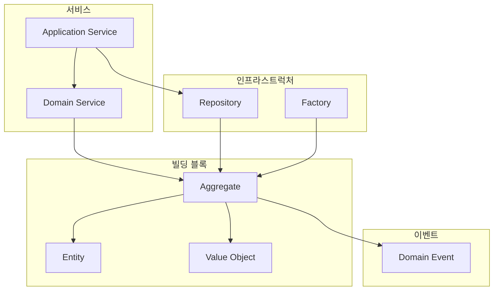
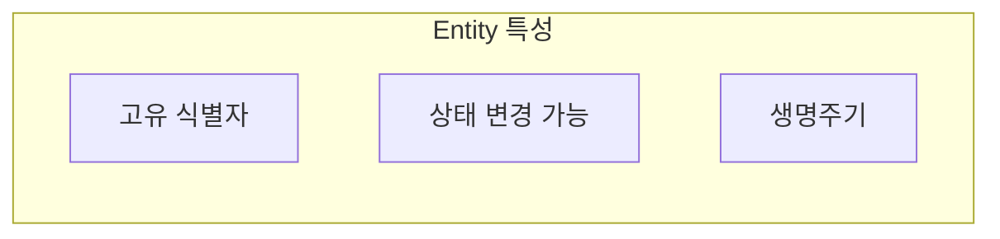
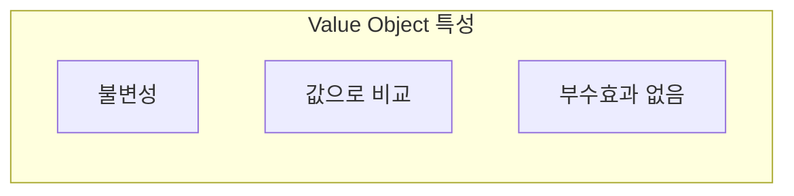
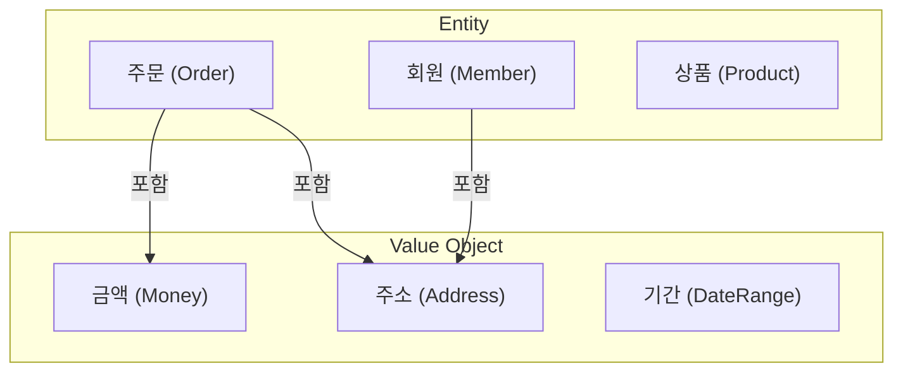
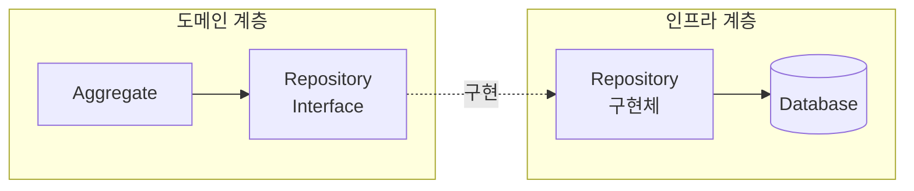
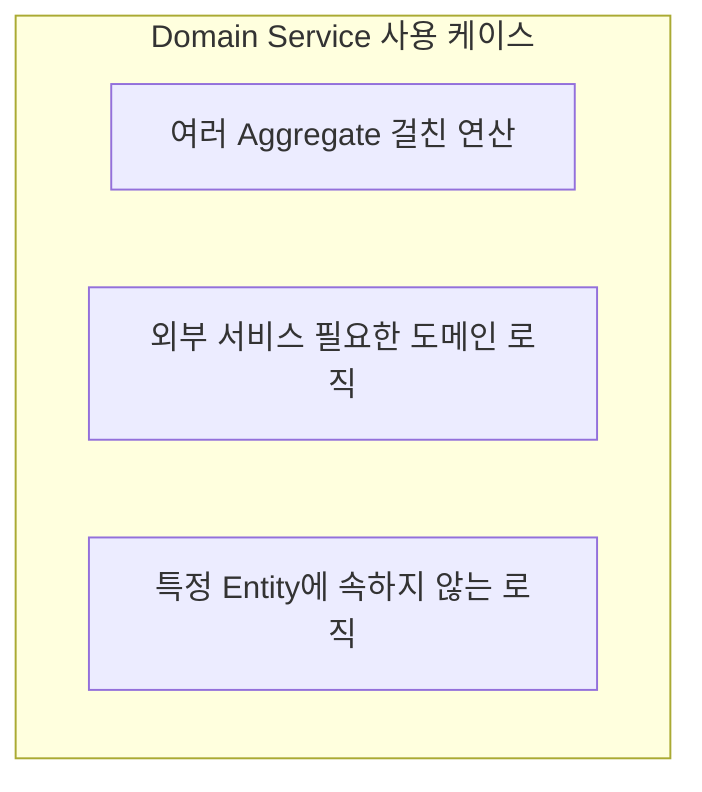
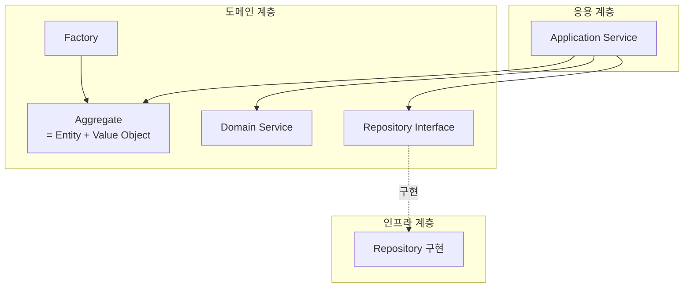

> **대상 독자**: DDD 빌딩 블록을 코드로 구현하고 싶은 백엔드 개발자
> **선수 지식**: [전략적 설계](strategic-design/)를 읽었거나 Bounded Context 개념에 대한 이해
> **소요 시간**: 약 40분
> **핵심 질문**: "도메인 모델을 어떤 패턴으로 구현해야 하는가?"


전술적 설계 빌딩 블록: <strong>Entity</strong>(식별자로 구분) + <strong>Value Object</strong>(값으로 구분) → <strong>Aggregate</strong>(일관성 경계) + <strong>Repository</strong>(영속화) + <strong>Domain Service</strong>(도메인 로직) + <strong>Domain Event</strong>(이벤트 통신)


도메인 모델을 구체적으로 구현하기 위한 패턴들이 바로 전술적 설계입니다. 전략적 설계가 "큰 그림"을 그리는 것이라면, 전술적 설계는 "구체적인 구현 방법"을 제시합니다.


전술적 설계의 빌딩 블록은 <strong>레고 블록</strong>과 같습니다:

| 레고 블록 | DDD 빌딩 블록 | 특징 |
|----------|--------------|------|
| **고유 번호가 있는 특수 블록** | Entity | 식별자로 구분, 상태 변경 가능 |
| **색깔/모양만 있는 일반 블록** | Value Object | 값으로 비교, 교체 가능 |
| **설명서에 따라 조립한 세트** | Aggregate | 함께 변경되는 블록들의 묶음 |
| **블록 보관함** | Repository | 조립한 세트를 저장/조회 |
| **조립 도우미** | Domain Service | 여러 세트를 조합하는 로직 |

레고 세트를 분해하지 않고 통째로 보관함에 넣듯, <strong>Aggregate는 통째로 저장합니다.</strong>


> **이 페이지 예제의 공통 import:**
> ```java
> import java.util.*;
> import java.time.LocalDateTime;
> import java.math.BigDecimal;
> ```

#### 전술적 설계 요소 개요

전술적 설계는 여러 빌딩 블록으로 구성됩니다. Entity와 Value Object가 도메인 객체의 기본 단위이고, Aggregate가 이들을 일관성 경계로 묶습니다. Domain Service와 Application Service는 비즈니스 로직을 조율하며, Repository와 Factory는 객체의 생명주기를 관리합니다. Domain Event는 Aggregate 간 통신을 담당합니다. 이 구성요소들이 함께 동작하여 복잡한 도메인 로직을 명확하게 표현합니다.



*전술적 설계의 빌딩 블록(Entity, VO, Aggregate), 서비스(Domain/Application), 인프라(Repository, Factory), 이벤트 간의 관계입니다.*

#### Entity (엔티티)

**정의**

Entity는 식별자(Identity)로 구분되는 도메인 객체입니다. 주문번호나 회원ID처럼 고유한 식별자를 가지며, 속성이 변경되더라도 식별자가 같으면 동일한 객체로 취급됩니다. Entity의 핵심은 Identity, Mutability, Lifecycle 세 가지 특성입니다.



*Entity의 세 가지 핵심 특성인 고유 식별자, 상태 변경 가능, 생명주기를 보여줍니다.*

Entity의 특징을 구체적으로 살펴보겠습니다. <strong>Identity</strong>는 고유 식별자로 구분되는 특성입니다. 주문번호나 회원ID가 대표적인 예입니다. <strong>Mutability</strong>는 상태가 변경될 수 있다는 특성입니다. 예를 들어 주문 상태가 PENDING에서 CONFIRMED로 변경됩니다. <strong>Lifecycle</strong>은 생성, 변경, 소멸의 생명주기를 가진다는 특성입니다. 회원 가입, 활동, 탈퇴의 과정이 여기에 해당합니다.

| 특성 | 설명 | 예시 |
|------|------|------|
| **Identity** | 고유 식별자로 구분 | 주문번호, 회원ID |
| **Mutability** | 상태가 변경될 수 있음 | 주문 상태: PENDING → CONFIRMED |
| **Lifecycle** | 생성, 변경, 소멸의 생명주기 | 회원 가입 → 활동 → 탈퇴 |

**구현 예시**

다음은 Order Entity의 구현 예시입니다. `id` 필드는 불변(final)이므로 한 번 설정되면 변경할 수 없습니다. 반면 `status`와 `shippingAddress`는 가변이므로 비즈니스 규칙에 따라 변경될 수 있습니다. `equals`와 `hashCode` 메서드는 ID만으로 동등성을 비교합니다. 같은 ID를 가진 Order는 다른 속성이 달라도 동일한 객체로 취급됩니다. `confirm`과 `changeShippingAddress` 같은 비즈니스 행위는 메서드로 표현됩니다. 단순히 setter를 호출하는 것이 아니라, 유효성 검증과 도메인 이벤트 발행을 함께 수행합니다.

```java
public class Order {
    private final OrderId id;  // Identity - 불변
    private OrderStatus status;  // 상태 - 가변
    private final CustomerId customerId;
    private ShippingAddress shippingAddress;  // 변경 가능
    private final List<OrderLine> orderLines;
    private final LocalDateTime createdAt;

    // 식별자 기반 동등성
    @Override
    public boolean equals(Object o) {
        if (this == o) return true;
        if (!(o instanceof Order order)) return false;
        return id.equals(order.id);  // ID만으로 비교
    }

    @Override
    public int hashCode() {
        return Objects.hash(id);
    }

    // 비즈니스 행위
    public void confirm() {
        validateConfirmable();
        this.status = OrderStatus.CONFIRMED;
        registerEvent(new OrderConfirmedEvent(this.id));
    }

    public void changeShippingAddress(ShippingAddress newAddress) {
        validateAddressChangeable();
        this.shippingAddress = newAddress;
        registerEvent(new ShippingAddressChangedEvent(this.id, newAddress));
    }

    private void validateConfirmable() {
        if (this.status != OrderStatus.PENDING) {
            throw new IllegalOrderStateException(
                "주문 상태가 PENDING일 때만 확정할 수 있습니다. 현재: " + this.status
            );
        }
    }
}
```

**식별자 설계**

Entity의 식별자는 단순한 String이나 Long보다 도메인 식별자 타입을 사용하는 것이 좋습니다. 아래 예시의 `OrderId`는 Java Record로 구현되어 불변성을 보장합니다. 생성자에서 null 체크와 빈 값 검증을 수행하여 유효하지 않은 ID가 생성되는 것을 막습니다. `generate` 정적 메서드는 새로운 ID를 생성하고, `of` 정적 메서드는 기존 값으로 ID를 복원합니다.

```java
// ✅ 도메인 식별자 (권장)
public record OrderId(String value) {
    public OrderId {
        Objects.requireNonNull(value, "OrderId는 null일 수 없습니다");
        if (value.isBlank()) {
            throw new IllegalArgumentException("OrderId는 빈 값일 수 없습니다");
        }
    }

    public static OrderId generate() {
        return new OrderId("ORD-" + UUID.randomUUID().toString().substring(0, 8));
    }

    public static OrderId of(String value) {
        return new OrderId(value);
    }
}

// 사용
Order order = new Order(OrderId.generate(), customerId, orderLines);
```

#### Value Object (값 객체)

**정의**

Value Object는 속성 값으로 동등성이 결정되는 불변 객체입니다. Entity가 식별자로 구분된다면, Value Object는 값 자체로 구분됩니다. Money의 1000원과 또 다른 1000원은 별개의 객체지만 같은 값을 가지므로 동일하게 취급됩니다.



*Value Object의 세 가지 핵심 특성인 불변성, 값으로 비교, 부수효과 없음을 보여줍니다.*

Value Object의 특징을 정리하면 다음과 같습니다. <strong>Immutability</strong>는 생성 후 변경할 수 없다는 특성입니다. Money(1000, KRW)를 생성한 후에는 금액이나 통화를 바꿀 수 없습니다. <strong>Value Equality</strong>는 모든 속성이 같으면 같은 객체로 취급된다는 특성입니다. 1000원과 1000원은 동일합니다. <strong>Self-Contained</strong>는 자체적으로 유효성을 검증한다는 특성입니다. 음수 금액은 생성 시점에 거부됩니다.

| 특성 | 설명 | 예시 |
|------|------|------|
| **Immutability** | 생성 후 변경 불가 | Money(1000, KRW) |
| **Value Equality** | 모든 속성이 같으면 같은 객체 | 1000원 == 1000원 |
| **Self-Contained** | 자체적으로 유효성 검증 | 금액은 음수 불가 |

**구현 예시**

Money Value Object 구현을 살펴보겠습니다. Java Record를 사용하여 불변성을 자동으로 보장받습니다. Compact Constructor에서 유효성을 검증합니다. 금액이 null이거나 음수이면 예외를 던집니다. `won` 같은 팩토리 메서드로 편리하게 객체를 생성할 수 있습니다. `add`와 `multiply` 같은 연산은 원본을 변경하지 않고 새로운 객체를 반환합니다. 이것이 불변 연산의 핵심입니다.

```java
// Money Value Object
public record Money(BigDecimal amount, Currency currency) {

    // 생성 시 유효성 검증
    public Money {
        Objects.requireNonNull(amount, "금액은 필수입니다");
        Objects.requireNonNull(currency, "통화는 필수입니다");
        if (amount.compareTo(BigDecimal.ZERO) < 0) {
            throw new IllegalArgumentException("금액은 0 이상이어야 합니다");
        }
    }

    // 팩토리 메서드
    public static Money won(long amount) {
        return new Money(BigDecimal.valueOf(amount), Currency.KRW);
    }

    public static Money ZERO = new Money(BigDecimal.ZERO, Currency.KRW);

    // 불변 연산 - 새 객체 반환
    public Money add(Money other) {
        validateSameCurrency(other);
        return new Money(this.amount.add(other.amount), this.currency);
    }

    public Money multiply(int quantity) {
        return new Money(this.amount.multiply(BigDecimal.valueOf(quantity)), this.currency);
    }

    public boolean isGreaterThan(Money other) {
        validateSameCurrency(other);
        return this.amount.compareTo(other.amount) > 0;
    }

    private void validateSameCurrency(Money other) {
        if (!this.currency.equals(other.currency)) {
            throw new CurrencyMismatchException(this.currency, other.currency);
        }
    }
}
```

Address Value Object도 비슷한 패턴을 따릅니다. Compact Constructor에서 필수 필드를 검증하고, 우편번호 형식도 검증합니다. `fullAddress` 메서드는 주소를 보기 좋은 형식으로 반환합니다.

```java
// Address Value Object
public record Address(
    String zipCode,
    String city,
    String street,
    String detail
) {
    public Address {
        Objects.requireNonNull(zipCode, "우편번호는 필수입니다");
        Objects.requireNonNull(city, "도시는 필수입니다");
        Objects.requireNonNull(street, "도로명은 필수입니다");

        if (!zipCode.matches("\\d{5}")) {
            throw new InvalidAddressException("우편번호는 5자리 숫자여야 합니다");
        }
    }

    public String fullAddress() {
        return String.format("(%s) %s %s %s", zipCode, city, street, detail);
    }
}
```

**Entity vs Value Object**

Entity와 Value Object를 어떻게 구분할까요? Order, Member, Product는 Entity입니다. 각각이 고유한 식별자를 가지며 독립적인 생명주기를 가집니다. 반면 Money, Address, DateRange는 Value Object입니다. 값 자체가 의미를 가지며 Entity에 포함되어 사용됩니다.



*Entity(주문, 회원, 상품)와 Value Object(금액, 주소, 기간)의 관계로, Entity가 Value Object를 포함합니다.*

두 개념의 차이를 정리하면 다음과 같습니다. Entity는 ID로 비교하고 변경 가능하며 독립적인 생명주기를 가집니다. 주문이나 회원이 여기에 해당합니다. Value Object는 모든 속성으로 비교하고 불변이며 Entity에 종속됩니다. 금액이나 주소가 여기에 해당합니다.

| 구분 | Entity | Value Object |
|------|--------|--------------|
| **동등성** | ID로 비교 | 모든 속성으로 비교 |
| **가변성** | 변경 가능 | 불변 |
| **생명주기** | 독립적 | Entity에 종속 |
| **예시** | 주문, 회원 | 금액, 주소 |

**Value Object로 만들어야 하는 것들**

Primitive Obsession(원시 타입 집착)은 피해야 할 안티패턴입니다. String이나 int를 그대로 사용하지 말고 Value Object로 감싸세요. `orderId`는 `OrderId`로, `totalAmount`는 `Money`로, `customerEmail`은 `Email`로 표현하면 타입 안정성이 높아지고 비즈니스 의미가 명확해집니다.

```java
// ❌ Primitive Obsession (원시 타입 집착)
public class Order {
    private String orderId;        // 그냥 String
    private int totalAmount;       // 그냥 int
    private String customerEmail;  // 그냥 String
}

// ✅ Value Object 사용
public class Order {
    private OrderId id;            // 도메인 식별자
    private Money totalAmount;     // 금액 VO
    private Email customerEmail;   // 이메일 VO
}
```

#### Repository (리포지토리)

**정의**

Repository는 Aggregate의 영속성을 추상화하는 인터페이스입니다. 데이터베이스의 기술적 세부사항을 숨기고, 마치 컬렉션을 다루듯이 도메인 객체를 저장하고 조회할 수 있게 합니다. Repository 인터페이스는 도메인 계층에 위치하며, 구현체는 인프라 계층에 위치합니다.



*Repository 인터페이스는 도메인 계층에, 구현체는 인프라 계층에 위치하여 의존성 역전을 실현합니다.*

**인터페이스 설계**

Repository 인터페이스는 도메인 계층에 위치하며 도메인 언어로 작성됩니다. `save`는 Aggregate를 저장하고, `findById`는 ID로 조회합니다. `findByCustomerId`나 `findPendingOrdersOlderThan` 같은 도메인 특화 조회 메서드도 포함됩니다. `delete`는 삭제를 담당하는데, 실무에서는 물리 삭제보다 논리 삭제를 권장합니다. `existsById`는 존재 여부만 확인합니다.

```java
// 도메인 계층에 위치
public interface OrderRepository {

    // 저장
    Order save(Order order);

    // 조회
    Optional<Order> findById(OrderId id);

    // 도메인 특화 조회
    List<Order> findByCustomerId(CustomerId customerId);

    List<Order> findPendingOrdersOlderThan(LocalDateTime dateTime);

    // 삭제 (논리 삭제 권장)
    void delete(Order order);

    // 존재 확인
    boolean existsById(OrderId id);
}
```

**구현체**

Repository 구현체는 인프라 계층에 위치하며 JPA나 MyBatis 같은 기술을 사용합니다. 도메인 객체와 영속성 모델(Entity) 사이의 변환을 담당합니다. `save`는 도메인 객체를 Entity로 변환하여 저장하고, `findById`는 Entity를 조회하여 도메인 객체로 변환합니다. `findPendingOrdersOlderThan`처럼 도메인 특화 조회도 구현합니다.

```java
// 인프라 계층에 위치
@Repository
public class JpaOrderRepository implements OrderRepository {

    private final OrderJpaRepository jpaRepository;
    private final OrderMapper mapper;

    @Override
    public Order save(Order order) {
        OrderEntity entity = mapper.toEntity(order);
        OrderEntity saved = jpaRepository.save(entity);
        return mapper.toDomain(saved);
    }

    @Override
    public Optional<Order> findById(OrderId id) {
        return jpaRepository.findById(id.getValue())
            .map(mapper::toDomain);
    }

    @Override
    public List<Order> findPendingOrdersOlderThan(LocalDateTime dateTime) {
        return jpaRepository.findByStatusAndCreatedAtBefore(
                OrderStatus.PENDING, dateTime)
            .stream()
            .map(mapper::toDomain)
            .toList();
    }
}
```

**Repository 설계 원칙**

Repository 설계 시 지켜야 할 원칙이 있습니다. 첫째, Aggregate Root만 Repository를 가집니다. Order는 Repository를 가지지만, OrderLine은 가지지 않습니다. OrderLine은 Order를 통해서만 접근합니다.

```java
// ✅ Aggregate Root(Order)만 Repository
interface OrderRepository {
    Order save(Order order);
}

// ❌ Aggregate 내부 객체는 Repository 없음
// interface OrderLineRepository { ... }  // 잘못된 설계
```

둘째, Repository는 컬렉션처럼 동작해야 합니다. `save`는 마치 리스트에 추가하듯, `findById`는 마치 리스트에서 찾듯 자연스럽게 사용됩니다.

```java
// 마치 컬렉션에 추가하듯
orderRepository.save(order);

// 마치 컬렉션에서 찾듯
Order order = orderRepository.findById(orderId)
    .orElseThrow(() -> new OrderNotFoundException(orderId));
```

#### Domain Service (도메인 서비스)

**언제 사용하나?**

특정 Entity나 Value Object에 속하기 어려운 도메인 로직을 담는 것이 Domain Service입니다. 여러 Aggregate에 걸친 연산이거나, 외부 서비스가 필요한 도메인 로직이거나, 특정 Entity에 속하지 않는 로직일 때 사용합니다.



*Domain Service의 사용 케이스로, 여러 Aggregate에 걸친 연산, 외부 서비스 필요 로직, Entity에 속하지 않는 로직을 처리합니다.*

**예시 1: 할인 계산**

할인 정책이 여러 요소를 고려해야 할 때 Domain Service를 사용합니다. `DiscountCalculator`는 회원 등급과 프로모션을 모두 고려하여 최종 할인액을 계산합니다. Order 하나로는 결정할 수 없고, MemberGrade와 Promotion 정보가 모두 필요하므로 Domain Service로 분리합니다.

```java
// 할인 정책이 여러 요소를 고려해야 할 때
@DomainService
public class DiscountCalculator {

    private final MemberGradeReader memberGradeReader;
    private final PromotionReader promotionReader;

    public Money calculateDiscount(Order order, CustomerId customerId) {
        MemberGrade grade = memberGradeReader.getGrade(customerId);
        List<Promotion> promotions = promotionReader.getActivePromotions();

        Money gradeDiscount = calculateGradeDiscount(order, grade);
        Money promotionDiscount = calculatePromotionDiscount(order, promotions);

        return gradeDiscount.add(promotionDiscount);
    }

    private Money calculateGradeDiscount(Order order, MemberGrade grade) {
        return order.getTotalAmount().multiply(grade.getDiscountRate());
    }

    private Money calculatePromotionDiscount(Order order, List<Promotion> promotions) {
        return promotions.stream()
            .filter(p -> p.isApplicableTo(order))
            .map(p -> p.calculateDiscount(order))
            .reduce(Money.ZERO, Money::add);
    }
}
```

**예시 2: 재고 확인**

재고 확인도 Domain Service로 구현합니다. `StockValidator`는 주문의 모든 항목에 대해 재고가 충분한지 검증합니다. Order는 자신의 항목 정보만 알고, Stock은 재고 정보만 알기 때문에, 이 둘을 연결하는 로직은 Domain Service에 위치하는 것이 자연스럽습니다.

```java
@DomainService
public class StockValidator {

    private final StockReader stockReader;

    public void validateStock(Order order) {
        for (OrderLine line : order.getOrderLines()) {
            Stock stock = stockReader.getStock(line.getProductId());

            if (!stock.isAvailable(line.getQuantity())) {
                throw new InsufficientStockException(
                    line.getProductId(),
                    line.getQuantity(),
                    stock.getAvailableQuantity()
                );
            }
        }
    }
}
```

**Domain Service vs Application Service**

Domain Service와 Application Service는 역할이 다릅니다. Domain Service는 순수한 도메인 로직을 담습니다. 트랜잭션이나 인프라스트럭처는 모릅니다. 도메인 객체만 의존합니다. 반면 Application Service는 유스케이스를 조율합니다. 트랜잭션을 관리하고, 도메인과 인프라스트럭처를 연결합니다. 아래 예시에서 `OrderValidator`는 Domain Service로 검증 로직만 담고, `OrderApplicationService`는 Application Service로 전체 흐름을 조율합니다.

```java
// Domain Service: 도메인 로직
@DomainService
public class OrderValidator {
    public void validate(Order order) {
        // 순수한 도메인 규칙 검증
    }
}

// Application Service: 유스케이스 조율
@Service
@Transactional
public class OrderApplicationService {

    private final OrderRepository orderRepository;
    private final OrderValidator orderValidator;  // 도메인 서비스 사용
    private final EventPublisher eventPublisher;

    public OrderId createOrder(CreateOrderCommand command) {
        // 1. 도메인 객체 생성
        Order order = Order.create(command.getCustomerId(), command.getOrderLines());

        // 2. 도메인 서비스로 검증
        orderValidator.validate(order);

        // 3. 저장
        Order saved = orderRepository.save(order);

        // 4. 이벤트 발행
        eventPublisher.publish(saved.getDomainEvents());

        return saved.getId();
    }
}
```

두 서비스의 차이를 정리하면 다음과 같습니다. Domain Service는 도메인 계층에 위치하며 도메인 로직을 담고, 트랜잭션을 모르며, 도메인 객체만 의존합니다. Application Service는 응용 계층에 위치하며 유스케이스를 조율하고, 트랜잭션을 관리하며, 도메인과 인프라스트럭처 모두 의존합니다.

| 구분 | Domain Service | Application Service |
|------|---------------|---------------------|
| **위치** | 도메인 계층 | 응용 계층 |
| **역할** | 도메인 로직 | 유스케이스 조율 |
| **트랜잭션** | 모름 | 관리 |
| **의존성** | 도메인 객체만 | 도메인 + 인프라 |

#### Factory (팩토리)

**언제 사용하나?**

Aggregate 생성이 복잡할 때 생성 로직을 캡슐화하는 것이 Factory입니다. 간단한 경우는 정적 팩토리 메서드로 충분하지만, 복잡한 경우는 별도의 Factory 클래스를 만듭니다. `Order.create`는 간단한 생성에 사용하는 정적 팩토리 메서드입니다. `OrderFactory`는 고객 검증, 상품 조회, 주문 항목 생성 등 복잡한 로직을 담는 Factory 클래스입니다.

```java
// 간단한 경우: 정적 팩토리 메서드
public class Order {
    public static Order create(CustomerId customerId, List<OrderLine> lines) {
        return new Order(OrderId.generate(), customerId, lines);
    }
}

// 복잡한 경우: Factory 클래스
@Component
public class OrderFactory {

    private final CustomerReader customerReader;
    private final ProductReader productReader;

    public Order create(CreateOrderCommand command) {
        // 고객 검증
        Customer customer = customerReader.getCustomer(command.getCustomerId());
        customer.validateCanOrder();

        // 주문 항목 생성
        List<OrderLine> orderLines = command.getItems().stream()
            .map(this::createOrderLine)
            .toList();

        // 주문 생성
        return Order.create(
            customer.getId(),
            orderLines,
            customer.getDefaultShippingAddress()
        );
    }

    private OrderLine createOrderLine(OrderItemRequest request) {
        Product product = productReader.getProduct(request.getProductId());
        return OrderLine.create(
            product.getId(),
            product.getName(),
            product.getPrice(),
            request.getQuantity()
        );
    }
}
```

#### 빌딩 블록의 배치

지금까지 살펴본 빌딩 블록들은 코드 내에서 계층별로 배치됩니다. Entity, Value Object, Domain Service, Repository Interface는 도메인 계층에, Application Service는 응용 계층에, Repository 구현체는 인프라 계층에 위치합니다. 이 계층 구조에 대한 자세한 내용은 [아키텍처 패턴](architecture/)에서 다룹니다.



*전술적 설계 빌딩 블록이 계층 구조(응용, 도메인, 인프라) 내에서 어떻게 배치되는지를 보여줍니다.*

#### 전술적 설계 체크리스트

**Entity 체크리스트**

Entity를 설계할 때 다음 항목을 확인하세요. 고유 식별자가 있는지, 식별자로 동등성을 비교하는지, 비즈니스 행위가 메서드로 표현되어 있는지, 유효하지 않은 상태가 될 수 없는지, setter 대신 행위 메서드를 사용하는지 점검합니다.

```
[ ] 고유 식별자가 있는가?
[ ] 식별자로 동등성을 비교하는가?
[ ] 비즈니스 행위가 메서드로 표현되어 있는가?
[ ] 유효하지 않은 상태가 될 수 없는가?
[ ] setter 대신 행위 메서드를 사용하는가?
```

**Value Object 체크리스트**

Value Object를 설계할 때는 불변인지, 모든 속성으로 동등성을 비교하는지, 자체적으로 유효성을 검증하는지, 부수효과가 없는지(새 객체 반환), 의미 있는 도메인 개념을 표현하는지 확인합니다.

```
[ ] 불변인가?
[ ] 모든 속성으로 동등성을 비교하는가?
[ ] 자체적으로 유효성을 검증하는가?
[ ] 부수효과가 없는가? (새 객체 반환)
[ ] 의미 있는 도메인 개념을 표현하는가?
```

**Repository 체크리스트**

Repository를 설계할 때는 Aggregate Root만 Repository가 있는지, 인터페이스가 도메인 계층에 있는지, 컬렉션처럼 동작하는지, 도메인 특화 메서드가 있는지 확인합니다.

```
[ ] Aggregate Root만 Repository가 있는가?
[ ] 인터페이스가 도메인 계층에 있는가?
[ ] 컬렉션처럼 동작하는가?
[ ] 도메인 특화 메서드가 있는가?
```

**Domain Service 체크리스트**

Domain Service를 설계할 때는 특정 Entity에 속하지 않는 로직인지, 여러 Aggregate에 걸친 연산인지, 무상태인지, 도메인 계층에만 의존하는지 확인합니다.

```
[ ] 특정 Entity에 속하지 않는 로직인가?
[ ] 여러 Aggregate에 걸친 연산인가?
[ ] 무상태인가?
[ ] 도메인 계층에만 의존하는가?
```

#### 핵심 요약


| 빌딩 블록 | 핵심 특징 | 구현 팁 |
|----------|----------|--------|
| **Entity** | 식별자로 구분, 가변 | `equals()`는 ID만 비교 |
| **Value Object** | 값으로 구분, 불변 | Java Record 활용 |
| **Aggregate** | 일관성 경계, Root만 외부 노출 | Root만 Repository 가짐 |
| **Repository** | 컬렉션처럼 동작 | 인터페이스는 도메인에, 구현은 인프라에 |
| **Domain Service** | 여러 Aggregate 조합 | 무상태, 도메인만 의존 |
| **Factory** | 복잡한 생성 캡슐화 | 간단하면 정적 메서드로 충분 |

**기억할 것:**
- **Primitive Obsession 피하기**: String 대신 OrderId, int 대신 Money
- **Aggregate 간 참조**: 객체 대신 ID로 참조
- **풍부한 도메인 모델**: getter/setter만 있는 빈약한 모델 지양


#### 다음 단계

- [Aggregate 심화](aggregate/) - Aggregate 설계 원칙과 트랜잭션 경계
- [도메인 모델 패턴](domain-model-patterns/) - Specification, Policy 등 도메인 모델을 풍부하게 만드는 보조 패턴
- [아키텍처 패턴](architecture/) - 빌딩 블록을 배치하는 코드 구조
