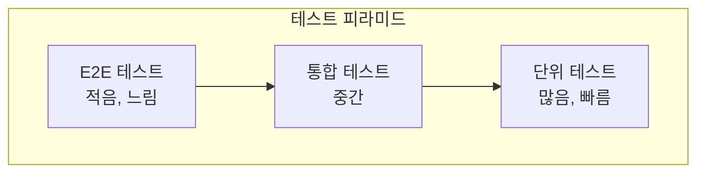
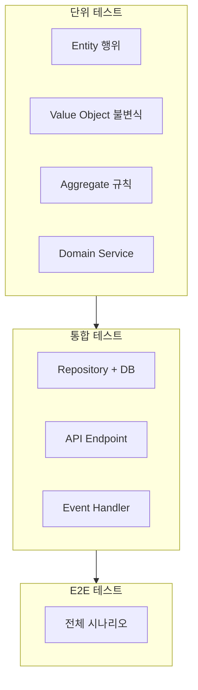

> **대상 독자**: DDD 기반 프로젝트에서 테스트 전략을 수립하려는 개발자
> **선수 지식**: [전술적 설계](../tactical-design/) 빌딩 블록, 기본적인 JUnit/Mockito 사용법
> **소요 시간**: 약 25분
> **핵심 질문**: "DDD 아키텍처에서 테스트를 어떻게 구성해야 하는가?"


테스트 전략 핵심: **단위 테스트**(도메인 모델 중심, 가장 많이) → **통합 테스트**(Repository, 외부 연동) → **E2E 테스트**(핵심 시나리오만)


도메인 주도 설계를 적용한 시스템은 일반적인 CRUD 애플리케이션과는 다른 테스트 전략이 필요합니다. 비즈니스 로직이 도메인 모델에 집중되어 있기 때문에, 테스트 역시 도메인 계층을 중심으로 설계해야 합니다. 이 문서에서는 DDD 아키텍처에 적합한 테스트 전략과 구체적인 구현 방법을 살펴봅니다.

#### 테스트 피라미드

효과적인 테스트 전략의 핵심은 테스트 피라미드 원칙을 따르는 것입니다. 테스트 피라미드는 단위 테스트를 가장 많이 작성하고, 통합 테스트를 중간 정도로, E2E 테스트를 가장 적게 작성하는 전략입니다. 이는 비용과 실행 속도를 고려한 균형 잡힌 접근 방식입니다.



테스트 유형별로 살펴보면, 단위 테스트는 도메인 모델과 서비스를 대상으로 하며 빠른 속도와 낮은 비용이 특징입니다. 통합 테스트는 Repository나 외부 시스템 연동을 검증하며 중간 수준의 속도와 비용을 가집니다. E2E 테스트는 전체 시스템을 대상으로 하여 가장 느리고 비용이 높습니다.

| 테스트 유형 | 범위 | 속도 | 비용 |
|------------|------|------|------|
| **단위 테스트** | 도메인 모델, 서비스 | 빠름 | 낮음 |
| **통합 테스트** | Repository, 외부 연동 | 중간 | 중간 |
| **E2E 테스트** | 전체 시스템 | 느림 | 높음 |

단위 테스트는 외부 의존성 없이 빠르게 실행되므로 개발 과정에서 즉각적인 피드백을 제공합니다. 반면 E2E 테스트는 전체 시스템을 검증하지만 실행 시간이 길고 유지보수 비용이 높으므로 핵심 시나리오에만 적용하는 것이 바람직합니다.

#### 도메인 모델 단위 테스트

DDD에서 가장 중요한 테스트는 도메인 모델의 단위 테스트입니다. 비즈니스 로직의 핵심이 도메인 모델에 있으므로, 이를 철저히 검증하는 것이 품질 확보의 핵심입니다.

**왜 중요한가?**

도메인 모델은 비즈니스 로직의 핵심입니다. 데이터베이스나 외부 API 같은 의존성 없이 빠르게 테스트할 수 있어야 합니다. 도메인 모델이 순수한 Java 객체로 구현되어 있다면, 테스트도 매우 간단하고 빠르게 작성할 수 있습니다. 이는 TDD(테스트 주도 개발) 방식으로 개발할 때 특히 유용합니다.

**Entity 테스트**

Entity 테스트의 핵심은 비즈니스 규칙과 상태 전이를 검증하는 것입니다. 다음 예제는 주문(Order) Entity의 생성, 확정, 취소 동작을 체계적으로 테스트하는 방법을 보여줍니다. JUnit 5의 `@Nested` 어노테이션을 사용하여 관련된 테스트를 그룹화하면 가독성이 크게 향상됩니다.

```java
class OrderTest {

    @Nested
    @DisplayName("주문 생성")
    class CreateOrder {

        @Test
        @DisplayName("유효한 정보로 주문을 생성할 수 있다")
        void createWithValidData() {
            // given
            var customerId = CustomerId.of("CUST-001");
            var address = createValidAddress();
            var orderLines = List.of(
                new OrderLineRequest(ProductId.of("PROD-001"), "상품1", Money.won(10000), 2)
            );

            // when
            Order order = Order.create(customerId, address, orderLines);

            // then
            assertThat(order.getId()).isNotNull();
            assertThat(order.getStatus()).isEqualTo(OrderStatus.PENDING);
            assertThat(order.getTotalAmount()).isEqualTo(Money.won(20000));
            assertThat(order.getOrderLines()).hasSize(1);
        }

        @Test
        @DisplayName("주문 항목 없이 생성하면 예외가 발생한다")
        void failWithEmptyOrderLines() {
            // given
            var customerId = CustomerId.of("CUST-001");
            var address = createValidAddress();

            // when & then
            assertThatThrownBy(() -> Order.create(customerId, address, List.of()))
                .isInstanceOf(IllegalArgumentException.class)
                .hasMessageContaining("최소 1개");
        }

        @Test
        @DisplayName("최대 금액을 초과하면 예외가 발생한다")
        void failWithExceedingMaxAmount() {
            // given
            var orderLines = List.of(
                new OrderLineRequest(ProductId.of("PROD-001"), "비싼상품", Money.won(100_000_001), 1)
            );

            // when & then
            assertThatThrownBy(() -> Order.create(customerId, address, orderLines))
                .isInstanceOf(IllegalArgumentException.class)
                .hasMessageContaining("최대 금액");
        }
    }

    @Nested
    @DisplayName("주문 확정")
    class ConfirmOrder {

        @Test
        @DisplayName("PENDING 상태의 주문을 확정할 수 있다")
        void confirmPendingOrder() {
            // given
            Order order = createPendingOrder();

            // when
            order.confirm();

            // then
            assertThat(order.getStatus()).isEqualTo(OrderStatus.CONFIRMED);
            assertThat(order.getConfirmedAt()).isNotNull();
        }

        @Test
        @DisplayName("주문 확정 시 OrderConfirmedEvent가 발행된다")
        void publishEventWhenConfirmed() {
            // given
            Order order = createPendingOrder();

            // when
            order.confirm();

            // then
            assertThat(order.getDomainEvents())
                .hasSize(1)
                .first()
                .isInstanceOf(OrderConfirmedEvent.class);
        }

        @Test
        @DisplayName("이미 확정된 주문은 다시 확정할 수 없다")
        void cannotConfirmAlreadyConfirmed() {
            // given
            Order order = createPendingOrder();
            order.confirm();
            order.clearDomainEvents();

            // when & then
            assertThatThrownBy(order::confirm)
                .isInstanceOf(IllegalOrderStateException.class)
                .hasMessageContaining("PENDING");
        }

        @Test
        @DisplayName("취소된 주문은 확정할 수 없다")
        void cannotConfirmCancelledOrder() {
            // given
            Order order = createPendingOrder();
            order.cancel("테스트");

            // when & then
            assertThatThrownBy(order::confirm)
                .isInstanceOf(IllegalOrderStateException.class);
        }
    }

    @Nested
    @DisplayName("주문 취소")
    class CancelOrder {

        @ParameterizedTest
        @EnumSource(value = OrderStatus.class, names = {"PENDING", "CONFIRMED"})
        @DisplayName("PENDING 또는 CONFIRMED 상태에서 취소할 수 있다")
        void canCancelPendingOrConfirmed(OrderStatus status) {
            // given
            Order order = createOrderWithStatus(status);

            // when
            order.cancel("단순 변심");

            // then
            assertThat(order.getStatus()).isEqualTo(OrderStatus.CANCELLED);
            assertThat(order.getCancellationReason()).isEqualTo("단순 변심");
        }

        @ParameterizedTest
        @EnumSource(value = OrderStatus.class, names = {"SHIPPED", "DELIVERED"})
        @DisplayName("SHIPPED 이후 상태에서는 취소할 수 없다")
        void cannotCancelAfterShipped(OrderStatus status) {
            // given
            Order order = createOrderWithStatus(status);

            // when & then
            assertThatThrownBy(() -> order.cancel("테스트"))
                .isInstanceOf(IllegalOrderStateException.class);
        }
    }
}
```

위 테스트 코드는 주문의 생명주기 전반을 검증합니다. 주문 생성 시에는 유효성 검증(항목 존재 여부, 최대 금액 제한)을 확인하고, 주문 확정 시에는 상태 전이와 도메인 이벤트 발행을 검증합니다. 특히 `@ParameterizedTest`를 활용하면 여러 상태에 대한 테스트를 간결하게 작성할 수 있습니다.

**Value Object 테스트**

Value Object는 불변성과 값 기반 동등성을 가지므로, 이러한 특성을 테스트로 검증해야 합니다. Money와 ShippingAddress 같은 Value Object는 비즈니스 규칙을 캡슐화하므로, 유효성 검증 로직도 함께 테스트합니다.

```java
class MoneyTest {

    @Test
    @DisplayName("같은 금액과 통화는 동일하다")
    void equalityByValue() {
        // given
        Money money1 = Money.won(10000);
        Money money2 = Money.won(10000);

        // then
        assertThat(money1).isEqualTo(money2);
        assertThat(money1.hashCode()).isEqualTo(money2.hashCode());
    }

    @Test
    @DisplayName("금액을 더할 수 있다")
    void addMoney() {
        // given
        Money money1 = Money.won(10000);
        Money money2 = Money.won(5000);

        // when
        Money result = money1.add(money2);

        // then
        assertThat(result).isEqualTo(Money.won(15000));
        // 원본은 변경되지 않음 (불변성)
        assertThat(money1).isEqualTo(Money.won(10000));
    }

    @Test
    @DisplayName("다른 통화와는 연산할 수 없다")
    void cannotAddDifferentCurrency() {
        // given
        Money won = Money.won(10000);
        Money usd = new Money(BigDecimal.valueOf(10), Currency.getInstance("USD"));

        // when & then
        assertThatThrownBy(() -> won.add(usd))
            .isInstanceOf(IllegalArgumentException.class)
            .hasMessageContaining("통화가 다릅니다");
    }

    @Test
    @DisplayName("음수 금액은 생성할 수 없다")
    void cannotCreateNegativeAmount() {
        assertThatThrownBy(() -> Money.won(-1000))
            .isInstanceOf(IllegalArgumentException.class);
    }
}

class ShippingAddressTest {

    @Test
    @DisplayName("유효한 주소를 생성할 수 있다")
    void createValidAddress() {
        // when
        ShippingAddress address = new ShippingAddress(
            "12345", "서울시", "강남대로 123", "101호",
            "홍길동", "010-1234-5678"
        );

        // then
        assertThat(address.fullAddress())
            .isEqualTo("(12345) 서울시 강남대로 123 101호");
    }

    @Test
    @DisplayName("잘못된 우편번호는 예외가 발생한다")
    void invalidZipCode() {
        assertThatThrownBy(() -> new ShippingAddress(
            "1234", "서울시", "강남대로 123", "101호",  // 4자리 우편번호
            "홍길동", "010-1234-5678"
        ))
            .isInstanceOf(IllegalArgumentException.class)
            .hasMessageContaining("우편번호");
    }
}
```

Money 테스트에서는 값 기반 동등성, 불변성, 통화 일치 규칙을 검증합니다. 특히 `add()` 메서드 테스트에서 원본 객체가 변경되지 않음을 확인하는 것은 불변성 보장에 매우 중요합니다. ShippingAddress 테스트는 형식 검증 규칙이 올바르게 동작하는지 확인합니다.

**Aggregate 불변식 테스트**

Aggregate의 핵심 책임 중 하나는 불변식(invariant)을 보호하는 것입니다. 불변식은 Aggregate가 어떤 상태에 있더라도 항상 참이어야 하는 비즈니스 규칙입니다. 다음 예제는 주문 금액의 일관성과 최소 항목 수 규칙을 검증합니다.

```java
class OrderInvariantTest {

    @Test
    @DisplayName("주문 총액은 항상 주문 항목 합계와 일치한다")
    void totalAmountEqualsOrderLinesSum() {
        // given
        Order order = Order.create(
            customerId, address,
            List.of(
                new OrderLineRequest(productId1, "상품1", Money.won(10000), 2),  // 20000
                new OrderLineRequest(productId2, "상품2", Money.won(5000), 3)    // 15000
            )
        );

        // then
        Money expectedTotal = Money.won(35000);
        assertThat(order.getTotalAmount()).isEqualTo(expectedTotal);

        // 주문 항목 제거 후에도 일관성 유지
        order.removeOrderLine(order.getOrderLines().get(0).getId());
        assertThat(order.getTotalAmount()).isEqualTo(Money.won(15000));
    }

    @Test
    @DisplayName("주문에는 항상 최소 1개의 항목이 있어야 한다")
    void minimumOneOrderLine() {
        // given
        Order order = Order.create(
            customerId, address,
            List.of(new OrderLineRequest(productId, "상품", Money.won(10000), 1))
        );

        // when & then: 마지막 항목 제거 시도
        assertThatThrownBy(() ->
            order.removeOrderLine(order.getOrderLines().get(0).getId())
        )
            .isInstanceOf(IllegalArgumentException.class)
            .hasMessageContaining("최소 1개");
    }
}
```

불변식 테스트는 Aggregate가 상태를 변경한 후에도 비즈니스 규칙이 유지되는지 확인합니다. 주문 항목을 추가하거나 제거할 때 총액이 자동으로 재계산되고, 최소 항목 수 규칙이 위반되면 예외가 발생해야 합니다. 이러한 테스트는 도메인 모델의 일관성을 보장하는 핵심 안전장치입니다.

#### Application Service 테스트

Application Service는 트랜잭션 경계를 관리하고 도메인 모델을 조율하는 역할을 합니다. 도메인 로직은 Entity에 있으므로, Application Service 테스트에서는 Mock을 사용하여 협력 객체의 동작을 검증합니다.

```java
@ExtendWith(MockitoExtension.class)
class OrderServiceTest {

    @Mock
    private OrderRepository orderRepository;

    @Mock
    private ApplicationEventPublisher eventPublisher;

    @InjectMocks
    private OrderService orderService;

    @Test
    @DisplayName("주문을 확정하면 저장되고 이벤트가 발행된다")
    void confirmOrder() {
        // given
        OrderId orderId = OrderId.of("ORD-001");
        Order order = spy(createPendingOrder(orderId));

        when(orderRepository.findById(orderId)).thenReturn(Optional.of(order));

        // when
        orderService.confirmOrder(new ConfirmOrderCommand(orderId));

        // then
        verify(order).confirm();
        verify(orderRepository).save(order);
        verify(eventPublisher).publishEvent(any(OrderConfirmedEvent.class));
    }

    @Test
    @DisplayName("존재하지 않는 주문을 확정하면 예외가 발생한다")
    void confirmNotFoundOrder() {
        // given
        OrderId orderId = OrderId.of("NOT-EXIST");
        when(orderRepository.findById(orderId)).thenReturn(Optional.empty());

        // when & then
        assertThatThrownBy(() ->
            orderService.confirmOrder(new ConfirmOrderCommand(orderId))
        )
            .isInstanceOf(OrderNotFoundException.class);

        verify(orderRepository, never()).save(any());
    }
}
```

Application Service 테스트의 핵심은 올바른 순서로 협력 객체를 호출하는지 검증하는 것입니다. 주문 확정 시나리오에서는 Repository에서 주문을 조회하고, 도메인 메서드를 호출하고, 변경된 주문을 저장하고, 이벤트를 발행하는 흐름을 검증합니다. Mock을 사용하면 데이터베이스 없이도 빠르게 테스트할 수 있습니다.

#### Repository 통합 테스트

Repository는 도메인 모델을 영속화하는 인프라 계층의 구성 요소입니다. 실제 데이터베이스와 함께 테스트하여 매핑과 쿼리가 올바르게 동작하는지 확인해야 합니다. Testcontainers를 사용하면 프로덕션과 동일한 데이터베이스로 테스트할 수 있습니다.

```java
@DataJpaTest
@AutoConfigureTestDatabase(replace = AutoConfigureTestDatabase.Replace.NONE)
@Testcontainers
class JpaOrderRepositoryTest {

    @Container
    static PostgreSQLContainer<?> postgres = new PostgreSQLContainer<>("postgres:15");

    @DynamicPropertySource
    static void configureProperties(DynamicPropertyRegistry registry) {
        registry.add("spring.datasource.url", postgres::getJdbcUrl);
        registry.add("spring.datasource.username", postgres::getUsername);
        registry.add("spring.datasource.password", postgres::getPassword);
    }

    @Autowired
    private JpaOrderRepository repository;

    @Autowired
    private TestEntityManager entityManager;

    @Test
    @DisplayName("주문을 저장하고 조회할 수 있다")
    void saveAndFind() {
        // given
        Order order = Order.create(customerId, address, orderLines);

        // when
        Order saved = repository.save(order);
        entityManager.flush();
        entityManager.clear();

        // then
        Order found = repository.findById(saved.getId()).orElseThrow();
        assertThat(found.getId()).isEqualTo(saved.getId());
        assertThat(found.getStatus()).isEqualTo(OrderStatus.PENDING);
        assertThat(found.getOrderLines()).hasSize(1);
    }

    @Test
    @DisplayName("고객별 주문 목록을 조회할 수 있다")
    void findByCustomerId() {
        // given
        Order order1 = repository.save(Order.create(customerId, address, orderLines));
        Order order2 = repository.save(Order.create(customerId, address, orderLines));
        Order otherOrder = repository.save(Order.create(otherCustomerId, address, orderLines));
        entityManager.flush();

        // when
        List<Order> orders = repository.findByCustomerId(customerId);

        // then
        assertThat(orders)
            .hasSize(2)
            .extracting(Order::getId)
            .containsExactlyInAnyOrder(order1.getId(), order2.getId());
    }
}
```

Repository 테스트에서는 `entityManager.flush()`와 `clear()`를 호출하여 영속성 컨텍스트를 초기화합니다. 이렇게 하면 실제 데이터베이스에서 조회한 결과를 검증할 수 있어 매핑 설정이 올바른지 확인할 수 있습니다. Testcontainers는 테스트마다 깨끗한 데이터베이스 환경을 제공하므로 테스트 간 간섭이 없습니다.

#### API 통합 테스트

API 통합 테스트는 HTTP 요청부터 데이터베이스 저장까지 전체 스택을 검증합니다. 실제 사용자 시나리오와 가장 유사한 환경에서 테스트하므로 높은 신뢰성을 제공합니다.

```java
@SpringBootTest(webEnvironment = SpringBootTest.WebEnvironment.RANDOM_PORT)
@Testcontainers
class OrderApiIntegrationTest {

    @Container
    static PostgreSQLContainer<?> postgres = new PostgreSQLContainer<>("postgres:15");

    @Autowired
    private TestRestTemplate restTemplate;

    @Autowired
    private OrderRepository orderRepository;

    @Test
    @DisplayName("주문 생성 API")
    void createOrder() {
        // given
        CreateOrderRequest request = new CreateOrderRequest(
            "CUST-001",
            new ShippingAddressRequest("12345", "서울시", "강남대로", "101호", "홍길동", "010-1234-5678"),
            List.of(new OrderLineRequestDto("PROD-001", "상품1", 10000L, 2))
        );

        // when
        ResponseEntity<CreateOrderResponse> response = restTemplate.postForEntity(
            "/api/orders",
            request,
            CreateOrderResponse.class
        );

        // then
        assertThat(response.getStatusCode()).isEqualTo(HttpStatus.CREATED);
        assertThat(response.getBody().orderId()).isNotNull();

        // DB 확인
        Order saved = orderRepository.findById(OrderId.of(response.getBody().orderId()))
            .orElseThrow();
        assertThat(saved.getStatus()).isEqualTo(OrderStatus.PENDING);
    }

    @Test
    @DisplayName("주문 확정 API")
    void confirmOrder() {
        // given
        Order order = orderRepository.save(createPendingOrder());

        // when
        ResponseEntity<Void> response = restTemplate.postForEntity(
            "/api/orders/{orderId}/confirm",
            null,
            Void.class,
            order.getId().getValue()
        );

        // then
        assertThat(response.getStatusCode()).isEqualTo(HttpStatus.OK);

        Order confirmed = orderRepository.findById(order.getId()).orElseThrow();
        assertThat(confirmed.getStatus()).isEqualTo(OrderStatus.CONFIRMED);
    }
}
```

API 통합 테스트는 HTTP 응답 코드뿐만 아니라 실제 데이터베이스 상태도 검증합니다. 주문 생성 후 데이터베이스에 올바른 상태로 저장되었는지, 주문 확정 후 상태가 변경되었는지 확인합니다. 이러한 검증은 전체 계층이 올바르게 통합되었음을 보장합니다.

#### 이벤트 핸들러 테스트

도메인 이벤트를 사용하는 시스템에서는 이벤트 핸들러가 올바르게 동작하는지 테스트해야 합니다. 이벤트 발행 시 적절한 부수 효과가 발생하는지 검증합니다.

```java
@SpringBootTest
class OrderEventHandlerTest {

    @Autowired
    private ApplicationEventPublisher eventPublisher;

    @Autowired
    private OrderViewRepository orderViewRepository;

    @Test
    @DisplayName("OrderConfirmedEvent 발행 시 OrderView가 업데이트된다")
    void updateViewOnConfirmed() {
        // given
        String orderId = "ORD-001";
        orderViewRepository.save(new OrderView(orderId, "PENDING"));

        OrderConfirmedEvent event = new OrderConfirmedEvent(
            OrderId.of(orderId),
            CustomerId.of("CUST-001"),
            Money.won(10000),
            LocalDateTime.now()
        );

        // when
        eventPublisher.publishEvent(event);

        // then
        OrderView updated = orderViewRepository.findById(orderId).orElseThrow();
        assertThat(updated.getStatus()).isEqualTo("CONFIRMED");
    }
}
```

이벤트 핸들러 테스트는 이벤트 기반 아키텍처의 동작을 검증합니다. 주문 확정 이벤트가 발행되면 조회 모델이 업데이트되는지 확인하여 CQRS 패턴이 올바르게 구현되었는지 검증할 수 있습니다.

#### 테스트 유틸리티

반복적인 테스트 데이터 생성 코드는 유틸리티로 분리하면 테스트 코드의 가독성과 유지보수성이 크게 향상됩니다.

**Test Fixture**

Test Fixture는 테스트에 필요한 기본 데이터를 생성하는 정적 메서드 모음입니다. 다양한 상태의 도메인 객체를 쉽게 생성할 수 있도록 헬퍼 메서드를 제공합니다.

```java
public class OrderFixtures {

    public static Order createPendingOrder() {
        return Order.create(
            CustomerId.of("CUST-001"),
            createValidAddress(),
            createDefaultOrderLines()
        );
    }

    public static Order createConfirmedOrder() {
        Order order = createPendingOrder();
        order.confirm();
        order.clearDomainEvents();
        return order;
    }

    public static Order createOrderWithStatus(OrderStatus status) {
        Order order = createPendingOrder();
        switch (status) {
            case CONFIRMED -> order.confirm();
            case SHIPPED -> { order.confirm(); order.ship(TrackingNumber.generate()); }
            case CANCELLED -> order.cancel("테스트");
        }
        order.clearDomainEvents();
        return order;
    }

    public static ShippingAddress createValidAddress() {
        return new ShippingAddress(
            "12345", "서울시", "강남대로 123", "101호",
            "홍길동", "010-1234-5678"
        );
    }

    public static List<OrderLineRequest> createDefaultOrderLines() {
        return List.of(
            new OrderLineRequest(ProductId.of("PROD-001"), "상품1", Money.won(10000), 1)
        );
    }
}
```

Fixture를 사용하면 테스트 코드에서 반복적인 객체 생성 코드를 제거할 수 있습니다. 특히 `createOrderWithStatus()` 같은 메서드는 다양한 상태의 주문을 간단하게 생성할 수 있어 매우 유용합니다.

**Test Builder**

Test Builder 패턴은 Fluent API를 사용하여 가독성 높은 테스트 데이터를 생성합니다. 기본값을 제공하면서도 필요한 속성만 커스터마이즈할 수 있습니다.

```java
public class OrderBuilder {

    private CustomerId customerId = CustomerId.of("CUST-001");
    private ShippingAddress address = OrderFixtures.createValidAddress();
    private List<OrderLineRequest> orderLines = OrderFixtures.createDefaultOrderLines();
    private OrderStatus targetStatus = OrderStatus.PENDING;

    public static OrderBuilder anOrder() {
        return new OrderBuilder();
    }

    public OrderBuilder withCustomerId(String customerId) {
        this.customerId = CustomerId.of(customerId);
        return this;
    }

    public OrderBuilder withOrderLine(String productId, String name, long price, int qty) {
        this.orderLines = List.of(
            new OrderLineRequest(ProductId.of(productId), name, Money.won(price), qty)
        );
        return this;
    }

    public OrderBuilder confirmed() {
        this.targetStatus = OrderStatus.CONFIRMED;
        return this;
    }

    public OrderBuilder cancelled() {
        this.targetStatus = OrderStatus.CANCELLED;
        return this;
    }

    public Order build() {
        Order order = Order.create(customerId, address, orderLines);
        if (targetStatus == OrderStatus.CONFIRMED) {
            order.confirm();
        } else if (targetStatus == OrderStatus.CANCELLED) {
            order.cancel("테스트");
        }
        order.clearDomainEvents();
        return order;
    }
}

// 사용
Order order = OrderBuilder.anOrder()
    .withCustomerId("VIP-001")
    .withOrderLine("EXPENSIVE-001", "고가상품", 1000000, 1)
    .confirmed()
    .build();
```

Builder 패턴은 테스트 의도를 명확하게 표현할 수 있습니다. "VIP 고객이 고가 상품을 주문하고 확정한 상태"를 코드로 읽기 쉽게 표현할 수 있어 테스트의 가독성이 크게 향상됩니다.

#### 테스트 전략 정리

DDD 시스템의 테스트 전략을 계층별로 정리하면 다음과 같습니다. 각 계층의 특성에 맞는 테스트 방법을 선택하는 것이 중요합니다.



테스트 대상에 따라 적절한 테스트 유형을 선택해야 합니다. Entity와 Value Object는 외부 의존성 없이 단위 테스트로 빠르게 검증하고, Repository는 실제 데이터베이스와 함께 통합 테스트를 수행하며, 전체 시나리오는 E2E 테스트로 사용자 관점에서 검증합니다.

| 테스트 대상 | 유형 | 특징 |
|------------|------|------|
| **Entity, VO** | 단위 | Mock 없이, 빠름 |
| **Application Service** | 단위 | Repository Mock |
| **Repository** | 통합 | 실제 DB (Testcontainers) |
| **API** | 통합 | 전체 스택 |
| **시나리오** | E2E | 사용자 관점 |

Entity와 Value Object는 순수한 도메인 로직이므로 Mock 없이 빠르게 테스트할 수 있습니다. Application Service는 협력 객체를 Mock으로 대체하여 단위 테스트하고, Repository와 API는 실제 인프라와 함께 통합 테스트합니다. 핵심 사용자 시나리오는 E2E 테스트로 전체 흐름을 검증합니다.

#### 다음 단계

- [안티패턴](../anti-patterns/) - 테스트 시 흔한 실수
