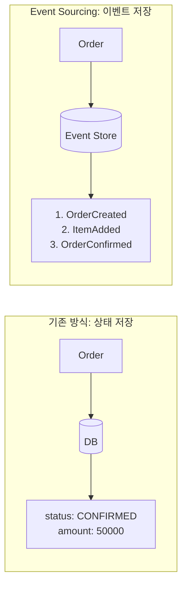


- **Event Sourcing**: 상태 대신 이벤트를 저장. 이벤트 재생으로 상태 복원
- **Event Store**: 이벤트 영속화 저장소. 버전 기반 낙관적 동시성 제어
- **Event-Sourced Aggregate**: apply/when 패턴으로 이벤트 적용 및 상태 변경
- **Snapshot**: 성능 최적화를 위해 주기적으로 상태 스냅샷 저장
- **시점 복원**: 특정 버전까지의 이벤트만 재생하여 과거 상태 조회 가능


## 대상 독자 및 선수 지식

| 항목 | 요구 수준 |
|------|----------|
| **대상 독자** | Event Sourcing 패턴을 실제로 구현해보려는 개발자 |
| **DDD** | Aggregate, Domain Event 개념 이해 |
| **Java** | Switch Expression, Pattern Matching 문법 |
| **선수 문서** | [주문 도메인](order-domain/), [애플리케이션 계층](application-layer/) 완료 |

Event Sourcing 패턴을 실제 주문 도메인에 구현합니다. 상태 대신 이벤트를 저장하고, 이벤트를 재생하여 상태를 복원합니다.

## Event Sourcing이란?

### 기존 방식 vs Event Sourcing



> **다이어그램 설명**: 왼쪽(기존 방식)은 Order가 DB에 현재 상태(status: CONFIRMED, amount: 50000)를 저장합니다. 오른쪽(Event Sourcing)은 Order가 Event Store에 이벤트 시퀀스(OrderCreated, ItemAdded, OrderConfirmed)를 저장합니다.

| 구분 | 기존 방식 | Event Sourcing |
|------|----------|----------------|
| **저장 대상** | 현재 상태 | 모든 이벤트 |
| **이력** | 별도 관리 필요 | 자동으로 보존 |
| **시점 복원** | 불가능 | 특정 시점 재현 가능 |
| **디버깅** | 어려움 | 이벤트 추적 용이 |
| **복잡도** | 낮음 | 높음 |


- **상태 저장 X, 이벤트 저장 O**: 현재 상태는 이벤트 재생으로 계산
- **완전한 이력**: 모든 변경 이력이 자동으로 보존됨
- **시간 여행**: 특정 시점의 상태를 언제든 복원 가능
- **트레이드오프**: 구현 복잡도 증가, 조회 성능 고려 필요


---

## 도메인 이벤트 정의

### 이벤트 베이스 클래스

```java
// DomainEvent.java
public abstract class DomainEvent {
    private final String eventId;
    private final String aggregateId;
    private final long version;
    private final Instant occurredAt;

    protected DomainEvent(String aggregateId, long version) {
        this.eventId = UUID.randomUUID().toString();
        this.aggregateId = aggregateId;
        this.version = version;
        this.occurredAt = Instant.now();
    }

    public abstract String getEventType();

    // getters
}
```

### 주문 도메인 이벤트

```java
// OrderCreatedEvent.java
public class OrderCreatedEvent extends DomainEvent {
    private final String customerId;
    private final String shippingAddress;

    public OrderCreatedEvent(String orderId, long version,
                             String customerId, String shippingAddress) {
        super(orderId, version);
        this.customerId = customerId;
        this.shippingAddress = shippingAddress;
    }

    @Override
    public String getEventType() {
        return "ORDER_CREATED";
    }
}

// OrderItemAddedEvent.java
public class OrderItemAddedEvent extends DomainEvent {
    private final String productId;
    private final String productName;
    private final int quantity;
    private final Money unitPrice;

    public OrderItemAddedEvent(String orderId, long version,
                               String productId, String productName,
                               int quantity, Money unitPrice) {
        super(orderId, version);
        this.productId = productId;
        this.productName = productName;
        this.quantity = quantity;
        this.unitPrice = unitPrice;
    }

    @Override
    public String getEventType() {
        return "ORDER_ITEM_ADDED";
    }
}

// OrderConfirmedEvent.java
public class OrderConfirmedEvent extends DomainEvent {
    private final Money totalAmount;
    private final Instant confirmedAt;

    public OrderConfirmedEvent(String orderId, long version, Money totalAmount) {
        super(orderId, version);
        this.totalAmount = totalAmount;
        this.confirmedAt = Instant.now();
    }

    @Override
    public String getEventType() {
        return "ORDER_CONFIRMED";
    }
}

// OrderCancelledEvent.java
public class OrderCancelledEvent extends DomainEvent {
    private final String reason;
    private final Instant cancelledAt;

    public OrderCancelledEvent(String orderId, long version, String reason) {
        super(orderId, version);
        this.reason = reason;
        this.cancelledAt = Instant.now();
    }

    @Override
    public String getEventType() {
        return "ORDER_CANCELLED";
    }
}
```


- **버전 포함**: 각 이벤트는 Aggregate의 버전 번호를 포함
- **불변**: 이벤트는 한번 생성되면 변경 불가
- **자기 설명적**: getEventType()으로 이벤트 종류 식별
- **필요한 데이터만**: 상태 복원에 필요한 최소한의 데이터만 포함


---

## Event-Sourced Aggregate

### Order Aggregate

```java
public class Order extends EventSourcedAggregate {
    private String customerId;
    private String shippingAddress;
    private List<OrderLine> orderLines = new ArrayList<>();
    private OrderStatus status;
    private Money totalAmount;
    private Instant confirmedAt;
    private String cancelReason;

    // 빈 생성자 (이벤트 재생용)
    public Order() {
        super();
    }

    // 팩토리 메서드: 새 주문 생성
    public static Order create(String orderId, String customerId, String shippingAddress) {
        Order order = new Order();
        order.apply(new OrderCreatedEvent(orderId, 1, customerId, shippingAddress));
        return order;
    }

    // 이벤트에서 복원
    public static Order reconstitute(String orderId, List<DomainEvent> events) {
        Order order = new Order();
        events.forEach(order::apply);
        return order;
    }

    // 명령: 상품 추가
    public void addItem(String productId, String productName, int quantity, Money unitPrice) {
        if (status != OrderStatus.PENDING) {
            throw new IllegalStateException("확정된 주문에는 상품을 추가할 수 없습니다.");
        }
        if (quantity <= 0) {
            throw new IllegalArgumentException("수량은 1 이상이어야 합니다.");
        }

        apply(new OrderItemAddedEvent(getId(), nextVersion(), productId, productName, quantity, unitPrice));
    }

    // 명령: 주문 확정
    public void confirm() {
        if (status != OrderStatus.PENDING) {
            throw new IllegalStateException("대기 중인 주문만 확정할 수 있습니다.");
        }
        if (orderLines.isEmpty()) {
            throw new IllegalStateException("상품이 없는 주문은 확정할 수 없습니다.");
        }

        Money total = calculateTotal();
        apply(new OrderConfirmedEvent(getId(), nextVersion(), total));
    }

    // 명령: 주문 취소
    public void cancel(String reason) {
        if (status == OrderStatus.CANCELLED) {
            throw new IllegalStateException("이미 취소된 주문입니다.");
        }
        if (status == OrderStatus.SHIPPED) {
            throw new IllegalStateException("배송 중인 주문은 취소할 수 없습니다.");
        }

        apply(new OrderCancelledEvent(getId(), nextVersion(), reason));
    }

    // 이벤트 핸들러: 상태 변경
    @Override
    protected void when(DomainEvent event) {
        switch (event) {
            case OrderCreatedEvent e -> {
                setId(e.getAggregateId());
                this.customerId = e.getCustomerId();
                this.shippingAddress = e.getShippingAddress();
                this.status = OrderStatus.PENDING;
                this.orderLines = new ArrayList<>();
            }
            case OrderItemAddedEvent e -> {
                this.orderLines.add(new OrderLine(
                    e.getProductId(),
                    e.getProductName(),
                    e.getQuantity(),
                    e.getUnitPrice()
                ));
            }
            case OrderConfirmedEvent e -> {
                this.status = OrderStatus.CONFIRMED;
                this.totalAmount = e.getTotalAmount();
                this.confirmedAt = e.getConfirmedAt();
            }
            case OrderCancelledEvent e -> {
                this.status = OrderStatus.CANCELLED;
                this.cancelReason = e.getReason();
            }
            default -> throw new IllegalArgumentException("Unknown event: " + event.getClass());
        }
    }

    private Money calculateTotal() {
        return orderLines.stream()
            .map(line -> line.getUnitPrice().multiply(line.getQuantity()))
            .reduce(Money.ZERO, Money::add);
    }
}
```

### EventSourcedAggregate 베이스 클래스

```java
public abstract class EventSourcedAggregate {
    private String id;
    private long version = 0;
    private final List<DomainEvent> uncommittedEvents = new ArrayList<>();

    protected void apply(DomainEvent event) {
        when(event);
        this.version = event.getVersion();
        uncommittedEvents.add(event);
    }

    protected abstract void when(DomainEvent event);

    protected long nextVersion() {
        return version + 1;
    }

    public List<DomainEvent> getUncommittedEvents() {
        return List.copyOf(uncommittedEvents);
    }

    public void markEventsAsCommitted() {
        uncommittedEvents.clear();
    }

    // getters, setters
}
```


- **apply/when 패턴**: apply()가 이벤트를 기록하고, when()이 상태 변경
- **명령 메서드**: 유효성 검증 후 이벤트 생성 (addItem, confirm, cancel)
- **reconstitute**: 이벤트 리스트로부터 상태 복원
- **uncommittedEvents**: 저장되지 않은 이벤트 추적
- **버전 관리**: nextVersion()으로 순차적 버전 번호 할당


---

## Event Store 구현

### EventStore 인터페이스

```java
public interface EventStore {
    void append(String aggregateId, List<DomainEvent> events, long expectedVersion);
    List<DomainEvent> load(String aggregateId);
    List<DomainEvent> loadFromVersion(String aggregateId, long fromVersion);
}
```

### JPA 기반 구현

```java
@Entity
@Table(name = "event_store")
public class EventEntity {
    @Id
    @GeneratedValue(strategy = GenerationType.IDENTITY)
    private Long id;

    @Column(nullable = false)
    private String aggregateId;

    @Column(nullable = false)
    private String aggregateType;

    @Column(nullable = false)
    private String eventType;

    @Column(nullable = false)
    private long version;

    @Column(columnDefinition = "TEXT", nullable = false)
    private String payload;  // JSON

    @Column(nullable = false)
    private Instant occurredAt;

    @Column(nullable = false)
    private Instant storedAt;
}

@Repository
public interface EventEntityRepository extends JpaRepository<EventEntity, Long> {
    List<EventEntity> findByAggregateIdOrderByVersionAsc(String aggregateId);
    List<EventEntity> findByAggregateIdAndVersionGreaterThanOrderByVersionAsc(
        String aggregateId, long version);
    Optional<EventEntity> findTopByAggregateIdOrderByVersionDesc(String aggregateId);
}

@Component
@RequiredArgsConstructor
public class JpaEventStore implements EventStore {
    private final EventEntityRepository repository;
    private final ObjectMapper objectMapper;

    @Override
    @Transactional
    public void append(String aggregateId, List<DomainEvent> events, long expectedVersion) {
        // 낙관적 동시성 체크
        Optional<EventEntity> lastEvent = repository.findTopByAggregateIdOrderByVersionDesc(aggregateId);
        long currentVersion = lastEvent.map(EventEntity::getVersion).orElse(0L);

        if (currentVersion != expectedVersion) {
            throw new OptimisticLockingException(
                String.format("Expected version %d but was %d", expectedVersion, currentVersion)
            );
        }

        // 이벤트 저장
        List<EventEntity> entities = events.stream()
            .map(this::toEntity)
            .toList();

        repository.saveAll(entities);
    }

    @Override
    public List<DomainEvent> load(String aggregateId) {
        return repository.findByAggregateIdOrderByVersionAsc(aggregateId).stream()
            .map(this::toDomainEvent)
            .toList();
    }

    @Override
    public List<DomainEvent> loadFromVersion(String aggregateId, long fromVersion) {
        return repository.findByAggregateIdAndVersionGreaterThanOrderByVersionAsc(aggregateId, fromVersion)
            .stream()
            .map(this::toDomainEvent)
            .toList();
    }

    private EventEntity toEntity(DomainEvent event) {
        EventEntity entity = new EventEntity();
        entity.setAggregateId(event.getAggregateId());
        entity.setAggregateType("Order");
        entity.setEventType(event.getEventType());
        entity.setVersion(event.getVersion());
        entity.setPayload(serialize(event));
        entity.setOccurredAt(event.getOccurredAt());
        entity.setStoredAt(Instant.now());
        return entity;
    }

    private DomainEvent toDomainEvent(EventEntity entity) {
        return deserialize(entity.getPayload(), entity.getEventType());
    }

    private String serialize(DomainEvent event) {
        try {
            return objectMapper.writeValueAsString(event);
        } catch (JsonProcessingException e) {
            throw new RuntimeException("Failed to serialize event", e);
        }
    }

    private DomainEvent deserialize(String payload, String eventType) {
        try {
            Class<? extends DomainEvent> eventClass = getEventClass(eventType);
            return objectMapper.readValue(payload, eventClass);
        } catch (JsonProcessingException e) {
            throw new RuntimeException("Failed to deserialize event", e);
        }
    }

    private Class<? extends DomainEvent> getEventClass(String eventType) {
        return switch (eventType) {
            case "ORDER_CREATED" -> OrderCreatedEvent.class;
            case "ORDER_ITEM_ADDED" -> OrderItemAddedEvent.class;
            case "ORDER_CONFIRMED" -> OrderConfirmedEvent.class;
            case "ORDER_CANCELLED" -> OrderCancelledEvent.class;
            default -> throw new IllegalArgumentException("Unknown event type: " + eventType);
        };
    }
}
```


- **Append-Only**: 이벤트는 추가만 가능, 수정/삭제 불가
- **낙관적 동시성**: expectedVersion 검증으로 동시 수정 충돌 감지
- **JSON 직렬화**: 이벤트를 JSON으로 저장하여 유연성 확보
- **버전별 조회**: loadFromVersion()으로 특정 버전 이후 이벤트만 로드


---

## Repository 구현

### OrderRepository

```java
public interface OrderRepository {
    void save(Order order);
    Optional<Order> findById(String orderId);
}

@Component
@RequiredArgsConstructor
public class EventSourcedOrderRepository implements OrderRepository {
    private final EventStore eventStore;

    @Override
    @Transactional
    public void save(Order order) {
        List<DomainEvent> uncommittedEvents = order.getUncommittedEvents();
        if (uncommittedEvents.isEmpty()) {
            return;
        }

        long expectedVersion = order.getVersion() - uncommittedEvents.size();
        eventStore.append(order.getId(), uncommittedEvents, expectedVersion);
        order.markEventsAsCommitted();
    }

    @Override
    public Optional<Order> findById(String orderId) {
        List<DomainEvent> events = eventStore.load(orderId);
        if (events.isEmpty()) {
            return Optional.empty();
        }
        return Optional.of(Order.reconstitute(orderId, events));
    }
}
```


- **Event Store 위임**: 이벤트 저장/조회를 Event Store에 위임
- **버전 계산**: 저장 시 expectedVersion = 현재 버전 - 미커밋 이벤트 수
- **reconstitute 활용**: 이벤트로부터 Aggregate 복원
- **Domain Repository 인터페이스**: 도메인 계층에 인터페이스 정의


---

## 스냅샷 (Snapshot)

### 성능 최적화를 위한 스냅샷

```java
@Entity
@Table(name = "snapshots")
public class SnapshotEntity {
    @Id
    @GeneratedValue(strategy = GenerationType.IDENTITY)
    private Long id;

    private String aggregateId;
    private String aggregateType;
    private long version;

    @Column(columnDefinition = "TEXT")
    private String state;  // JSON

    private Instant createdAt;
}

@Component
@RequiredArgsConstructor
public class SnapshotStore {
    private static final int SNAPSHOT_THRESHOLD = 100;  // 100개 이벤트마다 스냅샷

    private final SnapshotRepository snapshotRepository;
    private final EventStore eventStore;
    private final ObjectMapper objectMapper;

    public Optional<Order> loadWithSnapshot(String orderId) {
        // 1. 스냅샷 로드
        Optional<SnapshotEntity> snapshot = snapshotRepository
            .findTopByAggregateIdOrderByVersionDesc(orderId);

        if (snapshot.isEmpty()) {
            // 스냅샷 없으면 전체 이벤트에서 복원
            List<DomainEvent> events = eventStore.load(orderId);
            return events.isEmpty() ? Optional.empty()
                : Optional.of(Order.reconstitute(orderId, events));
        }

        // 2. 스냅샷에서 상태 복원
        Order order = deserializeOrder(snapshot.get().getState());

        // 3. 스냅샷 이후 이벤트만 로드
        List<DomainEvent> newEvents = eventStore.loadFromVersion(
            orderId, snapshot.get().getVersion());

        // 4. 새 이벤트 적용
        newEvents.forEach(order::apply);
        order.markEventsAsCommitted();

        return Optional.of(order);
    }

    public void saveWithSnapshot(Order order) {
        // 이벤트 저장
        List<DomainEvent> uncommittedEvents = order.getUncommittedEvents();
        long expectedVersion = order.getVersion() - uncommittedEvents.size();
        eventStore.append(order.getId(), uncommittedEvents, expectedVersion);
        order.markEventsAsCommitted();

        // 스냅샷 필요 여부 확인
        if (order.getVersion() % SNAPSHOT_THRESHOLD == 0) {
            createSnapshot(order);
        }
    }

    private void createSnapshot(Order order) {
        SnapshotEntity snapshot = new SnapshotEntity();
        snapshot.setAggregateId(order.getId());
        snapshot.setAggregateType("Order");
        snapshot.setVersion(order.getVersion());
        snapshot.setState(serializeOrder(order));
        snapshot.setCreatedAt(Instant.now());

        snapshotRepository.save(snapshot);
    }
}
```


- **성능 최적화**: 이벤트가 많을 때 전체 재생 비용 절감
- **주기적 생성**: SNAPSHOT_THRESHOLD(예: 100) 이벤트마다 스냅샷 생성
- **부분 재생**: 스냅샷 + 이후 이벤트만 재생하여 상태 복원
- **상태 직렬화**: Aggregate 상태를 JSON으로 저장


---

## Application Service

### OrderApplicationService

```java
@Service
@RequiredArgsConstructor
@Transactional
public class OrderApplicationService {
    private final OrderRepository orderRepository;
    private final ApplicationEventPublisher eventPublisher;

    public String createOrder(CreateOrderCommand command) {
        String orderId = UUID.randomUUID().toString();

        Order order = Order.create(
            orderId,
            command.customerId(),
            command.shippingAddress()
        );

        orderRepository.save(order);

        // 외부 시스템 알림을 위한 이벤트 발행
        publishEvents(order);

        return orderId;
    }

    public void addItem(AddItemCommand command) {
        Order order = orderRepository.findById(command.orderId())
            .orElseThrow(() -> new OrderNotFoundException(command.orderId()));

        order.addItem(
            command.productId(),
            command.productName(),
            command.quantity(),
            command.unitPrice()
        );

        orderRepository.save(order);
        publishEvents(order);
    }

    public void confirmOrder(String orderId) {
        Order order = orderRepository.findById(orderId)
            .orElseThrow(() -> new OrderNotFoundException(orderId));

        order.confirm();

        orderRepository.save(order);
        publishEvents(order);
    }

    public void cancelOrder(String orderId, String reason) {
        Order order = orderRepository.findById(orderId)
            .orElseThrow(() -> new OrderNotFoundException(orderId));

        order.cancel(reason);

        orderRepository.save(order);
        publishEvents(order);
    }

    // 조회: 특정 시점의 상태 복원
    public OrderView getOrderAtVersion(String orderId, long version) {
        List<DomainEvent> events = eventStore.load(orderId).stream()
            .filter(e -> e.getVersion() <= version)
            .toList();

        if (events.isEmpty()) {
            throw new OrderNotFoundException(orderId);
        }

        Order order = Order.reconstitute(orderId, events);
        return OrderView.from(order);
    }

    private void publishEvents(Order order) {
        order.getUncommittedEvents().forEach(eventPublisher::publishEvent);
    }
}
```


- **시점 조회**: getOrderAtVersion()으로 특정 버전의 상태 조회
- **이벤트 필터링**: version <= targetVersion 조건으로 과거 상태 복원
- **외부 이벤트 발행**: 저장 후 ApplicationEventPublisher로 외부 시스템 알림
- **표준 CRUD 패턴**: 기존 방식과 동일한 서비스 인터페이스 유지


---

## 테스트

### 단위 테스트

```java
class OrderTest {

    @Test
    void 주문_생성_시_OrderCreatedEvent가_발생한다() {
        // When
        Order order = Order.create("order-1", "customer-1", "서울시 강남구");

        // Then
        List<DomainEvent> events = order.getUncommittedEvents();
        assertThat(events).hasSize(1);
        assertThat(events.get(0)).isInstanceOf(OrderCreatedEvent.class);

        OrderCreatedEvent event = (OrderCreatedEvent) events.get(0);
        assertThat(event.getAggregateId()).isEqualTo("order-1");
        assertThat(event.getCustomerId()).isEqualTo("customer-1");
    }

    @Test
    void 이벤트에서_상태를_복원할_수_있다() {
        // Given
        List<DomainEvent> events = List.of(
            new OrderCreatedEvent("order-1", 1, "customer-1", "서울시"),
            new OrderItemAddedEvent("order-1", 2, "prod-1", "노트북", 1, Money.won(1000000)),
            new OrderConfirmedEvent("order-1", 3, Money.won(1000000))
        );

        // When
        Order order = Order.reconstitute("order-1", events);

        // Then
        assertThat(order.getStatus()).isEqualTo(OrderStatus.CONFIRMED);
        assertThat(order.getOrderLines()).hasSize(1);
        assertThat(order.getTotalAmount()).isEqualTo(Money.won(1000000));
    }

    @Test
    void 확정된_주문에는_상품을_추가할_수_없다() {
        // Given
        Order order = Order.create("order-1", "customer-1", "서울시");
        order.addItem("prod-1", "노트북", 1, Money.won(1000000));
        order.confirm();
        order.markEventsAsCommitted();

        // When & Then
        assertThatThrownBy(() ->
            order.addItem("prod-2", "마우스", 1, Money.won(50000))
        ).isInstanceOf(IllegalStateException.class)
         .hasMessageContaining("확정된 주문");
    }
}
```


- **이벤트 검증**: getUncommittedEvents()로 발생한 이벤트 확인
- **상태 복원 테스트**: 이벤트 리스트로 reconstitute 후 상태 검증
- **불변식 테스트**: 잘못된 상태 전이 시도 시 예외 발생 확인
- **독립적 테스트**: DB 없이 도메인 로직만 단위 테스트 가능


---

## 체크리스트

- [ ] 모든 상태 변경은 이벤트를 통해 수행
- [ ] 이벤트는 불변 (Immutable)
- [ ] 낙관적 동시성 제어 구현
- [ ] 스냅샷으로 성능 최적화
- [ ] 이벤트 스키마 버전 관리
- [ ] 재생(Replay) 테스트

---

## 다음 단계

- [CQRS](../concepts/cqrs/) - 명령과 조회 분리
- [도메인 이벤트](../concepts/domain-events/) - 이벤트 발행과 구독
- [Kafka 연동]() - 이벤트 외부 발행
