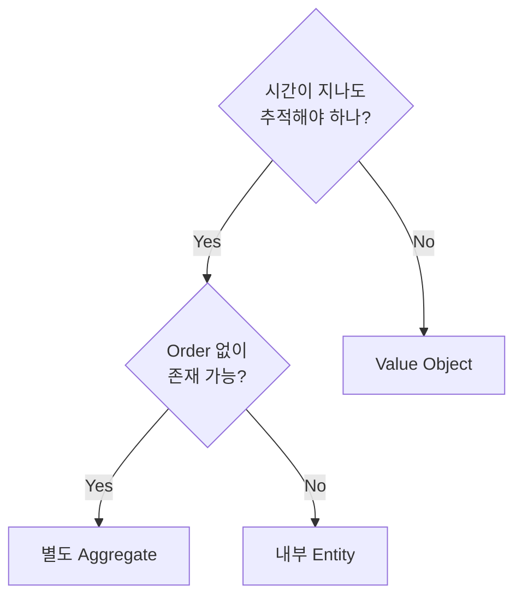
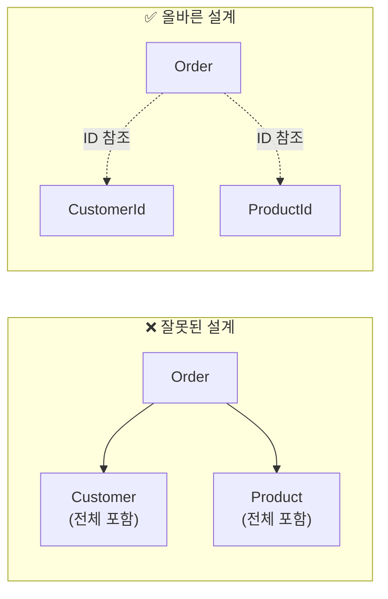
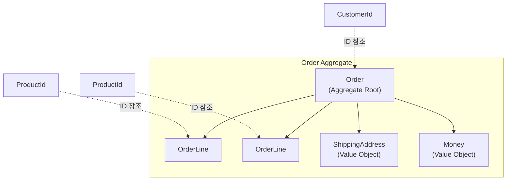

# 주문 도메인 구현

{}
- **Order**: Aggregate Root. 주문의 일관성 경계를 관리
- **OrderLine**: 내부 Entity. Order를 통해서만 생성/변경 가능
- **Money, ShippingAddress, OrderId**: Value Object. 불변이며 값으로 비교
- **불변식**: 주문 항목 1개 이상, 최대 금액 1억원, 수량 1~999
- **도메인 이벤트**: OrderCreatedEvent, OrderConfirmedEvent 등 상태 변경 시 발행
{}

## 대상 독자 및 선수 지식

| 항목 | 요구 수준 |
|------|----------|
| **대상 독자** | DDD 전술적 패턴을 코드로 구현하려는 개발자 |
| **DDD 기초** | Aggregate, Entity, Value Object, Domain Event 개념 이해 |
| **Java** | Record, Optional, Stream API 사용 경험 |
| **선수 문서** | [프로젝트 설정](setup/) 완료 |

DDD 패턴을 적용하여 주문 도메인을 구현합니다.

> **이 페이지 예제의 공통 import:**
> ```java
> import java.util.*;
> import java.time.LocalDateTime;
> import java.math.BigDecimal;
> // 도메인 클래스는 이 문서 내에서 정의됩니다
> ```

## 왜 이렇게 설계했는가?

코드를 보기 전에, 각 설계 결정의 **이유**를 먼저 이해합니다.

### 설계 결정 요약

| 요소 | 결정 | 이유 |
|------|------|------|
| **Order** | Aggregate Root | 주문의 일관성 경계. 모든 변경은 Order를 통해서만 |
| **OrderLine** | 내부 Entity | 수량 변경이 필요하지만, Order 없이 존재할 수 없음 |
| **Money** | Value Object | 금액은 불변이며, 값으로 비교 (10000원 == 10000원) |
| **ShippingAddress** | Value Object | 주소는 전체가 하나의 의미 단위, 부분 변경 불가 |
| **OrderId** | Value Object | ID는 변경되지 않으며, 값으로 비교 |
| **CustomerId** | ID 참조 | Customer는 별도 Aggregate, 직접 포함하면 경계 위반 |

### Value Object vs Entity: 어떻게 구분했나?



> **다이어그램 설명**: Entity vs Value Object 판단 흐름도입니다. "시간이 지나도 추적해야 하나?" 질문에 No면 Value Object, Yes면 "Order 없이 존재 가능한가?" 추가 질문으로 Yes면 별도 Aggregate, No면 내부 Entity로 결정합니다.

**Money가 Value Object인 이유:**
- "10,000원"과 "10,000원"은 **같은 돈**입니다 (값으로 비교)
- 금액을 "수정"하는 게 아니라 **새 금액으로 교체**합니다
- 금액의 변경 이력을 추적할 필요가 없습니다

**OrderLine이 Entity인 이유:**
- 같은 상품을 담아도 "첫 번째 항목"과 "두 번째 항목"은 **다릅니다** (ID로 구분)
- 수량을 **변경**할 수 있어야 합니다 (상태 변경 추적)
- 하지만 Order 없이는 존재할 수 없으므로 내부 Entity입니다

### Aggregate 경계: 왜 Order만 Root인가?



> **다이어그램 설명**: 왼쪽은 잘못된 설계로 Order가 Customer와 Product 전체를 포함합니다. 오른쪽은 올바른 설계로 Order가 CustomerId, ProductId만 참조합니다. 다른 Aggregate는 ID로만 참조해야 합니다.

**Customer를 ID로만 참조하는 이유:**
- Customer는 주문과 **독립적인 생명주기**를 가집니다
- 주문을 저장할 때 고객 정보 전체를 함께 저장하면 **데이터 중복**
- 고객 정보 변경 시 모든 주문의 고객 정보도 변경해야 하는 **일관성 문제**

**ProductId만 참조하는 이유:**
- 상품 가격이 변경되어도 **주문 당시 가격**은 유지되어야 합니다
- 그래서 OrderLine에 `price`를 **스냅샷**으로 저장합니다

### 불변식(Invariant): 무엇을 보호하는가?

Order Aggregate가 **항상 보장**하는 규칙들입니다:

| 불변식 | 코드 위치 | 비즈니스 이유 |
|--------|----------|--------------|
| 주문 항목 1개 이상 | `Order.create()` | 빈 주문은 의미 없음 |
| 최대 금액 1억원 | `addOrderLineInternal()` | 결제 한도, 사기 방지 |
| 수량 1~999 | `OrderLine.validateQuantity()` | 재고 관리, 이상 거래 방지 |
| PENDING에서만 변경 | 각 비즈니스 메서드 | 확정 후 변경 방지 |

### 패키지 프라이빗 생성자: 왜 필요한가?

```java
// ❌ public 생성자 → 누구나 생성 가능
public OrderLine(ProductId productId, ...) { }

// ✅ 패키지 프라이빗 → Order만 생성 가능
OrderLine(ProductId productId, ...) { }
```

**이유:** OrderLine은 Order 없이 존재할 수 없습니다. 패키지 프라이빗으로 만들면 **컴파일 타임에 잘못된 사용을 방지**합니다.

{}
- **Aggregate 경계**: 일관성이 보장되어야 하는 범위. Order + OrderLine이 하나의 경계
- **ID 참조**: 다른 Aggregate(Customer, Product)는 객체가 아닌 ID로만 참조
- **Value Object**: 불변, 값으로 비교, 교체만 가능 (Money, Address)
- **내부 Entity**: Aggregate 내에서만 존재, Root를 통해서만 접근 (OrderLine)
{}

---

## 도메인 모델 설계

### Order Aggregate 구조



> **다이어그램 설명**: Order Aggregate 내부 구조입니다. Order(Aggregate Root)가 OrderLine들, ShippingAddress(VO), Money(VO)를 포함합니다. CustomerId와 ProductId는 점선으로 표시된 것처럼 외부 참조(ID만)입니다.

## Value Object 구현

### OrderId

```java
package com.example.order.domain.model;

import java.util.Objects;
import java.util.UUID;

public record OrderId(String value) {

    public OrderId {
        Objects.requireNonNull(value, "OrderId는 null일 수 없습니다");
        if (value.isBlank()) {
            throw new IllegalArgumentException("OrderId는 빈 값일 수 없습니다");
        }
    }

    public static OrderId generate() {
        return new OrderId("ORD-" + UUID.randomUUID().toString().substring(0, 8).toUpperCase());
    }

    public static OrderId of(String value) {
        return new OrderId(value);
    }

    @Override
    public String toString() {
        return value;
    }
}
```

### Money

```java
package com.example.order.domain.model;

import java.math.BigDecimal;
import java.math.RoundingMode;
import java.util.Currency;
import java.util.Objects;

public record Money(BigDecimal amount, Currency currency) {

    public static final Money ZERO = Money.won(0);

    public Money {
        Objects.requireNonNull(amount, "금액은 필수입니다");
        Objects.requireNonNull(currency, "통화는 필수입니다");
        if (amount.compareTo(BigDecimal.ZERO) < 0) {
            throw new IllegalArgumentException("금액은 0 이상이어야 합니다: " + amount);
        }
        amount = amount.setScale(0, RoundingMode.HALF_UP);
    }

    // 팩토리 메서드
    public static Money won(long amount) {
        return new Money(BigDecimal.valueOf(amount), Currency.getInstance("KRW"));
    }

    public static Money won(BigDecimal amount) {
        return new Money(amount, Currency.getInstance("KRW"));
    }

    // 연산
    public Money add(Money other) {
        validateSameCurrency(other);
        return new Money(this.amount.add(other.amount), this.currency);
    }

    public Money subtract(Money other) {
        validateSameCurrency(other);
        BigDecimal result = this.amount.subtract(other.amount);
        if (result.compareTo(BigDecimal.ZERO) < 0) {
            throw new IllegalArgumentException("결과 금액이 음수가 됩니다");
        }
        return new Money(result, this.currency);
    }

    public Money multiply(int quantity) {
        if (quantity < 0) {
            throw new IllegalArgumentException("수량은 0 이상이어야 합니다");
        }
        return new Money(this.amount.multiply(BigDecimal.valueOf(quantity)), this.currency);
    }

    public Money multiply(BigDecimal rate) {
        return new Money(this.amount.multiply(rate), this.currency);
    }

    // 비교
    public boolean isGreaterThan(Money other) {
        validateSameCurrency(other);
        return this.amount.compareTo(other.amount) > 0;
    }

    public boolean isGreaterThanOrEqual(Money other) {
        validateSameCurrency(other);
        return this.amount.compareTo(other.amount) >= 0;
    }

    public boolean isZero() {
        return this.amount.compareTo(BigDecimal.ZERO) == 0;
    }

    private void validateSameCurrency(Money other) {
        if (!this.currency.equals(other.currency)) {
            throw new IllegalArgumentException(
                String.format("통화가 다릅니다: %s vs %s", this.currency, other.currency)
            );
        }
    }

    @Override
    public String toString() {
        return String.format("%s %s", currency.getSymbol(), amount.toPlainString());
    }
}
```

### ShippingAddress

```java
package com.example.order.domain.model;

import java.util.Objects;

public record ShippingAddress(
    String zipCode,
    String city,
    String street,
    String detail,
    String receiverName,
    String receiverPhone
) {

    public ShippingAddress {
        Objects.requireNonNull(zipCode, "우편번호는 필수입니다");
        Objects.requireNonNull(city, "도시는 필수입니다");
        Objects.requireNonNull(street, "도로명은 필수입니다");
        Objects.requireNonNull(receiverName, "수령인 이름은 필수입니다");
        Objects.requireNonNull(receiverPhone, "수령인 전화번호는 필수입니다");

        if (!zipCode.matches("\\d{5}")) {
            throw new IllegalArgumentException("우편번호는 5자리 숫자여야 합니다: " + zipCode);
        }

        if (!receiverPhone.matches("\\d{2,3}-\\d{3,4}-\\d{4}")) {
            throw new IllegalArgumentException("전화번호 형식이 올바르지 않습니다: " + receiverPhone);
        }
    }

    public String fullAddress() {
        String base = String.format("(%s) %s %s", zipCode, city, street);
        return detail != null && !detail.isBlank()
            ? base + " " + detail
            : base;
    }

    public String receiverInfo() {
        return String.format("%s (%s)", receiverName, receiverPhone);
    }
}
```

{}
- **Java Record 활용**: 불변성, equals/hashCode 자동 생성
- **Compact Constructor**: 유효성 검증을 생성자에서 수행
- **팩토리 메서드**: `Money.won(10000)`, `OrderId.generate()` 등 명확한 생성 방법 제공
- **도메인 연산**: `Money.add()`, `Money.multiply()` 등 도메인 로직을 VO 내부에 캡슐화
{}

## Entity 구현

### OrderLine (내부 Entity)

```java
package com.example.order.domain.model;

import java.util.Objects;
import java.util.UUID;

public class OrderLine extends Entity<OrderLineId> {

    private final OrderLineId id;
    private final ProductId productId;
    private final String productName;
    private final Money price;
    private int quantity;

    // 생성자 (패키지 프라이빗 - Order를 통해서만 생성)
    OrderLine(ProductId productId, String productName, Money price, int quantity) {
        validateQuantity(quantity);
        Objects.requireNonNull(productId, "상품 ID는 필수입니다");
        Objects.requireNonNull(productName, "상품명은 필수입니다");
        Objects.requireNonNull(price, "가격은 필수입니다");

        this.id = OrderLineId.generate();
        this.productId = productId;
        this.productName = productName;
        this.price = price;
        this.quantity = quantity;
    }

    @Override
    public OrderLineId getId() {
        return id;
    }

    public ProductId getProductId() {
        return productId;
    }

    public String getProductName() {
        return productName;
    }

    public Money getPrice() {
        return price;
    }

    public int getQuantity() {
        return quantity;
    }

    // 주문 항목 금액 계산
    public Money getAmount() {
        return price.multiply(quantity);
    }

    // 수량 변경 (Order를 통해서만 호출)
    void changeQuantity(int newQuantity) {
        validateQuantity(newQuantity);
        this.quantity = newQuantity;
    }

    private void validateQuantity(int quantity) {
        if (quantity <= 0) {
            throw new IllegalArgumentException("수량은 1 이상이어야 합니다: " + quantity);
        }
        if (quantity > 999) {
            throw new IllegalArgumentException("수량은 999 이하여야 합니다: " + quantity);
        }
    }

    // DB에서 복원 (패키지 프라이빗 - Mapper에서만 사용)
    static OrderLine reconstitute(
        OrderLineId id,
        ProductId productId,
        String productName,
        Money price,
        int quantity
    ) {
        // 복원 전용 private 생성자 호출
        return new OrderLine(id, productId, productName, price, quantity);
    }

    // 복원 전용 private 생성자
    private OrderLine(OrderLineId id, ProductId productId, String productName, Money price, int quantity) {
        this.id = id;
        this.productId = productId;
        this.productName = productName;
        this.price = price;
        this.quantity = quantity;
    }
}

// OrderLineId
public record OrderLineId(String value) {
    public static OrderLineId generate() {
        return new OrderLineId(UUID.randomUUID().toString());
    }

    public static OrderLineId of(String value) {
        return new OrderLineId(value);
    }
}
```

{}
- **패키지 프라이빗 생성자**: Aggregate Root를 통해서만 생성 가능하도록 제한
- **불변식 검증**: `validateQuantity()`로 수량 제약(1~999) 강제
- **reconstitute 메서드**: DB 복원용 별도 메서드로 유효성 검증 우회
- **상태 변경 메서드**: `changeQuantity()`도 패키지 프라이빗으로 Root만 호출 가능
{}

## Aggregate Root 구현

### Order

```java
package com.example.order.domain.model;

import com.example.order.domain.event.OrderCancelledEvent;
import com.example.order.domain.event.OrderConfirmedEvent;
import com.example.order.domain.event.OrderCreatedEvent;
import com.example.order.domain.exception.IllegalOrderStateException;

import java.time.LocalDateTime;
import java.util.ArrayList;
import java.util.Collections;
import java.util.List;
import java.util.Objects;

public class Order extends AggregateRoot<OrderId> {

    private static final int MAX_ORDER_LINES = 100;
    private static final Money MAX_ORDER_AMOUNT = Money.won(100_000_000);

    private final OrderId id;
    private final CustomerId customerId;
    private final List<OrderLine> orderLines;
    private ShippingAddress shippingAddress;
    private OrderStatus status;
    private Money totalAmount;
    private final LocalDateTime createdAt;
    private LocalDateTime confirmedAt;
    private LocalDateTime cancelledAt;
    private String cancellationReason;

    // private 생성자
    private Order(OrderId id, CustomerId customerId, ShippingAddress shippingAddress) {
        this.id = id;
        this.customerId = customerId;
        this.orderLines = new ArrayList<>();
        this.shippingAddress = shippingAddress;
        this.status = OrderStatus.PENDING;
        this.totalAmount = Money.ZERO;
        this.createdAt = LocalDateTime.now();
    }

    // 팩토리 메서드: 새 주문 생성
    public static Order create(
        CustomerId customerId,
        ShippingAddress shippingAddress,
        List<OrderLineRequest> lineRequests
    ) {
        Objects.requireNonNull(customerId, "고객 ID는 필수입니다");
        Objects.requireNonNull(shippingAddress, "배송지는 필수입니다");

        if (lineRequests == null || lineRequests.isEmpty()) {
            throw new IllegalArgumentException("주문 항목은 최소 1개 이상이어야 합니다");
        }

        Order order = new Order(OrderId.generate(), customerId, shippingAddress);

        for (OrderLineRequest request : lineRequests) {
            order.addOrderLineInternal(
                request.productId(),
                request.productName(),
                request.price(),
                request.quantity()
            );
        }

        order.registerEvent(new OrderCreatedEvent(order));
        return order;
    }

    // 팩토리 메서드: DB에서 복원
    public static Order reconstitute(
        OrderId id,
        CustomerId customerId,
        List<OrderLine> orderLines,
        ShippingAddress shippingAddress,
        OrderStatus status,
        Money totalAmount,
        LocalDateTime createdAt,
        LocalDateTime confirmedAt,
        LocalDateTime cancelledAt,
        String cancellationReason
    ) {
        Order order = new Order(id, customerId, shippingAddress);
        order.orderLines.addAll(orderLines);
        order.status = status;
        order.totalAmount = totalAmount;
        order.confirmedAt = confirmedAt;
        order.cancelledAt = cancelledAt;
        order.cancellationReason = cancellationReason;
        // 복원 시에는 이벤트 발행하지 않음
        return order;
    }

    // === 비즈니스 메서드 ===

    // 주문 확정
    public void confirm() {
        if (this.status != OrderStatus.PENDING) {
            throw new IllegalOrderStateException(
                String.format("PENDING 상태의 주문만 확정할 수 있습니다. 현재 상태: %s", this.status)
            );
        }

        this.status = OrderStatus.CONFIRMED;
        this.confirmedAt = LocalDateTime.now();

        registerEvent(new OrderConfirmedEvent(this));
    }

    // 주문 취소
    public void cancel(String reason) {
        if (!isCancellable()) {
            throw new IllegalOrderStateException(
                String.format("취소할 수 없는 상태입니다. 현재 상태: %s", this.status)
            );
        }

        this.status = OrderStatus.CANCELLED;
        this.cancelledAt = LocalDateTime.now();
        this.cancellationReason = reason;

        registerEvent(new OrderCancelledEvent(this.id, reason));
    }

    // 배송지 변경
    public void changeShippingAddress(ShippingAddress newAddress) {
        if (this.status != OrderStatus.PENDING) {
            throw new IllegalOrderStateException("PENDING 상태에서만 배송지를 변경할 수 있습니다");
        }

        Objects.requireNonNull(newAddress, "새 배송지는 필수입니다");
        this.shippingAddress = newAddress;
    }

    // 주문 항목 수량 변경
    public void changeOrderLineQuantity(OrderLineId lineId, int newQuantity) {
        if (this.status != OrderStatus.PENDING) {
            throw new IllegalOrderStateException("PENDING 상태에서만 수량을 변경할 수 있습니다");
        }

        OrderLine line = findOrderLine(lineId);
        line.changeQuantity(newQuantity);
        recalculateTotal();
    }

    // 주문 항목 제거
    public void removeOrderLine(OrderLineId lineId) {
        if (this.status != OrderStatus.PENDING) {
            throw new IllegalOrderStateException("PENDING 상태에서만 항목을 제거할 수 있습니다");
        }

        if (orderLines.size() <= 1) {
            throw new IllegalArgumentException("주문에는 최소 1개의 항목이 있어야 합니다");
        }

        orderLines.removeIf(line -> line.getId().equals(lineId));
        recalculateTotal();
    }

    // === 내부 메서드 ===

    private void addOrderLineInternal(ProductId productId, String name, Money price, int qty) {
        if (orderLines.size() >= MAX_ORDER_LINES) {
            throw new IllegalArgumentException(
                String.format("주문 항목은 최대 %d개까지 가능합니다", MAX_ORDER_LINES)
            );
        }

        OrderLine newLine = new OrderLine(productId, name, price, qty);
        orderLines.add(newLine);
        recalculateTotal();

        // 최대 금액 검증
        if (totalAmount.isGreaterThan(MAX_ORDER_AMOUNT)) {
            orderLines.remove(newLine);
            recalculateTotal();
            throw new IllegalArgumentException(
                String.format("주문 총액이 최대 금액(%s)을 초과합니다", MAX_ORDER_AMOUNT)
            );
        }
    }

    private void recalculateTotal() {
        this.totalAmount = orderLines.stream()
            .map(OrderLine::getAmount)
            .reduce(Money.ZERO, Money::add);
    }

    private OrderLine findOrderLine(OrderLineId lineId) {
        return orderLines.stream()
            .filter(line -> line.getId().equals(lineId))
            .findFirst()
            .orElseThrow(() -> new IllegalArgumentException(
                "주문 항목을 찾을 수 없습니다: " + lineId
            ));
    }

    private boolean isCancellable() {
        return this.status == OrderStatus.PENDING
            || this.status == OrderStatus.CONFIRMED;
    }

    // === Getter ===

    @Override
    public OrderId getId() {
        return id;
    }

    public CustomerId getCustomerId() {
        return customerId;
    }

    public List<OrderLine> getOrderLines() {
        return Collections.unmodifiableList(orderLines);
    }

    public ShippingAddress getShippingAddress() {
        return shippingAddress;
    }

    public OrderStatus getStatus() {
        return status;
    }

    public Money getTotalAmount() {
        return totalAmount;
    }

    public LocalDateTime getCreatedAt() {
        return createdAt;
    }

    public LocalDateTime getConfirmedAt() {
        return confirmedAt;
    }

    public LocalDateTime getCancelledAt() {
        return cancelledAt;
    }

    public String getCancellationReason() {
        return cancellationReason;
    }
}

// 주문 생성 요청 DTO
public record OrderLineRequest(
    ProductId productId,
    String productName,
    Money price,
    int quantity
) {}
```

### OrderStatus

```java
package com.example.order.domain.model;

public enum OrderStatus {
    PENDING("대기중"),
    CONFIRMED("확정됨"),
    SHIPPED("배송중"),
    DELIVERED("배송완료"),
    CANCELLED("취소됨");

    private final String description;

    OrderStatus(String description) {
        this.description = description;
    }

    public String getDescription() {
        return description;
    }
}
```

{}
- **팩토리 메서드**: `Order.create()`로 생성, `Order.reconstitute()`로 복원
- **불변식 보장**: 모든 비즈니스 규칙(최대 금액, 최소 항목 수)을 내부에서 검증
- **상태 전이 제어**: `confirm()`, `cancel()` 등 상태별 허용 동작 제한
- **이벤트 발행**: 상태 변경 시 `registerEvent()`로 도메인 이벤트 수집
- **캡슐화**: `getOrderLines()`는 불변 리스트 반환으로 외부 변경 방지
{}

## 도메인 이벤트 구현

### OrderCreatedEvent

```java
package com.example.order.domain.event;

import com.example.order.domain.model.*;

import java.util.List;

public class OrderCreatedEvent extends DomainEvent {

    private final OrderId orderId;
    private final CustomerId customerId;
    private final Money totalAmount;
    private final List<OrderLineSnapshot> orderLines;
    private final ShippingAddress shippingAddress;

    public OrderCreatedEvent(Order order) {
        super();
        this.orderId = order.getId();
        this.customerId = order.getCustomerId();
        this.totalAmount = order.getTotalAmount();
        this.orderLines = order.getOrderLines().stream()
            .map(OrderLineSnapshot::from)
            .toList();
        this.shippingAddress = order.getShippingAddress();
    }

    @Override
    public String getAggregateId() {
        return orderId.value();
    }

    // Getters...

    public record OrderLineSnapshot(
        ProductId productId,
        String productName,
        int quantity,
        Money amount
    ) {
        public static OrderLineSnapshot from(OrderLine line) {
            return new OrderLineSnapshot(
                line.getProductId(),
                line.getProductName(),
                line.getQuantity(),
                line.getAmount()
            );
        }
    }
}
```

### OrderConfirmedEvent

```java
package com.example.order.domain.event;

import com.example.order.domain.model.*;

import java.time.LocalDateTime;
import java.util.List;

public class OrderConfirmedEvent extends DomainEvent {

    private final OrderId orderId;
    private final CustomerId customerId;
    private final Money totalAmount;
    private final List<OrderLineSnapshot> orderLines;
    private final LocalDateTime confirmedAt;

    public OrderConfirmedEvent(Order order) {
        super();
        this.orderId = order.getId();
        this.customerId = order.getCustomerId();
        this.totalAmount = order.getTotalAmount();
        this.orderLines = order.getOrderLines().stream()
            .map(line -> new OrderLineSnapshot(
                line.getProductId(),
                line.getQuantity()
            ))
            .toList();
        this.confirmedAt = order.getConfirmedAt();
    }

    @Override
    public String getAggregateId() {
        return orderId.value();
    }

    // Getters...

    public record OrderLineSnapshot(
        ProductId productId,
        int quantity
    ) {}
}
```

{}
- **불변 스냅샷**: 이벤트 발행 시점의 상태를 스냅샷으로 저장
- **자동 메타데이터**: eventId, occurredAt은 부모 클래스에서 자동 생성
- **Aggregate ID**: `getAggregateId()`로 어떤 Aggregate에서 발생했는지 식별
- **Inner Record**: `OrderLineSnapshot` 등으로 이벤트 전용 데이터 구조 정의
{}

## Repository 인터페이스

```java
package com.example.order.domain.repository;

import com.example.order.domain.model.*;

import java.util.List;
import java.util.Optional;

public interface OrderRepository {

    Order save(Order order);

    Optional<Order> findById(OrderId id);

    List<Order> findByCustomerId(CustomerId customerId);

    List<Order> findByStatus(OrderStatus status);

    boolean existsById(OrderId id);
}
```

## 단위 테스트

```java
package com.example.order.domain.model;

import org.junit.jupiter.api.DisplayName;
import org.junit.jupiter.api.Nested;
import org.junit.jupiter.api.Test;

import java.util.List;

import static org.assertj.core.api.Assertions.*;

class OrderTest {

    @Nested
    @DisplayName("주문 생성")
    class CreateOrder {

        @Test
        @DisplayName("유효한 정보로 주문을 생성할 수 있다")
        void createWithValidData() {
            // given
            var customerId = CustomerId.of("CUST-001");
            var address = new ShippingAddress(
                "12345", "서울시", "강남대로 123", "101호",
                "홍길동", "010-1234-5678"
            );
            var lineRequests = List.of(
                new OrderLineRequest(
                    ProductId.of("PROD-001"),
                    "상품1",
                    Money.won(10000),
                    2
                )
            );

            // when
            Order order = Order.create(customerId, address, lineRequests);

            // then
            assertThat(order.getId()).isNotNull();
            assertThat(order.getStatus()).isEqualTo(OrderStatus.PENDING);
            assertThat(order.getTotalAmount()).isEqualTo(Money.won(20000));
            assertThat(order.getOrderLines()).hasSize(1);
            assertThat(order.getDomainEvents()).hasSize(1);
            assertThat(order.getDomainEvents().get(0)).isInstanceOf(OrderCreatedEvent.class);
        }

        @Test
        @DisplayName("주문 항목 없이 생성하면 예외가 발생한다")
        void failWithEmptyOrderLines() {
            // given
            var customerId = CustomerId.of("CUST-001");
            var address = createValidAddress();

            // when & then
            assertThatThrownBy(() -> Order.create(customerId, address, List.of()))
                .isInstanceOf(IllegalArgumentException.class)
                .hasMessageContaining("최소 1개");
        }
    }

    @Nested
    @DisplayName("주문 확정")
    class ConfirmOrder {

        @Test
        @DisplayName("PENDING 상태의 주문을 확정할 수 있다")
        void confirmPendingOrder() {
            // given
            Order order = createPendingOrder();

            // when
            order.confirm();

            // then
            assertThat(order.getStatus()).isEqualTo(OrderStatus.CONFIRMED);
            assertThat(order.getConfirmedAt()).isNotNull();
        }

        @Test
        @DisplayName("이미 확정된 주문은 다시 확정할 수 없다")
        void cannotConfirmAlreadyConfirmed() {
            // given
            Order order = createPendingOrder();
            order.confirm();

            // when & then
            assertThatThrownBy(order::confirm)
                .isInstanceOf(IllegalOrderStateException.class)
                .hasMessageContaining("PENDING");
        }
    }

    @Nested
    @DisplayName("주문 취소")
    class CancelOrder {

        @Test
        @DisplayName("PENDING 상태의 주문을 취소할 수 있다")
        void cancelPendingOrder() {
            // given
            Order order = createPendingOrder();

            // when
            order.cancel("단순 변심");

            // then
            assertThat(order.getStatus()).isEqualTo(OrderStatus.CANCELLED);
            assertThat(order.getCancellationReason()).isEqualTo("단순 변심");
        }

        @Test
        @DisplayName("CONFIRMED 상태의 주문을 취소할 수 있다")
        void cancelConfirmedOrder() {
            // given
            Order order = createPendingOrder();
            order.confirm();

            // when
            order.cancel("재고 부족");

            // then
            assertThat(order.getStatus()).isEqualTo(OrderStatus.CANCELLED);
        }
    }

    // Helper methods
    private Order createPendingOrder() {
        return Order.create(
            CustomerId.of("CUST-001"),
            createValidAddress(),
            List.of(new OrderLineRequest(
                ProductId.of("PROD-001"),
                "상품1",
                Money.won(10000),
                1
            ))
        );
    }

    private ShippingAddress createValidAddress() {
        return new ShippingAddress(
            "12345", "서울시", "강남대로 123", "101호",
            "홍길동", "010-1234-5678"
        );
    }
}
```

{}
- **@Nested**: 테스트를 기능별로 그룹화 (주문 생성, 주문 확정, 주문 취소)
- **@DisplayName**: 한글로 테스트 의도 명시
- **Given-When-Then**: 테스트 구조를 명확하게 분리
- **이벤트 검증**: `getDomainEvents()`로 발행된 이벤트 확인
- **예외 검증**: `assertThatThrownBy()`로 비즈니스 규칙 위반 테스트
{}

## 트러블슈팅

### 문제: "Entity에서 다른 Aggregate를 조회해야 합니다"

**증상**: Order 내부에서 Customer나 Product 정보가 필요함

**원인**: Aggregate 경계를 넘어 다른 객체를 참조하려고 함

**해결 방법**:
1. 필요한 정보를 서비스 레이어에서 조회하여 전달하라
2. 조회용 정보는 스냅샷으로 저장하라

```java
// ❌ Aggregate 내부에서 Repository 호출
public class Order {
    public void validate() {
        Customer customer = customerRepository.findById(customerId); // 안 됨!
    }
}

// ✅ 서비스에서 조회 후 전달
@Service
public class OrderApplicationService {
    public void createOrder(CreateOrderCommand cmd) {
        Customer customer = customerRepository.findById(cmd.customerId());
        Money discount = discountPolicy.calculate(customer.getGrade());

        Order order = Order.create(
            cmd.customerId(),
            customer.getName(),  // 표시용 스냅샷
            discount,
            cmd.orderLines()
        );
    }
}
```

---

### 문제: "Record 생성자에서 유효성 검증이 실패합니다"

**증상**: `Money` 생성 시 `NullPointerException` 또는 검증 오류

**원인**: Compact Constructor에서 파라미터 재할당 문법 오류

**해결 방법**:

```java
// ❌ 잘못된 재할당 (this. 사용)
public record Money(BigDecimal amount, Currency currency) {
    public Money {
        this.amount = amount.setScale(0); // 컴파일 오류!
    }
}

// ✅ 올바른 재할당 (변수명만 사용)
public record Money(BigDecimal amount, Currency currency) {
    public Money {
        Objects.requireNonNull(amount);
        amount = amount.setScale(0, RoundingMode.HALF_UP);
    }
}
```

---

### 문제: "JPA로 Aggregate를 저장할 때 OrderLine이 저장되지 않습니다"

**증상**: Order는 저장되지만 OrderLine 테이블이 비어있음

**원인**: JPA cascade 설정 누락 또는 연관관계 매핑 오류

**해결 방법**:

```java
@Entity
@Table(name = "orders")
public class OrderJpaEntity {

    @OneToMany(cascade = CascadeType.ALL, orphanRemoval = true)
    @JoinColumn(name = "order_id")
    private List<OrderLineJpaEntity> orderLines = new ArrayList<>();

    // Order 도메인 모델과 매핑
    public static OrderJpaEntity fromDomain(Order order) {
        OrderJpaEntity entity = new OrderJpaEntity();
        entity.id = order.getId().value();
        entity.orderLines = order.getOrderLines().stream()
            .map(OrderLineJpaEntity::fromDomain)
            .collect(toList());
        entity.orderLines.forEach(line -> line.setOrder(entity));
        return entity;
    }
}
```

---

### 문제: "도메인 이벤트가 발행되지 않습니다"

**증상**: `@EventListener`가 호출되지 않음

**원인**: 이벤트가 등록만 되고 실제 발행되지 않음

**해결 방법**:

```java
@Service
@Transactional
public class OrderApplicationService {

    private final ApplicationEventPublisher eventPublisher;

    public void confirmOrder(OrderId orderId) {
        Order order = orderRepository.findById(orderId).orElseThrow();
        order.confirm();
        orderRepository.save(order);

        // 수집된 이벤트 발행
        order.getDomainEvents().forEach(eventPublisher::publishEvent);
        order.clearDomainEvents();
    }
}
```

또는 Spring Data JPA의 `@DomainEvents` 어노테이션을 활용하라:

```java
public abstract class AggregateRoot<ID> {

    @Transient
    private final List<DomainEvent> domainEvents = new ArrayList<>();

    @DomainEvents
    public Collection<DomainEvent> domainEvents() {
        return Collections.unmodifiableList(domainEvents);
    }

    @AfterDomainEventPublication
    public void clearDomainEvents() {
        domainEvents.clear();
    }
}
```

## 다음 단계

- [애플리케이션 계층](application-layer/) - Use Case와 서비스 구현
