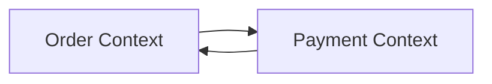
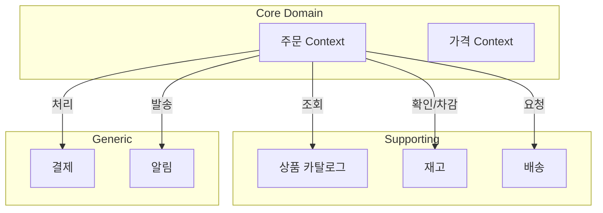

> **해결하는 문제**: 시스템을 어떻게 나눠야 할지 모르거나, Context 경계를 잘못 정해서 팀 간 의존성이 높아진 상황
> **소요 시간**: 약 25분
> **전제 조건**: [전략적 설계](../concepts/strategic-design/) 문서를 읽었다고 가정


이 가이드를 완료하면 다음을 할 수 있습니다:
- 3가지 신호로 Context 경계를 식별
- 도메인 전문가 인터뷰로 경계 검증
- 잘못된 경계의 증상을 인식하고 수정


## 1. Context 경계가 필요한 신호 감지하기

다음 3가지 신호를 확인하여 Bounded Context 분리가 필요한지 판단하세요.

### 1.1 신호 1: 같은 용어, 다른 의미

도메인 전문가와 대화할 때 "그 X 말고 다른 X요"라는 말이 나오면 Context 분리 신호입니다. 이 신호를 포착하세요.

```
// 실제 대화 예시

개발자: "상품 정보를 수정하려면 어떤 필드가 필요하죠?"

상품팀: "상품명, 가격, 설명, 이미지요."

물류팀: "아, 상품이요? 무게, 부피, 보관 온도가 필요합니다."

개발자: "둘 다 '상품'인데 전혀 다른 속성이네요..."
```


"그 X 말고요"라는 말이 나오면 즉시 메모하세요. 이것이 Context 분리의 핵심 단서입니다.


이런 경우 다음과 같이 기록하세요:

| 용어 | 판매 Context에서의 의미 | 물류 Context에서의 의미 |
|------|------------------------|------------------------|
| 상품 | 고객에게 보여줄 정보 (이름, 가격, 이미지) | 배송에 필요한 정보 (무게, 부피, 온도) |
| 주문 | 고객의 구매 요청 | 출고 지시서 |
| 고객 | 구매자 | 수령인 |

### 1.2 신호 2: 다른 변경 주기

같은 데이터라도 변경 빈도가 다르면 별도 Context로 분리하세요.

```
// 변경 주기 분석 예시

상품 기본 정보:
├── 상품명: 거의 변경 안 함 (연 1-2회)
├── 가격: 자주 변경 (주 1-2회)
└── 재고: 매우 자주 변경 (분 단위)

→ 가격과 재고는 별도 Context로 분리 고려
```

### 1.3 신호 3: 다른 팀이 담당

Conway's Law에 따르면 시스템 구조는 조직 구조를 따릅니다. 다음과 같이 조직 구조를 참고하여 Context를 나누세요.

```
조직 구조:
├── 판매팀 → Sales Context
├── 물류팀 → Logistics Context
├── 정산팀 → Billing Context
└── CS팀 → Support Context
```

**확인 질문 목록**:

- [ ] 이 기능은 어느 팀이 책임지는가?
- [ ] 이 기능을 변경하려면 어느 팀의 승인이 필요한가?
- [ ] 장애가 나면 어느 팀이 대응하는가?

## 2. 도메인 전문가 인터뷰로 경계 발견하기

### 2.1 인터뷰 질문 템플릿

도메인 전문가에게 다음 질문을 순서대로 하세요:

**1단계: 핵심 비즈니스 프로세스 파악**

```
"가장 중요한 업무 프로세스를 설명해주세요."
"하루 업무를 시작부터 끝까지 말씀해주세요."
"가장 바쁜 시간대에 무슨 일을 하시나요?"
```

**2단계: 용어 수집**

```
"방금 말씀하신 '주문'이란 정확히 무엇인가요?"
"'주문'과 '오더'를 같은 의미로 쓰시나요, 다른 의미로 쓰시나요?"
"다른 팀에서도 '주문'을 같은 의미로 쓰나요?"
```

**3단계: 경계 확인**

```
"이 업무를 할 때 다른 팀과 협업하시나요?"
"다른 팀에서 어떤 정보를 받아오시나요?"
"다른 팀에 어떤 정보를 전달하시나요?"
```

### 2.2 인터뷰 결과 정리하기

인터뷰 결과를 다음 형식으로 정리하세요:

```
Context 후보: 주문 처리 (Order Processing)

담당 팀: 영업팀

핵심 용어:
├── 주문 (Order): 고객의 구매 요청
├── 주문항목 (Order Line): 주문 내 개별 상품
└── 배송지 (Shipping Address): 상품 수령 장소

주요 행위:
├── 주문 생성
├── 주문 확정
├── 주문 취소
└── 배송지 변경

협업 Context:
├── 상품 카탈로그 → 상품 정보 조회
├── 재고 → 재고 확인/차감
└── 배송 → 배송 요청
```

## 3. Context 경계 검증하기

### 3.1 경계 검증 체크리스트

다음 질문에 모두 "예"로 답할 수 있는지 확인하세요. 하나라도 "아니오"면 경계를 재검토하세요:

**언어적 일관성**:
- [ ] 이 Context 내에서 모든 용어가 일관된 의미를 가지는가?
- [ ] 외부와 의미가 다른 용어는 명확히 구분되어 있는가?

**책임 명확성**:
- [ ] 이 Context의 담당 팀이 명확한가?
- [ ] 변경 결정권이 단일 팀에 있는가?

**독립성**:
- [ ] 다른 Context 변경 없이 이 Context를 변경할 수 있는가?
- [ ] 다른 Context 배포 없이 이 Context를 배포할 수 있는가?

### 3.2 경계가 잘못된 증상


다음 증상이 보이면 즉시 경계를 재검토하세요. 이 증상들은 잘못된 Context 분리의 명확한 신호입니다.


다음 증상이 보이면 경계를 재검토하세요:

**증상 1: 순환 의존**



*Order Context와 Payment Context 사이의 순환 의존 문제를 보여주며, 합치거나 이벤트 기반으로 분리해야 합니다.*

**해결**: 둘 중 하나로 합치거나, 이벤트 기반으로 분리하세요.

**증상 2: 과도한 동기 호출**

```java
// ❌ 잘못된 예: 동기 호출 체인
public void confirmOrder(OrderId orderId) {
    Order order = orderRepository.findById(orderId);
    Stock stock = stockService.checkStock(order);      // 동기 호출 1
    Payment payment = paymentService.process(order);   // 동기 호출 2
    Shipping shipping = shippingService.create(order); // 동기 호출 3
    order.confirm();
}
```

**해결**: 이벤트 기반 비동기 처리로 전환하세요.

**증상 3: 분산 트랜잭션 필요**

여러 Context의 데이터를 하나의 트랜잭션으로 묶어야 한다면 경계를 다시 검토하세요.

```java
// ❌ 잘못된 예: 분산 트랜잭션
@Transactional
public void confirmOrder(OrderId orderId) {
    orderRepository.save(order);      // Order DB
    stockRepository.decrease(stock);  // Stock DB (다른 Context)
    pointRepository.add(points);      // Point DB (또 다른 Context)
}
```

## 4. Context 경계 시각화하기

### 4.1 Context Map 그리기

발견한 Context와 관계를 다이어그램으로 표현하세요:



*발견한 Context들의 Context Map으로, Core/Supporting/Generic 도메인과 통합 관계(조회, 확인, 요청 등)를 시각화합니다.*

### 4.2 Context별 용어 사전 작성하기

각 Context마다 용어 사전을 작성하세요:

```markdown
## 주문 Context 용어 사전

| 용어 | 정의 | 코드 | 다른 Context에서의 동의어 |
|------|------|------|-------------------------|
| 주문 | 고객의 구매 요청 | `Order` | 배송 Context: 출고요청 |
| 주문항목 | 주문 내 개별 상품 | `OrderLine` | - |
| 배송지 | 상품 수령 장소 | `ShippingAddress` | 배송 Context: 목적지 |
| 확정 | 주문을 처리 가능 상태로 변경 | `confirm()` | 재고 Context: 예약 확정 |
```

## 5. 점진적으로 Context 분리하기

### 5.1 모놀리스에서 시작하기


처음부터 마이크로서비스를 목표로 하지 마세요. 모놀리스 내에서 논리적 분리부터 시작하세요.


논리적 분리부터 시작하세요:

```
// 1단계: 패키지로 논리적 분리
src/main/java/com/example/
├── order/      // 주문 Context
├── catalog/    // 상품 카탈로그 Context
├── stock/      // 재고 Context
└── shipping/   // 배송 Context

// 각 Context는 자신의 Repository만 사용
order/
├── OrderService.java       // 다른 Context Repository 직접 사용 금지
├── OrderRepository.java
└── Order.java
```

### 5.2 점진적 분리 전략

**단계 1**: 패키지 분리 (논리적 경계)

```java
// 같은 모듈이지만 인터페이스로 분리
public interface ProductReader {
    ProductInfo getProduct(ProductId id);
}
```

**단계 2**: 모듈 분리 (컴파일 경계)

```groovy
// settings.gradle
include ':order-module'
include ':catalog-module'
include ':shared-kernel'
```

**단계 3**: 서비스 분리 (런타임 경계)

```yaml
# 별도 서비스로 배포
services:
  order-service:
    image: order-service:1.0
  catalog-service:
    image: catalog-service:1.0
```

## 트러블슈팅

### 문제: "Context 경계를 어디서 그어야 할지 모르겠습니다"

**해결 방법**:

1. 용어의 의미가 달라지는 지점을 찾으세요.
2. 팀 경계를 참고하세요.
3. 변경 주기가 다른 데이터를 분리하세요.

```
확인 질문:
- "이 용어를 다른 팀에서도 같은 의미로 사용하나요?"
- "이 기능을 변경하려면 어느 팀의 승인이 필요하나요?"
- "이 데이터는 얼마나 자주 변경되나요?"
```

---

### 문제: "Context가 너무 작아서 오버헤드가 큽니다"

**증상**: Context가 10개 이상, 간단한 기능도 여러 Context 호출 필요

**해결 방법**:

관련된 작은 Context들을 합치세요:

```
// Before: 과도한 분리
├── ProductInfo Context
├── ProductPrice Context
├── ProductStock Context
└── ProductImage Context

// After: 적절한 병합
├── Product Catalog Context (Info + Image)
├── Pricing Context
└── Inventory Context (Stock)
```

---

### 문제: "Context 간 데이터 동기화가 어렵습니다"

**해결 방법**:

이벤트 기반 동기화를 사용하세요:

```java
// 주문 Context에서 이벤트 발행
public class Order {
    public void confirm() {
        this.status = OrderStatus.CONFIRMED;
        registerEvent(new OrderConfirmedEvent(this.id, this.orderLines));
    }
}

// 재고 Context에서 이벤트 구독
@EventListener
public void handle(OrderConfirmedEvent event) {
    for (OrderLineInfo line : event.getOrderLines()) {
        Stock stock = stockRepository.findByProductId(line.getProductId());
        stock.decrease(line.getQuantity());
    }
}
```

## 다음 단계

- [전략적 설계](../concepts/strategic-design/) - Context Mapping 패턴 상세
- [Aggregate 경계 정하기](aggregate-boundaries/) - Context 내부 설계
- [이벤트 기반 아키텍처](../concepts/architecture/event-driven/) - Context 간 통신
