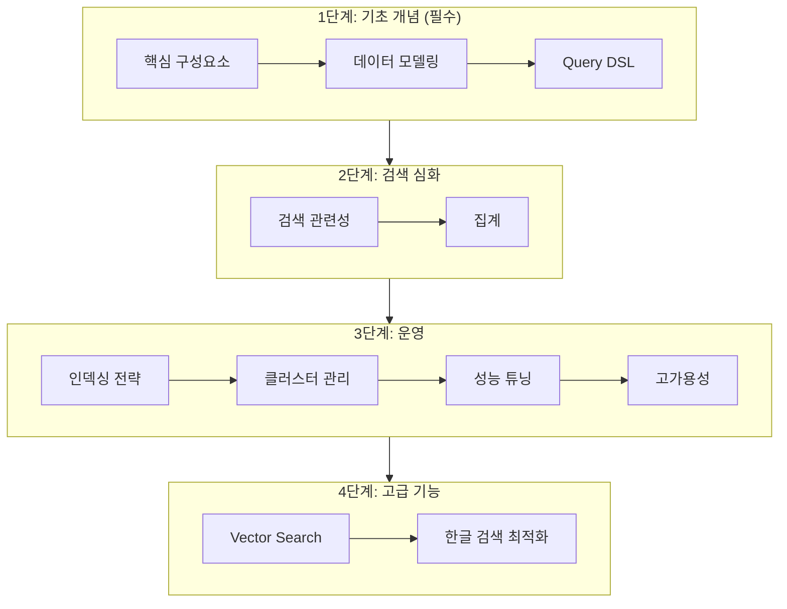


Elasticsearch는 **분산 검색 엔진**으로, 대용량 데이터를 여러 서버에 분산 저장하고 빠르게 검색합니다. 핵심 개념은 Cluster(서버 그룹), Index(데이터 모음), Document(개별 데이터), Shard(분산 저장 단위)입니다.


## 왜 개념 이해가 중요한가?

Elasticsearch를 사용할 때 이런 질문을 하게 됩니다:

- "왜 검색 결과가 바로 안 나오고 1초 정도 걸리지?" → **Near Real-Time** 개념
- "샤드 수를 몇 개로 해야 하지?" → **Shard** 개념
- "Yellow 상태인데 괜찮은 건가?" → **Cluster 상태** 개념
- "매핑을 왜 미리 정의해야 하지?" → **Mapping과 역색인** 개념

개념을 모르면 **설정을 복사-붙여넣기**만 하게 되고, 문제가 생기면 해결할 수 없습니다.

**대상 독자**: Elasticsearch를 처음 접하거나 깊이 이해하고 싶은 개발자

**선수 지식**: JSON 기본 문법, REST API 개념, 기본적인 데이터베이스 지식

## 전체 비유: 대형 도서관 시스템

Elasticsearch를 **대형 도서관 시스템**에 비유하면 이해하기 쉽습니다:

| 도서관 비유 | Elasticsearch | 역할 |
|------------|---------------|------|
| 도서관 체인 전체 | Cluster | 여러 지점을 묶어 관리하는 시스템 |
| 각 지점 건물 | Node | 실제 서버 (데이터 저장, 검색 처리) |
| 분야별 서가 (소설, 과학, 역사) | Index | 비슷한 종류의 데이터 모음 |
| 개별 책 한 권 | Document | JSON 형태의 개별 데이터 |
| 책이 여러 지점에 분산 배치 | Shard | 데이터를 조각내어 분산 저장 |
| 색인 카드 (단어→책 목록) | Inverted Index | 빠른 검색을 위한 역색인 |

이처럼 **분산 저장**하면 한 지점(노드)이 문을 닫아도 다른 지점에서 책을 찾을 수 있습니다.

## 학습 로드맵

*다이어그램: 기초 개념부터 시작하여 검색 심화, 운영, 고급 기능 순으로 학습합니다. 각 단계를 순서대로 진행하는 것을 권장합니다.*

## 학습 순서

### 1단계: 기초 개념 (필수)

기본 개념을 이해해야 이후 내용을 학습할 수 있습니다.

1. [핵심 구성요소]() - Cluster, Node, Index, Document, Shard의 역할과 관계
2. [데이터 모델링]() - Mapping 정의, Field Type 선택, Analyzer 이해
3. [Query DSL]() - Match, Term, Bool 쿼리로 데이터 검색

### 2단계: 검색 심화

검색 품질을 높이고 데이터를 분석합니다.

4. [검색 관련성]() - Score 계산 원리, BM25 알고리즘, Boosting
5. [집계]() - Bucket, Metric, Pipeline 집계로 데이터 분석

### 3단계: 운영

프로덕션 환경에서 안정적으로 운영합니다.

6. [인덱싱 전략]() - Bulk 인덱싱, Refresh 최적화, Index Lifecycle 관리
7. [클러스터 관리]() - 노드 구성, 샤드 할당, 클러스터 확장
8. [성능 튜닝]() - 쿼리 최적화, 캐싱 전략, 하드웨어 선택
9. [고가용성]() - Replica 설정, Snapshot 백업, 장애 대응

### 4단계: 고급 기능

특수한 요구사항을 해결합니다.

10. [Vector Search (kNN)]() - 시맨틱 검색, 유사 상품 추천, 임베딩 활용
11. [한글 검색 최적화]() - Nori 분석기, 자동완성, 초성 검색

## 핵심 개념 요약

| 개념 | 한 줄 설명 | 비유 |
|------|-----------|------|
| Cluster | 노드들의 집합 | 도서관 체인 전체 |
| Node | 단일 ES 서버 | 도서관 지점 건물 |
| Index | 문서들의 논리적 모음 | 분야별 서가 |
| Document | JSON 데이터 단위 | 책 한 권 |
| Shard | 인덱스의 물리적 분할 | 책의 분산 배치 |
| Mapping | 필드 타입 정의 | 도서 분류 규칙 |
| Inverted Index | 단어→문서 색인 | 색인 카드함 |
