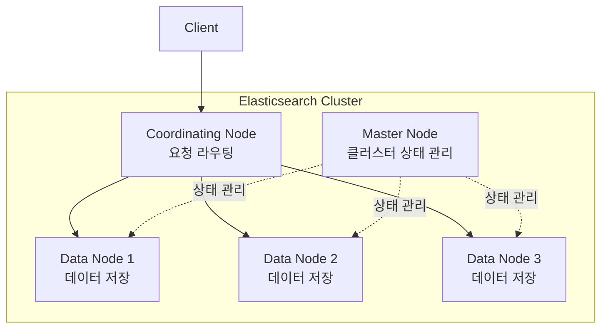

## 전체 비유: 도서관 체인 본사 운영

클러스터 관리를 **도서관 체인의 본사 운영**에 비유하면 이해하기 쉽습니다:

| 도서관 비유 | Elasticsearch | 역할 |
|------------|---------------|------|
| 체인 본사 (정책 결정) | Master Node | 클러스터 상태 관리, 인덱스 생성/삭제 결정 |
| 각 지점 창고 | Data Node | 실제 도서(데이터) 저장 및 대출(검색) 처리 |
| 안내 데스크 | Coordinating Node | 고객 요청을 적절한 지점으로 라우팅 |
| 본사 회의 정족수 (3인) | Master 선출 | 과반수로 의사 결정 (3대 권장) |
| Green 상태 | 모든 지점 정상 | 모든 도서 대출 가능 |
| Yellow 상태 | 복본 부족 | 대출은 가능, 일부 백업 없음 |
| Red 상태 | 일부 도서 접근 불가 | 즉시 복구 필요 |
| 지점 폐점 절차 | 노드 제거 | 도서를 다른 지점으로 이관 후 폐점 |

이처럼 클러스터 관리는 "전국 도서관 체인의 본사에서 모든 지점을 관리"하는 것과 같습니다.

**소요 시간**: 약 25-30분

Elasticsearch 클러스터의 노드 구성, 샤드 할당, 상태 모니터링 방법을 배웁니다.

Elasticsearch는 처음부터 **분산 시스템**으로 설계되었습니다. 단일 노드로 시작하더라도 내부적으로는 클러스터로 동작합니다. 이 분산 아키텍처 덕분에 데이터가 증가해도 노드를 추가하기만 하면 수평 확장이 가능하고, 일부 노드가 장애를 겪어도 서비스를 지속할 수 있습니다.

그러나 분산 시스템은 단일 서버와 다른 복잡성을 가져옵니다. 노드 간 역할 분담, 샤드의 물리적 배치, 마스터 선출 과정, 네트워크 단절 시 동작 방식 등을 이해해야 안정적인 운영이 가능합니다. 특히 **Master 노드 구성이 잘못되면 전체 클러스터가 다운**될 수 있고, **샤드 배치가 불균형하면 특정 노드에 부하가 집중**됩니다. 이 문서에서는 클러스터를 안정적으로 운영하기 위한 핵심 개념과 실무 노하우를 다룹니다.

## 클러스터 구조

### 기본 아키텍처



---

## 노드 역할

### 역할 종류

| 역할 | 설정 | 기능 |
|------|------|------|
| **master** | `node.roles: [master]` | 클러스터 상태 관리, 인덱스 생성/삭제 |
| **data** | `node.roles: [data]` | 문서 저장, 검색/집계 실행 |
| **data_content** | `node.roles: [data_content]` | Hot 데이터 저장 |
| **data_hot** | `node.roles: [data_hot]` | 활발한 쓰기/읽기 데이터 |
| **data_warm** | `node.roles: [data_warm]` | 읽기 위주 데이터 |
| **data_cold** | `node.roles: [data_cold]` | 비활성 데이터 |
| **ingest** | `node.roles: [ingest]` | 인덱싱 전 파이프라인 처리 |
| **ml** | `node.roles: [ml]` | 머신러닝 작업 |
| **coordinating** | `node.roles: []` | 요청 라우팅만 (빈 배열) |

### 프로덕션 권장 구성

```yaml
# Master Node (3대 권장)
node.roles: [master]
node.name: master-1

# Data Node
node.roles: [data, ingest]
node.name: data-1

# Coordinating Node
node.roles: []
node.name: coord-1
```

### 최소 구성

| 클러스터 규모 | 권장 구성 |
|--------------|----------|
| 개발/테스트 | 1 노드 (모든 역할) |
| 소규모 | 3 노드 (master + data 겸용) |
| 중규모 | 3 master + 3 data |
| 대규모 | 3 master + N data + 2 coordinating |

---

## 클러스터 상태

### 상태 확인

```json
GET /_cluster/health
```

```json
{
  "cluster_name": "my-cluster",
  "status": "green",
  "number_of_nodes": 5,
  "number_of_data_nodes": 3,
  "active_primary_shards": 50,
  "active_shards": 100,
  "relocating_shards": 0,
  "initializing_shards": 0,
  "unassigned_shards": 0
}
```

### 상태 의미

| 상태 | 의미 | 조치 |
|------|------|------|
| 🟢 **green** | 모든 Primary/Replica 할당됨 | 정상 |
| 🟡 **yellow** | Primary 정상, 일부 Replica 미할당 | 노드 확인/추가 |
| 🔴 **red** | 일부 Primary 미할당 | 즉시 조치 필요 |

### 상세 진단

```json
GET /_cluster/health?level=indices
GET /_cluster/health?level=shards
GET /_cluster/allocation/explain
```

---

## 샤드 할당

### 샤드 배치 규칙

1. Primary와 Replica는 **다른 노드**에 배치
2. 같은 인덱스의 샤드를 **균등하게** 분배
3. 디스크 사용량 **80% 초과** 노드에는 할당 안 함

### 할당 설정

```json
PUT /_cluster/settings
{
  "persistent": {
    "cluster.routing.allocation.enable": "all",
    "cluster.routing.allocation.disk.threshold_enabled": true,
    "cluster.routing.allocation.disk.watermark.low": "85%",
    "cluster.routing.allocation.disk.watermark.high": "90%",
    "cluster.routing.allocation.disk.watermark.flood_stage": "95%"
  }
}
```

### 샤드 재할당 (Rebalancing)

```json
// 수동 샤드 이동
POST /_cluster/reroute
{
  "commands": [
    {
      "move": {
        "index": "products",
        "shard": 0,
        "from_node": "node-1",
        "to_node": "node-2"
      }
    }
  ]
}
```

### 미할당 샤드 원인 분석

```json
GET /_cluster/allocation/explain
{
  "index": "products",
  "shard": 0,
  "primary": true
}
```

---

## 노드 관리

### 노드 목록 확인

```bash
GET /_cat/nodes?v&h=name,ip,role,master,heap.percent,disk.used_percent
```

```
name    ip          role  master heap.percent disk.used_percent
data-1  10.0.0.1    d     -      45           60
data-2  10.0.0.2    d     -      52           55
master-1 10.0.0.3   m     *      30           20
```

### 노드 추가

1. 새 노드에 Elasticsearch 설치
2. `elasticsearch.yml` 설정:
   ```yaml
   cluster.name: my-cluster
   node.name: data-4
   network.host: 10.0.0.4
   discovery.seed_hosts: ["10.0.0.1", "10.0.0.2", "10.0.0.3"]
   ```
3. Elasticsearch 시작 → 자동으로 클러스터에 합류

### 노드 제거 (안전하게)

```json
// 1. 샤드 제외 설정
PUT /_cluster/settings
{
  "transient": {
    "cluster.routing.allocation.exclude._name": "data-4"
  }
}

// 2. 샤드 이동 완료 대기
GET /_cat/shards?v&h=index,shard,prirep,node

// 3. 노드 종료
// 4. 제외 설정 해제
PUT /_cluster/settings
{
  "transient": {
    "cluster.routing.allocation.exclude._name": null
  }
}
```

---

## Rolling Restart

무중단으로 클러스터 재시작:

### 절차

```json
// 1. 샤드 재할당 비활성화
PUT /_cluster/settings
{
  "persistent": {
    "cluster.routing.allocation.enable": "primaries"
  }
}

// 2. Flush (선택사항)
POST /_flush/synced

// 3. 노드 하나씩 재시작
// - 노드 종료
// - 설정 변경/업그레이드
// - 노드 시작
// - 클러스터 상태 green 확인 후 다음 노드

// 4. 샤드 재할당 활성화
PUT /_cluster/settings
{
  "persistent": {
    "cluster.routing.allocation.enable": "all"
  }
}
```

### 버전 업그레이드 시

```bash
# 1. 스냅샷 생성 (백업)
PUT /_snapshot/my_backup/pre_upgrade

# 2. Rolling Restart 수행

# 3. 업그레이드 완료 확인
GET /
```

---

## 모니터링

### 주요 API

```bash
# 클러스터 상태
GET /_cluster/health

# 노드 통계
GET /_nodes/stats

# 인덱스 통계
GET /_stats

# 샤드 상태
GET /_cat/shards?v

# 작업 큐
GET /_cat/thread_pool?v

# 느린 로그
GET /_cat/indices?v&h=index,health,pri,rep,docs.count,store.size
```

### 핵심 모니터링 지표

| 지표 | 정상 범위 | 확인 방법 |
|------|----------|----------|
| 클러스터 상태 | green | `/_cluster/health` |
| JVM Heap 사용 | < 75% | `/_nodes/stats/jvm` |
| 디스크 사용 | < 80% | `/_cat/allocation` |
| 검색 지연 | < 100ms | `/_nodes/stats/indices/search` |
| 인덱싱 지연 | < 50ms | `/_nodes/stats/indices/indexing` |

### Kibana Stack Monitoring

1. Kibana → Stack Monitoring 메뉴
2. 클러스터, 노드, 인덱스 대시보드 확인
3. 알림 규칙 설정

---

## 클러스터 설정

### 설정 종류

| 종류 | 지속성 | 용도 |
|------|--------|------|
| `transient` | 재시작 시 초기화 | 임시 조정 |
| `persistent` | 영구 유지 | 운영 설정 |
| `elasticsearch.yml` | 파일 기반 | 노드별 설정 |

### 설정 확인/변경

```json
// 현재 설정 확인
GET /_cluster/settings?include_defaults=true

// 설정 변경
PUT /_cluster/settings
{
  "persistent": {
    "cluster.routing.allocation.enable": "all"
  }
}
```

---

## 트러블슈팅

### Yellow 상태

**원인:** Replica를 할당할 노드 부족

**해결:**
1. 노드 추가
2. 또는 Replica 수 감소:
   ```json
   PUT /products/_settings
   { "number_of_replicas": 0 }
   ```

### Red 상태

**원인:** Primary 샤드 미할당

**해결:**
```json
// 1. 원인 확인
GET /_cluster/allocation/explain

// 2. 강제 할당 (데이터 유실 가능)
POST /_cluster/reroute
{
  "commands": [
    {
      "allocate_stale_primary": {
        "index": "products",
        "shard": 0,
        "node": "data-1",
        "accept_data_loss": true
      }
    }
  ]
}
```

### 디스크 부족

```json
// 임시로 watermark 조정
PUT /_cluster/settings
{
  "transient": {
    "cluster.routing.allocation.disk.watermark.flood_stage": "98%"
  }
}

// 오래된 인덱스 삭제 또는 디스크 추가
```

---

## 다음 단계

| 목표 | 추천 문서 |
|------|----------|
| 검색 최적화 | [성능 튜닝]() |
| 장애 대응 | [고가용성]() |
| 실전 구현 | [상품 검색 시스템]() |
