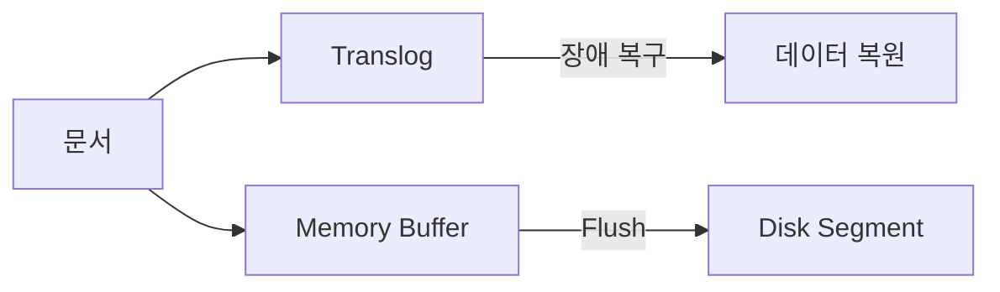

대용량 데이터를 효율적으로 저장하기 위한 Bulk 인덱싱, Refresh, Index Lifecycle Management를 배웁니다.

Elasticsearch의 인덱싱은 단순히 데이터를 저장하는 것 이상의 의미를 가집니다. 문서가 인덱싱되면 텍스트 분석, 역색인 생성, 세그먼트 관리 등 복잡한 과정을 거치게 됩니다. 이 과정을 이해하면 **왜 Bulk 인덱싱이 단건보다 10배 이상 빠른지**, **왜 인덱싱 직후 검색이 안 되는지**, **왜 대량 인덱싱 시 Refresh를 비활성화해야 하는지** 알 수 있습니다. 올바른 인덱싱 전략은 시스템 성능과 운영 비용에 직접적인 영향을 미칩니다.

## 인덱싱 기본 개념

### 인덱싱 과정


| 단계 | 설명 |
|------|------|
| 분석 | 텍스트를 토큰으로 분리 |
| Memory Buffer | 메모리에 임시 저장 |
| Refresh | 검색 가능하게 만듦 (기본 1초) |
| Segment | 불변의 인덱스 조각 |
| Flush | 디스크에 영구 저장 |

---

## 단건 vs Bulk 인덱싱

### 단건 인덱싱

```json
PUT /products/_doc/1
{
  "name": "맥북 프로",
  "price": 2390000
}
```

### Bulk 인덱싱

여러 문서를 한 번에 처리:

```json
POST /_bulk
{"index": {"_index": "products", "_id": "1"}}
{"name": "맥북 프로", "price": 2390000}
{"index": {"_index": "products", "_id": "2"}}
{"name": "맥북 에어", "price": 1390000}
{"index": {"_index": "products", "_id": "3"}}
{"name": "아이패드", "price": 1499000}
```

> **NDJSON 형식**: 각 줄은 개행문자(`\n`)로 구분, 마지막 줄도 개행 필요

### 성능 비교

| 방식 | 1만 건 처리 시간 | 네트워크 요청 |
|------|-----------------|--------------|
| 단건 | ~30초 | 10,000회 |
| Bulk (1000건씩) | ~3초 | 10회 |

### Bulk 권장 설정

```json
POST /_bulk
// 권장 크기: 5-15MB per request
// 권장 문서 수: 1,000-5,000건
```

### Spring에서 Bulk 인덱싱

```java
@Service
public class ProductBulkService {

    private final ElasticsearchOperations operations;

    public void bulkIndex(List<Product> products) {
        List<IndexQuery> queries = products.stream()
            .map(product -> new IndexQueryBuilder()
                .withId(product.getId())
                .withObject(product)
                .build())
            .toList();

        operations.bulkIndex(queries, Product.class);
    }
}
```

---

## Refresh

### Refresh란?

Memory Buffer의 데이터를 **검색 가능**하게 만드는 작업입니다.


### Refresh Interval

```json
PUT /products/_settings
{
  "index": {
    "refresh_interval": "30s"    // 기본값: 1s
  }
}
```

| 설정 | 의미 | 용도 |
|------|------|------|
| `1s` | 1초마다 (기본) | 실시간 검색 |
| `30s` | 30초마다 | 일반적인 서비스 |
| `-1` | 비활성화 | 대량 인덱싱 중 |

### 대량 인덱싱 시 최적화

```json
// 1. Refresh 비활성화
PUT /products/_settings
{ "refresh_interval": "-1" }

// 2. Bulk 인덱싱 수행
POST /_bulk
...

// 3. 수동 Refresh
POST /products/_refresh

// 4. Refresh 복원
PUT /products/_settings
{ "refresh_interval": "1s" }
```

---

## Flush와 Translog

### Translog

데이터 유실 방지를 위한 Write-Ahead Log입니다. Lucene 내부 구조에서 중요한 역할을 합니다.
→ [Lucene 내부 구조 상세](../core-components/#lucene-내부-구조)



### Flush

Memory Buffer + Translog → Disk Segment 영구화:

```json
POST /products/_flush
```

> **주의:** 일반적으로 수동 Flush 불필요. Elasticsearch가 자동 관리.

### Flush 설정

```json
PUT /products/_settings
{
  "index": {
    "translog": {
      "durability": "async",        // async: 성능, request: 안정성
      "sync_interval": "5s",
      "flush_threshold_size": "512mb"
    }
  }
}
```

---

## Index Template

새 인덱스 생성 시 자동 적용되는 설정:

```json
PUT /_index_template/products_template
{
  "index_patterns": ["products-*"],
  "priority": 1,
  "template": {
    "settings": {
      "number_of_shards": 3,
      "number_of_replicas": 1,
      "refresh_interval": "5s"
    },
    "mappings": {
      "properties": {
        "name": { "type": "text" },
        "price": { "type": "integer" },
        "created_at": { "type": "date" }
      }
    }
  }
}
```

이제 `products-2024`, `products-2025` 등 생성 시 자동 적용.

---

## Index Lifecycle Management (ILM)

시계열 데이터의 수명주기를 자동 관리합니다. 로그 데이터 관리에 특히 유용합니다.
→ [ILM 실전 적용 예제](../../examples/log-analysis/#ilm-정책)

### 수명주기 단계


### ILM 정책 생성

```json
PUT /_ilm/policy/logs_policy
{
  "policy": {
    "phases": {
      "hot": {
        "min_age": "0ms",
        "actions": {
          "rollover": {
            "max_size": "50gb",
            "max_age": "7d"
          },
          "set_priority": { "priority": 100 }
        }
      },
      "warm": {
        "min_age": "7d",
        "actions": {
          "shrink": { "number_of_shards": 1 },
          "forcemerge": { "max_num_segments": 1 },
          "set_priority": { "priority": 50 }
        }
      },
      "cold": {
        "min_age": "30d",
        "actions": {
          "set_priority": { "priority": 0 }
        }
      },
      "delete": {
        "min_age": "90d",
        "actions": {
          "delete": {}
        }
      }
    }
  }
}
```

### ILM 정책 적용

```json
PUT /_index_template/logs_template
{
  "index_patterns": ["logs-*"],
  "template": {
    "settings": {
      "index.lifecycle.name": "logs_policy",
      "index.lifecycle.rollover_alias": "logs"
    }
  }
}
```

---

## Reindex

기존 인덱스를 새 인덱스로 복사/변환:

### 기본 Reindex

```json
POST /_reindex
{
  "source": { "index": "products-old" },
  "dest": { "index": "products-new" }
}
```

### 필터링 Reindex

```json
POST /_reindex
{
  "source": {
    "index": "products-old",
    "query": {
      "term": { "in_stock": true }
    }
  },
  "dest": { "index": "products-active" }
}
```

### 필드 변환

```json
POST /_reindex
{
  "source": { "index": "products-old" },
  "dest": { "index": "products-new" },
  "script": {
    "source": "ctx._source.price_krw = ctx._source.price * 1000"
  }
}
```

### 비동기 Reindex

```json
POST /_reindex?wait_for_completion=false
{
  "source": { "index": "large-index" },
  "dest": { "index": "large-index-new" }
}
```

진행 상황 확인:
```json
GET /_tasks?actions=*reindex&detailed
```

---

## Alias

인덱스에 별명을 붙여 유연하게 관리:

### Alias 생성

```json
POST /_aliases
{
  "actions": [
    { "add": { "index": "products-v1", "alias": "products" } }
  ]
}
```

### Zero Downtime 재인덱싱

```json
// 1. 새 인덱스 생성 및 데이터 복사
PUT /products-v2
POST /_reindex
{
  "source": { "index": "products-v1" },
  "dest": { "index": "products-v2" }
}

// 2. Alias 전환 (원자적)
POST /_aliases
{
  "actions": [
    { "remove": { "index": "products-v1", "alias": "products" } },
    { "add": { "index": "products-v2", "alias": "products" } }
  ]
}
```

애플리케이션은 `products` alias만 사용 → 무중단 전환

---

## 인덱싱 성능 최적화

### 대량 인덱싱 체크리스트

```json
// 1. Replica 비활성화
PUT /products/_settings
{ "number_of_replicas": 0 }

// 2. Refresh 비활성화
PUT /products/_settings
{ "refresh_interval": "-1" }

// 3. Bulk 인덱싱 수행
POST /_bulk
...

// 4. Refresh
POST /products/_refresh

// 5. 설정 복원
PUT /products/_settings
{
  "number_of_replicas": 1,
  "refresh_interval": "1s"
}
```

### 최적 Bulk 크기

| 항목 | 권장 값 |
|------|---------|
| 요청 크기 | 5-15 MB |
| 문서 수 | 1,000-5,000 |
| 동시 요청 | 2-3 (노드당) |

### 인덱싱 스레드

```json
PUT /products/_settings
{
  "index": {
    "indexing": {
      "slowlog": {
        "threshold": {
          "index": {
            "warn": "10s",
            "info": "5s"
          }
        }
      }
    }
  }
}
```

---

## 다음 단계

| 목표 | 추천 문서 |
|------|----------|
| 클러스터 구성 | [클러스터 관리](../cluster-management/) |
| 검색 최적화 | [성능 튜닝](../performance-tuning/) |
| 장애 대응 | [고가용성](../high-availability/) |
