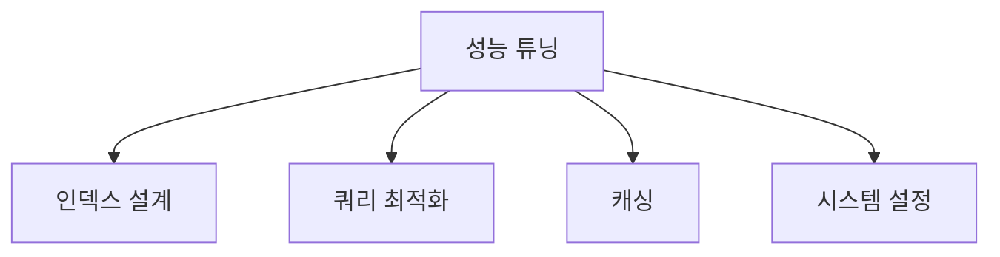

## 전체 비유: 도서관 운영 효율화

성능 튜닝을 **도서관 운영 효율화**에 비유하면 이해하기 쉽습니다:

| 도서관 비유 | Elasticsearch | 역할 |
|------------|---------------|------|
| 적정 서가 수 결정 | 샤드 수 설계 | 너무 많으면 관리 오버헤드 증가 |
| 불필요한 색인 카드 제거 | 불필요한 필드 제외 | 저장/검색 비용 절감 |
| 인기 도서 앞자리 배치 | Filter 캐시 | 자주 조회되는 조건 캐싱 |
| 통계 보고서 캐싱 | Request 캐시 | 집계 결과 재사용 |
| "소설, 컴퓨터"만 반환 | _source 필터링 | 필요한 필드만 반환 |
| 끝없는 목록 대신 "다음 페이지" | search_after | 깊은 페이지네이션 최적화 |
| "*가 들어간 책" 요청 회피 | Wildcard 쿼리 피하기 | 전체 스캔 방지 |
| 느린 대출 요청 분석 | Slow Log | 병목 쿼리 식별 |

이처럼 성능 튜닝은 "도서관 운영을 최적화하여 대출 대기 시간을 줄이는 것"과 같습니다.

**소요 시간**: 약 25-30분

Elasticsearch의 검색 및 인덱싱 성능을 최적화하는 방법을 배웁니다.

Elasticsearch는 기본 설정으로도 빠른 검색을 제공하지만, 프로덕션 환경에서는 데이터 규모와 사용 패턴에 맞는 튜닝이 필수입니다. 기본값은 "범용적으로 괜찮은" 설정이지, "모든 상황에 최적인" 설정이 아니기 때문입니다.

성능 튜닝은 크게 **인덱스 설계**, **쿼리 최적화**, **캐싱**, **시스템 설정** 네 가지 영역으로 나눌 수 있습니다. 각 영역은 서로 영향을 주고받습니다. 예를 들어, 잘못된 샤드 설계는 쿼리 최적화로 해결할 수 없고, 캐싱 전략은 쿼리 패턴에 따라 달라집니다. 따라서 **어디서 병목이 발생하는지 먼저 파악**한 후, 해당 영역을 집중적으로 개선하는 것이 효과적입니다. 이 문서에서는 각 영역별 핵심 튜닝 포인트와 실제 적용 시 고려사항을 다룹니다.

## 성능 최적화 영역



*성능 튜닝의 네 가지 핵심 영역(인덱스 설계, 쿼리 최적화, 캐싱, 시스템 설정)을 보여줍니다.*

---

## 인덱스 설계 최적화

### 적절한 샤드 수

| 데이터 규모 | 권장 Primary 샤드 |
|-------------|------------------|
| < 10GB | 1 |
| 10-50GB | 2-3 |
| 50-200GB | 3-5 |
| > 200GB | 노드당 1-2개 |

**Rule of Thumb:** 샤드당 20-40GB

```json
PUT /products
{
  "settings": {
    "number_of_shards": 3,
    "number_of_replicas": 1
  }
}
```

### 불필요한 필드 제외

```json
{
  "mappings": {
    "properties": {
      "raw_data": {
        "type": "object",
        "enabled": false    // 인덱싱 안 함, 저장만
      },
      "internal_id": {
        "type": "keyword",
        "index": false      // 검색 안 함
      },
      "description": {
        "type": "text",
        "norms": false      // 길이 정규화 비활성 (score에 안 씀)
      }
    }
  }
}
```

### 적절한 Field Type

```json
{
  "properties": {
    // 검색용: text
    "title": { "type": "text" },

    // 필터/정렬용: keyword
    "status": { "type": "keyword" },

    // 숫자 ID: keyword (범위 검색 없으면)
    "user_id": { "type": "keyword" },

    // 범위 검색 필요: 숫자
    "price": { "type": "integer" }
  }
}
```

---

## 쿼리 최적화

### Filter Context 활용

Score 계산이 필요 없는 조건은 `filter`로:

```json
// ❌ 비효율 - 모든 조건이 score 계산
{
  "query": {
    "bool": {
      "must": [
        { "match": { "name": "맥북" } },
        { "term": { "category": "노트북" } },
        { "range": { "price": { "gte": 1000000 } } }
      ]
    }
  }
}

// ✅ 효율적 - filter는 캐싱됨
{
  "query": {
    "bool": {
      "must": [
        { "match": { "name": "맥북" } }
      ],
      "filter": [
        { "term": { "category": "노트북" } },
        { "range": { "price": { "gte": 1000000 } } }
      ]
    }
  }
}
```

### 필요한 필드만 반환

```json
{
  "_source": ["name", "price"],  // 필요한 필드만
  "query": { ... }
}

// 또는
{
  "_source": false,              // _source 비활성화
  "stored_fields": ["name"],     // stored field만
  "query": { ... }
}
```

### Pagination 최적화

```json
// ❌ 깊은 페이지네이션
{ "from": 10000, "size": 10 }  // 10,000개 건너뛰기

// ✅ search_after 사용
{
  "size": 10,
  "sort": [
    { "created_at": "desc" },
    { "_id": "asc" }
  ],
  "search_after": ["2024-01-15T10:00:00", "abc123"]
}
```

### Wildcard 쿼리 피하기

```json
// ❌ 매우 느림
{ "wildcard": { "name": "*북*" } }

// ✅ N-gram 또는 Edge N-gram 사용
PUT /products
{
  "settings": {
    "analysis": {
      "analyzer": {
        "ngram_analyzer": {
          "tokenizer": "ngram_tokenizer"
        }
      },
      "tokenizer": {
        "ngram_tokenizer": {
          "type": "ngram",
          "min_gram": 2,
          "max_gram": 3
        }
      }
    }
  }
}
```

### 집계 최적화

```json
// size: 0으로 검색 결과 생략
{
  "size": 0,
  "aggs": {
    "categories": {
      "terms": {
        "field": "category",
        "size": 10,
        "shard_size": 25  // 정확도 vs 성능
      }
    }
  }
}
```

---

## 캐싱

"카테고리=노트북" 필터는 매 요청마다 동일한 결과를 반환하는데, 매번 디스크에서 다시 계산해야 할까요? 초당 수백 건의 동일한 필터 요청이 들어오면 불필요한 연산이 누적되어 클러스터 부하가 급증합니다. 캐싱은 자주 사용되는 필터 결과와 집계 결과를 메모리에 저장하여 반복 연산을 제거합니다.

### 캐시 종류

| 캐시 | 대상 | 무효화 |
|------|------|--------|
| **Node Query Cache** | Filter 결과 | Refresh 시 |
| **Shard Request Cache** | 집계 결과 | 데이터 변경 시 |
| **Field Data Cache** | text 필드 정렬/집계 | 메모리 부족 시 |

### Filter Cache 활용

```json
// 자동 캐싱됨
{
  "query": {
    "bool": {
      "filter": [
        { "term": { "status": "active" } }
      ]
    }
  }
}
```

### Request Cache 강제 사용

```json
GET /products/_search?request_cache=true
{
  "size": 0,
  "aggs": { ... }
}
```

### 캐시 상태 확인

```json
GET /_nodes/stats/indices/query_cache,request_cache
```

### 캐시 초기화

```json
POST /products/_cache/clear
```

---

## JVM 설정

### Heap 메모리

```bash
# jvm.options
-Xms8g
-Xmx8g
```

**권장:**
- 총 메모리의 50% (최대 30-31GB)
- 최소/최대 동일하게 설정
- 남은 메모리는 파일 시스템 캐시용

### GC 설정

```bash
# Elasticsearch 8.x 기본 G1GC
-XX:+UseG1GC
-XX:G1HeapRegionSize=16m
-XX:InitiatingHeapOccupancyPercent=75
```

### Heap 사용량 모니터링

```json
GET /_nodes/stats/jvm
```

**경고 신호:**
- Heap 사용률 > 75% 지속
- Old GC 빈번 발생
- GC 시간 > 500ms

---

## 시스템 설정

### Linux 커널

```bash
# /etc/sysctl.conf
vm.max_map_count=262144
vm.swappiness=1

# 적용
sudo sysctl -p
```

### File Descriptors

```bash
# /etc/security/limits.conf
elasticsearch  -  nofile  65535
elasticsearch  -  nproc   4096
```

### 디스크 I/O

- **SSD 사용 필수** (프로덕션)
- RAID 0 또는 RAID 10 권장
- 디스크 사용률 < 80% 유지

---

## 느린 쿼리 분석

### Slow Log 설정

```json
PUT /products/_settings
{
  "index.search.slowlog.threshold.query.warn": "10s",
  "index.search.slowlog.threshold.query.info": "5s",
  "index.search.slowlog.threshold.query.debug": "2s",
  "index.search.slowlog.threshold.fetch.warn": "1s",

  "index.indexing.slowlog.threshold.index.warn": "10s",
  "index.indexing.slowlog.threshold.index.info": "5s"
}
```

### Profile API

쿼리 실행 분석:

```json
GET /products/_search
{
  "profile": true,
  "query": {
    "match": { "name": "맥북" }
  }
}
```

응답에서 확인:
- `time_in_nanos`: 각 단계 소요 시간
- `breakdown`: 상세 시간 분석

### Explain API

Score 계산 분석:

```json
GET /products/_explain/1
{
  "query": {
    "match": { "name": "맥북" }
  }
}
```

---

## 인덱싱 성능

인덱싱 성능 최적화의 상세 내용은 인덱싱 전략 문서를 참고하세요.
→ [인덱싱 전략 상세](indexing/)

### Refresh Interval 조정

```json
// 대량 인덱싱 시
PUT /products/_settings
{ "refresh_interval": "-1" }

// 인덱싱 완료 후
PUT /products/_settings
{ "refresh_interval": "1s" }
```

### Bulk 인덱싱 최적화

```json
// 권장 크기: 5-15MB per request
POST /_bulk
{"index": {"_index": "products"}}
{"name": "상품1"}
{"index": {"_index": "products"}}
{"name": "상품2"}
...
```

### Translog 설정

```json
PUT /products/_settings
{
  "index.translog.durability": "async",
  "index.translog.sync_interval": "30s"
}
```

---

## 성능 체크리스트

### 검색 성능

- [ ] Filter Context 사용
- [ ] 필요한 필드만 반환
- [ ] 적절한 페이지네이션
- [ ] Wildcard 앞 `*` 회피
- [ ] 캐시 활용

### 인덱싱 성능

- [ ] Bulk API 사용
- [ ] 적절한 Refresh Interval
- [ ] 대량 작업 시 Replica 비활성화
- [ ] 적절한 샤드 수

### 시스템

- [ ] SSD 사용
- [ ] JVM Heap 적절히 설정
- [ ] File Descriptors 충분히
- [ ] vm.max_map_count 설정

---

## 성능 목표

| 지표 | 목표 |
|------|------|
| 검색 응답 시간 | < 100ms (p99) |
| 인덱싱 처리량 | > 10,000 docs/sec |
| JVM Heap 사용 | < 75% |
| 디스크 사용 | < 80% |

---

## 다음 단계

| 목표 | 추천 문서 |
|------|----------|
| 장애 대응 | [고가용성](high-availability/) |
| 클러스터 구성 | [클러스터 관리](cluster-management/) |
| 실전 구현 | [상품 검색 시스템](../examples/product-search/) |
