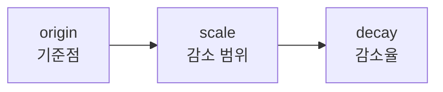

{}
이 문서를 읽기 전에 다음 개념을 먼저 이해하세요:
- [Query DSL](query-dsl/) - match, bool 쿼리 기본
- [데이터 모델링](data-modeling/) - Analyzer 동작 원리
{}

검색 결과의 품질을 높이기 위한 Score, BM25, Boosting 등 관련성 튜닝 방법을 배웁니다.

검색 엔진의 핵심 가치는 사용자가 원하는 결과를 **첫 번째 페이지에서** 찾을 수 있게 하는 것입니다. 아무리 빠르게 결과를 반환해도, 사용자가 원하는 문서가 10페이지에 있다면 의미가 없습니다. 검색 관련성(Search Relevance)은 이 문제를 해결하기 위한 핵심 개념입니다.

Elasticsearch는 BM25 알고리즘을 기본으로 사용하여 각 문서에 관련성 점수(Score)를 부여합니다. 그러나 기본 점수만으로는 비즈니스 요구사항을 충족하기 어려운 경우가 많습니다. "프로모션 상품을 상위에 노출시키고 싶다", "최신 상품에 가산점을 주고 싶다", "재고 없는 상품은 후순위로 밀고 싶다" 같은 요구사항은 Boosting과 Function Score를 통해 구현합니다. 이 문서에서는 검색 품질을 높이기 위한 다양한 튜닝 기법을 다룹니다.

## Score란?

**Score**는 검색 쿼리와 문서가 얼마나 관련있는지를 나타내는 점수입니다.
점수가 높을수록 검색 결과 상위에 노출됩니다.

```json
GET /products/_search
{
  "query": {
    "match": { "name": "맥북 프로" }
  }
}
```

응답:
```json
{
  "hits": {
    "hits": [
      {
        "_score": 2.876,          // 관련성 점수
        "_source": { "name": "맥북 프로 14인치" }
      },
      {
        "_score": 1.234,
        "_source": { "name": "맥북 에어" }
      }
    ]
  }
}
```

---

## BM25 알고리즘

Elasticsearch는 **BM25**(Best Matching 25)를 기본 스코어링 알고리즘으로 사용합니다.

### BM25 핵심 요소

```
Score = IDF × TF × fieldLength
```

| 요소 | 의미 | 예시 |
|------|------|------|
| **TF** (Term Frequency) | 문서 내 검색어 빈도 | "맥북"이 3번 → 점수 상승 |
| **IDF** (Inverse Document Frequency) | 전체 문서에서의 희소성 | 드문 단어 → 점수 상승 |
| **Field Length** | 필드 길이 | 짧은 필드에서 일치 → 점수 상승 |

### TF (Term Frequency)

문서에 검색어가 많이 나올수록 관련성이 높다고 판단:

- "맥북" 1회 등장 → score 1.0
- "맥북" 3회 등장 → score ~1.7 (로그 스케일로 증가)

### IDF (Inverse Document Frequency)

전체 문서에서 드물게 나타나는 단어일수록 중요:

- "the" (100만 문서에 등장) → IDF 낮음
- "맥북" (1만 문서에 등장) → IDF 높음

### Field Length Normalization

짧은 필드에서 일치하면 더 관련성이 높다고 판단:

- "맥북 프로" (2단어 필드) → 높은 점수
- "애플에서 출시한 맥북 프로 최신 모델입니다..." (10단어 필드) → 낮은 점수

---

## Score 분석

### Explain API

점수가 어떻게 계산되었는지 확인:

```json
GET /products/_search
{
  "explain": true,
  "query": {
    "match": { "name": "맥북" }
  }
}
```

응답 (간략화):
```json
{
  "_explanation": {
    "value": 1.234,
    "description": "weight(name:맥북)",
    "details": [
      {
        "value": 0.876,
        "description": "idf, computed as..."
      },
      {
        "value": 1.41,
        "description": "tf, computed as freq=1.0..."
      }
    ]
  }
}
```

### Profile API

쿼리 실행 성능 분석:

```json
GET /products/_search
{
  "profile": true,
  "query": {
    "match": { "name": "맥북" }
  }
}
```

---

## Boosting

특정 조건에 가중치를 부여하여 점수를 조절합니다.

### 필드 부스팅

중요한 필드에 가중치 부여:

```json
GET /products/_search
{
  "query": {
    "multi_match": {
      "query": "맥북 프로",
      "fields": [
        "name^3",           // name 필드 3배 가중치
        "description"       // description 필드 1배 (기본)
      ]
    }
  }
}
```

### Bool 쿼리에서 부스팅

```json
GET /products/_search
{
  "query": {
    "bool": {
      "must": [
        { "match": { "name": "맥북" } }
      ],
      "should": [
        {
          "term": {
            "is_promotion": {
              "value": true,
              "boost": 2.0        // 프로모션 상품 점수 2배
            }
          }
        },
        {
          "range": {
            "rating": {
              "gte": 4.5,
              "boost": 1.5        // 평점 높은 상품 점수 1.5배
            }
          }
        }
      ]
    }
  }
}
```

### Negative Boosting

특정 조건의 점수 낮추기:

```json
GET /products/_search
{
  "query": {
    "boosting": {
      "positive": {
        "match": { "name": "맥북" }
      },
      "negative": {
        "term": { "condition": "refurbished" }  // 리퍼 제품
      },
      "negative_boost": 0.5    // 점수를 50%로 감소
    }
  }
}
```

---

## Function Score Query

복잡한 스코어링 로직을 구현합니다.

### 기본 구조

```json
GET /products/_search
{
  "query": {
    "function_score": {
      "query": { "match": { "name": "노트북" } },
      "functions": [
        // 점수 조정 함수들
      ],
      "score_mode": "sum",      // 함수 결과 합산 방식
      "boost_mode": "multiply"  // 원본 점수와 결합 방식
    }
  }
}
```

### score_mode 옵션

| 값 | 설명 |
|----|------|
| `multiply` | 함수 결과들을 곱함 |
| `sum` | 함수 결과들을 합함 |
| `avg` | 함수 결과들의 평균 |
| `max` | 함수 결과 중 최댓값 |
| `min` | 함수 결과 중 최솟값 |
| `first` | 첫 번째 함수 결과만 사용 |

### boost_mode 옵션

| 값 | 설명 |
|----|------|
| `multiply` | 원본 점수 × 함수 결과 |
| `replace` | 함수 결과로 대체 |
| `sum` | 원본 점수 + 함수 결과 |
| `avg` | 평균 |
| `max` | 둘 중 최댓값 |
| `min` | 둘 중 최솟값 |

### 실전 예제: 상품 검색 순위 조정

```json
GET /products/_search
{
  "query": {
    "function_score": {
      "query": {
        "bool": {
          "must": [
            { "match": { "name": "노트북" } }
          ],
          "filter": [
            { "term": { "in_stock": true } }
          ]
        }
      },
      "functions": [
        {
          // 인기 상품 부스팅
          "filter": { "range": { "sales_count": { "gte": 100 } } },
          "weight": 2
        },
        {
          // 최신 상품 부스팅 (날짜 기반 감소)
          "gauss": {
            "created_at": {
              "origin": "now",
              "scale": "30d",
              "decay": 0.5
            }
          }
        },
        {
          // 평점 반영
          "field_value_factor": {
            "field": "rating",
            "factor": 1.2,
            "modifier": "sqrt",
            "missing": 3
          }
        },
        {
          // 랜덤 요소 추가 (다양성)
          "random_score": {
            "seed": 12345,
            "field": "_seq_no"
          },
          "weight": 0.1
        }
      ],
      "score_mode": "sum",
      "boost_mode": "multiply"
    }
  }
}
```

### Decay Functions

거리나 시간에 따라 점수를 감소시킵니다.



| 함수 | 감소 형태 |
|------|----------|
| `linear` | 선형 감소 |
| `exp` | 지수적 감소 |
| `gauss` | 가우시안 곡선 |

```json
{
  "gauss": {
    "location": {
      "origin": { "lat": 37.5, "lon": 127.0 },
      "scale": "5km",
      "decay": 0.5
    }
  }
}
```

→ 기준점에서 5km 떨어지면 점수가 50%로 감소

---

## 검색 품질 개선 기법

### 1. 동의어 처리

동의어 처리를 위해 커스텀 Analyzer를 설정합니다.
→ [Analyzer 기본 개념](data-modeling/#분석기-analyzer-설정)

```json
PUT /products
{
  "settings": {
    "analysis": {
      "filter": {
        "synonym_filter": {
          "type": "synonym",
          "synonyms": [
            "노트북, 랩탑, laptop",
            "핸드폰, 스마트폰, 휴대폰, phone"
          ]
        }
      },
      "analyzer": {
        "synonym_analyzer": {
          "tokenizer": "standard",
          "filter": ["lowercase", "synonym_filter"]
        }
      }
    }
  }
}
```

### 2. 자동완성 (Prefix 매칭)

```json
GET /products/_search
{
  "query": {
    "match_phrase_prefix": {
      "name": {
        "query": "맥북 프",
        "max_expansions": 10
      }
    }
  }
}
```

### 3. 오타 교정 (Fuzzy)

```json
GET /products/_search
{
  "query": {
    "match": {
      "name": {
        "query": "맥뷱",
        "fuzziness": "AUTO"
      }
    }
  }
}
```

### 4. 하이라이팅

```json
GET /products/_search
{
  "query": {
    "match": { "description": "M3 칩" }
  },
  "highlight": {
    "fields": {
      "description": {
        "pre_tags": ["<strong>"],
        "post_tags": ["</strong>"],
        "fragment_size": 150
      }
    }
  }
}
```

---

## 실전 팁

### 1. filter를 적극 활용

Score가 필요 없는 조건은 `filter`로:

```json
{
  "bool": {
    "must": [
      { "match": { "name": "맥북" } }      // score 필요
    ],
    "filter": [
      { "term": { "category": "노트북" } }, // score 불필요
      { "term": { "in_stock": true } }
    ]
  }
}
```

### 2. 필드별 가중치 테스트

A/B 테스트로 최적 가중치 찾기:

```json
// 실험 A
"fields": ["name^3", "description^1"]

// 실험 B
"fields": ["name^2", "description^2"]
```

### 3. Score 정규화

function_score에서 `max_boost` 사용:

```json
{
  "function_score": {
    "max_boost": 10,    // 최대 부스팅 제한
    "functions": [...]
  }
}
```

### 4. 검색 품질 측정

- **Precision**: 반환된 결과 중 관련 있는 비율
- **Recall**: 전체 관련 문서 중 반환된 비율
- **NDCG**: 순위를 고려한 품질 점수

---

## 정리

| 기법 | 용도 | 예시 |
|------|------|------|
| Field Boost | 중요 필드 강조 | `name^3` |
| Bool should | 선택적 부스팅 | 프로모션 상품 우대 |
| Negative Boost | 점수 낮추기 | 리퍼 제품 후순위 |
| Function Score | 복잡한 로직 | 인기도, 신선도 반영 |
| Decay | 거리/시간 기반 | 최신순, 거리순 |

---

## 다음 단계

| 목표 | 추천 문서 |
|------|----------|
| 데이터 분석 | [집계](aggregations/) |
| 실전 구현 | [상품 검색 시스템](../examples/product-search/) |
| 성능 최적화 | [성능 튜닝](performance-tuning/) |
