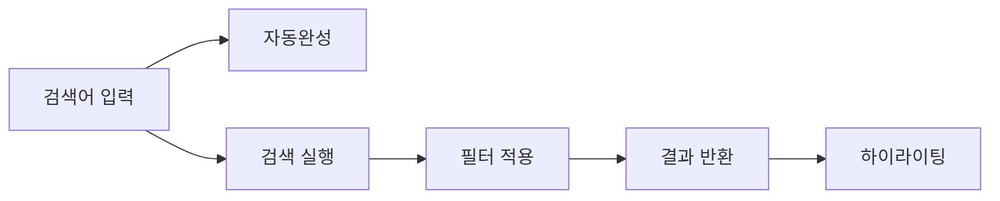


이 문서의 코드를 바로 실행해보고 싶다면, **완전한 Spring Boot 프로젝트**를 사용하세요:
- 📁 [examples/elasticsearch/product-search/](https://github.com/advanced-beginner/advanced-beginner.github.io/tree/main/examples/elasticsearch/product-search)
- docker-compose로 Elasticsearch(Nori 포함) 즉시 실행 가능
- 샘플 데이터 자동 초기화



- **Nori 분석기**로 한글 형태소 분석을 적용하여 "삼성전자" → "삼성", "전자" 검색을 구현합니다
- **Edge N-gram**으로 자동완성 기능을 구현합니다
- **Bool Query + Aggregation**으로 필터링과 패싯(facet)을 제공합니다
- **하이라이팅**으로 검색어를 강조 표시합니다
- 전체 소요 시간: 약 30분


한글 형태소 분석, 자동완성, 필터링을 포함한 실제 서비스 수준의 상품 검색 시스템을 구현합니다.

## 구현 목표



*상품 검색 시스템의 전체 흐름을 보여줍니다. 검색어 입력 시 자동완성과 검색 실행이 동시에 이루어지며, 필터 적용 후 하이라이팅된 결과가 반환됩니다.*

- **한글 검색**: "삼성전자" 검색 시 "삼성", "전자" 모두 매칭
- **자동완성**: "맥북 프" 입력 시 "맥북 프로" 추천
- **필터링**: 카테고리, 가격 범위, 브랜드 필터
- **하이라이팅**: 검색어 강조 표시

---

## 1. 인덱스 설계

### Nori 분석기 설정

```json
PUT /products
{
  "settings": {
    "analysis": {
      "analyzer": {
        "korean_analyzer": {
          "type": "custom",
          "tokenizer": "nori_tokenizer",
          "filter": [
            "nori_readingform",
            "lowercase",
            "nori_part_of_speech_filter"
          ]
        },
        "autocomplete_analyzer": {
          "type": "custom",
          "tokenizer": "edge_ngram_tokenizer",
          "filter": ["lowercase"]
        },
        "autocomplete_search_analyzer": {
          "type": "custom",
          "tokenizer": "standard",
          "filter": ["lowercase"]
        }
      },
      "tokenizer": {
        "nori_tokenizer": {
          "type": "nori_tokenizer",
          "decompound_mode": "mixed"
        },
        "edge_ngram_tokenizer": {
          "type": "edge_ngram",
          "min_gram": 1,
          "max_gram": 20,
          "token_chars": ["letter", "digit"]
        }
      },
      "filter": {
        "nori_part_of_speech_filter": {
          "type": "nori_part_of_speech",
          "stoptags": [
            "E", "IC", "J", "MAG", "MAJ",
            "MM", "SP", "SSC", "SSO", "SC",
            "SE", "XPN", "XSA", "XSN", "XSV",
            "UNA", "NA", "VSV"
          ]
        }
      }
    }
  },
  "mappings": {
    "properties": {
      "name": {
        "type": "text",
        "analyzer": "korean_analyzer",
        "fields": {
          "keyword": {
            "type": "keyword"
          },
          "autocomplete": {
            "type": "text",
            "analyzer": "autocomplete_analyzer",
            "search_analyzer": "autocomplete_search_analyzer"
          }
        }
      },
      "description": {
        "type": "text",
        "analyzer": "korean_analyzer"
      },
      "category": {
        "type": "keyword"
      },
      "brand": {
        "type": "keyword"
      },
      "price": {
        "type": "integer"
      },
      "discount_price": {
        "type": "integer"
      },
      "rating": {
        "type": "float"
      },
      "review_count": {
        "type": "integer"
      },
      "in_stock": {
        "type": "boolean"
      },
      "tags": {
        "type": "keyword"
      },
      "created_at": {
        "type": "date"
      }
    }
  }
}
```

### 분석기 테스트

```json
// 한글 분석
GET /products/_analyze
{
  "analyzer": "korean_analyzer",
  "text": "삼성전자 갤럭시북 프로"
}
// 결과: ["삼성", "전자", "갤럭시북", "갤럭시", "북", "프로"]

// 자동완성 분석
GET /products/_analyze
{
  "analyzer": "autocomplete_analyzer",
  "text": "맥북"
}
// 결과: ["맥", "맥북"]
```


- `nori_tokenizer`의 `decompound_mode: mixed`로 복합어를 분해합니다
- `edge_ngram`은 접두사 매칭용, 검색 시에는 `standard` 분석기를 사용합니다
- `Multi-field`로 같은 필드를 여러 용도(검색, 정렬, 자동완성)로 활용합니다


---

## 2. 샘플 데이터

```json
POST /_bulk
{"index": {"_index": "products", "_id": "1"}}
{"name": "맥북 프로 14인치 M3 Pro", "description": "Apple M3 Pro 칩, 18GB 통합 메모리, 512GB SSD", "category": "노트북", "brand": "Apple", "price": 2390000, "discount_price": 2290000, "rating": 4.8, "review_count": 1250, "in_stock": true, "tags": ["프리미엄", "신상품"], "created_at": "2024-01-10"}
{"index": {"_index": "products", "_id": "2"}}
{"name": "맥북 에어 13인치 M3", "description": "Apple M3 칩, 8GB 통합 메모리, 256GB SSD, 미드나이트", "category": "노트북", "brand": "Apple", "price": 1390000, "rating": 4.7, "review_count": 890, "in_stock": true, "tags": ["베스트셀러"], "created_at": "2024-01-15"}
{"index": {"_index": "products", "_id": "3"}}
{"name": "갤럭시북4 프로 16인치", "description": "인텔 코어 울트라 7, 16GB RAM, 512GB SSD", "category": "노트북", "brand": "Samsung", "price": 1890000, "rating": 4.5, "review_count": 456, "in_stock": true, "tags": ["신상품"], "created_at": "2024-01-20"}
{"index": {"_index": "products", "_id": "4"}}
{"name": "아이패드 프로 11인치 M4", "description": "Apple M4 칩, 256GB, 스페이스 블랙", "category": "태블릿", "brand": "Apple", "price": 1499000, "rating": 4.9, "review_count": 2100, "in_stock": true, "tags": ["프리미엄", "신상품"], "created_at": "2024-01-05"}
{"index": {"_index": "products", "_id": "5"}}
{"name": "갤럭시 탭 S9 Ultra", "description": "스냅드래곤 8 Gen 2, 12GB RAM, 256GB", "category": "태블릿", "brand": "Samsung", "price": 1599000, "rating": 4.6, "review_count": 780, "in_stock": false, "tags": ["대화면"], "created_at": "2024-01-08"}
```

---

## 3. 검색 구현

### 기본 검색

```json
GET /products/_search
{
  "query": {
    "bool": {
      "must": [
        {
          "multi_match": {
            "query": "맥북 프로",
            "fields": ["name^3", "description"],
            "type": "best_fields"
          }
        }
      ],
      "filter": [
        { "term": { "in_stock": true } }
      ]
    }
  }
}
```

### 자동완성

```json
GET /products/_search
{
  "size": 5,
  "_source": ["name"],
  "query": {
    "match": {
      "name.autocomplete": {
        "query": "맥북 프",
        "operator": "and"
      }
    }
  }
}
```

### 필터 + 검색 조합

```json
GET /products/_search
{
  "query": {
    "bool": {
      "must": [
        {
          "multi_match": {
            "query": "프로",
            "fields": ["name^3", "description"]
          }
        }
      ],
      "filter": [
        { "term": { "category": "노트북" } },
        { "terms": { "brand": ["Apple", "Samsung"] } },
        { "range": { "price": { "gte": 1000000, "lte": 2500000 } } },
        { "term": { "in_stock": true } }
      ]
    }
  },
  "sort": [
    { "_score": "desc" },
    { "review_count": "desc" }
  ]
}
```

### 검색 + 필터 패싯

```json
GET /products/_search
{
  "size": 10,
  "query": {
    "bool": {
      "must": [
        { "match": { "name": "노트북" } }
      ],
      "filter": [
        { "term": { "in_stock": true } }
      ]
    }
  },
  "aggs": {
    "categories": {
      "terms": { "field": "category", "size": 10 }
    },
    "brands": {
      "terms": { "field": "brand", "size": 20 }
    },
    "price_ranges": {
      "range": {
        "field": "price",
        "ranges": [
          { "key": "100만원 미만", "to": 1000000 },
          { "key": "100-150만원", "from": 1000000, "to": 1500000 },
          { "key": "150-200만원", "from": 1500000, "to": 2000000 },
          { "key": "200만원 이상", "from": 2000000 }
        ]
      }
    },
    "avg_rating": {
      "avg": { "field": "rating" }
    }
  }
}
```

### 하이라이팅

```json
GET /products/_search
{
  "query": {
    "match": { "description": "M3 칩" }
  },
  "highlight": {
    "fields": {
      "name": {
        "pre_tags": ["<em class='highlight'>"],
        "post_tags": ["</em>"]
      },
      "description": {
        "pre_tags": ["<em class='highlight'>"],
        "post_tags": ["</em>"],
        "fragment_size": 100,
        "number_of_fragments": 3
      }
    }
  }
}
```


- `multi_match`로 여러 필드를 동시에 검색하고, `fields` 가중치(`^3`)로 중요도를 조절합니다
- `must`는 점수에 영향, `filter`는 캐싱되어 성능이 좋습니다
- `aggs`로 필터 패싯을 제공하면 사용자가 결과를 좁힐 수 있습니다


---

## 4. Spring Boot 구현

### Product.java

```java
@Document(indexName = "products")
public class Product {

    @Id
    private String id;

    @MultiField(
        mainField = @Field(type = FieldType.Text, analyzer = "korean_analyzer"),
        otherFields = {
            @InnerField(suffix = "keyword", type = FieldType.Keyword),
            @InnerField(suffix = "autocomplete", type = FieldType.Text,
                analyzer = "autocomplete_analyzer",
                searchAnalyzer = "autocomplete_search_analyzer")
        }
    )
    private String name;

    @Field(type = FieldType.Text, analyzer = "korean_analyzer")
    private String description;

    @Field(type = FieldType.Keyword)
    private String category;

    @Field(type = FieldType.Keyword)
    private String brand;

    @Field(type = FieldType.Integer)
    private Integer price;

    @Field(type = FieldType.Integer)
    private Integer discountPrice;

    @Field(type = FieldType.Float)
    private Float rating;

    @Field(type = FieldType.Integer)
    private Integer reviewCount;

    @Field(type = FieldType.Boolean)
    private Boolean inStock;

    @Field(type = FieldType.Keyword)
    private List<String> tags;

    @Field(type = FieldType.Date)
    private LocalDate createdAt;

    // Getters and Setters
}
```

### ProductSearchService.java

```java
@Service
public class ProductSearchService {

    private final ElasticsearchOperations operations;

    public ProductSearchService(ElasticsearchOperations operations) {
        this.operations = operations;
    }

    public SearchResult search(SearchRequest request) {
        BoolQuery.Builder boolQuery = new BoolQuery.Builder();

        // 검색어
        if (hasText(request.getKeyword())) {
            boolQuery.must(Query.of(q -> q
                .multiMatch(m -> m
                    .query(request.getKeyword())
                    .fields("name^3", "description")
                    .type(TextQueryType.BestFields)
                )
            ));
        }

        // 필터들
        if (hasText(request.getCategory())) {
            boolQuery.filter(Query.of(q -> q
                .term(t -> t.field("category").value(request.getCategory()))
            ));
        }

        if (request.getBrands() != null && !request.getBrands().isEmpty()) {
            boolQuery.filter(Query.of(q -> q
                .terms(t -> t
                    .field("brand")
                    .terms(v -> v.value(
                        request.getBrands().stream()
                            .map(FieldValue::of)
                            .toList()
                    ))
                )
            ));
        }

        if (request.getMinPrice() != null || request.getMaxPrice() != null) {
            boolQuery.filter(Query.of(q -> q
                .range(r -> {
                    r.field("price");
                    if (request.getMinPrice() != null)
                        r.gte(JsonData.of(request.getMinPrice()));
                    if (request.getMaxPrice() != null)
                        r.lte(JsonData.of(request.getMaxPrice()));
                    return r;
                })
            ));
        }

        // 재고 필터
        if (request.isInStockOnly()) {
            boolQuery.filter(Query.of(q -> q
                .term(t -> t.field("in_stock").value(true))
            ));
        }

        // 쿼리 빌드
        NativeQuery query = NativeQuery.builder()
            .withQuery(Query.of(q -> q.bool(boolQuery.build())))
            .withPageable(PageRequest.of(
                request.getPage(),
                request.getSize()
            ))
            .withSort(buildSort(request.getSortBy()))
            .withHighlightQuery(buildHighlight())
            .withAggregation("categories", Aggregation.of(a -> a
                .terms(t -> t.field("category").size(10))
            ))
            .withAggregation("brands", Aggregation.of(a -> a
                .terms(t -> t.field("brand").size(20))
            ))
            .withAggregation("price_ranges", Aggregation.of(a -> a
                .range(r -> r
                    .field("price")
                    .ranges(
                        AggregationRange.of(ar -> ar.to("1000000").key("100만원 미만")),
                        AggregationRange.of(ar -> ar.from("1000000").to("1500000").key("100-150만원")),
                        AggregationRange.of(ar -> ar.from("1500000").to("2000000").key("150-200만원")),
                        AggregationRange.of(ar -> ar.from("2000000").key("200만원 이상"))
                    )
                )
            ))
            .build();

        SearchHits<Product> hits = operations.search(query, Product.class);

        return SearchResult.builder()
            .products(hits.getSearchHits().stream()
                .map(this::toProductResponse)
                .toList())
            .total(hits.getTotalHits())
            .facets(extractFacets(hits))
            .build();
    }

    public List<String> autocomplete(String prefix) {
        NativeQuery query = NativeQuery.builder()
            .withQuery(Query.of(q -> q
                .match(m -> m
                    .field("name.autocomplete")
                    .query(prefix)
                    .operator(Operator.And)
                )
            ))
            .withPageable(PageRequest.of(0, 5))
            .withSourceFilter(new FetchSourceFilter(
                new String[]{"name"}, null
            ))
            .build();

        SearchHits<Product> hits = operations.search(query, Product.class);

        return hits.getSearchHits().stream()
            .map(h -> h.getContent().getName())
            .distinct()
            .toList();
    }

    private Sort buildSort(String sortBy) {
        if (sortBy == null) {
            return Sort.by(
                Sort.Order.desc("_score"),
                Sort.Order.desc("review_count")
            );
        }
        return switch (sortBy) {
            case "price_asc" -> Sort.by("price").ascending();
            case "price_desc" -> Sort.by("price").descending();
            case "rating" -> Sort.by("rating").descending();
            case "newest" -> Sort.by("created_at").descending();
            default -> Sort.by("_score").descending();
        };
    }

    private HighlightQuery buildHighlight() {
        return new HighlightQuery(
            new Highlight(List.of(
                new HighlightField("name"),
                new HighlightField("description")
            )),
            Product.class
        );
    }

    private ProductResponse toProductResponse(SearchHit<Product> hit) {
        ProductResponse response = new ProductResponse(hit.getContent());
        if (hit.getHighlightFields().containsKey("name")) {
            response.setHighlightedName(
                String.join("", hit.getHighlightField("name"))
            );
        }
        return response;
    }
}
```

### ProductController.java

```java
@RestController
@RequestMapping("/api/products")
public class ProductController {

    private final ProductSearchService searchService;

    @GetMapping("/search")
    public ResponseEntity<SearchResult> search(
            @RequestParam(required = false) String keyword,
            @RequestParam(required = false) String category,
            @RequestParam(required = false) List<String> brands,
            @RequestParam(required = false) Integer minPrice,
            @RequestParam(required = false) Integer maxPrice,
            @RequestParam(defaultValue = "true") boolean inStockOnly,
            @RequestParam(required = false) String sortBy,
            @RequestParam(defaultValue = "0") int page,
            @RequestParam(defaultValue = "10") int size) {

        SearchRequest request = SearchRequest.builder()
            .keyword(keyword)
            .category(category)
            .brands(brands)
            .minPrice(minPrice)
            .maxPrice(maxPrice)
            .inStockOnly(inStockOnly)
            .sortBy(sortBy)
            .page(page)
            .size(size)
            .build();

        return ResponseEntity.ok(searchService.search(request));
    }

    @GetMapping("/autocomplete")
    public ResponseEntity<List<String>> autocomplete(
            @RequestParam String q) {
        return ResponseEntity.ok(searchService.autocomplete(q));
    }
}
```


- `@MultiField`로 같은 필드를 여러 분석기로 인덱싱합니다
- `ElasticsearchOperations`로 복잡한 Bool Query와 Aggregation을 구성합니다
- `SearchHit`의 `getHighlightFields()`로 하이라이팅된 텍스트를 가져옵니다


---

## 5. API 테스트

### 기본 검색

```bash
curl "http://localhost:8080/api/products/search?keyword=맥북"
```

### 필터 적용

```bash
curl "http://localhost:8080/api/products/search?keyword=프로&category=노트북&brands=Apple&minPrice=1000000&maxPrice=3000000"
```

### 정렬

```bash
curl "http://localhost:8080/api/products/search?keyword=노트북&sortBy=price_asc"
```

### 자동완성

```bash
curl "http://localhost:8080/api/products/autocomplete?q=맥북"
```

---

## 6. 최적화 팁

### 검색 품질 향상

```json
// 동의어 추가
"filter": {
  "synonym_filter": {
    "type": "synonym",
    "synonyms": [
      "노트북, 랩탑, laptop",
      "핸드폰, 스마트폰, 휴대폰"
    ]
  }
}
```

### 검색어 부스팅

```json
{
  "function_score": {
    "query": { ... },
    "functions": [
      {
        "filter": { "term": { "tags": "베스트셀러" } },
        "weight": 1.5
      },
      {
        "field_value_factor": {
          "field": "review_count",
          "factor": 0.0001,
          "modifier": "log1p"
        }
      }
    ]
  }
}
```


- **동의어**를 추가하면 "노트북", "랩탑" 같은 유사어 검색이 가능합니다
- **function_score**로 베스트셀러나 리뷰 수에 따른 가중치를 부여합니다
- 검색 품질 개선은 지속적인 테스트와 사용자 피드백 반영이 핵심입니다


---

## 다음 단계

| 목표 | 추천 문서 |
|------|----------|
| 검색 품질 개선 | [검색 관련성](../concepts/search-relevance/) |
| 성능 최적화 | [성능 튜닝](../concepts/performance-tuning/) |
| 데이터 분석 | [집계](../concepts/aggregations/) |
