Elasticsearch 클러스터를 안전하게 확장하는 방법을 안내합니다.

**소요 시간**: 약 30-60분 (노드 추가 및 샤드 재배치 시간 별도)


**다루는 내용**: 데이터 노드 추가, 역할별 노드 분리, Hot-Warm-Cold 아키텍처, 확장 후 검증

**다루지 않는 내용**: 쿼리 수준 성능 최적화는 [느린 쿼리 최적화](../slow-query-optimization/)를, 메모리 문제는 [메모리 문제 해결](../memory-troubleshooting/)을 참조하세요.



- **수평 확장**: 데이터 노드를 추가하고 샤드를 재배치
- **역할 분리**: master, data, coordinating, ingest 노드를 분리하여 안정성 확보
- **Hot-Warm-Cold**: 데이터 사용 빈도에 따라 노드 계층을 구분하여 비용 최적화
- **확장 후 검증**: 클러스터 상태, 샤드 분포, 성능 지표를 반드시 확인


---

## 시작하기 전에

다음 조건을 확인하세요:

| 항목 | 요구사항 | 확인 방법 |
|------|---------|----------|
| Elasticsearch 버전 | 모든 노드 동일 버전 | `curl -X GET "localhost:9200/_cat/nodes?v&h=name,version"` |
| 클러스터 상태 | green (권장) | `curl -X GET "localhost:9200/_cluster/health"` |
| 네트워크 | 새 노드가 기존 노드와 통신 가능 | ping 또는 telnet 테스트 |
| 보안 설정 | 동일한 보안 구성 (TLS, 인증) | elasticsearch.yml 확인 |

```bash
# 현재 클러스터 상태 종합 확인
curl -X GET "localhost:9200/_cluster/health?pretty"

# 노드별 상태
curl -X GET "localhost:9200/_cat/nodes?v&h=name,role,heap.percent,cpu,disk.avail"

# 인덱스별 샤드 분포
curl -X GET "localhost:9200/_cat/shards?v&s=index"
```


클러스터 확장 전에 반드시 현재 상태를 기록하세요. 문제 발생 시 비교 기준이 됩니다.


---

## 증상

다음과 같은 상황에서 클러스터 확장이 필요합니다:

**디스크 부족:**
```bash
# 디스크 사용률 확인
curl -X GET "localhost:9200/_cat/allocation?v&h=node,disk.percent,disk.avail"

# disk.percent > 85%: 경고 (watermark)
# disk.percent > 90%: 읽기 전용 전환 위험
```

**쿼리 지연 증가:**
```bash
# 노드별 검색 지연 확인
curl -X GET "localhost:9200/_cat/nodes?v&h=name,search.query_total,search.query_time"
```

**인덱싱 속도 저하:**
```bash
# 인덱싱 성능 확인
curl -X GET "localhost:9200/_cat/nodes?v&h=name,indexing.index_total,indexing.index_time"
```

---

## 1단계: 현재 상태 분석

### 1.1 병목 지점 파악

```bash
# 노드별 리소스 현황
curl -X GET "localhost:9200/_cat/nodes?v&h=name,role,heap.percent,cpu,disk.percent,disk.avail"

# 예시 출력:
# name    role  heap.percent cpu disk.percent disk.avail
# node-1  dim   82           75  88           20gb
# node-2  dim   78           70  85           30gb
```

### 1.2 샤드 분포 확인

```bash
# 노드별 샤드 수
curl -X GET "localhost:9200/_cat/allocation?v"

# 불균형한 샤드 배치 확인
curl -X GET "localhost:9200/_cat/shards?v&s=node,index"
```

---

## 2단계: 수평 확장 (데이터 노드 추가)

### 2.1 새 노드 설정

새 노드의 `elasticsearch.yml`을 설정합니다:

```yaml
# 기본 설정
cluster.name: my-cluster
node.name: node-3

# 네트워크
network.host: 192.168.1.103
discovery.seed_hosts: ["192.168.1.101", "192.168.1.102"]

# 역할 설정 (데이터 노드)
node.roles: ["data"]

# 경로 설정
path.data: /var/data/elasticsearch
path.logs: /var/log/elasticsearch
```

### 2.2 노드 시작 및 확인

```bash
# 새 노드 시작
systemctl start elasticsearch

# 클러스터에 합류했는지 확인
curl -X GET "localhost:9200/_cat/nodes?v"

# 클러스터 상태 확인 (노드 수 증가 확인)
curl -X GET "localhost:9200/_cluster/health?pretty"
```

### 2.3 샤드 재배치

새 노드가 합류하면 Elasticsearch가 자동으로 샤드를 재배치합니다. 수동으로 조정할 수도 있습니다:

```bash
# 재배치 진행 상황 확인
curl -X GET "localhost:9200/_cat/recovery?v&active_only=true"

# 재배치 속도 조정 (기본: 40mb/s)
curl -X PUT "localhost:9200/_cluster/settings" -H 'Content-Type: application/json' -d'
{
  "persistent": {
    "cluster.routing.allocation.node_concurrent_recoveries": 4,
    "indices.recovery.max_bytes_per_sec": "100mb"
  }
}'

# 특정 인덱스의 샤드를 특정 노드로 이동
curl -X POST "localhost:9200/_cluster/reroute" -H 'Content-Type: application/json' -d'
{
  "commands": [{
    "move": {
      "index": "products",
      "shard": 0,
      "from_node": "node-1",
      "to_node": "node-3"
    }
  }]
}'
```

---

## 3단계: 역할별 노드 분리

대규모 클러스터에서는 노드 역할을 분리하여 안정성을 높입니다.

### 역할 구성

| 역할 | 설명 | 권장 사양 | 최소 수 |
|------|------|----------|---------|
| **master** | 클러스터 상태 관리 | 낮은 CPU/메모리, 안정적 디스크 | 3 (홀수) |
| **data** | 데이터 저장 및 검색 | 높은 CPU/메모리/디스크 | 2+ |
| **coordinating** | 요청 라우팅 및 결과 병합 | 높은 CPU/메모리 | 2+ |
| **ingest** | 파이프라인 처리 | 높은 CPU | 1+ |

### 설정 예시

```yaml
# Master 전용 노드
node.roles: ["master"]

# Data 전용 노드
node.roles: ["data"]

# Coordinating 전용 노드 (역할 없음 = coordinating)
node.roles: []

# Ingest 전용 노드
node.roles: ["ingest"]
```


Master 노드는 반드시 **홀수 개**로 운영하세요. Split-brain을 방지하기 위해 최소 3개를 권장합니다.


---

## 4단계: Hot-Warm-Cold 아키텍처

데이터 사용 빈도에 따라 노드를 계층화하여 비용을 최적화합니다.

### 아키텍처 구조

```mermaid
flowchart TB
    subgraph Hot["Hot 노드<br>&#40;SSD, 고성능&#41;"]
        H1["node-hot-1"]
        H2["node-hot-2"]
    end

    subgraph Warm["Warm 노드<br>&#40;HDD, 중간 성능&#41;"]
        W1["node-warm-1"]
        W2["node-warm-2"]
    end

    subgraph Cold["Cold 노드<br>&#40;대용량 HDD, 저성능&#41;"]
        C1["node-cold-1"]
    end

    Client["클라이언트 요청"] --> Coord["Coordinating 노드"]
    Coord --> Hot
    Coord --> Warm
    Coord --> Cold

    Hot -->|"7일 경과"| Warm
    Warm -->|"30일 경과"| Cold
```



### 4.1 노드 역할 설정

```yaml
# Hot 노드 (최신 데이터, 빈번한 읽기/쓰기)
node.roles: ["data_hot"]
node.attr.data: hot

# Warm 노드 (오래된 데이터, 가끔 읽기)
node.roles: ["data_warm"]
node.attr.data: warm

# Cold 노드 (아카이브 데이터, 거의 읽지 않음)
node.roles: ["data_cold"]
node.attr.data: cold
```

### 4.2 인덱스 할당 설정

```bash
# 새 인덱스는 Hot 노드에 배치
curl -X PUT "localhost:9200/logs-2026.03.23" -H 'Content-Type: application/json' -d'
{
  "settings": {
    "index.routing.allocation.require.data": "hot",
    "number_of_shards": 3,
    "number_of_replicas": 1
  }
}'
```

### 4.3 ILM (Index Lifecycle Management)으로 자동화

```bash
# ILM Policy 생성
curl -X PUT "localhost:9200/_ilm/policy/logs_policy" -H 'Content-Type: application/json' -d'
{
  "policy": {
    "phases": {
      "hot": {
        "min_age": "0ms",
        "actions": {
          "rollover": {
            "max_size": "50gb",
            "max_age": "7d"
          }
        }
      },
      "warm": {
        "min_age": "7d",
        "actions": {
          "allocate": {
            "require": { "data": "warm" }
          },
          "forcemerge": { "max_num_segments": 1 },
          "shrink": { "number_of_shards": 1 }
        }
      },
      "cold": {
        "min_age": "30d",
        "actions": {
          "allocate": {
            "require": { "data": "cold" }
          }
        }
      },
      "delete": {
        "min_age": "90d",
        "actions": {
          "delete": {}
        }
      }
    }
  }
}'
```

### 4.4 인덱스 템플릿에 ILM 적용

```bash
curl -X PUT "localhost:9200/_index_template/logs_template" -H 'Content-Type: application/json' -d'
{
  "index_patterns": ["logs-*"],
  "template": {
    "settings": {
      "index.lifecycle.name": "logs_policy",
      "index.lifecycle.rollover_alias": "logs",
      "index.routing.allocation.require.data": "hot"
    }
  }
}'
```

---

## 5단계: 확장 후 검증

### 5.1 클러스터 상태 확인

```bash
# 클러스터 health
curl -X GET "localhost:9200/_cluster/health?pretty"

# 기대값:
# "status": "green"
# "number_of_nodes": 증가한 노드 수
# "unassigned_shards": 0
```

### 5.2 샤드 분포 확인

```bash
# 노드별 샤드 수가 균등한지 확인
curl -X GET "localhost:9200/_cat/allocation?v&h=node,shards,disk.percent,disk.avail"

# 예시 (균등 분포):
# node    shards disk.percent disk.avail
# node-1  50     60           80gb
# node-2  48     58           85gb
# node-3  52     55           90gb
```

### 5.3 성능 지표 확인

```bash
# 검색 지연 확인
curl -X GET "localhost:9200/_cat/nodes?v&h=name,search.query_total,search.query_time"

# 인덱싱 성능 확인
curl -X GET "localhost:9200/_cat/nodes?v&h=name,indexing.index_total,indexing.index_time"

# 노드별 리소스 사용량
curl -X GET "localhost:9200/_cat/nodes?v&h=name,heap.percent,cpu,disk.percent"
```

---

## 체크리스트

클러스터 확장 시 확인사항:

- [ ] **모든 노드의 ES 버전이 동일한가?** - 버전 불일치 시 합류 불가
- [ ] **네트워크 연결이 정상인가?** - 방화벽, 포트(9200, 9300) 확인
- [ ] **보안 설정이 동일한가?** - TLS 인증서, 인증 설정
- [ ] **클러스터 상태가 green인가?** - unassigned shard가 없는지 확인
- [ ] **샤드 분포가 균등한가?** - 특정 노드에 편중되지 않는지 확인
- [ ] **ILM Policy가 적용되었는가?** - Hot-Warm-Cold 사용 시

---

## 성공 확인

클러스터 확장이 성공했는지 다음 방법으로 확인하세요:

1. **클러스터 상태**: green이고 모든 노드가 정상인지 확인
   ```bash
   curl -X GET "localhost:9200/_cluster/health?pretty"
   ```

2. **샤드 재배치 완료**: 진행 중인 재배치가 없는지 확인
   ```bash
   curl -X GET "localhost:9200/_cat/recovery?v&active_only=true"
   # 출력이 없으면 재배치 완료
   ```

3. **디스크 사용률**: 각 노드의 디스크 사용률이 70% 이하인지 확인
   ```bash
   curl -X GET "localhost:9200/_cat/allocation?v&h=node,disk.percent"
   ```


- 클러스터 상태 green, 모든 노드 정상
- 샤드 재배치 완료, 균등 분포
- 디스크 사용률 70% 이하
- 검색/인덱싱 성능 개선 또는 유지


---

## 자주 발생하는 오류

### 새 노드가 클러스터에 합류하지 않음

**원인**: `cluster.name`이 다르거나 네트워크 문제

**해결**:
1. `elasticsearch.yml`에서 `cluster.name`이 동일한지 확인
2. 방화벽에서 9200(HTTP), 9300(Transport) 포트가 열려 있는지 확인
3. `discovery.seed_hosts`에 기존 노드 주소가 포함되어 있는지 확인

```bash
# 새 노드 로그 확인
tail -f /var/log/elasticsearch/my-cluster.log | grep "master not discovered"
```

### 샤드가 재배치되지 않음

**원인**: Allocation 설정이 제한적이거나 디스크 watermark 초과

**해결**:
```bash
# Allocation 설정 확인
curl -X GET "localhost:9200/_cluster/settings?include_defaults=true&filter_path=**.allocation"

# Allocation 활성화
curl -X PUT "localhost:9200/_cluster/settings" -H 'Content-Type: application/json' -d'
{
  "persistent": {
    "cluster.routing.allocation.enable": "all"
  }
}'

# 디스크 watermark 확인
curl -X GET "localhost:9200/_cluster/settings?include_defaults=true&filter_path=**.watermark"
```

### "master_not_discovered_exception"

**원인**: Master 노드에 도달할 수 없음

**해결**:
1. Master 노드가 실행 중인지 확인
2. `discovery.seed_hosts`와 `cluster.initial_master_nodes` 설정 확인
3. 네트워크 연결 확인 (9300 포트)

```bash
# Master 노드 확인
curl -X GET "localhost:9200/_cat/master?v"
```

---

## 관련 문서

- [매핑 마이그레이션](../mapping-migration/) - 무중단 매핑 변경
- [인덱스 재구축](../index-rebuild/) - 대용량 인덱스 재구축
- [메모리 문제 해결](../memory-troubleshooting/) - 확장 후 메모리 문제 대응
