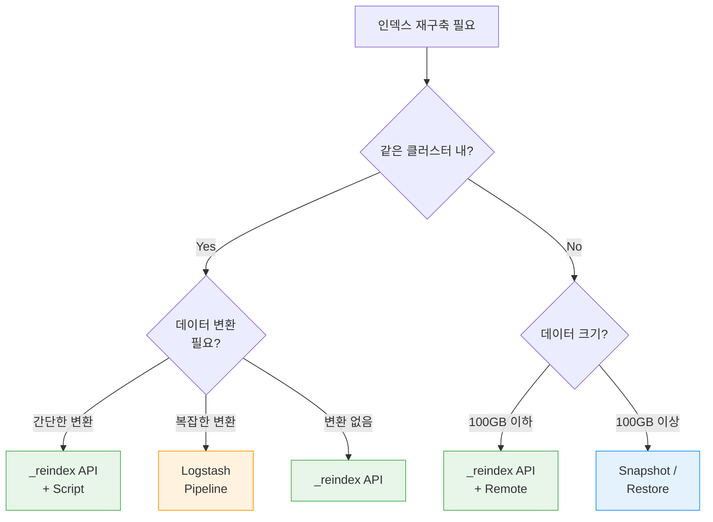

대용량 인덱스를 효율적으로 재구축하는 방법을 안내합니다.

**소요 시간**: 약 30-60분 (데이터 크기에 따라 수 시간 소요 가능)


**다루는 내용**: _reindex API, Snapshot/Restore, Logstash 비교, 대용량 처리 전략, 성능 최적화

**다루지 않는 내용**: 단순 매핑 변경은 [매핑 마이그레이션](../mapping-migration/)을, 클러스터 확장은 [클러스터 확장](../cluster-scaling/)을 참조하세요.



- **_reindex API**: 가장 간단, 같은 클러스터 내 재구축에 적합
- **Snapshot/Restore**: 클러스터 간 이동, 대용량 데이터에 적합
- **Logstash**: 변환이 복잡하거나 외부 소스와 연동할 때 적합
- **성능 최적화**: `refresh_interval: -1`, replica 0, sliced scroll 활용


---

## 시작하기 전에

다음 조건을 확인하세요:

| 항목 | 요구사항 | 확인 방법 |
|------|---------|----------|
| Elasticsearch 버전 | 7.x 이상 | `curl -X GET "localhost:9200"` |
| 클러스터 상태 | green | `curl -X GET "localhost:9200/_cluster/health"` |
| 디스크 공간 | 인덱스 크기의 2배 이상 여유 | `curl -X GET "localhost:9200/_cat/allocation?v"` |
| 인덱스 권한 | 읽기 + 쓰기 + 관리 | 아래 명령어로 테스트 |

```bash
# 인덱스 크기 확인
curl -X GET "localhost:9200/_cat/indices/products?v&h=index,docs.count,store.size"

# 디스크 여유 공간 확인
curl -X GET "localhost:9200/_cat/allocation?v&h=node,disk.avail,disk.total,disk.percent"
```


인덱스 재구축 중에는 디스크 I/O와 CPU 사용량이 크게 증가합니다. 운영 시간을 피해 진행하거나, 리소스 제한을 설정하세요.


---

## 증상

다음과 같은 상황에서 인덱스 재구축이 필요합니다:

- 샤드 수를 변경해야 할 때 (생성 후 변경 불가)
- 매핑을 대규모로 변경해야 할 때
- 오래된 데이터를 정리하거나 구조를 개편할 때
- 인덱스 성능이 지속적으로 저하될 때

```bash
# 샤드 수 확인 (변경 불가능한 설정)
curl -X GET "localhost:9200/products/_settings?pretty&filter_path=**.number_of_shards"

# 응답: "number_of_shards": "1" ← 변경하려면 재구축 필요
```

---

## 방법 선택 가이드



### 방법별 비교

| 항목 | _reindex API | Snapshot/Restore | Logstash |
|------|-------------|-----------------|----------|
| **난이도** | 쉬움 | 보통 | 보통 |
| **속도** | 빠름 | 매우 빠름 | 보통 |
| **데이터 변환** | Script (간단) | 불가 | 매우 유연 |
| **클러스터 간** | remote 옵션 | 가능 | 가능 |
| **리소스 사용** | 높음 | 낮음 | 보통 |
| **적합한 크기** | ~수백GB | 제한 없음 | ~수백GB |

---

## 방법 1: _reindex API

### 1.1 새 인덱스 준비

```bash
# 변경된 설정으로 새 인덱스 생성
curl -X PUT "localhost:9200/products-v2" -H 'Content-Type: application/json' -d'
{
  "settings": {
    "number_of_shards": 5,
    "number_of_replicas": 0,
    "refresh_interval": "-1"
  },
  "mappings": {
    "properties": {
      "name": { "type": "text", "analyzer": "standard" },
      "price": { "type": "double" },
      "category": { "type": "keyword" },
      "created_at": { "type": "date" }
    }
  }
}'
```

### 1.2 기본 Reindex

```bash
curl -X POST "localhost:9200/_reindex?wait_for_completion=false" -H 'Content-Type: application/json' -d'
{
  "source": {
    "index": "products-v1",
    "size": 5000
  },
  "dest": {
    "index": "products-v2"
  }
}'

# 응답: {"task": "node-1:54321"}
```

### 1.3 Sliced Scroll로 병렬 처리

대용량 인덱스에서는 sliced scroll을 사용하여 병렬로 Reindex합니다:

```bash
# 자동 슬라이싱 (샤드 수에 맞춰 자동 분할)
curl -X POST "localhost:9200/_reindex?wait_for_completion=false" -H 'Content-Type: application/json' -d'
{
  "source": {
    "index": "products-v1",
    "size": 5000,
    "slice": {
      "id": 0,
      "max": 5
    }
  },
  "dest": {
    "index": "products-v2"
  }
}'

# 또는 자동 슬라이싱 (ES 7.x+)
curl -X POST "localhost:9200/_reindex?slices=auto&wait_for_completion=false" -H 'Content-Type: application/json' -d'
{
  "source": { "index": "products-v1" },
  "dest": { "index": "products-v2" }
}'
```

### 1.4 진행 상황 모니터링

```bash
# Task 상태 확인
curl -X GET "localhost:9200/_tasks/node-1:54321?pretty"

# 전체 Reindex 작업 목록
curl -X GET "localhost:9200/_tasks?actions=*reindex&detailed&pretty"

# 작업 취소 (필요한 경우)
curl -X POST "localhost:9200/_tasks/node-1:54321/_cancel"
```

---

## 방법 2: Snapshot/Restore

대용량 데이터나 클러스터 간 이동 시 유용합니다.

### 2.1 Repository 등록

```bash
# 공유 파일 시스템 Repository
curl -X PUT "localhost:9200/_snapshot/my_backup" -H 'Content-Type: application/json' -d'
{
  "type": "fs",
  "settings": {
    "location": "/mnt/backups/elasticsearch"
  }
}'
```

### 2.2 Snapshot 생성

```bash
# 특정 인덱스만 스냅샷
curl -X PUT "localhost:9200/_snapshot/my_backup/products_snapshot?wait_for_completion=true" -H 'Content-Type: application/json' -d'
{
  "indices": "products-v1",
  "ignore_unavailable": true,
  "include_global_state": false
}'
```

### 2.3 다른 이름으로 Restore

```bash
# 이름을 변경하여 복원
curl -X POST "localhost:9200/_snapshot/my_backup/products_snapshot/_restore" -H 'Content-Type: application/json' -d'
{
  "indices": "products-v1",
  "rename_pattern": "products-v1",
  "rename_replacement": "products-v2",
  "index_settings": {
    "index.number_of_replicas": 0
  }
}'
```


Snapshot/Restore는 매핑이나 설정을 변경할 수 없습니다. 구조 변경이 필요하면 Restore 후 _reindex를 추가로 수행하세요.


---

## 방법 3: Logstash

복잡한 데이터 변환이 필요할 때 사용합니다.

### 3.1 Logstash Pipeline 설정

```ruby
# logstash-reindex.conf
input {
  elasticsearch {
    hosts => ["localhost:9200"]
    index => "products-v1"
    query => '{ "query": { "match_all": {} } }'
    size => 5000
    scroll => "5m"
    docinfo => true
  }
}

filter {
  # 복잡한 변환 로직
  mutate {
    convert => { "price" => "float" }
    rename => { "old_field" => "new_field" }
    remove_field => ["unwanted_field"]
  }
}

output {
  elasticsearch {
    hosts => ["localhost:9200"]
    index => "products-v2"
    document_id => "%{[@metadata][_id]}"
    action => "index"
  }
}
```

### 3.2 실행

```bash
bin/logstash -f logstash-reindex.conf
```

---

## 성능 최적화

### 대상 인덱스 설정

Reindex 전에 대상 인덱스의 설정을 최적화합니다:

```bash
# 1. Refresh 비활성화
curl -X PUT "localhost:9200/products-v2/_settings" -H 'Content-Type: application/json' -d'
{ "refresh_interval": "-1" }'

# 2. Replica 0으로 설정
curl -X PUT "localhost:9200/products-v2/_settings" -H 'Content-Type: application/json' -d'
{ "number_of_replicas": 0 }'

# 3. Translog 설정 조정 (선택)
curl -X PUT "localhost:9200/products-v2/_settings" -H 'Content-Type: application/json' -d'
{
  "index.translog.durability": "async",
  "index.translog.sync_interval": "30s"
}'
```


`translog.durability: async`는 데이터 유실 위험이 있습니다. 재구축 중에만 사용하고, 완료 후 반드시 `request`로 복구하세요.


### 완료 후 설정 복구

```bash
# Refresh 복구
curl -X PUT "localhost:9200/products-v2/_settings" -H 'Content-Type: application/json' -d'
{ "refresh_interval": "1s" }'

# Replica 복구
curl -X PUT "localhost:9200/products-v2/_settings" -H 'Content-Type: application/json' -d'
{ "number_of_replicas": 1 }'

# Translog 복구
curl -X PUT "localhost:9200/products-v2/_settings" -H 'Content-Type: application/json' -d'
{ "index.translog.durability": "request" }'

# 수동 Refresh
curl -X POST "localhost:9200/products-v2/_refresh"

# Force Merge (선택: 세그먼트 최적화)
curl -X POST "localhost:9200/products-v2/_forcemerge?max_num_segments=1"
```

---

## 체크리스트

인덱스 재구축 시 확인사항:

- [ ] **디스크 공간이 충분한가?** - 인덱스 크기의 2배 이상 여유
- [ ] **클러스터 상태가 green인가?** - yellow이면 기존 문제 먼저 해결
- [ ] **재구축 방법을 선택했는가?** - _reindex / Snapshot / Logstash
- [ ] **성능 최적화를 적용했는가?** - refresh, replica, translog 설정
- [ ] **문서 수가 일치하는가?** - 원본과 새 인덱스 비교
- [ ] **설정을 복구했는가?** - refresh_interval, replica, translog

---

## 성공 확인

재구축이 성공했는지 다음 방법으로 확인하세요:

1. **문서 수 비교**: 원본과 동일한지 확인
   ```bash
   echo "원본:" && curl -s "localhost:9200/products-v1/_count" | python3 -m json.tool
   echo "새 인덱스:" && curl -s "localhost:9200/products-v2/_count" | python3 -m json.tool
   ```

2. **클러스터 상태 확인**: 재구축 후 green 상태인지 확인
   ```bash
   curl -X GET "localhost:9200/_cluster/health?pretty"
   ```

3. **샘플 쿼리 테스트**: 주요 쿼리가 정상 동작하는지 확인
   ```bash
   curl -X GET "localhost:9200/products-v2/_search?pretty" -H 'Content-Type: application/json' -d'
   {
     "query": { "match_all": {} },
     "size": 5
   }'
   ```


- 문서 수가 원본과 동일
- 클러스터 상태 green
- 주요 쿼리가 정상 동작
- 설정(refresh, replica, translog)이 복구됨


---

## 자주 발생하는 오류

### "circuit_breaking_exception" during reindex

```json
{
  "error": {
    "type": "circuit_breaking_exception",
    "reason": "Data too large"
  }
}
```

**원인**: Reindex 중 메모리 부족

**해결**: `source.size` 값을 줄이세요:
```bash
"source": { "index": "products-v1", "size": 1000 }
```

### Task가 사라짐

**원인**: 노드 재시작으로 Task가 유실됨

**해결**: `.tasks` 인덱스에서 완료된 Task를 확인하세요:
```bash
curl -X GET "localhost:9200/.tasks/_search?pretty" -H 'Content-Type: application/json' -d'
{
  "query": { "match": { "task.action": "indices:data/write/reindex" } }
}'
```

### 버전 충돌

```json
{
  "failures": [{
    "cause": { "type": "version_conflict_engine_exception" }
  }]
}
```

**원인**: 소스 인덱스에 동시에 쓰기가 발생

**해결**: `conflicts: proceed`로 충돌을 무시하거나, 소스 인덱스를 read-only로 설정하세요:
```bash
# 충돌 무시
"conflicts": "proceed"

# 또는 소스 인덱스를 read-only로 설정
curl -X PUT "localhost:9200/products-v1/_settings" -H 'Content-Type: application/json' -d'
{ "index.blocks.write": true }'
```

---

## 관련 문서

- [매핑 마이그레이션](../mapping-migration/) - 매핑 변경 시 무중단 마이그레이션
- [클러스터 확장](../cluster-scaling/) - 클러스터 수준 확장
- [메모리 문제 해결](../memory-troubleshooting/) - 재구축 중 메모리 문제 대응
