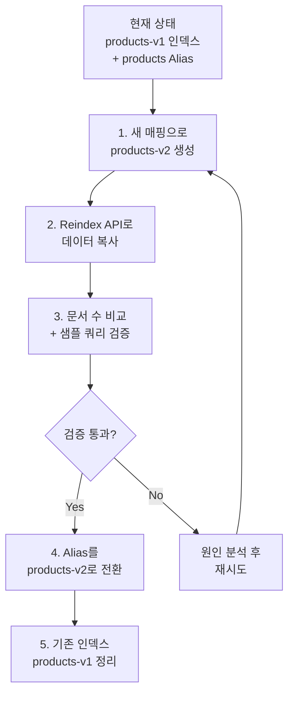

다운타임 없이 인덱스 매핑(필드 타입, 분석기 등)을 변경하는 방법을 안내합니다.

**소요 시간**: 약 20-40분 (데이터 크기에 따라 추가 소요)


**다루는 내용**: Reindex API를 활용한 무중단 매핑 변경, Alias 전환 전략, 검증 방법

**다루지 않는 내용**: 대규모 인덱스 재구축은 [인덱스 재구축](index-rebuild/)을, 클러스터 수준 변경은 [클러스터 확장](cluster-scaling/)을 참조하세요.



- **Alias 기반 운영**: 애플리케이션은 Alias를 통해 인덱스에 접근
- **새 인덱스 생성**: 변경된 매핑으로 새 인덱스를 만들고 Reindex
- **Alias 전환**: 검증 완료 후 Alias를 새 인덱스로 전환
- **롤백 가능**: 이전 인덱스를 삭제하지 않으면 즉시 롤백 가능


---

## 시작하기 전에

다음 조건을 확인하세요:

| 항목 | 요구사항 | 확인 방법 |
|------|---------|----------|
| Elasticsearch 버전 | 7.x 이상 | `curl -X GET "localhost:9200"` |
| 클러스터 상태 | green 또는 yellow | `curl -X GET "localhost:9200/_cluster/health"` |
| 인덱스 접근 권한 | 읽기 + 쓰기 + Alias 관리 | 아래 명령어로 테스트 |

```bash
# 현재 매핑 확인
curl -X GET "localhost:9200/products/_mapping?pretty"

# Alias 상태 확인
curl -X GET "localhost:9200/_cat/aliases?v"
```


Reindex는 소스 인덱스의 모든 문서를 복사합니다. 디스크 공간이 기존 인덱스 크기의 2배 이상 있는지 확인하세요.


---

## 증상

다음과 같은 상황에서 매핑 마이그레이션이 필요합니다:

- 필드 타입을 변경해야 할 때 (예: `text` → `keyword`, `long` → `double`)
- 분석기를 교체해야 할 때 (예: `standard` → `nori` 한글 분석기)
- 기존 필드에 `multi-field`를 추가해야 할 때

```bash
# 매핑 변경 시도 시 오류 예시
curl -X PUT "localhost:9200/products/_mapping" -H 'Content-Type: application/json' -d'
{
  "properties": {
    "price": { "type": "double" }
  }
}'

# 응답: "mapper [price] cannot be changed from type [long] to [double]"
```

---

## 마이그레이션 흐름



---

## 1단계: 현재 인덱스 상태 확인

### 1.1 기존 매핑 백업

```bash
# 현재 매핑을 파일로 저장
curl -s -X GET "localhost:9200/products/_mapping?pretty" > products_mapping_backup.json

# 현재 설정도 저장
curl -s -X GET "localhost:9200/products/_settings?pretty" > products_settings_backup.json

# 문서 수 기록 (나중에 검증용)
curl -s -X GET "localhost:9200/products/_count?pretty"
```

### 1.2 Alias 확인

애플리케이션이 Alias를 사용하고 있는지 확인합니다:

```bash
# Alias 목록 확인
curl -X GET "localhost:9200/_cat/aliases/products?v"

# 결과 예시:
# alias    index        filter routing.index routing.search
# products products-v1  -      -             -
```


Alias 없이 인덱스 이름을 직접 사용하고 있다면, 먼저 Alias를 설정하세요. 그래야 무중단 전환이 가능합니다.


```bash
# Alias가 없는 경우: 기존 인덱스에 Alias 추가
curl -X POST "localhost:9200/_aliases" -H 'Content-Type: application/json' -d'
{
  "actions": [
    { "add": { "index": "products-v1", "alias": "products" } }
  ]
}'
```

---

## 2단계: 새 인덱스 생성

변경된 매핑으로 새 인덱스를 만듭니다:

```bash
# 예시: price를 long → double로, name에 nori 분석기 적용
curl -X PUT "localhost:9200/products-v2" -H 'Content-Type: application/json' -d'
{
  "settings": {
    "number_of_shards": 3,
    "number_of_replicas": 0,
    "refresh_interval": "-1",
    "analysis": {
      "analyzer": {
        "korean": {
          "type": "custom",
          "tokenizer": "nori_tokenizer"
        }
      }
    }
  },
  "mappings": {
    "properties": {
      "name": {
        "type": "text",
        "analyzer": "korean",
        "fields": {
          "keyword": { "type": "keyword" }
        }
      },
      "price": { "type": "double" },
      "category": { "type": "keyword" },
      "created_at": { "type": "date" }
    }
  }
}'
```


Reindex 성능을 위해 새 인덱스 생성 시 `refresh_interval: "-1"`과 `number_of_replicas: 0`으로 설정합니다. 마이그레이션 완료 후 원래 값으로 복구합니다.


---

## 3단계: Reindex로 데이터 복사

### 3.1 기본 Reindex

```bash
curl -X POST "localhost:9200/_reindex" -H 'Content-Type: application/json' -d'
{
  "source": {
    "index": "products-v1"
  },
  "dest": {
    "index": "products-v2"
  }
}'
```

### 3.2 필드 변환이 필요한 경우

Script를 사용하여 데이터를 변환하면서 복사할 수 있습니다:

```bash
curl -X POST "localhost:9200/_reindex" -H 'Content-Type: application/json' -d'
{
  "source": {
    "index": "products-v1"
  },
  "dest": {
    "index": "products-v2"
  },
  "script": {
    "source": "ctx._source.price = (double) ctx._source.price",
    "lang": "painless"
  }
}'
```

### 3.3 대용량 인덱스의 경우

비동기로 실행하여 타임아웃을 피합니다:

```bash
# 비동기 실행
curl -X POST "localhost:9200/_reindex?wait_for_completion=false" -H 'Content-Type: application/json' -d'
{
  "source": {
    "index": "products-v1",
    "size": 5000
  },
  "dest": {
    "index": "products-v2"
  }
}'

# 응답: {"task": "node-1:12345"}

# 진행 상황 확인
curl -X GET "localhost:9200/_tasks/node-1:12345?pretty"
```

---

## 4단계: 검증

### 4.1 문서 수 비교

```bash
# 원본 문서 수
curl -s -X GET "localhost:9200/products-v1/_count" | python3 -m json.tool

# 새 인덱스 문서 수
curl -s -X GET "localhost:9200/products-v2/_count" | python3 -m json.tool

# 두 값이 동일해야 합니다
```

### 4.2 샘플 쿼리 테스트

```bash
# 새 인덱스에서 refresh 실행 (검색 가능하도록)
curl -X POST "localhost:9200/products-v2/_refresh"

# 샘플 검색 테스트
curl -X GET "localhost:9200/products-v2/_search?pretty" -H 'Content-Type: application/json' -d'
{
  "query": {
    "match": { "name": "갤럭시" }
  }
}'

# 집계 테스트
curl -X GET "localhost:9200/products-v2/_search?pretty" -H 'Content-Type: application/json' -d'
{
  "size": 0,
  "aggs": {
    "categories": {
      "terms": { "field": "category" }
    }
  }
}'
```

### 4.3 매핑 변경 확인

```bash
# 새 매핑이 올바르게 적용되었는지 확인
curl -X GET "localhost:9200/products-v2/_mapping?pretty"
```

---

## 5단계: Alias 전환

검증이 완료되면 Alias를 원자적으로 전환합니다:

```bash
# 원자적 Alias 전환 (다운타임 없음)
curl -X POST "localhost:9200/_aliases" -H 'Content-Type: application/json' -d'
{
  "actions": [
    { "remove": { "index": "products-v1", "alias": "products" } },
    { "add": { "index": "products-v2", "alias": "products" } }
  ]
}'
```


`_aliases` API의 actions 배열은 **원자적으로** 실행됩니다. 두 동작 사이에 검색 요청이 실패하는 일은 없습니다.


---

## 6단계: 마이그레이션 후 설정 복구

```bash
# refresh_interval 복구
curl -X PUT "localhost:9200/products-v2/_settings" -H 'Content-Type: application/json' -d'
{ "refresh_interval": "1s" }'

# replica 수 복구
curl -X PUT "localhost:9200/products-v2/_settings" -H 'Content-Type: application/json' -d'
{ "number_of_replicas": 1 }'
```

---

## 체크리스트

매핑 마이그레이션 시 확인사항:

- [ ] **디스크 공간이 충분한가?** - 기존 인덱스 크기의 2배 이상
- [ ] **새 매핑을 테스트했는가?** - 소규모 데이터로 먼저 검증
- [ ] **Alias를 사용하고 있는가?** - 무중단 전환의 전제 조건
- [ ] **문서 수가 일치하는가?** - 원본과 새 인덱스 비교
- [ ] **샘플 쿼리가 정상인가?** - 검색, 집계 모두 테스트
- [ ] **설정을 복구했는가?** - refresh_interval, replica 수

---

## 성공 확인

마이그레이션이 성공했는지 다음 방법으로 확인하세요:

1. **Alias 확인**: Alias가 새 인덱스를 가리키는지 확인
   ```bash
   curl -X GET "localhost:9200/_cat/aliases/products?v"
   # products products-v2 가 출력되어야 함
   ```

2. **애플리케이션 동작 확인**: 기존 API가 정상적으로 응답하는지 확인

3. **성능 확인**: 변경된 매핑으로 인한 성능 차이가 없는지 확인
   ```bash
   curl -X GET "localhost:9200/products/_search?pretty" -H 'Content-Type: application/json' -d'
   {
     "query": { "match": { "name": "테스트" } }
   }' | grep took
   ```


- Alias가 새 인덱스(products-v2)를 가리킴
- 문서 수가 원본과 동일
- 애플리케이션 쿼리가 정상 동작
- 롤백이 필요하면 Alias만 되돌리면 됨


---

## 자주 발생하는 오류

### "mapper_parsing_exception"

```json
{
  "error": {
    "type": "mapper_parsing_exception",
    "reason": "failed to parse field [price] of type [double]"
  }
}
```

**원인**: 원본 데이터가 새 매핑의 타입으로 변환할 수 없음

**해결**: Reindex 시 Script로 데이터를 변환하세요:
```bash
"script": {
  "source": "ctx._source.price = Double.parseDouble(ctx._source.price.toString())"
}
```

### Reindex 속도가 느림

**원인**: 기본 설정으로는 throttle이 걸릴 수 있음

**해결**: `requests_per_second`를 조정하세요:
```bash
curl -X POST "localhost:9200/_reindex?requests_per_second=-1" -H 'Content-Type: application/json' -d'
{
  "source": { "index": "products-v1" },
  "dest": { "index": "products-v2" }
}'
```

### "index_already_exists_exception"

**원인**: products-v2 인덱스가 이미 존재

**해결**: 기존 실패한 인덱스를 삭제하고 재시도하세요:
```bash
curl -X DELETE "localhost:9200/products-v2"
```

---

## 관련 문서

- [인덱스 재구축](index-rebuild/) - 대규모 인덱스 재구축 전략
- [클러스터 확장](cluster-scaling/) - 클러스터 수준 확장
- [느린 쿼리 최적화](slow-query-optimization/) - 쿼리 성능 개선
