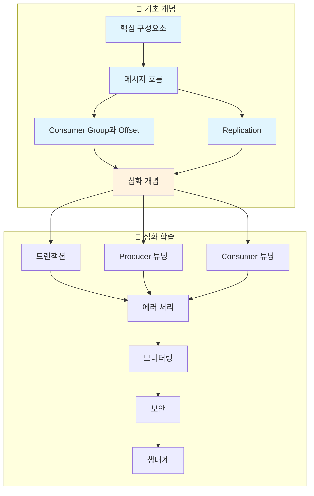

## 왜 개념 이해가 중요한가?

Kafka를 사용하다 보면 이런 질문들과 마주하게 됩니다:

- "Consumer Lag이 갑자기 증가했는데 원인을 모르겠다"
- "메시지가 중복 처리되는 것 같은데 어디서 문제가 생긴 걸까?"
- "Broker 한 대가 죽었는데 서비스에는 문제가 없을까?"

이런 질문에 답하려면 API 사용법만으로는 부족합니다. **Kafka가 왜 이렇게 설계되었는지**, 그 철학을 이해해야 합니다.

### 우체국에 비유해서 이해하기

Kafka는 **대규모 우체국 시스템**과 비슷합니다:

| 우체국 | Kafka | 역할 |
|--------|-------|------|
| 발신자 | Producer | 메시지를 보내는 주체 |
| 우체국 지점 | Broker | 메시지를 보관하고 전달하는 서버 |
| 우편함 종류 | Topic | 메시지의 분류 체계 |
| 우편함 칸 | Partition | 순서가 보장되는 메시지 저장 공간 |
| 수신자 | Consumer | 메시지를 받아가는 주체 |
| 수신자 그룹 | Consumer Group | 메시지를 나눠서 처리하는 협력 조직 |
| 읽은 위치 표시 | Offset | 어디까지 읽었는지 기록 |

이 비유를 기억하면 각 개념이 왜 필요한지 쉽게 이해할 수 있습니다.

### 이 섹션의 대상 독자

**선수 지식**:
- 기본적인 분산 시스템 개념 (서버-클라이언트, 네트워크)
- REST API 또는 메시지 큐의 기본 개념

**학습 후 얻게 되는 것**:
- Kafka 클러스터 구조를 설명할 수 있음
- 운영 중 발생하는 문제의 원인을 추론할 수 있음
- 성능과 안정성 사이의 트레이드오프를 이해하고 선택할 수 있음

---

## 학습 로드맵

아래 다이어그램은 개념 간 의존 관계를 보여줍니다. 화살표 방향으로 학습하세요.

#### 학습 순서

아래 학습 순서는 개념 간 의존성을 고려하여 설계되었습니다. **기초 개념(1~5번)만 학습해도 대부분의 운영 상황을 이해할 수 있습니다.** 심화 학습은 성능 최적화나 고급 기능이 필요할 때 참고하세요.

---

### 🔰 기초 개념

> **목표**: Kafka의 전체 그림을 이해하고 "메시지가 어떻게 흘러가는가"를 설명할 수 있게 됩니다.

기초 개념에서는 Kafka 클러스터를 구성하는 핵심 요소들과 메시지가 전달되는 과정을 다룹니다.

| # | 주제 | 해결하는 질문 |
|---|------|---------------|
| 1 | [핵심 구성요소](core-components/) | "Kafka는 어떤 부품들로 구성되어 있나?" |
| 2 | [메시지 흐름](message-flow/) | "메시지가 Producer에서 Consumer까지 어떻게 전달되나?" |
| 3 | [Consumer Group과 Offset](consumer-group/) | "여러 Consumer가 어떻게 협력하나? 어디까지 읽었는지 어떻게 기억하나?" |
| 4 | [Replication](replication/) | "서버가 죽어도 데이터가 안전한 이유는?" |
| 5 | [심화 개념](advanced-concepts/) | "acks, Message Key, 보존 정책 등 자주 쓰는 설정은?" |


**💡 여기까지만 읽어도 충분합니다**

기초 개념 5개를 이해하면 Kafka를 활용한 애플리케이션 개발과 기본적인 운영이 가능합니다. 심화 학습은 성능 문제가 발생하거나 고급 기능이 필요할 때 돌아오세요.


---

### 🚀 심화 학습

> **목표**: 프로덕션 환경에서 성능 최적화, 장애 대응, 보안 설정을 할 수 있게 됩니다.

심화 학습은 운영 환경에서 Kafka를 안정적이고 효율적으로 운영하기 위한 고급 주제들입니다. **필요한 주제만 선택적으로 학습하세요.**

| # | 주제 | 언제 필요한가? |
|---|------|----------------|
| 6 | [트랜잭션과 Exactly-Once](transactions/) | 메시지 중복/유실이 절대 허용되지 않을 때 |
| 7 | [Producer 튜닝](producer-tuning/) | 처리량을 높이거나 지연시간을 줄여야 할 때 |
| 8 | [Consumer 튜닝](consumer-tuning/) | Consumer Lag이 계속 증가할 때 |
| 9 | [에러 처리 심화](error-handling/) | 실패한 메시지를 체계적으로 관리해야 할 때 |
| 10 | [모니터링 기초](monitoring/) | 클러스터 상태를 실시간으로 파악해야 할 때 |
| 11 | [보안](security/) | 멀티 테넌트 환경이나 외부 접근 제어가 필요할 때 |
| 12 | [생태계](ecosystem/) | Kafka Connect, Schema Registry 등 확장 도구가 필요할 때 |

---

## 핵심 요약

- **Kafka = 대규모 우체국**: Producer(발신자)가 보낸 메시지를 Broker(우체국)가 Topic/Partition(우편함)에 저장하고, Consumer(수신자)가 읽어감
- **기초 5개만 마스터하면 80%**: 핵심 구성요소 → 메시지 흐름 → Consumer Group → Replication → 심화 개념
- **심화는 선택적 학습**: 성능 문제, 장애 대응, 보안 요구사항이 생겼을 때 돌아오기
