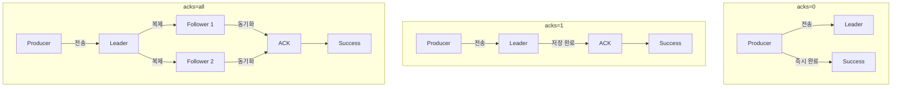
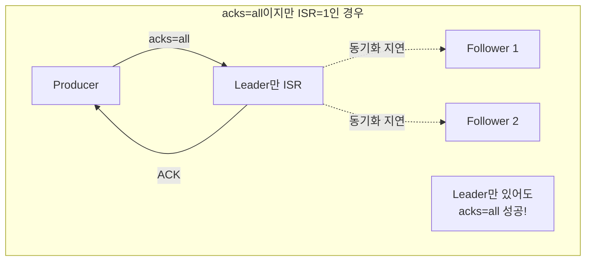
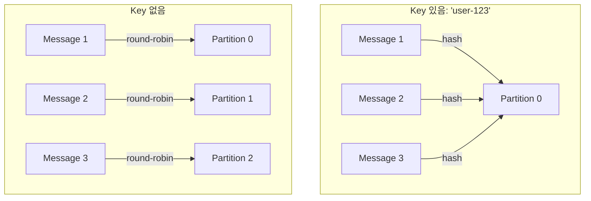
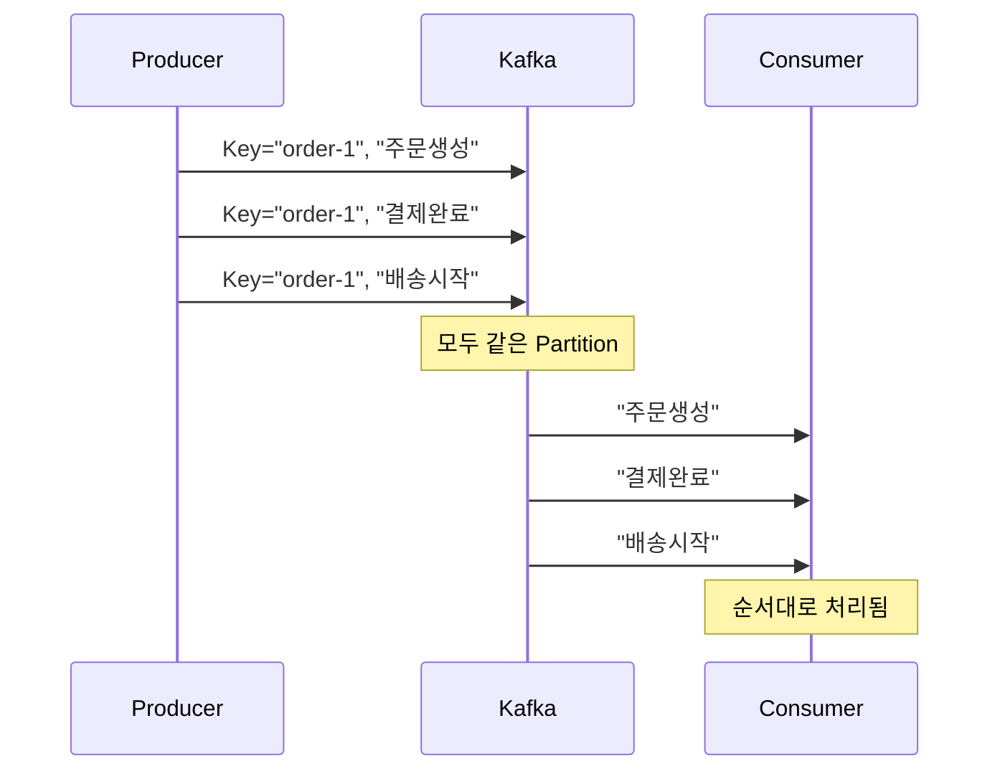
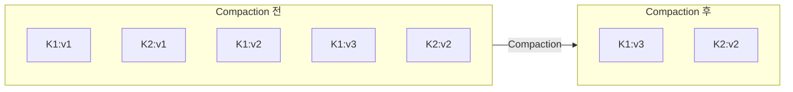
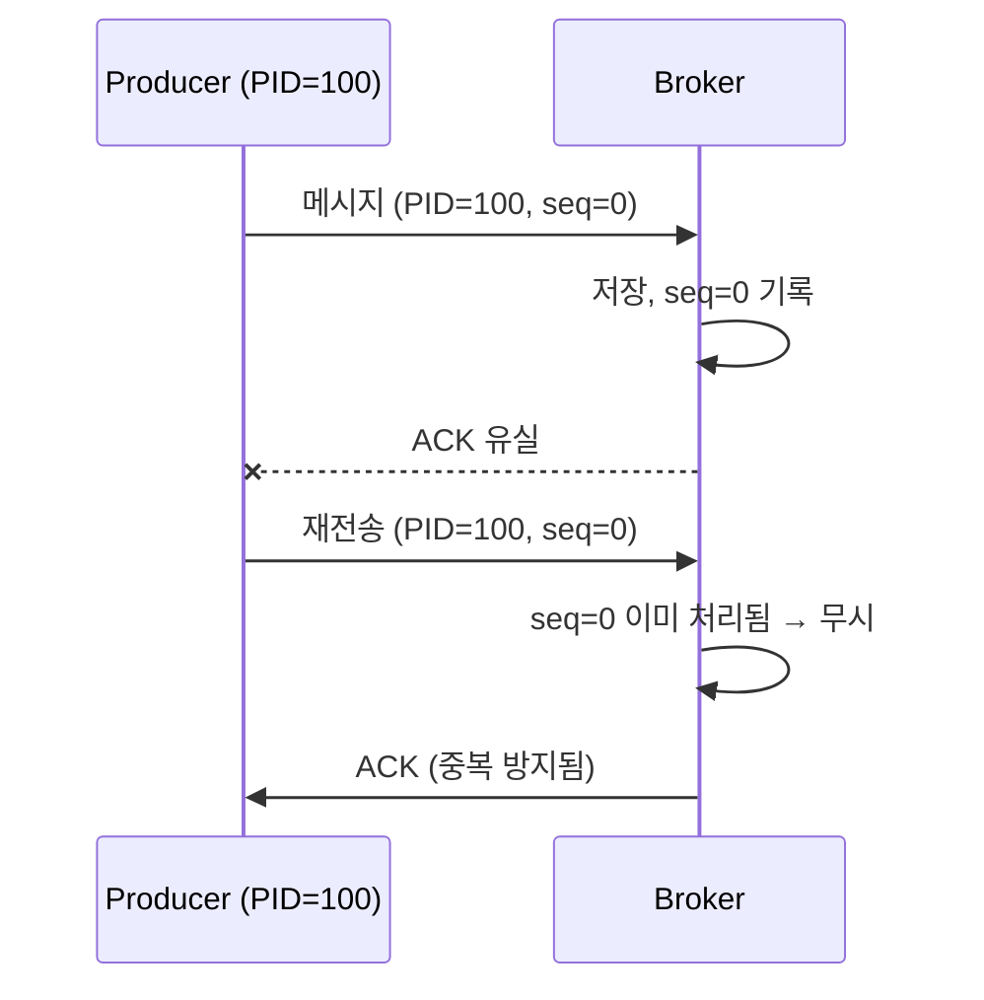


- acks=0(빠름/유실 가능), acks=1(Leader만 확인), acks=all(ISR 전체 확인, 권장)
- acks=all + min.insync.replicas=2 조합으로 데이터 안전성 확보
- Message Key로 같은 Partition에 전송하여 순서 보장, Partition 수 변경 주의
- Retention: 시간 기반 삭제(기본 7일), 용량 기반 삭제, Log Compaction
- Idempotent Producer(Kafka 3.0+ 기본)로 네트워크 오류 시 중복 방지


**대상 독자**: Kafka의 심화 개념을 이해하고 프로덕션 설정을 최적화하려는 개발자

**선수 지식**: [메시지 흐름](message-flow/)의 Topic, Partition, Broker 개념, [Replication](replication/)의 ISR, Leader, Follower 개념

**소요 시간**: 약 25-30분

---

acks, Message Key, Retention 정책을 이해합니다. 이 문서는 Kafka 3.6.x 기준으로 작성되었으며, Spring Boot 3.2.x와 Spring Kafka 3.1.x, Java 17 환경에서 코드 예제가 검증되었습니다.

이 문서를 읽기 전에 [메시지 흐름](message-flow/)에서 Topic, Partition, Broker 개념을, [Replication](replication/)에서 ISR, Leader, Follower 개념을 먼저 이해하고 있어야 합니다.

#### acks (Acknowledgment)

acks는 Producer가 메시지 전송 성공을 어떻게 확인할지 결정하는 설정입니다. 이를 <strong>등기우편 발송</strong>에 비유하면 이해하기 쉽습니다:

| 등기우편 비유 | acks 설정 | 특징 |
|---------------|-----------|------|
| 우체통에 넣고 감 | acks=0 | 도착 확인 없음, 가장 빠름 |
| 우체국 창구에서 접수증 받음 | acks=1 | 접수만 확인, 배달은 미확인 |
| 수신자 서명 확인 후 완료 | acks=all | 도착까지 확인, 가장 안전 |

이 설정에 따라 메시지 안전성과 전송 속도 사이의 균형이 달라집니다.



*다이어그램: acks=0은 응답 대기 없이 즉시 완료. acks=1은 Leader 저장 확인 후 완료. acks=all은 Leader가 모든 ISR Follower에 복제 완료 후 ACK 반환.*

<strong>acks=0</strong>은 Producer가 Broker의 응답을 기다리지 않고 즉시 다음 메시지를 전송합니다. 가장 빠른 성능을 제공하지만, Broker에 도달했는지조차 확인하지 않으므로 메시지 유실 위험이 가장 높습니다. 로그 수집이나 메트릭처럼 일부 유실이 허용되는 경우에만 사용해야 합니다.

<strong>acks=1</strong>은 Leader Broker가 메시지를 저장한 후 ACK를 반환합니다. Leader 저장은 확인되지만, Follower에 복제되기 전에 Leader가 장애를 일으키면 메시지가 유실될 수 있습니다. 속도와 안전성의 균형이 필요한 일반적인 이벤트 처리에 적합합니다.

<strong>acks=all</strong>은 ISR에 있는 모든 복제본에 메시지가 복제된 후에야 ACK를 반환합니다. 가장 느리지만 가장 안전한 설정으로, 결제나 주문과 같이 데이터 유실이 치명적인 경우에 사용합니다.

**acks=all의 함정과 해결책**

`acks=all`만으로는 데이터 안전성이 완전히 보장되지 않습니다. `acks=all`은 ISR에 있는 모든 복제본에 복제를 확인하는데, ISR에 Leader만 남아있다면 Leader 하나에만 저장해도 성공으로 처리됩니다.



*위 다이어그램은 acks=all이지만 ISR이 Leader 하나뿐인 경우, Follower와 동기화 없이도 ACK가 반환되는 문제를 보여줍니다.*

이 문제를 해결하려면 `min.insync.replicas` 설정을 함께 사용해야 합니다. 이 설정은 ACK를 반환하기 위해 동기화되어 있어야 하는 최소 복제본 수를 지정합니다. `acks=all`과 `min.insync.replicas=2`를 함께 사용하면 ISR에 최소 2개 이상의 복제본이 있어야만 쓰기가 성공합니다. ISR이 1개로 줄어들면 쓰기 요청이 실패하여 데이터 안전성이 보장됩니다.


- acks=0: 가장 빠름, 유실 가능 (로그/메트릭용)
- acks=1: Leader 확인만, Leader 장애 시 유실 가능
- acks=all: 모든 ISR 확인, 가장 안전 (프로덕션 권장)
- acks=all만으로는 불충분, min.insync.replicas=2와 함께 사용 필수


```yaml
# Topic 설정 (권장)
min.insync.replicas: 2  # 최소 2개 복제본 필요

# Producer 설정
acks: all
```

Spring Kafka에서는 다음과 같이 설정합니다.

```yaml
spring:
  kafka:
    producer:
      acks: all  # 권장
      retries: 3
```

#### Message Key

Message Key는 메시지를 특정 Partition으로 라우팅하는 데 사용됩니다. 이를 <strong>호텔 투숙객 관리</strong>에 비유하면:

- **Key가 있는 경우**: 같은 고객(Key)은 항상 같은 방(Partition)에 배정 → 그 고객의 요청이 순서대로 처리됨
- **Key가 없는 경우**: 빈 방 아무 데나 배정 → 효율적이지만 특정 고객 요청 순서 보장 안 됨

Key가 있으면 같은 Key를 가진 메시지는 항상 같은 Partition에 저장되어 순서가 보장됩니다.



*위 다이어그램은 Key 유무에 따른 Partition 할당 방식의 차이를 보여줍니다. Key가 있으면 같은 Partition에, 없으면 라운드로빈으로 분산됩니다.*

Key가 있으면 Kafka는 Key의 해시값을 계산하여 Partition을 결정합니다. 같은 Key는 항상 같은 해시값을 생성하므로 동일한 Partition에 저장됩니다. Key가 없으면 Sticky Partitioner(Kafka 2.4+)를 통해 배치 효율을 위해 일정 기간 같은 Partition에 전송하다가 다른 Partition으로 전환합니다.

**순서 보장의 원리**

동일한 Key를 사용하면 메시지가 동일한 Partition에 저장되고, 하나의 Partition은 하나의 Consumer가 순서대로 처리하므로 메시지 순서가 보장됩니다.



*위 다이어그램은 동일한 Key를 가진 메시지가 같은 Partition에 저장되어 순서대로 Consumer에게 전달되는 과정을 보여줍니다.*

사용자 ID를 Key로 사용하면 사용자별 이벤트 순서가 보장되고, 주문 ID를 Key로 사용하면 주문별 상태 변경 순서가 보장됩니다. IoT 환경에서는 기기 ID를 Key로 사용하여 디바이스별 데이터를 그룹화할 수 있습니다.

```java
import org.springframework.kafka.core.KafkaTemplate;
import org.springframework.stereotype.Service;

@Service
public class OrderProducer {

    private final KafkaTemplate<String, String> kafkaTemplate;

    public OrderProducer(KafkaTemplate<String, String> kafkaTemplate) {
        this.kafkaTemplate = kafkaTemplate;
    }

    // Key 지정 - 같은 orderId는 항상 같은 Partition으로
    public void sendOrder(String orderId, String orderJson) {
        kafkaTemplate.send("orders", orderId, orderJson);
        //                  Topic    Key      Value
    }

    // Key 없이 (Sticky Partitioner, Kafka 2.4+에서 기본)
    public void sendLog(String logMessage) {
        kafkaTemplate.send("logs", null, logMessage);
    }
}
```

**주의사항: Partition 수 변경**

Partition 수를 변경하면 Key 해시가 달라져 기존 메시지와 새 메시지가 다른 Partition에 저장될 수 있습니다. Key "A"가 원래 Partition 0에 저장되었더라도 Partition 수가 3에서 5로 늘어나면 Partition 2로 저장될 수 있습니다. 따라서 Key 기반 순서 보장이 필요한 토픽은 Partition 수를 처음부터 충분히 크게 설정하고 변경하지 않는 것이 좋습니다.

#### Retention (보관 정책)

Retention은 메시지를 얼마나 오래 보관할지 결정합니다. 이를 <strong>서류 보관 정책</strong>에 비유하면:

- **시간 기반 삭제**: "7년 지난 서류는 폐기" → retention.ms
- **용량 기반 삭제**: "캐비닛이 꽉 차면 오래된 것부터 폐기" → retention.bytes
- **Log Compaction**: "같은 제목 서류는 최신 것만 보관" → cleanup.policy=compact

Kafka는 이 세 가지 보관 정책을 제공합니다.

<strong>시간 기반 삭제</strong>는 지정된 시간이 지난 메시지를 삭제합니다. 기본값은 7일(604800000ms)입니다. 이벤트 로그는 7일, 감사 로그는 1년, 세션 데이터는 24시간과 같이 데이터 특성에 맞게 설정합니다.

```yaml
# Topic 설정
retention.ms: 604800000  # 7일 (기본값)
```

<strong>용량 기반 삭제</strong>는 Partition의 총 크기가 지정된 용량을 초과하면 오래된 세그먼트부터 삭제합니다. 디스크 용량 관리가 필요한 경우에 사용합니다.

```yaml
retention.bytes: 107374182400  # 100GB
```

<strong>Log Compaction</strong>은 Key별 마지막 값만 유지하는 정책입니다. 시간이나 용량이 아니라 Key 중복 여부를 기준으로 정리합니다. 사용자 프로필이나 설정 상태처럼 최신 값만 필요한 경우에 적합합니다.



*위 다이어그램은 Log Compaction의 동작 원리로, 같은 Key의 이전 값을 제거하고 최신 값만 유지하는 과정을 보여줍니다.*

Log Compaction은 백그라운드 스레드에서 비동기로 실행됩니다. 닫힌(Closed) 세그먼트만 Compaction 대상이 되며, 현재 쓰기 중인 Active 세그먼트는 제외됩니다. `min.cleanable.dirty.ratio` 설정이 0.5(기본값)이면 정리되지 않은 데이터가 50%를 초과할 때 Compaction이 시작됩니다.

**Tombstone 메시지 (삭제 처리)**

Log Compaction 환경에서 Key를 삭제하려면 value가 null인 Tombstone 메시지를 보냅니다. Tombstone은 `delete.retention.ms`(기본 24시간) 동안 유지된 후 다음 Compaction 때 완전히 삭제됩니다.

```java
import org.springframework.kafka.core.KafkaTemplate;
import org.springframework.stereotype.Service;

@Service
public class UserProfileService {

    private final KafkaTemplate<String, String> kafkaTemplate;

    public UserProfileService(KafkaTemplate<String, String> kafkaTemplate) {
        this.kafkaTemplate = kafkaTemplate;
    }

    // 사용자 프로필 삭제 (Tombstone 전송)
    public void deleteUserProfile(String userId) {
        // value가 null이면 Tombstone 메시지
        kafkaTemplate.send("user-profiles", userId, null);
        // delete.retention.ms(기본 24시간) 후 Key 완전 삭제
    }

    // 사용자 프로필 업데이트
    public void updateUserProfile(String userId, String profileJson) {
        kafkaTemplate.send("user-profiles", userId, profileJson);
    }
}
```

Consumer에서는 Tombstone 메시지(value가 null)를 받으면 해당 Key의 데이터를 삭제 처리해야 합니다.

```java
@KafkaListener(topics = "user-profiles", groupId = "profile-service")
public void consume(ConsumerRecord<String, String> record) {
    if (record.value() == null) {
        // Tombstone 메시지 - 삭제 처리
        log.info("User deleted: {}", record.key());
        userRepository.deleteById(record.key());
    } else {
        // 일반 업데이트
        userRepository.save(parseProfile(record.value()));
    }
}
```

**혼합 정책**

시간 기반 삭제와 Compaction을 동시에 적용할 수도 있습니다. `cleanup.policy=compact,delete`로 설정하면 "7일 이내의 데이터 중 Key별 최신 값만 유지"와 같은 정책을 구현할 수 있습니다.

```yaml
# 시간 기반 삭제 + Compaction 동시 적용
cleanup.policy: compact,delete
retention.ms: 604800000  # 7일
```

#### Idempotent Producer (멱등성 프로듀서)

Idempotent Producer는 네트워크 오류로 재전송 시 중복 메시지 방지를 보장합니다.

네트워크 오류로 ACK가 유실되면 Producer는 메시지가 저장되었는지 알 수 없어 재전송합니다. 일반 Producer는 이 경우 같은 메시지가 두 번 저장됩니다. Idempotent Producer는 각 메시지에 Producer ID(PID)와 시퀀스 번호를 부여하여 Broker가 중복을 감지하고 무시할 수 있게 합니다.



*위 다이어그램은 Idempotent Producer의 중복 방지 메커니즘으로, PID와 시퀀스 번호를 사용하여 ACK 유실 후 재전송 시에도 메시지가 한 번만 저장되는 과정을 보여줍니다.*

Kafka 3.0부터 `enable.idempotence=true`가 기본값입니다. 특별한 이유가 없다면 이 설정을 끄지 않는 것이 좋습니다. Idempotent Producer가 활성화되면 `acks=all`, `retries=Integer.MAX_VALUE`, `max.in.flight.requests.per.connection=5`가 자동으로 설정됩니다.

```yaml
spring:
  kafka:
    producer:
      properties:
        enable.idempotence: true  # 기본값: true (Kafka 3.0+)
```

#### 설정 예시 종합

<strong>고신뢰성 프로덕션 환경</strong>에서는 데이터 안전성을 최우선으로 설정합니다.

```yaml
# Producer
spring:
  kafka:
    producer:
      acks: all
      retries: 3
      properties:
        enable.idempotence: true  # Kafka 3.0+ 기본값
        max.in.flight.requests.per.connection: 5

# Topic 생성 시
kafka-topics.sh --create \
  --topic orders \
  --partitions 6 \
  --replication-factor 3 \
  --config min.insync.replicas=2 \
  --config retention.ms=604800000
```

<strong>고성능 로깅 환경</strong>에서는 처리량을 최우선으로 설정합니다.

```yaml
# Producer
spring:
  kafka:
    producer:
      acks: 0
      batch-size: 65536
      linger-ms: 10

# Topic
retention.ms: 86400000  # 1일
```

#### 정리

acks는 메시지 전송 보장 수준을 결정합니다. 프로덕션 환경에서는 `acks=all`과 `min.insync.replicas=2`를 함께 사용하여 데이터 안전성을 확보하는 것이 권장됩니다.

Message Key는 파티셔닝과 순서 보장에 사용됩니다. 순서가 중요한 메시지는 동일한 Key를 사용하여 같은 Partition에 저장하고, Partition 수 변경 시 Key 해시가 달라질 수 있음을 주의해야 합니다.

Retention은 데이터 보관 정책을 정의합니다. 이벤트 로그는 시간 기반 삭제를, 상태 저장에는 Log Compaction을 사용하며, 필요에 따라 두 정책을 함께 적용할 수 있습니다.

Idempotent Producer는 Kafka 3.0부터 기본 활성화되어 네트워크 오류 시 중복 메시지를 자동으로 방지합니다.

#### FAQ

**Q: acks=all이면 성능이 많이 떨어지나요?**

환경에 따라 다릅니다. 일반적으로 acks=1 대비 10~30% 레이턴시 증가가 예상됩니다. 처리량(throughput)은 배치 설정으로 보완 가능합니다.

**Q: Message Key 없이 순서를 보장할 수 있나요?**

Partition이 1개면 가능하지만 병렬성을 포기해야 합니다. 실무에서는 Key를 사용하는 것이 권장됩니다.

**Q: Log Compaction과 시간 기반 삭제를 함께 쓰면?**

`cleanup.policy=compact,delete` 설정 시 "N일 이내 데이터 중 Key별 최신 값만" 유지됩니다. 두 정책이 AND 조건으로 적용됩니다.

**Q: Idempotent Producer는 무조건 켜야 하나요?**

Kafka 3.0+에서는 기본값이 true입니다. 특별한 이유가 없다면 끄지 마세요. 성능 영향은 미미합니다.

**Q: min.insync.replicas=2인데 Broker가 2대뿐이면?**

1대라도 장애 나면 쓰기 불가(NotEnoughReplicasException)합니다. 최소 3대 Broker + RF=3 + min.insync.replicas=2 권장합니다.

#### 참고 자료

- [Kafka Producer Configs - Apache Kafka Documentation](https://kafka.apache.org/documentation/#producerconfigs)
- [Log Compaction - Confluent Documentation](https://docs.confluent.io/platform/current/kafka/design.html#log-compaction)
- [KIP-98: Exactly Once Delivery and Transactional Messaging](https://cwiki.apache.org/confluence/display/KAFKA/KIP-98)
- [Idempotent Producer - Confluent Blog](https://www.confluent.io/blog/exactly-once-semantics-are-possible-heres-how-apache-kafka-does-it/)

#### 다음 단계

- [트랜잭션과 Exactly-Once](transactions/) - 메시지 전달 보장과 트랜잭션 API
- [Producer 튜닝](producer-tuning/) - Producer 성능 최적화
