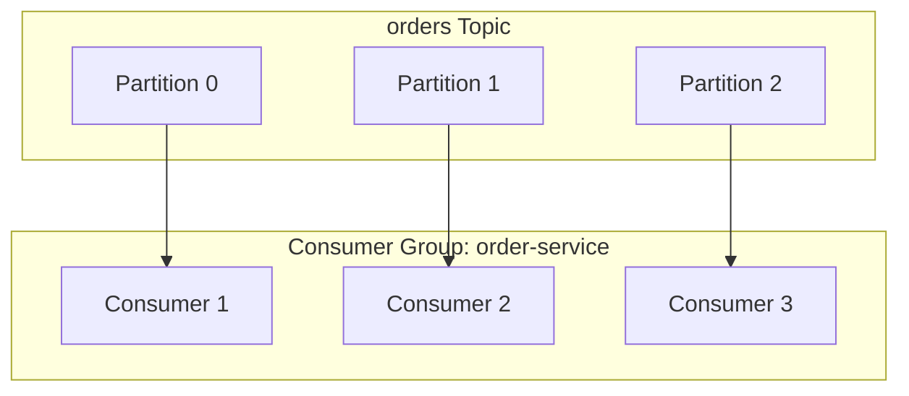
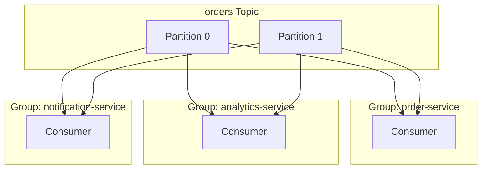
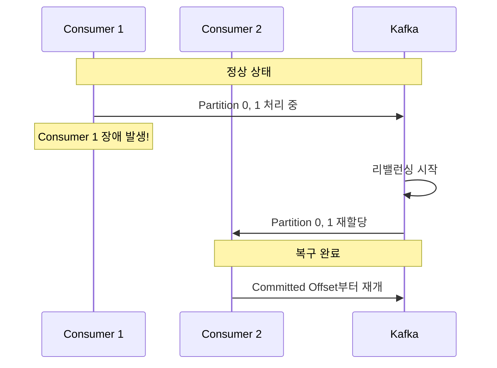


- Consumer Group은 동일 목적의 Consumer들을 묶어 병렬 처리하는 논리적 그룹
- 핵심 규칙: 하나의 Partition은 Group 내에서 하나의 Consumer만 읽을 수 있음
- Offset은 Partition 내 메시지 위치 번호로, __consumer_offsets 토픽에 저장
- 자동 커밋은 간편하지만 데이터 유실 위험, 수동 커밋은 정확한 제어 가능
- Consumer 장애 시 리밸런싱으로 Partition이 자동 재분배됨


**대상 독자**: Kafka Consumer를 개발하거나 운영하는 개발자, 병렬 처리와 상태 관리를 학습하려는 분

**선수 지식**: [메시지 흐름](../message-flow/)의 Topic과 Partition 개념, [Replication](../replication/)의 Leader/Follower 개념

---

병렬 처리와 진행 상태 관리의 핵심 개념을 이해합니다. 이 문서는 Kafka 3.6.x 기준으로 작성되었으며, Spring Boot 3.2.x와 Spring Kafka 3.1.x, Java 17 환경에서 코드 예제가 검증되었습니다.

이 문서를 읽기 전에 [메시지 흐름](../message-flow/)에서 Topic과 Partition 개념을, [Replication](../replication/)에서 Leader와 Follower 개념을 먼저 이해하고 있어야 합니다.

#### Consumer Group이란?

Consumer Group은 동일한 목적을 가진 Consumer들의 논리적 그룹입니다. 주문 처리 서비스를 예로 들면, 여러 서버 인스턴스가 각각 Consumer로 동작하면서 하나의 Consumer Group을 형성합니다. 이 그룹에 속한 Consumer들은 서로 협력하여 토픽의 메시지를 나눠서 처리합니다.



*다이어그램: orders Topic의 3개 Partition이 order-service Consumer Group의 3개 Consumer에 1:1로 할당되어 각 Consumer가 하나의 Partition을 전담하는 구조.*

위 다이어그램에서 orders 토픽은 3개의 Partition으로 구성되어 있고, order-service Consumer Group에는 3개의 Consumer가 있습니다. 각 Consumer가 하나의 Partition을 전담하여 처리하는 것을 볼 수 있습니다. 이것이 바로 Consumer Group의 핵심 동작 방식입니다.

**핵심 규칙: 하나의 Partition은 Consumer Group 내에서 하나의 Consumer만 읽을 수 있다**

이 규칙이 Kafka의 병렬 처리 모델을 정의합니다. 같은 Partition의 메시지는 반드시 동일한 Consumer가 순서대로 처리하므로 메시지 순서가 보장됩니다. 또한 여러 Consumer가 같은 메시지를 동시에 처리하는 일이 발생하지 않아 중복 처리를 방지할 수 있습니다.

**왜 이런 설계인가?**

Kafka 창시자 Jay Kreps가 이 규칙을 선택한 데는 명확한 이유가 있습니다. 첫째, 단순성입니다. Partition 내 순서만 보장하면 되므로 분산 락과 같은 복잡한 동기화 메커니즘이 필요 없습니다. 둘째, 성능입니다. Consumer 간 조율 오버헤드가 제거되어 처리 속도가 빨라집니다. 셋째, 확장성입니다. Partition 수가 곧 최대 병렬성을 의미하므로 스케일링 모델이 명확해집니다.


- Consumer Group은 동일 목적의 Consumer들을 묶어 병렬 처리하는 논리적 그룹
- 핵심 규칙: 하나의 Partition은 Group 내에서 하나의 Consumer만 읽을 수 있음
- 이 규칙으로 순서 보장, 중복 처리 방지, 단순한 동기화 구현 가능


#### Consumer 수와 Partition 수의 관계

Consumer와 Partition의 수는 성능과 리소스 효율성에 직접적인 영향을 미칩니다. Consumer 수가 Partition 수보다 적으면 일부 Consumer가 여러 Partition을 담당하게 됩니다. 이는 정상적인 동작이며, Consumer 하나가 여러 Partition의 메시지를 순차적으로 처리합니다.

Consumer 수와 Partition 수가 같으면 최적의 1:1 매핑이 이루어집니다. 각 Consumer가 정확히 하나의 Partition만 담당하므로 부하가 균등하게 분산되고 병렬 처리 효율이 최대화됩니다. 이것이 권장되는 구성입니다.

Consumer 수가 Partition 수보다 많으면 일부 Consumer는 할당받을 Partition이 없어 유휴 상태가 됩니다. 리소스 낭비이므로 이런 상황은 피해야 합니다. 다만, 장애 대비 용도로 약간의 여유 Consumer를 두는 경우도 있습니다.

```java
// 권장: Partition 수에 맞춰 Consumer 인스턴스 수 결정
// orders 토픽이 6개 Partition이면 최대 6개 Consumer 인스턴스
@KafkaListener(topics = "orders", groupId = "order-service")
public void consume(String message) {
    // Consumer 인스턴스 수는 Kubernetes Deployment replicas로 조절
}
```

실제 운영 환경에서는 Kubernetes Deployment의 replicas 설정으로 Consumer 인스턴스 수를 조절합니다. 토픽의 Partition 수를 먼저 결정하고, 이에 맞춰 replicas를 설정하는 것이 일반적인 패턴입니다.


- Consumer 수 < Partition 수: 일부 Consumer가 여러 Partition 담당 (정상)
- Consumer 수 = Partition 수: 최적의 1:1 매핑, 병렬 처리 효율 최대화
- Consumer 수 > Partition 수: 유휴 Consumer 발생, 리소스 낭비


#### 여러 Consumer Group

서로 다른 Consumer Group은 완전히 독립적으로 메시지를 소비합니다. 하나의 토픽에서 발생하는 메시지를 여러 서비스가 각자의 목적으로 처리해야 할 때 이 특성을 활용합니다.



*다이어그램: orders Topic의 메시지가 order-service, analytics-service, notification-service 세 개의 Consumer Group에 독립적으로 전달되는 구조. 각 Group은 모든 메시지를 독립적으로 수신.*

위 다이어그램에서 orders 토픽의 메시지는 세 개의 Consumer Group에 모두 전달됩니다. order-service는 주문을 처리하고, analytics-service는 분석 데이터를 수집하며, notification-service는 알림을 발송합니다. 각 그룹은 모든 메시지를 독립적으로 수신하고, 별도의 Offset을 관리하며(`__consumer_offsets` 토픽에 저장), 서로 영향 없이 자신의 속도로 메시지를 처리합니다.


- 서로 다른 Consumer Group은 완전히 독립적으로 메시지 소비
- 각 Group은 모든 메시지를 수신하고 별도의 Offset 관리
- 하나의 Topic을 여러 서비스가 각자 목적으로 처리할 때 활용


#### Offset이란?

Offset은 Partition 내 메시지의 순차적 위치 번호입니다. 0부터 시작하여 메시지가 추가될 때마다 1씩 증가합니다. Consumer는 이 Offset을 통해 어디까지 읽었는지 추적하고, 재시작 시 중단된 지점부터 이어서 처리할 수 있습니다.

```
Partition 0:
┌─────┬─────┬─────┬─────┬─────┬─────┬─────┐
│  0  │  1  │  2  │  3  │  4  │  5  │  6  │
└─────┴─────┴─────┴─────┴─────┴─────┴─────┘
                    ↑           ↑
            Committed Offset  Log End Offset
              (커밋된 위치)    (최신 메시지)
```

**Offset의 종류**

Offset에는 여러 종류가 있으며, 각각 다른 의미를 갖습니다. Earliest(Log Start Offset)는 가장 오래된 메시지의 위치로, 보존 정책에 따라 삭제되지 않은 가장 오래된 메시지를 가리킵니다. Committed Offset은 Consumer가 마지막으로 처리 완료를 확인한 위치입니다. Current Position은 Consumer가 현재 읽고 있는 위치이며, Latest(Log End Offset, LEO)는 가장 최신 메시지의 위치입니다.

Consumer Lag는 Log End Offset과 Committed Offset의 차이로, 아직 처리하지 못한 메시지 수를 나타냅니다. 이 값이 계속 증가하면 Consumer의 처리 속도가 Producer의 생산 속도를 따라가지 못한다는 의미이므로 모니터링이 필요합니다.

**Offset 저장 위치**

Offset은 `__consumer_offsets`라는 내부 토픽에 저장됩니다. 기본적으로 50개의 Partition과 Replication Factor 3으로 구성됩니다.

```bash
# Offset 저장소 확인 (Kafka 3.6+)
kafka-topics.sh --describe --topic __consumer_offsets \
    --bootstrap-server localhost:9092
```

Kafka 0.9 이전에는 Offset을 Zookeeper에 저장했습니다. 그러나 두 가지 문제가 있었습니다. 첫째, Zookeeper는 합의 프로토콜(ZAB)을 사용하여 매 쓰기마다 과반수 동의가 필요해 쓰기 병목이 발생했습니다. 둘째, Consumer 수가 증가하면 Zookeeper 부하가 급격히 증가하는 확장성 한계가 있었습니다.

Kafka 토픽에 저장하는 방식은 Kafka 자체의 복제와 내구성을 활용하고, Log Compaction으로 최신 Offset만 유지하여 저장 공간을 효율적으로 사용합니다. 또한 Partition 수로 처리량을 조절할 수 있어 수평 확장이 가능합니다.

`__consumer_offsets` 내부에는 Consumer Group ID, Topic, Partition을 조합한 Key와 Offset, 메타데이터, 커밋 타임스탬프를 담은 Value가 저장됩니다. 이 토픽은 Compacted 토픽으로 설정되어 있어 Key별 최신 값만 유지됩니다.

```bash
# 내부 메시지 확인 (디버깅용)
kafka-console-consumer.sh \
    --topic __consumer_offsets \
    --bootstrap-server localhost:9092 \
    --formatter "kafka.coordinator.group.GroupMetadataManager\$OffsetsMessageFormatter" \
    --from-beginning
```


- Offset은 Partition 내 메시지의 순차적 위치 번호 (0부터 시작)
- Consumer Lag = Log End Offset - Committed Offset (처리 지연 측정)
- Offset은 __consumer_offsets 토픽에 저장 (50개 Partition, RF=3)


#### Offset 커밋

Offset 커밋은 Consumer가 메시지를 성공적으로 처리했음을 Kafka에 알리는 과정입니다. 커밋된 Offset 이전의 메시지는 처리 완료로 간주되어, Consumer가 재시작하면 커밋된 Offset 다음부터 읽기를 시작합니다.

**자동 커밋 vs 수동 커밋**

자동 커밋은 설정된 간격(기본 5초)마다 현재 위치를 자동으로 커밋합니다. 구현이 간단하지만 메시지 처리 도중 장애가 발생하면 아직 처리하지 못한 메시지의 Offset이 이미 커밋되어 데이터가 유실될 수 있습니다. 로그 수집이나 메트릭 전송처럼 일부 유실이 허용되는 경우에 적합합니다.

```yaml
# application.yml - 자동 커밋 설정
spring:
  kafka:
    consumer:
      enable-auto-commit: true   # 자동 커밋 (Spring Kafka 3.x 기본값: false)
      auto-commit-interval: 5000 # 5초마다 커밋 (Kafka 기본값)
```

수동 커밋은 애플리케이션 코드에서 명시적으로 커밋 시점을 제어합니다. 메시지 처리가 완전히 완료된 후에만 커밋하므로 데이터 유실을 방지할 수 있습니다. 구현이 복잡해지지만 결제, 주문과 같이 데이터 정확성이 중요한 경우에 필수입니다.

**수동 커밋 구현 예시**

```java
import org.springframework.kafka.annotation.KafkaListener;
import org.springframework.kafka.support.Acknowledgment;
import org.apache.kafka.clients.consumer.ConsumerRecord;
import org.slf4j.Logger;
import org.slf4j.LoggerFactory;
import org.springframework.stereotype.Component;

@Component
public class OrderConsumer {

    private static final Logger log = LoggerFactory.getLogger(OrderConsumer.class);

    @KafkaListener(
        topics = "orders",
        groupId = "order-service",
        containerFactory = "kafkaListenerContainerFactory"
    )
    public void consume(ConsumerRecord<String, String> record,
                        Acknowledgment ack) {
        try {
            log.info("Received: partition={}, offset={}, value={}",
                     record.partition(), record.offset(), record.value());

            processOrder(record.value());

            ack.acknowledge();  // 성공 시에만 커밋
            log.debug("Committed offset: {}", record.offset());

        } catch (Exception e) {
            // 커밋하지 않음 - 다음 poll()에서 재처리됨
            log.error("처리 실패. offset={}. 재처리 예정.", record.offset(), e);
        }
    }

    private void processOrder(String orderJson) {
        // 주문 처리 로직
    }
}
```

위 코드에서 `Acknowledgment.acknowledge()`를 호출해야만 Offset이 커밋됩니다. 예외가 발생하면 커밋하지 않으므로 다음 poll()에서 해당 메시지를 다시 받아 재처리하게 됩니다.

수동 커밋을 사용하려면 ContainerFactory 설정에서 AckMode를 MANUAL로 지정해야 합니다.

```java
import org.springframework.context.annotation.Bean;
import org.springframework.context.annotation.Configuration;
import org.springframework.kafka.config.ConcurrentKafkaListenerContainerFactory;
import org.springframework.kafka.core.ConsumerFactory;
import org.springframework.kafka.listener.ContainerProperties.AckMode;

@Configuration
public class KafkaConfig {

    @Bean
    public ConcurrentKafkaListenerContainerFactory<String, String>
            kafkaListenerContainerFactory(ConsumerFactory<String, String> consumerFactory) {

        ConcurrentKafkaListenerContainerFactory<String, String> factory =
                new ConcurrentKafkaListenerContainerFactory<>();
        factory.setConsumerFactory(consumerFactory);
        factory.getContainerProperties().setAckMode(AckMode.MANUAL);
        return factory;
    }
}
```

#### auto.offset.reset 설정

Consumer Group이 처음 시작하거나 기존 Offset 정보가 없을 때 어디서부터 읽을지 결정하는 설정입니다.

```yaml
spring:
  kafka:
    consumer:
      auto-offset-reset: earliest  # 또는 latest, none
```

`earliest`로 설정하면 가장 오래된 메시지부터 읽습니다. 새로운 Consumer Group이 기존 데이터를 모두 처리해야 할 때 사용합니다. 데이터 유실 방지가 중요한 경우에 적합합니다.

`latest`로 설정하면 새로운 메시지만 읽습니다. Consumer Group 시작 이전의 메시지는 무시됩니다. 실시간 처리만 필요하고 과거 데이터가 필요 없는 경우에 사용합니다.

`none`으로 설정하면 Offset 정보가 없을 때 예외를 발생시킵니다. Offset을 명시적으로 관리하고 싶을 때 사용하며, 예상치 못한 상황에서 Consumer가 동작하는 것을 방지합니다.

**흔한 실수: auto.offset.reset이 작동하지 않는 경우**

`auto.offset.reset`은 Offset이 존재하지 않을 때만 적용됩니다. 이미 Offset이 커밋된 Consumer Group에서는 이 설정이 무시됩니다.

```bash
# Offset이 이미 커밋된 Consumer Group 확인
kafka-consumer-groups.sh --describe --group order-service \
    --bootstrap-server localhost:9092

# 출력 예시:
# GROUP           TOPIC    PARTITION  CURRENT-OFFSET  LOG-END-OFFSET  LAG
# order-service   orders   0          1523            1523            0
```

위 출력에서 CURRENT-OFFSET이 표시되면 이미 Offset이 커밋된 상태입니다. 이 경우 earliest로 설정해도 처음부터 읽지 않습니다. Offset을 수동으로 리셋해야 하며, 자세한 방법은 [Consumer 심화 운영](../consumer-advanced/)에서 확인할 수 있습니다.


- 자동 커밋은 간편하지만 데이터 유실 위험, 수동 커밋은 정확한 제어 가능
- 데이터 정확성이 중요하면 수동 커밋(ack.acknowledge()) 사용
- auto.offset.reset은 Offset이 없을 때만 적용, 이미 커밋된 경우 무시됨


#### 장애 복구와 리밸런싱

Consumer가 장애로 중단되면 Kafka는 자동으로 리밸런싱을 수행합니다. 리밸런싱은 Consumer Group 내에서 Partition 할당을 재조정하는 과정입니다.



*다이어그램: Consumer 1이 장애로 중단되면 Kafka가 리밸런싱을 시작하고, Consumer 1이 담당하던 Partition 0, 1을 Consumer 2에게 재할당하여 Committed Offset부터 처리를 재개하는 흐름.*

Consumer 1이 장애로 중단되면 Kafka는 이를 감지하고 리밸런싱을 시작합니다. Consumer 1이 담당하던 Partition 0과 1이 Consumer 2에게 재할당됩니다. Consumer 2는 각 Partition의 Committed Offset부터 메시지 처리를 재개합니다.

리밸런싱 중에는 해당 Consumer Group의 모든 Consumer가 일시적으로 메시지 처리를 중단합니다. 이 중단 시간을 최소화하는 것이 운영에서 중요한 포인트이며, 리밸런싱 최적화와 Lag 모니터링에 대한 자세한 내용은 [Consumer 심화 운영](../consumer-advanced/)에서 다룹니다.


- Consumer 장애 시 Kafka가 자동으로 리밸런싱 수행
- 새 Leader가 Committed Offset부터 처리 재개 (데이터 유실 없음)
- 리밸런싱 중 모든 Consumer 일시 정지, 중단 시간 최소화가 핵심


#### 다른 메시지 시스템과의 비교

Kafka의 Consumer Group 모델을 이해하려면 다른 메시지 시스템과 비교해보는 것이 도움됩니다.

Kafka는 Pull 방식으로 Consumer가 능동적으로 메시지를 가져갑니다. 메시지는 설정에 따라 영구적으로 보관되며, 소비 후에도 삭제되지 않습니다. Partition 내에서 순서가 보장되고, 하나의 Partition은 Consumer Group 내에서 하나의 Consumer만 읽을 수 있습니다. Offset 리셋으로 메시지 재처리가 가능합니다.

RabbitMQ는 Push 방식으로 Broker가 Consumer에게 메시지를 전달합니다. 메시지는 소비 후 삭제되며, Queue 내에서 순서가 보장됩니다. 경쟁 Consumer 모델을 사용하여 여러 Consumer가 같은 Queue에서 메시지를 가져갈 수 있습니다. 복잡한 라우팅 로직이 필요하거나 낮은 레이턴시가 요구되는 경우에 적합합니다.

Apache Pulsar는 Pull과 Push를 모두 지원하는 혼합 방식입니다. Tiered Storage를 통해 메시지를 영구 보관할 수 있고, Kafka와 유사하게 Partition 내 순서 보장과 Offset 리셋을 지원합니다. 리밸런싱이 Broker 측에서 처리되어 Client 구현이 단순해집니다.

대용량 스트리밍 처리(초당 수십만 메시지), 메시지 재처리가 필요한 경우, 순서 보장이 중요한 이벤트 처리에는 Kafka Consumer Group이 적합합니다.

#### 정리

Consumer Group은 동일한 목적의 Consumer들을 논리적으로 묶어 병렬 처리와 부하 분산을 가능하게 합니다. 핵심 규칙은 하나의 Partition이 Consumer Group 내에서 하나의 Consumer에게만 할당된다는 것입니다.

Offset은 Partition 내 메시지의 위치 번호로, Consumer의 진행 상태를 추적합니다. `__consumer_offsets` 토픽에 저장되어 Consumer 재시작 시 중단된 지점부터 이어서 처리할 수 있습니다.

Commit은 메시지 처리 완료를 기록하는 과정입니다. 자동 커밋은 간편하지만 데이터 유실 위험이 있고, 수동 커밋은 복잡하지만 정확한 제어가 가능합니다. 데이터 정확성이 중요한 경우 수동 커밋을 사용해야 합니다.

#### FAQ

**Q: Consumer Group ID는 어떻게 정해야 하나요?**

`{서비스명}-{용도}` 패턴을 권장합니다. 예를 들어 `order-service-processor`, `analytics-aggregator`와 같이 어떤 서비스의 어떤 용도인지 명확하게 알 수 있는 이름을 사용합니다.

**Q: 같은 메시지를 여러 서비스에서 처리하려면?**

서비스마다 다른 Consumer Group ID를 사용합니다. 각 Consumer Group은 독립적으로 모든 메시지를 받으므로, 하나의 토픽 메시지를 여러 서비스가 각자의 목적으로 처리할 수 있습니다.

**Q: Consumer가 죽으면 메시지가 유실되나요?**

Committed Offset 이후의 메시지는 유실되지 않습니다. 리밸런싱 후 다른 Consumer가 해당 Partition을 할당받아 Committed Offset부터 재처리합니다. 단, 자동 커밋 사용 시 처리 중 장애가 발생하면 커밋된 Offset과 실제 처리된 메시지 사이에 차이가 생겨 유실될 수 있습니다.

#### 코드 실행 방법

이 문서의 예제 코드를 실행하려면 먼저 Kafka가 실행 중이어야 합니다. 프로젝트 루트의 docker 디렉토리에서 `docker-compose up -d` 명령으로 Kafka를 시작합니다.

```bash
# Kafka 실행 (프로젝트 루트에서)
cd docker && docker-compose up -d

# Topic 생성
kafka-topics.sh --create --topic orders \
    --partitions 3 --replication-factor 1 \
    --bootstrap-server localhost:9092
```

예제 프로젝트를 실행합니다.

```bash
# 예제 디렉토리로 이동
cd examples/quick-start

# 애플리케이션 실행
./gradlew bootRun
```

메시지를 전송하고 Consumer 동작을 확인합니다.

```bash
# REST API로 메시지 전송
curl -X POST "http://localhost:8080/send?message=Hello"

# Consumer 로그에서 수신 확인
# Received: partition=0, offset=0, value=Hello

# Consumer Group 상태 확인
kafka-consumer-groups.sh --describe --group order-service \
    --bootstrap-server localhost:9092
```

#### 참고 자료

- [Kafka 공식 문서: Consumer Groups](https://kafka.apache.org/documentation/#consumerconfigs)
- [Confluent: Kafka Consumer Design](https://docs.confluent.io/platform/current/clients/consumer.html)
- [KIP-429: Consumer Group Protocol](https://cwiki.apache.org/confluence/display/KAFKA/KIP-429)

#### 다음 단계

- [Consumer 심화 운영](../consumer-advanced/) - 리밸런싱 최적화, Lag 모니터링
- [Replication](../replication/) - 데이터 복제와 고가용성
