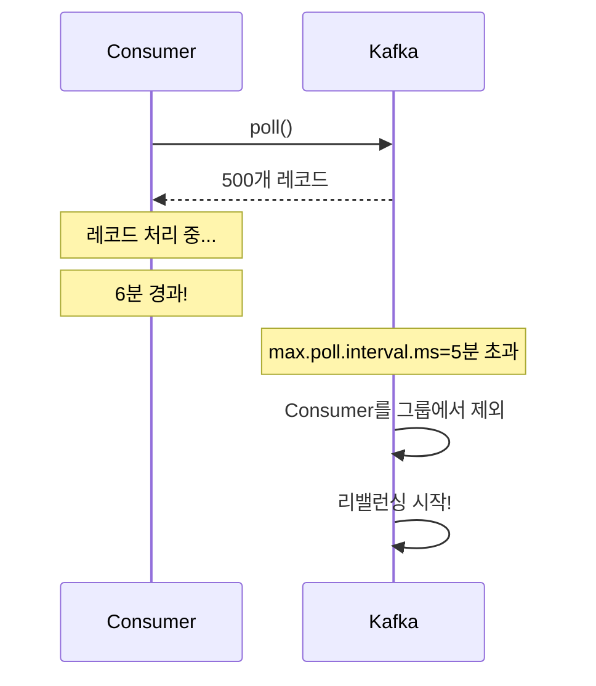
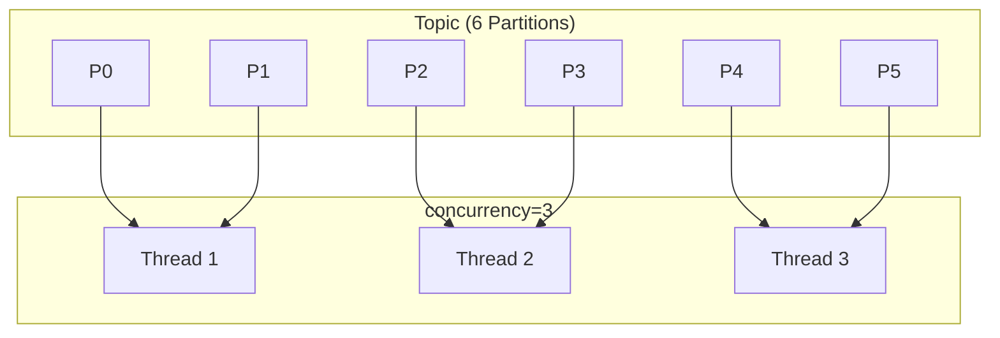


- fetch.min.bytes/fetch.max.wait.ms로 배치 효율과 지연시간 균형 조절
- max.poll.records와 max.poll.interval.ms가 리밸런싱 방지의 핵심
- session.timeout.ms는 heartbeat.interval.ms의 3배 이상 권장
- 처리량 최적화: fetch.min.size 증가, max.poll.records 증가
- 지연시간 최적화: fetch.min.size 감소, fetch.max.wait 감소


**대상 독자**: Consumer 성능을 최적화하려는 개발자, 운영 안정성을 높이려는 운영자

**선수 지식**: [Consumer Group & Offset](consumer-group/)의 Consumer 동작 원리

---

Consumer 성능 최적화와 안정적인 운영을 위한 설정을 이해합니다.

#### 전체 비유: 택배 수거 및 배송

Consumer 튜닝을 <strong>택배 기사의 물품 수거</strong>에 비유하면 이해하기 쉽습니다:

| 택배 수거 비유 | Consumer 설정 | 설명 |
|---------------|---------------|------|
| 최소 몇 kg 모이면 출발 | fetch.min.bytes | 작으면 자주 왕복, 크면 한번에 많이 |
| 최대 대기 시간 후 출발 | fetch.max.wait.ms | 물량 부족해도 시간되면 출발 |
| 한 번에 처리할 물건 수 | max.poll.records | 많으면 효율적, 처리 시간 증가 |
| 물건 처리 제한 시간 | max.poll.interval.ms | 초과 시 "기사 교체" (리밸런싱) |
| 생존 확인 체크인 | heartbeat.interval.ms | 주기적으로 "아직 일하고 있음" 신호 |
| 연락두절 허용 시간 | session.timeout.ms | 신호 없으면 "기사 이탈" 간주 |

이처럼 <strong>처리량(한 번에 많이)</strong>과 <strong>지연시간(빨리빨리)</strong>은 트레이드오프 관계입니다.

#### Consumer 내부 구조

Consumer는 Broker에서 메시지를 가져와 애플리케이션에 전달하고, 처리 완료 후 Offset을 커밋하는 구조로 동작합니다. Fetcher가 Broker로부터 데이터를 가져오면 poll()을 통해 애플리케이션에 전달되고, 처리 완료 후 Offset이 커밋됩니다.

```mermaid
flowchart LR
    subgraph Kafka["Kafka"]
        BROKER[Broker]
    end

    subgraph Consumer["Consumer 내부"]
        FETCH[Fetcher]
        POLL[poll()]
        PROCESS[메시지 처리]
        COMMIT[Offset 커밋]
    end

    subgraph Application["애플리케이션"]
        LOGIC[비즈니스 로직]
    end

    BROKER -->|fetch.min.bytes<br>fetch.max.wait.ms| FETCH
    FETCH -->|max.poll.records| POLL
    POLL --> PROCESS
    PROCESS --> LOGIC
    PROCESS --> COMMIT
```

*다이어그램: Consumer 내부 구조 - Broker에서 Fetcher가 데이터를 가져오고, poll()을 통해 애플리케이션에 전달, 처리 후 Offset 커밋하는 흐름. 각 단계에서 관련 설정이 적용됨.*

핵심 설정으로 `fetch.min.bytes`는 최소 페치 크기(기본값 1), `fetch.max.wait.ms`는 페치 대기 시간(기본값 500ms), `max.poll.records`는 poll당 최대 레코드 수(기본값 500), `max.poll.interval.ms`는 poll 간격 최대값(기본값 5분), `session.timeout.ms`는 세션 타임아웃(기본값 45초), `heartbeat.interval.ms`는 하트비트 간격(기본값 3초)입니다.


- Consumer 동작: Fetcher → poll() → 메시지 처리 → Offset 커밋
- 핵심 설정: fetch.min.bytes, max.poll.records, max.poll.interval.ms
- 설정 조합에 따라 처리량과 지연시간 균형 조절 가능


#### Fetch 설정

**fetch.min.bytes**

Broker가 응답하기 위한 최소 데이터 크기입니다. 기본값 1로 설정하면 1바이트라도 데이터가 있으면 즉시 응답합니다. 값을 1KB로 늘리면 데이터가 1KB 모일 때까지 대기하거나 fetch.max.wait.ms에 도달할 때까지 기다렸다가 응답합니다.

**fetch.max.wait.ms**

fetch.min.bytes를 충족하지 못해도 응답하는 최대 대기 시간입니다. fetch.min.bytes와 함께 배치 효율과 지연시간 사이의 균형을 조절합니다.

```yaml
spring:
  kafka:
    consumer:
      fetch-min-size: 1  # 기본값
      fetch-max-wait: 500  # 500ms (기본값)
```

min=1, wait=500 조합은 즉시 응답하여 지연 시간을 최소화합니다. min=1KB, wait=500 조합은 배치를 우선하여 처리량을 증가시킵니다. min=1KB, wait=100 조합은 빠른 응답과 배치의 균형을 맞춥니다.


- fetch.min.bytes: 응답 전 최소 데이터 크기 (1=즉시, 1KB+=배치 효율)
- fetch.max.wait.ms: min 충족 못해도 응답하는 최대 대기 시간
- 두 설정으로 배치 효율과 지연시간 사이 균형 조절


#### Poll 설정

**max.poll.records**

한 번의 poll() 호출로 가져오는 최대 레코드 수입니다. 값이 작으면 빠르게 처리하고 자주 poll()을 호출합니다. 값이 크면 배치 처리로 효율성이 높아지지만 처리 시간이 길어집니다.

**max.poll.interval.ms**

가장 중요한 설정 중 하나입니다. 두 poll() 호출 사이의 최대 허용 시간입니다. 이 시간을 초과하면 Consumer가 그룹에서 제외되고 리밸런싱이 시작됩니다.



*다이어그램: Consumer가 poll() 후 레코드 처리 중 6분이 경과하면 max.poll.interval.ms(5분) 초과로 그룹에서 제외되고 리밸런싱이 시작되는 흐름.*

설정 규칙은 `max.poll.interval.ms` > (레코드당 처리시간 × `max.poll.records`)입니다. 예를 들어 레코드당 100ms 처리 시간에 max.poll.records=500이면 필요 시간이 50초이므로 max.poll.interval.ms는 최소 60초 이상이어야 합니다.


- max.poll.records: 한 번에 가져오는 레코드 수 (작으면 빠른 처리, 크면 배치 효율)
- max.poll.interval.ms: poll() 간격 초과 시 리밸런싱 발생
- 설정 규칙: max.poll.interval.ms > (처리시간 × max.poll.records)


```yaml
spring:
  kafka:
    consumer:
      properties:
        max.poll.records: 500  # 기본값
        max.poll.interval.ms: 300000  # 5분 (기본값)
```

#### 세션 및 하트비트 설정

Consumer는 heartbeat.interval.ms마다 Heartbeat를 전송하여 살아있음을 알립니다. session.timeout.ms 동안 Heartbeat가 없으면 Consumer가 장애로 판단되어 그룹에서 제외되고 리밸런싱이 시작됩니다.

```yaml
spring:
  kafka:
    consumer:
      properties:
        session.timeout.ms: 45000  # 세션 타임아웃
        heartbeat.interval.ms: 3000  # 하트비트 간격
```

권장 규칙은 session.timeout.ms >= 3 × heartbeat.interval.ms입니다. 일반적으로 heartbeat.interval.ms는 session.timeout.ms의 1/3로 설정합니다. 빠른 감지가 필요하면 session.timeout=10초, heartbeat=3초로 설정하지만 잦은 false positive가 발생할 수 있습니다. 안정적인 운영에는 session.timeout=45초, heartbeat=15초가 적합합니다. GC 이슈가 있는 환경에서는 session.timeout=60초 이상, heartbeat=20초로 설정하여 GC pause를 허용합니다.

#### Offset 커밋 전략

**자동 커밋**

```yaml
spring:
  kafka:
    consumer:
      enable-auto-commit: true  # 기본값
      auto-commit-interval: 5000  # 5초마다 커밋
```

자동 커밋은 설정된 간격마다 자동으로 Offset을 커밋합니다. 간단하지만 처리 중 장애가 발생하면 이미 커밋된 Offset 이후의 메시지가 유실될 수 있습니다.

**수동 커밋**

```yaml
spring:
  kafka:
    consumer:
      enable-auto-commit: false
    listener:
      ack-mode: manual  # 또는 manual_immediate
```

commitSync는 커밋 완료까지 블로킹되어 확실한 커밋을 보장하지만 성능이 저하됩니다. commitAsync는 즉시 반환되어 높은 성능을 제공하지만 실패 시 처리가 복잡합니다.

```java
@KafkaListener(topics = "my-topic")
public void listen(String message, Acknowledgment ack) {
    process(message);
    ack.acknowledge();  // 커밋
}
```

Spring Kafka의 AckMode 옵션으로 RECORD는 레코드마다 커밋하고, BATCH는 poll()의 모든 레코드 처리 후 커밋하며, MANUAL은 acknowledge() 호출 시 커밋하고, MANUAL_IMMEDIATE는 acknowledge() 즉시 커밋합니다.

#### 리밸런싱 최적화

리밸런싱이 발생하면 모든 Consumer가 일시 중지되고, Partition이 회수된 후 재할당되고, Consumer가 재개됩니다. 이 과정에서 처리가 중단되므로 리밸런싱을 최소화하는 것이 중요합니다.

**Cooperative Rebalancing (권장)**

Kafka 2.4+에서 지원하는 점진적 리밸런싱입니다. 기존 Eager 방식은 전체를 중지하고 전체를 재할당한 후 전체를 재개합니다. Cooperative 방식은 필요한 것만 회수하고 필요한 것만 재할당하여 영향받은 Consumer만 재개합니다.

```yaml
spring:
  kafka:
    consumer:
      properties:
        partition.assignment.strategy: org.apache.kafka.clients.consumer.CooperativeStickyAssignor
```

**Static Membership**

Consumer 재시작 시 리밸런싱을 방지합니다. 고정 ID를 부여하면 Consumer가 5분 내에 재시작하면 같은 Partition을 유지합니다.

```yaml
spring:
  kafka:
    consumer:
      properties:
        group.instance.id: consumer-${HOSTNAME}  # 고정 ID
        session.timeout.ms: 300000  # 5분
```

#### 처리량 vs 지연시간

**처리량 최적화**

처리량을 높이려면 배치 크기를 늘리고 대기 시간을 허용합니다.

```yaml
spring:
  kafka:
    consumer:
      fetch-min-size: 1048576  # 1MB
      fetch-max-wait: 500
      properties:
        max.poll.records: 1000
        fetch.max.bytes: 52428800  # 50MB
```

**지연시간 최적화**

지연시간을 줄이려면 배치 크기를 줄이고 빠르게 응답하도록 설정합니다.

```yaml
spring:
  kafka:
    consumer:
      fetch-min-size: 1
      fetch-max-wait: 100  # 100ms
      properties:
        max.poll.records: 100
```

**균형잡힌 설정**

```yaml
spring:
  kafka:
    consumer:
      fetch-min-size: 1
      fetch-max-wait: 500
      properties:
        max.poll.records: 500
        max.poll.interval.ms: 300000
        session.timeout.ms: 45000
        heartbeat.interval.ms: 3000
```

#### 병렬 처리

concurrency 설정으로 Consumer 스레드 수를 조절합니다. 6개 Partition에 concurrency=3이면 각 스레드가 2개 Partition을 담당합니다.

```yaml
spring:
  kafka:
    listener:
      concurrency: 3  # 3개의 Consumer 스레드
```



*다이어그램: 6개 Partition을 가진 Topic에서 concurrency=3으로 설정하면 각 스레드가 2개씩 Partition을 담당하는 구조.*

규칙은 concurrency <= Partition 수입니다. concurrency가 Partition 수보다 크면 일부 스레드가 유휴 상태가 됩니다.


- concurrency 설정으로 Consumer 스레드 수 조절
- 규칙: concurrency <= Partition 수 (초과 시 유휴 스레드 발생)
- 6 Partition + concurrency=3 = 스레드당 2 Partition 담당


#### Consumer Lag 관리

Lag은 Latest Offset에서 Consumer Offset을 뺀 값입니다. Lag가 발생하는 원인과 해결책으로, 처리 속도가 느리면 concurrency를 증가시키거나 처리 로직을 최적화합니다. Partition이 부족하면 Partition 수를 증가시킵니다. 네트워크 문제가 있으면 fetch 설정을 최적화합니다. 재처리가 필요하면 seek을 통해 위치를 조정합니다.

#### 정리

Fetch 설정(fetch.min.bytes, fetch.max.wait.ms)은 Broker에서 데이터를 가져오는 방식을 조절합니다. Poll 설정(max.poll.records, max.poll.interval.ms)은 애플리케이션에 전달하는 방식을 조절합니다. 세션 설정(session.timeout.ms, heartbeat.interval.ms)은 Consumer 상태 감지를 조절합니다. 커밋 전략(auto vs manual, commitSync vs Async)은 처리 완료 기록 방식을 결정합니다.

처리량을 높이려면 fetch.min.bytes와 max.poll.records를 증가시킵니다. 지연시간을 줄이려면 fetch.max.wait와 max.poll.records를 감소시킵니다. 안정성을 높이려면 적절한 session/heartbeat를 설정합니다. 정확성을 높이려면 수동 커밋을 사용합니다.

#### 다음 단계

- [에러 처리 심화](error-handling/) - 에러 처리 패턴과 Dead Letter Topic
