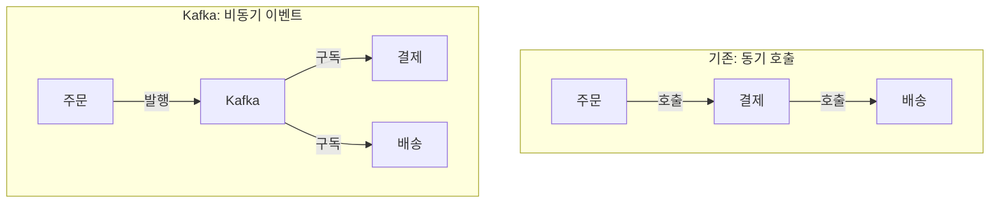
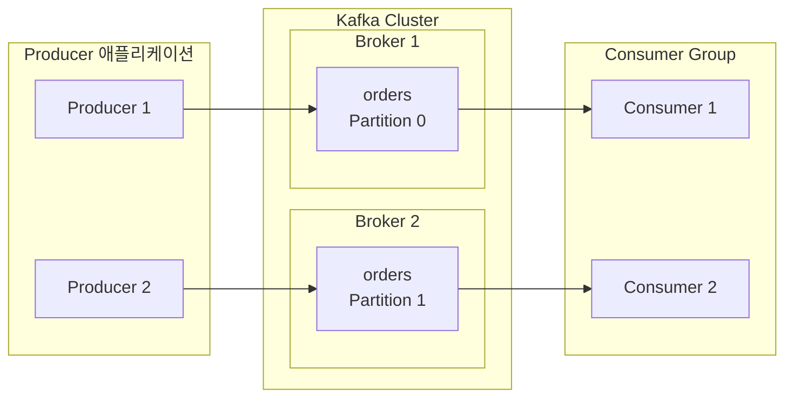
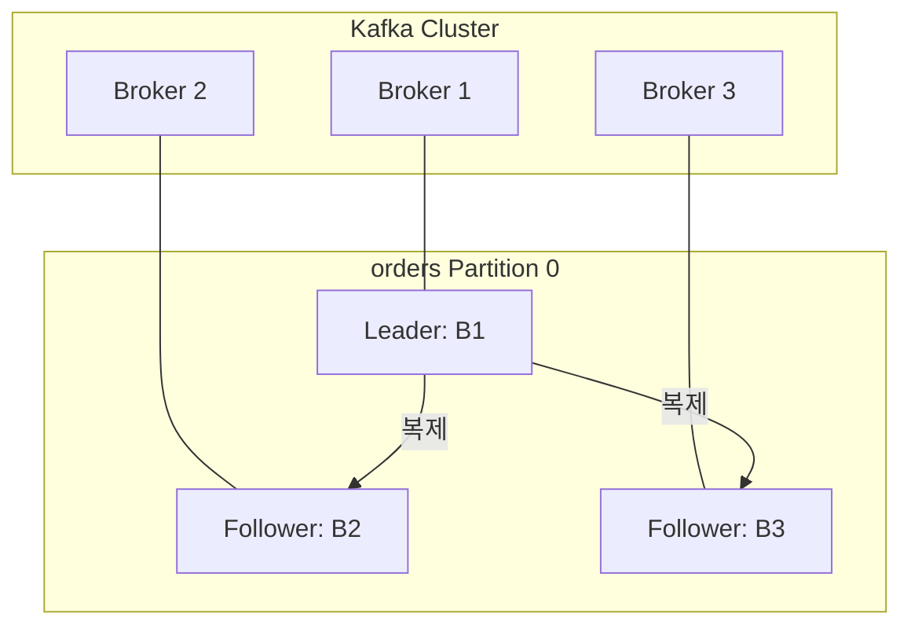
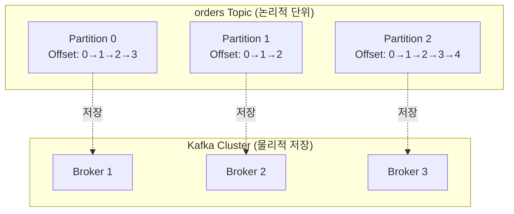
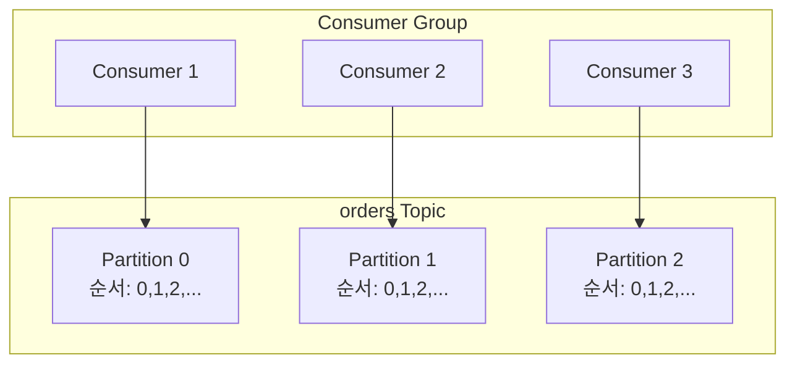
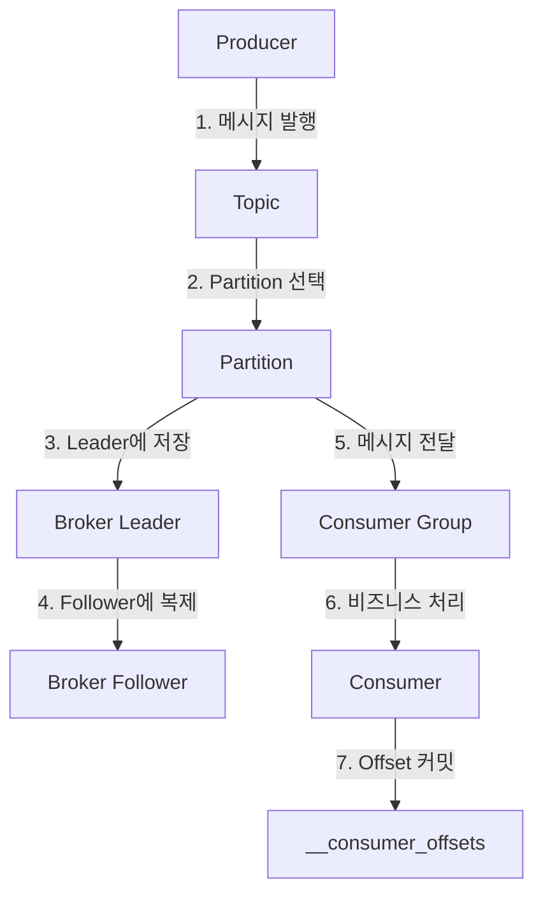


- **Producer**: 메시지를 발행하고 Partition을 선택하여 Broker로 전송
- **Consumer**: Consumer Group 단위로 Partition에서 메시지를 읽고 Offset 관리
- **Broker**: 메시지를 저장하고 복제하며 Leader/Follower 구조로 고가용성 제공
- **Topic**: 메시지를 논리적으로 분류하는 채널
- **Partition**: Topic을 물리적으로 분할하여 병렬 처리 가능하게 하는 단위


**대상 독자**: Kafka를 처음 접하는 개발자 또는 분산 메시지 시스템의 기본 개념을 학습하려는 분

**선수 지식**: 기본적인 네트워크 통신 개념, REST API 사용 경험, Spring Boot 기초

---

Kafka는 다섯 가지 핵심 구성요소로 이루어져 있습니다. Producer는 메시지를 발행하고, Consumer는 메시지를 소비하며, Broker는 메시지를 저장하고 전달합니다. Topic은 메시지를 논리적으로 분류하는 채널이고, Partition은 Topic을 물리적으로 분할하여 병렬 처리를 가능하게 합니다. 이 다섯 가지 구성요소가 어떻게 상호작용하는지 이해하면 Kafka 기반 시스템을 설계하고 운영하는 데 필요한 기초를 갖추게 됩니다.

이 문서에서는 각 구성요소가 왜 필요한지, 어떤 역할을 하는지, 그리고 실제 코드에서 어떻게 사용하는지를 단계별로 설명합니다. 모든 코드 예제는 Spring Boot 3.2.x와 Spring Kafka 3.1.x 환경에서 검증되었습니다.

## 왜 Kafka가 필요한가

분산 시스템에서 서비스 간 통신은 필연적입니다. 주문 서비스가 결제 서비스를 호출하고, 결제 서비스가 배송 서비스를 호출하는 것처럼 말입니다. 하지만 이러한 직접적인 동기 호출 방식에는 세 가지 근본적인 문제가 있습니다.

첫 번째 문제는 강한 결합입니다. 결제 서비스의 API가 변경되면 주문 서비스도 함께 수정해야 합니다. 새로운 배송 서비스를 추가하려면 주문 서비스의 코드를 변경해야 합니다. 서비스가 늘어날수록 이러한 의존성은 복잡하게 얽히고, 하나의 변경이 여러 서비스에 파급 효과를 일으킵니다.

두 번째 문제는 장애 전파입니다. 결제 서비스가 다운되면 주문 서비스도 실패합니다. 동기 호출은 호출하는 쪽이 호출받는 쪽의 상태에 완전히 의존하기 때문입니다. 하나의 서비스 장애가 전체 시스템 장애로 확대되는 것은 매우 흔한 일입니다.

세 번째 문제는 성능 병목입니다. 주문 처리에 100ms, 결제에 200ms, 배송에 150ms가 걸린다면 전체 응답 시간은 450ms가 됩니다. 동기 호출은 각 단계의 지연 시간이 누적되기 때문입니다. 트래픽이 급증하면 이 문제는 더욱 심각해집니다.

Kafka는 이 세 가지 문제를 이벤트 기반 비동기 통신으로 해결합니다. 서비스들은 서로 직접 호출하는 대신 Kafka에 이벤트를 발행하고, 관심 있는 서비스가 이를 구독합니다. 결제 서비스의 API가 변경되어도 주문 서비스는 영향을 받지 않습니다. 결제 서비스가 다운되어도 메시지는 Kafka에 저장되어 있다가 서비스가 복구되면 처리됩니다. 각 서비스는 자신의 속도에 맞게 메시지를 처리하므로 지연 시간이 누적되지 않습니다.



*다이어그램: 왼쪽은 동기 호출 방식으로 주문에서 결제, 결제에서 배송으로 순차적으로 호출하는 구조. 오른쪽은 Kafka를 통한 비동기 이벤트 방식으로 주문이 Kafka에 발행하면 결제와 배송이 독립적으로 구독하는 구조.*


- Kafka는 서비스 간 강한 결합, 장애 전파, 성능 병목 문제를 해결한다
- 이벤트 기반 비동기 통신으로 서비스가 독립적으로 동작할 수 있다
- 메시지는 Kafka에 저장되어 서비스 장애 시에도 유실되지 않는다


## 전체 구조 이해하기

Kafka 클러스터는 여러 Broker로 구성됩니다. 각 Broker는 독립적인 서버이며, 함께 협력하여 고가용성과 확장성을 제공합니다. Producer는 메시지를 특정 Topic에 발행하고, Broker는 이 메시지를 Topic의 Partition에 저장합니다. Consumer는 자신이 속한 Consumer Group의 일원으로서 할당받은 Partition에서 메시지를 읽어갑니다.

이 구조에서 핵심은 Partition입니다. 하나의 Topic은 여러 Partition으로 나뉘고, 각 Partition은 서로 다른 Broker에 분산될 수 있습니다. 이를 통해 단일 Topic이라도 여러 Broker의 자원을 활용하여 높은 처리량을 달성할 수 있습니다. Consumer Group 내의 각 Consumer는 서로 다른 Partition을 담당하여 병렬로 메시지를 처리합니다.



*다이어그램: Producer 1, 2가 각각 Kafka Cluster의 Broker 1, 2에 있는 orders Topic의 Partition 0, 1로 메시지를 전송하고, Consumer Group의 Consumer 1, 2가 각 Partition에서 메시지를 읽는 구조.*


- Kafka 클러스터는 여러 Broker로 구성되어 고가용성 제공
- Topic은 여러 Partition으로 나뉘어 병렬 처리 가능
- Consumer Group 내 각 Consumer는 서로 다른 Partition을 담당


## Producer의 역할과 동작 원리

Producer는 메시지를 Kafka에 발행하는 클라이언트입니다. 단순히 메시지를 보내는 것처럼 보이지만, 내부적으로는 여러 복잡한 작업이 수행됩니다. 애플리케이션에서 send() 메서드를 호출하면 Producer는 먼저 메시지를 직렬화합니다. Java 객체를 바이트 배열로 변환하는 것입니다. 그 다음 Partitioner가 메시지를 어떤 Partition에 보낼지 결정합니다. 메시지 Key가 있으면 Key의 해시값을 기반으로 Partition을 선택하고, 없으면 라운드로빈 방식으로 분배합니다.

Producer는 효율성을 위해 메시지를 바로 전송하지 않고 Record Accumulator라는 내부 버퍼에 모읍니다. batch.size에 도달하거나 linger.ms 시간이 지나면 Sender 스레드가 버퍼의 메시지들을 묶어서 Broker에 전송합니다. 이 배치 처리 덕분에 네트워크 오버헤드가 크게 줄어듭니다. 전송이 실패하면 retries 설정에 따라 자동으로 재시도합니다.

Spring Kafka에서는 KafkaTemplate을 사용하여 메시지를 발행합니다. 아래 예제는 주문 이벤트를 발행하는 Producer입니다. orderId를 Key로 사용하므로 같은 주문에 대한 모든 이벤트는 같은 Partition으로 전송되어 순서가 보장됩니다.

```java
@Slf4j
@Component
@RequiredArgsConstructor
public class OrderProducer {

    private final KafkaTemplate<String, String> kafkaTemplate;

    public void sendOrder(String orderId, String orderJson) {
        kafkaTemplate.send("orders", orderId, orderJson)
            .whenComplete((result, ex) -> {
                if (ex == null) {
                    log.info("전송 성공: topic={}, partition={}, offset={}",
                        result.getRecordMetadata().topic(),
                        result.getRecordMetadata().partition(),
                        result.getRecordMetadata().offset());
                } else {
                    log.error("전송 실패: {}", ex.getMessage());
                }
            });
    }
}
```

Producer 설정에서 가장 중요한 것은 acks입니다. acks=0은 전송만 하고 확인을 기다리지 않아 가장 빠르지만 메시지 유실 가능성이 있습니다. acks=1은 Leader Broker의 확인만 기다리므로 Leader 장애 시 유실될 수 있습니다. acks=all은 모든 ISR(In-Sync Replicas)의 확인을 기다리므로 가장 안전하지만 지연 시간이 늘어납니다. 프로덕션 환경에서는 데이터 안정성을 위해 acks=all을 권장합니다.

enable.idempotence=true 설정은 중복 전송을 방지합니다. 네트워크 오류로 인해 Producer가 재시도할 때 Broker가 이미 받은 메시지인지 확인하여 중복 저장을 막습니다. Kafka 3.0부터는 이 설정이 기본값으로 활성화되어 있습니다.

```yaml
spring:
  kafka:
    producer:
      bootstrap-servers: localhost:9092
      key-serializer: org.apache.kafka.common.serialization.StringSerializer
      value-serializer: org.apache.kafka.common.serialization.StringSerializer
      acks: all
      retries: 3
      properties:
        enable.idempotence: true
        max.in.flight.requests.per.connection: 5
```


- Producer는 직렬화 -> Partition 선택 -> 배치 전송 순서로 동작
- Key 기반 Partitioning으로 같은 Key는 항상 같은 Partition에 저장
- acks 설정으로 전송 보장 수준 조절 (acks=all 권장)
- enable.idempotence=true로 중복 전송 방지 (Kafka 3.0+ 기본값)


## Consumer의 역할과 동작 원리

Consumer는 Kafka에서 메시지를 읽어가는 클라이언트입니다. Producer와 마찬가지로 단순해 보이지만 내부적으로는 복잡한 메커니즘이 동작합니다. Consumer는 push 방식이 아닌 poll 방식으로 동작합니다. 즉, Broker가 메시지를 밀어주는 것이 아니라 Consumer가 주기적으로 Broker에 요청하여 메시지를 가져옵니다. 이 방식 덕분에 Consumer는 자신의 처리 속도에 맞게 메시지를 가져올 수 있습니다.

Consumer의 핵심 책임 중 하나는 Offset 관리입니다. Offset은 Partition 내에서 메시지의 위치를 나타내는 일련번호입니다. Consumer는 자신이 어디까지 읽었는지를 Offset으로 기록합니다. 이 정보는 __consumer_offsets라는 내부 Topic에 저장됩니다. Consumer가 재시작되면 마지막으로 커밋한 Offset부터 다시 읽기 시작합니다.

Consumer Group은 여러 Consumer가 협력하여 메시지를 병렬로 처리하는 단위입니다. 같은 Consumer Group에 속한 Consumer들은 Topic의 Partition을 나누어 맡습니다. 하나의 Partition은 그룹 내에서 오직 하나의 Consumer만 담당할 수 있습니다. 이 규칙 덕분에 같은 Partition의 메시지는 항상 같은 Consumer가 처리하여 순서가 보장됩니다. Consumer가 추가되거나 제거되면 Rebalancing이 발생하여 Partition이 재분배됩니다.

Spring Kafka에서는 @KafkaListener 어노테이션을 사용하여 Consumer를 구현합니다. concurrency 속성은 Consumer 스레드 수를 지정합니다. 아래 예제에서 concurrency="3"은 3개의 Consumer 스레드가 병렬로 동작함을 의미합니다. Partition이 3개 이상이면 각 스레드가 하나 이상의 Partition을 담당합니다.

```java
@Slf4j
@Component
public class OrderConsumer {

    @KafkaListener(
        topics = "orders",
        groupId = "order-service-group",
        concurrency = "3"
    )
    public void consume(
            @Payload String message,
            @Header(KafkaHeaders.RECEIVED_PARTITION) int partition,
            @Header(KafkaHeaders.OFFSET) long offset) {

        log.info("수신: partition={}, offset={}, message={}",
            partition, offset, message);

        processOrder(message);
    }

    private void processOrder(String message) {
        // 주문 처리 비즈니스 로직
    }
}
```

Consumer 설정에서 auto-offset-reset은 Consumer Group이 처음 시작하거나 기록된 Offset이 없을 때 어디서부터 읽을지를 결정합니다. earliest는 Partition의 처음부터, latest는 가장 최근 메시지부터 읽습니다. 기존 메시지를 모두 처리해야 하면 earliest를, 새 메시지만 처리하면 되면 latest를 선택합니다.

enable-auto-commit은 Offset을 자동으로 커밋할지 결정합니다. true로 설정하면 auto.commit.interval.ms 주기로 자동 커밋됩니다. 하지만 메시지를 가져온 직후 커밋하고 처리 중 오류가 발생하면 해당 메시지는 다시 처리되지 않습니다. 이러한 문제를 방지하려면 수동 커밋(enable-auto-commit: false)을 사용하고, 메시지 처리가 완료된 후에 명시적으로 커밋해야 합니다.

```yaml
spring:
  kafka:
    consumer:
      bootstrap-servers: localhost:9092
      group-id: order-service-group
      key-deserializer: org.apache.kafka.common.serialization.StringDeserializer
      value-deserializer: org.apache.kafka.common.serialization.StringDeserializer
      auto-offset-reset: earliest
      enable-auto-commit: false
      properties:
        max.poll.records: 500
        max.poll.interval.ms: 300000
```


- Consumer는 pull 방식으로 자신의 처리 속도에 맞게 메시지를 가져옴
- Offset을 통해 읽기 위치 추적, __consumer_offsets Topic에 저장
- Consumer Group 내 각 Partition은 하나의 Consumer만 담당
- auto-offset-reset으로 시작 위치, enable-auto-commit으로 커밋 방식 설정


## Broker의 역할과 클러스터 구성

Broker는 Kafka의 핵심 서버입니다. 메시지를 받아서 디스크에 저장하고, Consumer의 요청에 따라 메시지를 전달합니다. Kafka가 높은 처리량을 달성할 수 있는 이유 중 하나는 Broker의 저장 방식에 있습니다. Broker는 메시지를 순차적으로 디스크에 기록합니다. 랜덤 I/O가 아닌 순차 I/O는 디스크의 물리적 특성상 훨씬 빠릅니다. 또한 운영체제의 페이지 캐시를 적극 활용하여 자주 접근하는 데이터는 메모리에서 바로 제공합니다.

Kafka 클러스터는 여러 Broker로 구성됩니다. 프로덕션 환경에서는 최소 3개의 Broker를 권장합니다. 각 Broker는 고유한 ID를 가지며, 클러스터 내에서 서로 협력합니다. Partition의 Leader 역할을 하는 Broker가 해당 Partition에 대한 읽기와 쓰기를 담당하고, Follower 역할을 하는 Broker는 Leader의 데이터를 복제합니다. Leader Broker가 장애를 일으키면 Follower 중 하나가 새로운 Leader로 선출되어 서비스가 계속됩니다.

Kafka 3.3부터는 KRaft 모드가 기본으로 활성화되어 Zookeeper 없이도 클러스터를 운영할 수 있습니다. KRaft 모드에서는 일부 Broker가 Controller 역할을 겸하여 클러스터 메타데이터를 관리합니다. 이 방식은 운영 복잡도를 낮추고 클러스터 시작 시간을 단축합니다.



*다이어그램: Kafka Cluster의 3개 Broker가 orders Partition 0의 Leader(Broker 1)와 Follower(Broker 2, 3)로 구성되어 Leader가 Follower들에게 데이터를 복제하는 구조.*

Broker 설정에서 가장 중요한 것은 replication.factor와 min.insync.replicas입니다. replication.factor=3은 각 Partition이 3개의 복제본을 가짐을 의미합니다. min.insync.replicas=2는 Producer가 acks=all로 메시지를 보낼 때 최소 2개의 복제본에 기록되어야 성공으로 간주함을 의미합니다. 이 설정은 1개의 Broker가 장애를 일으켜도 데이터 유실 없이 서비스를 계속할 수 있게 합니다.

```properties
broker.id=1
listeners=PLAINTEXT://:9092
log.dirs=/var/lib/kafka/data
num.partitions=3
default.replication.factor=3
min.insync.replicas=2
log.retention.hours=168
log.segment.bytes=1073741824
```

Broker를 우체국에 비유할 수 있습니다. 편지(메시지)를 받아서 보관하고, 수신자(Consumer)가 찾아오면 전달합니다. 여러 우체국(Broker)이 협력하면 하나의 우체국에 문제가 생겨도 다른 우체국에서 서비스를 계속할 수 있습니다.


- Broker는 순차 I/O와 페이지 캐시로 높은 처리량 달성
- Leader/Follower 구조로 장애 시 자동 Failover
- KRaft 모드(Kafka 3.3+)로 Zookeeper 없이 클러스터 운영 가능
- replication.factor=3, min.insync.replicas=2 설정 권장


## Topic의 역할과 설계 원칙

Topic은 메시지를 논리적으로 분류하는 채널입니다. 주문, 결제, 알림 등 서로 다른 종류의 이벤트를 분리하여 관리할 수 있습니다. 각 Topic은 독립적인 설정을 가집니다. 주문 데이터는 7일간 보관하고, 로그 데이터는 1일만 보관하는 식으로 비즈니스 요구사항에 맞게 구성할 수 있습니다.

Topic 이름은 명확하고 일관된 네이밍 컨벤션을 따라야 합니다. 좋은 Topic 이름은 그 자체로 어떤 데이터가 흐르는지 알 수 있어야 합니다. orders, payment-completed, user-activity-logs처럼 도메인이나 이벤트를 명확히 표현하는 이름이 좋습니다. data, topic1, temp 같은 이름은 피해야 합니다. 팀이나 조직 차원에서 네이밍 컨벤션을 정하고 일관되게 적용하는 것이 중요합니다.

Topic을 생성할 때는 Partition 수와 Replication Factor를 신중하게 결정해야 합니다. Partition 수는 나중에 늘릴 수는 있지만 줄일 수는 없습니다. Partition을 늘리면 기존 메시지 Key의 Partition 할당이 달라질 수 있으므로 순서 보장에 영향을 줄 수 있습니다. 따라서 처음부터 예상 처리량과 Consumer 수를 고려하여 적절한 Partition 수를 설정해야 합니다.

### Topic과 Partition의 관계

Topic은 논리적인 채널이고, Partition은 그 채널 안의 물리적인 저장 단위입니다. 아래 다이어그램은 하나의 Topic이 여러 Partition으로 나뉘고, 각 Partition이 서로 다른 Broker에 분산되는 구조를 보여줍니다.



*다이어그램: orders Topic은 3개의 Partition으로 나뉘어 있으며, 각 Partition은 독립적인 Offset을 가집니다. 물리적으로 각 Partition은 서로 다른 Broker에 분산되어 저장됩니다.*

```bash
# Topic 생성
kafka-topics.sh --bootstrap-server localhost:9092 \
  --create --topic orders \
  --partitions 6 \
  --replication-factor 3

# Topic 목록 조회
kafka-topics.sh --bootstrap-server localhost:9092 --list

# Topic 상세 정보 확인
kafka-topics.sh --bootstrap-server localhost:9092 \
  --describe --topic orders
```

Topic을 TV 채널에 비유할 수 있습니다. 뉴스 채널, 스포츠 채널, 드라마 채널처럼 주제별로 구분됩니다. 시청자(Consumer)는 관심 있는 채널만 선택하여 시청할 수 있습니다. 각 채널은 독립적으로 운영되어 뉴스 채널에 문제가 생겨도 스포츠 채널은 정상 방송됩니다.


- Topic은 메시지를 논리적으로 분류하는 채널
- 명확한 네이밍 컨벤션 필수 (orders, payment-completed 등)
- 각 Topic은 독립적인 보관 정책 설정 가능
- Partition 수는 나중에 늘릴 수 있지만 줄일 수 없음


## Partition의 역할과 병렬 처리

Partition은 Topic을 물리적으로 분할한 단위입니다. 하나의 Topic이 여러 Partition으로 나뉘면 여러 Consumer가 동시에 메시지를 처리할 수 있습니다. Partition이 없다면 아무리 많은 Consumer를 투입해도 하나의 Consumer만 메시지를 처리할 수 있어 병목이 발생합니다.

Partition 내에서 메시지는 순서가 보장됩니다. 메시지가 Partition에 추가되면 Offset이라는 일련번호가 부여됩니다. Offset은 0부터 시작하여 1씩 증가합니다. Consumer는 Offset 순서대로 메시지를 읽으므로 같은 Partition 내에서는 메시지가 발행된 순서대로 처리됩니다. 하지만 서로 다른 Partition 간에는 순서가 보장되지 않습니다. 전체적인 순서가 중요하다면 같은 Key를 사용하여 같은 Partition으로 보내야 합니다.

Partition 수를 결정할 때는 목표 처리량과 Consumer 수를 함께 고려해야 합니다. 예를 들어 목표 처리량이 100,000 메시지/초이고 Consumer 하나가 10,000 메시지/초를 처리할 수 있다면 최소 10개의 Partition이 필요합니다. 하지만 Partition이 너무 많으면 오히려 오버헤드가 발생합니다. 각 Partition은 Broker의 파일 핸들과 메모리를 사용하고, Rebalancing 시간도 늘어납니다. 현재 요구사항에 20-30%의 여유분을 더한 수준이 적절합니다.



*다이어그램: orders Topic이 Partition 0, 1, 2로 나뉘고, Consumer Group의 Consumer 1, 2, 3이 각각 하나의 Partition을 담당하여 병렬로 메시지를 처리하는 구조.*

Partition을 마트의 계산대에 비유할 수 있습니다. 계산대가 하나뿐이면 줄이 길어지고 대기 시간이 늘어납니다. 계산대를 늘리면 더 많은 고객을 동시에 처리할 수 있습니다. 하지만 계산대가 너무 많으면 직원 배치와 관리 비용이 증가합니다. 적정 수의 계산대를 유지하는 것이 효율적입니다.

Partition 할당 전략은 메시지를 어떤 Partition에 보낼지 결정합니다. Key가 없으면 라운드로빈 방식으로 Partition에 고르게 분배됩니다. Key가 있으면 Key의 해시값을 기반으로 Partition을 선택합니다. 같은 Key는 항상 같은 Partition으로 가므로 순서가 보장됩니다. 예를 들어 orderId를 Key로 사용하면 같은 주문에 대한 모든 이벤트가 순서대로 처리됩니다.


- Partition은 병렬 처리의 단위, Partition 수만큼 Consumer 병렬 처리 가능
- Partition 내에서만 순서 보장, 전체 순서가 필요하면 같은 Key 사용
- Partition 수는 목표 처리량과 Consumer 수를 고려하여 설정
- Partition이 너무 많으면 오버헤드 발생 (파일 핸들, 리밸런싱 시간)


## 구성요소 간 상호작용

다섯 가지 구성요소는 메시지가 Producer에서 Consumer까지 전달되는 과정에서 긴밀하게 협력합니다. Producer가 메시지를 발행하면 먼저 직렬화와 Partition 선택이 이루어집니다. 선택된 Partition의 Leader Broker가 메시지를 받아 로그에 추가하고, Follower Broker들이 이를 복제합니다. acks 설정에 따라 복제가 완료되면 Producer에게 응답을 보냅니다.

Consumer는 자신에게 할당된 Partition의 Leader Broker에 poll 요청을 보냅니다. Broker는 Consumer가 마지막으로 커밋한 Offset 이후의 메시지들을 반환합니다. Consumer는 메시지를 처리한 후 Offset을 커밋합니다. 이 Offset 정보는 __consumer_offsets Topic에 저장되어 Consumer가 재시작해도 마지막 위치부터 다시 읽을 수 있습니다.



*다이어그램: Producer가 Topic에 메시지 발행 -> Partition 선택 -> Leader Broker 저장 -> Follower 복제 -> Consumer Group에 전달 -> Consumer 비즈니스 처리 -> __consumer_offsets에 Offset 커밋하는 전체 메시지 흐름.*


- 메시지는 직렬화 -> Partition 선택 -> Leader 저장 -> Follower 복제 순서로 처리
- Consumer는 poll 방식으로 메시지를 가져오고 처리 후 Offset 커밋
- __consumer_offsets Topic에 커밋 정보 저장으로 재시작 시 복구 가능


## 자주 발생하는 문제와 해결 방법

Producer가 메시지를 보내지 못하는 경우는 대부분 연결 문제입니다. bootstrap-servers 주소가 올바른지, 해당 Broker에 네트워크로 접근 가능한지 확인해야 합니다. Topic이 존재하지 않고 auto.create.topics.enable이 false로 설정되어 있다면 Topic을 먼저 생성해야 합니다. Broker 로그에서 인증이나 권한 관련 오류 메시지가 있는지도 확인합니다.

Consumer가 메시지를 받지 못하는 경우는 여러 원인이 있을 수 있습니다. group-id가 올바른지, 해당 Topic을 구독하고 있는지 확인합니다. auto-offset-reset이 latest인데 Consumer가 시작하기 전에 발행된 메시지라면 읽을 수 없습니다. Consumer Lag를 확인하여 메시지가 쌓이고 있는지, 아니면 메시지 자체가 없는지 구분해야 합니다.

메시지 순서가 보장되지 않는 문제는 Partition 할당과 관련이 있습니다. Kafka에서 순서는 같은 Partition 내에서만 보장됩니다. 전체 순서가 필요하다면 Partition을 1개로 설정해야 하지만, 이는 병렬 처리를 포기하는 것입니다. 일반적으로는 관련 있는 메시지들(예: 같은 주문에 대한 이벤트들)에 동일한 Key를 부여하여 같은 Partition으로 보내는 방식을 사용합니다.

```bash
# Consumer Group 상태 확인
kafka-consumer-groups.sh --bootstrap-server localhost:9092 \
  --describe --group order-service-group

# Topic의 메시지 확인
kafka-console-consumer.sh --bootstrap-server localhost:9092 \
  --topic orders --from-beginning --max-messages 10
```


- Producer 연결 문제는 bootstrap-servers 주소와 네트워크 접근성 확인
- Consumer가 메시지를 못 받으면 group-id, Topic 구독, auto-offset-reset 확인
- 순서 보장이 필요하면 같은 Key를 사용하여 같은 Partition으로 전송
- kafka-consumer-groups.sh로 Consumer Group 상태와 Lag 확인 가능


## 다음 단계

이 문서에서는 Kafka의 다섯 가지 핵심 구성요소를 살펴보았습니다. 각 구성요소의 역할과 동작 원리를 이해했다면, 다음 단계로 메시지가 Producer에서 Consumer까지 전달되는 전체 흐름을 더 자세히 살펴볼 수 있습니다. Consumer Group과 Offset 관리, Replication 메커니즘도 실제 운영에서 중요한 주제입니다.

- [메시지 흐름](../message-flow/) - Producer에서 Consumer까지 메시지가 전달되는 전체 과정을 단계별로 추적합니다
- [Consumer Group과 Offset](../consumer-group/) - 병렬 처리와 Offset 관리의 세부 사항을 학습합니다
- [실습 예제](../../examples/basic/) - 이론을 바탕으로 직접 코드를 작성하고 동작을 확인합니다
