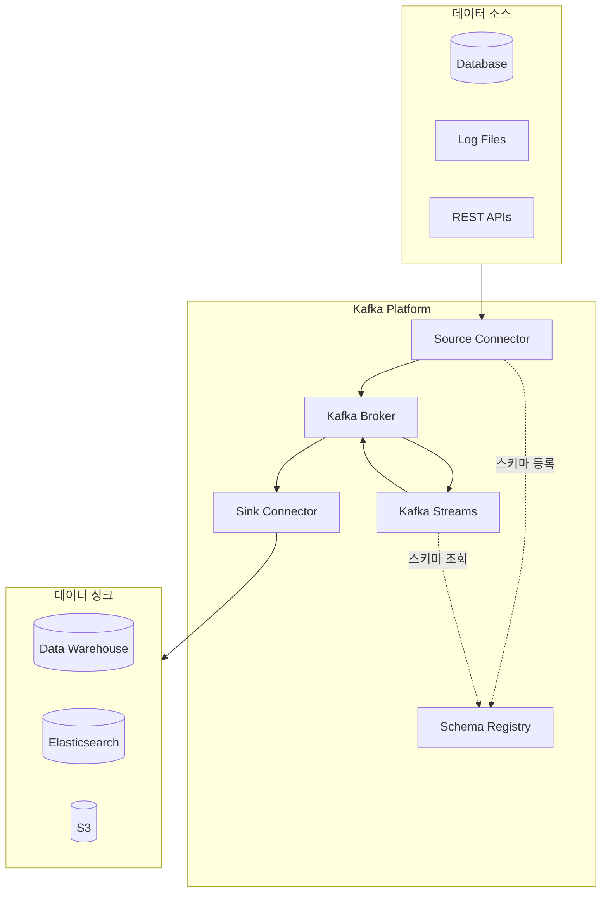
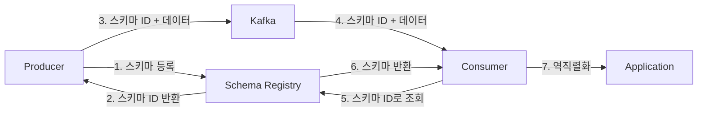


- Kafka Connect: 외부 시스템과 Kafka 간 데이터 이동, 코딩 없이 설정으로 파이프라인 구축
- Schema Registry: 메시지 스키마 중앙 관리, 호환성 검증으로 런타임 오류 방지
- Kafka Streams: 실시간 스트림 처리 라이브러리, 별도 클러스터 불필요
- Debezium: CDC(Change Data Capture)로 DB 변경사항을 Kafka로 스트리밍
- 스키마 호환성: BACKWARD(기본), FORWARD, FULL, NONE 정책 지원


**대상 독자**: Kafka 생태계를 활용한 데이터 파이프라인을 구축하려는 개발자 및 데이터 엔지니어

**선수 지식**: [핵심 구성요소](core-components/)의 Topic, Producer, Consumer 개념, [메시지 흐름](message-flow/)의 전체 데이터 흐름

---

Kafka는 메시지 브로커 그 이상의 역할을 합니다. Kafka를 중심으로 데이터 파이프라인을 구축하고, 스키마를 관리하며, 실시간 스트림 처리를 수행하는 완성된 생태계가 형성되어 있습니다. 이 생태계의 핵심 컴포넌트는 Kafka Connect, Schema Registry, Kafka Streams입니다. 각 컴포넌트는 독립적으로 동작하면서도 함께 사용할 때 더 큰 시너지를 발휘합니다.

Kafka Connect는 외부 시스템과 Kafka 사이에서 데이터를 이동시킵니다. 데이터베이스의 변경 사항을 Kafka로 스트리밍하거나, Kafka의 메시지를 Elasticsearch나 S3로 적재하는 작업을 코딩 없이 설정만으로 구현할 수 있습니다. Schema Registry는 메시지의 스키마를 중앙에서 관리하여 Producer와 Consumer 간의 데이터 호환성을 보장합니다. Kafka Streams는 Kafka 토픽에 저장된 데이터를 실시간으로 처리하고 변환하는 라이브러리입니다.

이 문서에서는 각 컴포넌트가 해결하는 문제, 동작 원리, 그리고 실제 사용 방법을 상세히 설명합니다. 모든 예제는 Confluent Platform 7.5.x와 Spring Boot 3.2.x 환경에서 검증되었습니다.

#### 전체 비유: 물류 시스템

Kafka 생태계를 <strong>대형 물류 센터</strong>에 비유하면 이해하기 쉽습니다:

| 물류 센터 비유 | Kafka 생태계 | 역할 |
|---------------|-------------|------|
| 화물 트럭 (외부 연결) | Kafka Connect | 외부 시스템과 데이터 이동 |
| 물류 표준/라벨 규격 | Schema Registry | 데이터 형식 통일 및 호환성 관리 |
| 분류/가공 공장 | Kafka Streams | 실시간 데이터 처리 및 변환 |
| Source Connector | 입고 트럭 | 외부에서 물건을 가져옴 |
| Sink Connector | 출고 트럭 | 물건을 외부로 배송 |
| Debezium (CDC) | 창고 CCTV | 변경사항을 실시간 감지하여 전송 |

**핵심 원칙**: 각 컴포넌트가 **독립적으로 확장** 가능합니다. 입고량이 늘면 입고 트럭만, 가공량이 늘면 공장 라인만 늘리면 됩니다.

#### 생태계 전체 구조

Kafka 생태계에서 데이터의 흐름을 이해하면 각 컴포넌트의 역할이 명확해집니다. 외부 시스템에서 데이터가 발생하면 Kafka Connect의 Source Connector가 이를 Kafka 토픽으로 전송합니다. 이 과정에서 Schema Registry가 메시지의 스키마를 검증하고 저장합니다. Kafka에 저장된 데이터는 Kafka Streams를 통해 실시간으로 처리되거나, Sink Connector를 통해 다른 시스템으로 전달됩니다.

이러한 아키텍처의 장점은 각 컴포넌트가 독립적으로 확장 가능하다는 것입니다. 데이터 수집량이 늘어나면 Source Connector의 태스크 수를 늘리고, 처리량이 늘어나면 Streams 인스턴스를 추가합니다. 각 부분이 느슨하게 결합되어 있어 한 컴포넌트의 장애가 전체 시스템에 미치는 영향을 최소화할 수 있습니다.



#### Kafka Connect

Kafka Connect는 Kafka와 외부 시스템 간에 데이터를 안정적으로 스트리밍하기 위한 프레임워크입니다. 데이터베이스, 파일 시스템, 클라우드 스토리지, 검색 엔진 등 다양한 시스템과 Kafka를 연결할 수 있습니다. 가장 큰 장점은 코딩 없이 JSON 설정만으로 데이터 파이프라인을 구축할 수 있다는 것입니다.

**왜 Kafka Connect가 필요한가**

Kafka와 외부 시스템을 연동할 때 직접 Producer나 Consumer를 개발할 수도 있습니다. 하지만 이 방식에는 여러 문제가 있습니다. 먼저 중복 개발이 발생합니다. MySQL에서 데이터를 가져오는 코드, PostgreSQL에서 가져오는 코드, Oracle에서 가져오는 코드가 각각 필요합니다. 비슷한 로직을 반복해서 작성해야 합니다.

에러 처리도 직접 구현해야 합니다. 네트워크 오류가 발생하면 어떻게 재시도할 것인지, 오프셋을 어떻게 관리할 것인지, 중복 데이터를 어떻게 방지할 것인지 모두 개발자가 결정하고 구현해야 합니다. 확장성 있는 병렬 처리 로직도 필요합니다. 단일 스레드로는 처리량이 부족할 때 어떻게 스케일 아웃할 것인지 고민해야 합니다.

Kafka Connect는 이 모든 문제를 해결합니다. 이미 검증된 Connector를 가져다 쓰면 되므로 개발 시간이 단축됩니다. 재시도, 오프셋 관리, 에러 처리가 프레임워크 레벨에서 제공됩니다. 분산 모드로 실행하면 여러 워커에서 태스크를 병렬로 처리하여 처리량을 높일 수 있습니다.

**핵심 구성요소**

Kafka Connect는 여러 개념으로 구성됩니다. Source Connector는 외부 시스템에서 데이터를 읽어 Kafka 토픽으로 전송합니다. Debezium MySQL Connector가 대표적인 예입니다. MySQL 데이터베이스의 변경 사항(INSERT, UPDATE, DELETE)을 실시간으로 감지하여 Kafka 토픽으로 스트리밍합니다.

Sink Connector는 반대 방향으로 동작합니다. Kafka 토픽에서 메시지를 읽어 외부 시스템으로 전송합니다. Elasticsearch Sink Connector는 Kafka 토픽의 메시지를 Elasticsearch 인덱스로 적재합니다. S3 Sink Connector는 메시지를 AWS S3 버킷에 파일로 저장합니다.

Converter는 데이터 형식을 변환합니다. Kafka 메시지는 바이트 배열이므로 실제 데이터 형식(JSON, Avro, Protobuf 등)과의 변환이 필요합니다. JsonConverter는 JSON 형식을, AvroConverter는 Avro 형식을 처리합니다.

Transform(SMT, Single Message Transform)은 메시지를 변환하는 가벼운 처리기입니다. 필드를 추가하거나 제거하고, 필드 이름을 변경하거나, 특정 조건에 따라 메시지를 라우팅하는 등의 간단한 변환을 수행합니다. 복잡한 변환은 Kafka Streams를 사용해야 합니다.

Worker는 Connector와 Task를 실행하는 JVM 프로세스입니다. Standalone 모드는 단일 워커에서 실행되며 개발과 테스트에 적합합니다. Distributed 모드는 여러 워커가 클러스터를 구성하며 프로덕션 환경에 적합합니다. 분산 모드에서는 워커가 추가되거나 제거될 때 태스크가 자동으로 재분배됩니다.

**Docker Compose 설정**

Kafka Connect를 실행하려면 먼저 Kafka 클러스터가 필요합니다. 아래 Docker Compose 설정은 KRaft 모드의 Kafka와 Kafka Connect를 함께 구성합니다. MySQL도 포함하여 CDC(Change Data Capture) 테스트를 바로 시작할 수 있습니다.

```yaml
version: '3.8'
services:
  kafka:
    image: confluentinc/cp-kafka:7.5.0
    hostname: kafka
    ports:
      - "9092:9092"
    environment:
      KAFKA_NODE_ID: 1
      KAFKA_PROCESS_ROLES: broker,controller
      KAFKA_CONTROLLER_QUORUM_VOTERS: 1@kafka:9093
      KAFKA_LISTENERS: PLAINTEXT://:9092,CONTROLLER://:9093
      KAFKA_ADVERTISED_LISTENERS: PLAINTEXT://kafka:9092
      KAFKA_LISTENER_SECURITY_PROTOCOL_MAP: PLAINTEXT:PLAINTEXT,CONTROLLER:PLAINTEXT
      KAFKA_INTER_BROKER_LISTENER_NAME: PLAINTEXT
      KAFKA_CONTROLLER_LISTENER_NAMES: CONTROLLER
      CLUSTER_ID: 'MkU3OEVBNTcwNTJENDM2Qk'

  connect:
    image: confluentinc/cp-kafka-connect:7.5.0
    hostname: connect
    depends_on:
      - kafka
    ports:
      - "8083:8083"
    environment:
      CONNECT_BOOTSTRAP_SERVERS: kafka:9092
      CONNECT_REST_PORT: 8083
      CONNECT_GROUP_ID: connect-cluster
      CONNECT_CONFIG_STORAGE_TOPIC: connect-configs
      CONNECT_OFFSET_STORAGE_TOPIC: connect-offsets
      CONNECT_STATUS_STORAGE_TOPIC: connect-status
      CONNECT_CONFIG_STORAGE_REPLICATION_FACTOR: 1
      CONNECT_OFFSET_STORAGE_REPLICATION_FACTOR: 1
      CONNECT_STATUS_STORAGE_REPLICATION_FACTOR: 1
      CONNECT_KEY_CONVERTER: org.apache.kafka.connect.json.JsonConverter
      CONNECT_VALUE_CONVERTER: org.apache.kafka.connect.json.JsonConverter
      CONNECT_PLUGIN_PATH: /usr/share/java,/usr/share/confluent-hub-components

  mysql:
    image: mysql:8.0
    hostname: mysql
    ports:
      - "3306:3306"
    environment:
      MYSQL_ROOT_PASSWORD: rootpass
      MYSQL_DATABASE: orders
```

**Source Connector 구성: MySQL CDC**

Debezium MySQL Connector를 사용하면 MySQL 데이터베이스의 변경 사항을 실시간으로 Kafka에 스트리밍할 수 있습니다. 이 방식을 CDC(Change Data Capture)라고 합니다. MySQL의 바이너리 로그를 읽어서 INSERT, UPDATE, DELETE 이벤트를 감지합니다.

아래 설정은 orders 데이터베이스의 order_items 테이블 변경 사항을 cdc.orders.order_items 토픽으로 전송합니다. database.server.id는 MySQL 복제에서 사용하는 고유 ID입니다. 같은 MySQL 서버에 여러 Connector를 연결할 때는 서로 다른 ID를 사용해야 합니다.

```json
{
  "name": "mysql-source-connector",
  "config": {
    "connector.class": "io.debezium.connector.mysql.MySqlConnector",
    "tasks.max": "1",
    "database.hostname": "mysql",
    "database.port": "3306",
    "database.user": "root",
    "database.password": "rootpass",
    "database.server.id": "1",
    "database.server.name": "mysql-server",
    "database.include.list": "orders",
    "table.include.list": "orders.order_items",
    "topic.prefix": "cdc",
    "schema.history.internal.kafka.bootstrap.servers": "kafka:9092",
    "schema.history.internal.kafka.topic": "schema-changes.orders"
  }
}
```

Connector를 등록하고 관리하는 것은 REST API를 통해 수행합니다. 아래 명령은 Connector를 등록하고 상태를 확인하는 방법입니다. Connector가 성공적으로 시작되면 status 필드가 RUNNING으로 표시됩니다.

```bash
# Connector 등록
curl -X POST http://localhost:8083/connectors \
  -H "Content-Type: application/json" \
  -d @mysql-source-connector.json

# Connector 상태 확인
curl http://localhost:8083/connectors/mysql-source-connector/status

# Connector 목록 조회
curl http://localhost:8083/connectors
```

**Sink Connector 구성: Elasticsearch**

Sink Connector는 Kafka 토픽의 메시지를 외부 시스템으로 전송합니다. Elasticsearch Sink Connector는 Kafka 메시지를 Elasticsearch 인덱스로 적재합니다. 이를 통해 Kafka에 저장된 데이터를 검색 가능하게 만들 수 있습니다.

아래 설정은 cdc.orders.order_items 토픽의 메시지를 Elasticsearch로 전송합니다. key.ignore가 true이면 메시지 키를 Elasticsearch 문서 ID로 사용하지 않습니다. behavior.on.null.values가 delete이면 값이 null인 메시지를 받았을 때 해당 문서를 삭제합니다. 이는 CDC에서 DELETE 이벤트를 처리하는 방식입니다.

```json
{
  "name": "elasticsearch-sink-connector",
  "config": {
    "connector.class": "io.confluent.connect.elasticsearch.ElasticsearchSinkConnector",
    "tasks.max": "1",
    "topics": "cdc.orders.order_items",
    "connection.url": "http://elasticsearch:9200",
    "type.name": "_doc",
    "key.ignore": "true",
    "schema.ignore": "true",
    "behavior.on.null.values": "delete"
  }
}
```

**자주 사용되는 Connector**

Kafka Connect 생태계에는 다양한 Connector가 존재합니다. Debezium 프로젝트는 MySQL, PostgreSQL, MongoDB, Oracle 등 주요 데이터베이스의 CDC Connector를 제공합니다. Confluent는 JDBC, Elasticsearch, S3, HDFS 등 다양한 시스템용 Connector를 제공합니다. 대부분의 일반적인 사용 사례는 이미 존재하는 Connector로 해결할 수 있습니다.

Connector를 선택할 때는 커뮤니티 활성도와 문서화 수준을 확인해야 합니다. Debezium과 Confluent가 제공하는 Connector는 활발하게 유지보수되고 있으며 문서화가 잘 되어 있습니다. 직접 Connector를 개발해야 하는 경우는 드물지만, 필요하다면 Kafka Connect API를 사용하여 커스텀 Connector를 구현할 수 있습니다.

#### Schema Registry

Schema Registry는 Kafka 메시지의 스키마를 중앙에서 관리하는 서비스입니다. Producer가 메시지를 보낼 때 스키마를 등록하고, Consumer가 메시지를 읽을 때 스키마를 조회합니다. 이를 통해 Producer와 Consumer 간의 데이터 호환성을 보장할 수 있습니다.

**왜 Schema Registry가 필요한가**

JSON 형식의 메시지를 주고받을 때 흔히 발생하는 문제가 있습니다. Producer가 user_id를 숫자로 보냈는데 Consumer가 문자열을 기대한다면 역직렬화 오류가 발생합니다. 이 문제는 런타임에 발견되므로 이미 장애가 발생한 후입니다.

스키마가 변경되는 경우는 더 복잡합니다. 새로운 필드를 추가하거나 기존 필드를 삭제할 때 모든 Consumer가 동시에 업데이트되지 않습니다. 일부 Consumer는 이전 버전의 스키마를 사용하고, 일부는 새 버전을 사용합니다. 이 상황에서 메시지가 올바르게 처리되려면 스키마 호환성이 보장되어야 합니다.

Schema Registry는 이 문제를 해결합니다. 모든 스키마가 중앙에 등록되고, 새로운 스키마가 등록될 때 기존 스키마와의 호환성이 자동으로 검사됩니다. 호환되지 않는 변경은 등록 단계에서 거부되므로 런타임 오류를 방지할 수 있습니다.



**Docker Compose 설정**

Schema Registry는 Kafka 클러스터와 별도의 서비스로 실행됩니다. 내부적으로 스키마 정보를 _schemas라는 Kafka 토픽에 저장합니다. 아래 설정을 기존 Docker Compose 파일에 추가하면 됩니다.

```yaml
schema-registry:
  image: confluentinc/cp-schema-registry:7.5.0
  hostname: schema-registry
  depends_on:
    - kafka
  ports:
    - "8081:8081"
  environment:
    SCHEMA_REGISTRY_HOST_NAME: schema-registry
    SCHEMA_REGISTRY_KAFKASTORE_BOOTSTRAP_SERVERS: kafka:9092
    SCHEMA_REGISTRY_LISTENERS: http://0.0.0.0:8081
```

**Avro 스키마 정의**

Schema Registry는 Avro, Protobuf, JSON Schema 형식을 지원합니다. Avro가 가장 널리 사용되는 형식입니다. Avro는 스키마가 데이터와 함께 저장되며, 풍부한 데이터 타입을 지원하고, 스키마 진화(evolution)를 위한 규칙이 잘 정의되어 있습니다.

아래는 주문 데이터를 위한 Avro 스키마 예시입니다. 각 필드의 타입과 이름이 명시되어 있습니다. logicalType은 논리적 타입을 지정합니다. timestamp-millis는 long 타입 값이 밀리초 단위 타임스탬프임을 나타냅니다.

```json
{
  "type": "record",
  "name": "Order",
  "namespace": "com.example.kafka",
  "fields": [
    {"name": "orderId", "type": "string"},
    {"name": "customerId", "type": "string"},
    {"name": "amount", "type": "double"},
    {"name": "status", "type": "string"},
    {"name": "createdAt", "type": "long", "logicalType": "timestamp-millis"}
  ]
}
```

**Spring Boot 연동**

Spring Boot에서 Schema Registry를 사용하려면 Confluent의 Avro 직렬화 라이브러리를 의존성에 추가해야 합니다. kafka-avro-serializer가 Producer용, kafka-avro-deserializer가 Consumer용입니다. 실제로는 둘 다 같은 라이브러리에 포함되어 있습니다.

```yaml
spring:
  kafka:
    bootstrap-servers: localhost:9092
    producer:
      key-serializer: org.apache.kafka.common.serialization.StringSerializer
      value-serializer: io.confluent.kafka.serializers.KafkaAvroSerializer
    consumer:
      key-deserializer: org.apache.kafka.common.serialization.StringDeserializer
      value-deserializer: io.confluent.kafka.serializers.KafkaAvroDeserializer
    properties:
      schema.registry.url: http://localhost:8081
      specific.avro.reader: true
```

specific.avro.reader가 true이면 Avro가 생성한 구체적인 Java 클래스로 역직렬화됩니다. false이면 GenericRecord라는 범용 객체로 역직렬화됩니다. 구체적인 클래스를 사용하면 IDE의 자동완성과 컴파일 시점 타입 체크를 활용할 수 있어 더 안전합니다.

```java
@Component
@RequiredArgsConstructor
public class OrderAvroProducer {

    private final KafkaTemplate<String, Order> kafkaTemplate;

    public void sendOrder(Order order) {
        kafkaTemplate.send("orders-avro", order.getOrderId(), order);
    }
}
```

**스키마 호환성 정책**

Schema Registry는 네 가지 호환성 정책을 지원합니다. 적절한 정책을 선택하는 것이 중요합니다.

BACKWARD 호환성은 새로운 스키마로 이전 데이터를 읽을 수 있음을 보장합니다. Consumer를 먼저 업데이트하는 시나리오에 적합합니다. 필드를 삭제하거나 기본값이 있는 필드를 추가하는 것이 허용됩니다. 이것이 기본 정책입니다.

FORWARD 호환성은 이전 스키마로 새로운 데이터를 읽을 수 있음을 보장합니다. Producer를 먼저 업데이트하는 시나리오에 적합합니다. 필드를 추가하거나 기본값이 있는 필드를 삭제하는 것이 허용됩니다.

FULL 호환성은 양방향 호환을 보장합니다. Producer와 Consumer를 어떤 순서로든 업데이트할 수 있습니다. 기본값이 있는 필드만 추가하거나 삭제할 수 있으므로 가장 제한적입니다.

NONE은 호환성 검사를 수행하지 않습니다. 모든 변경이 허용되지만, 런타임 오류의 위험이 있으므로 권장하지 않습니다.

```bash
# 호환성 정책 설정
curl -X PUT http://localhost:8081/config/orders-avro-value \
  -H "Content-Type: application/json" \
  -d '{"compatibility": "BACKWARD"}'

# 스키마 등록
curl -X POST http://localhost:8081/subjects/orders-avro-value/versions \
  -H "Content-Type: application/vnd.schemaregistry.v1+json" \
  -d '{"schema": "{\"type\":\"record\",\"name\":\"Order\",...}"}'

# 호환성 테스트
curl -X POST http://localhost:8081/compatibility/subjects/orders-avro-value/versions/latest \
  -H "Content-Type: application/vnd.schemaregistry.v1+json" \
  -d '{"schema": "{...new schema...}"}'
```

#### Kafka Streams

Kafka Streams는 Kafka 토픽의 데이터를 실시간으로 처리하는 Java 라이브러리입니다. Apache Flink나 Spark Streaming과 달리 별도의 클러스터가 필요 없습니다. 일반 Java 애플리케이션에 라이브러리로 추가하여 사용합니다. 애플리케이션 인스턴스를 늘리면 자동으로 병렬 처리됩니다.

**왜 Kafka Streams인가**

실시간 데이터 처리에는 여러 선택지가 있습니다. Consumer를 직접 구현하면 간단한 변환은 가능하지만, 윈도우 집계, 스트림 조인, 상태 관리 등의 복잡한 처리는 직접 구현해야 합니다. Apache Flink나 Spark Streaming은 풍부한 기능을 제공하지만 별도의 클러스터를 운영해야 합니다.

Kafka Streams는 중간 지점에 위치합니다. 윈도우 집계, 스트림-테이블 조인, 상태 저장소 등 스트림 처리에 필요한 기본 기능을 제공하면서도 별도 클러스터 없이 라이브러리만으로 동작합니다. 처리량을 늘리려면 애플리케이션 인스턴스를 추가하면 됩니다. Kafka의 Consumer Group과 동일한 방식으로 파티션이 자동 분배됩니다.

**핵심 개념**

Kafka Streams에서 데이터는 KStream과 KTable이라는 두 가지 추상화로 표현됩니다.

KStream은 레코드 스트림입니다. 각 레코드는 독립적인 이벤트로 취급됩니다. 클릭 로그, 주문 이벤트, 센서 데이터 등 시간에 따라 발생하는 이벤트를 처리할 때 적합합니다. 같은 키를 가진 여러 레코드가 있어도 각각 별개로 처리됩니다.

KTable은 변경 로그(changelog) 스트림입니다. 각 키에 대해 최신 값만 유지됩니다. 사용자 프로필, 상품 재고, 설정 값 등 현재 상태를 나타내는 데이터에 적합합니다. 같은 키로 새 레코드가 들어오면 이전 값은 덮어씌워집니다.

GlobalKTable은 모든 파티션의 데이터가 모든 인스턴스에 복제되는 특별한 테이블입니다. 작은 크기의 참조 데이터(국가 코드, 상품 카테고리 등)를 스트림과 조인할 때 유용합니다.

Topology는 데이터 처리 흐름을 정의하는 DAG(Directed Acyclic Graph)입니다. 소스 프로세서가 토픽에서 데이터를 읽고, 스트림 프로세서가 데이터를 변환하고, 싱크 프로세서가 결과를 토픽에 씁니다.

**실시간 주문 집계 예제**

아래 예제는 주문 이벤트를 실시간으로 집계하여 고객별 5분 단위 주문 총액을 계산합니다. 동시에 10만원 이상의 고액 주문을 별도 토픽으로 필터링합니다.

Spring Boot의 @EnableKafkaStreams 어노테이션을 사용하면 Kafka Streams를 자동으로 구성할 수 있습니다. KStream 빈을 정의하면 애플리케이션 시작 시 자동으로 토폴로지가 구성되고 실행됩니다.

```java
@Slf4j
@Configuration
@EnableKafkaStreams
public class OrderStreamConfig {

    private final ObjectMapper objectMapper = new ObjectMapper();

    @Bean
    public KStream<String, String> orderStream(StreamsBuilder builder) {
        KStream<String, String> orders = builder.stream("orders");

        KTable<Windowed<String>, Double> customerTotals = orders
            .mapValues(this::extractAmount)
            .groupBy((key, amount) -> extractCustomerId(key))
            .windowedBy(TimeWindows.ofSizeWithNoGrace(Duration.ofMinutes(5)))
            .aggregate(
                () -> 0.0,
                (customerId, amount, total) -> total + amount,
                Materialized.with(Serdes.String(), Serdes.Double())
            );

        customerTotals.toStream()
            .map((windowedKey, total) ->
                KeyValue.pair(windowedKey.key(),
                    String.format("{\"customerId\":\"%s\",\"total\":%.2f}",
                        windowedKey.key(), total)))
            .to("customer-totals");

        orders
            .filter((key, value) -> extractAmount(value) > 100000)
            .to("high-value-orders");

        return orders;
    }

    private Double extractAmount(String orderJson) {
        try {
            return objectMapper.readTree(orderJson).get("amount").asDouble();
        } catch (Exception e) {
            log.error("Failed to parse order: {}", orderJson, e);
            return 0.0;
        }
    }

    private String extractCustomerId(String key) {
        String[] parts = key.split("-");
        return parts.length > 1 ? parts[1] : "unknown";
    }
}
```

```yaml
spring:
  kafka:
    streams:
      application-id: order-aggregation-app
      bootstrap-servers: localhost:9092
      properties:
        default.key.serde: org.apache.kafka.common.serialization.Serdes$StringSerde
        default.value.serde: org.apache.kafka.common.serialization.Serdes$StringSerde
```

**KStream과 KTable 조인**

스트림 처리에서 자주 필요한 패턴 중 하나는 이벤트 스트림에 참조 데이터를 결합하는 것입니다. 예를 들어 클릭 이벤트에 사용자 프로필 정보를 추가하거나, 주문 이벤트에 상품 정보를 추가하는 경우입니다.

KStream과 KTable을 조인하면 스트림의 각 레코드에 테이블의 현재 값이 결합됩니다. 테이블의 값이 업데이트되면 이후 조인에 반영됩니다. 이는 데이터베이스 조인과 유사하지만, 데이터가 실시간으로 흐른다는 점이 다릅니다.

```java
KStream<String, String> clickStream = builder.stream("clicks");
KTable<String, String> userProfiles = builder.table("user-profiles");

KStream<String, String> enrichedClicks = clickStream.join(
    userProfiles,
    (click, profile) -> click + " by " + profile
);
```

#### 문제 해결 가이드

Kafka 생태계 컴포넌트를 운영하다 보면 다양한 문제를 마주하게 됩니다. 자주 발생하는 문제와 해결 방법을 정리합니다.

**Kafka Connect 문제**

Connector가 FAILED 상태가 되면 먼저 REST API로 상태를 확인합니다. trace 필드에 상세한 오류 메시지가 포함되어 있습니다. 설정 오류인 경우가 많으므로 연결 정보, 인증 정보, 테이블 이름 등을 확인합니다. 일시적인 네트워크 오류라면 Connector를 재시작하면 됩니다.

```bash
# 상태 확인
curl http://localhost:8083/connectors/my-connector/status

# 로그 확인
docker logs connect 2>&1 | grep -i error

# Connector 재시작
curl -X POST http://localhost:8083/connectors/my-connector/restart

# 특정 Task 재시작
curl -X POST http://localhost:8083/connectors/my-connector/tasks/0/restart
```

**Schema Registry 문제**

호환성 오류가 발생하면 새 스키마가 기존 스키마와 호환되지 않는다는 의미입니다. 먼저 현재 호환성 정책을 확인하고, 기존 스키마와 새 스키마를 비교합니다. BACKWARD 호환성에서는 필드 추가 시 반드시 기본값을 지정해야 합니다. 정책을 변경해야 한다면 데이터 마이그레이션 계획을 세워야 합니다.

```bash
# 호환성 정책 확인
curl http://localhost:8081/config/topic-value

# 기존 스키마 확인
curl http://localhost:8081/subjects/topic-value/versions/latest
```

**Kafka Streams 문제**

리밸런싱이 자주 발생하면 처리 성능에 영향을 줍니다. max.poll.interval.ms와 session.timeout.ms 값을 조정하여 안정성을 높일 수 있습니다. 처리 시간이 긴 경우 max.poll.interval.ms를 늘려야 합니다. 상태 저장소 오류가 발생하면 상태 디렉토리를 정리하고 재시작합니다. 다만 이 경우 상태가 처음부터 다시 구축됩니다.

```yaml
spring:
  kafka:
    streams:
      properties:
        max.poll.interval.ms: 300000
        session.timeout.ms: 45000
        num.stream.threads: 2
```

#### 컴포넌트 선택 가이드

Kafka 생태계의 각 컴포넌트는 서로 다른 문제를 해결합니다. 상황에 맞는 컴포넌트를 선택하는 것이 중요합니다.

외부 시스템과의 데이터 연동이 필요하면 Kafka Connect를 사용합니다. 데이터베이스 변경 사항을 Kafka로 스트리밍하거나, Kafka의 데이터를 데이터 웨어하우스나 검색 엔진으로 적재하는 경우입니다. 대부분의 일반적인 시스템용 Connector가 이미 존재하므로 코딩 없이 설정만으로 파이프라인을 구축할 수 있습니다.

데이터 스키마의 일관성과 진화 관리가 필요하면 Schema Registry를 사용합니다. 여러 팀이 동일한 토픽을 사용하거나, 스키마 변경이 빈번한 경우에 특히 유용합니다. Avro나 Protobuf를 사용하면 스키마 호환성이 자동으로 검증되고, 타입 안전성이 보장됩니다.

실시간 데이터 처리와 변환이 필요하면 Kafka Streams를 사용합니다. 실시간 집계, 스트림 조인, 이벤트 기반 애플리케이션에 적합합니다. 별도 클러스터 없이 라이브러리만으로 동작하므로 운영 부담이 적습니다. 다만 대규모 처리나 복잡한 CEP(Complex Event Processing)가 필요한 경우 Apache Flink를 고려해야 합니다.

#### 다음 단계

이 문서에서는 Kafka 생태계의 핵심 컴포넌트들을 살펴보았습니다. 각 컴포넌트의 역할과 사용 방법을 이해했다면, 실제 예제를 통해 직접 구축해볼 수 있습니다.

- [실습 예제](../examples/) - Kafka Connect, Schema Registry, Kafka Streams 실습
- [보안](security/) - 생태계 컴포넌트의 보안 설정
- [모니터링](monitoring/) - Connect와 Streams 메트릭 모니터링
