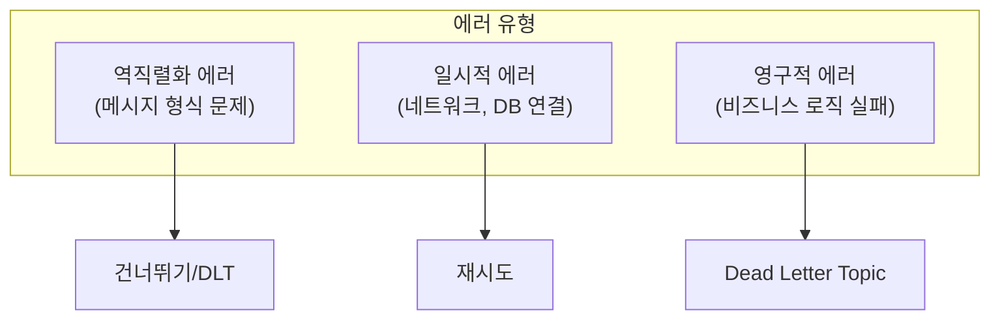
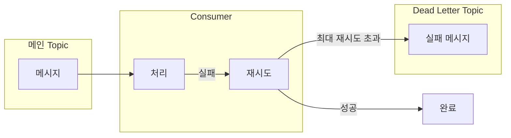
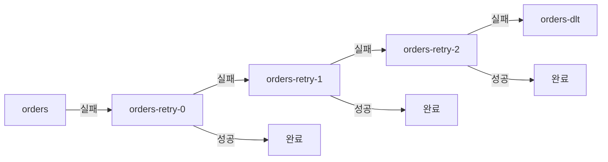


- 에러 유형: 역직렬화 에러(건너뛰기), 일시적 에러(재시도), 영구적 에러(DLT)
- @RetryableTopic으로 선언적 재시도 및 DLT 처리 (Spring Kafka 2.7+)
- DefaultErrorHandler + DeadLetterPublishingRecoverer로 DLT 발행
- 역직렬화 에러는 ErrorHandlingDeserializer로 처리
- DLT 메시지 도착 시 알림 설정으로 빠른 대응 필요


**대상 독자**: Consumer 에러 처리 전략을 구현하려는 개발자

**선수 지식**: [Consumer Group & Offset](consumer-group/)의 Consumer 동작 원리, Spring Kafka 기초

---

Kafka Consumer의 에러 처리 전략과 Dead Letter Topic 패턴을 이해합니다.

#### 에러 유형

Kafka Consumer에서 발생하는 에러는 크게 세 가지 유형으로 분류됩니다.



*다이어그램: 에러 유형별 처리 전략 - 역직렬화 에러는 건너뛰기/DLT, 일시적 에러는 재시도, 영구적 에러는 DLT로 전송.*

역직렬화 에러는 JSON 파싱 실패와 같은 메시지 형식 문제입니다.


- 역직렬화 에러: 메시지 형식 문제, 재시도 무의미 → 건너뛰기/DLT
- 일시적 에러: DB 연결, 타임아웃 등 → 재시도로 해결 가능
- 영구적 에러: 비즈니스 로직 실패 → DLT로 보내 별도 처리
 메시지 자체가 잘못되었으므로 재시도해도 해결되지 않습니다. 건너뛰거나 Dead Letter Topic으로 보냅니다.

일시적 에러는 DB 연결 실패, 타임아웃과 같이 일시적으로 발생하는 문제입니다. 잠시 후 재시도하면 성공할 가능성이 높으므로 재시도 전략을 적용합니다.

영구적 에러는 유효성 검증 실패와 같이 비즈니스 로직에서 발생하는 문제입니다. 재시도해도 결과가 같으므로 Dead Letter Topic으로 보내 별도로 처리합니다.

#### 기본 에러 처리

**DefaultErrorHandler (Spring Kafka 2.8+)**

Spring Kafka 2.8부터 제공되는 기본 에러 핸들러입니다. 설정된 간격과 횟수로 재시도하고, 최대 재시도 횟수를 초과하면 레코드를 건너뜁니다.

```java
@Configuration
public class KafkaConfig {

    @Bean
    public DefaultErrorHandler errorHandler() {
        // 1초 간격으로 3회 재시도
        return new DefaultErrorHandler(
            new FixedBackOff(1000L, 3L)
        );
    }
}
```

**재시도 전략**

FixedBackOff는 고정된 간격으로 재시도합니다. 위 예시에서는 1초 간격으로 3회 재시도합니다.

ExponentialBackOff는 지수 형태로 대기 시간을 증가시킵니다. 첫 번째 재시도는 1초 후, 두 번째는 2초 후, 세 번째는 4초 후와 같이 대기 시간이 증가합니다.

```java
@Bean
public DefaultErrorHandler errorHandler() {
    ExponentialBackOff backOff = new ExponentialBackOff(1000L, 2.0);
    backOff.setMaxElapsedTime(60000L);  // 최대 1분
    return new DefaultErrorHandler(backOff);
}
```

#### Dead Letter Topic (DLT)

Dead Letter Topic은 재시도 후에도 처리할 수 없는 메시지를 저장하는 별도 Topic입니다. 실패한 메시지를 버리지 않고 보관하여 나중에 분석하거나 수동으로 처리할 수 있습니다.



*다이어그램: DLT 처리 흐름 - 메시지 처리 실패 시 재시도, 최대 재시도 초과 시 Dead Letter Topic으로 전송.*


- Dead Letter Topic: 재시도 후에도 실패한 메시지 저장 공간
- 실패 메시지를 버리지 않고 보관하여 분석/수동 처리 가능
- 기본 DLT Topic 이름: 원본-topic.DLT (예: orders.DLT)


**DeadLetterPublishingRecoverer**

Spring Kafka에서 제공하는 DLT 발행 기능입니다. 최대 재시도 후에도 실패하면 메시지를 DLT로 전송합니다. 기본 DLT Topic 이름은 `원본-topic.DLT`입니다(예: `orders.DLT`).

```java
@Configuration
public class KafkaConfig {

    @Bean
    public DefaultErrorHandler errorHandler(
            KafkaTemplate<String, Object> kafkaTemplate) {

        DeadLetterPublishingRecoverer recoverer =
            new DeadLetterPublishingRecoverer(kafkaTemplate);

        return new DefaultErrorHandler(
            recoverer,
            new FixedBackOff(1000L, 3L)
        );
    }
}
```

**DLT 커스터마이징**

DLT Topic 이름을 변경하거나 특정 예외는 재시도하지 않도록 설정할 수 있습니다.

```java
@Bean
public DefaultErrorHandler errorHandler(
        KafkaTemplate<String, Object> kafkaTemplate) {

    // DLT Topic 이름 커스터마이징
    DeadLetterPublishingRecoverer recoverer =
        new DeadLetterPublishingRecoverer(kafkaTemplate,
            (record, exception) ->
                new TopicPartition(
                    record.topic() + "-dead-letter",
                    record.partition()
                ));

    // 특정 예외는 재시도하지 않음
    DefaultErrorHandler handler = new DefaultErrorHandler(
        recoverer,
        new FixedBackOff(1000L, 3L)
    );

    handler.addNotRetryableExceptions(
        ValidationException.class,
        NullPointerException.class
    );

    return handler;
}
```

ValidationException이나 NullPointerException은 재시도해도 결과가 같으므로 즉시 DLT로 보냅니다.

#### @RetryableTopic (권장)

Spring Kafka 2.7 이상에서 제공하는 선언적 재시도 및 DLT 처리입니다. 어노테이션으로 재시도 정책을 정의하여 코드가 간결해집니다.

**기본 사용법**

```java
@Component
public class OrderConsumer {

    @RetryableTopic(
        attempts = "4",  // 원본 1회 + 재시도 3회
        backoff = @Backoff(delay = 1000, multiplier = 2)
    )
    @KafkaListener(topics = "orders")
    public void consume(OrderEvent event) {
        // 처리 로직
        processOrder(event);
    }

    @DltHandler
    public void handleDlt(OrderEvent event,
                          @Header(KafkaHeaders.RECEIVED_TOPIC) String topic,
                          @Header(KafkaHeaders.EXCEPTION_MESSAGE) String error) {
        log.error("DLT 수신 - Topic: {}, 에러: {}", topic, error);
        // DLT 메시지 처리 (알림, 로깅 등)
        alertService.sendAlert(event, error);
    }
}
```

**재시도 Topic 구조**

@RetryableTopic은 자동으로 재시도 Topic을 생성합니다. 원본 orders에서 실패하면 orders-retry-0, orders-retry-1, orders-retry-2를 거쳐 최종적으로 orders-dlt로 전송됩니다.



*다이어그램: @RetryableTopic 재시도 흐름 - orders에서 실패 시 orders-retry-0, retry-1, retry-2를 거쳐 최종적으로 orders-dlt로 전송.*


- @RetryableTopic: 선언적 재시도 및 DLT 처리 (Spring Kafka 2.7+)
- 자동으로 재시도 Topic 생성: topic-retry-0, retry-1, ..., topic-dlt
- @DltHandler로 DLT 메시지 처리 로직 구현


**고급 설정**

```java
@RetryableTopic(
    attempts = "4",
    backoff = @Backoff(delay = 1000, multiplier = 2, maxDelay = 10000),
    autoCreateTopics = "true",
    topicSuffixingStrategy = TopicSuffixingStrategy.SUFFIX_WITH_INDEX_VALUE,
    dltStrategy = DltStrategy.ALWAYS_RETRY_ON_ERROR,
    include = {RetryableException.class},  // 재시도할 예외
    exclude = {NonRetryableException.class}  // 재시도 안할 예외
)
@KafkaListener(topics = "orders")
public void consume(OrderEvent event) {
    // ...
}
```

attempts는 총 시도 횟수이며 기본값은 3입니다. backoff.delay는 기본 대기 시간(기본값 1000ms), backoff.multiplier는 대기 시간 증가율(기본값 0으로 고정), backoff.maxDelay는 최대 대기 시간입니다. include는 재시도할 예외를, exclude는 재시도하지 않을 예외를 지정합니다.

#### 역직렬화 에러 처리

메시지 역직렬화가 실패하면 Consumer가 해당 메시지를 처리할 수 없습니다. ErrorHandlingDeserializer를 사용하면 역직렬화 실패를 애플리케이션에서 처리할 수 있습니다.

```yaml
spring:
  kafka:
    consumer:
      key-deserializer: org.springframework.kafka.support.serializer.ErrorHandlingDeserializer
      value-deserializer: org.springframework.kafka.support.serializer.ErrorHandlingDeserializer
      properties:
        spring.deserializer.key.delegate.class: org.apache.kafka.common.serialization.StringDeserializer
        spring.deserializer.value.delegate.class: org.springframework.kafka.support.serializer.JsonDeserializer
        spring.json.trusted.packages: "com.example.*"
```

역직렬화에 실패하면 value가 null로 전달되고, 헤더에 예외 정보가 포함됩니다.

```java
@KafkaListener(topics = "orders")
public void consume(ConsumerRecord<String, OrderEvent> record) {
    if (record.value() == null) {
        // 역직렬화 실패
        log.error("역직렬화 실패: {}", new String(record.headers()
            .lastHeader("springDeserializerExceptionValue").value()));
        return;
    }
    processOrder(record.value());
}
```

#### 에러 처리 패턴

**패턴 1: 재시도 + DLT**

가장 일반적인 패턴입니다. 일정 횟수 재시도 후 실패하면 DLT로 보냅니다.

```java
@RetryableTopic(attempts = "4")
@KafkaListener(topics = "orders")
public void consume(OrderEvent event) {
    validateAndProcess(event);
}

@DltHandler
public void handleDlt(OrderEvent event) {
    saveToFailedOrders(event);
    notifyAdmin(event);
}
```

**패턴 2: 조건부 재시도**

예외 유형에 따라 재시도 여부를 결정합니다. 일시적 에러는 재시도하고, 영구적 에러는 로깅 후 건너뜁니다.

```java
@KafkaListener(topics = "orders")
public void consume(OrderEvent event) {
    try {
        processOrder(event);
    } catch (TemporaryException e) {
        // 재시도 가능 → 예외 던지기
        throw e;
    } catch (PermanentException e) {
        // 재시도 불가 → 로깅 후 건너뛰기
        log.error("처리 불가: {}", event, e);
        saveToFailedOrders(event, e);
    }
}
```

**패턴 3: 수동 재처리**

DLT에서 메시지를 읽어 수동으로 검토하고 재처리합니다.

```java
@KafkaListener(topics = "orders-dlt")
public void processDlt(
        ConsumerRecord<String, OrderEvent> record,
        @Header(KafkaHeaders.EXCEPTION_MESSAGE) String error) {

    OrderEvent event = record.value();

    // 수동 검토 후 재처리
    if (canBeFixed(event)) {
        OrderEvent fixed = fixEvent(event);
        kafkaTemplate.send("orders", record.key(), fixed);
        log.info("재처리 완료: {}", record.key());
    } else {
        permanentlyFailed(event, error);
    }
}
```

#### 모니터링 및 알림

DLT에 메시지가 도착하면 즉시 알림을 보내 빠르게 대응할 수 있도록 합니다.

```java
@DltHandler
public void handleDlt(
        ConsumerRecord<String, OrderEvent> record,
        @Header(KafkaHeaders.EXCEPTION_MESSAGE) String error,
        @Header(KafkaHeaders.ORIGINAL_TOPIC) String originalTopic,
        @Header(KafkaHeaders.ORIGINAL_OFFSET) long originalOffset) {

    DltMessage dltMessage = DltMessage.builder()
        .key(record.key())
        .value(record.value())
        .originalTopic(originalTopic)
        .originalOffset(originalOffset)
        .error(error)
        .timestamp(Instant.now())
        .build();

    // Slack/이메일 알림
    alertService.sendDltAlert(dltMessage);

    // 메트릭 기록
    meterRegistry.counter("kafka.dlt.received",
        "topic", originalTopic).increment();
}
```

#### 정리

에러 처리 전략으로 @RetryableTopic은 선언적 재시도를, DefaultErrorHandler는 프로그래밍적 처리를, @DltHandler는 DLT 처리를 제공합니다.

에러 유형별로 일시적 에러는 지수 백오프로 재시도하고, 영구적 에러는 즉시 DLT로 이동하며, 역직렬화 에러는 로깅 후 건너뜁니다. DLT에 적재된 메시지는 알림을 보내고 수동 검토합니다.

#### 다음 단계

- [모니터링 기초](monitoring/) - Kafka 모니터링 및 메트릭
