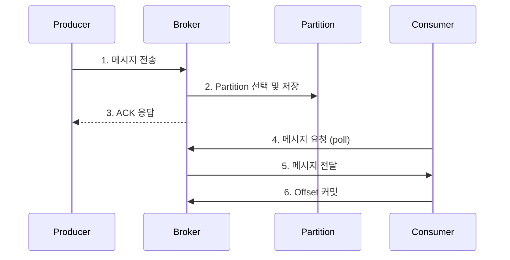


- Producer가 메시지를 직렬화하고 Partitioner가 대상 Partition을 결정
- Key가 있으면 같은 Key는 같은 Partition으로 전송되어 순서 보장
- Broker는 메시지를 Partition에 저장하고 ISR에 복제 후 ACK 반환
- Consumer는 Pull 방식으로 메시지를 가져와 처리 후 Offset 커밋
- At-Most-Once, At-Least-Once, Exactly-Once 세 가지 전달 보장 수준 제공


**대상 독자**: Kafka의 기본 구성요소를 이해한 개발자, 메시지 전달 과정의 상세 동작을 학습하려는 분

**선수 지식**: [핵심 구성요소]()의 Producer, Consumer, Broker, Topic, Partition 개념

**소요 시간**: 약 20분

---

Kafka에서 메시지가 발행되고 소비되는 전체 과정을 이해하는 것은 안정적인 시스템 운영의 기초입니다. 메시지가 Producer에서 출발하여 Broker에 저장되고, Consumer가 읽어가는 각 단계에서 어떤 일이 일어나는지 알아야 문제 상황에서 원인을 빠르게 파악하고 해결할 수 있습니다.

이 문서에서는 메시지 흐름의 각 단계를 상세히 살펴보고, 각 단계에서 흔히 발생하는 문제와 해결 방법을 함께 다룹니다. 단순히 "어떻게 동작하는가"를 넘어 "왜 이렇게 설계되었고, 실무에서 어떤 영향을 미치는가"를 이해하는 것이 목표입니다.

#### 왜 메시지 흐름을 이해해야 하는가

Kafka를 단순한 메시지 큐로만 생각하면 운영 중 예상치 못한 문제를 겪게 됩니다. 메시지 흐름을 깊이 이해하면 다음과 같은 질문에 답할 수 있습니다.

"왜 메시지 순서가 뒤바뀌었지?"라는 문제는 Partition과 Key의 관계를 모르면 원인을 파악하기 어렵습니다. Kafka는 같은 Partition 내에서만 순서를 보장하기 때문에, 순서가 중요한 메시지는 반드시 같은 Key를 사용해야 합니다.

"왜 같은 메시지가 두 번 처리되었지?"라는 문제는 Offset 커밋 시점을 이해하지 못하면 발생합니다. 메시지를 처리하기 전에 커밋하면 처리 실패 시 메시지가 유실되고, 처리 후에 커밋하면 커밋 실패 시 중복 처리가 발생할 수 있습니다.

"왜 Consumer가 메시지를 못 받지?"라는 문제는 Pull 방식의 특성을 모르면 원인 파악이 어렵습니다. Consumer가 poll()을 호출하지 않으면 메시지를 받을 수 없고, poll() 간격이 너무 길면 리밸런싱이 발생합니다.

"왜 처리량이 기대보다 낮지?"라는 문제는 Partition 분배 원리를 모르면 병목을 해결할 수 없습니다. Consumer 수가 Partition 수보다 많으면 일부 Consumer는 유휴 상태가 됩니다.

#### 전체 흐름 개요

메시지가 Producer에서 Consumer까지 전달되는 과정은 크게 세 단계로 나눌 수 있습니다. 이를 <strong>택배 배송 시스템</strong>에 비유하면 이해하기 쉽습니다:

| 단계 | 택배 비유 | Kafka |
|------|----------|-------|
| 1단계 | 발송인이 택배를 물류센터로 보냄 | Producer가 메시지를 Broker로 전송 |
| 2단계 | 물류센터가 창고에 보관 | Broker가 Partition에 저장 |
| 3단계 | 수령인이 택배를 수령 | Consumer가 메시지를 가져감 |

첫 번째 단계에서 Producer가 메시지를 직렬화하고 Partition을 선택하여 Broker로 전송합니다. 두 번째 단계에서 Broker가 메시지를 Partition에 저장하고 복제본을 동기화합니다. 세 번째 단계에서 Consumer가 Broker에 poll 요청을 보내 메시지를 가져오고 처리한 후 Offset을 커밋합니다.



*다이어그램: Producer가 Broker에 메시지를 전송하면, Broker가 Partition에 저장 후 ACK 응답. Consumer가 poll로 메시지를 요청하면 Broker가 전달하고, Consumer가 처리 후 Offset을 커밋하는 전체 흐름.*


- 메시지 흐름은 발행(Producer→Broker), 저장(Broker), 소비(Broker→Consumer) 3단계로 구분
- 각 단계의 동작 원리를 이해해야 순서 뒤바뀜, 중복 처리, 메시지 유실 문제 해결 가능
- Pull 방식의 특성과 Offset 커밋 시점이 전달 보장 수준을 결정


#### 메시지 발행 단계

Producer가 메시지를 Kafka에 전송하는 과정은 여러 단계로 이루어집니다. 먼저 애플리케이션에서 Key-Value 쌍으로 메시지를 생성합니다. Key는 선택 사항이지만 순서 보장이 필요한 경우 반드시 지정해야 합니다. 그 다음 Serializer가 객체를 바이트 배열로 변환합니다. 문자열이면 StringSerializer, JSON이면 JsonSerializer, Avro면 AvroSerializer를 사용합니다.

직렬화된 메시지는 Partitioner를 거쳐 어떤 Partition에 저장될지 결정됩니다. Key가 있으면 Key의 해시값을 Partition 수로 나눈 나머지가 Partition 번호가 됩니다. 같은 Key는 항상 같은 Partition으로 전송되므로 순서가 보장됩니다. Key가 없으면 라운드 로빈 방식으로 Partition에 균등하게 분배됩니다.

```java
// Producer 코드 예시
kafkaTemplate.send("orders", orderId, orderJson);
//                  Topic    Key      Value
```

**Key 설계가 중요한 이유**

Key는 단순한 식별자가 아니라 메시지의 운명을 결정합니다. Kafka는 Partition 내에서만 순서를 보장하기 때문에, 순서가 중요한 메시지들은 반드시 같은 Key를 사용해야 합니다.

주문 상태 변경 이벤트를 예로 들어보겠습니다. orderId를 Key로 사용하면 같은 주문의 모든 이벤트(OrderCreated, OrderPaid, OrderShipped)가 같은 Partition에 저장되어 순서대로 처리됩니다. 하지만 Key 없이 보내면 각 이벤트가 다른 Partition에 저장될 수 있고, Consumer에서 OrderShipped가 OrderCreated보다 먼저 처리될 수 있습니다. 이는 상태 머신 오류나 비즈니스 로직 오류를 일으킵니다.

Key를 설계할 때는 업무 도메인을 고려해야 합니다. 주문 이벤트는 orderId를, 사용자 활동 로그는 userId를, 센서 데이터는 sensorId를 Key로 사용합니다. 순서가 중요하지 않은 범용 로그는 Key 없이 보내서 균등하게 분배하는 것이 처리량 측면에서 유리합니다.

**Hot Partition 문제**

특정 Key에 메시지가 집중되면 해당 Partition만 과부하되는 Hot Partition 문제가 발생합니다. 예를 들어 대형 고객사의 모든 주문이 customer-대기업 Key를 사용하면 해당 Partition의 처리량이 폭주하고 다른 Partition은 유휴 상태가 됩니다.

이 문제를 해결하려면 Key를 더 세분화해야 합니다. customer-대기업-order-123처럼 주문 ID를 포함하면 같은 고객의 주문도 여러 Partition에 분산됩니다. 다만 이 경우 같은 고객의 주문 간에는 순서가 보장되지 않으므로, 순서 보장이 필수인 경우에만 고객 ID를 Key로 사용해야 합니다.


- Producer는 직렬화 → Partitioner → 전송 순서로 메시지를 처리
- Key가 있으면 해시 기반으로 Partition 결정, 같은 Key는 같은 Partition으로 전송
- Key가 없으면 라운드 로빈으로 균등 분배
- 특정 Key에 메시지가 집중되면 Hot Partition 문제 발생, Key 세분화로 해결


#### 메시지 저장 단계

Broker가 메시지를 받으면 해당 Partition의 로그 끝에 추가합니다. 이 저장 방식을 Append-only라고 합니다. 저장된 메시지는 수정할 수 없으며, 각 메시지에는 Partition 내에서 고유한 Offset이 할당됩니다. Offset은 0부터 시작하여 메시지가 추가될 때마다 1씩 증가합니다.

Kafka가 디스크에 저장하면서도 빠른 이유는 순차 I/O를 사용하기 때문입니다. 파일 끝에만 데이터를 추가하므로 디스크 헤드가 이동할 필요가 없습니다. 또한 운영체제의 페이지 캐시를 활용하여 자주 접근하는 데이터는 메모리에서 바로 제공합니다. Consumer에게 데이터를 전송할 때는 Zero-Copy 기술을 사용하여 커널 영역에서 네트워크 버퍼로 직접 복사합니다. 이러한 최적화 덕분에 Kafka는 단일 Partition에서도 초당 10만 건 이상의 메시지를 처리할 수 있습니다.

물리적으로 Partition은 여러 Segment 파일로 구성됩니다. 각 Segment는 로그 파일(.log)과 인덱스 파일(.index, .timeindex)로 이루어집니다. Segment 크기가 log.segment.bytes(기본 1GB)에 도달하거나 log.roll.hours 시간이 지나면 새 Segment가 생성됩니다. 오래된 Segment는 log.retention.hours 설정에 따라 자동으로 삭제됩니다.

```
/kafka-logs/
└── orders-0/                     # Topic "orders"의 Partition 0
    ├── 00000000000000000000.log   # 첫 번째 Segment
    ├── 00000000000000000000.index
    ├── 00000000000012345678.log   # 두 번째 Segment
    └── ...
```


- Broker는 Append-only 방식으로 메시지를 Partition 로그에 저장
- 순차 I/O, 페이지 캐시, Zero-Copy로 높은 처리량 달성
- 각 메시지는 Partition 내에서 고유한 Offset을 가짐
- Segment 파일 단위로 관리되며 retention 설정에 따라 자동 삭제


#### 메시지 소비 단계

Consumer는 Broker로부터 메시지를 Pull 방식으로 가져옵니다. Consumer가 poll() 메서드를 호출하면 Broker는 해당 Consumer에게 할당된 Partition에서 마지막으로 커밋된 Offset 이후의 메시지들을 반환합니다. Consumer는 메시지를 처리한 후 Offset을 커밋하여 처리 완료를 기록합니다.

```java
@KafkaListener(topics = "orders", groupId = "order-service")
public void consume(ConsumerRecord<String, String> record) {
    String key = record.key();
    String value = record.value();
    long offset = record.offset();

    processOrder(value);
    // Offset은 자동으로 커밋됨 (기본 설정)
}
```

**Pull 방식을 사용하는 이유**

Kafka가 Push가 아닌 Pull 방식을 선택한 데는 분명한 이유가 있습니다. Push 방식에서는 Broker가 Consumer에게 메시지를 밀어넣는데, Consumer의 처리 속도가 느리면 메시지가 쌓여서 메모리 부족이 발생할 수 있습니다. 백프레셔(backpressure) 메커니즘이 필요하고 구현이 복잡해집니다.

Pull 방식에서는 Consumer가 자신의 처리 속도에 맞게 메시지를 가져갑니다. 느린 Consumer도 문제없이 동작하고, 빠른 Consumer는 더 많은 메시지를 가져갈 수 있습니다. 또한 Consumer가 한 번에 여러 메시지를 가져와 배치로 처리할 수 있어 효율적입니다.

Pull 방식의 주의점은 poll() 호출 간격입니다. max.poll.interval.ms(기본 5분) 내에 다음 poll()을 호출하지 않으면 Consumer가 죽은 것으로 간주되어 리밸런싱이 발생합니다. 처리 시간이 긴 작업은 별도 스레드로 위임하거나 max.poll.interval.ms 값을 늘려야 합니다.

```java
@KafkaListener(topics = "orders")
public void consume(String message) {
    // 처리 시간이 5분 이상 걸리면 리밸런싱 발생
    // 해결: 별도 스레드로 위임
    executorService.submit(() -> verySlowProcess(message));
}
```


- Consumer는 Pull 방식으로 자신의 처리 속도에 맞게 메시지를 가져옴
- Push 방식과 달리 Consumer가 느려도 백프레셔 문제가 발생하지 않음
- poll() 간격이 max.poll.interval.ms(기본 5분)를 초과하면 리밸런싱 발생
- 처리 시간이 긴 작업은 별도 스레드로 위임하여 poll() 타임아웃 방지


#### 메시지 보장 수준

Kafka는 세 가지 메시지 전달 보장 수준을 제공합니다. 이를 <strong>택배 수령 확인 방식</strong>에 비유하면:

- **At-Most-Once**: 택배 기사가 문 앞에 두고 감 → 분실 가능
- **At-Least-Once**: 부재 시 재배달 → 같은 택배 두 번 받을 수 있음
- **Exactly-Once**: 본인 서명 필수 + 중복 배달 체크 → 정확히 한 번 수령

At-Most-Once는 메시지가 최대 한 번 전달되며 유실될 수 있습니다. 메시지를 가져온 직후 Offset을 커밋하고 처리하는 방식입니다. 처리 중 오류가 발생하면 해당 메시지는 다시 처리되지 않습니다. 로그나 메트릭처럼 일부 유실이 허용되는 경우에 사용합니다.

At-Least-Once는 메시지가 최소 한 번 전달되며 중복될 수 있습니다. 메시지를 처리한 후 Offset을 커밋하는 방식입니다. 처리는 성공했지만 커밋 전에 오류가 발생하면 같은 메시지가 다시 처리됩니다. 가장 일반적으로 사용되는 방식이며, Consumer에서 멱등성을 보장하면 중복 문제를 해결할 수 있습니다.

Exactly-Once는 메시지가 정확히 한 번만 처리됩니다. Kafka 트랜잭션을 사용하여 처리와 커밋을 원자적으로 수행합니다. 금융 트랜잭션처럼 정확성이 중요한 경우에 사용하지만, 오버헤드가 있어 꼭 필요한 경우에만 사용합니다.

대부분의 경우 At-Least-Once와 멱등성 처리의 조합이 적절합니다. 멱등성 처리란 같은 메시지를 여러 번 처리해도 결과가 같도록 구현하는 것입니다. 예를 들어 이벤트 ID를 데이터베이스에 저장하고, 처리 전에 이미 처리한 이벤트인지 확인합니다.

```java
@KafkaListener(topics = "orders")
public void consume(ConsumerRecord<String, OrderEvent> record) {
    String eventId = record.value().getEventId();

    if (processedEventRepository.exists(eventId)) {
        log.info("이미 처리된 이벤트, 건너뜀: {}", eventId);
        return;
    }

    processOrder(record.value());
    processedEventRepository.save(eventId);
}
```


- At-Most-Once: 유실 가능, 중복 없음 (로그, 메트릭 등에 적합)
- At-Least-Once: 유실 없음, 중복 가능 (일반적 사용, 멱등성 처리 필요)
- Exactly-Once: 유실/중복 없음 (트랜잭션 사용, 금융 등 정확성 필수 경우)
- 대부분의 경우 At-Least-Once + 멱등성 처리 조합이 적절


#### 실무에서 흔한 실수

첫 번째 흔한 실수는 Key 없이 순서 의존 로직을 구현하는 것입니다. 주문 상태 변경처럼 순서가 중요한 이벤트인데 Key를 지정하지 않으면, Consumer에서 이벤트가 순서 없이 도착하여 상태 머신 오류가 발생합니다. 해결책은 순서가 중요한 이벤트에 반드시 Key를 지정하는 것입니다.

```java
// 잘못된 코드: 주문 상태 변경인데 Key가 없음
kafkaTemplate.send("order-events", orderEvent);

// 올바른 코드
kafkaTemplate.send("order-events", orderId, orderEvent);
```

두 번째 흔한 실수는 자동 커밋에 의존하면서 긴 처리 시간을 갖는 것입니다. 자동 커밋(enable.auto.commit=true)은 기본적으로 5초마다 Offset을 커밋합니다. 처리 시간이 10초라면 처리 중에 자동 커밋이 발생하고, 처리 실패 시 메시지가 유실됩니다. 긴 처리가 필요하면 수동 커밋을 사용해야 합니다.

```java
@KafkaListener(topics = "orders")
public void consume(String message, Acknowledgment ack) {
    longRunningProcess(message);
    ack.acknowledge();  // 처리 완료 후 커밋
}
```

세 번째 흔한 실수는 Consumer 처리 속도가 Producer 전송 속도보다 느린 것입니다. 이 경우 Consumer lag이 계속 증가하여 결국 처리 불가능한 수준까지 쌓입니다. Consumer 인스턴스를 추가하거나, 처리 로직을 최적화하거나, Partition 수를 늘려서 해결합니다.

네 번째 흔한 실수는 Partition 수보다 많은 Consumer를 배포하는 것입니다. 하나의 Partition은 Consumer Group 내에서 하나의 Consumer만 처리할 수 있습니다. Partition이 3개인데 Consumer가 5개면 2개는 유휴 상태가 됩니다. Consumer 수를 Partition 수 이하로 유지하거나, 확장이 필요하면 먼저 Partition 수를 늘려야 합니다.


- 순서가 중요한 이벤트에는 반드시 Key를 지정해야 함
- 자동 커밋 사용 시 처리 시간이 길면 메시지 유실 가능, 수동 커밋 권장
- Consumer Lag이 증가하면 인스턴스 추가 또는 처리 로직 최적화 필요
- Consumer 수는 Partition 수 이하로 유지 (초과 시 유휴 Consumer 발생)


#### 다른 메시징 시스템과의 비교

Kafka, RabbitMQ, AWS SQS는 각각 다른 특성을 가지고 있어 상황에 맞는 선택이 중요합니다.

Kafka는 분산 로그 아키텍처로 매우 높은 처리량을 제공합니다. 메시지가 설정 기간 동안 보존되어 재처리가 가능하고, Partition 내에서 순서가 보장됩니다. 여러 Consumer Group이 같은 메시지를 독립적으로 읽을 수 있어 이벤트 소싱이나 스트림 처리에 적합합니다. 다만 운영 복잡도가 높습니다.

RabbitMQ는 전통적인 메시지 브로커로 복잡한 라우팅 규칙과 요청-응답 패턴을 잘 지원합니다. 메시지별 TTL이나 우선순위 설정이 가능합니다. Kafka보다 운영이 간단하지만 처리량은 낮고, 기본적으로 메시지가 소비 후 삭제되어 재처리가 어렵습니다.

AWS SQS는 완전 관리형 서비스로 운영 부담이 가장 적습니다. AWS Lambda와 통합이 용이하여 서버리스 아키텍처에 적합합니다. 다만 처리량에 제한이 있고, FIFO 큐를 사용해야만 순서가 보장됩니다.

높은 처리량이 필요하거나, 메시지 재처리가 필요하거나, 여러 Consumer가 같은 메시지를 읽어야 하는 경우 Kafka가 적합합니다. 복잡한 라우팅이나 RPC 패턴이 필요하면 RabbitMQ가, 간단한 큐잉과 최소한의 운영 부담을 원하면 AWS SQS가 적합합니다.


- Kafka: 높은 처리량, 메시지 보존/재처리, 여러 Consumer Group 독립 소비 가능
- RabbitMQ: 복잡한 라우팅, RPC 패턴, 소비 후 메시지 삭제
- AWS SQS: 완전 관리형, 간단한 큐잉, 서버리스 통합 용이
- 요구사항에 맞는 시스템 선택이 중요


#### 운영 모니터링 가이드

Kafka 운영에서 가장 중요한 지표는 Consumer lag입니다. Lag은 Producer가 생산한 메시지 중 Consumer가 아직 처리하지 않은 메시지 수입니다. Lag이 0에 가까우면 실시간에 가깝게 처리되고 있는 것이고, Lag이 계속 증가하면 Consumer가 처리량을 따라가지 못하는 것입니다.

```bash
kafka-consumer-groups.sh --describe --group order-service \
  --bootstrap-server localhost:9092
```

Lag이 100 이하면 정상입니다. 100-1,000이면 Consumer 성능을 점검해야 합니다. 1,000-10,000이면 Consumer 추가나 최적화가 필요합니다. 10,000 이상이면 즉시 조치가 필요하며 처리 병목을 확인해야 합니다.

문제가 발생했을 때는 다음 순서로 확인합니다. 먼저 Consumer lag을 확인하여 처리 병목 여부를 파악합니다. Consumer group 멤버 수를 확인하여 Consumer 장애 여부를 확인합니다. Broker의 CPU와 메모리를 확인하여 인프라 문제 여부를 판단합니다. Producer error rate를 확인하여 전송 실패 여부를 확인합니다. 마지막으로 네트워크 지연을 확인합니다.


- Consumer Lag이 가장 중요한 모니터링 지표
- Lag 100 이하 정상, 100~1000 주의, 1000~10000 경고, 10000 이상 긴급
- 문제 발생 시: Lag → Consumer 상태 → Broker → Producer → 네트워크 순서로 확인
- kafka-consumer-groups.sh 명령으로 실시간 Lag 확인 가능


#### 핵심 정리

Key는 순서 보장이 필요하면 반드시 지정해야 합니다. 같은 Key의 메시지는 같은 Partition에 저장되어 순서가 보장됩니다. 다만 특정 Key에 메시지가 집중되면 Hot Partition 문제가 발생할 수 있습니다.

Partition은 병렬 처리의 단위입니다. Consumer 수는 Partition 수 이하로 유지해야 모든 Consumer가 일을 할 수 있습니다. 확장이 필요하면 먼저 Partition 수를 늘려야 합니다.

Offset은 Consumer의 읽기 위치를 나타냅니다. 커밋 시점에 따라 메시지 보장 수준이 결정됩니다. 처리 전 커밋은 유실 가능성이, 처리 후 커밋은 중복 가능성이 있습니다.

Pull 방식은 Consumer가 자신의 속도에 맞게 메시지를 가져갈 수 있게 합니다. 다만 poll() 간격이 너무 길면 리밸런싱이 발생하므로 주의해야 합니다.

#### 다음 단계

이 문서에서는 메시지가 Producer에서 Consumer까지 전달되는 전체 과정을 살펴보았습니다. 다음 단계로 Consumer Group과 Offset 관리에 대해 더 자세히 학습할 수 있습니다.

- [Consumer Group과 Offset]() - 병렬 처리와 상태 관리의 세부 사항
