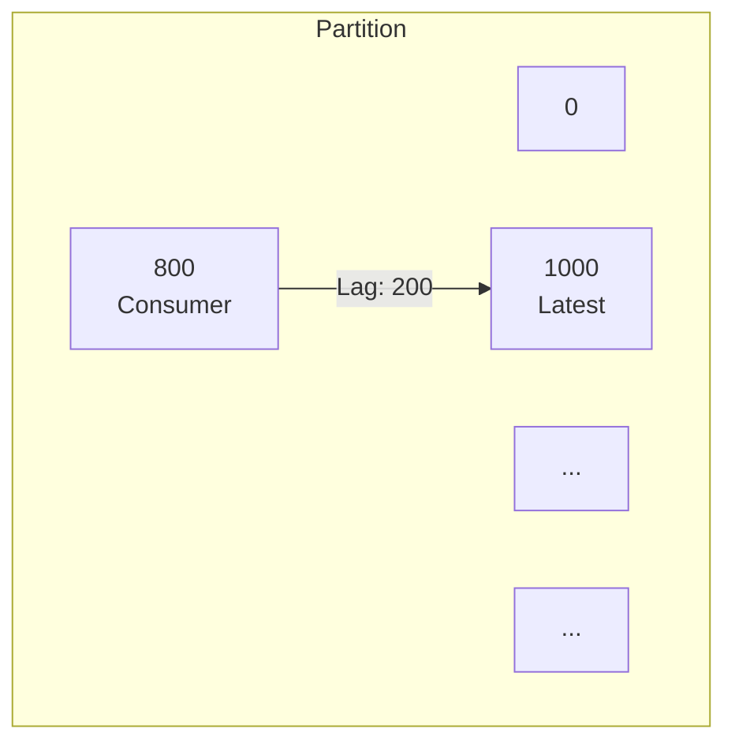
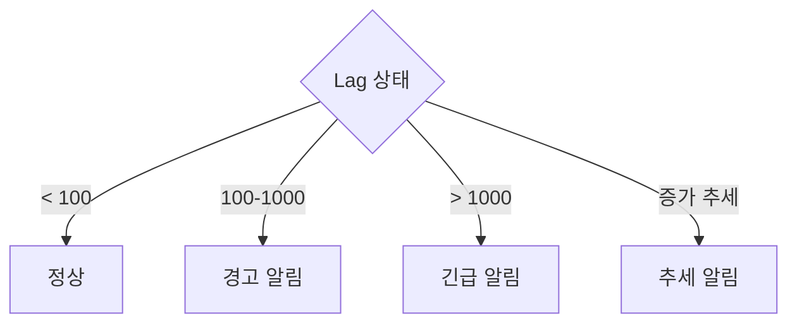
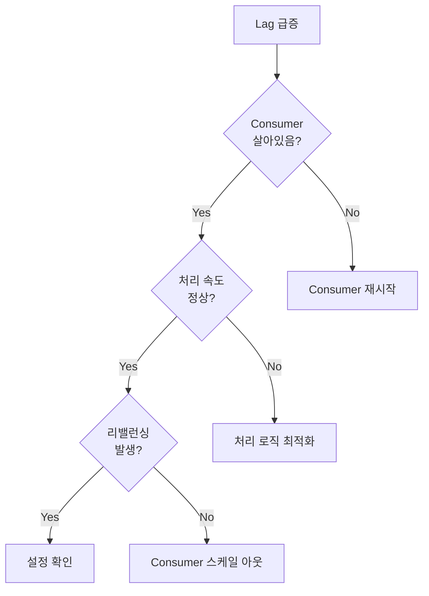


- Consumer Lag이 가장 중요한 메트릭, 증가 추세 시 즉시 조치 필요
- Broker 핵심 메트릭: UnderReplicatedPartitions, ActiveControllerCount, OfflinePartitionsCount
- Producer 메트릭: record-send-rate, record-error-rate, request-latency-avg
- Prometheus + Grafana로 시각화 및 알림 설정 권장
- Lag 급증 시: Consumer 상태 → 처리 속도 → 리밸런싱 → 스케일 아웃 순서로 확인


**대상 독자**: Kafka 클러스터를 운영하고 모니터링하려는 운영자 및 개발자

**선수 지식**: [Consumer Group & Offset](consumer-group/)의 Offset과 Lag 개념

---

Kafka 클러스터와 애플리케이션의 핵심 메트릭을 이해합니다.

#### 전체 비유: 자동차 계기판

Kafka 모니터링을 <strong>자동차 계기판</strong>에 비유하면 이해하기 쉽습니다:

| 자동차 계기판 비유 | Kafka 메트릭 | 의미 |
|------------------|-------------|------|
| 연료 게이지 (남은 양) | Consumer Lag | 처리할 메시지가 얼마나 쌓였는지 |
| 속도계 (현재 속도) | records-consumed-rate | 초당 처리량 |
| 경고등 (이상 신호) | Error Rate | 문제 발생 빈도 |
| 엔진 온도 | Request Latency | 시스템 부하 정도 |
| 타이어 압력 | UnderReplicatedPartitions | 복제 상태 (안전 여부) |

**핵심 원칙**: 연료 게이지(Lag)가 가장 중요합니다. 연료가 계속 줄어드는데(Lag 증가) 주유소가 안 보이면(처리 속도 부족) 곧 멈춥니다.

#### 모니터링 대상

Kafka 시스템에서 모니터링해야 할 대상은 네 가지 영역으로 나눌 수 있습니다.

Broker 모니터링은 클러스터의 전반적인 상태를 파악하는 데 필수적입니다. 복제 상태, 컨트롤러 상태, 파티션 상태 등을 확인하여 클러스터가 정상적으로 동작하는지 판단합니다.

Producer 모니터링은 메시지 전송 성능을 추적합니다. 초당 전송량, 에러율, 지연시간을 확인하여 Producer가 효율적으로 동작하는지 확인합니다.

Consumer 모니터링은 메시지 처리 상태를 추적합니다. Consumer Lag은 가장 중요한 메트릭으로, 처리 속도가 생산 속도를 따라가는지 보여줍니다.

Topic/Partition 모니터링은 데이터 분산 상태와 각 파티션의 상태를 확인합니다.

#### Consumer Lag

Consumer Lag은 Kafka 모니터링에서 가장 중요한 메트릭입니다. Lag은 Topic에서 가장 최신 메시지의 Offset(Log End Offset, LEO)과 Consumer가 현재 처리한 위치(Consumer Offset)의 차이입니다. 예를 들어 Partition의 LEO가 1000이고 Consumer Offset이 800이라면 Lag은 200입니다. 이는 Consumer가 처리해야 할 메시지가 200개 남아있음을 의미합니다.



**Lag의 의미 해석**

Lag이 0이면 Consumer가 실시간으로 메시지를 처리하고 있음을 나타내며 정상 상태입니다. Lag이 일정 수치를 유지하면 Consumer가 안정적으로 메시지를 처리하고 있으며 이 또한 정상 상태입니다. 그러나 Lag이 지속적으로 증가하는 추세라면 처리 속도가 생산 속도보다 느리다는 것을 의미하며 조치가 필요합니다. Lag이 급증한다면 Consumer가 처리를 중단했거나 심각한 문제가 발생한 것이므로 긴급 조치가 필요합니다.

**Lag 모니터링 방법**

kafka-consumer-groups.sh 명령어를 사용하면 Consumer Group의 현재 상태와 Lag을 확인할 수 있습니다.

```bash
kafka-consumer-groups.sh \
  --bootstrap-server localhost:9092 \
  --group order-service \
  --describe
```

출력 결과는 각 Partition별로 현재 Consumer Offset, Log End Offset, Lag을 보여줍니다.

```
GROUP           TOPIC           PARTITION  CURRENT-OFFSET  LOG-END-OFFSET  LAG
order-service   orders          0          800             1000            200
order-service   orders          1          750             900             150
order-service   orders          2          820             820             0
```

Spring Boot Actuator를 사용하면 애플리케이션에서 직접 Lag 메트릭을 노출할 수 있습니다.

```yaml
management:
  endpoints:
    web:
      exposure:
        include: health,metrics,kafka
```

Actuator 엔드포인트를 통해 Lag을 조회할 수 있습니다.

```bash
curl http://localhost:8080/actuator/metrics/kafka.consumer.fetch.manager.records.lag
```

#### Broker 메트릭

Broker 상태를 파악하기 위한 핵심 메트릭이 있습니다.

UnderReplicatedPartitions는 복제가 부족한 파티션 수를 나타냅니다. 이 값이 0보다 크면 일부 Broker가 다운되었거나 네트워크 문제가 있을 수 있으므로 즉시 확인이 필요합니다.

ActiveControllerCount는 클러스터 내 활성 컨트롤러 수입니다. 이 값은 항상 1이어야 합니다. 0이면 컨트롤러가 없어 클러스터가 정상 동작하지 않고, 2 이상이면 Split Brain 상태일 수 있습니다.

OfflinePartitionsCount는 오프라인 상태인 파티션 수입니다. 이 값이 0보다 크면 해당 파티션의 데이터에 접근할 수 없으므로 긴급 조치가 필요합니다.

RequestHandlerAvgIdlePercent는 요청 핸들러의 유휴율을 나타냅니다. 이 값이 30% 미만이면 Broker가 과부하 상태일 수 있으므로 리소스 확장을 고려해야 합니다.

**JMX 메트릭 설정**

Broker 메트릭은 JMX(Java Management Extensions)를 통해 노출됩니다. Broker 시작 시 JMX 포트를 활성화합니다.

```bash
# JMX 활성화 (브로커 시작 시)
KAFKA_JMX_OPTS="-Dcom.sun.management.jmxremote -Dcom.sun.management.jmxremote.port=9999"
```

주요 JMX Bean 경로는 다음과 같습니다.

```
kafka.server:type=ReplicaManager,name=UnderReplicatedPartitions
kafka.controller:type=KafkaController,name=ActiveControllerCount
kafka.server:type=BrokerTopicMetrics,name=MessagesInPerSec
kafka.network:type=RequestMetrics,name=TotalTimeMs,request=Produce
```

#### Producer 메트릭

Producer의 성능과 안정성을 모니터링하기 위한 메트릭입니다.

record-send-rate는 초당 전송되는 레코드 수를 나타내며, 처리량을 파악하는 데 사용됩니다. record-error-rate는 초당 발생하는 에러 수로, 이 값이 전체 전송량의 1%를 초과하면 문제가 있을 수 있습니다. request-latency-avg는 요청당 평균 지연시간으로, 100ms를 초과하면 네트워크나 Broker 성능을 확인해야 합니다. batch-size-avg는 평균 배치 크기로, 배치 효율성을 확인하는 데 사용됩니다. buffer-exhausted-rate는 버퍼가 부족해진 빈도로, 이 값이 0보다 크면 버퍼 크기를 늘려야 합니다.

**Spring Kafka + Micrometer 설정**

Spring Kafka와 Micrometer를 함께 사용하면 Producer 메트릭을 쉽게 수집할 수 있습니다.

```yaml
management:
  metrics:
    enable:
      kafka: true
```

커스텀 메트릭을 추가하여 비즈니스 관련 지표를 추적할 수 있습니다.

```java
@Component
public class KafkaMetrics {

    private final MeterRegistry meterRegistry;
    private final Counter successCounter;
    private final Counter errorCounter;

    public KafkaMetrics(MeterRegistry meterRegistry) {
        this.meterRegistry = meterRegistry;
        this.successCounter = meterRegistry.counter("kafka.producer.success");
        this.errorCounter = meterRegistry.counter("kafka.producer.error");
    }

    public void recordSuccess() {
        successCounter.increment();
    }

    public void recordError() {
        errorCounter.increment();
    }
}
```

#### Consumer 메트릭

Consumer의 상태와 성능을 모니터링하기 위한 메트릭입니다.

records-lag는 현재 Lag 값으로, 가장 중요한 메트릭입니다. 증가 추세라면 처리 속도가 부족한 것입니다. records-lag-max는 모든 파티션 중 최대 Lag 값으로, 특정 파티션에 문제가 있는지 확인하는 데 유용합니다. records-consumed-rate는 초당 소비되는 레코드 수로, 급격한 감소는 문제를 나타냅니다. fetch-latency-avg는 평균 fetch 지연시간으로, 증가 추세라면 네트워크나 Broker 문제일 수 있습니다. commit-latency-avg는 평균 Offset 커밋 지연시간으로, 100ms를 초과하면 확인이 필요합니다.

**Lag 알림 설정**

Lag이 특정 임계값을 초과하면 알림을 보내도록 설정할 수 있습니다.

```java
@Component
public class LagMonitor {

    private final MeterRegistry meterRegistry;
    private final AlertService alertService;

    @Scheduled(fixedRate = 30000)  // 30초마다
    public void checkLag() {
        Gauge lagGauge = meterRegistry.find("kafka.consumer.fetch.manager.records.lag")
            .gauge();

        if (lagGauge != null && lagGauge.value() > 10000) {
            alertService.sendAlert(
                "Consumer Lag Critical",
                String.format("Current lag: %.0f", lagGauge.value())
            );
        }
    }
}
```

#### Prometheus + Grafana

Prometheus와 Grafana를 사용하면 Kafka 메트릭을 시각화하고 알림을 설정할 수 있습니다.

**JMX Exporter 설정**

JMX Exporter는 JMX 메트릭을 Prometheus 형식으로 변환합니다.

```yaml
# jmx_exporter_config.yaml
rules:
  - pattern: kafka.server<type=(.+), name=(.+)><>Value
    name: kafka_server_$1_$2
    type: GAUGE

  - pattern: kafka.consumer<type=(.+), name=(.+), (.+)=(.+)><>Value
    name: kafka_consumer_$1_$2
    labels:
      $3: $4
    type: GAUGE
```

**Spring Boot Prometheus 설정**

Spring Boot 애플리케이션에서 Prometheus 엔드포인트를 노출합니다.

```yaml
management:
  endpoints:
    web:
      exposure:
        include: prometheus,health,metrics
  metrics:
    export:
      prometheus:
        enabled: true
```

**Grafana 대시보드 쿼리**

Grafana에서 PromQL을 사용하여 Kafka 메트릭을 시각화합니다.

Consumer Lag을 Topic과 Partition별로 집계하려면 `sum(kafka_consumer_records_lag) by (topic, partition)` 쿼리를 사용합니다. 메시지 처리율을 5분 단위로 계산하려면 `rate(kafka_consumer_records_consumed_total[5m])` 쿼리를 사용합니다. Producer 에러율을 5분 단위로 계산하려면 `rate(kafka_producer_record_error_total[5m])` 쿼리를 사용합니다.

#### 알림 설정 가이드

Lag 기반으로 알림을 설정할 때 단계별 임계값을 적용합니다. Lag이 100 미만이면 정상 상태입니다. 100에서 1000 사이면 경고 알림을 발송합니다. 1000을 초과하면 긴급 알림을 발송합니다. Lag이 지속적으로 증가하는 추세라면 별도의 추세 알림을 발송합니다.



각 메트릭별 권장 임계값입니다. Consumer Lag은 1,000이면 Warning, 10,000이면 Critical입니다. Producer Error Rate는 1%면 Warning, 5%면 Critical입니다. Broker UnderReplicated는 1이면 Warning, 1을 초과하면 Critical입니다. Request Latency는 100ms면 Warning, 500ms면 Critical입니다.

#### 로깅 전략

구조화된 로깅은 문제 추적에 매우 유용합니다. MDC(Mapped Diagnostic Context)를 사용하면 로그에 컨텍스트 정보를 추가할 수 있습니다.

```java
@KafkaListener(topics = "orders")
public void consume(ConsumerRecord<String, OrderEvent> record) {
    MDC.put("topic", record.topic());
    MDC.put("partition", String.valueOf(record.partition()));
    MDC.put("offset", String.valueOf(record.offset()));
    MDC.put("key", record.key());

    try {
        processOrder(record.value());
        log.info("메시지 처리 완료");
    } catch (Exception e) {
        log.error("메시지 처리 실패", e);
        throw e;
    } finally {
        MDC.clear();
    }
}
```

Logback 설정에서 MDC 필드를 JSON 형식으로 출력하면 로그 분석 도구에서 쉽게 검색하고 필터링할 수 있습니다.

```xml
<appender name="KAFKA_LOG" class="ch.qos.logback.core.rolling.RollingFileAppender">
    <encoder class="net.logstash.logback.encoder.LogstashEncoder">
        <includeMdcKeyName>topic</includeMdcKeyName>
        <includeMdcKeyName>partition</includeMdcKeyName>
        <includeMdcKeyName>offset</includeMdcKeyName>
    </encoder>
</appender>
```

#### 트러블슈팅

Lag이 급증했을 때 단계적으로 원인을 파악합니다.

먼저 Consumer가 살아있는지 확인합니다. Consumer 프로세스가 죽었다면 재시작합니다. Consumer가 살아있다면 처리 속도가 정상인지 확인합니다. 처리 속도가 느리다면 처리 로직을 최적화합니다. 처리 속도가 정상이라면 리밸런싱이 발생했는지 확인합니다. 리밸런싱이 발생했다면 session.timeout.ms, max.poll.interval.ms 등의 설정을 검토합니다. 리밸런싱이 발생하지 않았다면 Consumer 스케일 아웃을 고려합니다.



**문제 진단 체크리스트**

Consumer 상태는 kafka-consumer-groups.sh 명령어로 확인합니다.

```bash
kafka-consumer-groups.sh --describe --group order-service
```

리밸런싱 발생 여부는 Kafka 서버 로그에서 확인합니다.

```bash
grep "Rebalancing" /var/log/kafka/server.log
```

네트워크 연결 상태는 netstat으로 확인합니다.

```bash
netstat -an | grep 9092
```

디스크 사용량은 Kafka 데이터 디렉토리에서 확인합니다. 디스크가 가득 차면 Broker가 새 메시지를 받지 못합니다.

```bash
df -h /var/lib/kafka
```

#### 정리

Kafka 모니터링의 핵심 메트릭은 세 가지입니다. Consumer Lag은 가장 중요한 메트릭으로 처리 지연을 나타냅니다. Error Rate는 시스템 품질을 나타내는 지표입니다. Latency는 성능을 나타내는 지표입니다.

모니터링 도구로는 kafka-consumer-groups CLI, Spring Actuator, Prometheus, Grafana를 활용합니다. 우선순위로 보면 Consumer Lag이 가장 중요하고, 그 다음이 Error Rate, Latency 순이며, 마지막으로 Broker Health를 확인합니다.

#### 다음 단계

- [실습 예제](../examples/) - 배운 개념을 직접 적용해보기
