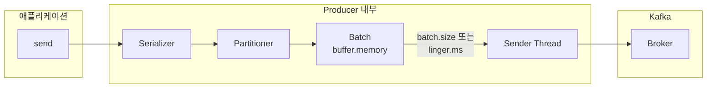
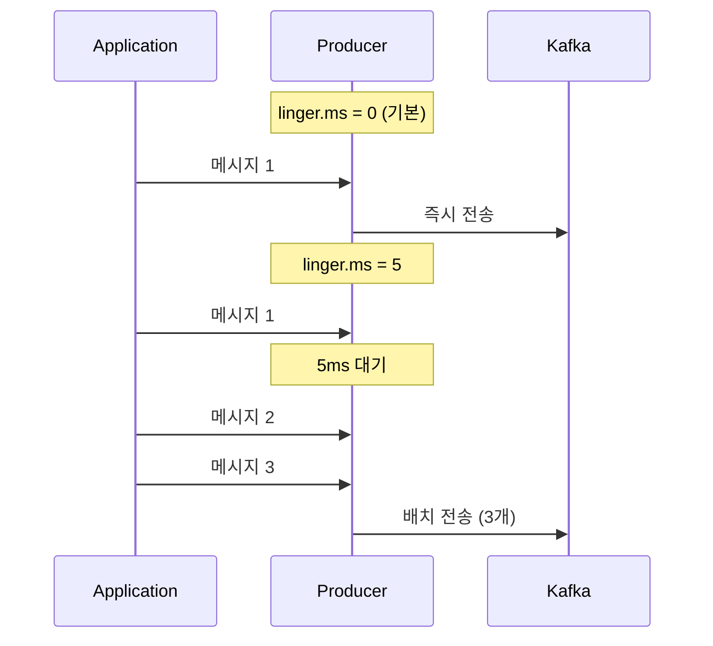
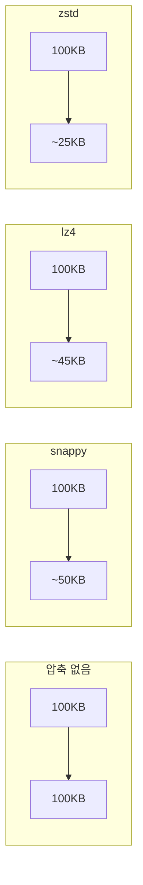
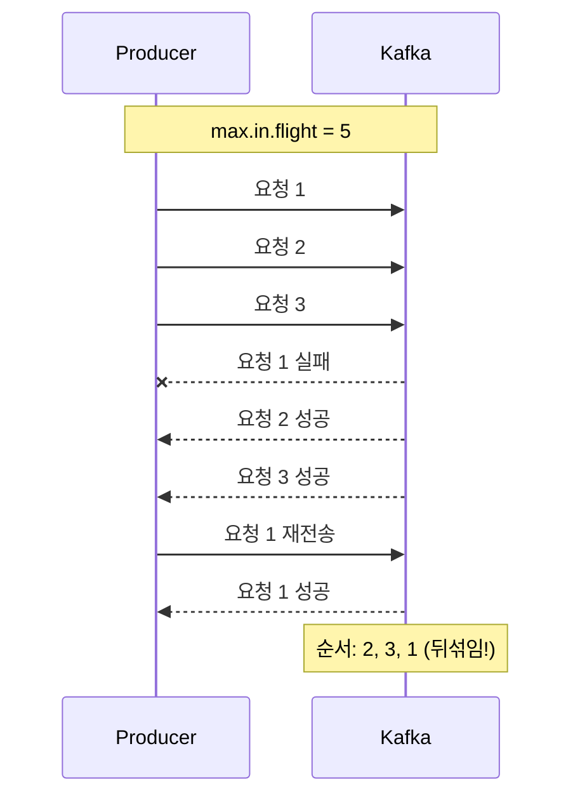


- batch.size와 linger.ms로 배치 효율 조절 (OR 조건으로 동작)
- linger.ms=5만으로도 처리량이 약 2.7배 증가 가능
- compression.type: snappy(일반), lz4(고성능), zstd(고압축) 권장
- Idempotent Producer(Kafka 3.0+ 기본)로 중복 방지 및 순서 보장
- buffer.memory 부족 시 TimeoutException 발생 (max.block.ms 초과 시)


**대상 독자**: Producer 성능을 최적화하려는 개발자, 대용량 메시지 처리가 필요한 운영자

**선수 지식**: [심화 개념](advanced-concepts/)의 acks, Idempotent Producer, [메시지 흐름](message-flow/)의 Topic, Partition 개념

**소요 시간**: 약 25-30분

---

Producer 성능을 최적화하는 핵심 설정들을 이해합니다. 이 문서는 Kafka 3.6.x 기준으로 작성되었으며, Spring Boot 3.2.x와 Spring Kafka 3.1.x, Java 17 환경에서 코드 예제가 검증되었습니다.

이 문서를 읽기 전에 [심화 개념](advanced-concepts/)에서 acks, Message Key, Idempotent Producer를, [메시지 흐름](message-flow/)에서 Topic, Partition, Broker 개념을 먼저 이해하고 있어야 합니다.

#### 전체 비유: 물류 트럭 운송

Producer 튜닝을 <strong>물류 센터의 트럭 배송</strong>에 비유하면 이해하기 쉽습니다:

| 물류 트럭 비유 | Producer 설정 | 설명 |
|---------------|---------------|------|
| 트럭 적재 용량 | batch.size | 16KB(경차) vs 64KB(대형트럭) |
| 출발 대기 시간 | linger.ms | 0ms=즉시출발, 5ms=조금 기다림 |
| 물류창고 크기 | buffer.memory | 창고 가득 차면 대기(블로킹) |
| 포장 압축 | compression.type | 압축하면 더 많이 싣지만 포장시간 소요 |
| 동시 출발 트럭 수 | max.in.flight | 많으면 빠르지만 도착 순서 뒤섞일 수 있음 |

**핵심 트레이드오프:**
- **즉시 출발** (linger.ms=0): 빠른 배송, 트럭당 물건 적음 → 저지연
- **모아서 출발** (linger.ms=5+): 느린 배송, 트럭당 물건 많음 → 고처리량

#### Producer 내부 구조

Producer는 애플리케이션에서 send()를 호출하면 Serializer가 메시지를 직렬화하고, Partitioner가 어떤 Partition으로 보낼지 결정합니다. 그 후 배치에 메시지를 모아두고, Sender Thread가 Broker로 전송합니다.



*다이어그램: Producer 내부 구조 - send() 호출 후 Serializer → Partitioner → Batch → Sender Thread → Broker 순서로 처리. batch.size 또는 linger.ms 조건 충족 시 전송.*

핵심 설정으로 batch.size는 배치 크기(기본값 16KB), linger.ms는 배치 대기 시간(기본값 0ms), buffer.memory는 전체 버퍼 크기(기본값 32MB), compression.type은 압축 방식(기본값 none), max.in.flight.requests.per.connection은 동시 요청 수(기본값 5)입니다.


- Producer 동작: send() → Serializer → Partitioner → Batch → Sender → Broker
- batch.size와 linger.ms는 OR 조건으로 동작 (둘 중 하나 충족 시 전송)
- 핵심 튜닝 포인트: batch.size, linger.ms, compression.type


#### batch.size

한 번에 전송할 메시지 배치의 최대 크기입니다. 작은 값으로 설정하면 메시지 1개당 네트워크 요청 1번이 발생하여 네트워크 오버헤드가 커집니다. 큰 값으로 설정하면 여러 메시지를 하나의 네트워크 요청으로 전송하여 효율이 높아집니다.

```yaml
spring:
  kafka:
    producer:
      batch-size: 16384  # 16KB (기본값)
      # batch-size: 65536  # 64KB (처리량 중시)
      # batch-size: 1024   # 1KB (지연 시간 중시)
```

작은 값은 낮은 지연과 낮은 처리량을 제공하며 실시간 요구사항에 적합합니다. 큰 값은 높은 처리량과 높은 지연을 제공하며 배치 처리에 적합합니다.


- batch.size: 한 번에 전송할 배치의 최대 크기 (기본값 16KB)
- 작은 값: 낮은 지연 + 낮은 처리량 (실시간용)
- 큰 값: 높은 처리량 + 높은 지연 (배치 처리용)


#### linger.ms

배치가 가득 차지 않아도 전송하기까지 대기하는 시간입니다. 기본값 0은 메시지가 도착하면 즉시 전송합니다. 값을 5ms로 설정하면 5ms 동안 추가 메시지를 기다렸다가 함께 전송합니다.



*다이어그램: linger.ms=0이면 메시지 도착 즉시 전송. linger.ms=5이면 5ms 대기 중 추가 메시지를 모아 배치로 전송.*

```yaml
spring:
  kafka:
    producer:
      properties:
        linger.ms: 5  # 5ms 대기
```

기본값 0은 즉시 전송으로 지연 시간을 최소화합니다. 5~10ms는 적당한 배칭으로 일반적으로 권장됩니다. 100ms 이상은 최대 배칭으로 대용량 배치 처리에 적합합니다.

batch.size와 linger.ms는 OR 조건으로 작동합니다. batch.size에 도달하거나 linger.ms가 초과되면 전송됩니다.


- linger.ms=0: 즉시 전송, 지연 최소화
- linger.ms=5~20ms: 적당한 배칭, 일반적으로 권장
- batch.size와 OR 조건: 둘 중 하나만 충족해도 전송


#### buffer.memory

Producer가 사용할 수 있는 전체 버퍼 메모리입니다. 각 Partition별로 배치가 생성되어 이 버퍼에 저장되고, Sender Thread가 Broker로 전송합니다.

버퍼가 가득 차면 max.block.ms 동안 대기합니다. 그 시간 내에 공간이 확보되면 새 메시지를 추가하고, 그렇지 않으면 TimeoutException이 발생합니다.

```yaml
spring:
  kafka:
    producer:
      buffer-memory: 33554432  # 32MB (기본값)
      properties:
        max.block.ms: 60000  # 버퍼 대기 최대 시간
```

권장 규칙은 buffer.memory > batch.size × Partition 수입니다.

#### compression.type

메시지 압축 방식을 설정합니다. 압축을 사용하면 네트워크 전송량과 Broker 저장 공간이 줄어들지만 CPU 사용량이 증가합니다.



*다이어그램: 100KB 원본 데이터가 압축 방식에 따라 snappy ~50KB, lz4 ~45KB, zstd ~25KB로 감소하는 예시.*

none은 압축률 0%, 최저 CPU, 최고 속도로 작은 메시지에 적합합니다. gzip은 최고 압축률이지만 최고 CPU와 최저 속도를 보여 저장 공간을 중시할 때 사용합니다. snappy는 중간 압축률, 낮은 CPU, 높은 속도로 일반적으로 권장됩니다. lz4는 중간 압축률, 낮은 CPU, 최고 속도로 고성능이 요구될 때 권장됩니다. zstd는 높은 압축률, 중간 CPU, 높은 속도로 Kafka 2.1 이상에서 사용 가능합니다.


- 압축 권장: snappy(일반), lz4(고성능), zstd(고압축)
- 압축 시 네트워크/저장 공간 50% 이상 절감 가능
- gzip은 CPU 사용량 높음, CPU 병목 시 lz4/snappy 사용


```yaml
spring:
  kafka:
    producer:
      compression-type: snappy  # 일반 권장
      # compression-type: lz4   # 고성능
      # compression-type: zstd  # 고압축
```

압축을 사용하면 원본 100MB 데이터가 snappy로 50MB가 되어 네트워크 전송, Broker 저장, 복제 전송 모두 50% 절감됩니다.

#### max.in.flight.requests.per.connection

하나의 연결에서 ACK 대기 중인 최대 요청 수입니다. 이 값이 1보다 크면 요청 1이 실패하고 요청 2, 3이 성공한 후 요청 1이 재전송되어 순서가 뒤바뀔 수 있습니다.



*다이어그램: max.in.flight=5일 때 요청 1이 실패하고 요청 2, 3이 먼저 성공한 후 요청 1이 재전송되어 순서가 2, 3, 1로 뒤섞이는 문제.*

Idempotent Producer(Kafka 3.0+ 기본 활성화)를 사용하면 시퀀스 번호로 순서가 보장되어 max.in.flight를 5까지 안전하게 사용할 수 있습니다.


- max.in.flight > 1: 재전송 시 순서 뒤섞임 가능
- Idempotent Producer: 시퀀스 번호로 순서 보장 (Kafka 3.0+ 기본 활성화)
- Idempotent + max.in.flight=5 조합 권장


```yaml
# 방법 1: Idempotent Producer (권장)
spring:
  kafka:
    producer:
      properties:
        enable.idempotence: true  # Kafka 3.0+ 기본값
        max.in.flight.requests.per.connection: 5  # 5까지 안전

# 방법 2: in-flight를 1로 제한 (성능 저하)
spring:
  kafka:
    producer:
      properties:
        max.in.flight.requests.per.connection: 1
```

#### 재시도 설정

```yaml
spring:
  kafka:
    producer:
      retries: 2147483647  # Integer.MAX_VALUE (기본값)
      properties:
        delivery.timeout.ms: 120000  # 전체 타임아웃
        retry.backoff.ms: 100  # 재시도 간격
        request.timeout.ms: 30000  # 단일 요청 타임아웃
```

delivery.timeout.ms는 메시지 전송의 전체 타임아웃입니다. 이 시간 내에 요청, 대기, 재시도를 반복합니다. 규칙은 delivery.timeout.ms >= request.timeout.ms + linger.ms입니다.

#### 프로필별 설정 예시

**처리량 최적화 (Throughput)**

```yaml
spring:
  kafka:
    producer:
      acks: all
      batch-size: 65536  # 64KB
      compression-type: lz4
      properties:
        linger.ms: 50
        buffer.memory: 67108864  # 64MB
```

**지연 시간 최적화 (Latency)**

```yaml
spring:
  kafka:
    producer:
      acks: 1  # 또는 all
      batch-size: 1024  # 1KB
      compression-type: none
      properties:
        linger.ms: 0
```

**균형잡힌 설정 (Balanced)**

```yaml
spring:
  kafka:
    producer:
      acks: all
      batch-size: 16384  # 16KB
      compression-type: snappy
      properties:
        linger.ms: 5
        enable.idempotence: true
```

#### 성능 특성 참고 데이터

아래 수치는 참고용입니다. 실제 성능은 환경(하드웨어, 네트워크, 메시지 크기, 직렬화 방식)에 따라 크게 달라집니다. 직접 측정을 권장합니다.

```bash
# Kafka 내장 성능 테스트 도구
kafka-producer-perf-test.sh --topic test-topic \
    --num-records 1000000 \
    --record-size 1024 \
    --throughput -1 \
    --producer-props bootstrap.servers=localhost:9092 \
        linger.ms=5 batch.size=16384
```

linger.ms=5만으로도 처리량이 약 2.7배 증가합니다. 대부분의 경우 5~20ms가 최적입니다. batch.size는 64KB 이상에서 처리량 증가가 미미하며, 메모리 대비 효율은 64KB가 최적입니다.

압축 방식 비교에서 snappy와 lz4가 일반적으로 권장됩니다. gzip은 압축률이 높지만 CPU 사용량이 높아 처리량이 낮아집니다.

#### 프로덕션 트러블슈팅

**TimeoutException (buffer.memory 부족)**

buffer.memory가 가득 차서 max.block.ms 시간 내에 공간 확보에 실패한 경우입니다. Kafka 3.x에서는 `BufferExhaustedException` 대신 `TimeoutException`이 발생합니다. buffer.memory를 증가시키거나 max.block.ms를 늘리거나 linger.ms를 조정하여 배치 전송을 촉진합니다.

```yaml
spring:
  kafka:
    producer:
      buffer-memory: 67108864  # 32MB → 64MB 증가
      properties:
        max.block.ms: 120000   # 60초 → 120초 증가
        linger.ms: 5           # 배치 전송 촉진
```

**RecordTooLargeException**

메시지가 max.request.size를 초과한 경우입니다. Producer, Broker, Topic 모두에서 최대 크기 설정을 조정해야 합니다. 메시지가 1MB를 초과하면 참조 패턴 사용을 고려합니다. 실제 데이터는 S3나 MinIO에 저장하고 Kafka에는 URL만 전송합니다.

**TimeoutException (Delivery Timeout)**

delivery.timeout.ms 내에 전송이 완료되지 않은 경우입니다. Broker 상태, 네트워크 레이턴시, ISR 상태를 확인하고 타임아웃 설정을 조정합니다.

```yaml
spring:
  kafka:
    producer:
      retries: 2147483647
      properties:
        delivery.timeout.ms: 180000  # 3분
        request.timeout.ms: 60000    # 1분
        retry.backoff.ms: 500
```

#### 메모리 최적화 가이드

Producer 메모리 계산은 buffer.memory + (batch.size × Partition 수) + 오버헤드입니다. 예를 들어 buffer.memory 32MB, batch.size 64KB × 30 Partitions = 1.9MB, Serialization 버퍼 약 10MB로 총 약 45MB per Producer가 예상됩니다.

메시지 볼륨이 낮으면(~1K/s) Heap 512MB와 buffer.memory 32MB를, 중간(~10K/s)이면 Heap 1GB와 buffer.memory 64MB를, 높으면(~100K/s) Heap 2GB 이상과 buffer.memory 128MB 이상을 권장합니다.

#### 정리

처리량을 높이려면 batch.size와 linger.ms를 증가시키고 lz4나 snappy 압축을 사용합니다. 지연시간을 줄이려면 batch.size를 줄이고 linger.ms를 0으로 설정합니다. buffer.memory는 처리량에 영향을 주지만 지연시간에는 직접 영향이 없습니다.

#### FAQ

**Q: linger.ms를 늘리면 메시지 유실 위험이 있나요?**

아니요. linger.ms는 버퍼에서 대기하는 시간이며, 이 시간 동안 Producer가 죽으면 버퍼 내 메시지는 유실됩니다. 하지만 이는 acks 설정과 무관합니다. 중요 데이터는 acks=all과 함께 사용하세요.

**Q: batch.size와 linger.ms 중 뭘 먼저 튜닝해야 하나요?**

linger.ms를 먼저 튜닝하세요. 기본값 0에서 5~20ms로만 바꿔도 처리량이 크게 향상됩니다. batch.size는 그 다음에 조정합니다.

**Q: 압축을 사용하면 Producer CPU가 병목이 될 수 있나요?**

네. gzip은 CPU 사용량이 높습니다. CPU 병목이 우려되면 lz4나 snappy를 사용하세요. 압축률은 낮지만 속도가 빠릅니다.

**Q: buffer.memory가 부족하면 어떻게 되나요?**

max.block.ms 시간 동안 대기 후 TimeoutException이 발생합니다. buffer.memory를 늘리거나 Broker 응답 속도를 확인하세요.

**Q: Idempotent Producer를 쓰면 성능이 떨어지나요?**

Kafka 3.0 이상에서는 기본 활성화이며, 성능 영향은 미미합니다(1~2% 이내). 순서 보장과 중복 방지 이점이 더 큽니다.

#### 참고 자료

- [Kafka Producer Configs - Apache Documentation](https://kafka.apache.org/documentation/#producerconfigs)
- [Kafka Performance Tuning - Confluent Blog](https://www.confluent.io/blog/configure-kafka-to-minimize-latency/)
- [Producer Compression - Confluent Documentation](https://docs.confluent.io/platform/current/installation/configuration/producer-configs.html#compression-type)
- [kafka-producer-perf-test - Kafka Tools](https://kafka.apache.org/documentation/#basic_ops_producer_perf)

#### 다음 단계

- [Consumer 심화 운영](consumer-advanced/) - Consumer 성능 최적화
- [트랜잭션](transactions/) - Exactly-Once 처리
