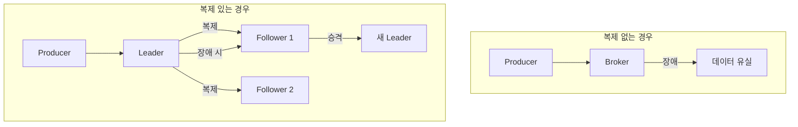
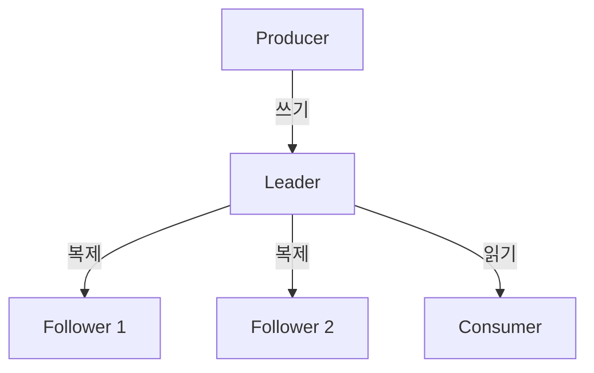


- Replication Factor(RF)는 Partition 복제본 수, 프로덕션에서 RF=3 권장
- Leader가 읽기/쓰기 처리, Follower는 복제만 담당하다가 장애 시 승격
- ISR(In-Sync Replicas)은 Leader와 동기화된 복제본 집합
- min.insync.replicas=2 + acks=all 조합으로 데이터 안전성 확보
- KRaft 모드(Kafka 3.3+)로 Zookeeper 없이 클러스터 운영 가능


**대상 독자**: Kafka 클러스터를 운영하거나 고가용성 시스템을 설계하는 개발자 및 운영자

**선수 지식**: [핵심 구성요소](core-components/)의 Broker, Partition 개념

**소요 시간**: 약 15분

---

데이터 복제는 Kafka의 고가용성과 내결함성의 핵심입니다. 이를 <strong>은행 금고 시스템</strong>에 비유하면 이해하기 쉽습니다:

| 은행 금고 비유 | Kafka Replication |
|---------------|-------------------|
| 중요 서류 원본 | Leader Partition |
| 다른 지점의 복사본 | Follower Partition |
| 본점 금고 사고 시 지점 금고 사용 | Leader 장애 시 Follower 승격 |
| 최소 2개 지점에 복사 후 보관 확인 | min.insync.replicas=2 + acks=all |

복제가 없으면 단일 Broker 장애로 인해 데이터가 영구적으로 유실될 수 있습니다. 이 문서에서는 Kafka의 복제 메커니즘이 어떻게 동작하는지, 그리고 프로덕션 환경에서 어떻게 설정해야 하는지 상세히 설명합니다.

Kafka는 각 Partition을 여러 Broker에 복제하여 저장합니다. 하나의 Broker가 장애를 일으켜도 다른 Broker에 동일한 데이터가 있으므로 서비스가 계속될 수 있습니다. 복제본 중 하나는 Leader 역할을 하고 나머지는 Follower 역할을 합니다. 모든 읽기와 쓰기는 Leader를 통해 이루어지고, Follower는 Leader의 데이터를 지속적으로 복제합니다.

#### 왜 Replication이 필요한가

단일 Broker에만 데이터를 저장하면 장애 시 복구할 방법이 없습니다. 실제로 어떤 일이 발생하는지 살펴보겠습니다.

복제 없이 운영하다가 Broker가 다운되면 해당 Broker에 저장된 모든 Partition 데이터가 영구적으로 유실됩니다. Producer는 메시지 전송에 실패하고, Consumer는 해당 Partition에서 더 이상 메시지를 읽을 수 없습니다. 백업이 없다면 데이터를 되살릴 방법이 없습니다.

복제가 있으면 상황이 완전히 다릅니다. Leader Broker가 장애를 일으키면 ISR(In-Sync Replicas) 중 하나가 수 초 내에 새로운 Leader로 자동 승격됩니다. Producer와 Consumer는 잠시 연결이 끊겼다가 새 Leader로 자동 연결됩니다. 데이터 유실 없이 서비스가 계속됩니다.



*다이어그램: 왼쪽은 복제 없는 경우로 Broker 장애 시 데이터 유실. 오른쪽은 복제 있는 경우로 Leader에서 Follower로 복제되어 Leader 장애 시 Follower가 새 Leader로 승격.*


- 복제 없이 운영하면 단일 Broker 장애로 데이터 영구 유실
- 복제가 있으면 Leader 장애 시 ISR 중 하나가 자동으로 새 Leader로 승격
- 데이터 유실 없이 수 초 내 서비스 복구 가능


#### Leader와 Follower의 역할

각 Partition은 하나의 Leader와 여러 Follower로 구성됩니다. Leader는 해당 Partition에 대한 모든 읽기와 쓰기 요청을 처리합니다. Producer가 메시지를 보내면 Leader가 받아서 저장하고, Follower들에게 복제합니다. Consumer가 메시지를 요청하면 Leader가 응답합니다.

Follower의 역할은 Leader의 데이터를 지속적으로 복제하여 동기화 상태를 유지하는 것입니다. Follower는 직접 클라이언트 요청을 처리하지 않습니다. 대신 Leader에 장애가 발생했을 때 새로운 Leader로 승격될 준비를 합니다. 이 설계 덕분에 읽기와 쓰기의 일관성이 보장되고, 장애 시 빠른 복구가 가능합니다.



*다이어그램: Producer가 Leader에 쓰기 요청을 보내면 Leader가 Follower들에게 복제. Consumer는 Leader에서만 읽기. 모든 클라이언트 요청은 Leader를 통해 처리.*


- Leader가 모든 읽기/쓰기 요청 처리, Follower는 복제만 담당
- Follower는 Leader 장애 시 새 Leader로 승격될 준비 상태 유지
- 클라이언트는 메타데이터를 통해 Leader 위치를 알아내어 직접 연결


Producer와 Consumer는 오직 Leader에만 연결됩니다. Kafka 클라이언트는 Broker에 연결할 때 메타데이터를 요청하여 각 Partition의 Leader 위치를 알아내고, 해당 Leader에 직접 연결합니다.

#### Replication Factor 설정

Replication Factor는 각 Partition의 복제본 수를 결정합니다. RF=1이면 복제가 없어 원본만 존재합니다. RF=2이면 원본과 복제본 하나가 있어 1대의 Broker 장애를 허용합니다. RF=3이면 원본과 두 개의 복제본이 있어 2대의 Broker 장애를 허용합니다.

프로덕션 환경에서는 RF=3을 권장합니다. RF=2는 언뜻 보기에 충분해 보이지만 실제 운영 상황을 고려하면 위험합니다. Broker A가 Leader이고 Broker B가 Follower인 상황에서 Broker A를 정기 점검으로 내리면 Broker B가 Leader로 승격됩니다. 이 시점에서 복제본은 1개만 존재합니다. 점검 중에 Broker B에 장애가 발생하면 데이터가 유실됩니다.

RF=3이면 Broker A를 내려도 Broker B와 C가 남아 복제본 2개가 유지됩니다. 점검 중 Broker B에 장애가 발생해도 Broker C가 Leader로 승격되어 서비스가 계속됩니다. 저장 비용이 50% 증가하지만 운영 안정성이 크게 향상됩니다.


- RF=1: 복제 없음, 단일 장애로 데이터 유실
- RF=2: 1대 장애 허용, 정기 점검 중 추가 장애 시 위험
- RF=3: 2대 장애 허용, 프로덕션 권장 (저장 비용 50% 증가)


#### ISR (In-Sync Replicas) 이해하기

ISR은 Leader와 동기화된 복제본의 집합입니다. 이를 비유하면 <strong>"신뢰할 수 있는 백업 팀"</strong>입니다. 은행 금고의 복사본이 있어도, 최신 상태가 아니라면 비상시에 사용할 수 없습니다. 마찬가지로 Follower가 Leader의 데이터를 제때 복제하지 못하면 ISR에서 제외되어 Leader 후보에서 탈락합니다.

ISR에 포함되려면 replica.lag.time.max.ms(기본 30초) 이내에 Leader와 동기화되어야 합니다.

ISR 개념이 중요한 이유는 Leader 선출과 관련이 있습니다. Leader 장애 시 새로운 Leader는 ISR 내에서만 선출됩니다. ISR에 포함된 Follower만이 Leader와 동기화된 최신 데이터를 가지고 있기 때문입니다. ISR에 없는 Follower가 Leader가 되면 동기화되지 않은 오래된 데이터로 서비스하게 되어 데이터 유실이 발생합니다.

**LEO와 High Watermark**

복제가 어떻게 동작하는지 이해하려면 LEO(Log End Offset)와 High Watermark를 알아야 합니다. LEO는 각 복제본의 가장 마지막 메시지 다음 Offset입니다. Leader의 LEO가 100이면 0부터 99까지의 메시지가 저장되어 있다는 의미입니다. High Watermark는 모든 ISR에 복제가 완료된 Offset입니다. Consumer는 High Watermark까지만 읽을 수 있습니다.

예를 들어 Leader의 LEO가 100이고 Follower의 LEO가 95라면 High Watermark는 95입니다. 메시지 96-100은 아직 Follower에 복제되지 않았습니다. 이 상태에서 Leader가 장애를 일으키면 Follower가 Leader로 승격되고, 메시지 96-100은 유실됩니다. 이것이 acks=all 설정이 중요한 이유입니다.

**replica.lag.time.max.ms 설정**

이 설정은 Follower가 ISR에 유지되기 위해 허용되는 최대 지연 시간입니다. 값이 너무 짧으면 네트워크 일시 지연만으로도 Follower가 ISR에서 제외되어 불필요한 리밸런싱이 발생합니다. 값이 너무 길면 실제 장애 감지가 느려져 데이터 정합성 위험이 있습니다.

안정적인 네트워크에서는 10초가 적당합니다. 불안정한 네트워크에서는 기본값인 30초를 유지합니다. 지역 간 복제처럼 레이턴시가 높은 환경에서는 1분 이상으로 설정합니다.

```bash
# Under-replicated partitions 확인 - 0이어야 정상
kafka-topics.sh --describe --under-replicated-partitions \
  --bootstrap-server localhost:9092
```


- ISR: Leader와 동기화된 복제본 집합, Leader 선출 후보군
- High Watermark: 모든 ISR에 복제 완료된 Offset, Consumer 읽기 한계
- replica.lag.time.max.ms: ISR 유지 최대 지연 시간 (기본 30초)


#### Leader Election 과정

Leader 장애가 발생하면 Controller가 이를 감지하고 새로운 Leader를 선출합니다. Controller는 클러스터의 메타데이터를 관리하는 특별한 Broker입니다. KRaft 모드에서는 일부 Broker가 Controller 역할을 겸합니다.

Controller가 장애를 감지하면 ISR 중에서 새로운 Leader를 선택합니다. 새 Leader가 결정되면 Controller가 해당 Broker에 통보하고, 다른 Follower들에게도 새 Leader 정보를 전파합니다. 이 과정은 보통 수 초 내에 완료됩니다.

ISR이 비어있을 때 어떻게 할지는 unclean.leader.election.enable 설정으로 결정합니다. false(기본값)이면 ISR이 비어있으면 Leader 선출이 불가능하여 해당 Partition은 오프라인 상태가 됩니다. 데이터 유실보다 가용성 중단이 나은 경우입니다. true이면 동기화되지 않은 Follower라도 Leader로 선출될 수 있습니다. 가용성이 중요하고 데이터 유실을 감수할 수 있는 경우입니다. 프로덕션에서는 반드시 false로 유지해야 합니다.

#### min.insync.replicas 설정

min.insync.replicas는 메시지 쓰기가 성공하기 위해 필요한 최소 ISR 수입니다. RF=3이고 min.insync.replicas=2이면 최소 2개의 복제본에 메시지가 저장되어야 쓰기가 성공합니다.

ISR이 1개만 남으면(예: 2대의 Broker 장애) Producer가 acks=all로 메시지를 보내도 실패합니다. min.insync.replicas 조건을 충족하지 못하기 때문입니다. 이는 데이터 안전성을 위한 의도적인 설계입니다. 복제본이 부족한 상태에서 쓰기를 허용하면 해당 메시지가 유실될 위험이 높습니다.

프로덕션 권장 설정은 RF=3, min.insync.replicas=2, acks=all입니다. 이 조합은 1대의 Broker 장애를 허용하면서도 데이터 안전성을 보장합니다.


- min.insync.replicas: ACK 반환에 필요한 최소 ISR 수
- ISR 부족 시 Producer 쓰기 실패 (의도적 설계로 데이터 안전성 확보)
- 프로덕션 권장: RF=3 + min.insync.replicas=2 + acks=all


#### Zookeeper와 KRaft 비교

Kafka 3.3 이전에는 클러스터 메타데이터 관리에 Zookeeper가 필수였습니다. Broker 상태, Topic 정보, Partition 할당, ACL 등의 정보를 Zookeeper가 관리했습니다. 하지만 Zookeeper는 외부 시스템으로서 추가적인 운영 부담을 주었고, Partition 수가 많아지면 성능 병목이 발생했습니다.

KRaft(Kafka Raft) 모드는 Kafka 자체적으로 메타데이터를 관리하는 새로운 방식입니다. Zookeeper가 필요 없어져 운영 복잡도가 낮아집니다. 메타데이터 동기화가 빨라져 Partition 확장성이 향상됩니다. 클러스터 시작 시간이 단축되고 장애 복구도 빨라집니다.

신규 프로젝트에서는 KRaft 모드를 사용하는 것이 좋습니다. Kafka 3.3부터 프로덕션에서 사용 가능하며, Kafka 4.0부터는 Zookeeper 지원이 제거될 예정입니다.

```yaml
# KRaft 모드 Docker Compose 설정
environment:
  KAFKA_PROCESS_ROLES: broker,controller
  KAFKA_CONTROLLER_QUORUM_VOTERS: 1@kafka:9093
```


- KRaft: Kafka 자체적으로 메타데이터 관리, Zookeeper 불필요 (3.3+)
- 장점: 운영 복잡도 감소, 빠른 시작/복구, 높은 확장성
- Kafka 4.0부터 Zookeeper 지원 제거 예정, 신규 프로젝트는 KRaft 권장


#### 장애 시나리오와 대응

**시나리오 1: 단일 Broker 장애**

3대 클러스터에서 1대가 다운되면 해당 Broker가 Leader인 Partition들은 자동으로 새 Leader가 선출됩니다. 서비스 중단 시간은 수 초입니다. 해당 Broker의 Follower Partition들은 ISR에서 제외됩니다. 장애 Broker를 복구한 후 ISR에 다시 포함되는지 확인합니다.

**시나리오 2: 과반수 Broker 장애**

3대 중 2대가 다운되면 대부분의 Partition에서 ISR이 1개 이하가 됩니다. min.insync.replicas=2 조건을 충족하지 못해 Producer는 쓰기에 실패합니다. Consumer는 Leader가 살아있다면 읽기는 가능합니다. 최소 1대라도 빨리 복구해야 합니다. 긴급 상황에서는 일시적으로 min.insync.replicas=1로 변경할 수 있지만, 데이터 유실 위험을 감수해야 합니다.

**시나리오 3: 전체 클러스터 재시작**

계획된 유지보수로 전체 클러스터를 재시작해야 할 때는 Rolling Restart를 사용합니다. 한 대씩 순차적으로 재시작하고, 각 Broker 재시작 후 ISR 복구를 확인한 후 다음 Broker를 진행합니다. controlled.shutdown.enable=true가 설정되어 있어야 깨끗한 종료가 됩니다. 한꺼번에 재시작하면 Leader Election이 폭주하고 데이터 정합성 문제가 발생할 수 있습니다.

#### acks 설정과 Replication의 관계

Producer의 acks 설정은 복제와 밀접한 관련이 있습니다. acks=0이면 Producer는 전송만 하고 응답을 기다리지 않습니다. 가장 빠르지만 메시지 유실 가능성이 높습니다. acks=1이면 Leader가 저장을 확인하면 성공입니다. Leader 장애 시 복제되지 않은 메시지가 유실될 수 있습니다. acks=all이면 모든 ISR에 저장이 완료되어야 성공입니다. 가장 안전하지만 지연 시간이 늘어납니다.

프로덕션에서는 acks=all과 min.insync.replicas=2 조합을 권장합니다.

```yaml
spring:
  kafka:
    producer:
      acks: all
```

#### 복제 성능 영향

복제는 안전성을 높이지만 성능에 영향을 줍니다. acks=0일 때 쓰기 지연시간은 1ms 미만입니다. acks=1일 때는 1-5ms 정도입니다. acks=all, RF=3일 때는 5-15ms 정도입니다. 원격 데이터센터 간 복제에서는 50-200ms까지 늘어날 수 있습니다.

네트워크 대역폭도 RF배로 증가합니다. 100MB/sec의 쓰기 처리량이면 RF=3일 때 Leader에서 두 Follower로 각각 100MB/sec씩 복제되어 총 200MB/sec의 추가 네트워크 사용이 발생합니다. Broker 간 네트워크는 10Gbps 이상을 권장합니다.

#### 프로덕션 체크리스트

배포 전에 다음 사항을 확인합니다. Replication Factor가 3 이상인지, min.insync.replicas가 2 이상인지, unclean.leader.election.enable이 false인지 확인합니다. 모든 Broker가 다른 랙이나 가용영역에 분산되어 있는지 확인합니다. 모니터링과 알림이 설정되어 있는지 확인합니다.

일일 모니터링에서는 Under-replicated partitions가 0인지, Offline partitions가 0인지 확인합니다. ISR 축소/확장 이벤트가 빈번하지 않은지 로그를 확인합니다.

```bash
# Under-replicated partition 확인
kafka-topics.sh --describe --under-replicated-partitions \
  --bootstrap-server localhost:9092

# Offline partition 확인
kafka-topics.sh --describe --unavailable-partitions \
  --bootstrap-server localhost:9092
```

#### 다음 단계

이 문서에서는 Kafka의 복제 메커니즘을 상세히 살펴보았습니다. 다음으로 acks, Message Key, Retention 등 실무에서 자주 마주치는 심화 개념을 학습할 수 있습니다.

- [심화 개념](advanced-concepts/) - acks, Message Key, Retention, Idempotent Producer
