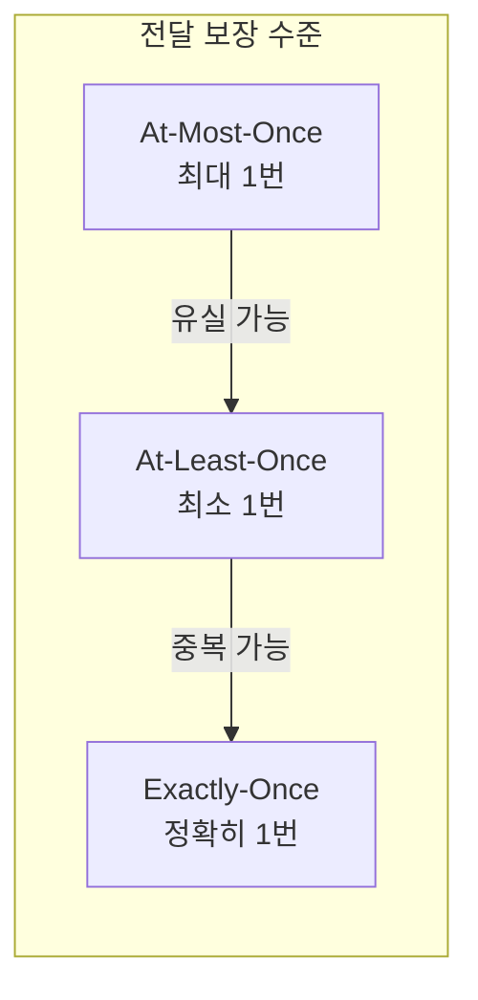
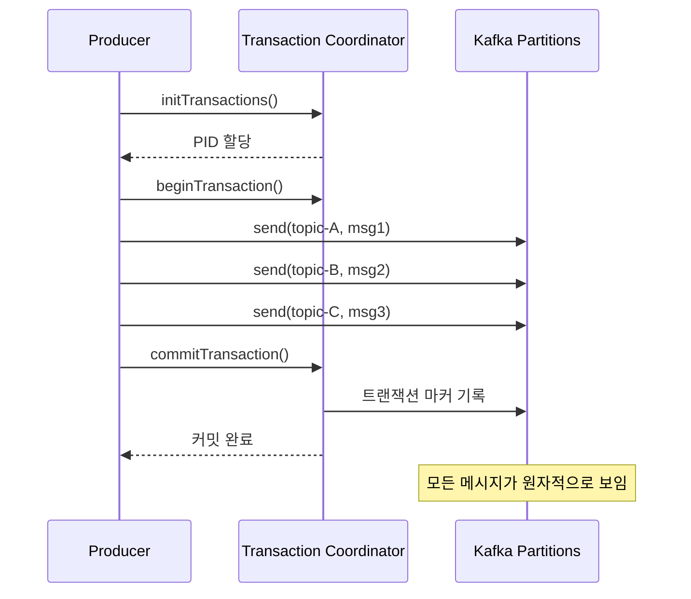


- At-Most-Once: 유실 가능/중복 없음, At-Least-Once: 유실 없음/중복 가능
- Exactly-Once: Idempotent Producer + Transactional API + read_committed 필요
- Idempotent Producer는 Kafka 3.0+에서 기본 활성화, 단일 Partition 중복 방지
- Kafka 트랜잭션은 여러 Partition에 원자적 쓰기 보장
- DB + Kafka 원자적 처리가 필요하면 Outbox 패턴 사용


**대상 독자**: 메시지 전달 보장이 중요한 시스템을 개발하는 개발자

**선수 지식**: [심화 개념](advanced-concepts/)의 acks, Idempotent Producer 개념

**소요 시간**: 약 25-30분

---

메시지 전달 보장 수준과 Kafka 트랜잭션을 이해합니다. 이 문서는 Kafka 3.6.x 기준으로 작성되었으며, Spring Boot 3.2.x와 Spring Kafka 3.1.x, Java 17 환경에서 코드 예제가 검증되었습니다.

#### 왜 메시지 보장 수준이 중요한가?

분산 시스템에서는 네트워크 장애, 프로세스 충돌, 타이밍 이슈 때문에 메시지 전달이 단순하지 않습니다.

실제로 발생하는 문제들이 있습니다. 첫째, 결제 이벤트 유실입니다. 주문 서비스에서 Kafka를 거쳐 결제 서비스로 전달되는 과정에서 네트워크 순간 끊김으로 메시지가 유실되면 "결제가 안 됐는데 주문은 됐다고?"라는 상황이 발생합니다. 둘째, 포인트 중복 적립입니다. 주문 완료 이벤트가 포인트 서비스로 전달될 때 ACK 유실로 재전송이 발생하면 "1000원 적립인데 왜 2000원이 들어왔지?"라는 상황이 됩니다. 셋째, 재고 불일치입니다. 주문 이벤트가 재고 서비스로 전달될 때 중복 처리로 재고가 2배 차감되면 "재고가 -10개?"라는 불가능한 상태가 발생합니다.

각 보장 수준의 실제 의미로, At-Most-Once는 놓쳐도 괜찮다는 의미로 로그 수집이나 클릭 분석에 사용합니다. At-Least-Once는 놓치면 안 되지만 중복은 처리 가능하다는 의미로 대부분의 이벤트에 사용합니다. Exactly-Once는 놓침도 중복도 치명적이라는 의미로 금융 거래, 포인트, 재고에 사용합니다.

#### 전체 비유: 은행 송금

메시지 전달 보장 수준을 <strong>은행 송금</strong>에 비유하면 이해하기 쉽습니다:

| 은행 송금 비유 | Kafka 보장 수준 | 특징 |
|---------------|----------------|------|
| 현금을 던져서 전달 (확인 안함) | At-Most-Once | 전달 확인 없음, 유실 가능 |
| 송금 완료까지 재시도 | At-Least-Once | 반드시 도착, 중복 송금 가능 |
| 정확히 한 번만 송금 (은행 보증) | Exactly-Once | 유실도 중복도 없음 |

트랜잭션은 <strong>여러 계좌에 동시 송금</strong>하는 것과 같습니다. A계좌에서 출금하고 B, C 계좌에 입금할 때, 모두 성공하거나 모두 취소되어야 합니다.

#### 메시지 전달 보장 수준



*다이어그램: 메시지 전달 보장 수준 - At-Most-Once(유실 가능) → At-Least-Once(중복 가능) → Exactly-Once(정확히 1번) 순으로 안전성 증가.*

At-Most-Once는 유실 가능하지만 중복은 없고, 최고 성능과 낮은 구현 복잡도를 가집니다. At-Least-Once는 유실 없지만 중복 가능하고, 높은 성능과 중간 복잡도를 가집니다. Exactly-Once는 유실도 중복도 없고, 중간 성능과 높은 복잡도를 가집니다.


- At-Most-Once: 유실 가능/중복 없음 (로그, 메트릭)
- At-Least-Once: 유실 없음/중복 가능 (대부분의 이벤트)
- Exactly-Once: 유실도 중복도 없음 (금융, 포인트, 재고)


#### At-Most-Once

메시지를 최대 한 번 전달합니다. 유실될 수 있습니다. ACK 유실 시 재전송하지 않으므로 메시지가 도달하지 않을 수 있습니다. Consumer에서는 처리 전에 커밋하므로 처리 중 장애 시 재처리되지 않습니다.

```yaml
spring:
  kafka:
    producer:
      acks: 0  # 응답 대기 안함
      retries: 0  # 재시도 안함
```

사용 사례는 로그, 메트릭 등 유실해도 괜찮은 데이터입니다.

#### At-Least-Once

메시지를 최소 한 번 전달합니다. 중복될 수 있습니다. ACK 유실 시 재전송하므로 같은 메시지가 두 번 저장될 수 있습니다.

```yaml
spring:
  kafka:
    producer:
      acks: all
      retries: 3  # 재시도 활성화
    consumer:
      enable-auto-commit: false  # 수동 커밋
```

사용 사례는 일반적인 이벤트 처리입니다. 애플리케이션에서 멱등성 처리가 필요합니다.

#### Exactly-Once Semantics (EOS)

메시지를 정확히 한 번 전달합니다. 유실도 중복도 없습니다. EOS를 달성하려면 Idempotent Producer, Transactional API, read_committed 격리 수준이 모두 필요합니다.

Idempotent Producer는 Producer에서 Broker로의 중복을 방지합니다. Transactional API는 여러 메시지를 원자적으로 처리합니다. read_committed는 커밋된 메시지만 읽습니다.

#### Idempotent Producer 복습

[심화 개념](advanced-concepts/#idempotent-producer-멱등성-프로듀서)에서 다뤘지만, EOS의 기반이므로 다시 정리합니다.

```java
// Producer 설정
enable.idempotence = true  // Kafka 3.0+ 기본값

// 자동으로 설정됨
acks = all
retries = Integer.MAX_VALUE
max.in.flight.requests.per.connection = 5  // 기본값, 5 이하에서 순서 보장
```

범위는 단일 Producer에서 단일 Partition의 중복 방지입니다.

#### Kafka Transactions

여러 Partition에 걸친 원자적 쓰기를 보장합니다. 모든 메시지가 성공하거나 모두 실패합니다.



*다이어그램: Kafka 트랜잭션 흐름 - initTransactions() → beginTransaction() → 여러 Partition에 send() → commitTransaction() 또는 abortTransaction().*

트랜잭션 중 오류가 발생하면 abortTransaction()을 호출하여 모든 메시지를 무효화합니다.


- Kafka 트랜잭션: 여러 Partition에 원자적 쓰기 보장
- 모든 메시지가 성공하거나 모두 실패 (All or Nothing)
- Transaction Coordinator가 트랜잭션 상태 관리


#### Spring Kafka 트랜잭션

**설정**

```yaml
spring:
  kafka:
    producer:
      transaction-id-prefix: tx-order-  # 트랜잭션 활성화
      acks: all
      properties:
        enable.idempotence: true
```

**구현 방법 1: @Transactional**

```java
@Service
public class OrderService {

    private final KafkaTemplate<String, OrderEvent> kafkaTemplate;

    @Transactional  // Kafka 트랜잭션
    public void processOrder(Order order) {
        // 여러 메시지가 원자적으로 전송됨
        kafkaTemplate.send("order-events", order.getId(),
            new OrderEvent(order, "CREATED"));

        kafkaTemplate.send("inventory-events", order.getId(),
            new InventoryEvent(order.getItems(), "RESERVE"));

        kafkaTemplate.send("notification-events", order.getId(),
            new NotificationEvent(order.getCustomerId(), "ORDER_RECEIVED"));

        // 하나라도 실패하면 모두 롤백
    }
}
```

**구현 방법 2: executeInTransaction**

```java
@Service
public class OrderService {

    private final KafkaTemplate<String, OrderEvent> kafkaTemplate;

    public void processOrder(Order order) {
        kafkaTemplate.executeInTransaction(operations -> {
            operations.send("order-events", order.getId(),
                new OrderEvent(order, "CREATED"));

            operations.send("inventory-events", order.getId(),
                new InventoryEvent(order.getItems(), "RESERVE"));

            // 예외 발생 시 자동 롤백
            if (order.getTotalAmount().compareTo(BigDecimal.ZERO) <= 0) {
                throw new IllegalStateException("Invalid order amount");
            }

            return true;
        });
    }
}
```

#### Consumer의 Exactly-Once

**read_committed 격리 수준**

```yaml
spring:
  kafka:
    consumer:
      isolation-level: read_committed  # 기본값: read_uncommitted
```

read_uncommitted는 모든 메시지를 읽습니다(커밋되지 않은 것 포함). read_committed는 커밋된 메시지만 읽습니다. 커밋되지 않은 메시지가 있으면 그 메시지를 건너뛰고 대기합니다.

**Consume-Transform-Produce 패턴**

입력을 읽어 변환 후 출력하는 패턴에서 EOS를 적용합니다.

```java
@Component
public class OrderProcessor {

    @KafkaListener(
        topics = "raw-orders",
        groupId = "order-processor"
    )
    @Transactional
    public void process(
            ConsumerRecord<String, RawOrder> record,
            @Header(KafkaHeaders.RECEIVED_PARTITION) int partition,
            Acknowledgment ack) {

        // 1. 메시지 처리
        ProcessedOrder processed = transform(record.value());

        // 2. 결과 전송 (트랜잭션 내)
        kafkaTemplate.send("processed-orders",
            record.key(), processed);

        // 3. 커밋 (트랜잭션 내)
        ack.acknowledge();

        // 모두 원자적으로 커밋됨
    }
}
```

#### 트랜잭션 vs 멱등성

Idempotent Producer는 단일 Partition에서 중복을 방지하고 자동 활성화(Kafka 3.0+)되며 추가 설정이 불필요합니다. 원자성은 보장하지 않고 Consumer 격리도 제공하지 않습니다. 성능 영향은 거의 없습니다.

Transactional API는 여러 Partition에서 원자적 쓰기를 보장하고 transaction-id-prefix 설정이 필요합니다. read_committed로 Consumer 격리를 제공합니다. 약간의 성능 오버헤드가 있습니다.


- Idempotent Producer: 단일 Partition 중복 방지, Kafka 3.0+ 기본 활성화
- Transactional API: 여러 Partition 원자적 쓰기, transaction-id-prefix 필요
- read_committed: 커밋된 메시지만 읽어 트랜잭션 격리 제공


#### 사용 가이드

메시지 유실이 허용되면 At-Most-Once(acks=0)를 사용합니다. 유실은 안 되지만 중복이 허용되면 At-Least-Once와 멱등성 처리를 사용합니다. 중복도 허용되지 않고 여러 Topic/Partition에 원자적 쓰기가 필요하면 Transactions를 사용합니다. 단일 Partition 중복 방지만 필요하면 Idempotent Producer(기본값)로 충분합니다.

```yaml
# 대부분의 경우 권장 (At-Least-Once + 멱등성)
spring:
  kafka:
    producer:
      acks: all
      properties:
        enable.idempotence: true  # Kafka 3.0+ 기본값

# 원자적 멀티 파티션 쓰기가 필요한 경우
spring:
  kafka:
    producer:
      transaction-id-prefix: tx-${spring.application.name}-
      acks: all
    consumer:
      isolation-level: read_committed
```

#### 주의사항

**트랜잭션 타임아웃**

```yaml
spring:
  kafka:
    producer:
      properties:
        transaction.timeout.ms: 60000  # 기본 60초
```

트랜잭션이 타임아웃되면 자동으로 중단됩니다.

**성능 고려**

트랜잭션은 추가 오버헤드가 있습니다. 트랜잭션 코디네이터와의 통신, 트랜잭션 마커 기록, Consumer의 필터링 처리가 필요합니다. acks=all 대비 약 20-30% 처리량 감소가 예상됩니다.

#### 분산 트랜잭션 방식 비교

Kafka 트랜잭션은 유일한 선택지가 아닙니다. 2PC(Two-Phase Commit)는 여러 DB에 걸친 강한 일관성을 제공하지만 느리고 코디네이터에 의존합니다. Kafka Transactions는 Kafka 내부에서 강한 일관성을 제공하고 자동 복구되지만 Kafka 외부는 다루지 못합니다. Saga는 여러 서비스에 걸친 결과적 일관성을 제공하고 확장성이 높지만 보상 트랜잭션이 필요합니다.

**Kafka 트랜잭션의 한계**

Kafka 트랜잭션으로 할 수 있는 것은 여러 Kafka Topic에 원자적 쓰기, Consume-Transform-Produce 원자성, Kafka 내부에서의 Exactly-Once입니다. 할 수 없는 것은 DB + Kafka 원자적 처리, 외부 API + Kafka 원자적 처리, 서비스 간 분산 트랜잭션입니다.


- Kafka 트랜잭션 한계: Kafka 내부만 처리, 외부 시스템 연동 불가
- DB + Kafka 원자적 처리 필요 시: Outbox 패턴 사용
- Saga 패턴: 여러 서비스에 걸친 결과적 일관성 (보상 트랜잭션 필요)


**DB + Kafka를 함께 다뤄야 할 때**

DB와 Kafka를 원자적으로 처리하려면 Outbox 패턴을 사용합니다. DB 트랜잭션 내에서 데이터와 함께 Outbox 테이블에 이벤트를 저장하고, 별도 프로세스가 Outbox에서 Kafka로 전송합니다.

```java
// Outbox 패턴
@Transactional  // DB 트랜잭션만
public void process(OrderEvent event) {
    orderRepository.save(order);
    outboxRepository.save(new OutboxEvent("results", result));
    // DB 트랜잭션으로 원자성 보장
}
// 별도 프로세스가 Outbox에서 Kafka로 전송
```

#### 트랜잭션 디버깅 가이드

**ProducerFencedException**

동일한 transactional.id를 가진 다른 Producer가 시작된 경우입니다. 각 인스턴스마다 고유한 transactional.id를 사용해야 합니다.

```yaml
spring:
  kafka:
    producer:
      transaction-id-prefix: tx-${spring.application.name}-${random.uuid}-
```

**InvalidTxnStateException**

트랜잭션 상태 불일치(타임아웃, 비정상 종료 등)입니다. Producer를 재생성해야 합니다.

**디버깅 체크리스트**

transaction.id가 인스턴스마다 고유한지, Broker 버전이 트랜잭션을 지원하는지(0.11+), 모든 Consumer가 isolation.level=read_committed인지, 트랜잭션 타임아웃이 처리 시간보다 긴지, 네트워크 지연이 비정상적이지 않은지 확인합니다.

#### 실무 의사결정 가이드

**대부분의 경우 권장하는 방식: At-Least-Once + 비즈니스 멱등성**

```java
// Consumer에서 멱등성 처리
@KafkaListener(topics = "orders")
@Transactional
public void handleOrder(OrderEvent event) {
    // 1. 이미 처리했는지 확인
    if (processedEventRepository.existsById(event.getEventId())) {
        return;
    }

    // 2. 비즈니스 로직
    orderService.process(event);

    // 3. 처리 완료 기록 (같은 DB 트랜잭션)
    processedEventRepository.save(new ProcessedEvent(event.getEventId()));
}
```

**Kafka 트랜잭션이 꼭 필요한 경우**

다음 조건을 모두 만족할 때만 Kafka 트랜잭션을 사용합니다. 여러 Topic에 원자적으로 써야 하고(전부 성공 or 전부 실패), Kafka Streams 또는 Consume-Transform-Produce 패턴을 사용하며, 성능 오버헤드를 감수할 수 있는 경우입니다.

#### 정리

Idempotent Producer는 단일 Partition에서 중복을 방지하고 Kafka 3.0부터 기본 활성화입니다. Transactions는 여러 Partition에 원자적으로 쓰며 transaction-id-prefix가 필요합니다. read_committed는 커밋된 메시지만 읽어 트랜잭션 격리를 제공합니다.

#### 관련 문서

- [Aggregate의 트랜잭션 경계](../../ddd/concepts/aggregate/) - DDD 관점에서 트랜잭션 경계를 Aggregate 단위로 설계하는 방법

#### 다음 단계

- [Producer 튜닝](producer-tuning/) - 성능 최적화 설정
