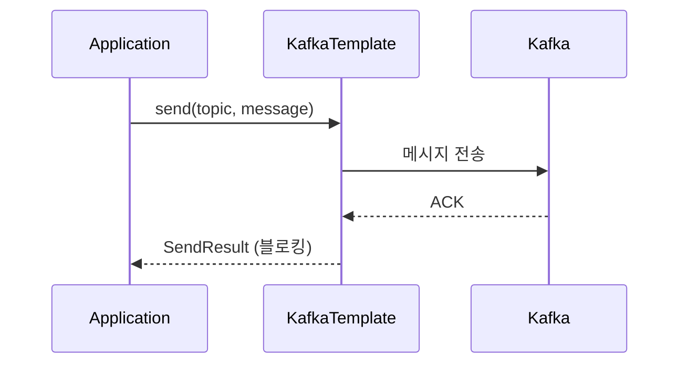
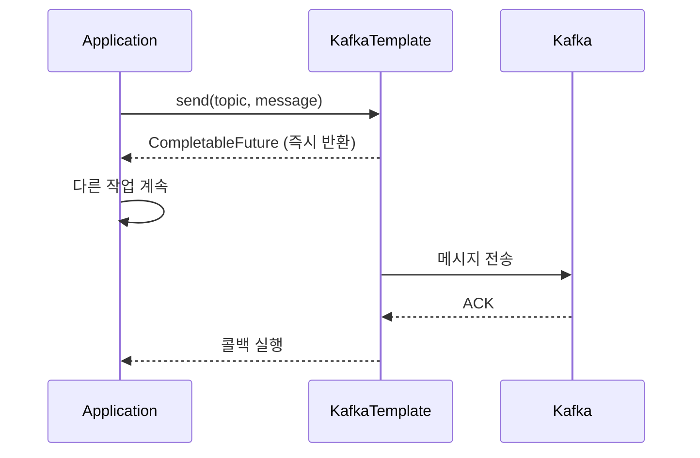
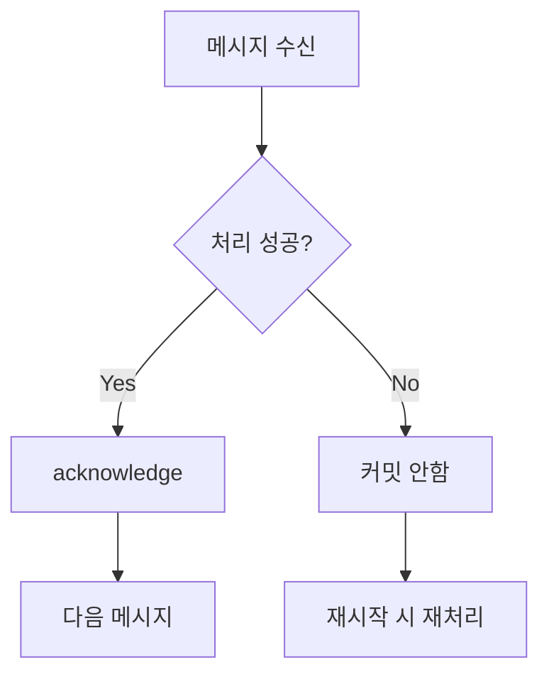
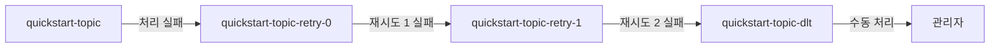

이 문서에서는 Spring Kafka를 사용하여 메시지를 송수신하는 방법을 단계별로 실습합니다.


- **Producer**: `KafkaTemplate`으로 동기/비동기 메시지 전송, Key 사용으로 Partition 지정
- **Consumer**: `@KafkaListener`로 메시지 수신, 배치 처리 및 패턴 구독 지원
- **수동 커밋**: `Acknowledgment`로 처리 완료 후 명시적 커밋
- **에러 처리**: `@RetryableTopic`으로 재시도 및 Dead Letter Topic 설정


## 시작하기 전에

| 항목 | 요구사항 |
|------|---------|
| **대상 독자** | Spring Boot 애플리케이션에서 Kafka를 사용하려는 백엔드 개발자 |
| **선수 지식** | Java 기본 문법, Spring Boot 기초, Kafka 기본 개념 |
| **사전 완료** | [Quick Start](../quick-start/) 예제 완료, [환경 구성](setup/) 설정 완료 |
| **예상 소요 시간** | 약 30분 |


**Windows 사용자**: 명령어에서 `./gradlew` 대신 `gradlew.bat`을 사용하세요.

**macOS/Linux 사용자**: Gradle Wrapper에 실행 권한이 없다면 `chmod +x gradlew` 명령을 먼저 실행하세요.


Quick Start를 먼저 완료하면 이 문서를 더 쉽게 이해할 수 있습니다. 이 문서에서는 Quick Start의 단순한 예제를 확장하여 실무에서 사용하는 패턴들을 학습합니다.

---

## 1단계: Producer 구현하기

Producer는 Kafka에 메시지를 전송하는 역할을 합니다. Spring Kafka에서는 `KafkaTemplate`을 사용하여 메시지를 발행합니다.

### 1.1 KafkaTemplate 주입

Spring Boot가 자동으로 `KafkaTemplate`을 생성하여 주입합니다. 별도의 Bean 설정 없이 의존성 주입을 받아 사용하세요.

```java
@Service
public class MessageProducer {

    private final KafkaTemplate<String, String> kafkaTemplate;

    public MessageProducer(KafkaTemplate<String, String> kafkaTemplate) {
        this.kafkaTemplate = kafkaTemplate;
    }
}
```

### 1.2 동기 전송

Quick Start에서는 `send()` 메서드의 결과를 확인하지 않았습니다. 실무에서는 전송 결과를 확인해야 할 때가 많습니다. `get()` 메서드를 호출하면 전송이 완료될 때까지 블로킹되어 결과를 확인할 수 있습니다.

```java
public void sendSync(String topic, String message) {
    try {
        SendResult<String, String> result = kafkaTemplate.send(topic, message).get();

        RecordMetadata metadata = result.getRecordMetadata();
        log.info("전송 완료 - Topic: {}, Partition: {}, Offset: {}",
                metadata.topic(),
                metadata.partition(),
                metadata.offset());
    } catch (Exception e) {
        log.error("전송 실패", e);
        throw new RuntimeException("메시지 전송 실패", e);
    }
}
```

**예상 출력:**
```
INFO  c.e.producer.MessageProducer : 전송 완료 - Topic: quickstart-topic, Partition: 0, Offset: 42
```



*[다이어그램 설명: Application이 KafkaTemplate의 send 메서드를 호출하면, KafkaTemplate이 Kafka에 메시지를 전송합니다. Kafka가 ACK를 반환하면 KafkaTemplate이 SendResult를 Application에 반환하며, 이 과정에서 Application은 블로킹됩니다.]*

### 1.3 비동기 전송

비동기 전송은 전송 요청 후 즉시 반환하고, 결과는 콜백으로 처리합니다. 이 방식은 처리량이 높지만 전송 실패 처리가 복잡해질 수 있습니다.

```java
public void sendAsync(String topic, String message) {
    CompletableFuture<SendResult<String, String>> future =
            kafkaTemplate.send(topic, message);

    future.whenComplete((result, ex) -> {
        if (ex == null) {
            log.info("전송 성공: {}", result.getRecordMetadata().offset());
        } else {
            log.error("전송 실패", ex);
        }
    });
}
```

**예상 출력:**
```
INFO  c.e.producer.MessageProducer : 전송 성공: 43
```



*[다이어그램 설명: Application이 KafkaTemplate의 send 메서드를 호출하면 즉시 CompletableFuture가 반환되어 Application은 다른 작업을 계속할 수 있습니다. 이후 KafkaTemplate이 Kafka에 메시지를 전송하고 ACK를 받으면 콜백이 실행됩니다.]*

### 1.4 Key와 함께 전송

Message Key를 사용하면 동일한 Key를 가진 메시지가 항상 같은 Partition으로 전송됩니다. 특정 데이터의 순서를 보장해야 할 때 이 방식을 사용하세요.

```java
public void sendWithKey(String topic, String key, String message) {
    kafkaTemplate.send(topic, key, message);
}
```

### 1.5 특정 Partition으로 전송

필요한 경우 특정 Partition을 직접 지정하여 전송할 수도 있습니다.

```java
public void sendToPartition(String topic, int partition, String key, String message) {
    kafkaTemplate.send(topic, partition, key, message);
}
```


- **동기 전송**: `get()` 메서드로 전송 완료까지 블로킹하여 결과 확인
- **비동기 전송**: `whenComplete()` 콜백으로 결과 처리, 높은 처리량 확보
- **Key 사용**: 동일한 Key는 동일한 Partition으로 전송되어 순서 보장
- **Partition 지정**: 필요시 특정 Partition에 직접 전송 가능


---

## 2단계: Consumer 구현하기

Consumer는 Kafka에서 메시지를 수신하여 처리합니다. Spring Kafka에서는 `@KafkaListener` 어노테이션을 사용합니다.

### 2.1 기본 @KafkaListener

Quick Start에서 사용한 가장 기본적인 형태입니다. `@KafkaListener` 어노테이션을 사용하면 지정한 Topic의 메시지를 자동으로 수신합니다.

```java
@Component
public class MessageConsumer {

    @KafkaListener(topics = "quickstart-topic", groupId = "quickstart-group")
    public void consume(String message) {
        log.info("메시지 수신: {}", message);
    }
}
```

**예상 출력:**
```
INFO  c.e.consumer.MessageConsumer : 메시지 수신: Hello Kafka!
```

### 2.2 ConsumerRecord로 수신

메시지 본문 외에 파티션, 오프셋, 키, 타임스탬프 등의 메타데이터도 필요할 때 `ConsumerRecord`를 사용하세요.

```java
@KafkaListener(topics = "quickstart-topic")
public void consume(ConsumerRecord<String, String> record) {
    log.info("Topic: {}", record.topic());
    log.info("Partition: {}", record.partition());
    log.info("Offset: {}", record.offset());
    log.info("Key: {}", record.key());
    log.info("Value: {}", record.value());
    log.info("Timestamp: {}", record.timestamp());
}
```

**예상 출력:**
```
INFO  c.e.consumer.MessageConsumer : Topic: quickstart-topic
INFO  c.e.consumer.MessageConsumer : Partition: 0
INFO  c.e.consumer.MessageConsumer : Offset: 42
INFO  c.e.consumer.MessageConsumer : Key: user-123
INFO  c.e.consumer.MessageConsumer : Value: Hello Kafka!
INFO  c.e.consumer.MessageConsumer : Timestamp: 1704873600000
```

### 2.3 여러 Topic 구독

하나의 Listener로 여러 Topic을 구독할 수 있습니다.

```java
@KafkaListener(topics = {"topic-a", "topic-b", "topic-c"})
public void consumeMultiple(String message) {
    log.info("메시지 수신: {}", message);
}
```

### 2.4 패턴으로 구독

정규식 패턴을 사용하면 특정 패턴에 맞는 모든 Topic을 구독할 수 있습니다. 예를 들어 `order-created`, `order-paid`, `order-shipped` 등을 한 번에 구독하세요.

```java
@KafkaListener(topicPattern = "order-.*")
public void consumePattern(String message) {
    log.info("주문 이벤트: {}", message);
}
```

### 2.5 배치 수신

`batch` 옵션을 `true`로 설정하면 여러 메시지를 한 번에 받아 처리할 수 있습니다. 대량 데이터 처리 시 이 방식을 사용하세요.

```java
@KafkaListener(topics = "quickstart-topic", batch = "true")
public void consumeBatch(List<String> messages) {
    log.info("배치 수신: {}건", messages.size());
    for (String message : messages) {
        process(message);
    }
}
```

**예상 출력:**
```
INFO  c.e.consumer.MessageConsumer : 배치 수신: 10건
```


- **기본 Listener**: `@KafkaListener`로 Topic 지정, 메시지 자동 수신
- **ConsumerRecord**: 메타데이터(Partition, Offset, Key, Timestamp) 함께 수신
- **다중 Topic 구독**: 배열로 여러 Topic 지정 또는 정규식 패턴 사용
- **배치 처리**: `batch = "true"` 설정으로 여러 메시지 한번에 처리


---

## 3단계: 수동 Offset 커밋 구현하기

Quick Start에서는 자동 커밋을 사용했습니다. 메시지 처리가 실패했을 때 재처리가 필요하다면 수동 커밋을 사용하세요. 수동 커밋은 메시지 처리가 성공한 후에만 Offset을 커밋하므로, 실패 시 해당 메시지를 다시 처리할 수 있습니다.

### 3.1 설정

`application.yml`에 다음 설정을 추가하세요:

```yaml
spring:
  kafka:
    consumer:
      enable-auto-commit: false
    listener:
      ack-mode: manual
```

### 3.2 구현

`Acknowledgment` 객체의 `acknowledge()` 메서드를 호출해야 Offset이 커밋됩니다. 처리 실패 시 커밋하지 않으면 다음 Consumer 시작 시 해당 메시지가 다시 전달됩니다.

```java
@KafkaListener(topics = "quickstart-topic")
public void consume(String message, Acknowledgment ack) {
    try {
        // 비즈니스 로직 처리
        processMessage(message);

        // 처리 성공 시 커밋
        ack.acknowledge();
    } catch (Exception e) {
        // 처리 실패 시 커밋하지 않음 -> 재처리됨
        log.error("처리 실패", e);
    }
}
```

**예상 출력 (성공 시):**
```
INFO  c.e.consumer.MessageConsumer : 메시지 처리 완료: Hello Kafka!
```

**예상 출력 (실패 시):**
```
ERROR c.e.consumer.MessageConsumer : 처리 실패
```



*[다이어그램 설명: 메시지 수신 후 처리가 성공하면 acknowledge를 호출하여 Offset을 커밋하고 다음 메시지를 처리합니다. 처리가 실패하면 커밋하지 않아 Consumer 재시작 시 해당 메시지를 다시 처리합니다.]*


- **설정**: `enable-auto-commit: false`, `ack-mode: manual`로 수동 커밋 활성화
- **커밋 시점**: 비즈니스 로직 성공 후 `ack.acknowledge()` 호출
- **재처리 보장**: 커밋 전 실패 시 다음 Consumer 시작 때 재처리됨


---

## 4단계: 에러 처리 구현하기

프로덕션 환경에서는 메시지 처리 실패에 대한 적절한 에러 처리가 필수입니다.

### 4.1 ErrorHandler 설정

`DefaultErrorHandler`를 Bean으로 등록하면 Consumer에서 예외 발생 시 자동으로 재시도합니다. `FixedBackOff`는 고정된 간격으로 지정된 횟수만큼 재시도합니다.

```java
@Configuration
public class KafkaConfig {

    @Bean
    public DefaultErrorHandler errorHandler() {
        return new DefaultErrorHandler(
            new FixedBackOff(1000L, 3L)  // 1초 간격, 3회 재시도
        );
    }
}
```

### 4.2 @RetryableTopic 사용

`@RetryableTopic` 어노테이션을 사용하면 선언적으로 재시도 정책을 정의할 수 있습니다. 재시도가 모두 실패하면 메시지가 Dead Letter Topic(DLT)으로 이동합니다.

```java
@RetryableTopic(
    attempts = "3",
    backoff = @Backoff(delay = 1000, multiplier = 2)
)
@KafkaListener(topics = "quickstart-topic")
public void consume(String message) {
    // 실패 시 자동 재시도
    // 3회 실패 시 quickstart-topic-dlt로 이동
    processMessage(message);
}
```

**예상 출력 (재시도 시):**
```
WARN  o.s.k.r.RetryTopicConfigurer : 재시도 1/3 - quickstart-topic-retry-0
WARN  o.s.k.r.RetryTopicConfigurer : 재시도 2/3 - quickstart-topic-retry-1
ERROR o.s.k.r.RetryTopicConfigurer : DLT로 이동 - quickstart-topic-dlt
```

### 4.3 Dead Letter Topic (DLT)

재시도 후에도 처리할 수 없는 메시지는 DLT로 이동합니다. DLT의 메시지는 별도로 모니터링하고 수동으로 처리하세요.



*[다이어그램 설명: 메시지 처리 실패 시 retry Topic으로 이동하여 재시도합니다. 재시도가 모두 실패하면 Dead Letter Topic(DLT)으로 이동하고, 관리자가 수동으로 처리합니다.]*


- **DefaultErrorHandler**: Bean 등록으로 자동 재시도, `FixedBackOff`로 재시도 간격/횟수 설정
- **@RetryableTopic**: 선언적 재시도 정책, 실패 시 자동으로 DLT로 이동
- **Dead Letter Topic**: 처리 불가능한 메시지 별도 보관, 모니터링 및 수동 처리 필요


---

## 5단계: 전체 예제 코드 실행하기

Quick Start 예제를 확장한 전체 버전을 실행해봅니다.

### 5.1 Producer (REST API 확장)

Quick Start에서는 단순 문자열만 전송했습니다. 실무에서는 Key와 함께 JSON 객체를 전송하는 경우가 많습니다.

```java
@RestController
@RequestMapping("/api/messages")
public class MessageController {

    private final KafkaTemplate<String, String> kafkaTemplate;

    public MessageController(KafkaTemplate<String, String> kafkaTemplate) {
        this.kafkaTemplate = kafkaTemplate;
    }

    // Quick Start와 동일한 단순 전송
    @PostMapping("/simple")
    public ResponseEntity<String> sendSimple(@RequestBody String message) {
        kafkaTemplate.send("quickstart-topic", message);
        return ResponseEntity.ok("메시지 전송 완료: " + message);
    }

    // 확장: Key와 Topic을 지정하여 전송
    @PostMapping("/advanced")
    public ResponseEntity<String> sendAdvanced(@RequestBody MessageRequest request) {
        kafkaTemplate.send(request.topic(), request.key(), request.message());
        return ResponseEntity.ok("메시지 전송 완료");
    }
}

record MessageRequest(String topic, String key, String message) {}
```

### 5.2 API 테스트

다음 명령으로 API를 테스트하세요:

```bash
# Quick Start와 동일한 방식
curl -X POST http://localhost:8080/api/messages/simple \
  -H "Content-Type: text/plain" \
  -d "Hello Kafka!"
```

**예상 출력:**
```
메시지 전송 완료: Hello Kafka!
```

```bash
# 확장된 방식 (Key와 Topic 지정)
curl -X POST http://localhost:8080/api/messages/advanced \
  -H "Content-Type: application/json" \
  -d '{"topic": "quickstart-topic", "key": "user-123", "message": "Hello!"}'
```

**예상 출력:**
```
메시지 전송 완료
```

### 5.3 Consumer (수동 커밋)

수동 커밋을 사용하는 Consumer 구현입니다. 처리 성공 시에만 `acknowledge()`를 호출합니다.

```java
@Component
@Slf4j
public class MessageConsumer {

    @KafkaListener(
        topics = "quickstart-topic",
        groupId = "quickstart-group"
    )
    public void consume(
            ConsumerRecord<String, String> record,
            Acknowledgment ack) {

        log.info("수신 - Partition: {}, Offset: {}, Key: {}, Value: {}",
                record.partition(),
                record.offset(),
                record.key(),
                record.value());

        try {
            processMessage(record.value());
            ack.acknowledge();
        } catch (Exception e) {
            log.error("처리 실패: {}", record.value(), e);
            // 재시도 로직 또는 DLT 전송
        }
    }

    private void processMessage(String message) {
        // 비즈니스 로직
    }
}
```

**예상 출력:**
```
INFO  c.e.consumer.MessageConsumer : 수신 - Partition: 0, Offset: 42, Key: user-123, Value: Hello!
```

---

## 6단계: 테스트 작성하기

### 6.1 임베디드 Kafka

`@EmbeddedKafka` 어노테이션을 사용하면 별도의 Kafka 설치 없이 통합 테스트를 실행할 수 있습니다.

```java
@SpringBootTest
@EmbeddedKafka(partitions = 1, topics = {"quickstart-topic"})
class KafkaIntegrationTest {

    @Autowired
    private KafkaTemplate<String, String> kafkaTemplate;

    @Test
    void testSendAndReceive() throws Exception {
        kafkaTemplate.send("quickstart-topic", "test-message").get();

        // Consumer 검증 로직
    }
}
```

테스트를 실행하세요:

```bash
./gradlew test
```


`./gradlew test` 대신 `gradlew.bat test`를 사용하세요.


**예상 출력:**
```
BUILD SUCCESSFUL in 15s
3 actionable tasks: 3 executed
```

---

## 축하합니다!

Spring Kafka를 사용하여 Producer/Consumer를 성공적으로 구현했습니다. 이 문서에서 학습한 내용을 정리하면:

| 항목 | Quick Start | 이 문서에서 학습한 내용 |
|------|-------------|----------------------|
| **전송 방식** | Fire-and-forget | 동기/비동기 전송 선택 |
| **커밋 방식** | 자동 커밋 | 수동 커밋 지원 |
| **에러 처리** | 없음 | 재시도 + DLT |
| **Key 사용** | 없음 | Key로 순서 보장 |

---

## 트러블슈팅

### ClassNotFoundException: KafkaTemplate

**증상**: 애플리케이션 시작 시 `ClassNotFoundException` 또는 `NoClassDefFoundError` 발생

**원인**: spring-kafka 의존성 누락

**해결 방법**:
```groovy
// build.gradle.kts
dependencies {
    implementation("org.springframework.kafka:spring-kafka")
}
```

### Connection Timeout

**증상**: `org.apache.kafka.common.errors.TimeoutException` 발생

**원인**: Kafka 브로커에 연결할 수 없음

**해결 방법**:
1. Kafka가 실행 중인지 확인하세요: `docker-compose ps`
2. `bootstrap-servers` 설정이 올바른지 확인하세요
3. 방화벽이 9092 포트를 차단하고 있지 않은지 확인하세요

```bash
# Kafka 상태 확인
docker-compose ps

# Kafka 재시작
docker-compose restart kafka
```

### Consumer가 메시지를 받지 못함

**증상**: Producer에서 메시지를 전송했지만 Consumer 로그가 출력되지 않음

**원인**: Consumer Group ID 불일치 또는 auto-offset-reset 설정 문제

**해결 방법**:
1. `groupId` 설정을 확인하세요
2. `auto-offset-reset: earliest`로 설정하여 처음부터 메시지를 읽도록 하세요

```yaml
spring:
  kafka:
    consumer:
      auto-offset-reset: earliest
```

### Serialization 오류

**증상**: `SerializationException` 발생

**원인**: Producer와 Consumer의 직렬화/역직렬화 설정 불일치

**해결 방법**:
```yaml
spring:
  kafka:
    producer:
      key-serializer: org.apache.kafka.common.serialization.StringSerializer
      value-serializer: org.apache.kafka.common.serialization.StringSerializer
    consumer:
      key-deserializer: org.apache.kafka.common.serialization.StringDeserializer
      value-deserializer: org.apache.kafka.common.serialization.StringDeserializer
```

---

## 다음 단계

- [주문 시스템](order-system/) - 도메인 주도 설계를 적용한 실전 예제
- [Consumer 고급 설정](../concepts/consumer-tuning/) - 성능 최적화 방법
- [에러 처리 패턴](../concepts/error-handling/) - 프로덕션 에러 처리 전략
